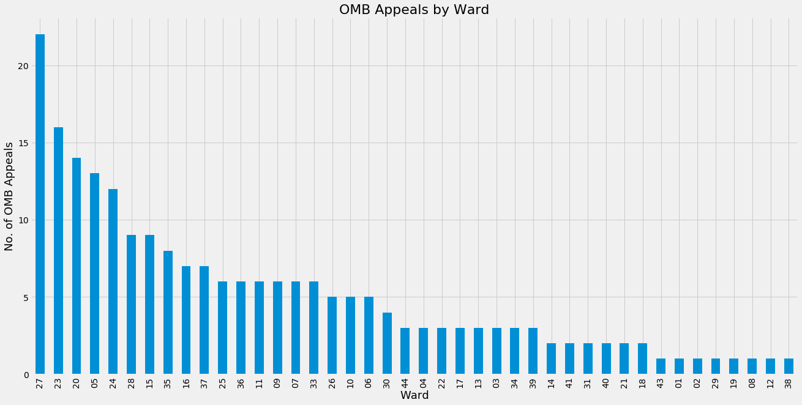

```python
import os
import pandas as pd
import matplotlib.pyplot as plt
import folium
%matplotlib notebook

source = 'DevApps2018-05-10_0045.csv'
files = pd.read_csv(source, dtype={'Ward':str})

# PREP
# remove all "Page Error!" applications

# 1. filter out OMB Appeals
# 2. Create histogram by Ward
# 3. Plot using folium on Leaflet

files.head()
```


<div>
<style>
    .dataframe thead tr:only-child th {
        text-align: right;
    }

    .dataframe thead th {
        text-align: left;
    }

    .dataframe tbody tr th {
        vertical-align: top;
    }
</style>
<table border="1" class="dataframe">
  <thead>
    <tr style="text-align: right;">
      <th></th>
      <th>Address</th>
      <th>First_Activity</th>
      <th>Last_Activity</th>
      <th>All_Addresses</th>
      <th>Ward</th>
      <th>Description</th>
      <th>Proposed_Use</th>
      <th>Storeys</th>
      <th>Units</th>
      <th>Planner</th>
      <th>Num_apps</th>
      <th>Apps</th>
      <th>Supporting_Docs</th>
      <th>Link</th>
    </tr>
  </thead>
  <tbody>
    <tr>
      <th>0</th>
      <td>1155 ALBION RD</td>
      <td>Sep 21, 2015</td>
      <td>Oct 16, 2017</td>
      <td>['1155 ALBION RD']</td>
      <td>01</td>
      <td>Proposed development of a 5-storey seniors apa...</td>
      <td>---</td>
      <td>NaN</td>
      <td>NaN</td>
      <td>Sabrina Salatino, Senior Planner, (416) 394-80...</td>
      <td>2.0</td>
      <td>[['Site Plan Approval', '15 225712 WET 01 SA',...</td>
      <td>['Planning Rationale: Sep 22, 2015: Download :...</td>
      <td>http://app.toronto.ca/DevelopmentApplications/...</td>
    </tr>
    <tr>
      <th>1</th>
      <td>1790 ALBION RD</td>
      <td>Nov 27, 2013</td>
      <td>Jan 25, 2018</td>
      <td>['1790 ALBION RD']</td>
      <td>01</td>
      <td>To change the existing units in the industrial...</td>
      <td>---</td>
      <td>NaN</td>
      <td>NaN</td>
      <td>Derek Brunelle, Assistant Planner, (416) 394-8...</td>
      <td>2.0</td>
      <td>[['Condominium Approval', '14 150932 WET 01 CD...</td>
      <td>['Application Form - Condo Application: May 14...</td>
      <td>http://app.toronto.ca/DevelopmentApplications/...</td>
    </tr>
    <tr>
      <th>2</th>
      <td>1810 ALBION RD</td>
      <td>Dec 22, 2016</td>
      <td>Apr 06, 2017</td>
      <td>['1810 ALBION RD']</td>
      <td>01</td>
      <td>To construct 4 storey mausoleum.</td>
      <td>---</td>
      <td>4.0</td>
      <td>0.0</td>
      <td>Ellen Standret, Planner, 416-394-8223, Ellen.S...</td>
      <td>1.0</td>
      <td>[['Site Plan Approval', '16 270143 WET 01 SA',...</td>
      <td>['Toronto Green Standards Checklist: Dec 22, 2...</td>
      <td>http://app.toronto.ca/DevelopmentApplications/...</td>
    </tr>
    <tr>
      <th>3</th>
      <td>2045 CODLIN CRES</td>
      <td>Dec 22, 2017</td>
      <td>Dec 22, 2017</td>
      <td>['2045 CODLIN CRES']</td>
      <td>01</td>
      <td>The proposal is for a 4-storey hotel (140 room...</td>
      <td>---</td>
      <td>0.0</td>
      <td>0.0</td>
      <td>Sabrina Salatino, Senior Planner, (416) 394-80...</td>
      <td>1.0</td>
      <td>[['Site Plan Approval', '17 278590 WET 01 SA',...</td>
      <td>['Urban Design Guidelines: Dec 22, 2017: Downl...</td>
      <td>http://app.toronto.ca/DevelopmentApplications/...</td>
    </tr>
    <tr>
      <th>4</th>
      <td>2115 CODLIN CRES</td>
      <td>Aug 18, 2015</td>
      <td>Oct 24, 2017</td>
      <td>['2115 CODLIN CRES']</td>
      <td>01</td>
      <td>The application proposes to construct a one-st...</td>
      <td>---</td>
      <td>0.0</td>
      <td>0.0</td>
      <td>Sabrina Salatino, Senior Planner, (416) 394-80...</td>
      <td>1.0</td>
      <td>[['Site Plan Approval', '15 208767 WET 01 SA',...</td>
      <td>['Toronto Green Standards Checklist: Aug 18, 2...</td>
      <td>http://app.toronto.ca/DevelopmentApplications/...</td>
    </tr>
  </tbody>
</table>
</div>


Clean out files that have NaN (e.g. Page Error! files that have no url)


```python
cleaned_files = files[files["Description"].isnull()==False]
len(cleaned_files)
```


    1582


## 1. Filter OMB Appeals


```python
appeal_keywords = 'ontario municipal board|appeal|local planning appeal tribunal'
appeal_keywords2 = 'OMB|LPAT|TLAB'
appealed_description = cleaned_files["Description"].str.contains(appeal_keywords, case=False)
appealed_description2 = cleaned_files["Description"].str.contains(appeal_keywords2, case=True)
appealed_apps = cleaned_files["Apps"].str.contains('OMB Appeal')

appealed_files = cleaned_files[appealed_description | appealed_description2 | appealed_apps]
print("There are",len(appealed_files["Address"]),"development projects total appealed to the OMB, as scraped from the Development Applications website. Of these,",
      len(set(appealed_files["Address"])), "have unique identifying addresses.")
```

    There are 216 development projects total appealed to the OMB, as scraped from the Development Applications website. Of these, 202 have unique identifying addresses.
    

## 2. CREATE HISTOGRAM BY WARD


```python
%matplotlib inline
from matplotlib import style
style.use("fivethirtyeight")

fig = plt.figure(figsize=(20,10))
plt.xlabel("Ward", fontsize='18')
plt.ylabel("No. of OMB Appeals", fontsize='18')

plt.title("OMB Appeals by Ward", fontsize=22)

appealed_files["Ward"].value_counts().plot(kind='bar')
plt.show()
```





These are the top ten wards with OMB appeals.


```python
appealed_files["Ward"].value_counts()[:10]
```


    27    22
    23    16
    20    14
    05    13
    24    12
    15     9
    28     9
    35     8
    37     7
    16     7
    Name: Ward, dtype: int64


## 3. Plot using Folium on Leaflet

Use folium and googlemaps to create a function that geocodes a list of addresses.


```python
import folium
import googlemaps
GoogleKey = open('GoogleAPI_Key.txt','r').read()
gmaps = googlemaps.Client(key = GoogleKey)

def geocode_to_dict(addresses):
    '''Input addresses must be list.'''
    dictionary = {}
    for j in [i+', Toronto, Canada' for i in set(addresses)]:
        coded = gmaps.geocode(j)
        latlon = (coded[0]['geometry']['location']['lat'],coded[0]['geometry']['location']['lng'])
        dictionary[j.replace(", Toronto, Canada","")] = latlon #.strip() causes deletion of certain letters...
    return dictionary

dictionary = geocode_to_dict(appealed_files['Address'])
```

Map.


```python
map = folium.Map()
Toronto = [43.706804, -79.398322] #Yonge/Eglinton
map = folium.Map(location= Toronto, tiles = 'Stamen Terrain', zoom_start = 11)

def add_markers():
    for index, row in appealed_files.iterrows():
        latlon_key = row['Address']
        latlon = dictionary[latlon_key]
        
        label = row['Address']+' (First Active: '+row['Last_Activity']+')'+'\n'+row['Description']
        formatted_label = str(label).replace("'","")
            
        folium.CircleMarker(location=latlon,
                           popup=formatted_label,
                            color='red',
                            fill_color='red',
                            fill_opacity=0.4,
                            radius=5).add_to(map)

# map.choropleth(geo_data="Wards.geojson",
#                fill_opacity=0.1, 
#                line_opacity=0.6,
#               highlight=True) 
add_markers()
map
```


<div style="width:100%;"><div style="position:relative;width:100%;height:0;padding-bottom:60%;"><iframe src="data:text/html;charset=utf-8;base64,PCFET0NUWVBFIGh0bWw+CjxoZWFkPiAgICAKICAgIDxtZXRhIGh0dHAtZXF1aXY9ImNvbnRlbnQtdHlwZSIgY29udGVudD0idGV4dC9odG1sOyBjaGFyc2V0PVVURi04IiAvPgogICAgPHNjcmlwdD5MX1BSRUZFUl9DQU5WQVMgPSBmYWxzZTsgTF9OT19UT1VDSCA9IGZhbHNlOyBMX0RJU0FCTEVfM0QgPSBmYWxzZTs8L3NjcmlwdD4KICAgIDxzY3JpcHQgc3JjPSJodHRwczovL2Nkbi5qc2RlbGl2ci5uZXQvbnBtL2xlYWZsZXRAMS4yLjAvZGlzdC9sZWFmbGV0LmpzIj48L3NjcmlwdD4KICAgIDxzY3JpcHQgc3JjPSJodHRwczovL2FqYXguZ29vZ2xlYXBpcy5jb20vYWpheC9saWJzL2pxdWVyeS8xLjExLjEvanF1ZXJ5Lm1pbi5qcyI+PC9zY3JpcHQ+CiAgICA8c2NyaXB0IHNyYz0iaHR0cHM6Ly9tYXhjZG4uYm9vdHN0cmFwY2RuLmNvbS9ib290c3RyYXAvMy4yLjAvanMvYm9vdHN0cmFwLm1pbi5qcyI+PC9zY3JpcHQ+CiAgICA8c2NyaXB0IHNyYz0iaHR0cHM6Ly9jZG5qcy5jbG91ZGZsYXJlLmNvbS9hamF4L2xpYnMvTGVhZmxldC5hd2Vzb21lLW1hcmtlcnMvMi4wLjIvbGVhZmxldC5hd2Vzb21lLW1hcmtlcnMuanMiPjwvc2NyaXB0PgogICAgPGxpbmsgcmVsPSJzdHlsZXNoZWV0IiBocmVmPSJodHRwczovL2Nkbi5qc2RlbGl2ci5uZXQvbnBtL2xlYWZsZXRAMS4yLjAvZGlzdC9sZWFmbGV0LmNzcyIgLz4KICAgIDxsaW5rIHJlbD0ic3R5bGVzaGVldCIgaHJlZj0iaHR0cHM6Ly9tYXhjZG4uYm9vdHN0cmFwY2RuLmNvbS9ib290c3RyYXAvMy4yLjAvY3NzL2Jvb3RzdHJhcC5taW4uY3NzIiAvPgogICAgPGxpbmsgcmVsPSJzdHlsZXNoZWV0IiBocmVmPSJodHRwczovL21heGNkbi5ib290c3RyYXBjZG4uY29tL2Jvb3RzdHJhcC8zLjIuMC9jc3MvYm9vdHN0cmFwLXRoZW1lLm1pbi5jc3MiIC8+CiAgICA8bGluayByZWw9InN0eWxlc2hlZXQiIGhyZWY9Imh0dHBzOi8vbWF4Y2RuLmJvb3RzdHJhcGNkbi5jb20vZm9udC1hd2Vzb21lLzQuNi4zL2Nzcy9mb250LWF3ZXNvbWUubWluLmNzcyIgLz4KICAgIDxsaW5rIHJlbD0ic3R5bGVzaGVldCIgaHJlZj0iaHR0cHM6Ly9jZG5qcy5jbG91ZGZsYXJlLmNvbS9hamF4L2xpYnMvTGVhZmxldC5hd2Vzb21lLW1hcmtlcnMvMi4wLjIvbGVhZmxldC5hd2Vzb21lLW1hcmtlcnMuY3NzIiAvPgogICAgPGxpbmsgcmVsPSJzdHlsZXNoZWV0IiBocmVmPSJodHRwczovL3Jhd2dpdC5jb20vcHl0aG9uLXZpc3VhbGl6YXRpb24vZm9saXVtL21hc3Rlci9mb2xpdW0vdGVtcGxhdGVzL2xlYWZsZXQuYXdlc29tZS5yb3RhdGUuY3NzIiAvPgogICAgPHN0eWxlPmh0bWwsIGJvZHkge3dpZHRoOiAxMDAlO2hlaWdodDogMTAwJTttYXJnaW46IDA7cGFkZGluZzogMDt9PC9zdHlsZT4KICAgIDxzdHlsZT4jbWFwIHtwb3NpdGlvbjphYnNvbHV0ZTt0b3A6MDtib3R0b206MDtyaWdodDowO2xlZnQ6MDt9PC9zdHlsZT4KICAgIAogICAgICAgICAgICA8c3R5bGU+ICNtYXBfMDZmNWRmOGYxMWFkNGJiYWEzOWI5YWU2Y2Q2Mzk4NmMgewogICAgICAgICAgICAgICAgcG9zaXRpb24gOiByZWxhdGl2ZTsKICAgICAgICAgICAgICAgIHdpZHRoIDogMTAwLjAlOwogICAgICAgICAgICAgICAgaGVpZ2h0OiAxMDAuMCU7CiAgICAgICAgICAgICAgICBsZWZ0OiAwLjAlOwogICAgICAgICAgICAgICAgdG9wOiAwLjAlOwogICAgICAgICAgICAgICAgfQogICAgICAgICAgICA8L3N0eWxlPgogICAgICAgIAo8L2hlYWQ+Cjxib2R5PiAgICAKICAgIAogICAgICAgICAgICA8ZGl2IGNsYXNzPSJmb2xpdW0tbWFwIiBpZD0ibWFwXzA2ZjVkZjhmMTFhZDRiYmFhMzliOWFlNmNkNjM5ODZjIiA+PC9kaXY+CiAgICAgICAgCjwvYm9keT4KPHNjcmlwdD4gICAgCiAgICAKCiAgICAgICAgICAgIAogICAgICAgICAgICAgICAgdmFyIGJvdW5kcyA9IG51bGw7CiAgICAgICAgICAgIAoKICAgICAgICAgICAgdmFyIG1hcF8wNmY1ZGY4ZjExYWQ0YmJhYTM5YjlhZTZjZDYzOTg2YyA9IEwubWFwKAogICAgICAgICAgICAgICAgICAgICAgICAgICAgICAgICAgJ21hcF8wNmY1ZGY4ZjExYWQ0YmJhYTM5YjlhZTZjZDYzOTg2YycsCiAgICAgICAgICAgICAgICAgICAgICAgICAgICAgICAgICB7Y2VudGVyOiBbNDMuNzA2ODA0LC03OS4zOTgzMjJdLAogICAgICAgICAgICAgICAgICAgICAgICAgICAgICAgICAgem9vbTogMTEsCiAgICAgICAgICAgICAgICAgICAgICAgICAgICAgICAgICBtYXhCb3VuZHM6IGJvdW5kcywKICAgICAgICAgICAgICAgICAgICAgICAgICAgICAgICAgIGxheWVyczogW10sCiAgICAgICAgICAgICAgICAgICAgICAgICAgICAgICAgICB3b3JsZENvcHlKdW1wOiBmYWxzZSwKICAgICAgICAgICAgICAgICAgICAgICAgICAgICAgICAgIGNyczogTC5DUlMuRVBTRzM4NTcKICAgICAgICAgICAgICAgICAgICAgICAgICAgICAgICAgfSk7CiAgICAgICAgICAgIAogICAgICAgIAogICAgCiAgICAgICAgICAgIHZhciB0aWxlX2xheWVyXzRkMzgwODYwMmU4MTQ5YzQ4ZWQ3YjVkZTg5YTA0ZDlmID0gTC50aWxlTGF5ZXIoCiAgICAgICAgICAgICAgICAnaHR0cHM6Ly9zdGFtZW4tdGlsZXMte3N9LmEuc3NsLmZhc3RseS5uZXQvdGVycmFpbi97en0ve3h9L3t5fS5qcGcnLAogICAgICAgICAgICAgICAgewogICJhdHRyaWJ1dGlvbiI6IG51bGwsCiAgImRldGVjdFJldGluYSI6IGZhbHNlLAogICJtYXhOYXRpdmVab29tIjogMTgsCiAgIm1heFpvb20iOiAxOCwKICAibWluWm9vbSI6IDAsCiAgIm5vV3JhcCI6IGZhbHNlLAogICJzdWJkb21haW5zIjogImFiYyIKfQogICAgICAgICAgICAgICAgKS5hZGRUbyhtYXBfMDZmNWRmOGYxMWFkNGJiYWEzOWI5YWU2Y2Q2Mzk4NmMpOwogICAgICAgIAogICAgCiAgICAgICAgICAgIHZhciBjaXJjbGVfbWFya2VyX2FjOGU4NjgyOGZkYzQ1Mzk5NGI3ZmU0ZjQzMzFkYmM0ID0gTC5jaXJjbGVNYXJrZXIoCiAgICAgICAgICAgICAgICBbNDMuNzM5MDEyNCwgLTc5LjU2NjUxMl0sCiAgICAgICAgICAgICAgICB7CiAgImJ1YmJsaW5nTW91c2VFdmVudHMiOiB0cnVlLAogICJjb2xvciI6ICJyZWQiLAogICJkYXNoQXJyYXkiOiBudWxsLAogICJkYXNoT2Zmc2V0IjogbnVsbCwKICAiZmlsbCI6IHRydWUsCiAgImZpbGxDb2xvciI6ICJyZWQiLAogICJmaWxsT3BhY2l0eSI6IDAuNCwKICAiZmlsbFJ1bGUiOiAiZXZlbm9kZCIsCiAgImxpbmVDYXAiOiAicm91bmQiLAogICJsaW5lSm9pbiI6ICJyb3VuZCIsCiAgIm9wYWNpdHkiOiAxLjAsCiAgInJhZGl1cyI6IDUsCiAgInN0cm9rZSI6IHRydWUsCiAgIndlaWdodCI6IDMKfQogICAgICAgICAgICAgICAgKQogICAgICAgICAgICAgICAgCiAgICAgICAgICAgICAgICAuYWRkVG8obWFwXzA2ZjVkZjhmMTFhZDRiYmFhMzliOWFlNmNkNjM5ODZjKTsKICAgICAgICAgICAgCiAgICAKICAgICAgICAgICAgdmFyIHBvcHVwX2MxODIxOTE2OWEzYTQ2N2NhNGFjYWYwZjU2MGJjZjQ4ID0gTC5wb3B1cCh7bWF4V2lkdGg6ICczMDAnfSk7CgogICAgICAgICAgICAKICAgICAgICAgICAgICAgIHZhciBodG1sXzE3YmU1ZWI4N2MyNTRlNTM5NTcxYTQ0NGRjZWIxMjg1ID0gJCgnPGRpdiBpZD0iaHRtbF8xN2JlNWViODdjMjU0ZTUzOTU3MWE0NDRkY2ViMTI4NSIgc3R5bGU9IndpZHRoOiAxMDAuMCU7IGhlaWdodDogMTAwLjAlOyI+MjY3MCBJU0xJTkdUT04gQVZFIChGaXJzdCBBY3RpdmU6IEphbiAxOCwgMjAxMykgVG8gY29udmVydCBhbiBleGlzdGluZyAyIHN0b3JleSBzaW5nbGUgZGV0YWNoZWQgZHdlbGxpbmcgdG8gYSBwcm9mZXNzaW9uYWwgb2ZmaWNlIHVzZS48L2Rpdj4nKVswXTsKICAgICAgICAgICAgICAgIHBvcHVwX2MxODIxOTE2OWEzYTQ2N2NhNGFjYWYwZjU2MGJjZjQ4LnNldENvbnRlbnQoaHRtbF8xN2JlNWViODdjMjU0ZTUzOTU3MWE0NDRkY2ViMTI4NSk7CiAgICAgICAgICAgIAoKICAgICAgICAgICAgY2lyY2xlX21hcmtlcl9hYzhlODY4MjhmZGM0NTM5OTRiN2ZlNGY0MzMxZGJjNC5iaW5kUG9wdXAocG9wdXBfYzE4MjE5MTY5YTNhNDY3Y2E0YWNhZjBmNTYwYmNmNDgpOwoKICAgICAgICAgICAgCiAgICAgICAgCiAgICAKICAgICAgICAgICAgdmFyIGNpcmNsZV9tYXJrZXJfYTBhOTJhMzQwODZlNDE2ZmI0N2MxZjkzOTYyOTNjMDQgPSBMLmNpcmNsZU1hcmtlcigKICAgICAgICAgICAgICAgIFs0My43ODg3NTQ3LCAtNzkuNDQ3NTE4Ml0sCiAgICAgICAgICAgICAgICB7CiAgImJ1YmJsaW5nTW91c2VFdmVudHMiOiB0cnVlLAogICJjb2xvciI6ICJyZWQiLAogICJkYXNoQXJyYXkiOiBudWxsLAogICJkYXNoT2Zmc2V0IjogbnVsbCwKICAiZmlsbCI6IHRydWUsCiAgImZpbGxDb2xvciI6ICJyZWQiLAogICJmaWxsT3BhY2l0eSI6IDAuNCwKICAiZmlsbFJ1bGUiOiAiZXZlbm9kZCIsCiAgImxpbmVDYXAiOiAicm91bmQiLAogICJsaW5lSm9pbiI6ICJyb3VuZCIsCiAgIm9wYWNpdHkiOiAxLjAsCiAgInJhZGl1cyI6IDUsCiAgInN0cm9rZSI6IHRydWUsCiAgIndlaWdodCI6IDMKfQogICAgICAgICAgICAgICAgKQogICAgICAgICAgICAgICAgCiAgICAgICAgICAgICAgICAuYWRkVG8obWFwXzA2ZjVkZjhmMTFhZDRiYmFhMzliOWFlNmNkNjM5ODZjKTsKICAgICAgICAgICAgCiAgICAKICAgICAgICAgICAgdmFyIHBvcHVwXzUxMTYxNGI2NTFkNDQ0YjFhOTk2MjViMmIxZTU1MzIzID0gTC5wb3B1cCh7bWF4V2lkdGg6ICczMDAnfSk7CgogICAgICAgICAgICAKICAgICAgICAgICAgICAgIHZhciBodG1sX2ZiOWY0NGM4ZTc5OTQ2OTc4YmUxMTI5NGJkZWU4ODZkID0gJCgnPGRpdiBpZD0iaHRtbF9mYjlmNDRjOGU3OTk0Njk3OGJlMTEyOTRiZGVlODg2ZCIgc3R5bGU9IndpZHRoOiAxMDAuMCU7IGhlaWdodDogMTAwLjAlOyI+NjA0MCBCQVRIVVJTVCBTVCAoRmlyc3QgQWN0aXZlOiBKYW4gMTksIDIwMTcpIFByb3Bvc2FsIHRvIGFkZCB0d28gYnVpZGxpbmdzICgxOSBhbmQgMjkgc3RvcmV5cykgdG8gZXhpc3RpbmcgYXBhcnRtZW50IG5laWdob2J1cmhvb2Qgc2l0ZSBhdCA2MDQwIEJhdGh1cnN0LyA1IEZpc2hlcnZpbGxlLjwvZGl2PicpWzBdOwogICAgICAgICAgICAgICAgcG9wdXBfNTExNjE0YjY1MWQ0NDRiMWE5OTYyNWIyYjFlNTUzMjMuc2V0Q29udGVudChodG1sX2ZiOWY0NGM4ZTc5OTQ2OTc4YmUxMTI5NGJkZWU4ODZkKTsKICAgICAgICAgICAgCgogICAgICAgICAgICBjaXJjbGVfbWFya2VyX2EwYTkyYTM0MDg2ZTQxNmZiNDdjMWY5Mzk2MjkzYzA0LmJpbmRQb3B1cChwb3B1cF81MTE2MTRiNjUxZDQ0NGIxYTk5NjI1YjJiMWU1NTMyMyk7CgogICAgICAgICAgICAKICAgICAgICAKICAgIAogICAgICAgICAgICB2YXIgY2lyY2xlX21hcmtlcl9mNjliYjlkZTFmMmY0M2E5OTU2OWVhZDY1MDJmMTBkZCA9IEwuY2lyY2xlTWFya2VyKAogICAgICAgICAgICAgICAgWzQzLjc0NjYyMjU5OTk5OTk5LCAtNzkuNDc5MTM5Njk5OTk5OTldLAogICAgICAgICAgICAgICAgewogICJidWJibGluZ01vdXNlRXZlbnRzIjogdHJ1ZSwKICAiY29sb3IiOiAicmVkIiwKICAiZGFzaEFycmF5IjogbnVsbCwKICAiZGFzaE9mZnNldCI6IG51bGwsCiAgImZpbGwiOiB0cnVlLAogICJmaWxsQ29sb3IiOiAicmVkIiwKICAiZmlsbE9wYWNpdHkiOiAwLjQsCiAgImZpbGxSdWxlIjogImV2ZW5vZGQiLAogICJsaW5lQ2FwIjogInJvdW5kIiwKICAibGluZUpvaW4iOiAicm91bmQiLAogICJvcGFjaXR5IjogMS4wLAogICJyYWRpdXMiOiA1LAogICJzdHJva2UiOiB0cnVlLAogICJ3ZWlnaHQiOiAzCn0KICAgICAgICAgICAgICAgICkKICAgICAgICAgICAgICAgIAogICAgICAgICAgICAgICAgLmFkZFRvKG1hcF8wNmY1ZGY4ZjExYWQ0YmJhYTM5YjlhZTZjZDYzOTg2Yyk7CiAgICAgICAgICAgIAogICAgCiAgICAgICAgICAgIHZhciBwb3B1cF80ZDRlMTJiNTlkZmY0YTQyOTBjNWE4ZGI2YjdlYTBkNiA9IEwucG9wdXAoe21heFdpZHRoOiAnMzAwJ30pOwoKICAgICAgICAgICAgCiAgICAgICAgICAgICAgICB2YXIgaHRtbF8wMDYzMmRhZDk1MzM0NjBmOTQ1YWJiYjBlMjk5MTZlZiA9ICQoJzxkaXYgaWQ9Imh0bWxfMDA2MzJkYWQ5NTMzNDYwZjk0NWFiYmIwZTI5OTE2ZWYiIHN0eWxlPSJ3aWR0aDogMTAwLjAlOyBoZWlnaHQ6IDEwMC4wJTsiPjM1IENBUkwgSEFMTCBSRCAoRmlyc3QgQWN0aXZlOiBBcHIgMjAsIDIwMTgpIFRvIG1vZGlmeSB0aGUgcmVkZXZlbG9wbWVudCBwbGFuIHdpdGggcmVzcGVjdCB0byB0aGUgdG93bmhvdXNlIGFuZCBzdGFja2VkIHRvd25ob3VzZSBkZXZlbG9wbWVudCBhcHByb3ZlZCB1bmRlciBzaXRlIHNwZWNpZmljIEJ5LWxhdyA4NTUtMjAxNyBhbmQgYWNjb21wYW55aW5nIE9NQiBCb2FyZCBPcmRlci48L2Rpdj4nKVswXTsKICAgICAgICAgICAgICAgIHBvcHVwXzRkNGUxMmI1OWRmZjRhNDI5MGM1YThkYjZiN2VhMGQ2LnNldENvbnRlbnQoaHRtbF8wMDYzMmRhZDk1MzM0NjBmOTQ1YWJiYjBlMjk5MTZlZik7CiAgICAgICAgICAgIAoKICAgICAgICAgICAgY2lyY2xlX21hcmtlcl9mNjliYjlkZTFmMmY0M2E5OTU2OWVhZDY1MDJmMTBkZC5iaW5kUG9wdXAocG9wdXBfNGQ0ZTEyYjU5ZGZmNGE0MjkwYzVhOGRiNmI3ZWEwZDYpOwoKICAgICAgICAgICAgCiAgICAgICAgCiAgICAKICAgICAgICAgICAgdmFyIGNpcmNsZV9tYXJrZXJfMGE2MTJiOThmOTYzNDkyMDhlMzM5NTYwYWQ0OTg2N2UgPSBMLmNpcmNsZU1hcmtlcigKICAgICAgICAgICAgICAgIFs0My43NTI4NzQ4OTk5OTk5OSwgLTc5LjQ0ODQ2NTldLAogICAgICAgICAgICAgICAgewogICJidWJibGluZ01vdXNlRXZlbnRzIjogdHJ1ZSwKICAiY29sb3IiOiAicmVkIiwKICAiZGFzaEFycmF5IjogbnVsbCwKICAiZGFzaE9mZnNldCI6IG51bGwsCiAgImZpbGwiOiB0cnVlLAogICJmaWxsQ29sb3IiOiAicmVkIiwKICAiZmlsbE9wYWNpdHkiOiAwLjQsCiAgImZpbGxSdWxlIjogImV2ZW5vZGQiLAogICJsaW5lQ2FwIjogInJvdW5kIiwKICAibGluZUpvaW4iOiAicm91bmQiLAogICJvcGFjaXR5IjogMS4wLAogICJyYWRpdXMiOiA1LAogICJzdHJva2UiOiB0cnVlLAogICJ3ZWlnaHQiOiAzCn0KICAgICAgICAgICAgICAgICkKICAgICAgICAgICAgICAgIAogICAgICAgICAgICAgICAgLmFkZFRvKG1hcF8wNmY1ZGY4ZjExYWQ0YmJhYTM5YjlhZTZjZDYzOTg2Yyk7CiAgICAgICAgICAgIAogICAgCiAgICAgICAgICAgIHZhciBwb3B1cF85YzM4NGUyMTliNDQ0N2NkYjllMTg1YWM4MTdjYTYyYiA9IEwucG9wdXAoe21heFdpZHRoOiAnMzAwJ30pOwoKICAgICAgICAgICAgCiAgICAgICAgICAgICAgICB2YXIgaHRtbF8xYWYzMzFlZjgwOGI0OWEzYjI4ZTU2MGFkMDc5ODljNSA9ICQoJzxkaXYgaWQ9Imh0bWxfMWFmMzMxZWY4MDhiNDlhM2IyOGU1NjBhZDA3OTg5YzUiIHN0eWxlPSJ3aWR0aDogMTAwLjAlOyBoZWlnaHQ6IDEwMC4wJTsiPjEyOCBHT1JNQU4gUEFSSyBSRCAoRmlyc3QgQWN0aXZlOiBBdWcgMTcsIDIwMTYpIEEgOS1zdG9yZXkgcmVzaWRlbnRpYWwgYnVpbGRpbmcgY29udGFpbmluZyA4NSByZXNpZGVudGlhbCBkd2VsbGluZyB1bml0cyBhbmQgODQgcGFya2luZyBzcGFjZXMuPC9kaXY+JylbMF07CiAgICAgICAgICAgICAgICBwb3B1cF85YzM4NGUyMTliNDQ0N2NkYjllMTg1YWM4MTdjYTYyYi5zZXRDb250ZW50KGh0bWxfMWFmMzMxZWY4MDhiNDlhM2IyOGU1NjBhZDA3OTg5YzUpOwogICAgICAgICAgICAKCiAgICAgICAgICAgIGNpcmNsZV9tYXJrZXJfMGE2MTJiOThmOTYzNDkyMDhlMzM5NTYwYWQ0OTg2N2UuYmluZFBvcHVwKHBvcHVwXzljMzg0ZTIxOWI0NDQ3Y2RiOWUxODVhYzgxN2NhNjJiKTsKCiAgICAgICAgICAgIAogICAgICAgIAogICAgCiAgICAgICAgICAgIHZhciBjaXJjbGVfbWFya2VyXzBlZTNiZTI2MTUyOTQ0ZjliMzJhMmE5YmFjZTIzNmQzID0gTC5jaXJjbGVNYXJrZXIoCiAgICAgICAgICAgICAgICBbNDMuNzUxODMwOCwgLTc5LjQ1NDU4ODhdLAogICAgICAgICAgICAgICAgewogICJidWJibGluZ01vdXNlRXZlbnRzIjogdHJ1ZSwKICAiY29sb3IiOiAicmVkIiwKICAiZGFzaEFycmF5IjogbnVsbCwKICAiZGFzaE9mZnNldCI6IG51bGwsCiAgImZpbGwiOiB0cnVlLAogICJmaWxsQ29sb3IiOiAicmVkIiwKICAiZmlsbE9wYWNpdHkiOiAwLjQsCiAgImZpbGxSdWxlIjogImV2ZW5vZGQiLAogICJsaW5lQ2FwIjogInJvdW5kIiwKICAibGluZUpvaW4iOiAicm91bmQiLAogICJvcGFjaXR5IjogMS4wLAogICJyYWRpdXMiOiA1LAogICJzdHJva2UiOiB0cnVlLAogICJ3ZWlnaHQiOiAzCn0KICAgICAgICAgICAgICAgICkKICAgICAgICAgICAgICAgIAogICAgICAgICAgICAgICAgLmFkZFRvKG1hcF8wNmY1ZGY4ZjExYWQ0YmJhYTM5YjlhZTZjZDYzOTg2Yyk7CiAgICAgICAgICAgIAogICAgCiAgICAgICAgICAgIHZhciBwb3B1cF8xN2MyYWIxMTVlODQ0N2JlYTY5MTNlMGJjZDczOTE4OCA9IEwucG9wdXAoe21heFdpZHRoOiAnMzAwJ30pOwoKICAgICAgICAgICAgCiAgICAgICAgICAgICAgICB2YXIgaHRtbF8xN2I0M2MwMmFiMWQ0ZGYyYTkzOGQ0M2ViMjQyOWE4OSA9ICQoJzxkaXYgaWQ9Imh0bWxfMTdiNDNjMDJhYjFkNGRmMmE5MzhkNDNlYjI0MjlhODkiIHN0eWxlPSJ3aWR0aDogMTAwLjAlOyBoZWlnaHQ6IDEwMC4wJTsiPjg3MS04NzMgU0hFUFBBUkQgQVZFIFcgKEZpcnN0IEFjdGl2ZTogRmViIDIwLCAyMDE4KSBTaXRlIFBsYW4gYXBwbGljYXRpb24gdG8gcHJvcG9zZSAxNTAgNCB0byA1LXN0b3JleSBzdGFja2VkLCBiYWNrLXRvLWJhY2sgdG93bmhvdXNlcyBhcnJhbmdlZCBpbiA3IGJsb2NrcyBwZXJwZW5kaWN1bGFyIHRvIFNoZXBwYXJkIEF2ZW51ZSBXZXN0LiBUaGUgdHdvIHdlc3Rlcmx5IGJsb2NrcyBhcmUgY29ubmVjdGVkIGJ5IDggMy1zdG9yZXkgdG93bmhvdXNlcy4gVGhlIGZpdmUgZWFzdGVybHkgYmxvY2tzIGFyZSBjb25uZWN0ZWQgYnkgMjQgMy1zdG9yZXkgdG93bmhvdXNlcy4gQSB0b3RhbCBvZiAxNzIgcmVzaWRlbnRpYWwgZHdlbGxpbmcgdW5pdHMgYXJlIHByb3Bvc2VkIHdpdGggMTkxIHVuZGVyZ3JvdW5kIHBhcmtpbmcgc3BhY2VzIGFuZCAzIHN1cmZhY2UgcGFya2luZyBzcGFjZXMuIFRoZSBwcm9wb3NlZCBncm9zcyBmbG9vciBhcmVhIG9mIDE4LDQ0OSBzcXVhcmUgbWV0cmVzIHJlc3VsdHMgaW4gYW4gRlNJIG9mIDEuOTggdGltZXMgdGhlIGFyZWEgb2YgdGhlIGxvdC48L2Rpdj4nKVswXTsKICAgICAgICAgICAgICAgIHBvcHVwXzE3YzJhYjExNWU4NDQ3YmVhNjkxM2UwYmNkNzM5MTg4LnNldENvbnRlbnQoaHRtbF8xN2I0M2MwMmFiMWQ0ZGYyYTkzOGQ0M2ViMjQyOWE4OSk7CiAgICAgICAgICAgIAoKICAgICAgICAgICAgY2lyY2xlX21hcmtlcl8wZWUzYmUyNjE1Mjk0NGY5YjMyYTJhOWJhY2UyMzZkMy5iaW5kUG9wdXAocG9wdXBfMTdjMmFiMTE1ZTg0NDdiZWE2OTEzZTBiY2Q3MzkxODgpOwoKICAgICAgICAgICAgCiAgICAgICAgCiAgICAKICAgICAgICAgICAgdmFyIGNpcmNsZV9tYXJrZXJfMjE2NmM0YTA3MmI5NGVmNzhiMzcxZWU2NGYxNDU2MWIgPSBMLmNpcmNsZU1hcmtlcigKICAgICAgICAgICAgICAgIFs0My43MzI0MTY4LCAtNzkuNDQ3MDA2N10sCiAgICAgICAgICAgICAgICB7CiAgImJ1YmJsaW5nTW91c2VFdmVudHMiOiB0cnVlLAogICJjb2xvciI6ICJyZWQiLAogICJkYXNoQXJyYXkiOiBudWxsLAogICJkYXNoT2Zmc2V0IjogbnVsbCwKICAiZmlsbCI6IHRydWUsCiAgImZpbGxDb2xvciI6ICJyZWQiLAogICJmaWxsT3BhY2l0eSI6IDAuNCwKICAiZmlsbFJ1bGUiOiAiZXZlbm9kZCIsCiAgImxpbmVDYXAiOiAicm91bmQiLAogICJsaW5lSm9pbiI6ICJyb3VuZCIsCiAgIm9wYWNpdHkiOiAxLjAsCiAgInJhZGl1cyI6IDUsCiAgInN0cm9rZSI6IHRydWUsCiAgIndlaWdodCI6IDMKfQogICAgICAgICAgICAgICAgKQogICAgICAgICAgICAgICAgCiAgICAgICAgICAgICAgICAuYWRkVG8obWFwXzA2ZjVkZjhmMTFhZDRiYmFhMzliOWFlNmNkNjM5ODZjKTsKICAgICAgICAgICAgCiAgICAKICAgICAgICAgICAgdmFyIHBvcHVwX2RmYzQ5ZGRiYmNiNDRlY2M5MTg4OGI5MzNlOTA1YTRhID0gTC5wb3B1cCh7bWF4V2lkdGg6ICczMDAnfSk7CgogICAgICAgICAgICAKICAgICAgICAgICAgICAgIHZhciBodG1sXzVmNzFkOWE4MTQyZTQwZjFhZDEyZDVjNGZiNjQ5M2M4ID0gJCgnPGRpdiBpZD0iaHRtbF81ZjcxZDlhODE0MmU0MGYxYWQxMmQ1YzRmYjY0OTNjOCIgc3R5bGU9IndpZHRoOiAxMDAuMCU7IGhlaWdodDogMTAwLjAlOyI+NCBUSVBQRVRUIFJEIChGaXJzdCBBY3RpdmU6IE1heSAwMiwgMjAxOCkgU2l0ZSBwbGFuIGFwcGxpY2F0aW9uIGZvciBQaGFzZSAxIHRvIHBlcm1pdCBhIDE2IHN0b3JleSByZXNpZGVudGlhbCBidWlsZGluZyB3aXRoIGEgdG90YWwgZ3Jvc3MgZmxvb3IgYXJlYSBvZiAxOCwwMTcgc3F1YXJlIG1ldHJlcyBhbmQgYSB0b3RhbCBvZiAyNjUgdW5pdHMgYWNjZXNzZWQgYnkgYSA2IG1ldHJlIHdpZGUgcHJpdmF0ZSByb2FkIGF0IHRoZSBub3J0aGVybiBwb3J0aW9uIG9mIHRoZSBzaXRlLjwvZGl2PicpWzBdOwogICAgICAgICAgICAgICAgcG9wdXBfZGZjNDlkZGJiY2I0NGVjYzkxODg4YjkzM2U5MDVhNGEuc2V0Q29udGVudChodG1sXzVmNzFkOWE4MTQyZTQwZjFhZDEyZDVjNGZiNjQ5M2M4KTsKICAgICAgICAgICAgCgogICAgICAgICAgICBjaXJjbGVfbWFya2VyXzIxNjZjNGEwNzJiOTRlZjc4YjM3MWVlNjRmMTQ1NjFiLmJpbmRQb3B1cChwb3B1cF9kZmM0OWRkYmJjYjQ0ZWNjOTE4ODhiOTMzZTkwNWE0YSk7CgogICAgICAgICAgICAKICAgICAgICAKICAgIAogICAgICAgICAgICB2YXIgY2lyY2xlX21hcmtlcl83Njg0MjZlYWNkNTI0ZDQwYjVkZjllM2IzZDY4NmUxYyA9IEwuY2lyY2xlTWFya2VyKAogICAgICAgICAgICAgICAgWzQzLjc2NDQ0MjEsIC03OS40NTcxOTUzMDAwMDAwMV0sCiAgICAgICAgICAgICAgICB7CiAgImJ1YmJsaW5nTW91c2VFdmVudHMiOiB0cnVlLAogICJjb2xvciI6ICJyZWQiLAogICJkYXNoQXJyYXkiOiBudWxsLAogICJkYXNoT2Zmc2V0IjogbnVsbCwKICAiZmlsbCI6IHRydWUsCiAgImZpbGxDb2xvciI6ICJyZWQiLAogICJmaWxsT3BhY2l0eSI6IDAuNCwKICAiZmlsbFJ1bGUiOiAiZXZlbm9kZCIsCiAgImxpbmVDYXAiOiAicm91bmQiLAogICJsaW5lSm9pbiI6ICJyb3VuZCIsCiAgIm9wYWNpdHkiOiAxLjAsCiAgInJhZGl1cyI6IDUsCiAgInN0cm9rZSI6IHRydWUsCiAgIndlaWdodCI6IDMKfQogICAgICAgICAgICAgICAgKQogICAgICAgICAgICAgICAgCiAgICAgICAgICAgICAgICAuYWRkVG8obWFwXzA2ZjVkZjhmMTFhZDRiYmFhMzliOWFlNmNkNjM5ODZjKTsKICAgICAgICAgICAgCiAgICAKICAgICAgICAgICAgdmFyIHBvcHVwX2U1ZTIxZGZlM2M2YTQzY2M5NGFiMGE3MzZiNmViNjI0ID0gTC5wb3B1cCh7bWF4V2lkdGg6ICczMDAnfSk7CgogICAgICAgICAgICAKICAgICAgICAgICAgICAgIHZhciBodG1sX2NlNzNkYjY4MzkzYTQ3OGVhMTI4YmRjYzIzZmI1ODZjID0gJCgnPGRpdiBpZD0iaHRtbF9jZTczZGI2ODM5M2E0NzhlYTEyOGJkY2MyM2ZiNTg2YyIgc3R5bGU9IndpZHRoOiAxMDAuMCU7IGhlaWdodDogMTAwLjAlOyI+MjIxLTI0NSBXSUxNSU5HVE9OIEFWRSAoRmlyc3QgQWN0aXZlOiBEZWMgMjEsIDIwMTcpIFRoaXMgZm9sZGVyIGlzIG9ubHkgYWRtaW5pc3RyYXRpdmUgaW4gbmF0dXJlLCBpbiBvcmRlciB0byByZWNlaXZlIG5ldyBmZWVzIGZvciAwNiAxMTEwOTggTk5ZIDEwIE9aLCAwNiAxMTExMTEgTk5ZIFNBIGFuZCAxMSAxNDI0NTcgTk5ZIFNCLCBjdXJyZW50bHkgdW5kZXIgYXBwZWFsIGF0IHRoZSBPTUIuPC9kaXY+JylbMF07CiAgICAgICAgICAgICAgICBwb3B1cF9lNWUyMWRmZTNjNmE0M2NjOTRhYjBhNzM2YjZlYjYyNC5zZXRDb250ZW50KGh0bWxfY2U3M2RiNjgzOTNhNDc4ZWExMjhiZGNjMjNmYjU4NmMpOwogICAgICAgICAgICAKCiAgICAgICAgICAgIGNpcmNsZV9tYXJrZXJfNzY4NDI2ZWFjZDUyNGQ0MGI1ZGY5ZTNiM2Q2ODZlMWMuYmluZFBvcHVwKHBvcHVwX2U1ZTIxZGZlM2M2YTQzY2M5NGFiMGE3MzZiNmViNjI0KTsKCiAgICAgICAgICAgIAogICAgICAgIAogICAgCiAgICAgICAgICAgIHZhciBjaXJjbGVfbWFya2VyXzlkMWUzY2VjMWE4MjRjZWM4MGMwNDdkZDYzMDAwNTNlID0gTC5jaXJjbGVNYXJrZXIoCiAgICAgICAgICAgICAgICBbNDMuNjY4NzU5MywgLTc5LjQ3Mjk5ODY5OTk5OTk5XSwKICAgICAgICAgICAgICAgIHsKICAiYnViYmxpbmdNb3VzZUV2ZW50cyI6IHRydWUsCiAgImNvbG9yIjogInJlZCIsCiAgImRhc2hBcnJheSI6IG51bGwsCiAgImRhc2hPZmZzZXQiOiBudWxsLAogICJmaWxsIjogdHJ1ZSwKICAiZmlsbENvbG9yIjogInJlZCIsCiAgImZpbGxPcGFjaXR5IjogMC40LAogICJmaWxsUnVsZSI6ICJldmVub2RkIiwKICAibGluZUNhcCI6ICJyb3VuZCIsCiAgImxpbmVKb2luIjogInJvdW5kIiwKICAib3BhY2l0eSI6IDEuMCwKICAicmFkaXVzIjogNSwKICAic3Ryb2tlIjogdHJ1ZSwKICAid2VpZ2h0IjogMwp9CiAgICAgICAgICAgICAgICApCiAgICAgICAgICAgICAgICAKICAgICAgICAgICAgICAgIC5hZGRUbyhtYXBfMDZmNWRmOGYxMWFkNGJiYWEzOWI5YWU2Y2Q2Mzk4NmMpOwogICAgICAgICAgICAKICAgIAogICAgICAgICAgICB2YXIgcG9wdXBfOTFmOWExMDUxYjNjNDE0ZmEzMzY4YTY1OWVjNzY1YTIgPSBMLnBvcHVwKHttYXhXaWR0aDogJzMwMCd9KTsKCiAgICAgICAgICAgIAogICAgICAgICAgICAgICAgdmFyIGh0bWxfNDljZmIyMzcwMjUwNGE4OGIzZWZjNDRhNDA1ZDg5NTQgPSAkKCc8ZGl2IGlkPSJodG1sXzQ5Y2ZiMjM3MDI1MDRhODhiM2VmYzQ0YTQwNWQ4OTU0IiBzdHlsZT0id2lkdGg6IDEwMC4wJTsgaGVpZ2h0OiAxMDAuMCU7Ij44NyBFVEhFTCBBVkUgKEZpcnN0IEFjdGl2ZTogQXVnIDE5LCAyMDEzKSBQcm9wb3NhbCBmb3IgYW4gYXBwcm94aW1hdGVseSAyNiwwODMgc3F1YXJlIG1ldHJlIGxpZ2h0IGluZHVzdHJpYWwvb2ZmaWNlIGRldmVsb3BtZW50IGNvbnNpc3Rpbmcgb2YgZml2ZSB0d28tc3RvcmV5IGJ1aWxkaW5ncywgdHdvIGZvdXItc3RvcmV5IGJ1aWxkaW5ncyBhbmQgb25lIGZvdXItc3RvcmV5IHN0b3JhZ2UgYnVpbGRpbmcuIEFwcGxpY2FudCBoYXMgYXBwZWFsZWQgT1BBIDIzMTwvZGl2PicpWzBdOwogICAgICAgICAgICAgICAgcG9wdXBfOTFmOWExMDUxYjNjNDE0ZmEzMzY4YTY1OWVjNzY1YTIuc2V0Q29udGVudChodG1sXzQ5Y2ZiMjM3MDI1MDRhODhiM2VmYzQ0YTQwNWQ4OTU0KTsKICAgICAgICAgICAgCgogICAgICAgICAgICBjaXJjbGVfbWFya2VyXzlkMWUzY2VjMWE4MjRjZWM4MGMwNDdkZDYzMDAwNTNlLmJpbmRQb3B1cChwb3B1cF85MWY5YTEwNTFiM2M0MTRmYTMzNjhhNjU5ZWM3NjVhMik7CgogICAgICAgICAgICAKICAgICAgICAKICAgIAogICAgICAgICAgICB2YXIgY2lyY2xlX21hcmtlcl82Njg0NTQzN2U0ZWY0YmY2YjJiY2I3MGNiMzAxODhmNiA9IEwuY2lyY2xlTWFya2VyKAogICAgICAgICAgICAgICAgWzQzLjY2ODc1OTMsIC03OS40NzI5OTg2OTk5OTk5OV0sCiAgICAgICAgICAgICAgICB7CiAgImJ1YmJsaW5nTW91c2VFdmVudHMiOiB0cnVlLAogICJjb2xvciI6ICJyZWQiLAogICJkYXNoQXJyYXkiOiBudWxsLAogICJkYXNoT2Zmc2V0IjogbnVsbCwKICAiZmlsbCI6IHRydWUsCiAgImZpbGxDb2xvciI6ICJyZWQiLAogICJmaWxsT3BhY2l0eSI6IDAuNCwKICAiZmlsbFJ1bGUiOiAiZXZlbm9kZCIsCiAgImxpbmVDYXAiOiAicm91bmQiLAogICJsaW5lSm9pbiI6ICJyb3VuZCIsCiAgIm9wYWNpdHkiOiAxLjAsCiAgInJhZGl1cyI6IDUsCiAgInN0cm9rZSI6IHRydWUsCiAgIndlaWdodCI6IDMKfQogICAgICAgICAgICAgICAgKQogICAgICAgICAgICAgICAgCiAgICAgICAgICAgICAgICAuYWRkVG8obWFwXzA2ZjVkZjhmMTFhZDRiYmFhMzliOWFlNmNkNjM5ODZjKTsKICAgICAgICAgICAgCiAgICAKICAgICAgICAgICAgdmFyIHBvcHVwXzQ3NDgzMWJhZWI3ZDQxZTg4NzhmMTY2OTU5MDZkNzAxID0gTC5wb3B1cCh7bWF4V2lkdGg6ICczMDAnfSk7CgogICAgICAgICAgICAKICAgICAgICAgICAgICAgIHZhciBodG1sXzljMjA0NzJmNDBlYTRiZDNhMDIzMTdjMDEwN2E2ZjI1ID0gJCgnPGRpdiBpZD0iaHRtbF85YzIwNDcyZjQwZWE0YmQzYTAyMzE3YzAxMDdhNmYyNSIgc3R5bGU9IndpZHRoOiAxMDAuMCU7IGhlaWdodDogMTAwLjAlOyI+ODcgRVRIRUwgQVZFIChGaXJzdCBBY3RpdmU6IEF1ZyAxOSwgMjAxMykgUHJvcG9zYWwgZm9yIGFuIGFwcHJveGltYXRlbHkgMjYsMDgzIHNxdWFyZSBtZXRyZSBsaWdodCBpbmR1c3RyaWFsL29mZmljZSBkZXZlbG9wbWVudCBjb25zaXN0aW5nIG9mIGZpdmUgdHdvLXN0b3JleSBidWlsZGluZ3MsIHR3byBmb3VyLXN0b3JleSBidWlsZGluZ3MgYW5kIG9uZSBmb3VyLXN0b3JleSBzdG9yYWdlIGJ1aWxkaW5nLiBBcHBsaWNhbnQgaGFzIGFwcGVhbGVkIE9QQSAyMzE8L2Rpdj4nKVswXTsKICAgICAgICAgICAgICAgIHBvcHVwXzQ3NDgzMWJhZWI3ZDQxZTg4NzhmMTY2OTU5MDZkNzAxLnNldENvbnRlbnQoaHRtbF85YzIwNDcyZjQwZWE0YmQzYTAyMzE3YzAxMDdhNmYyNSk7CiAgICAgICAgICAgIAoKICAgICAgICAgICAgY2lyY2xlX21hcmtlcl82Njg0NTQzN2U0ZWY0YmY2YjJiY2I3MGNiMzAxODhmNi5iaW5kUG9wdXAocG9wdXBfNDc0ODMxYmFlYjdkNDFlODg3OGYxNjY5NTkwNmQ3MDEpOwoKICAgICAgICAgICAgCiAgICAgICAgCiAgICAKICAgICAgICAgICAgdmFyIGNpcmNsZV9tYXJrZXJfMDU2ZmU0YTZkYjA0NDQ2NjgxNzIxOWYyMmU3NjgyZWYgPSBMLmNpcmNsZU1hcmtlcigKICAgICAgICAgICAgICAgIFs0My42NzE3OTM4LCAtNzkuNDY1NDYxNjk5OTk5OTldLAogICAgICAgICAgICAgICAgewogICJidWJibGluZ01vdXNlRXZlbnRzIjogdHJ1ZSwKICAiY29sb3IiOiAicmVkIiwKICAiZGFzaEFycmF5IjogbnVsbCwKICAiZGFzaE9mZnNldCI6IG51bGwsCiAgImZpbGwiOiB0cnVlLAogICJmaWxsQ29sb3IiOiAicmVkIiwKICAiZmlsbE9wYWNpdHkiOiAwLjQsCiAgImZpbGxSdWxlIjogImV2ZW5vZGQiLAogICJsaW5lQ2FwIjogInJvdW5kIiwKICAibGluZUpvaW4iOiAicm91bmQiLAogICJvcGFjaXR5IjogMS4wLAogICJyYWRpdXMiOiA1LAogICJzdHJva2UiOiB0cnVlLAogICJ3ZWlnaHQiOiAzCn0KICAgICAgICAgICAgICAgICkKICAgICAgICAgICAgICAgIAogICAgICAgICAgICAgICAgLmFkZFRvKG1hcF8wNmY1ZGY4ZjExYWQ0YmJhYTM5YjlhZTZjZDYzOTg2Yyk7CiAgICAgICAgICAgIAogICAgCiAgICAgICAgICAgIHZhciBwb3B1cF8zYmFhZTU5ODMzNmU0ZjkwOTU0OTAxNjE0YTVjMTcxOCA9IEwucG9wdXAoe21heFdpZHRoOiAnMzAwJ30pOwoKICAgICAgICAgICAgCiAgICAgICAgICAgICAgICB2YXIgaHRtbF82MTUxNTRmNWFjNmE0YTA0ODhjMDVmMjc0YjMxODM3ZSA9ICQoJzxkaXYgaWQ9Imh0bWxfNjE1MTU0ZjVhYzZhNGEwNDg4YzA1ZjI3NGIzMTgzN2UiIHN0eWxlPSJ3aWR0aDogMTAwLjAlOyBoZWlnaHQ6IDEwMC4wJTsiPjYgTExPWUQgQVZFIChGaXJzdCBBY3RpdmU6IEF1ZyAwMSwgMjAxNCkgUHJvcG9zZWQgYW1lbmRtZW50cyB0byB0aGUgQ2l0eXMgT2ZmaWNpYWwgUGxhbiB0byByZWRlc2lnbmF0ZSB0aGUgbm9ydGggdHdvLXRoaXJkcyBvZiB0aGUgbGFuZHMgZnJvbSBFbXBsb3ltZW50IEFyZWFzIHRvIE1peGVkIFVzZSBBcmVhcyBhbmQgZXN0YWJsaXNoIGEgbmV3IFNpdGUgYW5kIEFyZWEgc3BlY2lmaWMgcG9saWN5IE5vLiA0NDcgb3ZlciB0aGUgZW50aXJlIHNpdGUuPC9kaXY+JylbMF07CiAgICAgICAgICAgICAgICBwb3B1cF8zYmFhZTU5ODMzNmU0ZjkwOTU0OTAxNjE0YTVjMTcxOC5zZXRDb250ZW50KGh0bWxfNjE1MTU0ZjVhYzZhNGEwNDg4YzA1ZjI3NGIzMTgzN2UpOwogICAgICAgICAgICAKCiAgICAgICAgICAgIGNpcmNsZV9tYXJrZXJfMDU2ZmU0YTZkYjA0NDQ2NjgxNzIxOWYyMmU3NjgyZWYuYmluZFBvcHVwKHBvcHVwXzNiYWFlNTk4MzM2ZTRmOTA5NTQ5MDE2MTRhNWMxNzE4KTsKCiAgICAgICAgICAgIAogICAgICAgIAogICAgCiAgICAgICAgICAgIHZhciBjaXJjbGVfbWFya2VyXzZiN2ZlMTJiYThkMjQ4OTQ5YTQ1NWFkZDY3MGI4MjhkID0gTC5jaXJjbGVNYXJrZXIoCiAgICAgICAgICAgICAgICBbNDMuNjc2MjUwOSwgLTc5LjQ3NTAwMjY5OTk5OTk5XSwKICAgICAgICAgICAgICAgIHsKICAiYnViYmxpbmdNb3VzZUV2ZW50cyI6IHRydWUsCiAgImNvbG9yIjogInJlZCIsCiAgImRhc2hBcnJheSI6IG51bGwsCiAgImRhc2hPZmZzZXQiOiBudWxsLAogICJmaWxsIjogdHJ1ZSwKICAiZmlsbENvbG9yIjogInJlZCIsCiAgImZpbGxPcGFjaXR5IjogMC40LAogICJmaWxsUnVsZSI6ICJldmVub2RkIiwKICAibGluZUNhcCI6ICJyb3VuZCIsCiAgImxpbmVKb2luIjogInJvdW5kIiwKICAib3BhY2l0eSI6IDEuMCwKICAicmFkaXVzIjogNSwKICAic3Ryb2tlIjogdHJ1ZSwKICAid2VpZ2h0IjogMwp9CiAgICAgICAgICAgICAgICApCiAgICAgICAgICAgICAgICAKICAgICAgICAgICAgICAgIC5hZGRUbyhtYXBfMDZmNWRmOGYxMWFkNGJiYWEzOWI5YWU2Y2Q2Mzk4NmMpOwogICAgICAgICAgICAKICAgIAogICAgICAgICAgICB2YXIgcG9wdXBfZWMwNzMwNzYxYjllNDM3NmJmOTEwZTc4MmQ1OTQ4ODcgPSBMLnBvcHVwKHttYXhXaWR0aDogJzMwMCd9KTsKCiAgICAgICAgICAgIAogICAgICAgICAgICAgICAgdmFyIGh0bWxfYzQwYjM0NDcxODEwNDY1NDkyNzdhZjk1OGQ1OWI4MGUgPSAkKCc8ZGl2IGlkPSJodG1sX2M0MGIzNDQ3MTgxMDQ2NTQ5Mjc3YWY5NThkNTliODBlIiBzdHlsZT0id2lkdGg6IDEwMC4wJTsgaGVpZ2h0OiAxMDAuMCU7Ij42NSBNQyBDT1JNQUNLIFNUIChGaXJzdCBBY3RpdmU6IEp1bCAwOCwgMjAxMykgUHJvcG9zZWQgZGV2ZWxvcG1lbnQgb2YgMywgZnJlZS1zdGFuZGluZyBpbmR1c3RyaWFsIHdhcmVob3VzZSBidWlsZGluZ3MgSGFzIGFwcGVhbCBpbiBvbiBPUEEgMjMxPC9kaXY+JylbMF07CiAgICAgICAgICAgICAgICBwb3B1cF9lYzA3MzA3NjFiOWU0Mzc2YmY5MTBlNzgyZDU5NDg4Ny5zZXRDb250ZW50KGh0bWxfYzQwYjM0NDcxODEwNDY1NDkyNzdhZjk1OGQ1OWI4MGUpOwogICAgICAgICAgICAKCiAgICAgICAgICAgIGNpcmNsZV9tYXJrZXJfNmI3ZmUxMmJhOGQyNDg5NDlhNDU1YWRkNjcwYjgyOGQuYmluZFBvcHVwKHBvcHVwX2VjMDczMDc2MWI5ZTQzNzZiZjkxMGU3ODJkNTk0ODg3KTsKCiAgICAgICAgICAgIAogICAgICAgIAogICAgCiAgICAgICAgICAgIHZhciBjaXJjbGVfbWFya2VyXzhlNmIzOTg1NDFmODRiYzFiNzdkYTQ5NDcxZGY5NWUzID0gTC5jaXJjbGVNYXJrZXIoCiAgICAgICAgICAgICAgICBbNDMuNzA4Mjc3NCwgLTc5LjUzMTMzOTFdLAogICAgICAgICAgICAgICAgewogICJidWJibGluZ01vdXNlRXZlbnRzIjogdHJ1ZSwKICAiY29sb3IiOiAicmVkIiwKICAiZGFzaEFycmF5IjogbnVsbCwKICAiZGFzaE9mZnNldCI6IG51bGwsCiAgImZpbGwiOiB0cnVlLAogICJmaWxsQ29sb3IiOiAicmVkIiwKICAiZmlsbE9wYWNpdHkiOiAwLjQsCiAgImZpbGxSdWxlIjogImV2ZW5vZGQiLAogICJsaW5lQ2FwIjogInJvdW5kIiwKICAibGluZUpvaW4iOiAicm91bmQiLAogICJvcGFjaXR5IjogMS4wLAogICJyYWRpdXMiOiA1LAogICJzdHJva2UiOiB0cnVlLAogICJ3ZWlnaHQiOiAzCn0KICAgICAgICAgICAgICAgICkKICAgICAgICAgICAgICAgIAogICAgICAgICAgICAgICAgLmFkZFRvKG1hcF8wNmY1ZGY4ZjExYWQ0YmJhYTM5YjlhZTZjZDYzOTg2Yyk7CiAgICAgICAgICAgIAogICAgCiAgICAgICAgICAgIHZhciBwb3B1cF9kZGI0MDNjMzBlYmI0OWY4ODk4NjY2ZDk0NWNkNmQwYyA9IEwucG9wdXAoe21heFdpZHRoOiAnMzAwJ30pOwoKICAgICAgICAgICAgCiAgICAgICAgICAgICAgICB2YXIgaHRtbF8xYmI5MzYwMTIzMzA0NmU4YjQ5NTE5MjU5ZGRiZGYwYyA9ICQoJzxkaXYgaWQ9Imh0bWxfMWJiOTM2MDEyMzMwNDZlOGI0OTUxOTI1OWRkYmRmMGMiIHN0eWxlPSJ3aWR0aDogMTAwLjAlOyBoZWlnaHQ6IDEwMC4wJTsiPjggT0FLIFNUIChGaXJzdCBBY3RpdmU6IEF1ZyAyNiwgMjAxNikgUHJvcG9zYWwgY29uc2lzdHMgb2YgZm91cnRlZW4gMy1zdG9yZXkgdG93bmhvdXNlIHVuaXRzIGZyb250aW5nIE9hayBTdHJlZXQsIHR3byA4LXN0b3JleSBtaWQtcmlzZSBhcGFydG1lbnQgYnVpbGRpbmdzLCBhIDYtc3RvcmV5IHJldGlyZW1lbnQgcmVzaWRlbmNlIGFuZCBhIDAuMzMgaGVjdGFyZSAoMC44MyBhY3JlKSBwYXJrIGZyb250aW5nIEtub2IgSGlsbCBEcml2ZS48L2Rpdj4nKVswXTsKICAgICAgICAgICAgICAgIHBvcHVwX2RkYjQwM2MzMGViYjQ5Zjg4OTg2NjZkOTQ1Y2Q2ZDBjLnNldENvbnRlbnQoaHRtbF8xYmI5MzYwMTIzMzA0NmU4YjQ5NTE5MjU5ZGRiZGYwYyk7CiAgICAgICAgICAgIAoKICAgICAgICAgICAgY2lyY2xlX21hcmtlcl84ZTZiMzk4NTQxZjg0YmMxYjc3ZGE0OTQ3MWRmOTVlMy5iaW5kUG9wdXAocG9wdXBfZGRiNDAzYzMwZWJiNDlmODg5ODY2NmQ5NDVjZDZkMGMpOwoKICAgICAgICAgICAgCiAgICAgICAgCiAgICAKICAgICAgICAgICAgdmFyIGNpcmNsZV9tYXJrZXJfNGZkMjYxZTg5MDNmNDVlOTg4NzE1MDhjNTc3OTI0NjUgPSBMLmNpcmNsZU1hcmtlcigKICAgICAgICAgICAgICAgIFs0My42NzA2OTEyLCAtNzkuNDc4MzU0NjAwMDAwMDJdLAogICAgICAgICAgICAgICAgewogICJidWJibGluZ01vdXNlRXZlbnRzIjogdHJ1ZSwKICAiY29sb3IiOiAicmVkIiwKICAiZGFzaEFycmF5IjogbnVsbCwKICAiZGFzaE9mZnNldCI6IG51bGwsCiAgImZpbGwiOiB0cnVlLAogICJmaWxsQ29sb3IiOiAicmVkIiwKICAiZmlsbE9wYWNpdHkiOiAwLjQsCiAgImZpbGxSdWxlIjogImV2ZW5vZGQiLAogICJsaW5lQ2FwIjogInJvdW5kIiwKICAibGluZUpvaW4iOiAicm91bmQiLAogICJvcGFjaXR5IjogMS4wLAogICJyYWRpdXMiOiA1LAogICJzdHJva2UiOiB0cnVlLAogICJ3ZWlnaHQiOiAzCn0KICAgICAgICAgICAgICAgICkKICAgICAgICAgICAgICAgIAogICAgICAgICAgICAgICAgLmFkZFRvKG1hcF8wNmY1ZGY4ZjExYWQ0YmJhYTM5YjlhZTZjZDYzOTg2Yyk7CiAgICAgICAgICAgIAogICAgCiAgICAgICAgICAgIHZhciBwb3B1cF81NDA0NGNlODRmYWE0MWU4YmQzZGU1YzlmYTA3YmUwMSA9IEwucG9wdXAoe21heFdpZHRoOiAnMzAwJ30pOwoKICAgICAgICAgICAgCiAgICAgICAgICAgICAgICB2YXIgaHRtbF9lODU0ZmRkN2EwYjk0YjliOTM4MDQ5MjdkYTY2YTBkOCA9ICQoJzxkaXYgaWQ9Imh0bWxfZTg1NGZkZDdhMGI5NGI5YjkzODA0OTI3ZGE2NmEwZDgiIHN0eWxlPSJ3aWR0aDogMTAwLjAlOyBoZWlnaHQ6IDEwMC4wJTsiPjIzMDYgU1QgQ0xBSVIgQVZFIFcgKEZpcnN0IEFjdGl2ZTogTWFyIDIyLCAyMDE4KSBQcm9wb3NlZCBab25pbmcgQnktbGF3IEFtZW5kbWVudCB0byBwZXJtaXQgdGhlIGNvbnN0cnVjdGlvbiBvZiBhIDEwLXN0b3JleSBtaXhlZCB1c2UgYnVpbGRpbmcgd2l0aCAyMzggcmVzaWRlbnRpYWwgdW5pdHMuIFRoZSB0b3RhbCBHRkEgd291bGQgYmUgMTksMjM4IHNxbSwgd2hpY2ggaW5jbHVkZXMgNTc2IHNxbSBvZiBjb21tZXJjaWFsIHNwYWNlIGF0IGdyYWRlLjwvZGl2PicpWzBdOwogICAgICAgICAgICAgICAgcG9wdXBfNTQwNDRjZTg0ZmFhNDFlOGJkM2RlNWM5ZmEwN2JlMDEuc2V0Q29udGVudChodG1sX2U4NTRmZGQ3YTBiOTRiOWI5MzgwNDkyN2RhNjZhMGQ4KTsKICAgICAgICAgICAgCgogICAgICAgICAgICBjaXJjbGVfbWFya2VyXzRmZDI2MWU4OTAzZjQ1ZTk4ODcxNTA4YzU3NzkyNDY1LmJpbmRQb3B1cChwb3B1cF81NDA0NGNlODRmYWE0MWU4YmQzZGU1YzlmYTA3YmUwMSk7CgogICAgICAgICAgICAKICAgICAgICAKICAgIAogICAgICAgICAgICB2YXIgY2lyY2xlX21hcmtlcl85YzFhNWYxN2NhNTQ0NmI4YmZjMjEzNmUzZTY0NDZkNSA9IEwuY2lyY2xlTWFya2VyKAogICAgICAgICAgICAgICAgWzQzLjcxNTA5OSwgLTc5LjQ3OTc5MjNdLAogICAgICAgICAgICAgICAgewogICJidWJibGluZ01vdXNlRXZlbnRzIjogdHJ1ZSwKICAiY29sb3IiOiAicmVkIiwKICAiZGFzaEFycmF5IjogbnVsbCwKICAiZGFzaE9mZnNldCI6IG51bGwsCiAgImZpbGwiOiB0cnVlLAogICJmaWxsQ29sb3IiOiAicmVkIiwKICAiZmlsbE9wYWNpdHkiOiAwLjQsCiAgImZpbGxSdWxlIjogImV2ZW5vZGQiLAogICJsaW5lQ2FwIjogInJvdW5kIiwKICAibGluZUpvaW4iOiAicm91bmQiLAogICJvcGFjaXR5IjogMS4wLAogICJyYWRpdXMiOiA1LAogICJzdHJva2UiOiB0cnVlLAogICJ3ZWlnaHQiOiAzCn0KICAgICAgICAgICAgICAgICkKICAgICAgICAgICAgICAgIAogICAgICAgICAgICAgICAgLmFkZFRvKG1hcF8wNmY1ZGY4ZjExYWQ0YmJhYTM5YjlhZTZjZDYzOTg2Yyk7CiAgICAgICAgICAgIAogICAgCiAgICAgICAgICAgIHZhciBwb3B1cF8zY2JmZTMwM2NhMGY0YTVmYTJmZWNmYTlkMThjYjA3MiA9IEwucG9wdXAoe21heFdpZHRoOiAnMzAwJ30pOwoKICAgICAgICAgICAgCiAgICAgICAgICAgICAgICB2YXIgaHRtbF85Y2VjNmNhMGZmZDE0MWRmYTE2ZmJiMDc1YWRmNmJhMiA9ICQoJzxkaXYgaWQ9Imh0bWxfOWNlYzZjYTBmZmQxNDFkZmExNmZiYjA3NWFkZjZiYTIiIHN0eWxlPSJ3aWR0aDogMTAwLjAlOyBoZWlnaHQ6IDEwMC4wJTsiPjI1MjIgS0VFTEUgU1QgKEZpcnN0IEFjdGl2ZTogSmFuIDMwLCAyMDE4KSBEcmFmdCBQbGFuIG9mIENvbmRvbWluaXVtIGZvciB0aGUgZGV2ZWxvcG1lbnQgb2YgYW4gOC1zdG9yZXkgbWl4ZWQgdXNlIGNvbW1lcmNpYWwgcmV0YWlsL3Jlc2lkZW50aWFsIGJ1aWxkaW5nIHdpdGggYSB0b3RhbCBvZiAxMjggY29uZG9taW5pdW0gdW5pdHM8L2Rpdj4nKVswXTsKICAgICAgICAgICAgICAgIHBvcHVwXzNjYmZlMzAzY2EwZjRhNWZhMmZlY2ZhOWQxOGNiMDcyLnNldENvbnRlbnQoaHRtbF85Y2VjNmNhMGZmZDE0MWRmYTE2ZmJiMDc1YWRmNmJhMik7CiAgICAgICAgICAgIAoKICAgICAgICAgICAgY2lyY2xlX21hcmtlcl85YzFhNWYxN2NhNTQ0NmI4YmZjMjEzNmUzZTY0NDZkNS5iaW5kUG9wdXAocG9wdXBfM2NiZmUzMDNjYTBmNGE1ZmEyZmVjZmE5ZDE4Y2IwNzIpOwoKICAgICAgICAgICAgCiAgICAgICAgCiAgICAKICAgICAgICAgICAgdmFyIGNpcmNsZV9tYXJrZXJfZjBjM2E0MjNkNzY1NGRhMjhhOWUzMmQxYTM3Mjk3NWIgPSBMLmNpcmNsZU1hcmtlcigKICAgICAgICAgICAgICAgIFs0My42NDg3OTU2LCAtNzkuNDg1NTA4Ml0sCiAgICAgICAgICAgICAgICB7CiAgImJ1YmJsaW5nTW91c2VFdmVudHMiOiB0cnVlLAogICJjb2xvciI6ICJyZWQiLAogICJkYXNoQXJyYXkiOiBudWxsLAogICJkYXNoT2Zmc2V0IjogbnVsbCwKICAiZmlsbCI6IHRydWUsCiAgImZpbGxDb2xvciI6ICJyZWQiLAogICJmaWxsT3BhY2l0eSI6IDAuNCwKICAiZmlsbFJ1bGUiOiAiZXZlbm9kZCIsCiAgImxpbmVDYXAiOiAicm91bmQiLAogICJsaW5lSm9pbiI6ICJyb3VuZCIsCiAgIm9wYWNpdHkiOiAxLjAsCiAgInJhZGl1cyI6IDUsCiAgInN0cm9rZSI6IHRydWUsCiAgIndlaWdodCI6IDMKfQogICAgICAgICAgICAgICAgKQogICAgICAgICAgICAgICAgCiAgICAgICAgICAgICAgICAuYWRkVG8obWFwXzA2ZjVkZjhmMTFhZDRiYmFhMzliOWFlNmNkNjM5ODZjKTsKICAgICAgICAgICAgCiAgICAKICAgICAgICAgICAgdmFyIHBvcHVwXzhlNzExNzkxZGYwZjRmMGNiYzc3YTlhODQ5ODhjYmI1ID0gTC5wb3B1cCh7bWF4V2lkdGg6ICczMDAnfSk7CgogICAgICAgICAgICAKICAgICAgICAgICAgICAgIHZhciBodG1sX2IzM2QzY2ZiYTI2MDQ4YWI4ODQyMGY3OWNiYmNjYjczID0gJCgnPGRpdiBpZD0iaHRtbF9iMzNkM2NmYmEyNjA0OGFiODg0MjBmNzljYmJjY2I3MyIgc3R5bGU9IndpZHRoOiAxMDAuMCU7IGhlaWdodDogMTAwLjAlOyI+MjQ1MiBCTE9PUiBTVCBXIChGaXJzdCBBY3RpdmU6IEFwciAyNywgMjAxOCkgUHJvcG9zZWQgYW1lbmRtZW50cyB0byB0aGUgT2ZmaWNpYWwgUGxhbiBhbmQgWm9uaW5nIEJ5bGF3IHRvIHBlcm1pdCB0aGUgZGV2ZWxvcG1lbnQgb2YgYSBmb3VydGVlbiAoMTQpIHN0b3JleSBtaXhlZC11c2UgYnVpbGRpbmcgd2l0aCAyNDQgcmVzaWRlbnRpYWwgKGNvbmRvbWluaXVtKSB1bml0cyBhbmQgZ3JvdW5kIGZsb29yIHJldGFpbCBzcGFjZSBmcm9udGluZyBvbiBCbG9vciBTdHJlZXQgV2VzdC48L2Rpdj4nKVswXTsKICAgICAgICAgICAgICAgIHBvcHVwXzhlNzExNzkxZGYwZjRmMGNiYzc3YTlhODQ5ODhjYmI1LnNldENvbnRlbnQoaHRtbF9iMzNkM2NmYmEyNjA0OGFiODg0MjBmNzljYmJjY2I3Myk7CiAgICAgICAgICAgIAoKICAgICAgICAgICAgY2lyY2xlX21hcmtlcl9mMGMzYTQyM2Q3NjU0ZGEyOGE5ZTMyZDFhMzcyOTc1Yi5iaW5kUG9wdXAocG9wdXBfOGU3MTE3OTFkZjBmNGYwY2JjNzdhOWE4NDk4OGNiYjUpOwoKICAgICAgICAgICAgCiAgICAgICAgCiAgICAKICAgICAgICAgICAgdmFyIGNpcmNsZV9tYXJrZXJfN2M3Mzk4YjQ3MjE1NDI5YWJmZGRmMTg2NjAwZDYzZjggPSBMLmNpcmNsZU1hcmtlcigKICAgICAgICAgICAgICAgIFs0My42NTQ3MTg5LCAtNzkuNDY1MzE3XSwKICAgICAgICAgICAgICAgIHsKICAiYnViYmxpbmdNb3VzZUV2ZW50cyI6IHRydWUsCiAgImNvbG9yIjogInJlZCIsCiAgImRhc2hBcnJheSI6IG51bGwsCiAgImRhc2hPZmZzZXQiOiBudWxsLAogICJmaWxsIjogdHJ1ZSwKICAiZmlsbENvbG9yIjogInJlZCIsCiAgImZpbGxPcGFjaXR5IjogMC40LAogICJmaWxsUnVsZSI6ICJldmVub2RkIiwKICAibGluZUNhcCI6ICJyb3VuZCIsCiAgImxpbmVKb2luIjogInJvdW5kIiwKICAib3BhY2l0eSI6IDEuMCwKICAicmFkaXVzIjogNSwKICAic3Ryb2tlIjogdHJ1ZSwKICAid2VpZ2h0IjogMwp9CiAgICAgICAgICAgICAgICApCiAgICAgICAgICAgICAgICAKICAgICAgICAgICAgICAgIC5hZGRUbyhtYXBfMDZmNWRmOGYxMWFkNGJiYWEzOWI5YWU2Y2Q2Mzk4NmMpOwogICAgICAgICAgICAKICAgIAogICAgICAgICAgICB2YXIgcG9wdXBfYzBhYmZhY2IzM2I2NGQ4YThmZDVkNGJlNTQ4MWRlNmYgPSBMLnBvcHVwKHttYXhXaWR0aDogJzMwMCd9KTsKCiAgICAgICAgICAgIAogICAgICAgICAgICAgICAgdmFyIGh0bWxfNTBmYjI1ODEzNzVjNDcyNTk3MmExYzFkNjk5N2UyNTIgPSAkKCc8ZGl2IGlkPSJodG1sXzUwZmIyNTgxMzc1YzQ3MjU5NzJhMWMxZDY5OTdlMjUyIiBzdHlsZT0id2lkdGg6IDEwMC4wJTsgaGVpZ2h0OiAxMDAuMCU7Ij4zNSBISUdIIFBBUksgQVZFIChGaXJzdCBBY3RpdmU6IERlYyAyOSwgMjAxNikgVGhlIHByb3Bvc2VkIGRldmVsb3BtZW50IHdvdWxkIG1haW50YWluIHRoZSBleGlzdGluZyBmb3VyIHJlbnRhbCBidWlsZGluZ3Mgb24gdGhlIGxhbmRzLCBleGNlcHQgZm9yIGZvdXIgZHdlbGxpbmcgdW5pdHMsIHdoaWxlIHByb3Bvc2luZyB0byBkZW1vbGlzaCB0d28gYmxvY2tzIG9mIGV4aXN0aW5nIHRvd25ob3VzZXMgY29tcHJpc2VkIG9mIDIwIHRvdGFsIHVuaXRzLCB0byBhY2NvbW1vZGF0ZSBmb3VyIG5ldyByZW50YWwgYnVpbGRpbmdzIHdpdGggMSwwMzEgZHdlbGxpbmcgdW5pdHMgYXQgcHJvcG9zZWQgYnVpbGRpbmcgaGVpZ2h0cyBvZiAzOSwgMzQsIDI5IGFuZCA4IHN0b3JpZXM8L2Rpdj4nKVswXTsKICAgICAgICAgICAgICAgIHBvcHVwX2MwYWJmYWNiMzNiNjRkOGE4ZmQ1ZDRiZTU0ODFkZTZmLnNldENvbnRlbnQoaHRtbF81MGZiMjU4MTM3NWM0NzI1OTcyYTFjMWQ2OTk3ZTI1Mik7CiAgICAgICAgICAgIAoKICAgICAgICAgICAgY2lyY2xlX21hcmtlcl83YzczOThiNDcyMTU0MjlhYmZkZGYxODY2MDBkNjNmOC5iaW5kUG9wdXAocG9wdXBfYzBhYmZhY2IzM2I2NGQ4YThmZDVkNGJlNTQ4MWRlNmYpOwoKICAgICAgICAgICAgCiAgICAgICAgCiAgICAKICAgICAgICAgICAgdmFyIGNpcmNsZV9tYXJrZXJfODZlMTMxMDllMDkzNDRiZmIyYjM1MzRmZmM0NWFkMDggPSBMLmNpcmNsZU1hcmtlcigKICAgICAgICAgICAgICAgIFs0My42NjYyMzc1LCAtNzkuNDY1MjE4OF0sCiAgICAgICAgICAgICAgICB7CiAgImJ1YmJsaW5nTW91c2VFdmVudHMiOiB0cnVlLAogICJjb2xvciI6ICJyZWQiLAogICJkYXNoQXJyYXkiOiBudWxsLAogICJkYXNoT2Zmc2V0IjogbnVsbCwKICAiZmlsbCI6IHRydWUsCiAgImZpbGxDb2xvciI6ICJyZWQiLAogICJmaWxsT3BhY2l0eSI6IDAuNCwKICAiZmlsbFJ1bGUiOiAiZXZlbm9kZCIsCiAgImxpbmVDYXAiOiAicm91bmQiLAogICJsaW5lSm9pbiI6ICJyb3VuZCIsCiAgIm9wYWNpdHkiOiAxLjAsCiAgInJhZGl1cyI6IDUsCiAgInN0cm9rZSI6IHRydWUsCiAgIndlaWdodCI6IDMKfQogICAgICAgICAgICAgICAgKQogICAgICAgICAgICAgICAgCiAgICAgICAgICAgICAgICAuYWRkVG8obWFwXzA2ZjVkZjhmMTFhZDRiYmFhMzliOWFlNmNkNjM5ODZjKTsKICAgICAgICAgICAgCiAgICAKICAgICAgICAgICAgdmFyIHBvcHVwX2M5OWY5M2MyMzcyNDQyOTA5MzQyM2I5ZmE2NWFkMWM5ID0gTC5wb3B1cCh7bWF4V2lkdGg6ICczMDAnfSk7CgogICAgICAgICAgICAKICAgICAgICAgICAgICAgIHZhciBodG1sX2EwMzJmODA0MjAzOTRhM2E5ZjNmOWJhMzA0MDlhY2IyID0gJCgnPGRpdiBpZD0iaHRtbF9hMDMyZjgwNDIwMzk0YTNhOWYzZjliYTMwNDA5YWNiMiIgc3R5bGU9IndpZHRoOiAxMDAuMCU7IGhlaWdodDogMTAwLjAlOyI+NDA2IEtFRUxFIFNUIChGaXJzdCBBY3RpdmU6IEp1bCAxMiwgMjAxNykgUmV6b25pbmcgYW5kIE9mZmljaWFsIFBsYW4gQW1lbmRtZW50IGFwcGxpY2F0aW9uIHRvIHBlcm1pdCB0aGUgZGV2ZWxvcG1lbnQgb2YgYSA2IHN0b3JleSByZXNpZGVudGlhbCBidWlsZGluZyBjb250YWluaW5nIDMwIHVuaXRzPC9kaXY+JylbMF07CiAgICAgICAgICAgICAgICBwb3B1cF9jOTlmOTNjMjM3MjQ0MjkwOTM0MjNiOWZhNjVhZDFjOS5zZXRDb250ZW50KGh0bWxfYTAzMmY4MDQyMDM5NGEzYTlmM2Y5YmEzMDQwOWFjYjIpOwogICAgICAgICAgICAKCiAgICAgICAgICAgIGNpcmNsZV9tYXJrZXJfODZlMTMxMDllMDkzNDRiZmIyYjM1MzRmZmM0NWFkMDguYmluZFBvcHVwKHBvcHVwX2M5OWY5M2MyMzcyNDQyOTA5MzQyM2I5ZmE2NWFkMWM5KTsKCiAgICAgICAgICAgIAogICAgICAgIAogICAgCiAgICAgICAgICAgIHZhciBjaXJjbGVfbWFya2VyX2Y4OGM2YzgwNDk3YzQ2ZWFhNGUxMDE1NjEzZmQwMzg5ID0gTC5jaXJjbGVNYXJrZXIoCiAgICAgICAgICAgICAgICBbNDMuNjM4Mzc3NCwgLTc5LjQyMTMwMTJdLAogICAgICAgICAgICAgICAgewogICJidWJibGluZ01vdXNlRXZlbnRzIjogdHJ1ZSwKICAiY29sb3IiOiAicmVkIiwKICAiZGFzaEFycmF5IjogbnVsbCwKICAiZGFzaE9mZnNldCI6IG51bGwsCiAgImZpbGwiOiB0cnVlLAogICJmaWxsQ29sb3IiOiAicmVkIiwKICAiZmlsbE9wYWNpdHkiOiAwLjQsCiAgImZpbGxSdWxlIjogImV2ZW5vZGQiLAogICJsaW5lQ2FwIjogInJvdW5kIiwKICAibGluZUpvaW4iOiAicm91bmQiLAogICJvcGFjaXR5IjogMS4wLAogICJyYWRpdXMiOiA1LAogICJzdHJva2UiOiB0cnVlLAogICJ3ZWlnaHQiOiAzCn0KICAgICAgICAgICAgICAgICkKICAgICAgICAgICAgICAgIAogICAgICAgICAgICAgICAgLmFkZFRvKG1hcF8wNmY1ZGY4ZjExYWQ0YmJhYTM5YjlhZTZjZDYzOTg2Yyk7CiAgICAgICAgICAgIAogICAgCiAgICAgICAgICAgIHZhciBwb3B1cF81MDY2YjBiZDA4ZDY0ZDRjYmE3NGQ3ZTA5YTg5NDg0NyA9IEwucG9wdXAoe21heFdpZHRoOiAnMzAwJ30pOwoKICAgICAgICAgICAgCiAgICAgICAgICAgICAgICB2YXIgaHRtbF9jNzU2NzYyMzI3MTU0ODg4YjA0YWY3ZTA4MTcwODdjMSA9ICQoJzxkaXYgaWQ9Imh0bWxfYzc1Njc2MjMyNzE1NDg4OGIwNGFmN2UwODE3MDg3YzEiIHN0eWxlPSJ3aWR0aDogMTAwLjAlOyBoZWlnaHQ6IDEwMC4wJTsiPjYwIEFUTEFOVElDIEFWRSAoRmlyc3QgQWN0aXZlOiBBcHIgMjQsIDIwMTcpIFNpdGUgUGxhbiBhcHByb3ZhbCB0byBjb25zdHJ1Y3QgYSBuZXcgNSBzdG9yZXkgaGVhdnkgdGltYmVyIG9mZmljZS9yZXRhaWwgYnVpbGRpbmcgb2YgYXBwcm94aW1hdGVseSA3OTA2bTIgb2YgR3Jvc3MgRmxvb3IgQXJlYS4gVGhlIGJ1aWxkaW5nIHdpbGwgY29udGFpbiA3OCBwYXJraW5nIHN0YWxscyBpbiAyIGxldmVscyBvZiB1bmRlcmdyb3VuZCBwYXJraW5nLjwvZGl2PicpWzBdOwogICAgICAgICAgICAgICAgcG9wdXBfNTA2NmIwYmQwOGQ2NGQ0Y2JhNzRkN2UwOWE4OTQ4NDcuc2V0Q29udGVudChodG1sX2M3NTY3NjIzMjcxNTQ4ODhiMDRhZjdlMDgxNzA4N2MxKTsKICAgICAgICAgICAgCgogICAgICAgICAgICBjaXJjbGVfbWFya2VyX2Y4OGM2YzgwNDk3YzQ2ZWFhNGUxMDE1NjEzZmQwMzg5LmJpbmRQb3B1cChwb3B1cF81MDY2YjBiZDA4ZDY0ZDRjYmE3NGQ3ZTA5YTg5NDg0Nyk7CgogICAgICAgICAgICAKICAgICAgICAKICAgIAogICAgICAgICAgICB2YXIgY2lyY2xlX21hcmtlcl9mODdmZTY1YmFmZDM0MzU5ODZmNGQyODEwMzNiMTJlYyA9IEwuY2lyY2xlTWFya2VyKAogICAgICAgICAgICAgICAgWzQzLjY1NzkxNzUsIC03OS40NTE4OTU5OTk5OTk5OV0sCiAgICAgICAgICAgICAgICB7CiAgImJ1YmJsaW5nTW91c2VFdmVudHMiOiB0cnVlLAogICJjb2xvciI6ICJyZWQiLAogICJkYXNoQXJyYXkiOiBudWxsLAogICJkYXNoT2Zmc2V0IjogbnVsbCwKICAiZmlsbCI6IHRydWUsCiAgImZpbGxDb2xvciI6ICJyZWQiLAogICJmaWxsT3BhY2l0eSI6IDAuNCwKICAiZmlsbFJ1bGUiOiAiZXZlbm9kZCIsCiAgImxpbmVDYXAiOiAicm91bmQiLAogICJsaW5lSm9pbiI6ICJyb3VuZCIsCiAgIm9wYWNpdHkiOiAxLjAsCiAgInJhZGl1cyI6IDUsCiAgInN0cm9rZSI6IHRydWUsCiAgIndlaWdodCI6IDMKfQogICAgICAgICAgICAgICAgKQogICAgICAgICAgICAgICAgCiAgICAgICAgICAgICAgICAuYWRkVG8obWFwXzA2ZjVkZjhmMTFhZDRiYmFhMzliOWFlNmNkNjM5ODZjKTsKICAgICAgICAgICAgCiAgICAKICAgICAgICAgICAgdmFyIHBvcHVwXzI5NjcwNTFhMDA4MzQxYWJhN2NiZGEzYjUxODczZTVmID0gTC5wb3B1cCh7bWF4V2lkdGg6ICczMDAnfSk7CgogICAgICAgICAgICAKICAgICAgICAgICAgICAgIHZhciBodG1sX2YwNzY2NDVmNjQ0NzQwYmY4NzUzMTA5Y2Y2YWE4MGUzID0gJCgnPGRpdiBpZD0iaHRtbF9mMDc2NjQ1ZjY0NDc0MGJmODc1MzEwOWNmNmFhODBlMyIgc3R5bGU9IndpZHRoOiAxMDAuMCU7IGhlaWdodDogMTAwLjAlOyI+MjM3NiBEVU5EQVMgU1QgVyAoRmlyc3QgQWN0aXZlOiBEZWMgMDgsIDIwMTcpIFByb3Bvc2FsIGZvciBTaXRlIFBsYW4gQXBwcm92YWwgZm9yIGFuIDgtc3RvcmV5IG1pZC1yaXNlIGJ1aWxkaW5nIGFsb25nIER1bmRhcyBTdHJlZXQgV2VzdCwgYW5kIGEgMjMtc3RvcmV5IHRvd2VyIGF0IHRoZSByZWFyIG9mIHRoZSBwcm9wZXJ0eSBhZGphY2VudCB0aGUgcmFpbCBjb3JyaWRvci4gVGhlIHByb3Bvc2FsIGFsc28gaW5jbHVkZXMgYSBwYXNzZW5nZXIgcGljay11cCBhbmQgZHJvcC1vZmYgZmFjaWxpdHkgdG8gc2VydmUgdGhlIE1ldHJvbGlueC9HTyBVbmlvbi1QZWFzb24gRXhwcmVzcy4gWm9uaW5nIGhhcyBiZWVuIGFwcHJvdmVkIGJ5IHRoZSBPTUIgKEJ5LWxhdyAzNTQtMjAxNCkuIFRoZSBzaXRlIHBsYW4gYXBwbGljYXRpb24gd2FzIGFsc28gYXBwZWFsZWQgdG8gdGhlIE9NQiB3aGljaCBoYXMgZGlyZWN0ZWQgdGhhdCB0aGUgQ2l0eSBjb21wbGV0ZSBpdHMgcmV2aWV3IGFuZGYgcHJvdmlkZSBhcHByb3ByaWF0ZSBjb25kaXRpb25zLiBUaGlzIGNpcmN1bGF0aW9uIGlzIHRvIGFkZHJlc3Mgb3V0c3RhbmRpbmcgaXNzdWVzIHJhaXNlZCBieSB0b3JvbnRvIEJ1aWxkaW5nIHN0YWZmIHJlZ2FyZGluZyBjb21wbGlhbmNlIHdpdGggdGhlIHNpdGUtc3BhY2lmaWMgWm9uaW5nIEJ5LWxhdyBhcHByb3ZlZCBmb3IgdGhlIHNpdGUuIFRoZSBhc3NvY2lhdGVkIFpvbmluZyBhcHBsaWNhdGlvbiBpcyBmaWxlIE5vLiAxMSAzMTc1NzUgU1RFIDE0IE9aLjwvZGl2PicpWzBdOwogICAgICAgICAgICAgICAgcG9wdXBfMjk2NzA1MWEwMDgzNDFhYmE3Y2JkYTNiNTE4NzNlNWYuc2V0Q29udGVudChodG1sX2YwNzY2NDVmNjQ0NzQwYmY4NzUzMTA5Y2Y2YWE4MGUzKTsKICAgICAgICAgICAgCgogICAgICAgICAgICBjaXJjbGVfbWFya2VyX2Y4N2ZlNjViYWZkMzQzNTk4NmY0ZDI4MTAzM2IxMmVjLmJpbmRQb3B1cChwb3B1cF8yOTY3MDUxYTAwODM0MWFiYTdjYmRhM2I1MTg3M2U1Zik7CgogICAgICAgICAgICAKICAgICAgICAKICAgIAogICAgICAgICAgICB2YXIgY2lyY2xlX21hcmtlcl83MDRhMTQ4MjYyMTE0ZDJjYjRjNDkwMTEzNmUxMTM4YyA9IEwuY2lyY2xlTWFya2VyKAogICAgICAgICAgICAgICAgWzQzLjczMjM1MzQsIC03OS40MzMzMzc3XSwKICAgICAgICAgICAgICAgIHsKICAiYnViYmxpbmdNb3VzZUV2ZW50cyI6IHRydWUsCiAgImNvbG9yIjogInJlZCIsCiAgImRhc2hBcnJheSI6IG51bGwsCiAgImRhc2hPZmZzZXQiOiBudWxsLAogICJmaWxsIjogdHJ1ZSwKICAiZmlsbENvbG9yIjogInJlZCIsCiAgImZpbGxPcGFjaXR5IjogMC40LAogICJmaWxsUnVsZSI6ICJldmVub2RkIiwKICAibGluZUNhcCI6ICJyb3VuZCIsCiAgImxpbmVKb2luIjogInJvdW5kIiwKICAib3BhY2l0eSI6IDEuMCwKICAicmFkaXVzIjogNSwKICAic3Ryb2tlIjogdHJ1ZSwKICAid2VpZ2h0IjogMwp9CiAgICAgICAgICAgICAgICApCiAgICAgICAgICAgICAgICAKICAgICAgICAgICAgICAgIC5hZGRUbyhtYXBfMDZmNWRmOGYxMWFkNGJiYWEzOWI5YWU2Y2Q2Mzk4NmMpOwogICAgICAgICAgICAKICAgIAogICAgICAgICAgICB2YXIgcG9wdXBfNzFkMTUxYjEyNGE4NDI4NDk3OTI3NzYzZDc4ZmI0MmEgPSBMLnBvcHVwKHttYXhXaWR0aDogJzMwMCd9KTsKCiAgICAgICAgICAgIAogICAgICAgICAgICAgICAgdmFyIGh0bWxfNWU0YzgyYTFlNzhlNDY4Y2JlZWY3N2U2MmNiNzYxODUgPSAkKCc8ZGl2IGlkPSJodG1sXzVlNGM4MmExZTc4ZTQ2OGNiZWVmNzdlNjJjYjc2MTg1IiBzdHlsZT0id2lkdGg6IDEwMC4wJTsgaGVpZ2h0OiAxMDAuMCU7Ij4zNjM2IEJBVEhVUlNUIFNUIChGaXJzdCBBY3RpdmU6IE5vdiAwNiwgMjAxNykgUmV2aXNlZCBBcHBsaWNhdGlvbjogUHJvcG9zZWQgZGV2ZWxvcG1lbnQgb2YgYSA5LXN0b3JleSAoODAgdW5pdHMpIHNvdXRoIGFkZGl0aW9uLCBhbmQgYSAxMC1zdG9yZXkgKDIxNyB1bml0cykgbm9ydGggYWRkaXRpb24gd2l0aCBhbiAxMXRoIHN0b3JleSBhbWVuaXR5IHBhdmlsaW9uICgyMTIuMjNtMiksIGF0dGFjaGVkIHRvIHRoZSBleGlzdGluZyAxOS1zdG9yZXkgYXBhcnRtZW50IGJ1aWxkaW5nLiBBcHByb3hpbWF0ZWx5IDYwMiBtMiBvZiByZXRhaWwgaXMgcHJvcG9zZWQgb24gdGhlIGdyb3VuZCBmbG9vciBvZiB0aGUgMTAtc3RvcmV5IGFkZGl0aW9uLiBUaGUgdG90YWwgZ3Jvc3MgZmxvb3IgYXJlYSB3b3VsZCBiZSA0OSw0MDBtMiAoMjUsNDY3bTIgb2YgbmV3IEdGQSksIG9yIDMuNzEgdGltZXMgdGhlIGFyZWEgb2YgdGhlIGxvdC4gNDI1IHZlaGljdWxhciBwYXJraW5nIHNwYWNlcyBhbmQgMjc3IGJpY3ljbGUgc3BhY2VzIGFyZSBwcm9wb3NlZC4gQSB0b3RhbCBvZiA0NiByZW50YWwgdW5pdHMgaW4gdGhlIGV4aXN0aW5nIGJ1aWxkaW5nIGFyZSBwcm9wb3NlZCB0byBiZSBkZW1vbGlzaGVkIGFuZCByZXBsYWNlZCBpbiB0aGUgbmV3IGFkZGl0aW9uLiBQcmV2aW91cyBBcHBsaWNhdGlvbjogUHJvcG9zYWwgdG8gYW1lbmQgZm9ybWVyIENpdHkgb2YgTm9ydGggWW9yayBab25pbmcgQnktbGF3IDc2MjUgdG8gcGVybWl0IHRoZSBkZXZlbG9wbWVudCBvZiBhIG5ldyAxOS1zdG9yZXkgcmVzaWRlbnRpYWwgYnVpbGRpbmcgKDIzMSB1bml0cyksIGFzIHdlbGwgYXMgOS1zdG9yZXkgKDExOSB1bml0IHNlbmlvcnMgcmVzaWRlbmNlKSBhbmQgNy1zdG9yZXkgKDc3IHVuaXRzKSBhZGRpdGlvbnMgdG8gdGhlIGV4aXN0aW5nIGFwYXJ0bWVudCBidWlsZGluZy4gQSBuZXcgMi1zdG9yZXkgYW1lbml0eSBjZW50cmUgd291bGQgY29ubmVjdCB0aGUgZXhpc3RpbmcgYXBhcnRtZW50IHRvIHRoZSBwcm9wb3NlZCAxOSBzdG9yZXkgYnVpbGRpbmcuIEFwcHJveGltYXRlbHkgNDcwbTIgb2YgcmV0YWlsIGlzIHByb3Bvc2VkIG9uIHRoZSBncm91bmQgZmxvb3Igb2YgdGhlIDktc3RvcmV5IHNlbmlvcnMgcmVzaWRlbmNlLiBUaGUgdG90YWwgZ3Jvc3MgZmxvb3IgYXJlYSBmb3IgdGhlIHNpdGUgd291bGQgYmUgNTksMTAybTIgb3IgNC40IHRpbWVzIHRoZSBhcmVhIG9mIHRoZSBsb3QuPC9kaXY+JylbMF07CiAgICAgICAgICAgICAgICBwb3B1cF83MWQxNTFiMTI0YTg0Mjg0OTc5Mjc3NjNkNzhmYjQyYS5zZXRDb250ZW50KGh0bWxfNWU0YzgyYTFlNzhlNDY4Y2JlZWY3N2U2MmNiNzYxODUpOwogICAgICAgICAgICAKCiAgICAgICAgICAgIGNpcmNsZV9tYXJrZXJfNzA0YTE0ODI2MjExNGQyY2I0YzQ5MDExMzZlMTEzOGMuYmluZFBvcHVwKHBvcHVwXzcxZDE1MWIxMjRhODQyODQ5NzkyNzc2M2Q3OGZiNDJhKTsKCiAgICAgICAgICAgIAogICAgICAgIAogICAgCiAgICAgICAgICAgIHZhciBjaXJjbGVfbWFya2VyX2VlMjExNjk0YjM1ZDQ5NWI5YzZlYWE4ZjAyYzE3Mzc0ID0gTC5jaXJjbGVNYXJrZXIoCiAgICAgICAgICAgICAgICBbNDMuNzQ2NjIyNTk5OTk5OTksIC03OS40NzkxMzk2OTk5OTk5OV0sCiAgICAgICAgICAgICAgICB7CiAgImJ1YmJsaW5nTW91c2VFdmVudHMiOiB0cnVlLAogICJjb2xvciI6ICJyZWQiLAogICJkYXNoQXJyYXkiOiBudWxsLAogICJkYXNoT2Zmc2V0IjogbnVsbCwKICAiZmlsbCI6IHRydWUsCiAgImZpbGxDb2xvciI6ICJyZWQiLAogICJmaWxsT3BhY2l0eSI6IDAuNCwKICAiZmlsbFJ1bGUiOiAiZXZlbm9kZCIsCiAgImxpbmVDYXAiOiAicm91bmQiLAogICJsaW5lSm9pbiI6ICJyb3VuZCIsCiAgIm9wYWNpdHkiOiAxLjAsCiAgInJhZGl1cyI6IDUsCiAgInN0cm9rZSI6IHRydWUsCiAgIndlaWdodCI6IDMKfQogICAgICAgICAgICAgICAgKQogICAgICAgICAgICAgICAgCiAgICAgICAgICAgICAgICAuYWRkVG8obWFwXzA2ZjVkZjhmMTFhZDRiYmFhMzliOWFlNmNkNjM5ODZjKTsKICAgICAgICAgICAgCiAgICAKICAgICAgICAgICAgdmFyIHBvcHVwX2Y5ZmJhNWMzYTliODRkYmU4NjY3M2VjZDQ3MTFkYmI2ID0gTC5wb3B1cCh7bWF4V2lkdGg6ICczMDAnfSk7CgogICAgICAgICAgICAKICAgICAgICAgICAgICAgIHZhciBodG1sX2Q0YjdkMjA1NWM5OTQxYmE4MTk2ZTFhY2NmZmE0MjUyID0gJCgnPGRpdiBpZD0iaHRtbF9kNGI3ZDIwNTVjOTk0MWJhODE5NmUxYWNjZmZhNDI1MiIgc3R5bGU9IndpZHRoOiAxMDAuMCU7IGhlaWdodDogMTAwLjAlOyI+MzUgQ0FSTCBIQUxMIFJEIChGaXJzdCBBY3RpdmU6IEFwciAyMCwgMjAxOCkgVG8gbW9kaWZ5IHRoZSByZWRldmVsb3BtZW50IHBsYW4gd2l0aCByZXNwZWN0IHRvIHRoZSB0b3duaG91c2UgYW5kIHN0YWNrZWQgdG93bmhvdXNlIGRldmVsb3BtZW50IGFwcHJvdmVkIHVuZGVyIHNpdGUgc3BlY2lmaWMgQnktbGF3IDg1NS0yMDE3IGFuZCBhY2NvbXBhbnlpbmcgT01CIEJvYXJkIE9yZGVyLjwvZGl2PicpWzBdOwogICAgICAgICAgICAgICAgcG9wdXBfZjlmYmE1YzNhOWI4NGRiZTg2NjczZWNkNDcxMWRiYjYuc2V0Q29udGVudChodG1sX2Q0YjdkMjA1NWM5OTQxYmE4MTk2ZTFhY2NmZmE0MjUyKTsKICAgICAgICAgICAgCgogICAgICAgICAgICBjaXJjbGVfbWFya2VyX2VlMjExNjk0YjM1ZDQ5NWI5YzZlYWE4ZjAyYzE3Mzc0LmJpbmRQb3B1cChwb3B1cF9mOWZiYTVjM2E5Yjg0ZGJlODY2NzNlY2Q0NzExZGJiNik7CgogICAgICAgICAgICAKICAgICAgICAKICAgIAogICAgICAgICAgICB2YXIgY2lyY2xlX21hcmtlcl9iYTJmMjNjZDZhZDU0ZTM4OTdhMzM3Zjg4NDU3NzJhNCA9IEwuY2lyY2xlTWFya2VyKAogICAgICAgICAgICAgICAgWzQzLjcxMTA2ODgsIC03OS40NTUxMzgzXSwKICAgICAgICAgICAgICAgIHsKICAiYnViYmxpbmdNb3VzZUV2ZW50cyI6IHRydWUsCiAgImNvbG9yIjogInJlZCIsCiAgImRhc2hBcnJheSI6IG51bGwsCiAgImRhc2hPZmZzZXQiOiBudWxsLAogICJmaWxsIjogdHJ1ZSwKICAiZmlsbENvbG9yIjogInJlZCIsCiAgImZpbGxPcGFjaXR5IjogMC40LAogICJmaWxsUnVsZSI6ICJldmVub2RkIiwKICAibGluZUNhcCI6ICJyb3VuZCIsCiAgImxpbmVKb2luIjogInJvdW5kIiwKICAib3BhY2l0eSI6IDEuMCwKICAicmFkaXVzIjogNSwKICAic3Ryb2tlIjogdHJ1ZSwKICAid2VpZ2h0IjogMwp9CiAgICAgICAgICAgICAgICApCiAgICAgICAgICAgICAgICAKICAgICAgICAgICAgICAgIC5hZGRUbyhtYXBfMDZmNWRmOGYxMWFkNGJiYWEzOWI5YWU2Y2Q2Mzk4NmMpOwogICAgICAgICAgICAKICAgIAogICAgICAgICAgICB2YXIgcG9wdXBfZmU2ZjMyMmU1MmI0NDhkNmEzZDAwNzM2N2ZhNTAzNDkgPSBMLnBvcHVwKHttYXhXaWR0aDogJzMwMCd9KTsKCiAgICAgICAgICAgIAogICAgICAgICAgICAgICAgdmFyIGh0bWxfNmQwNGYwZDY4NGIzNGU4YmFlMDM1ODJmZjAzN2NiOTUgPSAkKCc8ZGl2IGlkPSJodG1sXzZkMDRmMGQ2ODRiMzRlOGJhZTAzNTgyZmYwMzdjYjk1IiBzdHlsZT0id2lkdGg6IDEwMC4wJTsgaGVpZ2h0OiAxMDAuMCU7Ij4zMDAwIERVRkZFUklOIFNUIChGaXJzdCBBY3RpdmU6IEF1ZyAwNCwgMjAxNykgVGhlIHByb3Bvc2VkIHJlem9uaW5nIGFwcGxpYWN0aW9uIGZvciB0aGUgYWRkaXRpb25hbCByZXNpZGVudGlhbCBhcGFydG1lbnQgYnVpbGRpbmdzIGFuZCBhIGJsb2NrIG9mIHRvd25ob3VzZXMuIEF0IHRoZSBub3J0aC1lYXN0IGNvcm5lciwgYSAxNiBzdG9yZXkgcmVzaWRlbnRpYWwgYXBhcnRtZW50IGJ1aWxkaW5nIHdpdGggYSA5IHN0b3JleSBwb2RpdW0gdGhhdCB3aWxsIGluY3VsZGUgcmV0YWlsIGF0IGdyYWRlIGFsb25nIER1ZmZlcmluIFN0cmVldCBpcyBwcm9wb3NlZCB0byBjcmVhdGUgMjM5IHJlc2lkZW50aWFsIGFwYXJ0bWVudCB1bml0cy4gQSBzZWNvbmQgYnVpbGRpbmcgY29tcHJpc2VkIG9mIDIzIHN0b3JleXMgd2l0aCBhIHBvZGl1bSB0aGF0IHJhbmdlcyBmcm9tIDYgdG8gOSBzdG9yZXlzIGlzIHByb3Bvc2VkIGF0IHRoZSB0aGUgbm9ydGgtd2VzdCBjb3JuZXJhbmQgd2lsbCBhZGQgYW5vdGhlciAyNjUgdW5pdHMuIFRoZSBwcm9wb3NlZCByZWRldmVsb3BtZW50IG9mIHRoZSBzaXRlIHdpbGwgaGF2ZSBhIHRvdGFsIGZyb3NzIGZsb29yIGFyZWEgb2YgYXBwcm94bWF0ZWwgNTksMjkwIHNxdWFyZSBtZXRyZXMgd2hpY2ggaW5jbHVkZXMgdGhlIGV4aXN0aW5nIGJ1aWxkaW5nIGFuZCByZXRhaWwuIFBMRUFTRSBOT1RFOiB0aGlzIGlzIGEgY29tYmluZWQgYXBwbGljYXRpb24gd2l0aCB0aGUgcmV6b25pbmcgYXBwbGljYXRpb24gZmlsZSBuby46IDE3IDIwMDkyMiBOTlkgMTUgT1ogYW5kIHRoZXkgc2hvdWxkIGJlIHJldmlld2VkIGNvbmN1cnJlbnRseS48L2Rpdj4nKVswXTsKICAgICAgICAgICAgICAgIHBvcHVwX2ZlNmYzMjJlNTJiNDQ4ZDZhM2QwMDczNjdmYTUwMzQ5LnNldENvbnRlbnQoaHRtbF82ZDA0ZjBkNjg0YjM0ZThiYWUwMzU4MmZmMDM3Y2I5NSk7CiAgICAgICAgICAgIAoKICAgICAgICAgICAgY2lyY2xlX21hcmtlcl9iYTJmMjNjZDZhZDU0ZTM4OTdhMzM3Zjg4NDU3NzJhNC5iaW5kUG9wdXAocG9wdXBfZmU2ZjMyMmU1MmI0NDhkNmEzZDAwNzM2N2ZhNTAzNDkpOwoKICAgICAgICAgICAgCiAgICAgICAgCiAgICAKICAgICAgICAgICAgdmFyIGNpcmNsZV9tYXJrZXJfODEwOTcyZTljMDE5NDA5YmJlNzkyMmJlMzgwZjg0ZjYgPSBMLmNpcmNsZU1hcmtlcigKICAgICAgICAgICAgICAgIFs0My43MTU3MDMxLCAtNzkuNDU1NjkyM10sCiAgICAgICAgICAgICAgICB7CiAgImJ1YmJsaW5nTW91c2VFdmVudHMiOiB0cnVlLAogICJjb2xvciI6ICJyZWQiLAogICJkYXNoQXJyYXkiOiBudWxsLAogICJkYXNoT2Zmc2V0IjogbnVsbCwKICAiZmlsbCI6IHRydWUsCiAgImZpbGxDb2xvciI6ICJyZWQiLAogICJmaWxsT3BhY2l0eSI6IDAuNCwKICAiZmlsbFJ1bGUiOiAiZXZlbm9kZCIsCiAgImxpbmVDYXAiOiAicm91bmQiLAogICJsaW5lSm9pbiI6ICJyb3VuZCIsCiAgIm9wYWNpdHkiOiAxLjAsCiAgInJhZGl1cyI6IDUsCiAgInN0cm9rZSI6IHRydWUsCiAgIndlaWdodCI6IDMKfQogICAgICAgICAgICAgICAgKQogICAgICAgICAgICAgICAgCiAgICAgICAgICAgICAgICAuYWRkVG8obWFwXzA2ZjVkZjhmMTFhZDRiYmFhMzliOWFlNmNkNjM5ODZjKTsKICAgICAgICAgICAgCiAgICAKICAgICAgICAgICAgdmFyIHBvcHVwXzA2N2Y1ODBhYTRhNjQxZjViMTU1NTNjOTdlYzk0MDE5ID0gTC5wb3B1cCh7bWF4V2lkdGg6ICczMDAnfSk7CgogICAgICAgICAgICAKICAgICAgICAgICAgICAgIHZhciBodG1sXzk0NjBiNjVlYTY5ZTQ3Mzc4NzFmM2ZhMTExZTk1YWNiID0gJCgnPGRpdiBpZD0iaHRtbF85NDYwYjY1ZWE2OWU0NzM3ODcxZjNmYTExMWU5NWFjYiIgc3R5bGU9IndpZHRoOiAxMDAuMCU7IGhlaWdodDogMTAwLjAlOyI+MzEzMCBEVUZGRVJJTiBTVCAoRmlyc3QgQWN0aXZlOiBNYXIgMjMsIDIwMTIpIFRvIHBlcm1pdCBhIG1peGVkIHVzZSBkZXZlbG9wbWVudCBjb21wcmlzaW5nIDM3NCByZXNpZGVudGlhbCBjb25kb21pbml1bSBhcGFydG1lbnRzIGFuZCAxLDM3OSBtMiBvZiBncmFkZSByZWxhdGVkIHJldGFpbC48L2Rpdj4nKVswXTsKICAgICAgICAgICAgICAgIHBvcHVwXzA2N2Y1ODBhYTRhNjQxZjViMTU1NTNjOTdlYzk0MDE5LnNldENvbnRlbnQoaHRtbF85NDYwYjY1ZWE2OWU0NzM3ODcxZjNmYTExMWU5NWFjYik7CiAgICAgICAgICAgIAoKICAgICAgICAgICAgY2lyY2xlX21hcmtlcl84MTA5NzJlOWMwMTk0MDliYmU3OTIyYmUzODBmODRmNi5iaW5kUG9wdXAocG9wdXBfMDY3ZjU4MGFhNGE2NDFmNWIxNTU1M2M5N2VjOTQwMTkpOwoKICAgICAgICAgICAgCiAgICAgICAgCiAgICAKICAgICAgICAgICAgdmFyIGNpcmNsZV9tYXJrZXJfZTNlNjY2MDA5MThlNDNhZGFkZWE2YzMzODJlOWViMWIgPSBMLmNpcmNsZU1hcmtlcigKICAgICAgICAgICAgICAgIFs0My43MjU5MDc2LCAtNzkuNDU5MjE4NF0sCiAgICAgICAgICAgICAgICB7CiAgImJ1YmJsaW5nTW91c2VFdmVudHMiOiB0cnVlLAogICJjb2xvciI6ICJyZWQiLAogICJkYXNoQXJyYXkiOiBudWxsLAogICJkYXNoT2Zmc2V0IjogbnVsbCwKICAiZmlsbCI6IHRydWUsCiAgImZpbGxDb2xvciI6ICJyZWQiLAogICJmaWxsT3BhY2l0eSI6IDAuNCwKICAiZmlsbFJ1bGUiOiAiZXZlbm9kZCIsCiAgImxpbmVDYXAiOiAicm91bmQiLAogICJsaW5lSm9pbiI6ICJyb3VuZCIsCiAgIm9wYWNpdHkiOiAxLjAsCiAgInJhZGl1cyI6IDUsCiAgInN0cm9rZSI6IHRydWUsCiAgIndlaWdodCI6IDMKfQogICAgICAgICAgICAgICAgKQogICAgICAgICAgICAgICAgCiAgICAgICAgICAgICAgICAuYWRkVG8obWFwXzA2ZjVkZjhmMTFhZDRiYmFhMzliOWFlNmNkNjM5ODZjKTsKICAgICAgICAgICAgCiAgICAKICAgICAgICAgICAgdmFyIHBvcHVwXzI3MzY3ZmRiMmJjZDQ2YzM5NzU3MzVkNDYyYWIwMmIyID0gTC5wb3B1cCh7bWF4V2lkdGg6ICczMDAnfSk7CgogICAgICAgICAgICAKICAgICAgICAgICAgICAgIHZhciBodG1sXzhmNTgxZmQ4NmU2NzQxZGQ5Y2U2ZDg1Yjk3NDg3ZWRkID0gJCgnPGRpdiBpZD0iaHRtbF84ZjU4MWZkODZlNjc0MWRkOWNlNmQ4NWI5NzQ4N2VkZCIgc3R5bGU9IndpZHRoOiAxMDAuMCU7IGhlaWdodDogMTAwLjAlOyI+MzQ1MCBEVUZGRVJJTiBTVCAoRmlyc3QgQWN0aXZlOiBTZXAgMDEsIDIwMTYpIFRoZSBEcmFmdCBQbGFuIG9mIFN1YmRpdmlzaW9uIHByb3Bvc2VzIHN1YmRpdmlkaW5nIHRoZSBzdWJqZWN0IGxhbmRzIGludG8gNyBCbG9ja3MuIEJsb2NrIDEgKDEuNTUyMSBoYSkgaXMgcHJvcG9zZWQgZm9yIGNvbW1lcmNpYWwvcmVzaWRlbnRpYWwgdXNlcy4gQmxvY2sgMiBpcyBwcm9wb3NlZCBhcyBhIDAuMTgwMmhhIHBhcmssIEJsb2NrIDMgaXMgcHJvcG9zZWQgYXMgdW5kZXJncm91bmQgcGFya2luZyBzaXR1YXRlZCBiZWxvdyBCbG9jayAyICh0aGUgcGFyaykuIEJsb2NrcyA1LTcgYXJlIHByb3Bvc2VkIGFzIDAuMzAgcmVzZXJ2ZXMuIEEgMjIuODhtIHN0cmVldCBpcyBwcm9wb3NlZCBhbG9uZyB0aGUgd2VzdGVybHkgYm91bmRhcnkgb2YgdGhlIHByb3BlcnR5LjwvZGl2PicpWzBdOwogICAgICAgICAgICAgICAgcG9wdXBfMjczNjdmZGIyYmNkNDZjMzk3NTczNWQ0NjJhYjAyYjIuc2V0Q29udGVudChodG1sXzhmNTgxZmQ4NmU2NzQxZGQ5Y2U2ZDg1Yjk3NDg3ZWRkKTsKICAgICAgICAgICAgCgogICAgICAgICAgICBjaXJjbGVfbWFya2VyX2UzZTY2NjAwOTE4ZTQzYWRhZGVhNmMzMzgyZTllYjFiLmJpbmRQb3B1cChwb3B1cF8yNzM2N2ZkYjJiY2Q0NmMzOTc1NzM1ZDQ2MmFiMDJiMik7CgogICAgICAgICAgICAKICAgICAgICAKICAgIAogICAgICAgICAgICB2YXIgY2lyY2xlX21hcmtlcl9lNTc5MTlkMWVmM2E0Njc2YmUzNjhhZGY4NDllZjM5NyA9IEwuY2lyY2xlTWFya2VyKAogICAgICAgICAgICAgICAgWzQzLjcxNzU1MTIsIC03OS40MzYyNTg3XSwKICAgICAgICAgICAgICAgIHsKICAiYnViYmxpbmdNb3VzZUV2ZW50cyI6IHRydWUsCiAgImNvbG9yIjogInJlZCIsCiAgImRhc2hBcnJheSI6IG51bGwsCiAgImRhc2hPZmZzZXQiOiBudWxsLAogICJmaWxsIjogdHJ1ZSwKICAiZmlsbENvbG9yIjogInJlZCIsCiAgImZpbGxPcGFjaXR5IjogMC40LAogICJmaWxsUnVsZSI6ICJldmVub2RkIiwKICAibGluZUNhcCI6ICJyb3VuZCIsCiAgImxpbmVKb2luIjogInJvdW5kIiwKICAib3BhY2l0eSI6IDEuMCwKICAicmFkaXVzIjogNSwKICAic3Ryb2tlIjogdHJ1ZSwKICAid2VpZ2h0IjogMwp9CiAgICAgICAgICAgICAgICApCiAgICAgICAgICAgICAgICAKICAgICAgICAgICAgICAgIC5hZGRUbyhtYXBfMDZmNWRmOGYxMWFkNGJiYWEzOWI5YWU2Y2Q2Mzk4NmMpOwogICAgICAgICAgICAKICAgIAogICAgICAgICAgICB2YXIgcG9wdXBfZmFkNzQyNjYxMDhmNDY0YmE3NGE3YjM3Y2MyYzJjMDAgPSBMLnBvcHVwKHttYXhXaWR0aDogJzMwMCd9KTsKCiAgICAgICAgICAgIAogICAgICAgICAgICAgICAgdmFyIGh0bWxfZmYyZGY4ZTZhYzkzNDYzZWFiZjEzOWY4ODJhNjExNDEgPSAkKCc8ZGl2IGlkPSJodG1sX2ZmMmRmOGU2YWM5MzQ2M2VhYmYxMzlmODgyYTYxMTQxIiBzdHlsZT0id2lkdGg6IDEwMC4wJTsgaGVpZ2h0OiAxMDAuMCU7Ij41NzkgTEFXUkVOQ0UgQVZFIFcgKEZpcnN0IEFjdGl2ZTogQXVnIDI0LCAyMDE3KSAxMiAtIGZvdXIgc3RvcmV5IGZyZWVob2xkIHRvd25ob3VzZXMgd2l0aCByb29mIHRvcCBkZWNrcyBpbiB0d28gYmxvY2tzIGZyb250aW5nIHNvdXRoIHNpZGUgb2YgTGF3cmVuY2UgQXZlbnVlIFdlc3QuIEVhc3Rlcm4gYmxvY2sgKEJsb2NrIDEpIGNvbnRhaW5zIDQgdW5pdHMgYW5kIHRoZSB3ZXN0ZXJuIGJsb2NrIChCbG9jayAyKSBjb250YWlucyA4IHVuaXRzIGJvdGggc2VydmljZWQgYnkgYSBjb21tb24gcmVhciBkcml2ZXdheSBhbmQgaW50ZWdyYWwgZ2FyYWdlLiBQcm9wb3NhbCBpcyBjb21wcmlzZWQgb2YgNCBleGlzdGluZyByZXNpZGVudGlhbCBsb3RzIGFuZCBpcyBsb2NhdGVkIG1pZHdheSBiZXR3ZWVuIEFsbGVuIFJvYWQgYW5kIEJhdGh1cnN0IFN0cmVldC48L2Rpdj4nKVswXTsKICAgICAgICAgICAgICAgIHBvcHVwX2ZhZDc0MjY2MTA4ZjQ2NGJhNzRhN2IzN2NjMmMyYzAwLnNldENvbnRlbnQoaHRtbF9mZjJkZjhlNmFjOTM0NjNlYWJmMTM5Zjg4MmE2MTE0MSk7CiAgICAgICAgICAgIAoKICAgICAgICAgICAgY2lyY2xlX21hcmtlcl9lNTc5MTlkMWVmM2E0Njc2YmUzNjhhZGY4NDllZjM5Ny5iaW5kUG9wdXAocG9wdXBfZmFkNzQyNjYxMDhmNDY0YmE3NGE3YjM3Y2MyYzJjMDApOwoKICAgICAgICAgICAgCiAgICAgICAgCiAgICAKICAgICAgICAgICAgdmFyIGNpcmNsZV9tYXJrZXJfZmIwMTMwYmE0Y2ZjNDJlMGE5YWViNDE0YmNjOWExMTUgPSBMLmNpcmNsZU1hcmtlcigKICAgICAgICAgICAgICAgIFs0My43MTUxMTMsIC03OS40NDc3OTk4OTk5OTk5OV0sCiAgICAgICAgICAgICAgICB7CiAgImJ1YmJsaW5nTW91c2VFdmVudHMiOiB0cnVlLAogICJjb2xvciI6ICJyZWQiLAogICJkYXNoQXJyYXkiOiBudWxsLAogICJkYXNoT2Zmc2V0IjogbnVsbCwKICAiZmlsbCI6IHRydWUsCiAgImZpbGxDb2xvciI6ICJyZWQiLAogICJmaWxsT3BhY2l0eSI6IDAuNCwKICAiZmlsbFJ1bGUiOiAiZXZlbm9kZCIsCiAgImxpbmVDYXAiOiAicm91bmQiLAogICJsaW5lSm9pbiI6ICJyb3VuZCIsCiAgIm9wYWNpdHkiOiAxLjAsCiAgInJhZGl1cyI6IDUsCiAgInN0cm9rZSI6IHRydWUsCiAgIndlaWdodCI6IDMKfQogICAgICAgICAgICAgICAgKQogICAgICAgICAgICAgICAgCiAgICAgICAgICAgICAgICAuYWRkVG8obWFwXzA2ZjVkZjhmMTFhZDRiYmFhMzliOWFlNmNkNjM5ODZjKTsKICAgICAgICAgICAgCiAgICAKICAgICAgICAgICAgdmFyIHBvcHVwXzY3NjZmM2E3ZTcwYTRiZmI4YmY0YzA3MDVkMzM1Yzk5ID0gTC5wb3B1cCh7bWF4V2lkdGg6ICczMDAnfSk7CgogICAgICAgICAgICAKICAgICAgICAgICAgICAgIHZhciBodG1sXzg1MjhiNzVjYjFhNDRiZGFhMTNkMWQ3NTM3NTkyM2ViID0gJCgnPGRpdiBpZD0iaHRtbF84NTI4Yjc1Y2IxYTQ0YmRhYTEzZDFkNzUzNzU5MjNlYiIgc3R5bGU9IndpZHRoOiAxMDAuMCU7IGhlaWdodDogMTAwLjAlOyI+NzEzIExBV1JFTkNFIEFWRSBXIChGaXJzdCBBY3RpdmU6IEF1ZyAxOCwgMjAxNykgVG8gYW1lbmQgdGhlIE9mZmljaWFsIFBsYW4gU2l0ZSBTcGVjaWZpYyBQb2xpY3kgIzYyIHRvIHBlcm1pdCBhIG1heGltdW0gZGVuc2l0eSBvZiAxLjcgdGltZXMgdGhlIGxvdCBhcmVhLjwvZGl2PicpWzBdOwogICAgICAgICAgICAgICAgcG9wdXBfNjc2NmYzYTdlNzBhNGJmYjhiZjRjMDcwNWQzMzVjOTkuc2V0Q29udGVudChodG1sXzg1MjhiNzVjYjFhNDRiZGFhMTNkMWQ3NTM3NTkyM2ViKTsKICAgICAgICAgICAgCgogICAgICAgICAgICBjaXJjbGVfbWFya2VyX2ZiMDEzMGJhNGNmYzQyZTBhOWFlYjQxNGJjYzlhMTE1LmJpbmRQb3B1cChwb3B1cF82NzY2ZjNhN2U3MGE0YmZiOGJmNGMwNzA1ZDMzNWM5OSk7CgogICAgICAgICAgICAKICAgICAgICAKICAgIAogICAgICAgICAgICB2YXIgY2lyY2xlX21hcmtlcl84ZDA1NDc2ODcxOTc0NzhkOGFiOGNkZjNjYmYyNzIwYSA9IEwuY2lyY2xlTWFya2VyKAogICAgICAgICAgICAgICAgWzQzLjcxMzEwODcsIC03OS40NTY3MzkyMDAwMDAwMl0sCiAgICAgICAgICAgICAgICB7CiAgImJ1YmJsaW5nTW91c2VFdmVudHMiOiB0cnVlLAogICJjb2xvciI6ICJyZWQiLAogICJkYXNoQXJyYXkiOiBudWxsLAogICJkYXNoT2Zmc2V0IjogbnVsbCwKICAiZmlsbCI6IHRydWUsCiAgImZpbGxDb2xvciI6ICJyZWQiLAogICJmaWxsT3BhY2l0eSI6IDAuNCwKICAiZmlsbFJ1bGUiOiAiZXZlbm9kZCIsCiAgImxpbmVDYXAiOiAicm91bmQiLAogICJsaW5lSm9pbiI6ICJyb3VuZCIsCiAgIm9wYWNpdHkiOiAxLjAsCiAgInJhZGl1cyI6IDUsCiAgInN0cm9rZSI6IHRydWUsCiAgIndlaWdodCI6IDMKfQogICAgICAgICAgICAgICAgKQogICAgICAgICAgICAgICAgCiAgICAgICAgICAgICAgICAuYWRkVG8obWFwXzA2ZjVkZjhmMTFhZDRiYmFhMzliOWFlNmNkNjM5ODZjKTsKICAgICAgICAgICAgCiAgICAKICAgICAgICAgICAgdmFyIHBvcHVwXzRkMjU3MWY4N2M3YjRmYjJiZDFjMzJiMzI2Y2JlNmZjID0gTC5wb3B1cCh7bWF4V2lkdGg6ICczMDAnfSk7CgogICAgICAgICAgICAKICAgICAgICAgICAgICAgIHZhciBodG1sX2FmMWFmZDc0M2ZkMDRlMTJiYjJkYjM3OGI1YTE5YTEzID0gJCgnPGRpdiBpZD0iaHRtbF9hZjFhZmQ3NDNmZDA0ZTEyYmIyZGIzNzhiNWExOWExMyIgc3R5bGU9IndpZHRoOiAxMDAuMCU7IGhlaWdodDogMTAwLjAlOyI+OTAxIExBV1JFTkNFIEFWRSBXIChGaXJzdCBBY3RpdmU6IEF1ZyAxMSwgMjAxNykgVGhlIGFwcGxpY2FudCBoYXMgYXBwbGllZCB0byBmb3Igem9uaW5nIGJ5LWxhdyBhbWVuZG1lbnQgdG8gcGVybWl0IGEgam9pbnQtdXNlIGJ1aWxkaW5nIG9uIGEgcG9ydGlvbiBvZiB0aGUgc2l0ZSB3aGljaCB3aWxsIGFjY29tb2RhdGUgYSBjb21tdW5pdHkgY2VudHJlIGFuZCBhIHNlY29uZGFyeSBzY2hvb2wgb3BlcmF0ZWQgYnkgdGhlIFRvcm9udG8gRGlzdHJpY3QgU2Nob29sIEJvYXJkLiBUaGUgcHJvcG9zZWQgYnVpbGRpbmcgd2lsbCByZXBsYWNlIHRoZSBleGlzdGluZyBDb2x1bWJ1cyBDZW50cmUgYW5kIERhbnRlIEFsaWdoaWVyaSBBY2FkZW15IFNlY29uZGFyeSBTY2hvb2wsIHdoaWNoIGlzIGN1cnJlbnRseSBsb2NhdGVkIGFkamFjZW50IHRoZSBzb3V0aCBlbmQgb2YgdGhpcyBzaXRlLjwvZGl2PicpWzBdOwogICAgICAgICAgICAgICAgcG9wdXBfNGQyNTcxZjg3YzdiNGZiMmJkMWMzMmIzMjZjYmU2ZmMuc2V0Q29udGVudChodG1sX2FmMWFmZDc0M2ZkMDRlMTJiYjJkYjM3OGI1YTE5YTEzKTsKICAgICAgICAgICAgCgogICAgICAgICAgICBjaXJjbGVfbWFya2VyXzhkMDU0NzY4NzE5NzQ3OGQ4YWI4Y2RmM2NiZjI3MjBhLmJpbmRQb3B1cChwb3B1cF80ZDI1NzFmODdjN2I0ZmIyYmQxYzMyYjMyNmNiZTZmYyk7CgogICAgICAgICAgICAKICAgICAgICAKICAgIAogICAgICAgICAgICB2YXIgY2lyY2xlX21hcmtlcl8wNTNmY2Q3MDVlZWE0MWFhODhlMjQ5MjE2ZWVkZTM4NSA9IEwuY2lyY2xlTWFya2VyKAogICAgICAgICAgICAgICAgWzQzLjcwODcyMDMsIC03OS40NDMyODddLAogICAgICAgICAgICAgICAgewogICJidWJibGluZ01vdXNlRXZlbnRzIjogdHJ1ZSwKICAiY29sb3IiOiAicmVkIiwKICAiZGFzaEFycmF5IjogbnVsbCwKICAiZGFzaE9mZnNldCI6IG51bGwsCiAgImZpbGwiOiB0cnVlLAogICJmaWxsQ29sb3IiOiAicmVkIiwKICAiZmlsbE9wYWNpdHkiOiAwLjQsCiAgImZpbGxSdWxlIjogImV2ZW5vZGQiLAogICJsaW5lQ2FwIjogInJvdW5kIiwKICAibGluZUpvaW4iOiAicm91bmQiLAogICJvcGFjaXR5IjogMS4wLAogICJyYWRpdXMiOiA1LAogICJzdHJva2UiOiB0cnVlLAogICJ3ZWlnaHQiOiAzCn0KICAgICAgICAgICAgICAgICkKICAgICAgICAgICAgICAgIAogICAgICAgICAgICAgICAgLmFkZFRvKG1hcF8wNmY1ZGY4ZjExYWQ0YmJhYTM5YjlhZTZjZDYzOTg2Yyk7CiAgICAgICAgICAgIAogICAgCiAgICAgICAgICAgIHZhciBwb3B1cF85Y2NhYjMzZDJiOWI0ZWJjOTM4NGM5NDY5ZmUyZThhMyA9IEwucG9wdXAoe21heFdpZHRoOiAnMzAwJ30pOwoKICAgICAgICAgICAgCiAgICAgICAgICAgICAgICB2YXIgaHRtbF9kODljNmYxZTFmYjc0N2Q4YmQ2MGQ2MWRlN2NlZGVkNSA9ICQoJzxkaXYgaWQ9Imh0bWxfZDg5YzZmMWUxZmI3NDdkOGJkNjBkNjFkZTdjZWRlZDUiIHN0eWxlPSJ3aWR0aDogMTAwLjAlOyBoZWlnaHQ6IDEwMC4wJTsiPjUyOSBNQVJMRUUgQVZFIChGaXJzdCBBY3RpdmU6IFNlcCAxOSwgMjAxNykgU2l0ZSBwbGFuIGFwcGxpY2F0aW9uIHRvIHBlcm1pdCBhIDkgc3RvcmV5IG1peGVkIHVzZSBidWlsZGluZyBjb250YWluaW5nIDg0IHJlc2lkZW50aWFsIHVuaXRzICg3LDAzMi44MyBzcW0gZ3Jvc3MgZmxvb3IgYXJlYSkgYW5kIDM2MS42NyBzcW0gb2YgY29tbWVyY2lhbCBzcGFjZSBncm9zcyBmbG9vciBhcmVhLjwvZGl2PicpWzBdOwogICAgICAgICAgICAgICAgcG9wdXBfOWNjYWIzM2QyYjliNGViYzkzODRjOTQ2OWZlMmU4YTMuc2V0Q29udGVudChodG1sX2Q4OWM2ZjFlMWZiNzQ3ZDhiZDYwZDYxZGU3Y2VkZWQ1KTsKICAgICAgICAgICAgCgogICAgICAgICAgICBjaXJjbGVfbWFya2VyXzA1M2ZjZDcwNWVlYTQxYWE4OGUyNDkyMTZlZWRlMzg1LmJpbmRQb3B1cChwb3B1cF85Y2NhYjMzZDJiOWI0ZWJjOTM4NGM5NDY5ZmUyZThhMyk7CgogICAgICAgICAgICAKICAgICAgICAKICAgIAogICAgICAgICAgICB2YXIgY2lyY2xlX21hcmtlcl8xYTM1Mzk0MDZkMGU0YWQ5YjZiMjQ4NzQwOTNkODNiMyA9IEwuY2lyY2xlTWFya2VyKAogICAgICAgICAgICAgICAgWzQzLjczMTgyMTksIC03OS40MzQ2NTQxXSwKICAgICAgICAgICAgICAgIHsKICAiYnViYmxpbmdNb3VzZUV2ZW50cyI6IHRydWUsCiAgImNvbG9yIjogInJlZCIsCiAgImRhc2hBcnJheSI6IG51bGwsCiAgImRhc2hPZmZzZXQiOiBudWxsLAogICJmaWxsIjogdHJ1ZSwKICAiZmlsbENvbG9yIjogInJlZCIsCiAgImZpbGxPcGFjaXR5IjogMC40LAogICJmaWxsUnVsZSI6ICJldmVub2RkIiwKICAibGluZUNhcCI6ICJyb3VuZCIsCiAgImxpbmVKb2luIjogInJvdW5kIiwKICAib3BhY2l0eSI6IDEuMCwKICAicmFkaXVzIjogNSwKICAic3Ryb2tlIjogdHJ1ZSwKICAid2VpZ2h0IjogMwp9CiAgICAgICAgICAgICAgICApCiAgICAgICAgICAgICAgICAKICAgICAgICAgICAgICAgIC5hZGRUbyhtYXBfMDZmNWRmOGYxMWFkNGJiYWEzOWI5YWU2Y2Q2Mzk4NmMpOwogICAgICAgICAgICAKICAgIAogICAgICAgICAgICB2YXIgcG9wdXBfMjU0MDZiZTNiY2I2NDE4MGFlNjA4OGM2MTIxOWNiM2IgPSBMLnBvcHVwKHttYXhXaWR0aDogJzMwMCd9KTsKCiAgICAgICAgICAgIAogICAgICAgICAgICAgICAgdmFyIGh0bWxfMzJhY2NmMzRhMjdlNDk1MzljNjZlZTM3NWE2ZDc1YzggPSAkKCc8ZGl2IGlkPSJodG1sXzMyYWNjZjM0YTI3ZTQ5NTM5YzY2ZWUzNzVhNmQ3NWM4IiBzdHlsZT0id2lkdGg6IDEwMC4wJTsgaGVpZ2h0OiAxMDAuMCU7Ij41MCBORVBUVU5FIERSIChGaXJzdCBBY3RpdmU6IERlYyAzMCwgMjAwOSkgUmV2aXNlZCBhcHBsaWNhdGlvbiB0byBwZXJtaXQgdGhlIGRldmVsb3BtZW50IG9mIGFuIDExIHN0b3JleSAoMzVtKSBjb25kb21pbml1bSBidWlsZGluZyBhbmQgcmVudGFsIHJlcGxhY2VtZW50IGZvciBhIHRvdGFsIG9mIDE2OSByZXNpZGVudGlhbCB1bml0cyBhbmQgMTQsMjUyLjIgbTIgb2YgR3Jvc3MgRmxvb3IgQXJlYS4gQWxzbyBwcm9wb3NlZCBpcyAyNjUuMW0yIG9mIGluZG9vciBhbWVuaXR5IHNwYWNlLCA0MjAuNiBtMiBvZiBvdXRkb29yIGFtZW5pdHkgc3BhY2UsIDE1MyByZXNpZGVudGlhbCBwYXJraW5nIHNwYWNlcywgMjMgdmlzaXRvciBzcGFjZXMgYW5kIDEzMiBiaWN5Y2xlIHNwYWNlcy48L2Rpdj4nKVswXTsKICAgICAgICAgICAgICAgIHBvcHVwXzI1NDA2YmUzYmNiNjQxODBhZTYwODhjNjEyMTljYjNiLnNldENvbnRlbnQoaHRtbF8zMmFjY2YzNGEyN2U0OTUzOWM2NmVlMzc1YTZkNzVjOCk7CiAgICAgICAgICAgIAoKICAgICAgICAgICAgY2lyY2xlX21hcmtlcl8xYTM1Mzk0MDZkMGU0YWQ5YjZiMjQ4NzQwOTNkODNiMy5iaW5kUG9wdXAocG9wdXBfMjU0MDZiZTNiY2I2NDE4MGFlNjA4OGM2MTIxOWNiM2IpOwoKICAgICAgICAgICAgCiAgICAgICAgCiAgICAKICAgICAgICAgICAgdmFyIGNpcmNsZV9tYXJrZXJfZGI3ZWM4ODc0ZDJlNDM1ZWI2NDEzYmNjY2RlZTU4MjQgPSBMLmNpcmNsZU1hcmtlcigKICAgICAgICAgICAgICAgIFs0My43MzM0NDA3LCAtNzkuNDE5Nzc0MV0sCiAgICAgICAgICAgICAgICB7CiAgImJ1YmJsaW5nTW91c2VFdmVudHMiOiB0cnVlLAogICJjb2xvciI6ICJyZWQiLAogICJkYXNoQXJyYXkiOiBudWxsLAogICJkYXNoT2Zmc2V0IjogbnVsbCwKICAiZmlsbCI6IHRydWUsCiAgImZpbGxDb2xvciI6ICJyZWQiLAogICJmaWxsT3BhY2l0eSI6IDAuNCwKICAiZmlsbFJ1bGUiOiAiZXZlbm9kZCIsCiAgImxpbmVDYXAiOiAicm91bmQiLAogICJsaW5lSm9pbiI6ICJyb3VuZCIsCiAgIm9wYWNpdHkiOiAxLjAsCiAgInJhZGl1cyI6IDUsCiAgInN0cm9rZSI6IHRydWUsCiAgIndlaWdodCI6IDMKfQogICAgICAgICAgICAgICAgKQogICAgICAgICAgICAgICAgCiAgICAgICAgICAgICAgICAuYWRkVG8obWFwXzA2ZjVkZjhmMTFhZDRiYmFhMzliOWFlNmNkNjM5ODZjKTsKICAgICAgICAgICAgCiAgICAKICAgICAgICAgICAgdmFyIHBvcHVwXzFjOWQzYzRlZjkxMTRmZWJhNmVjNjg4YTRjYjNlYzllID0gTC5wb3B1cCh7bWF4V2lkdGg6ICczMDAnfSk7CgogICAgICAgICAgICAKICAgICAgICAgICAgICAgIHZhciBodG1sXzc4Y2NmYmVmNjQ2YzRjOTE5YWFiYmVjODcxY2Y0OTVmID0gJCgnPGRpdiBpZD0iaHRtbF83OGNjZmJlZjY0NmM0YzkxOWFhYmJlYzg3MWNmNDk1ZiIgc3R5bGU9IndpZHRoOiAxMDAuMCU7IGhlaWdodDogMTAwLjAlOyI+MTkxNCBBVkVOVUUgUkQgKEZpcnN0IEFjdGl2ZTogRGVjIDIyLCAyMDE3KSBTaXRlIFBsYW4gQ29udHJvbCBhcHBsaWNhdGlvbiBmb3IgYSBwcm9wb3NlZCA0LXN0b3JleSAocGx1cyBtZWNoYW5pY2FsIHBlbnRob3VzZSkgY29tbWVyY2lhbCBidWlsZGluZyBsb2NhdGVkIGF0IHRoZSBub3J0aC13ZXN0IGNvcm5lciBvZiBBdmVudWUgUm9hZCBhbmQgQnJvb2tlIEF2ZW51ZS4gUmV0YWlsIGF0IGdyYWRlIGFuZCBvZmZpY2UgdXNlcyBhYm92ZS4gU3RlcC1iYWNrIGF0IDNyZCBmbG9vci4gMCBwYXJraW5nIGlzIHByb3Bvc2VkIGFzIFRvcm9udG8gUGFya2luZyBBdXRob3JpdHkgbG90IGxvY2F0ZWQgaW1tZWRpYXRlbHkgYWRqYWNlbnQuIFRoZSByZXZpc2VkIHByb3Bvc2FsIHJlZmxlY3RzIHRoZSBPTUIgZGVjaXNpb24gb2YgRmVicnVhcnkgMjQsIDIwMTYgYW5kIGxvY2FsIGNvbW11bml0eSBhc3NpY2F0aW9uIHJldmlldyBhbmQgY29tbWVudHMuPC9kaXY+JylbMF07CiAgICAgICAgICAgICAgICBwb3B1cF8xYzlkM2M0ZWY5MTE0ZmViYTZlYzY4OGE0Y2IzZWM5ZS5zZXRDb250ZW50KGh0bWxfNzhjY2ZiZWY2NDZjNGM5MTlhYWJiZWM4NzFjZjQ5NWYpOwogICAgICAgICAgICAKCiAgICAgICAgICAgIGNpcmNsZV9tYXJrZXJfZGI3ZWM4ODc0ZDJlNDM1ZWI2NDEzYmNjY2RlZTU4MjQuYmluZFBvcHVwKHBvcHVwXzFjOWQzYzRlZjkxMTRmZWJhNmVjNjg4YTRjYjNlYzllKTsKCiAgICAgICAgICAgIAogICAgICAgIAogICAgCiAgICAgICAgICAgIHZhciBjaXJjbGVfbWFya2VyXzg3NmNkYmYzNmI3YTRhYmZhMDg4YTY1ZmYyNmJjZDYyID0gTC5jaXJjbGVNYXJrZXIoCiAgICAgICAgICAgICAgICBbNDMuNzEyNjg5MSwgLTc5LjQyNzkwOTddLAogICAgICAgICAgICAgICAgewogICJidWJibGluZ01vdXNlRXZlbnRzIjogdHJ1ZSwKICAiY29sb3IiOiAicmVkIiwKICAiZGFzaEFycmF5IjogbnVsbCwKICAiZGFzaE9mZnNldCI6IG51bGwsCiAgImZpbGwiOiB0cnVlLAogICJmaWxsQ29sb3IiOiAicmVkIiwKICAiZmlsbE9wYWNpdHkiOiAwLjQsCiAgImZpbGxSdWxlIjogImV2ZW5vZGQiLAogICJsaW5lQ2FwIjogInJvdW5kIiwKICAibGluZUpvaW4iOiAicm91bmQiLAogICJvcGFjaXR5IjogMS4wLAogICJyYWRpdXMiOiA1LAogICJzdHJva2UiOiB0cnVlLAogICJ3ZWlnaHQiOiAzCn0KICAgICAgICAgICAgICAgICkKICAgICAgICAgICAgICAgIAogICAgICAgICAgICAgICAgLmFkZFRvKG1hcF8wNmY1ZGY4ZjExYWQ0YmJhYTM5YjlhZTZjZDYzOTg2Yyk7CiAgICAgICAgICAgIAogICAgCiAgICAgICAgICAgIHZhciBwb3B1cF8zOGQ5OGIzMGY2MWE0M2Q0YWU5NzBlMTRkYWUzMDYxMCA9IEwucG9wdXAoe21heFdpZHRoOiAnMzAwJ30pOwoKICAgICAgICAgICAgCiAgICAgICAgICAgICAgICB2YXIgaHRtbF82NzVhNzcyODYxNzc0ZjI2YWJiMTk3MzEwZDI2YTA2YyA9ICQoJzxkaXYgaWQ9Imh0bWxfNjc1YTc3Mjg2MTc3NGYyNmFiYjE5NzMxMGQyNmEwNmMiIHN0eWxlPSJ3aWR0aDogMTAwLjAlOyBoZWlnaHQ6IDEwMC4wJTsiPjI3OTUtMjc5OSBCQVRIVVJTVCBTVCAoRmlyc3QgQWN0aXZlOiBOb3YgMjEsIDIwMTcpIE9mZmljaWFsIFBsYW4gQW1lbmRtZW50IGFwcGxpY2F0aW9uIHRvIHBlcm1pdCBhIDkgc3RvcmV5IG1pZHJpc2UgYnVpbGRpbmcgZnJvbnRpbmcgb24gdG8gQmF0aHVyc3QgU3RyZWV0LjwvZGl2PicpWzBdOwogICAgICAgICAgICAgICAgcG9wdXBfMzhkOThiMzBmNjFhNDNkNGFlOTcwZTE0ZGFlMzA2MTAuc2V0Q29udGVudChodG1sXzY3NWE3NzI4NjE3NzRmMjZhYmIxOTczMTBkMjZhMDZjKTsKICAgICAgICAgICAgCgogICAgICAgICAgICBjaXJjbGVfbWFya2VyXzg3NmNkYmYzNmI3YTRhYmZhMDg4YTY1ZmYyNmJjZDYyLmJpbmRQb3B1cChwb3B1cF8zOGQ5OGIzMGY2MWE0M2Q0YWU5NzBlMTRkYWUzMDYxMCk7CgogICAgICAgICAgICAKICAgICAgICAKICAgIAogICAgICAgICAgICB2YXIgY2lyY2xlX21hcmtlcl8yNzg5NDgyYjZiZWI0OGFkODIxYTBjMDRmN2Y1OTFmYSA9IEwuY2lyY2xlTWFya2VyKAogICAgICAgICAgICAgICAgWzQzLjcxMTUyMjQsIC03OS40MTEyNDkyMDAwMDAwMV0sCiAgICAgICAgICAgICAgICB7CiAgImJ1YmJsaW5nTW91c2VFdmVudHMiOiB0cnVlLAogICJjb2xvciI6ICJyZWQiLAogICJkYXNoQXJyYXkiOiBudWxsLAogICJkYXNoT2Zmc2V0IjogbnVsbCwKICAiZmlsbCI6IHRydWUsCiAgImZpbGxDb2xvciI6ICJyZWQiLAogICJmaWxsT3BhY2l0eSI6IDAuNCwKICAiZmlsbFJ1bGUiOiAiZXZlbm9kZCIsCiAgImxpbmVDYXAiOiAicm91bmQiLAogICJsaW5lSm9pbiI6ICJyb3VuZCIsCiAgIm9wYWNpdHkiOiAxLjAsCiAgInJhZGl1cyI6IDUsCiAgInN0cm9rZSI6IHRydWUsCiAgIndlaWdodCI6IDMKfQogICAgICAgICAgICAgICAgKQogICAgICAgICAgICAgICAgCiAgICAgICAgICAgICAgICAuYWRkVG8obWFwXzA2ZjVkZjhmMTFhZDRiYmFhMzliOWFlNmNkNjM5ODZjKTsKICAgICAgICAgICAgCiAgICAKICAgICAgICAgICAgdmFyIHBvcHVwX2I4OTJiN2I3Mjc1NDQzNDk4MzZiMWU1YTc0ZjU0MGMwID0gTC5wb3B1cCh7bWF4V2lkdGg6ICczMDAnfSk7CgogICAgICAgICAgICAKICAgICAgICAgICAgICAgIHZhciBodG1sXzQ2YjJiMGFjMWNmNTQ5NjZiNjI3MTkyM2FiOTM2OTYxID0gJCgnPGRpdiBpZD0iaHRtbF80NmIyYjBhYzFjZjU0OTY2YjYyNzE5MjNhYjkzNjk2MSIgc3R5bGU9IndpZHRoOiAxMDAuMCU7IGhlaWdodDogMTAwLjAlOyI+MzY4IEJSSUFSIEhJTEwgQVZFIChGaXJzdCBBY3RpdmU6IFNlcCAyMCwgMjAxNykgU2l0ZSBQbGFuIGFwcGxpY2F0aW9uIGFwcGxpY2F0aW9uIHRvIHBlcm1pdCA3LCAzIHN0b3JleSB0b3duaG91c2UgZHdlbGxpbmcgdW5pdHMuIFRoZSBwcm9wb3NlZCB0b3duaG91c2VzIHdvdWxkIGhhdmUgYSByZXNpZGVudGlhbCBncm9zcyBmbG9vciBhcmVhIG9mIDE2NTIuMjggc3FtLCBhbiBvdmVyYWxsIGRlbnNpdHkgb2YgMS43PC9kaXY+JylbMF07CiAgICAgICAgICAgICAgICBwb3B1cF9iODkyYjdiNzI3NTQ0MzQ5ODM2YjFlNWE3NGY1NDBjMC5zZXRDb250ZW50KGh0bWxfNDZiMmIwYWMxY2Y1NDk2NmI2MjcxOTIzYWI5MzY5NjEpOwogICAgICAgICAgICAKCiAgICAgICAgICAgIGNpcmNsZV9tYXJrZXJfMjc4OTQ4MmI2YmViNDhhZDgyMWEwYzA0ZjdmNTkxZmEuYmluZFBvcHVwKHBvcHVwX2I4OTJiN2I3Mjc1NDQzNDk4MzZiMWU1YTc0ZjU0MGMwKTsKCiAgICAgICAgICAgIAogICAgICAgIAogICAgCiAgICAgICAgICAgIHZhciBjaXJjbGVfbWFya2VyX2ZkNzUzMzkzN2NlYjRhZDI4Y2M1NzE3Nzg2ZTdkYjQyID0gTC5jaXJjbGVNYXJrZXIoCiAgICAgICAgICAgICAgICBbNDMuNzA2NTA5MiwgLTc5LjQwMDc2NTk5OTk5OTk5XSwKICAgICAgICAgICAgICAgIHsKICAiYnViYmxpbmdNb3VzZUV2ZW50cyI6IHRydWUsCiAgImNvbG9yIjogInJlZCIsCiAgImRhc2hBcnJheSI6IG51bGwsCiAgImRhc2hPZmZzZXQiOiBudWxsLAogICJmaWxsIjogdHJ1ZSwKICAiZmlsbENvbG9yIjogInJlZCIsCiAgImZpbGxPcGFjaXR5IjogMC40LAogICJmaWxsUnVsZSI6ICJldmVub2RkIiwKICAibGluZUNhcCI6ICJyb3VuZCIsCiAgImxpbmVKb2luIjogInJvdW5kIiwKICAib3BhY2l0eSI6IDEuMCwKICAicmFkaXVzIjogNSwKICAic3Ryb2tlIjogdHJ1ZSwKICAid2VpZ2h0IjogMwp9CiAgICAgICAgICAgICAgICApCiAgICAgICAgICAgICAgICAKICAgICAgICAgICAgICAgIC5hZGRUbyhtYXBfMDZmNWRmOGYxMWFkNGJiYWEzOWI5YWU2Y2Q2Mzk4NmMpOwogICAgICAgICAgICAKICAgIAogICAgICAgICAgICB2YXIgcG9wdXBfMjk5Y2M3ZGMwODI2NGUxZjgzMjg2NTY4Mzc0NmQwYjQgPSBMLnBvcHVwKHttYXhXaWR0aDogJzMwMCd9KTsKCiAgICAgICAgICAgIAogICAgICAgICAgICAgICAgdmFyIGh0bWxfMjc3MmE4OTM1MTFkNDZmNmIzMjJmZGJiNGYxYmU2YzMgPSAkKCc8ZGl2IGlkPSJodG1sXzI3NzJhODkzNTExZDQ2ZjZiMzIyZmRiYjRmMWJlNmMzIiBzdHlsZT0id2lkdGg6IDEwMC4wJTsgaGVpZ2h0OiAxMDAuMCU7Ij41MC02MCBFR0xJTlRPTiBBVkUgVyAoRmlyc3QgQWN0aXZlOiBPY3QgMjAsIDIwMTcpIE9mZmljaWFsIFBsYW4gQW1lbmRtZW50IGFuZCBab25pbmcgQnktbGF3IEFtZW5kbWVudCBhcHBsaWNhdGlvbnMgdG8gYWxsb3cgYSAzNi1zdG9yZXkgbWl4ZWQtdXNlIGJ1aWxkaW5nIHdpdGggYSB0b3RhbCBncm9zcyBmbG9vciBhcmVhIG9mIDI3LDM1NC44MCBzcXVhcmUgbWV0cmVzLiBQcm9wb3NhbCBpbmNsdWRlcyA0MDEgcmVzaWRlbnRpYWwgZHdlbGxpbmcgdW5pdHMgYW5kIDEsODcyLjkwIHNxdWFyZSBtZXRyZXMgb2YgY29tbWVyY2lhbCBzcGFjZSBsb2NhdGVkIG9uIHRoZSBncm91bmQgZmxvb3IgYW5kIHNlY29uZCBmbG9vci4gQSB0b3RhbCBvZiAxMTIgcGFya2luZyBzcGFjZXMgYXJlIHByb3Bvc2VkIGluIGEgNC1sZXZlbCB1bmRlcmdyb3VuZCBwYXJraW5nIGdhcmFnZSBhY2Nlc3NlZCBmcm9tIGEgbmV3IHJlYXIgbGFuZS48L2Rpdj4nKVswXTsKICAgICAgICAgICAgICAgIHBvcHVwXzI5OWNjN2RjMDgyNjRlMWY4MzI4NjU2ODM3NDZkMGI0LnNldENvbnRlbnQoaHRtbF8yNzcyYTg5MzUxMWQ0NmY2YjMyMmZkYmI0ZjFiZTZjMyk7CiAgICAgICAgICAgIAoKICAgICAgICAgICAgY2lyY2xlX21hcmtlcl9mZDc1MzM5MzdjZWI0YWQyOGNjNTcxNzc4NmU3ZGI0Mi5iaW5kUG9wdXAocG9wdXBfMjk5Y2M3ZGMwODI2NGUxZjgzMjg2NTY4Mzc0NmQwYjQpOwoKICAgICAgICAgICAgCiAgICAgICAgCiAgICAKICAgICAgICAgICAgdmFyIGNpcmNsZV9tYXJrZXJfMzE0OGE5NTQyYzYyNGM4OGFiMWE0M2Y3NjFiZjRkYzMgPSBMLmNpcmNsZU1hcmtlcigKICAgICAgICAgICAgICAgIFs0My43MDY0MzY1LCAtNzkuNDAxMTY0MV0sCiAgICAgICAgICAgICAgICB7CiAgImJ1YmJsaW5nTW91c2VFdmVudHMiOiB0cnVlLAogICJjb2xvciI6ICJyZWQiLAogICJkYXNoQXJyYXkiOiBudWxsLAogICJkYXNoT2Zmc2V0IjogbnVsbCwKICAiZmlsbCI6IHRydWUsCiAgImZpbGxDb2xvciI6ICJyZWQiLAogICJmaWxsT3BhY2l0eSI6IDAuNCwKICAiZmlsbFJ1bGUiOiAiZXZlbm9kZCIsCiAgImxpbmVDYXAiOiAicm91bmQiLAogICJsaW5lSm9pbiI6ICJyb3VuZCIsCiAgIm9wYWNpdHkiOiAxLjAsCiAgInJhZGl1cyI6IDUsCiAgInN0cm9rZSI6IHRydWUsCiAgIndlaWdodCI6IDMKfQogICAgICAgICAgICAgICAgKQogICAgICAgICAgICAgICAgCiAgICAgICAgICAgICAgICAuYWRkVG8obWFwXzA2ZjVkZjhmMTFhZDRiYmFhMzliOWFlNmNkNjM5ODZjKTsKICAgICAgICAgICAgCiAgICAKICAgICAgICAgICAgdmFyIHBvcHVwX2IzZmU0YTZhMzYxMDQ2MWI5NzAzYjEyODMwMGU5NTVlID0gTC5wb3B1cCh7bWF4V2lkdGg6ICczMDAnfSk7CgogICAgICAgICAgICAKICAgICAgICAgICAgICAgIHZhciBodG1sXzdiZTM1ZjY2MjY2YjRmZGQ4NTBhMjQwOGNhYjI0Y2IzID0gJCgnPGRpdiBpZD0iaHRtbF83YmUzNWY2NjI2NmI0ZmRkODUwYTI0MDhjYWIyNGNiMyIgc3R5bGU9IndpZHRoOiAxMDAuMCU7IGhlaWdodDogMTAwLjAlOyI+OTAgRUdMSU5UT04gQVZFIFcgKEZpcnN0IEFjdGl2ZTogRmViIDIyLCAyMDE3KSBUbyBhbWVuZCB0aGUgT2ZmaWNpYWwgUGxhbiB0byBwZXJtaXQgdGhlIHJlLWRlc2lnbmF0aW9uIG9mIDE3ICYgMTkgSGVubmluZyBBdmVudWUgZnJvbSBOZWlnaGJvdXJob29kcyB0byBNaXhlZC1Vc2UgQXJlYXMuPC9kaXY+JylbMF07CiAgICAgICAgICAgICAgICBwb3B1cF9iM2ZlNGE2YTM2MTA0NjFiOTcwM2IxMjgzMDBlOTU1ZS5zZXRDb250ZW50KGh0bWxfN2JlMzVmNjYyNjZiNGZkZDg1MGEyNDA4Y2FiMjRjYjMpOwogICAgICAgICAgICAKCiAgICAgICAgICAgIGNpcmNsZV9tYXJrZXJfMzE0OGE5NTQyYzYyNGM4OGFiMWE0M2Y3NjFiZjRkYzMuYmluZFBvcHVwKHBvcHVwX2IzZmU0YTZhMzYxMDQ2MWI5NzAzYjEyODMwMGU5NTVlKTsKCiAgICAgICAgICAgIAogICAgICAgIAogICAgCiAgICAgICAgICAgIHZhciBjaXJjbGVfbWFya2VyXzg0YzNiZjQxNTA3ZjQyYWU5NmQzZjM3OWVjMzcyZWEzID0gTC5jaXJjbGVNYXJrZXIoCiAgICAgICAgICAgICAgICBbNDMuNzIyOTI2OCwgLTc5LjQxMzkwMTZdLAogICAgICAgICAgICAgICAgewogICJidWJibGluZ01vdXNlRXZlbnRzIjogdHJ1ZSwKICAiY29sb3IiOiAicmVkIiwKICAiZGFzaEFycmF5IjogbnVsbCwKICAiZGFzaE9mZnNldCI6IG51bGwsCiAgImZpbGwiOiB0cnVlLAogICJmaWxsQ29sb3IiOiAicmVkIiwKICAiZmlsbE9wYWNpdHkiOiAwLjQsCiAgImZpbGxSdWxlIjogImV2ZW5vZGQiLAogICJsaW5lQ2FwIjogInJvdW5kIiwKICAibGluZUpvaW4iOiAicm91bmQiLAogICJvcGFjaXR5IjogMS4wLAogICJyYWRpdXMiOiA1LAogICJzdHJva2UiOiB0cnVlLAogICJ3ZWlnaHQiOiAzCn0KICAgICAgICAgICAgICAgICkKICAgICAgICAgICAgICAgIAogICAgICAgICAgICAgICAgLmFkZFRvKG1hcF8wNmY1ZGY4ZjExYWQ0YmJhYTM5YjlhZTZjZDYzOTg2Yyk7CiAgICAgICAgICAgIAogICAgCiAgICAgICAgICAgIHZhciBwb3B1cF9kZWEzMmQxMGM0MDg0OTk0YTAzNTUyOTYwNGRjYTBiMyA9IEwucG9wdXAoe21heFdpZHRoOiAnMzAwJ30pOwoKICAgICAgICAgICAgCiAgICAgICAgICAgICAgICB2YXIgaHRtbF8yMDZmNDMxNTE0NWE0MmNkYTI3NTU2MjdhNGJlOTk3YyA9ICQoJzxkaXYgaWQ9Imh0bWxfMjA2ZjQzMTUxNDVhNDJjZGEyNzU1NjI3YTRiZTk5N2MiIHN0eWxlPSJ3aWR0aDogMTAwLjAlOyBoZWlnaHQ6IDEwMC4wJTsiPjI1MCBMQVdSRU5DRSBBVkUgVyAoRmlyc3QgQWN0aXZlOiBGZWIgMjEsIDIwMTgpIDEyIHN0b3JleSByZXNpZGVudGlhbCBhcGFydG1lbnQgYnVpbGRpbmcgY29udGFpbmluZyAyNDEgZHdlbGxpbmcgdW5pdHMgd2l0aCB0aHJlZSBsZXZlbHMgb2YgdW5kZXJncm91bmQgcGFya2luZyBmcm9udGluZyBvbiBMYXdyZW5jZSBBdmUgdy4sIFR3byAzIHN0b3JleSBzZW1pLWRldGFjaGVkIGR3ZWxsaW5ncyBmcm9udGluZyBvbnRvIEdsZW5nYXJyeS48L2Rpdj4nKVswXTsKICAgICAgICAgICAgICAgIHBvcHVwX2RlYTMyZDEwYzQwODQ5OTRhMDM1NTI5NjA0ZGNhMGIzLnNldENvbnRlbnQoaHRtbF8yMDZmNDMxNTE0NWE0MmNkYTI3NTU2MjdhNGJlOTk3Yyk7CiAgICAgICAgICAgIAoKICAgICAgICAgICAgY2lyY2xlX21hcmtlcl84NGMzYmY0MTUwN2Y0MmFlOTZkM2YzNzllYzM3MmVhMy5iaW5kUG9wdXAocG9wdXBfZGVhMzJkMTBjNDA4NDk5NGEwMzU1Mjk2MDRkY2EwYjMpOwoKICAgICAgICAgICAgCiAgICAgICAgCiAgICAKICAgICAgICAgICAgdmFyIGNpcmNsZV9tYXJrZXJfNjRiOTY1ZGIxYTgwNGVkYmIyY2I1ZDhmMThiYjM0ZWEgPSBMLmNpcmNsZU1hcmtlcigKICAgICAgICAgICAgICAgIFs0My43MTA1MjI0LCAtNzkuMzk5NDk4MV0sCiAgICAgICAgICAgICAgICB7CiAgImJ1YmJsaW5nTW91c2VFdmVudHMiOiB0cnVlLAogICJjb2xvciI6ICJyZWQiLAogICJkYXNoQXJyYXkiOiBudWxsLAogICJkYXNoT2Zmc2V0IjogbnVsbCwKICAiZmlsbCI6IHRydWUsCiAgImZpbGxDb2xvciI6ICJyZWQiLAogICJmaWxsT3BhY2l0eSI6IDAuNCwKICAiZmlsbFJ1bGUiOiAiZXZlbm9kZCIsCiAgImxpbmVDYXAiOiAicm91bmQiLAogICJsaW5lSm9pbiI6ICJyb3VuZCIsCiAgIm9wYWNpdHkiOiAxLjAsCiAgInJhZGl1cyI6IDUsCiAgInN0cm9rZSI6IHRydWUsCiAgIndlaWdodCI6IDMKfQogICAgICAgICAgICAgICAgKQogICAgICAgICAgICAgICAgCiAgICAgICAgICAgICAgICAuYWRkVG8obWFwXzA2ZjVkZjhmMTFhZDRiYmFhMzliOWFlNmNkNjM5ODZjKTsKICAgICAgICAgICAgCiAgICAKICAgICAgICAgICAgdmFyIHBvcHVwXzExOGFjYWUzNjZmNDQ1ODQ5YzY4ZmYxZTViOTgyMTVmID0gTC5wb3B1cCh7bWF4V2lkdGg6ICczMDAnfSk7CgogICAgICAgICAgICAKICAgICAgICAgICAgICAgIHZhciBodG1sX2QxNDY4OTY2ZTFmMjQzZTVhOTIxZmJmZDE1YzIyNzY0ID0gJCgnPGRpdiBpZD0iaHRtbF9kMTQ2ODk2NmUxZjI0M2U1YTkyMWZiZmQxNWMyMjc2NCIgc3R5bGU9IndpZHRoOiAxMDAuMCU7IGhlaWdodDogMTAwLjAlOyI+MjQ0MCBZT05HRSBTVCAoRmlyc3QgQWN0aXZlOiBKYW4gMTksIDIwMTgpIE1peGVkIHVzZSBkZXZlbG9wbWVudCBjb25zaXN0aW5nIG9mIHR3byByZXNpZGVudGlhbCB0b3dlcnMgb2YgMjcgYW5kIDIzIHN0b3JleXMgb3ZlciBhIDkgc3RvcmV5IHBvZGl1bSBjb25zaXN0aW5nIG9mIGdyb3VuZCBmbG9vciBjb21tZXJjaWFsIHVzZXMgYW5kIHJlc2lkZW50aWFsIGFib3ZlOyA2IGJsb2NrcyBvZiAzIHN0b3JleSB0b3duIGhvdXNlcy48L2Rpdj4nKVswXTsKICAgICAgICAgICAgICAgIHBvcHVwXzExOGFjYWUzNjZmNDQ1ODQ5YzY4ZmYxZTViOTgyMTVmLnNldENvbnRlbnQoaHRtbF9kMTQ2ODk2NmUxZjI0M2U1YTkyMWZiZmQxNWMyMjc2NCk7CiAgICAgICAgICAgIAoKICAgICAgICAgICAgY2lyY2xlX21hcmtlcl82NGI5NjVkYjFhODA0ZWRiYjJjYjVkOGYxOGJiMzRlYS5iaW5kUG9wdXAocG9wdXBfMTE4YWNhZTM2NmY0NDU4NDljNjhmZjFlNWI5ODIxNWYpOwoKICAgICAgICAgICAgCiAgICAgICAgCiAgICAKICAgICAgICAgICAgdmFyIGNpcmNsZV9tYXJrZXJfNGYwZTUzYTQ4MTliNGNkNWI2OWY4NGNjZmY1ZWI2MDAgPSBMLmNpcmNsZU1hcmtlcigKICAgICAgICAgICAgICAgIFs0My42ODUzNTIzLCAtNzkuNDYxMTE4Mzk5OTk5OTldLAogICAgICAgICAgICAgICAgewogICJidWJibGluZ01vdXNlRXZlbnRzIjogdHJ1ZSwKICAiY29sb3IiOiAicmVkIiwKICAiZGFzaEFycmF5IjogbnVsbCwKICAiZGFzaE9mZnNldCI6IG51bGwsCiAgImZpbGwiOiB0cnVlLAogICJmaWxsQ29sb3IiOiAicmVkIiwKICAiZmlsbE9wYWNpdHkiOiAwLjQsCiAgImZpbGxSdWxlIjogImV2ZW5vZGQiLAogICJsaW5lQ2FwIjogInJvdW5kIiwKICAibGluZUpvaW4iOiAicm91bmQiLAogICJvcGFjaXR5IjogMS4wLAogICJyYWRpdXMiOiA1LAogICJzdHJva2UiOiB0cnVlLAogICJ3ZWlnaHQiOiAzCn0KICAgICAgICAgICAgICAgICkKICAgICAgICAgICAgICAgIAogICAgICAgICAgICAgICAgLmFkZFRvKG1hcF8wNmY1ZGY4ZjExYWQ0YmJhYTM5YjlhZTZjZDYzOTg2Yyk7CiAgICAgICAgICAgIAogICAgCiAgICAgICAgICAgIHZhciBwb3B1cF8xOWJmMGRiZGQ0Yjk0YWNiODY4YWY0N2UwMWVjNzdjNyA9IEwucG9wdXAoe21heFdpZHRoOiAnMzAwJ30pOwoKICAgICAgICAgICAgCiAgICAgICAgICAgICAgICB2YXIgaHRtbF82MGVmMDY4MWRiOGI0ZDIwOWMzOGQ5MjViOTYxN2Y0NSA9ICQoJzxkaXYgaWQ9Imh0bWxfNjBlZjA2ODFkYjhiNGQyMDljMzhkOTI1Yjk2MTdmNDUiIHN0eWxlPSJ3aWR0aDogMTAwLjAlOyBoZWlnaHQ6IDEwMC4wJTsiPjE1MCBCUk9OT0NPIEFWRSAoRmlyc3QgQWN0aXZlOiBBcHIgMTEsIDIwMTcpIFNpdGUgUGxhbiBBcHBsaWNhdGlvbiBmb3IgdGhlIGRldmVsb3BtZW50IG9mIDI4IHRvd25ob3VzZSB1bml0cyB3aXRoaW4gdGhyZWUgYmxvY2tzPC9kaXY+JylbMF07CiAgICAgICAgICAgICAgICBwb3B1cF8xOWJmMGRiZGQ0Yjk0YWNiODY4YWY0N2UwMWVjNzdjNy5zZXRDb250ZW50KGh0bWxfNjBlZjA2ODFkYjhiNGQyMDljMzhkOTI1Yjk2MTdmNDUpOwogICAgICAgICAgICAKCiAgICAgICAgICAgIGNpcmNsZV9tYXJrZXJfNGYwZTUzYTQ4MTliNGNkNWI2OWY4NGNjZmY1ZWI2MDAuYmluZFBvcHVwKHBvcHVwXzE5YmYwZGJkZDRiOTRhY2I4NjhhZjQ3ZTAxZWM3N2M3KTsKCiAgICAgICAgICAgIAogICAgICAgIAogICAgCiAgICAgICAgICAgIHZhciBjaXJjbGVfbWFya2VyX2JlNzU4MWE4NDBlNDQ2YmFiMGFiNTk2NzhmYzlhY2Q0ID0gTC5jaXJjbGVNYXJrZXIoCiAgICAgICAgICAgICAgICBbNDMuNjY3ODE4MzAwMDAwMDEsIC03OS40NTI0OTkzXSwKICAgICAgICAgICAgICAgIHsKICAiYnViYmxpbmdNb3VzZUV2ZW50cyI6IHRydWUsCiAgImNvbG9yIjogInJlZCIsCiAgImRhc2hBcnJheSI6IG51bGwsCiAgImRhc2hPZmZzZXQiOiBudWxsLAogICJmaWxsIjogdHJ1ZSwKICAiZmlsbENvbG9yIjogInJlZCIsCiAgImZpbGxPcGFjaXR5IjogMC40LAogICJmaWxsUnVsZSI6ICJldmVub2RkIiwKICAibGluZUNhcCI6ICJyb3VuZCIsCiAgImxpbmVKb2luIjogInJvdW5kIiwKICAib3BhY2l0eSI6IDEuMCwKICAicmFkaXVzIjogNSwKICAic3Ryb2tlIjogdHJ1ZSwKICAid2VpZ2h0IjogMwp9CiAgICAgICAgICAgICAgICApCiAgICAgICAgICAgICAgICAKICAgICAgICAgICAgICAgIC5hZGRUbyhtYXBfMDZmNWRmOGYxMWFkNGJiYWEzOWI5YWU2Y2Q2Mzk4NmMpOwogICAgICAgICAgICAKICAgIAogICAgICAgICAgICB2YXIgcG9wdXBfZmMzZjM2NzhiMjdkNDcyNTkxMmU4NDMwODY3ODRlMjEgPSBMLnBvcHVwKHttYXhXaWR0aDogJzMwMCd9KTsKCiAgICAgICAgICAgIAogICAgICAgICAgICAgICAgdmFyIGh0bWxfMGZhMzU3MDgyYWI5NGEyODk5OGU3N2E0NzhkNmE4MDYgPSAkKCc8ZGl2IGlkPSJodG1sXzBmYTM1NzA4MmFiOTRhMjg5OThlNzdhNDc4ZDZhODA2IiBzdHlsZT0id2lkdGg6IDEwMC4wJTsgaGVpZ2h0OiAxMDAuMCU7Ij4zODYtMzk0IFNZTUlOR1RPTiBBVkUgKEZpcnN0IEFjdGl2ZTogSmFuIDA2LCAyMDE4KSBQcm9wb3NlZCBkZXZlbG9wbWVudCBvZiBhIG1peGVkLXVzZSByZXNpZGVudGlhbCBkZXZlbG9wbWVudCAuPC9kaXY+JylbMF07CiAgICAgICAgICAgICAgICBwb3B1cF9mYzNmMzY3OGIyN2Q0NzI1OTEyZTg0MzA4Njc4NGUyMS5zZXRDb250ZW50KGh0bWxfMGZhMzU3MDgyYWI5NGEyODk5OGU3N2E0NzhkNmE4MDYpOwogICAgICAgICAgICAKCiAgICAgICAgICAgIGNpcmNsZV9tYXJrZXJfYmU3NTgxYTg0MGU0NDZiYWIwYWI1OTY3OGZjOWFjZDQuYmluZFBvcHVwKHBvcHVwX2ZjM2YzNjc4YjI3ZDQ3MjU5MTJlODQzMDg2Nzg0ZTIxKTsKCiAgICAgICAgICAgIAogICAgICAgIAogICAgCiAgICAgICAgICAgIHZhciBjaXJjbGVfbWFya2VyX2QxNzdhNDQwYTZiYTQwNzc5YjUyMGZjY2RhNGQyZjM4ID0gTC5jaXJjbGVNYXJrZXIoCiAgICAgICAgICAgICAgICBbNDMuNjQzODM0LCAtNzkuNDI5MzUzMV0sCiAgICAgICAgICAgICAgICB7CiAgImJ1YmJsaW5nTW91c2VFdmVudHMiOiB0cnVlLAogICJjb2xvciI6ICJyZWQiLAogICJkYXNoQXJyYXkiOiBudWxsLAogICJkYXNoT2Zmc2V0IjogbnVsbCwKICAiZmlsbCI6IHRydWUsCiAgImZpbGxDb2xvciI6ICJyZWQiLAogICJmaWxsT3BhY2l0eSI6IDAuNCwKICAiZmlsbFJ1bGUiOiAiZXZlbm9kZCIsCiAgImxpbmVDYXAiOiAicm91bmQiLAogICJsaW5lSm9pbiI6ICJyb3VuZCIsCiAgIm9wYWNpdHkiOiAxLjAsCiAgInJhZGl1cyI6IDUsCiAgInN0cm9rZSI6IHRydWUsCiAgIndlaWdodCI6IDMKfQogICAgICAgICAgICAgICAgKQogICAgICAgICAgICAgICAgCiAgICAgICAgICAgICAgICAuYWRkVG8obWFwXzA2ZjVkZjhmMTFhZDRiYmFhMzliOWFlNmNkNjM5ODZjKTsKICAgICAgICAgICAgCiAgICAKICAgICAgICAgICAgdmFyIHBvcHVwXzhiM2I0NjIxNzk4ZTRiMDY4N2RjMDAwMmZiOTllM2ZiID0gTC5wb3B1cCh7bWF4V2lkdGg6ICczMDAnfSk7CgogICAgICAgICAgICAKICAgICAgICAgICAgICAgIHZhciBodG1sXzlmOGFhMzdjOGM3NDQ1MzBiMzBjOWI0MTAwNWU0NGVkID0gJCgnPGRpdiBpZD0iaHRtbF85ZjhhYTM3YzhjNzQ0NTMwYjMwYzliNDEwMDVlNDRlZCIgc3R5bGU9IndpZHRoOiAxMDAuMCU7IGhlaWdodDogMTAwLjAlOyI+NDQwIERVRkZFUklOIFNUIChGaXJzdCBBY3RpdmU6IEZlYiAxNiwgMjAxOCkgU2l0ZSBwbGFuIGFwcHJvdmFsIHByb3Bvc2luZyB0aHJlZSBtaXhlZC11c2UgYnVpbGRpbmdzICgxMyBzdG9yZXlzLCAxMCBzdG9yZXlzIGFuZCA5IHN0b3JleXMpIGNvbnRhaW5pbmcgNDA2IHJlc2lkZW50aWFsIHVuaXRzIChyZWR1Y2VkIGZyb20gNDIxIHVuaXRzIGluIGluaXRpYWwgc3VibWlzc2lvbikgd2l0aCByZXRhaWwgYXQgZ3JhZGUgaW4gQnVpbGRpbmdzICJBIiBhbmQgIkIiIGFuZCBlbXBsb3ltZW50L29mZmljZS9saWdodCBpbmR1c3RyaWFsIHNwYWNlIGluIHRoZSBmaXJzdCA1IHN0b3JleXMgb2YgQnVpbGRpbmcgIkMiLiBCdWlsZGluZ3MgIkEiIGFuZCAiQiIgYXJlIGNvbm5lY3RlZCBieSB0d28gbGV2ZWxzIG9mIGJlbG93LWdyYWRlIHBhcmtpbmcgYW5kIEJ1aWxkaW5nICJDIiBoYXMgYW4gaW5kZXBlbmRlbnQgdHdvLWxldmVsIGJlbG93LWdyYWRlIHBhcmtpbmcgZ2FyYWdlLCB3aXRoIGEgY29tYmluZWQgdG90YWwgb2YgMjg1IHBhcmtpbmcgc3BhY2VzLiAoU2Vjb25kIHN1Ym1pc3Npb24gLSBGZWIgMTYvMTgpIFNpdGUtc3BlY2lmaWMgT2ZmaWNpYWwgUGxhbiBhbmQgWm9uaW5nIEJ5LWxhdyBBbWVuZG1lbnQgYXBwbGljYXRpb25zIGFuZCBhY2NvbXBhbnlpbmcgYmlsbHMgd2VyZSBhcHByb3ZlZCBhdCB0aGUgT01CIChQTDE0MDI3MSkgaW4gSnVseSAyMDE2LCBhbmQgYXJlIGluIGZvcmNlIGFuZCBlZmZlY3QuIFRoZSBhcHBsaWNhbnQgYWxzbyBzZWVrcyB0byByZXZpc2UgdGhlIGxvY2F0aW9uIGFuZCBleHRlbnQgb2YgdGhlIGVtcGxveW1lbnQgYXJlYSBvbiB0aGUgc2l0ZSwgdGhyb3VnaCB0aGUgb25nb2luZyBPUEEyMzEgYXBwZWFscyBwcm9jZXNzLjwvZGl2PicpWzBdOwogICAgICAgICAgICAgICAgcG9wdXBfOGIzYjQ2MjE3OThlNGIwNjg3ZGMwMDAyZmI5OWUzZmIuc2V0Q29udGVudChodG1sXzlmOGFhMzdjOGM3NDQ1MzBiMzBjOWI0MTAwNWU0NGVkKTsKICAgICAgICAgICAgCgogICAgICAgICAgICBjaXJjbGVfbWFya2VyX2QxNzdhNDQwYTZiYTQwNzc5YjUyMGZjY2RhNGQyZjM4LmJpbmRQb3B1cChwb3B1cF84YjNiNDYyMTc5OGU0YjA2ODdkYzAwMDJmYjk5ZTNmYik7CgogICAgICAgICAgICAKICAgICAgICAKICAgIAogICAgICAgICAgICB2YXIgY2lyY2xlX21hcmtlcl82ZjdkNGU5MjhhZTg0NzFlOThjNWEzNzYxMTMwZWFkNSA9IEwuY2lyY2xlTWFya2VyKAogICAgICAgICAgICAgICAgWzQzLjY1NDU2MjQsIC03OS40NDUyMDQ1XSwKICAgICAgICAgICAgICAgIHsKICAiYnViYmxpbmdNb3VzZUV2ZW50cyI6IHRydWUsCiAgImNvbG9yIjogInJlZCIsCiAgImRhc2hBcnJheSI6IG51bGwsCiAgImRhc2hPZmZzZXQiOiBudWxsLAogICJmaWxsIjogdHJ1ZSwKICAiZmlsbENvbG9yIjogInJlZCIsCiAgImZpbGxPcGFjaXR5IjogMC40LAogICJmaWxsUnVsZSI6ICJldmVub2RkIiwKICAibGluZUNhcCI6ICJyb3VuZCIsCiAgImxpbmVKb2luIjogInJvdW5kIiwKICAib3BhY2l0eSI6IDEuMCwKICAicmFkaXVzIjogNSwKICAic3Ryb2tlIjogdHJ1ZSwKICAid2VpZ2h0IjogMwp9CiAgICAgICAgICAgICAgICApCiAgICAgICAgICAgICAgICAKICAgICAgICAgICAgICAgIC5hZGRUbyhtYXBfMDZmNWRmOGYxMWFkNGJiYWEzOWI5YWU2Y2Q2Mzk4NmMpOwogICAgICAgICAgICAKICAgIAogICAgICAgICAgICB2YXIgcG9wdXBfYWUzODk0MTg1ZWIyNDEwMWFkYjIyMzExZTY1YjBiM2YgPSBMLnBvcHVwKHttYXhXaWR0aDogJzMwMCd9KTsKCiAgICAgICAgICAgIAogICAgICAgICAgICAgICAgdmFyIGh0bWxfYjhlYzBhNTk2NzljNDkxYzk2NjFiZGRlMzI1M2Y4ZTAgPSAkKCc8ZGl2IGlkPSJodG1sX2I4ZWMwYTU5Njc5YzQ5MWM5NjYxYmRkZTMyNTNmOGUwIiBzdHlsZT0id2lkdGg6IDEwMC4wJTsgaGVpZ2h0OiAxMDAuMCU7Ij4xNTggU1RFUkxJTkcgUkQgKEZpcnN0IEFjdGl2ZTogRGVjIDIxLCAyMDE3KSBQcm9wb3NhbCBmb3IgZHJhZnQgcGxhbiBvZiBjb25kbyByZWxhdGVkIHRvIEJsb2NrIDEgd2l0aCAzMiB0aHJlZS1iZWRyb29tIHRvd25ob3VzZSB1bml0cyBvcmdhbml6ZWQgd2l0aGluIGZvdXIgdG93bmhvdXNlIGJsb2NrcyBhbmQgYSBjb21tb24gZHJpdmV3YXkuIFRoaXMgYXBwbGljYXRpb24gaXMgYmVpbmcgcmV2aWV3IGNvbmN1cnJlbnRseSB3aXRoIGEgUGFydCBMb3QgQ29udHJvbCBhcHBsaWNhdGlvbiAjMTctMTc4NDI5LjwvZGl2PicpWzBdOwogICAgICAgICAgICAgICAgcG9wdXBfYWUzODk0MTg1ZWIyNDEwMWFkYjIyMzExZTY1YjBiM2Yuc2V0Q29udGVudChodG1sX2I4ZWMwYTU5Njc5YzQ5MWM5NjYxYmRkZTMyNTNmOGUwKTsKICAgICAgICAgICAgCgogICAgICAgICAgICBjaXJjbGVfbWFya2VyXzZmN2Q0ZTkyOGFlODQ3MWU5OGM1YTM3NjExMzBlYWQ1LmJpbmRQb3B1cChwb3B1cF9hZTM4OTQxODVlYjI0MTAxYWRiMjIzMTFlNjViMGIzZik7CgogICAgICAgICAgICAKICAgICAgICAKICAgIAogICAgICAgICAgICB2YXIgY2lyY2xlX21hcmtlcl8yZmU0YTU1MmRjZjk0NjJmOWY5ZTRjODI3MzFkNWFkZSA9IEwuY2lyY2xlTWFya2VyKAogICAgICAgICAgICAgICAgWzQzLjY2NzgxODMwMDAwMDAxLCAtNzkuNDUyNDk5M10sCiAgICAgICAgICAgICAgICB7CiAgImJ1YmJsaW5nTW91c2VFdmVudHMiOiB0cnVlLAogICJjb2xvciI6ICJyZWQiLAogICJkYXNoQXJyYXkiOiBudWxsLAogICJkYXNoT2Zmc2V0IjogbnVsbCwKICAiZmlsbCI6IHRydWUsCiAgImZpbGxDb2xvciI6ICJyZWQiLAogICJmaWxsT3BhY2l0eSI6IDAuNCwKICAiZmlsbFJ1bGUiOiAiZXZlbm9kZCIsCiAgImxpbmVDYXAiOiAicm91bmQiLAogICJsaW5lSm9pbiI6ICJyb3VuZCIsCiAgIm9wYWNpdHkiOiAxLjAsCiAgInJhZGl1cyI6IDUsCiAgInN0cm9rZSI6IHRydWUsCiAgIndlaWdodCI6IDMKfQogICAgICAgICAgICAgICAgKQogICAgICAgICAgICAgICAgCiAgICAgICAgICAgICAgICAuYWRkVG8obWFwXzA2ZjVkZjhmMTFhZDRiYmFhMzliOWFlNmNkNjM5ODZjKTsKICAgICAgICAgICAgCiAgICAKICAgICAgICAgICAgdmFyIHBvcHVwX2M5YTUyMzUyYmQ2NzQ3MjFiZGYyMWJmZTc2MTE3MzU5ID0gTC5wb3B1cCh7bWF4V2lkdGg6ICczMDAnfSk7CgogICAgICAgICAgICAKICAgICAgICAgICAgICAgIHZhciBodG1sXzkxOWM3OTUxZTRhMzRhMThhNzM1NzA5YWI1MGNmMDJlID0gJCgnPGRpdiBpZD0iaHRtbF85MTljNzk1MWU0YTM0YTE4YTczNTcwOWFiNTBjZjAyZSIgc3R5bGU9IndpZHRoOiAxMDAuMCU7IGhlaWdodDogMTAwLjAlOyI+Mzg2LTM5NCBTWU1JTkdUT04gQVZFIChGaXJzdCBBY3RpdmU6IEphbiAwNiwgMjAxOCkgUHJvcG9zZWQgZGV2ZWxvcG1lbnQgb2YgYSBtaXhlZC11c2UgcmVzaWRlbnRpYWwgZGV2ZWxvcG1lbnQgLjwvZGl2PicpWzBdOwogICAgICAgICAgICAgICAgcG9wdXBfYzlhNTIzNTJiZDY3NDcyMWJkZjIxYmZlNzYxMTczNTkuc2V0Q29udGVudChodG1sXzkxOWM3OTUxZTRhMzRhMThhNzM1NzA5YWI1MGNmMDJlKTsKICAgICAgICAgICAgCgogICAgICAgICAgICBjaXJjbGVfbWFya2VyXzJmZTRhNTUyZGNmOTQ2MmY5ZjllNGM4MjczMWQ1YWRlLmJpbmRQb3B1cChwb3B1cF9jOWE1MjM1MmJkNjc0NzIxYmRmMjFiZmU3NjExNzM1OSk7CgogICAgICAgICAgICAKICAgICAgICAKICAgIAogICAgICAgICAgICB2YXIgY2lyY2xlX21hcmtlcl80ZGM5NmFjMDg5YzY0M2NiYTNmYjYzZGIxOWRhODljOCA9IEwuY2lyY2xlTWFya2VyKAogICAgICAgICAgICAgICAgWzQzLjYzOTAzNzEsIC03OS40MjAyMjM0OTk5OTk5OV0sCiAgICAgICAgICAgICAgICB7CiAgImJ1YmJsaW5nTW91c2VFdmVudHMiOiB0cnVlLAogICJjb2xvciI6ICJyZWQiLAogICJkYXNoQXJyYXkiOiBudWxsLAogICJkYXNoT2Zmc2V0IjogbnVsbCwKICAiZmlsbCI6IHRydWUsCiAgImZpbGxDb2xvciI6ICJyZWQiLAogICJmaWxsT3BhY2l0eSI6IDAuNCwKICAiZmlsbFJ1bGUiOiAiZXZlbm9kZCIsCiAgImxpbmVDYXAiOiAicm91bmQiLAogICJsaW5lSm9pbiI6ICJyb3VuZCIsCiAgIm9wYWNpdHkiOiAxLjAsCiAgInJhZGl1cyI6IDUsCiAgInN0cm9rZSI6IHRydWUsCiAgIndlaWdodCI6IDMKfQogICAgICAgICAgICAgICAgKQogICAgICAgICAgICAgICAgCiAgICAgICAgICAgICAgICAuYWRkVG8obWFwXzA2ZjVkZjhmMTFhZDRiYmFhMzliOWFlNmNkNjM5ODZjKTsKICAgICAgICAgICAgCiAgICAKICAgICAgICAgICAgdmFyIHBvcHVwX2RiZTRiZjRiMTA4ODQ5ODZhNjk0OWVmMjM5YWYzODAwID0gTC5wb3B1cCh7bWF4V2lkdGg6ICczMDAnfSk7CgogICAgICAgICAgICAKICAgICAgICAgICAgICAgIHZhciBodG1sXzUyMDM4ZTAyMzE4MDRkMzg4ZWY1ZjlkODdkYWMxYjE2ID0gJCgnPGRpdiBpZD0iaHRtbF81MjAzOGUwMjMxODA0ZDM4OGVmNWY5ZDg3ZGFjMWIxNiIgc3R5bGU9IndpZHRoOiAxMDAuMCU7IGhlaWdodDogMTAwLjAlOyI+OTkgQVRMQU5USUMgQVZFIChGaXJzdCBBY3RpdmU6IEFwciAxMywgMjAxOCkgUHJvcG9zYWwgdG8gYW1lbmQgU2l0ZSBQbGFuIEFwcHJvdmFsIChPTUIgYXBwcm92ZWQpIDE0IDEzMDgzMSBTVEUgMTkgU0EuIFRoZSByZXZpc2lvbnMgaW5jbHVkZSBjaGFuZ2VzIHRvIGJ1aWxkaW5nIGFuZCBwYXJraW5nIGVudHJhbmNlcywgYWRkaXRpb25hbCB2ZWhpY3VsYXIgYW5kIGJpY3ljbGUgcGFya2luZyBzcGFjZXMsIGxvYWRpbmcgYXJyYW5nZW1lbnRzLCBhaXItaW50YWtlIHNoYWZ0IGxvY2F0aW9ucywgZ2FyYmFnZSBjb21wYWN0b3JzLCBhZGRpdGlvbmFsIHVwcGVyLWdyb3VuZCBmbG9vciBzcGFjZSBhbmQgbGFuZHNjYXBpbmcuPC9kaXY+JylbMF07CiAgICAgICAgICAgICAgICBwb3B1cF9kYmU0YmY0YjEwODg0OTg2YTY5NDllZjIzOWFmMzgwMC5zZXRDb250ZW50KGh0bWxfNTIwMzhlMDIzMTgwNGQzODhlZjVmOWQ4N2RhYzFiMTYpOwogICAgICAgICAgICAKCiAgICAgICAgICAgIGNpcmNsZV9tYXJrZXJfNGRjOTZhYzA4OWM2NDNjYmEzZmI2M2RiMTlkYTg5YzguYmluZFBvcHVwKHBvcHVwX2RiZTRiZjRiMTA4ODQ5ODZhNjk0OWVmMjM5YWYzODAwKTsKCiAgICAgICAgICAgIAogICAgICAgIAogICAgCiAgICAgICAgICAgIHZhciBjaXJjbGVfbWFya2VyX2JkMjQ1NmQzMmJhYTRmOGVhMTA3YjM5MjRiMTI4ZjU4ID0gTC5jaXJjbGVNYXJrZXIoCiAgICAgICAgICAgICAgICBbNDMuNzIzNDY1NSwgLTc5LjYxOTAzNjhdLAogICAgICAgICAgICAgICAgewogICJidWJibGluZ01vdXNlRXZlbnRzIjogdHJ1ZSwKICAiY29sb3IiOiAicmVkIiwKICAiZGFzaEFycmF5IjogbnVsbCwKICAiZGFzaE9mZnNldCI6IG51bGwsCiAgImZpbGwiOiB0cnVlLAogICJmaWxsQ29sb3IiOiAicmVkIiwKICAiZmlsbE9wYWNpdHkiOiAwLjQsCiAgImZpbGxSdWxlIjogImV2ZW5vZGQiLAogICJsaW5lQ2FwIjogInJvdW5kIiwKICAibGluZUpvaW4iOiAicm91bmQiLAogICJvcGFjaXR5IjogMS4wLAogICJyYWRpdXMiOiA1LAogICJzdHJva2UiOiB0cnVlLAogICJ3ZWlnaHQiOiAzCn0KICAgICAgICAgICAgICAgICkKICAgICAgICAgICAgICAgIAogICAgICAgICAgICAgICAgLmFkZFRvKG1hcF8wNmY1ZGY4ZjExYWQ0YmJhYTM5YjlhZTZjZDYzOTg2Yyk7CiAgICAgICAgICAgIAogICAgCiAgICAgICAgICAgIHZhciBwb3B1cF85ZmJlMGQ1M2RhN2E0MjY2ODY5YTBiZjdkZGQ5MzUzNiA9IEwucG9wdXAoe21heFdpZHRoOiAnMzAwJ30pOwoKICAgICAgICAgICAgCiAgICAgICAgICAgICAgICB2YXIgaHRtbF82OTJiMTEzZTY3ZDY0NzVhOGQzNDI0ZmI2OWU4ZGVhYiA9ICQoJzxkaXYgaWQ9Imh0bWxfNjkyYjExM2U2N2Q2NDc1YThkMzQyNGZiNjllOGRlYWIiIHN0eWxlPSJ3aWR0aDogMTAwLjAlOyBoZWlnaHQ6IDEwMC4wJTsiPjUwIEhVTUJFUldPT0QgQkxWRCAoRmlyc3QgQWN0aXZlOiBBcHIgMTIsIDIwMTcpIERyYWZ0IFBsYW4gb2YgU3ViZGl2aXNpb24gdG8gY3JlYXRlIDEyIGJsb2NrcyB0byBhY2NvbW9kYXRlIHRoZSBmb2xsb3dpbmc6IEJsb2NrcyAxIC0gNiAoZnJlZWhvbGQgdG93bmhvdXNlcyk7IEJsb2NrIDcgKGJhY2stdG8tYmFjayB0b3duaG91c2VzKTsgQmxvY2tzIDggLSAxMCAob3BlbiBzcGFjZSBhcmVhKTsgQmxvY2sgMTEgKG5hdHVyYWwgaGVyaXRhZ2UgYXJlYSk7IGFuZCBCbG9jayAxMiAocm9hZCB3aWRlbmluZykuIFNlZSBGb2xkZXIgMTkyNDk1IFdFVCAwMiBPWiBhbmQgMTMzNjAwIFdFVCAwMiBTQSBmb3IgcmVsYXRlZCByZXpvbmluZyBhbmQgc2l0ZSBwbGFuIGFwcGxpY2F0aW9ucy48L2Rpdj4nKVswXTsKICAgICAgICAgICAgICAgIHBvcHVwXzlmYmUwZDUzZGE3YTQyNjY4NjlhMGJmN2RkZDkzNTM2LnNldENvbnRlbnQoaHRtbF82OTJiMTEzZTY3ZDY0NzVhOGQzNDI0ZmI2OWU4ZGVhYik7CiAgICAgICAgICAgIAoKICAgICAgICAgICAgY2lyY2xlX21hcmtlcl9iZDI0NTZkMzJiYWE0ZjhlYTEwN2IzOTI0YjEyOGY1OC5iaW5kUG9wdXAocG9wdXBfOWZiZTBkNTNkYTdhNDI2Njg2OWEwYmY3ZGRkOTM1MzYpOwoKICAgICAgICAgICAgCiAgICAgICAgCiAgICAKICAgICAgICAgICAgdmFyIGNpcmNsZV9tYXJrZXJfM2JlN2EzMTFlZDZlNDlhMzkxOTBmNTIyNjMxMjM1YzEgPSBMLmNpcmNsZU1hcmtlcigKICAgICAgICAgICAgICAgIFs0My42NDgyODI3LCAtNzkuMzg3NDA5OV0sCiAgICAgICAgICAgICAgICB7CiAgImJ1YmJsaW5nTW91c2VFdmVudHMiOiB0cnVlLAogICJjb2xvciI6ICJyZWQiLAogICJkYXNoQXJyYXkiOiBudWxsLAogICJkYXNoT2Zmc2V0IjogbnVsbCwKICAiZmlsbCI6IHRydWUsCiAgImZpbGxDb2xvciI6ICJyZWQiLAogICJmaWxsT3BhY2l0eSI6IDAuNCwKICAiZmlsbFJ1bGUiOiAiZXZlbm9kZCIsCiAgImxpbmVDYXAiOiAicm91bmQiLAogICJsaW5lSm9pbiI6ICJyb3VuZCIsCiAgIm9wYWNpdHkiOiAxLjAsCiAgInJhZGl1cyI6IDUsCiAgInN0cm9rZSI6IHRydWUsCiAgIndlaWdodCI6IDMKfQogICAgICAgICAgICAgICAgKQogICAgICAgICAgICAgICAgCiAgICAgICAgICAgICAgICAuYWRkVG8obWFwXzA2ZjVkZjhmMTFhZDRiYmFhMzliOWFlNmNkNjM5ODZjKTsKICAgICAgICAgICAgCiAgICAKICAgICAgICAgICAgdmFyIHBvcHVwXzRmYjg1OThiNzJhOTQ3NGU4MjQ2ODllZThhMjNkMTBiID0gTC5wb3B1cCh7bWF4V2lkdGg6ICczMDAnfSk7CgogICAgICAgICAgICAKICAgICAgICAgICAgICAgIHZhciBodG1sXzc1NTQ5ZTdmMWZjNDQ2NzRiMmU4YzJiMWQzMWNhMTdiID0gJCgnPGRpdiBpZD0iaHRtbF83NTU0OWU3ZjFmYzQ0Njc0YjJlOGMyYjFkMzFjYTE3YiIgc3R5bGU9IndpZHRoOiAxMDAuMCU7IGhlaWdodDogMTAwLjAlOyI+MjE3IEFERUxBSURFIFNUIFcgKEZpcnN0IEFjdGl2ZTogSmFuIDE5LCAyMDE4KSBUaGlzIGlzIGEgc3Vic3RhbnRpYWxseSBhbWVuZGVkIFpvbmluZyBBbWVuZG1lbnQgYXBwbGljYXRpb24gc3VibWl0dGVkIHRvIGFkZHJlc3MgQ2l0eSBjb25jZXJucyByZWdhcmRuZyB0aGUgcHJldmlvdXMgcHJvcG9zYWwgZm9yIGEgNTYtc3RvcmV5IHJlc2lkZW50aWFsIGJ1aWxkaW5nLiBUaGUgYXBwbGljYXRpb24gaGFzIGJlZW4gYXBwZWFsZWQgdG8gdGhlIE9udGFyaW8gTXVuaWNpcGFsIEJvYXJkIChPTUIpLiBUaGUgcmV2aXNlZCBwcm9wb3NhbCBpcyBmb3IgYSAyNS1zdG9yZXkgY29tbWVyaWNhbCBidWlsZGluZyB3aXRoIHJldGFpbCwgb2ZmaWNlIGFuZCBob3RlbCB1c2VzIHdpdGggYW4gb3ZlcmFsbCBoZWlnaHQgKGluY2x1ZGluZyB0aGUgbWVjaGFuaWNhbCBwZW50aG91c2UpIG9mIDEwNyBtZXRyZXMuIFZlaGljdWxhciBwYXJraW5nIGlzIHByb3Bvc2VkIHRvIGJlIGxvY2F0ZWQgYmVsb3cgZ3JhZGUsIHdpdGggNjEgc3BhY2VzIHRvIGJlIHByb3ZpZGVkIGluIGEgZm91ciBsZXZlbCBhdXRvbWF0ZWQgcGFya2luZyBzeXN0ZW0uPC9kaXY+JylbMF07CiAgICAgICAgICAgICAgICBwb3B1cF80ZmI4NTk4YjcyYTk0NzRlODI0Njg5ZWU4YTIzZDEwYi5zZXRDb250ZW50KGh0bWxfNzU1NDllN2YxZmM0NDY3NGIyZThjMmIxZDMxY2ExN2IpOwogICAgICAgICAgICAKCiAgICAgICAgICAgIGNpcmNsZV9tYXJrZXJfM2JlN2EzMTFlZDZlNDlhMzkxOTBmNTIyNjMxMjM1YzEuYmluZFBvcHVwKHBvcHVwXzRmYjg1OThiNzJhOTQ3NGU4MjQ2ODllZThhMjNkMTBiKTsKCiAgICAgICAgICAgIAogICAgICAgIAogICAgCiAgICAgICAgICAgIHZhciBjaXJjbGVfbWFya2VyXzM0NTAxNjE1YTdmYTRiMGFhY2I0MTdkOWRkZjRjN2I0ID0gTC5jaXJjbGVNYXJrZXIoCiAgICAgICAgICAgICAgICBbNDMuNjQ2OTgxMywgLTc5LjM5NDI2MTFdLAogICAgICAgICAgICAgICAgewogICJidWJibGluZ01vdXNlRXZlbnRzIjogdHJ1ZSwKICAiY29sb3IiOiAicmVkIiwKICAiZGFzaEFycmF5IjogbnVsbCwKICAiZGFzaE9mZnNldCI6IG51bGwsCiAgImZpbGwiOiB0cnVlLAogICJmaWxsQ29sb3IiOiAicmVkIiwKICAiZmlsbE9wYWNpdHkiOiAwLjQsCiAgImZpbGxSdWxlIjogImV2ZW5vZGQiLAogICJsaW5lQ2FwIjogInJvdW5kIiwKICAibGluZUpvaW4iOiAicm91bmQiLAogICJvcGFjaXR5IjogMS4wLAogICJyYWRpdXMiOiA1LAogICJzdHJva2UiOiB0cnVlLAogICJ3ZWlnaHQiOiAzCn0KICAgICAgICAgICAgICAgICkKICAgICAgICAgICAgICAgIAogICAgICAgICAgICAgICAgLmFkZFRvKG1hcF8wNmY1ZGY4ZjExYWQ0YmJhYTM5YjlhZTZjZDYzOTg2Yyk7CiAgICAgICAgICAgIAogICAgCiAgICAgICAgICAgIHZhciBwb3B1cF80NzQ3ZGNkZDcyNWQ0NThmYmE5ODQ1NDcxYmVkZTUwZSA9IEwucG9wdXAoe21heFdpZHRoOiAnMzAwJ30pOwoKICAgICAgICAgICAgCiAgICAgICAgICAgICAgICB2YXIgaHRtbF9hNzEzZWNhMTUzYzg0YWZlOTljNTRiNjI5NzNhOTIzNSA9ICQoJzxkaXYgaWQ9Imh0bWxfYTcxM2VjYTE1M2M4NGFmZTk5YzU0YjYyOTczYTkyMzUiIHN0eWxlPSJ3aWR0aDogMTAwLjAlOyBoZWlnaHQ6IDEwMC4wJTsiPjQ2IENIQVJMT1RURSBTVCAoRmlyc3QgQWN0aXZlOiBBdWcgMDIsIDIwMTcpIFByb3Bvc2FsIGZvciByZXpvbmluZyBmb3IgYSA0NiBzdG9yZXkgbWl4ZWQgdXNlIGJ1aWxkaW5nIHdpdGggNSBzdG9yZXkgb2ZmaWNlIHBvZGl1bSB3aXRoIGEgcmV0YWlsL3NlcnZpY2UgdW5pdCBvbiB0aGUgZ3JvdW5kIGZsb29yIGFuZCAyNDggcmVudGFsIHJlc2lkZW50aWFsIHVuaXRzIG9uIHRoZSByZW1haW5pbmcgNDYgc3RvcmV5cy4gUGxlYXNlIG5vdGUsIHRoaXMgaXMgY29tYmluZWQgWm9uaW5nIChPWikgYW5kIFNpdGUgUGxhbiAoU0EpIGNpcmN1bGF0aW9uLiBQbGVhc2UgTm90ZSwgdGhpcyBhcHBsaWNhdGlvbiBoYXMgYmVlbiBhcHBlYWxlZCB0byB0aGUgT250YXJpbyBNdW5pY2lwYWwgQm9hcmQuIFRoZSByZXZpc2VkIHN1Ym1pc3Npb24gaW5jbHVkZXMgdGhlIGZvbGxvd2luZyBtYXRlcmlhbDogQ292ZXJpbmcgbGF0dGVyIGRhdGVkIE5vdi4gNCwgMjAxNiBzdW1tYXJ5IG9mIHJlcG9uc2VzIHRvIEVDUyBtZW1vIFVwZGF0ZWQgRnVuY2lvbmFsIFNlcnZpY2luZyBSZXBvcnQgKHJldmlzZWQgTm92LiA0LCAyMDE2KSByZXZpc2VkIGFyY2hpdGVjdHVyYWwgcGxhbnMgVHJhbnNwb3J0YXRpb24gVXBkYXRlIGZyb20gQkEgQ29uc3VsdGluZyAoTm92LiA0LCAyMDE2KSBVcGRhdGVkIGRyYWZ0IFpvbmluZyBCeS1sYXdzVXBkYXRlZCBUR1MgQ2hlY2tsaXN0IEVuZXJneSBNb2RlbGluZyBSZXBvcnQgUHJvamVjdCBEYXRhIFNoZWV0PC9kaXY+JylbMF07CiAgICAgICAgICAgICAgICBwb3B1cF80NzQ3ZGNkZDcyNWQ0NThmYmE5ODQ1NDcxYmVkZTUwZS5zZXRDb250ZW50KGh0bWxfYTcxM2VjYTE1M2M4NGFmZTk5YzU0YjYyOTczYTkyMzUpOwogICAgICAgICAgICAKCiAgICAgICAgICAgIGNpcmNsZV9tYXJrZXJfMzQ1MDE2MTVhN2ZhNGIwYWFjYjQxN2Q5ZGRmNGM3YjQuYmluZFBvcHVwKHBvcHVwXzQ3NDdkY2RkNzI1ZDQ1OGZiYTk4NDU0NzFiZWRlNTBlKTsKCiAgICAgICAgICAgIAogICAgICAgIAogICAgCiAgICAgICAgICAgIHZhciBjaXJjbGVfbWFya2VyX2FlZTIxMmE4NDA3MTQ3ZDFhOWZhYjFkZDU3NTkzM2Y3ID0gTC5jaXJjbGVNYXJrZXIoCiAgICAgICAgICAgICAgICBbNDMuNjQyODI0NSwgLTc5LjM5MzY3MTldLAogICAgICAgICAgICAgICAgewogICJidWJibGluZ01vdXNlRXZlbnRzIjogdHJ1ZSwKICAiY29sb3IiOiAicmVkIiwKICAiZGFzaEFycmF5IjogbnVsbCwKICAiZGFzaE9mZnNldCI6IG51bGwsCiAgImZpbGwiOiB0cnVlLAogICJmaWxsQ29sb3IiOiAicmVkIiwKICAiZmlsbE9wYWNpdHkiOiAwLjQsCiAgImZpbGxSdWxlIjogImV2ZW5vZGQiLAogICJsaW5lQ2FwIjogInJvdW5kIiwKICAibGluZUpvaW4iOiAicm91bmQiLAogICJvcGFjaXR5IjogMS4wLAogICJyYWRpdXMiOiA1LAogICJzdHJva2UiOiB0cnVlLAogICJ3ZWlnaHQiOiAzCn0KICAgICAgICAgICAgICAgICkKICAgICAgICAgICAgICAgIAogICAgICAgICAgICAgICAgLmFkZFRvKG1hcF8wNmY1ZGY4ZjExYWQ0YmJhYTM5YjlhZTZjZDYzOTg2Yyk7CiAgICAgICAgICAgIAogICAgCiAgICAgICAgICAgIHZhciBwb3B1cF8xZjkzZTAyNTEyMDY0ZmQyOGUyODkxODc4MWNjMDQxYSA9IEwucG9wdXAoe21heFdpZHRoOiAnMzAwJ30pOwoKICAgICAgICAgICAgCiAgICAgICAgICAgICAgICB2YXIgaHRtbF9lZjZmYTUzNmMwYTc0MTMwOTA0YzZmM2Y1ZTQzYWNkNSA9ICQoJzxkaXYgaWQ9Imh0bWxfZWY2ZmE1MzZjMGE3NDEzMDkwNGM2ZjNmNWU0M2FjZDUiIHN0eWxlPSJ3aWR0aDogMTAwLjAlOyBoZWlnaHQ6IDEwMC4wJTsiPjQwMCBGUk9OVCBTVCBXIChGaXJzdCBBY3RpdmU6IE1hciAyMCwgMjAxOCkgU3VwcGxlbWVudHJheSBpbmZvcm1hdGlvbiAoVHJhZmZpYyBJbXBhY3QgU3R1ZHkgYW5kIHJldmlzZWQgRnVuY3Rpb25hbCBTZXJ2aWNpbmcgUmVwb3J0KSBzdWJtaXR0ZWQgaW4gc3VwcG9ydCBvZiBhIHJldmlzZWQgcHJvcG9zYWwgdG8gY29uc3RydWN0IHRocmVlIG1peGVkLXVzZSB0b3dlcnMuIHRoZSByZXZpc2VkIHByb3Bvc2FsIGNpcmN1bGF0ZWQgb24gRmViLiAyMSwgMjAxOCBpcyBmb3IgdHdvIHRvd2VycyBvZiA1OSAmIDU3LXN0b3JleXMgYXJlIHByb3Bvc2VkIG9uIHRoZSBub3J0aCBwYXJjZWwgYW5kIG9uZSB0b3dlciBvZiAyNi1zdG9yZXlzIGlzIGUgcHJvcG9zZWQgb24gdGhlIHNvdXRoIHBhcmNlbC4gQSB0b3RhbCBvZiAxLDkzNyB1bml0cyBhcmUgcHJvcG9zZWQgYWxvbmcgd2l0aCAzLDU5NyBzcXVhcmUgbWV0cmVzIG9mIHJldGFpbCB1c2VzLiBUaGUgZGV2ZWxvcG1lbnQgd291bGQgaW5jbHVkZSA2MzIgcGFya2luZyBzcGFjZXMgaW4gdGhyZWUgbGV2ZWxzIG9mIHVuZGVyZ3JvdW5kIHBhcmtpbmcuIEEgcHJvcG9zZWQgb24tc2l0ZSBwYXJrbGFuZCBkZWRpY2F0aW9uIGlzIG5vdyBwYXJ0IG9mIHRoZSByZXZpc2VkIHByb3Bvc2FsLiBBbiBPbnRhcmlvIE11bmljaXBhbCBCb2FyZCBoZWFyaW5nIGhhcyBiZWVuIHNjaGVkdWxlZCBmb3IgdGhyZWUgd2Vla3MgYmVnaW5uaW5nIG9uIEp1bmUuIDExdGguPC9kaXY+JylbMF07CiAgICAgICAgICAgICAgICBwb3B1cF8xZjkzZTAyNTEyMDY0ZmQyOGUyODkxODc4MWNjMDQxYS5zZXRDb250ZW50KGh0bWxfZWY2ZmE1MzZjMGE3NDEzMDkwNGM2ZjNmNWU0M2FjZDUpOwogICAgICAgICAgICAKCiAgICAgICAgICAgIGNpcmNsZV9tYXJrZXJfYWVlMjEyYTg0MDcxNDdkMWE5ZmFiMWRkNTc1OTMzZjcuYmluZFBvcHVwKHBvcHVwXzFmOTNlMDI1MTIwNjRmZDI4ZTI4OTE4NzgxY2MwNDFhKTsKCiAgICAgICAgICAgIAogICAgICAgIAogICAgCiAgICAgICAgICAgIHZhciBjaXJjbGVfbWFya2VyXzkwMzUxYzVlMDRkOTRjMTFiOGU2NmRlNGMyZDBkMzE1ID0gTC5jaXJjbGVNYXJrZXIoCiAgICAgICAgICAgICAgICBbNDMuNjQ2MTUzOCwgLTc5LjM5MDM0MDRdLAogICAgICAgICAgICAgICAgewogICJidWJibGluZ01vdXNlRXZlbnRzIjogdHJ1ZSwKICAiY29sb3IiOiAicmVkIiwKICAiZGFzaEFycmF5IjogbnVsbCwKICAiZGFzaE9mZnNldCI6IG51bGwsCiAgImZpbGwiOiB0cnVlLAogICJmaWxsQ29sb3IiOiAicmVkIiwKICAiZmlsbE9wYWNpdHkiOiAwLjQsCiAgImZpbGxSdWxlIjogImV2ZW5vZGQiLAogICJsaW5lQ2FwIjogInJvdW5kIiwKICAibGluZUpvaW4iOiAicm91bmQiLAogICJvcGFjaXR5IjogMS4wLAogICJyYWRpdXMiOiA1LAogICJzdHJva2UiOiB0cnVlLAogICJ3ZWlnaHQiOiAzCn0KICAgICAgICAgICAgICAgICkKICAgICAgICAgICAgICAgIAogICAgICAgICAgICAgICAgLmFkZFRvKG1hcF8wNmY1ZGY4ZjExYWQ0YmJhYTM5YjlhZTZjZDYzOTg2Yyk7CiAgICAgICAgICAgIAogICAgCiAgICAgICAgICAgIHZhciBwb3B1cF9jZjk4ZGJlMWQ1MmU0Y2VhYWMxMWRhODJmNTBmNjhhYiA9IEwucG9wdXAoe21heFdpZHRoOiAnMzAwJ30pOwoKICAgICAgICAgICAgCiAgICAgICAgICAgICAgICB2YXIgaHRtbF82YjViMmIxMDdjNDA0M2E2YTUzMGNmY2IyZTkxM2E0YyA9ICQoJzxkaXYgaWQ9Imh0bWxfNmI1YjJiMTA3YzQwNDNhNmE1MzBjZmNiMmU5MTNhNGMiIHN0eWxlPSJ3aWR0aDogMTAwLjAlOyBoZWlnaHQ6IDEwMC4wJTsiPjMwNSBLSU5HIFNUIFcgKEZpcnN0IEFjdGl2ZTogRGVjIDI3LCAyMDE3KSBQbGVhc2Ugbm90ZSwgdGhpcyBBcHBsaWNhdGlvbiBoYXMgYmVlbiBhcHBlYWxlZCB0byB0aGUgT01CLiBUaGlzIGlzIGEgc3Vic3RhbnRpYWxseSByZXZpc2VkIHZlcnNpb24gb2YgYW4gYXBwbGljYXRpb24gd2hpY2ggaGFkIHByb3Bvc2VzIGEgNDMtc3RvcmV5IGNvbW1lcmNpYWwgb2ZmaWNlIGJ1aWxkaW5nICgxNzQuNiBtZXRyZXMgaW4gaGVpZ2h0IGluY2x1ZGluZyB0aGUgbWVjaGFuY2lhbCBwZW50aG91c2UpLiBUaGUgcHJvcG9zYWwgaGFzIGJlZW4gYW1lbmRlZCB0byB3aXRoIHRoZSBhZGRpdGlvbiBvZiB0aGUgbGFuZHMgYXQgMzAxLTMwMyBLaW5nIFN0cmVldCBXZXN0IGFuZCB3aXRoIHRoZSBjaGFuZ2Ugb2YgdGhlIHByb3Bvc2VkIGJ1aWxkaW5nIGZyb20gYW4gb2ZmaWNlIGJ1aWxkaW5nIHRvIGEgcmVzaWRlbnRpYWwgYnVpbGRpbmcuIFRoZSBwcm9wb3NlZCA0OC1zdG9yZXkgcmVzaWRlbnRpYWwgYnVpbGRpbmcgaGFzIGEgaGVpZ3RoIG9mIDE1NyBtZXRyZXMsIGluY2x1ZGluZ3RoZSBtZWNoYW5jaWFsIHBlbnRob3VzZS4gQSB0b3RhbCBvZiA0MDIgcmVzaWRlbnRpYWwgdW5pdHMgYXJlIHByb3Bvc2VkLiBBIHRvdGFsIG9mIDQsMDM2IHNxLiBtZXRyZXMgb2Ygbm9uLXJlc2lkZW50aWFsIGdmYSAocmV0YWlsLCByZXN0YXVyYW50cyBhbmQgb2ZmaWNlcykgYXJlIGFsc28gcHJvcG9zZWQuIEEgc2l4IGxldmVsIHVuZGVyZ3JvdW5kIHBhcmtpbmcgZ2FyYWdlIHdvdWxkIHByb3ZpZGUgMTQ2IHBhcmtpbmcgc3BhY2VzLiBBcyBub3RlZCwgdGhlIGFwcGxpY2F0aW9uIGhhcyBiZWVuIGFwcGVsZWQgdG8gdGhlIE9NQi4gUG9ydGlvbnMgb2YgdGhlIGxpc3RlZCBoZXJpdGFnZSBidWlsZGluZ3Mgb24gdGhlIHNpdGUgYXJlIHByb3Bvc2VkIHRvIGJlIHJldGFpbmVkIGFuZCBpbnRlZ3JlYXRlZCBpbnRvIHRoZSBwb2RpdW0uPC9kaXY+JylbMF07CiAgICAgICAgICAgICAgICBwb3B1cF9jZjk4ZGJlMWQ1MmU0Y2VhYWMxMWRhODJmNTBmNjhhYi5zZXRDb250ZW50KGh0bWxfNmI1YjJiMTA3YzQwNDNhNmE1MzBjZmNiMmU5MTNhNGMpOwogICAgICAgICAgICAKCiAgICAgICAgICAgIGNpcmNsZV9tYXJrZXJfOTAzNTFjNWUwNGQ5NGMxMWI4ZTY2ZGU0YzJkMGQzMTUuYmluZFBvcHVwKHBvcHVwX2NmOThkYmUxZDUyZTRjZWFhYzExZGE4MmY1MGY2OGFiKTsKCiAgICAgICAgICAgIAogICAgICAgIAogICAgCiAgICAgICAgICAgIHZhciBjaXJjbGVfbWFya2VyX2Q5MjBkNWNiMWYzYTRmOGM4Y2NlM2Y1ZmRkMmRkNzY3ID0gTC5jaXJjbGVNYXJrZXIoCiAgICAgICAgICAgICAgICBbNDMuNjQ2MDg0NSwgLTc5LjM5MTA5OTJdLAogICAgICAgICAgICAgICAgewogICJidWJibGluZ01vdXNlRXZlbnRzIjogdHJ1ZSwKICAiY29sb3IiOiAicmVkIiwKICAiZGFzaEFycmF5IjogbnVsbCwKICAiZGFzaE9mZnNldCI6IG51bGwsCiAgImZpbGwiOiB0cnVlLAogICJmaWxsQ29sb3IiOiAicmVkIiwKICAiZmlsbE9wYWNpdHkiOiAwLjQsCiAgImZpbGxSdWxlIjogImV2ZW5vZGQiLAogICJsaW5lQ2FwIjogInJvdW5kIiwKICAibGluZUpvaW4iOiAicm91bmQiLAogICJvcGFjaXR5IjogMS4wLAogICJyYWRpdXMiOiA1LAogICJzdHJva2UiOiB0cnVlLAogICJ3ZWlnaHQiOiAzCn0KICAgICAgICAgICAgICAgICkKICAgICAgICAgICAgICAgIAogICAgICAgICAgICAgICAgLmFkZFRvKG1hcF8wNmY1ZGY4ZjExYWQ0YmJhYTM5YjlhZTZjZDYzOTg2Yyk7CiAgICAgICAgICAgIAogICAgCiAgICAgICAgICAgIHZhciBwb3B1cF8yZDYzYmM5ZGJiNTU0MWMwYTIxZDkxZmM2NTBiNTVjZCA9IEwucG9wdXAoe21heFdpZHRoOiAnMzAwJ30pOwoKICAgICAgICAgICAgCiAgICAgICAgICAgICAgICB2YXIgaHRtbF9mM2Q3NDliYmIwNDE0ZjkyODE0MWE5MGQyN2RiMzc2OCA9ICQoJzxkaXYgaWQ9Imh0bWxfZjNkNzQ5YmJiMDQxNGY5MjgxNDFhOTBkMjdkYjM3NjgiIHN0eWxlPSJ3aWR0aDogMTAwLjAlOyBoZWlnaHQ6IDEwMC4wJTsiPjMyNyBLSU5HIFNUIFcgKEZpcnN0IEFjdGl2ZTogTWF5IDAyLCAyMDE4KSBTaXRlIFBsYW4gQ29udHJvbCBhcHBsaWNhdGlvbiBmb3IgYSBuZXcgNDktc3RvcmV5IG1peGVkLXVzZSBidWlsZGluZyB3aXRoIGdyb3VuZCBmbG9vciBjb21tZXJjaWFsIGFuZCAzMjggZHdlbGxpbmcgdW5pdHMuPC9kaXY+JylbMF07CiAgICAgICAgICAgICAgICBwb3B1cF8yZDYzYmM5ZGJiNTU0MWMwYTIxZDkxZmM2NTBiNTVjZC5zZXRDb250ZW50KGh0bWxfZjNkNzQ5YmJiMDQxNGY5MjgxNDFhOTBkMjdkYjM3NjgpOwogICAgICAgICAgICAKCiAgICAgICAgICAgIGNpcmNsZV9tYXJrZXJfZDkyMGQ1Y2IxZjNhNGY4YzhjY2UzZjVmZGQyZGQ3NjcuYmluZFBvcHVwKHBvcHVwXzJkNjNiYzlkYmI1NTQxYzBhMjFkOTFmYzY1MGI1NWNkKTsKCiAgICAgICAgICAgIAogICAgICAgIAogICAgCiAgICAgICAgICAgIHZhciBjaXJjbGVfbWFya2VyXzQyZTAzZWM3NDQwMTRlZmI4OTVmMzQ1MmM3NTNmNTBlID0gTC5jaXJjbGVNYXJrZXIoCiAgICAgICAgICAgICAgICBbNDMuNjQ3OTQ1NywgLTc5LjM4NzU0MzZdLAogICAgICAgICAgICAgICAgewogICJidWJibGluZ01vdXNlRXZlbnRzIjogdHJ1ZSwKICAiY29sb3IiOiAicmVkIiwKICAiZGFzaEFycmF5IjogbnVsbCwKICAiZGFzaE9mZnNldCI6IG51bGwsCiAgImZpbGwiOiB0cnVlLAogICJmaWxsQ29sb3IiOiAicmVkIiwKICAiZmlsbE9wYWNpdHkiOiAwLjQsCiAgImZpbGxSdWxlIjogImV2ZW5vZGQiLAogICJsaW5lQ2FwIjogInJvdW5kIiwKICAibGluZUpvaW4iOiAicm91bmQiLAogICJvcGFjaXR5IjogMS4wLAogICJyYWRpdXMiOiA1LAogICJzdHJva2UiOiB0cnVlLAogICJ3ZWlnaHQiOiAzCn0KICAgICAgICAgICAgICAgICkKICAgICAgICAgICAgICAgIAogICAgICAgICAgICAgICAgLmFkZFRvKG1hcF8wNmY1ZGY4ZjExYWQ0YmJhYTM5YjlhZTZjZDYzOTg2Yyk7CiAgICAgICAgICAgIAogICAgCiAgICAgICAgICAgIHZhciBwb3B1cF9jOTExN2Q4NjYwNWY0MTM3YWJhMjU2NTg3ZGQwMWViNSA9IEwucG9wdXAoe21heFdpZHRoOiAnMzAwJ30pOwoKICAgICAgICAgICAgCiAgICAgICAgICAgICAgICB2YXIgaHRtbF9mMGYxYTY3YjdlNzQ0OTViODg1MDA4ZTE0ZjRkOTljOCA9ICQoJzxkaXYgaWQ9Imh0bWxfZjBmMWE2N2I3ZTc0NDk1Yjg4NTAwOGUxNGY0ZDk5YzgiIHN0eWxlPSJ3aWR0aDogMTAwLjAlOyBoZWlnaHQ6IDEwMC4wJTsiPjE1MCBQRUFSTCBTVCAoRmlyc3QgQWN0aXZlOiBGZWIgMDYsIDIwMTgpIFByb3Bvc2FsIGZvciByZXpvbmluZyB0byBhbGxvdyBhIDU5IHN0b3JleSBtaXhlZC11c2UgYnVpbGRpbmcgY29udGFpbmluZyA1MTEgcmVzaWRlbnRpYWwgdW5pdHMgKHJlZHVjZWQgZnJvbSA2MTAgdW5pdHMgaW4gaW5pdGlhbCBwcm9wb3NhbCkgYW5kIDIsMzM4IHNxLiBtIG9mIG5vbi1yZXNpZGVudGlhbCBHRkEsIHdpdGggNSBsZXZlbHMgb2YgdW5kZXJncm91bmQgcGFya2luZy4gVGhpcyBhcHBsaWNhdGlvbiBpcyB1bmRlciBhcHBlYWwgdG8gdGhlIE9NQiAoQ2FzZSBOby4gUEwxNzA4MzEpLCBvbiB0aGUgYmFzaXMgb2YgbXVuaWNpcGFsIG5vbi1kZWNpc2lvbi48L2Rpdj4nKVswXTsKICAgICAgICAgICAgICAgIHBvcHVwX2M5MTE3ZDg2NjA1ZjQxMzdhYmEyNTY1ODdkZDAxZWI1LnNldENvbnRlbnQoaHRtbF9mMGYxYTY3YjdlNzQ0OTViODg1MDA4ZTE0ZjRkOTljOCk7CiAgICAgICAgICAgIAoKICAgICAgICAgICAgY2lyY2xlX21hcmtlcl80MmUwM2VjNzQ0MDE0ZWZiODk1ZjM0NTJjNzUzZjUwZS5iaW5kUG9wdXAocG9wdXBfYzkxMTdkODY2MDVmNDEzN2FiYTI1NjU4N2RkMDFlYjUpOwoKICAgICAgICAgICAgCiAgICAgICAgCiAgICAKICAgICAgICAgICAgdmFyIGNpcmNsZV9tYXJrZXJfNjNmNTJmYjUxMDUwNDllYzg2MzBiYzE2ZjU5ZTUxODYgPSBMLmNpcmNsZU1hcmtlcigKICAgICAgICAgICAgICAgIFs0My42NzUyMzQsIC03OS4zOTk1NzIxMDAwMDAwMV0sCiAgICAgICAgICAgICAgICB7CiAgImJ1YmJsaW5nTW91c2VFdmVudHMiOiB0cnVlLAogICJjb2xvciI6ICJyZWQiLAogICJkYXNoQXJyYXkiOiBudWxsLAogICJkYXNoT2Zmc2V0IjogbnVsbCwKICAiZmlsbCI6IHRydWUsCiAgImZpbGxDb2xvciI6ICJyZWQiLAogICJmaWxsT3BhY2l0eSI6IDAuNCwKICAiZmlsbFJ1bGUiOiAiZXZlbm9kZCIsCiAgImxpbmVDYXAiOiAicm91bmQiLAogICJsaW5lSm9pbiI6ICJyb3VuZCIsCiAgIm9wYWNpdHkiOiAxLjAsCiAgInJhZGl1cyI6IDUsCiAgInN0cm9rZSI6IHRydWUsCiAgIndlaWdodCI6IDMKfQogICAgICAgICAgICAgICAgKQogICAgICAgICAgICAgICAgCiAgICAgICAgICAgICAgICAuYWRkVG8obWFwXzA2ZjVkZjhmMTFhZDRiYmFhMzliOWFlNmNkNjM5ODZjKTsKICAgICAgICAgICAgCiAgICAKICAgICAgICAgICAgdmFyIHBvcHVwXzljOGRmYzU1ZmIyMzRlN2RiNWY3NDUxM2FkMDRiY2M4ID0gTC5wb3B1cCh7bWF4V2lkdGg6ICczMDAnfSk7CgogICAgICAgICAgICAKICAgICAgICAgICAgICAgIHZhciBodG1sXzE5OGMxNDc0MWMyOTQ5NDVhOWY5MjQ3NmUxOTg0MDA3ID0gJCgnPGRpdiBpZD0iaHRtbF8xOThjMTQ3NDFjMjk0OTQ1YTlmOTI0NzZlMTk4NDAwNyIgc3R5bGU9IndpZHRoOiAxMDAuMCU7IGhlaWdodDogMTAwLjAlOyI+MTYwIFBFQVJTIEFWRSAoRmlyc3QgQWN0aXZlOiBEZWMgMDcsIDIwMTIpIEFkZHRpb25zIGFuZCBhbHRlcmF0aW9ucyB0byBhbiBleGlzdGluZyA0IHN0b3JleSBtdWx0aS10ZW50YW50IG9mZmljZSwgc2hvd3Jvb20gYW5kIGRlc2lnbmVycyBzdHVkaW8gYXMgcGFydCBvZiB0aGUgRGVzaWduZXJzIFdhbGsgY29tcGxleC4gVGhlIHB1cnBvc2Ugb2YgdGhpcyBhcHBsaWNhdGlvbiBpcyBpcyB0byBmYWNpbGl0YXRlIGFuIHVwZ3JhZGUgYW5kIHVwZGF0ZSBvZiB0aGUgZXhpc2l0bmcgZmFjaWxpdGllcyBhbmQgY3JlYXRlIG5ldyBmbG9vciBhcmVhLjwvZGl2PicpWzBdOwogICAgICAgICAgICAgICAgcG9wdXBfOWM4ZGZjNTVmYjIzNGU3ZGI1Zjc0NTEzYWQwNGJjYzguc2V0Q29udGVudChodG1sXzE5OGMxNDc0MWMyOTQ5NDVhOWY5MjQ3NmUxOTg0MDA3KTsKICAgICAgICAgICAgCgogICAgICAgICAgICBjaXJjbGVfbWFya2VyXzYzZjUyZmI1MTA1MDQ5ZWM4NjMwYmMxNmY1OWU1MTg2LmJpbmRQb3B1cChwb3B1cF85YzhkZmM1NWZiMjM0ZTdkYjVmNzQ1MTNhZDA0YmNjOCk7CgogICAgICAgICAgICAKICAgICAgICAKICAgIAogICAgICAgICAgICB2YXIgY2lyY2xlX21hcmtlcl9mNjQzYTEyN2FhOWM0YmZhYTJiYjY1MDgzYjEyZGYwMiA9IEwuY2lyY2xlTWFya2VyKAogICAgICAgICAgICAgICAgWzQzLjY0ODAyNTMsIC03OS4zOTMzNzk1MDAwMDAwMV0sCiAgICAgICAgICAgICAgICB7CiAgImJ1YmJsaW5nTW91c2VFdmVudHMiOiB0cnVlLAogICJjb2xvciI6ICJyZWQiLAogICJkYXNoQXJyYXkiOiBudWxsLAogICJkYXNoT2Zmc2V0IjogbnVsbCwKICAiZmlsbCI6IHRydWUsCiAgImZpbGxDb2xvciI6ICJyZWQiLAogICJmaWxsT3BhY2l0eSI6IDAuNCwKICAiZmlsbFJ1bGUiOiAiZXZlbm9kZCIsCiAgImxpbmVDYXAiOiAicm91bmQiLAogICJsaW5lSm9pbiI6ICJyb3VuZCIsCiAgIm9wYWNpdHkiOiAxLjAsCiAgInJhZGl1cyI6IDUsCiAgInN0cm9rZSI6IHRydWUsCiAgIndlaWdodCI6IDMKfQogICAgICAgICAgICAgICAgKQogICAgICAgICAgICAgICAgCiAgICAgICAgICAgICAgICAuYWRkVG8obWFwXzA2ZjVkZjhmMTFhZDRiYmFhMzliOWFlNmNkNjM5ODZjKTsKICAgICAgICAgICAgCiAgICAKICAgICAgICAgICAgdmFyIHBvcHVwXzA5YTgxYzE2M2ZhNjQwNmJiMmEzYmU3YzUyZGI5ZjQyID0gTC5wb3B1cCh7bWF4V2lkdGg6ICczMDAnfSk7CgogICAgICAgICAgICAKICAgICAgICAgICAgICAgIHZhciBodG1sXzNkOTkwN2U5ODQ5NjQ4YTc4MTNmYjc3YWM4OGJkN2I3ID0gJCgnPGRpdiBpZD0iaHRtbF8zZDk5MDdlOTg0OTY0OGE3ODEzZmI3N2FjODhiZDdiNyIgc3R5bGU9IndpZHRoOiAxMDAuMCU7IGhlaWdodDogMTAwLjAlOyI+MTIyIFBFVEVSIFNUIChGaXJzdCBBY3RpdmU6IE9jdCAxMiwgMjAxNykgVGhpcyBhcHBsaWNhdGlvbiBoYXMgYmVlbiBhcHBlYWxlZCB0byB0aGUgT250YXJpbyBNdW5jaXBhbCBCb2FyZCBieSB0aGUgYXBwbGljYW50LiBUaGlzIHN1Ym1pc3Npb24gaXMgYSBzZXR0bGVtZW50IHByb3Bvc2FsIHByb3Bvc2VkIGJ5IHRoZSBhcHBsaWNhbnQuIEEgbWVkaWF0aW9uIG1lZXRpbmcgaGFzIGJlZW4gc2NoZWR1bGVkIGJ5IHRoZSBPbnRhcmlvIE11bmljaXBhbCBCb2FyZCBmb3IgRmVicnVyYXJ5IDEyLCBhbmQgMTMsIDIwMTguIFRoZSBzZXR0bGVtZW50IHByb3Bvc2FsIGFkZHMgdGhlIHByb3BlcnR5IGF0IDM1OSBSaWNobW9uZCBTdHJlZXQgV2VzdC4gVGhlIHNldHRsZW1lbnQgcHJvcG9zYWwgaW5jbHVkZXMgYSAzOCBzdG9yZXkgbWl4ZWQgdXNlIGJ1aWxkaW5nICgxMjMgbWV0cmVzIGluY2x1ZGluZyBtZWNoYW5pY2Fscykgd2l0aCAyNDYgZHdlbGxpbmcgdW5pdHMgYW5kIDMwMCBtMiBvZiByZXRhaWwvY29tbWVyaWNhbCBmbG9vciBhcmVhLiBBbiBvdmVyYWxsIGdyb3NzIGZsb29yIGFyZWEgb2YgMTgsODYzIG0yIGlzIHByb3Bvc2VkIHJlcHJlc2VudGluZyBhIGRlbnNpdHkgb2YgMTMuMyB0aW1lcyB0aGUgYXJlYSBvZiB0aGUgbG90LiBUaGUgaGVyaXRhZ2UgYnVpbGRpbmdzIGF0IDEyMiBhbmQgMTI0IFBldGVyIFN0cmVldCBhcmUgcHJvcG9zZWQgdG8gYmUgaW5jbHVkZWQgaW4gdGhlIGRldmVsb3BtZW50LiBUaGUgaGVyaXRhZ2UgYnVpbGRpbmdzIGF0IDM1NyBhbmQgMzU5IFJpY2htb25kIFN0cmVldCBXZXN0IGFyZSBwcm9wb3NlZCB0byBiZSBkZW1vbGlzaGVkLjwvZGl2PicpWzBdOwogICAgICAgICAgICAgICAgcG9wdXBfMDlhODFjMTYzZmE2NDA2YmIyYTNiZTdjNTJkYjlmNDIuc2V0Q29udGVudChodG1sXzNkOTkwN2U5ODQ5NjQ4YTc4MTNmYjc3YWM4OGJkN2I3KTsKICAgICAgICAgICAgCgogICAgICAgICAgICBjaXJjbGVfbWFya2VyX2Y2NDNhMTI3YWE5YzRiZmFhMmJiNjUwODNiMTJkZjAyLmJpbmRQb3B1cChwb3B1cF8wOWE4MWMxNjNmYTY0MDZiYjJhM2JlN2M1MmRiOWY0Mik7CgogICAgICAgICAgICAKICAgICAgICAKICAgIAogICAgICAgICAgICB2YXIgY2lyY2xlX21hcmtlcl85MjUyMjM3NWI5NDQ0NjY1OGY4Yjk4YWU3MGZlOWY2MSA9IEwuY2lyY2xlTWFya2VyKAogICAgICAgICAgICAgICAgWzQzLjY2OTk1NTEsIC03OS4zOTU2MzI5XSwKICAgICAgICAgICAgICAgIHsKICAiYnViYmxpbmdNb3VzZUV2ZW50cyI6IHRydWUsCiAgImNvbG9yIjogInJlZCIsCiAgImRhc2hBcnJheSI6IG51bGwsCiAgImRhc2hPZmZzZXQiOiBudWxsLAogICJmaWxsIjogdHJ1ZSwKICAiZmlsbENvbG9yIjogInJlZCIsCiAgImZpbGxPcGFjaXR5IjogMC40LAogICJmaWxsUnVsZSI6ICJldmVub2RkIiwKICAibGluZUNhcCI6ICJyb3VuZCIsCiAgImxpbmVKb2luIjogInJvdW5kIiwKICAib3BhY2l0eSI6IDEuMCwKICAicmFkaXVzIjogNSwKICAic3Ryb2tlIjogdHJ1ZSwKICAid2VpZ2h0IjogMwp9CiAgICAgICAgICAgICAgICApCiAgICAgICAgICAgICAgICAKICAgICAgICAgICAgICAgIC5hZGRUbyhtYXBfMDZmNWRmOGYxMWFkNGJiYWEzOWI5YWU2Y2Q2Mzk4NmMpOwogICAgICAgICAgICAKICAgIAogICAgICAgICAgICB2YXIgcG9wdXBfNGQwOWUwODcxZjY4NGNlYjk3YzA3NjkzOTgxNjJjMzggPSBMLnBvcHVwKHttYXhXaWR0aDogJzMwMCd9KTsKCiAgICAgICAgICAgIAogICAgICAgICAgICAgICAgdmFyIGh0bWxfYmI0MzIyNTE0MzJhNDIzZDlhNWIzOWRjNDFjNDI1MzAgPSAkKCc8ZGl2IGlkPSJodG1sX2JiNDMyMjUxNDMyYTQyM2Q5YTViMzlkYzQxYzQyNTMwIiBzdHlsZT0id2lkdGg6IDEwMC4wJTsgaGVpZ2h0OiAxMDAuMCU7Ij4xMCBQUklOQ0UgQVJUSFVSIEFWRSAoRmlyc3QgQWN0aXZlOiBKdW4gMTcsIDIwMDgpIHJlem9uaW5nIGFuZCBzaXRlIHBsYW4gYXBwcm92YWwgZm9yIHRoZSBkZW1vbGl0aW9uIG9mIGFuIGV4aXN0aW5nIGZvdXIgc3RvcmV5IG9mZmljZSBidWlsZGluZyBhbmQgY29uc3RydWN0aW9uIG9mIDkgc3RvcmV5IG1peGVkIHVzZSBidWlsZGluZyB3aXRoIGdyb3VuZCBmbG9vciBjb25tbWVyY2lhbCBhbmQgNDAgcmVzaWRlbnRpYWwgdW5pdHMgYWJvdmUgY29tcGxldGUgd2l0aCB0d28gc3RvcmV5cyBvZiBwYXJraW5nIGJlbG93IGdyYWRlLjwvZGl2PicpWzBdOwogICAgICAgICAgICAgICAgcG9wdXBfNGQwOWUwODcxZjY4NGNlYjk3YzA3NjkzOTgxNjJjMzguc2V0Q29udGVudChodG1sX2JiNDMyMjUxNDMyYTQyM2Q5YTViMzlkYzQxYzQyNTMwKTsKICAgICAgICAgICAgCgogICAgICAgICAgICBjaXJjbGVfbWFya2VyXzkyNTIyMzc1Yjk0NDQ2NjU4ZjhiOThhZTcwZmU5ZjYxLmJpbmRQb3B1cChwb3B1cF80ZDA5ZTA4NzFmNjg0Y2ViOTdjMDc2OTM5ODE2MmMzOCk7CgogICAgICAgICAgICAKICAgICAgICAKICAgIAogICAgICAgICAgICB2YXIgY2lyY2xlX21hcmtlcl81NjY3MjE1YjRmMTI0ZmI3OWM5YWI4MzhiMjAxNzEzYyA9IEwuY2lyY2xlTWFya2VyKAogICAgICAgICAgICAgICAgWzQzLjY1MDQ5NzYsIC03OS4zODc5NDI1XSwKICAgICAgICAgICAgICAgIHsKICAiYnViYmxpbmdNb3VzZUV2ZW50cyI6IHRydWUsCiAgImNvbG9yIjogInJlZCIsCiAgImRhc2hBcnJheSI6IG51bGwsCiAgImRhc2hPZmZzZXQiOiBudWxsLAogICJmaWxsIjogdHJ1ZSwKICAiZmlsbENvbG9yIjogInJlZCIsCiAgImZpbGxPcGFjaXR5IjogMC40LAogICJmaWxsUnVsZSI6ICJldmVub2RkIiwKICAibGluZUNhcCI6ICJyb3VuZCIsCiAgImxpbmVKb2luIjogInJvdW5kIiwKICAib3BhY2l0eSI6IDEuMCwKICAicmFkaXVzIjogNSwKICAic3Ryb2tlIjogdHJ1ZSwKICAid2VpZ2h0IjogMwp9CiAgICAgICAgICAgICAgICApCiAgICAgICAgICAgICAgICAKICAgICAgICAgICAgICAgIC5hZGRUbyhtYXBfMDZmNWRmOGYxMWFkNGJiYWEzOWI5YWU2Y2Q2Mzk4NmMpOwogICAgICAgICAgICAKICAgIAogICAgICAgICAgICB2YXIgcG9wdXBfNjY5MDIxMmFkYjE4NGE3Njk5NDc4NWM4ZWYxZDRhMjggPSBMLnBvcHVwKHttYXhXaWR0aDogJzMwMCd9KTsKCiAgICAgICAgICAgIAogICAgICAgICAgICAgICAgdmFyIGh0bWxfYTBhYzgzOTg3NjFlNDU5MDg4Mzk4NWViNDc4MTM5ZmQgPSAkKCc8ZGl2IGlkPSJodG1sX2EwYWM4Mzk4NzYxZTQ1OTA4ODM5ODVlYjQ3ODEzOWZkIiBzdHlsZT0id2lkdGg6IDEwMC4wJTsgaGVpZ2h0OiAxMDAuMCU7Ij4yMTkgUVVFRU4gU1QgVyAoRmlyc3QgQWN0aXZlOiBEZWMgMTgsIDIwMTcpIFN0YW5kYXJkIGNvbmRvbWluaXVtIGZvciAyNTYgcmVzaWRlbnRpYWwgdW5pdHMgYW5kIDQgbGV2ZWxzIG9mIHVuZGVyZ3JvdW5kIHBhcmtpbmcuPC9kaXY+JylbMF07CiAgICAgICAgICAgICAgICBwb3B1cF82NjkwMjEyYWRiMTg0YTc2OTk0Nzg1YzhlZjFkNGEyOC5zZXRDb250ZW50KGh0bWxfYTBhYzgzOTg3NjFlNDU5MDg4Mzk4NWViNDc4MTM5ZmQpOwogICAgICAgICAgICAKCiAgICAgICAgICAgIGNpcmNsZV9tYXJrZXJfNTY2NzIxNWI0ZjEyNGZiNzljOWFiODM4YjIwMTcxM2MuYmluZFBvcHVwKHBvcHVwXzY2OTAyMTJhZGIxODRhNzY5OTQ3ODVjOGVmMWQ0YTI4KTsKCiAgICAgICAgICAgIAogICAgICAgIAogICAgCiAgICAgICAgICAgIHZhciBjaXJjbGVfbWFya2VyXzZiYmRhNThkOTY3ZTRkNTRhODY4YTI5YWY4M2ZkMGRiID0gTC5jaXJjbGVNYXJrZXIoCiAgICAgICAgICAgICAgICBbNDMuNjQxMDI5LCAtNzkuMzkyNzQ4NV0sCiAgICAgICAgICAgICAgICB7CiAgImJ1YmJsaW5nTW91c2VFdmVudHMiOiB0cnVlLAogICJjb2xvciI6ICJyZWQiLAogICJkYXNoQXJyYXkiOiBudWxsLAogICJkYXNoT2Zmc2V0IjogbnVsbCwKICAiZmlsbCI6IHRydWUsCiAgImZpbGxDb2xvciI6ICJyZWQiLAogICJmaWxsT3BhY2l0eSI6IDAuNCwKICAiZmlsbFJ1bGUiOiAiZXZlbm9kZCIsCiAgImxpbmVDYXAiOiAicm91bmQiLAogICJsaW5lSm9pbiI6ICJyb3VuZCIsCiAgIm9wYWNpdHkiOiAxLjAsCiAgInJhZGl1cyI6IDUsCiAgInN0cm9rZSI6IHRydWUsCiAgIndlaWdodCI6IDMKfQogICAgICAgICAgICAgICAgKQogICAgICAgICAgICAgICAgCiAgICAgICAgICAgICAgICAuYWRkVG8obWFwXzA2ZjVkZjhmMTFhZDRiYmFhMzliOWFlNmNkNjM5ODZjKTsKICAgICAgICAgICAgCiAgICAKICAgICAgICAgICAgdmFyIHBvcHVwXzIyNjk0NTJkMzFmOTQyM2I4NmEzMGM1NjdmNGVjMzVmID0gTC5wb3B1cCh7bWF4V2lkdGg6ICczMDAnfSk7CgogICAgICAgICAgICAKICAgICAgICAgICAgICAgIHZhciBodG1sXzU3YWRhYzBkYjJlMzQyYjNhZGQzNWRiZWRhODRhYzhiID0gJCgnPGRpdiBpZD0iaHRtbF81N2FkYWMwZGIyZTM0MmIzYWRkMzVkYmVkYTg0YWM4YiIgc3R5bGU9IndpZHRoOiAxMDAuMCU7IGhlaWdodDogMTAwLjAlOyI+MjMgU1BBRElOQSBBVkUgKEZpcnN0IEFjdGl2ZTogRmViIDIzLCAyMDE4KSBBcHBsaWNhdGlvbiBmb3IgYSBab25pbmcgQnktbGF3IEFtZW5kbWVudCBhbmQgU2l0ZSBQbGFuIEFwcHJvdmFsIHRvIHBlcm1pdCByZWRldmVsb3BtZW50IG9mIHRoZSBibG9jayB3aXRoIHR3byByZXNpZGVudGlhbCBjb25kb21pbml1bSB0b3dlcnMgb2YgNzUgYW5kIDY4IHN0b3JleXMsIGluY2x1c2l2ZSBvZiBhIDEwIHN0b3JleSBtaXhlZCB1c2UgcG9kaXVtIGNvbXByaXNlZCBvZiByZXRhaWwsIG9mZmljZSwgcmVzaWRlbnRpYWwgZHdlbGxpbmcgdW5pdHMgYW5kIGFjY2Vzc29yeSB1c2VzLjwvZGl2PicpWzBdOwogICAgICAgICAgICAgICAgcG9wdXBfMjI2OTQ1MmQzMWY5NDIzYjg2YTMwYzU2N2Y0ZWMzNWYuc2V0Q29udGVudChodG1sXzU3YWRhYzBkYjJlMzQyYjNhZGQzNWRiZWRhODRhYzhiKTsKICAgICAgICAgICAgCgogICAgICAgICAgICBjaXJjbGVfbWFya2VyXzZiYmRhNThkOTY3ZTRkNTRhODY4YTI5YWY4M2ZkMGRiLmJpbmRQb3B1cChwb3B1cF8yMjY5NDUyZDMxZjk0MjNiODZhMzBjNTY3ZjRlYzM1Zik7CgogICAgICAgICAgICAKICAgICAgICAKICAgIAogICAgICAgICAgICB2YXIgY2lyY2xlX21hcmtlcl9jMzE3YTdkYjJhOWM0MjliYTczNjFjNTJmMzFjYThkNCA9IEwuY2lyY2xlTWFya2VyKAogICAgICAgICAgICAgICAgWzQzLjY0OTEyMTY5OTk5OTk5LCAtNzkuMzk2OTAxMzk5OTk5OTldLAogICAgICAgICAgICAgICAgewogICJidWJibGluZ01vdXNlRXZlbnRzIjogdHJ1ZSwKICAiY29sb3IiOiAicmVkIiwKICAiZGFzaEFycmF5IjogbnVsbCwKICAiZGFzaE9mZnNldCI6IG51bGwsCiAgImZpbGwiOiB0cnVlLAogICJmaWxsQ29sb3IiOiAicmVkIiwKICAiZmlsbE9wYWNpdHkiOiAwLjQsCiAgImZpbGxSdWxlIjogImV2ZW5vZGQiLAogICJsaW5lQ2FwIjogInJvdW5kIiwKICAibGluZUpvaW4iOiAicm91bmQiLAogICJvcGFjaXR5IjogMS4wLAogICJyYWRpdXMiOiA1LAogICJzdHJva2UiOiB0cnVlLAogICJ3ZWlnaHQiOiAzCn0KICAgICAgICAgICAgICAgICkKICAgICAgICAgICAgICAgIAogICAgICAgICAgICAgICAgLmFkZFRvKG1hcF8wNmY1ZGY4ZjExYWQ0YmJhYTM5YjlhZTZjZDYzOTg2Yyk7CiAgICAgICAgICAgIAogICAgCiAgICAgICAgICAgIHZhciBwb3B1cF9jNmU1ZGQ3NjEwNjI0MGFiOWJjYWYyM2IxMGExM2VjMiA9IEwucG9wdXAoe21heFdpZHRoOiAnMzAwJ30pOwoKICAgICAgICAgICAgCiAgICAgICAgICAgICAgICB2YXIgaHRtbF8zMTExYjMzYTZkMmQ0MTJiYmU0NDZjOTEyMWViNmQwYiA9ICQoJzxkaXYgaWQ9Imh0bWxfMzExMWIzM2E2ZDJkNDEyYmJlNDQ2YzkxMjFlYjZkMGIiIHN0eWxlPSJ3aWR0aDogMTAwLjAlOyBoZWlnaHQ6IDEwMC4wJTsiPjE3MCBTUEFESU5BIEFWRSAoRmlyc3QgQWN0aXZlOiBBcHIgMjcsIDIwMTgpIFNpdGUgUGxhbiBDb250cm9sIGFwcGxpY2F0aW9uIHRvIHBlcm1pdCB0aGUgcmVkZXZlbG9wbWVudCBvZiB0aGUgZXhpc3RpbmcgdHdvIHN0b3JleSBub24gcmVzaWRlbnRpYWwgYnVpbGRpbmcgd2l0aCBhIG5ldyAxNy1zdG9yZXkgKDU0IG1ldHJlKSBtaXhlZC11c2UgYnVpbGRpbmcgd2l0aCAzMjltMiBvZiByZXRhaWwgYXJlYSBhdCB0aGUgZ3JvdW5kIGZsb29yIGFuZCAyNzEgcmVzaWRlbnRpYWwgdW5pdHMsIDEwMyB2ZWhpY3VsYXIgcGFya2luZyBzcGFjZXMsIDMwMyBCaWtlIHBhcmtpbmcgc3BhY2VzLCA1NDIgc3F1YXJlIG1ldHJlcyBvZiBpbmRvb3IgYW5kIDQxMiBzcXVhcmUgbWV0ZXJzIG9mIG91dGRvb3IgYW1lbml0eSBzcGFjZS48L2Rpdj4nKVswXTsKICAgICAgICAgICAgICAgIHBvcHVwX2M2ZTVkZDc2MTA2MjQwYWI5YmNhZjIzYjEwYTEzZWMyLnNldENvbnRlbnQoaHRtbF8zMTExYjMzYTZkMmQ0MTJiYmU0NDZjOTEyMWViNmQwYik7CiAgICAgICAgICAgIAoKICAgICAgICAgICAgY2lyY2xlX21hcmtlcl9jMzE3YTdkYjJhOWM0MjliYTczNjFjNTJmMzFjYThkNC5iaW5kUG9wdXAocG9wdXBfYzZlNWRkNzYxMDYyNDBhYjliY2FmMjNiMTBhMTNlYzIpOwoKICAgICAgICAgICAgCiAgICAgICAgCiAgICAKICAgICAgICAgICAgdmFyIGNpcmNsZV9tYXJrZXJfOWU2ZGExOTdlNDk0NDQxMGE3YmRhMGFlZmE0MjA5MTcgPSBMLmNpcmNsZU1hcmtlcigKICAgICAgICAgICAgICAgIFs0My42NTgzMzQ5LCAtNzkuNDAwNDY4NV0sCiAgICAgICAgICAgICAgICB7CiAgImJ1YmJsaW5nTW91c2VFdmVudHMiOiB0cnVlLAogICJjb2xvciI6ICJyZWQiLAogICJkYXNoQXJyYXkiOiBudWxsLAogICJkYXNoT2Zmc2V0IjogbnVsbCwKICAiZmlsbCI6IHRydWUsCiAgImZpbGxDb2xvciI6ICJyZWQiLAogICJmaWxsT3BhY2l0eSI6IDAuNCwKICAiZmlsbFJ1bGUiOiAiZXZlbm9kZCIsCiAgImxpbmVDYXAiOiAicm91bmQiLAogICJsaW5lSm9pbiI6ICJyb3VuZCIsCiAgIm9wYWNpdHkiOiAxLjAsCiAgInJhZGl1cyI6IDUsCiAgInN0cm9rZSI6IHRydWUsCiAgIndlaWdodCI6IDMKfQogICAgICAgICAgICAgICAgKQogICAgICAgICAgICAgICAgCiAgICAgICAgICAgICAgICAuYWRkVG8obWFwXzA2ZjVkZjhmMTFhZDRiYmFhMzliOWFlNmNkNjM5ODZjKTsKICAgICAgICAgICAgCiAgICAKICAgICAgICAgICAgdmFyIHBvcHVwX2ZkZWY3ODZmMjY1ZTRlN2U4ODgxMjE2MmY5MmVkOWI3ID0gTC5wb3B1cCh7bWF4V2lkdGg6ICczMDAnfSk7CgogICAgICAgICAgICAKICAgICAgICAgICAgICAgIHZhciBodG1sX2UyNjlmZmQ3ZGJmZjQxZTU4YmU3ZjhiYmFmMDgwMjhmID0gJCgnPGRpdiBpZD0iaHRtbF9lMjY5ZmZkN2RiZmY0MWU1OGJlN2Y4YmJhZjA4MDI4ZiIgc3R5bGU9IndpZHRoOiAxMDAuMCU7IGhlaWdodDogMTAwLjAlOyI+NDg0IFNQQURJTkEgQVZFIChGaXJzdCBBY3RpdmU6IE1heSAwOCwgMjAxOCkgU2l0ZSBQbGFuIEFwcHJvdmFsIEFwcGxpY2F0aW9uIGZvciB0aGUgY29uc3RydWN0aW9uIG9mIDE1LXN0b3JleSAocGx1cyBtZWNoYW5pY2FsIHBlbnRob3VzZSkgbWl4ZWQtdXNlIGJ1aWxkaW5nIGNvbnRhaW5pbmcgMzA5IHJlc2lkZW50aWFsIHVuaXRzIGFuZCA2MDAgc3F1YXJlIG1ldHJlcyBvZiBub24tcmVzaWRlbnRpYWwgZmxvb3JzcGFjZS4gQSB0b3RhbCBvZiA0NyBwYXJraW5nIHNwYWNlcyB3aWxsIGJlIHByb3ZpZGVkIGluIHR3byBiZWxvdyBncmFkZSBsZXZlbHMuPC9kaXY+JylbMF07CiAgICAgICAgICAgICAgICBwb3B1cF9mZGVmNzg2ZjI2NWU0ZTdlODg4MTIxNjJmOTJlZDliNy5zZXRDb250ZW50KGh0bWxfZTI2OWZmZDdkYmZmNDFlNThiZTdmOGJiYWYwODAyOGYpOwogICAgICAgICAgICAKCiAgICAgICAgICAgIGNpcmNsZV9tYXJrZXJfOWU2ZGExOTdlNDk0NDQxMGE3YmRhMGFlZmE0MjA5MTcuYmluZFBvcHVwKHBvcHVwX2ZkZWY3ODZmMjY1ZTRlN2U4ODgxMjE2MmY5MmVkOWI3KTsKCiAgICAgICAgICAgIAogICAgICAgIAogICAgCiAgICAgICAgICAgIHZhciBjaXJjbGVfbWFya2VyXzUxZGNiMjBhM2FhZTRmYjNhNjQ2NjQ3MTUzNTYzMDM0ID0gTC5jaXJjbGVNYXJrZXIoCiAgICAgICAgICAgICAgICBbNDMuNjQzNDkzMDAwMDAwMDEsIC03OS4zOTgyMjgxOTk5OTk5OV0sCiAgICAgICAgICAgICAgICB7CiAgImJ1YmJsaW5nTW91c2VFdmVudHMiOiB0cnVlLAogICJjb2xvciI6ICJyZWQiLAogICJkYXNoQXJyYXkiOiBudWxsLAogICJkYXNoT2Zmc2V0IjogbnVsbCwKICAiZmlsbCI6IHRydWUsCiAgImZpbGxDb2xvciI6ICJyZWQiLAogICJmaWxsT3BhY2l0eSI6IDAuNCwKICAiZmlsbFJ1bGUiOiAiZXZlbm9kZCIsCiAgImxpbmVDYXAiOiAicm91bmQiLAogICJsaW5lSm9pbiI6ICJyb3VuZCIsCiAgIm9wYWNpdHkiOiAxLjAsCiAgInJhZGl1cyI6IDUsCiAgInN0cm9rZSI6IHRydWUsCiAgIndlaWdodCI6IDMKfQogICAgICAgICAgICAgICAgKQogICAgICAgICAgICAgICAgCiAgICAgICAgICAgICAgICAuYWRkVG8obWFwXzA2ZjVkZjhmMTFhZDRiYmFhMzliOWFlNmNkNjM5ODZjKTsKICAgICAgICAgICAgCiAgICAKICAgICAgICAgICAgdmFyIHBvcHVwXzYzMGYyYjEyNWVmODQ0NGFhNmM2MTZiMzEwMGYzYmNkID0gTC5wb3B1cCh7bWF4V2lkdGg6ICczMDAnfSk7CgogICAgICAgICAgICAKICAgICAgICAgICAgICAgIHZhciBodG1sXzQ4ZDMyODY1YTIxYTQ4ZTNhYmUzMThmY2ZlZjJhMzNmID0gJCgnPGRpdiBpZD0iaHRtbF80OGQzMjg2NWEyMWE0OGUzYWJlMzE4ZmNmZWYyYTMzZiIgc3R5bGU9IndpZHRoOiAxMDAuMCU7IGhlaWdodDogMTAwLjAlOyI+NDc0IFdFTExJTkdUT04gU1QgVyAoRmlyc3QgQWN0aXZlOiBEZWMgMDksIDIwMTYpIFRoZSBwcm9wb3NlZCBab25pbmcgYnktbGF3IGFtZW5kbWVudCB3b3VsZCBwZXJtaXQgYSAxNS1zdG9yZXkgKDcyLjYgbWV0cmVzIHRvIHRoZSB0b3Agb2YgdGhlIG1lY2hhbmljYWwgcGVudGhvdXNlKSBvZmZpY2UgYnVpbGRpbmcuIFRoZSBidWlsZGluZyB3b3VsZCBjb25zaXN0IG9mIGEgNS1zdG9yZXkgZWxlbWVudCB3aGljaCB3b3VsZCBleHRlbmQgdG8gdGhlIGZyb250IHByb3BlcnR5IGxpbmUgYW5kIGEgMTUtc3RvcmV5IGJ1aWxkaW5nIHdoaWNoIHdvdWxkIGV4dGVuZCB0byB0aGUgcmVhciBsb3QgbGluZS4gVGhlIGxvYWRpbmcgYW5kIHVuZGVyZ3JvdW5kIHBhcmtpbmcgZmFjaWxpdGllcyB3aWxsIGJlIGFjY2Vzc2VkIHRocm91Z2ggdGhlIGV4aXN0aW5nIGxhbmV3YXkgYXQgdGhlIGVhc3Qgc2lkZSBvZiB0aGUgcHJvcGVydHkuIE9uZSBUeXBlLUIgbG9hZGluZyBzcGFjZSB3b3VsZCBiZSBwcm92aWRlZCBhdC1ncmFkZSBhbmQgMzAgdmVoaWNsZXMgd291bGQgYmUgYWNjb21tb2RhdGVkIGluIGF1dG9tYXRlZCBwYXJraW5nIHN0YWNrZXJzIGluIG9uZSB1bmRlcmdyb3VuZCBsZXZlbC4gVGhlIGJ1aWxkaW5ncyB0byB0aGUgZWFzdCBhbmQgd2VzdCBvZiB0aGUgc2l0ZSBhcmUgbGlzdGVkIG9uIHRoZSBDaXR5cyBSZWdpc3RlciBvZiBIZXJpdGFnZSBQcm9wZXJ0aWVzLjwvZGl2PicpWzBdOwogICAgICAgICAgICAgICAgcG9wdXBfNjMwZjJiMTI1ZWY4NDQ0YWE2YzYxNmIzMTAwZjNiY2Quc2V0Q29udGVudChodG1sXzQ4ZDMyODY1YTIxYTQ4ZTNhYmUzMThmY2ZlZjJhMzNmKTsKICAgICAgICAgICAgCgogICAgICAgICAgICBjaXJjbGVfbWFya2VyXzUxZGNiMjBhM2FhZTRmYjNhNjQ2NjQ3MTUzNTYzMDM0LmJpbmRQb3B1cChwb3B1cF82MzBmMmIxMjVlZjg0NDRhYTZjNjE2YjMxMDBmM2JjZCk7CgogICAgICAgICAgICAKICAgICAgICAKICAgIAogICAgICAgICAgICB2YXIgY2lyY2xlX21hcmtlcl83NjlkNjNhNmMxNGE0YjVhYWJhMmZlYjc4MWI2NGQ0YyA9IEwuY2lyY2xlTWFya2VyKAogICAgICAgICAgICAgICAgWzQzLjY5MzU1MjgsIC03OS40MjI5NTk0XSwKICAgICAgICAgICAgICAgIHsKICAiYnViYmxpbmdNb3VzZUV2ZW50cyI6IHRydWUsCiAgImNvbG9yIjogInJlZCIsCiAgImRhc2hBcnJheSI6IG51bGwsCiAgImRhc2hPZmZzZXQiOiBudWxsLAogICJmaWxsIjogdHJ1ZSwKICAiZmlsbENvbG9yIjogInJlZCIsCiAgImZpbGxPcGFjaXR5IjogMC40LAogICJmaWxsUnVsZSI6ICJldmVub2RkIiwKICAibGluZUNhcCI6ICJyb3VuZCIsCiAgImxpbmVKb2luIjogInJvdW5kIiwKICAib3BhY2l0eSI6IDEuMCwKICAicmFkaXVzIjogNSwKICAic3Ryb2tlIjogdHJ1ZSwKICAid2VpZ2h0IjogMwp9CiAgICAgICAgICAgICAgICApCiAgICAgICAgICAgICAgICAKICAgICAgICAgICAgICAgIC5hZGRUbyhtYXBfMDZmNWRmOGYxMWFkNGJiYWEzOWI5YWU2Y2Q2Mzk4NmMpOwogICAgICAgICAgICAKICAgIAogICAgICAgICAgICB2YXIgcG9wdXBfYTc3ODFjN2MyNzgyNGJhNzg2MDhiMTFmMWZkZjFlMDcgPSBMLnBvcHVwKHttYXhXaWR0aDogJzMwMCd9KTsKCiAgICAgICAgICAgIAogICAgICAgICAgICAgICAgdmFyIGh0bWxfZWZhYWYzMmFmYmQ5NDk4MDg5ZDEzYjFiZmVjMGQ0NjggPSAkKCc8ZGl2IGlkPSJodG1sX2VmYWFmMzJhZmJkOTQ5ODA4OWQxM2IxYmZlYzBkNDY4IiBzdHlsZT0id2lkdGg6IDEwMC4wJTsgaGVpZ2h0OiAxMDAuMCU7Ij4xNjQ2LTE2NDggQkFUSFVSU1QgU1QgKEZpcnN0IEFjdGl2ZTogSnVsIDA0LCAyMDA2KSBTdGFuZGFyZCBEZXNjcmlwdGlvbiBvZiBDb25kb21pbml1bS4gU2FtZSBEcmF3aW5nIHNldCBhcyAwNi0xNTI5OTIgU1RFIDIxIE9aLiBBcHBsaWNhbnQgaGFzIGNvbmZpcm1lZCAjIG9mIERyYXdpbmdzLjwvZGl2PicpWzBdOwogICAgICAgICAgICAgICAgcG9wdXBfYTc3ODFjN2MyNzgyNGJhNzg2MDhiMTFmMWZkZjFlMDcuc2V0Q29udGVudChodG1sX2VmYWFmMzJhZmJkOTQ5ODA4OWQxM2IxYmZlYzBkNDY4KTsKICAgICAgICAgICAgCgogICAgICAgICAgICBjaXJjbGVfbWFya2VyXzc2OWQ2M2E2YzE0YTRiNWFhYmEyZmViNzgxYjY0ZDRjLmJpbmRQb3B1cChwb3B1cF9hNzc4MWM3YzI3ODI0YmE3ODYwOGIxMWYxZmRmMWUwNyk7CgogICAgICAgICAgICAKICAgICAgICAKICAgIAogICAgICAgICAgICB2YXIgY2lyY2xlX21hcmtlcl9mMDBjODJjZGYxNDE0NDg5OWNhMjMwMDE2NzcyNjIwZSA9IEwuY2lyY2xlTWFya2VyKAogICAgICAgICAgICAgICAgWzQzLjY4Nzc5MTYsIC03OS40MTI0NTU1XSwKICAgICAgICAgICAgICAgIHsKICAiYnViYmxpbmdNb3VzZUV2ZW50cyI6IHRydWUsCiAgImNvbG9yIjogInJlZCIsCiAgImRhc2hBcnJheSI6IG51bGwsCiAgImRhc2hPZmZzZXQiOiBudWxsLAogICJmaWxsIjogdHJ1ZSwKICAiZmlsbENvbG9yIjogInJlZCIsCiAgImZpbGxPcGFjaXR5IjogMC40LAogICJmaWxsUnVsZSI6ICJldmVub2RkIiwKICAibGluZUNhcCI6ICJyb3VuZCIsCiAgImxpbmVKb2luIjogInJvdW5kIiwKICAib3BhY2l0eSI6IDEuMCwKICAicmFkaXVzIjogNSwKICAic3Ryb2tlIjogdHJ1ZSwKICAid2VpZ2h0IjogMwp9CiAgICAgICAgICAgICAgICApCiAgICAgICAgICAgICAgICAKICAgICAgICAgICAgICAgIC5hZGRUbyhtYXBfMDZmNWRmOGYxMWFkNGJiYWEzOWI5YWU2Y2Q2Mzk4NmMpOwogICAgICAgICAgICAKICAgIAogICAgICAgICAgICB2YXIgcG9wdXBfYmRlYTRiYzVjOTM0NDVkNWI1ZDExZWNiNTZlODA5MWIgPSBMLnBvcHVwKHttYXhXaWR0aDogJzMwMCd9KTsKCiAgICAgICAgICAgIAogICAgICAgICAgICAgICAgdmFyIGh0bWxfNTEzYmQzNDU2MzgzNDU4NTgxZWU3OWZmZDFiZjgyMmUgPSAkKCc8ZGl2IGlkPSJodG1sXzUxM2JkMzQ1NjM4MzQ1ODU4MWVlNzlmZmQxYmY4MjJlIiBzdHlsZT0id2lkdGg6IDEwMC4wJTsgaGVpZ2h0OiAxMDAuMCU7Ij4zOTAgU1BBRElOQSBSRCAoRmlyc3QgQWN0aXZlOiBKdWwgMDcsIDIwMTUpIFRvIGNvbnN0cnVjdCBhIDktc3RvcmV5IG1peGVkLXVzZSBidWlsZGluZyBjb25zaXN0aW5nIG9mIDQ2IHJlc2lkZW50aWFsIHVuaXRzICgxOCBvbmUtYmVkcm9vbSwgMjggdHdvLWJlZHJvb20pIHdpdGggYSB0b3RhbCByZXNpZGVudGlhbCBnZmEgb2YgNiw1ODcgc3F1YXJlIG1ldHJlcywgYW5kIDY5NCBzcXVhcmUgbWV0cmVzIG9mIGNvbW1lcmNpYWwgcmV0YWlsIHNwYWNlIG9uIHRoZSBncm91bmQgZmxvb3IuIEEgdG90YWwgb2YgNzEgcGFya2luZyBzcGFjZXMgYXJlIHByb3Bvc2VkIG9uIHRocmVlIGJlbG93IGdyYWRlIGxldmVscy48L2Rpdj4nKVswXTsKICAgICAgICAgICAgICAgIHBvcHVwX2JkZWE0YmM1YzkzNDQ1ZDViNWQxMWVjYjU2ZTgwOTFiLnNldENvbnRlbnQoaHRtbF81MTNiZDM0NTYzODM0NTg1ODFlZTc5ZmZkMWJmODIyZSk7CiAgICAgICAgICAgIAoKICAgICAgICAgICAgY2lyY2xlX21hcmtlcl9mMDBjODJjZGYxNDE0NDg5OWNhMjMwMDE2NzcyNjIwZS5iaW5kUG9wdXAocG9wdXBfYmRlYTRiYzVjOTM0NDVkNWI1ZDExZWNiNTZlODA5MWIpOwoKICAgICAgICAgICAgCiAgICAgICAgCiAgICAKICAgICAgICAgICAgdmFyIGNpcmNsZV9tYXJrZXJfZjRiMTZhNWI3MDk5NDQ3M2JkZjhjNTI0NGZlZWYxMmIgPSBMLmNpcmNsZU1hcmtlcigKICAgICAgICAgICAgICAgIFs0My43MDU4Mzg2LCAtNzkuMzk1ODcxMl0sCiAgICAgICAgICAgICAgICB7CiAgImJ1YmJsaW5nTW91c2VFdmVudHMiOiB0cnVlLAogICJjb2xvciI6ICJyZWQiLAogICJkYXNoQXJyYXkiOiBudWxsLAogICJkYXNoT2Zmc2V0IjogbnVsbCwKICAiZmlsbCI6IHRydWUsCiAgImZpbGxDb2xvciI6ICJyZWQiLAogICJmaWxsT3BhY2l0eSI6IDAuNCwKICAiZmlsbFJ1bGUiOiAiZXZlbm9kZCIsCiAgImxpbmVDYXAiOiAicm91bmQiLAogICJsaW5lSm9pbiI6ICJyb3VuZCIsCiAgIm9wYWNpdHkiOiAxLjAsCiAgInJhZGl1cyI6IDUsCiAgInN0cm9rZSI6IHRydWUsCiAgIndlaWdodCI6IDMKfQogICAgICAgICAgICAgICAgKQogICAgICAgICAgICAgICAgCiAgICAgICAgICAgICAgICAuYWRkVG8obWFwXzA2ZjVkZjhmMTFhZDRiYmFhMzliOWFlNmNkNjM5ODZjKTsKICAgICAgICAgICAgCiAgICAKICAgICAgICAgICAgdmFyIHBvcHVwXzQ3YWNkMzY2N2ZiNzQ0ZDI4OGU2MjgxZjVmMTM4MGMyID0gTC5wb3B1cCh7bWF4V2lkdGg6ICczMDAnfSk7CgogICAgICAgICAgICAKICAgICAgICAgICAgICAgIHZhciBodG1sXzhiNzRlMzAzYjc0ZDQzMDFiNzI5MTkwZTBhNDA1N2RiID0gJCgnPGRpdiBpZD0iaHRtbF84Yjc0ZTMwM2I3NGQ0MzAxYjcyOTE5MGUwYTQwNTdkYiIgc3R5bGU9IndpZHRoOiAxMDAuMCU7IGhlaWdodDogMTAwLjAlOyI+MzMgSE9MTFkgU1QgKEZpcnN0IEFjdGl2ZTogTWF5IDA5LCAyMDE4KSBUbyBvYnRhaW4gY29uc2VudCB0byBzZXZlciB0aGUgcHJvcGVydHkgaW50byB0aHJlZSBsb3RzLCB0byBjcmVhdGUgdmFyaW91cyBlYXNlbWVudHMvcmlnaHRzLW9mLXdheSBhbmQgdG8gbWFpbnRhaW4gZXhpc3RpbmcgZWFzZW1lbnRzLjwvZGl2PicpWzBdOwogICAgICAgICAgICAgICAgcG9wdXBfNDdhY2QzNjY3ZmI3NDRkMjg4ZTYyODFmNWYxMzgwYzIuc2V0Q29udGVudChodG1sXzhiNzRlMzAzYjc0ZDQzMDFiNzI5MTkwZTBhNDA1N2RiKTsKICAgICAgICAgICAgCgogICAgICAgICAgICBjaXJjbGVfbWFya2VyX2Y0YjE2YTViNzA5OTQ0NzNiZGY4YzUyNDRmZWVmMTJiLmJpbmRQb3B1cChwb3B1cF80N2FjZDM2NjdmYjc0NGQyODhlNjI4MWY1ZjEzODBjMik7CgogICAgICAgICAgICAKICAgICAgICAKICAgIAogICAgICAgICAgICB2YXIgY2lyY2xlX21hcmtlcl8yNjgyNTBkYzM2ZGM0YjE2OGUxZDlkM2Y4NzkzZWMzMSA9IEwuY2lyY2xlTWFya2VyKAogICAgICAgICAgICAgICAgWzQzLjY4Njc1NzgsIC03OS40MDI1NTYxXSwKICAgICAgICAgICAgICAgIHsKICAiYnViYmxpbmdNb3VzZUV2ZW50cyI6IHRydWUsCiAgImNvbG9yIjogInJlZCIsCiAgImRhc2hBcnJheSI6IG51bGwsCiAgImRhc2hPZmZzZXQiOiBudWxsLAogICJmaWxsIjogdHJ1ZSwKICAiZmlsbENvbG9yIjogInJlZCIsCiAgImZpbGxPcGFjaXR5IjogMC40LAogICJmaWxsUnVsZSI6ICJldmVub2RkIiwKICAibGluZUNhcCI6ICJyb3VuZCIsCiAgImxpbmVKb2luIjogInJvdW5kIiwKICAib3BhY2l0eSI6IDEuMCwKICAicmFkaXVzIjogNSwKICAic3Ryb2tlIjogdHJ1ZSwKICAid2VpZ2h0IjogMwp9CiAgICAgICAgICAgICAgICApCiAgICAgICAgICAgICAgICAKICAgICAgICAgICAgICAgIC5hZGRUbyhtYXBfMDZmNWRmOGYxMWFkNGJiYWEzOWI5YWU2Y2Q2Mzk4NmMpOwogICAgICAgICAgICAKICAgIAogICAgICAgICAgICB2YXIgcG9wdXBfMGM1ZDNiN2U4YmZiNDIxZGE2ZmQ0NTkwMGJmOWJhNDAgPSBMLnBvcHVwKHttYXhXaWR0aDogJzMwMCd9KTsKCiAgICAgICAgICAgIAogICAgICAgICAgICAgICAgdmFyIGh0bWxfM2FiZWU2N2UyOWYwNGZkNDkwY2IwZmMwMDc0MmVlMDYgPSAkKCc8ZGl2IGlkPSJodG1sXzNhYmVlNjdlMjlmMDRmZDQ5MGNiMGZjMDA3NDJlZTA2IiBzdHlsZT0id2lkdGg6IDEwMC4wJTsgaGVpZ2h0OiAxMDAuMCU7Ij4yMDAgU1QgQ0xBSVIgQVZFIFcgKEZpcnN0IEFjdGl2ZTogTm92IDIxLCAyMDE3KSBUbyBhbGxvdyBmb3IgYSBPZmZpY2lhbCBQbGFuIEFtZW5kbWVudCBhbmQgdGhlIFJlem9uaW5nIG9mIHRoZSBzdWJqZWN0IGxhbmRzIHRvIGFsbG93IGZvciB0aGUgY29uc3RydWN0aW9uIG9mIGEgMTUgc3RvcmV5IGJ1aWxkaW5nIGNvbnRhaW5pbmcgMTMwIHJlc2lkZW50aWFsIHVuaXRzIGFuZCAxNTIgYmVsb3cgZ3JhZGUgcGFya2luZyBzcGFjZXMgb2Ygd2hpY2ggMTM5IHBhcmtpbmcgc3BhY2VzIGFyZSBmb3IgcmVzaWRlbnRzIGFuZCAxMyBwYXJraW5nIHNwYWNlcyBhcmUgZm9yIHZpc2l0b3JzLjwvZGl2PicpWzBdOwogICAgICAgICAgICAgICAgcG9wdXBfMGM1ZDNiN2U4YmZiNDIxZGE2ZmQ0NTkwMGJmOWJhNDAuc2V0Q29udGVudChodG1sXzNhYmVlNjdlMjlmMDRmZDQ5MGNiMGZjMDA3NDJlZTA2KTsKICAgICAgICAgICAgCgogICAgICAgICAgICBjaXJjbGVfbWFya2VyXzI2ODI1MGRjMzZkYzRiMTY4ZTFkOWQzZjg3OTNlYzMxLmJpbmRQb3B1cChwb3B1cF8wYzVkM2I3ZThiZmI0MjFkYTZmZDQ1OTAwYmY5YmE0MCk7CgogICAgICAgICAgICAKICAgICAgICAKICAgIAogICAgICAgICAgICB2YXIgY2lyY2xlX21hcmtlcl8yM2UzMGMyZWNmOWI0YmYwYjlhNGQxYTMzMzcyOTU1MSA9IEwuY2lyY2xlTWFya2VyKAogICAgICAgICAgICAgICAgWzQzLjY4NzU2NzUsIC03OS4zOTM3MTMxXSwKICAgICAgICAgICAgICAgIHsKICAiYnViYmxpbmdNb3VzZUV2ZW50cyI6IHRydWUsCiAgImNvbG9yIjogInJlZCIsCiAgImRhc2hBcnJheSI6IG51bGwsCiAgImRhc2hPZmZzZXQiOiBudWxsLAogICJmaWxsIjogdHJ1ZSwKICAiZmlsbENvbG9yIjogInJlZCIsCiAgImZpbGxPcGFjaXR5IjogMC40LAogICJmaWxsUnVsZSI6ICJldmVub2RkIiwKICAibGluZUNhcCI6ICJyb3VuZCIsCiAgImxpbmVKb2luIjogInJvdW5kIiwKICAib3BhY2l0eSI6IDEuMCwKICAicmFkaXVzIjogNSwKICAic3Ryb2tlIjogdHJ1ZSwKICAid2VpZ2h0IjogMwp9CiAgICAgICAgICAgICAgICApCiAgICAgICAgICAgICAgICAKICAgICAgICAgICAgICAgIC5hZGRUbyhtYXBfMDZmNWRmOGYxMWFkNGJiYWEzOWI5YWU2Y2Q2Mzk4NmMpOwogICAgICAgICAgICAKICAgIAogICAgICAgICAgICB2YXIgcG9wdXBfOTAwNjkzMWRiMjAzNDI3MWE3N2U2ODlhOGZiZTQyZGIgPSBMLnBvcHVwKHttYXhXaWR0aDogJzMwMCd9KTsKCiAgICAgICAgICAgIAogICAgICAgICAgICAgICAgdmFyIGh0bWxfMjc2YTlmNjU2Yzc2NGJiMzllZDk1ODZiMDYyY2EzN2IgPSAkKCc8ZGl2IGlkPSJodG1sXzI3NmE5ZjY1NmM3NjRiYjM5ZWQ5NTg2YjA2MmNhMzdiIiBzdHlsZT0id2lkdGg6IDEwMC4wJTsgaGVpZ2h0OiAxMDAuMCU7Ij4xNDIxIFlPTkdFIFNUIChGaXJzdCBBY3RpdmU6IE5vdiAxNSwgMjAxNikgVGhlIHByb3Bvc2FsIGZvciBhIDQyLXN0b3JleSBtaXhlZC11c2UgYnVpbGRpbmcgd2l0aCA0MjAgcmVzaWRlbnRpYWwgdW5pdHMgYW5kIGNvbW1lcmljaWFsIHNwYWNlIG9uIHRoZSAxc3QgYW5kIDJuZCBmbG9vcnMgYW5kIDQgbGV2ZWxzIG9mIHVuZGVyZ3JvdW5kIHBhcmtpbmcgd2l0aCAxMzYgcGFya2luZyBzcGFjZXMgd2FzIHJlZnVzZWQgYnkgQ2l0eSBDb3VuY2lsIGFuZCBhcHBlYWxlZCB0byB0aGUgT01CLiBUaGUgYXBwbGljYW50IGhhcyByZXZpc2VkIHRoZWlyIHBvcG9zYWwgYXQgdGhlIE9NQiB3aGljaCBpbmNsdWRlcyBhbiBhZGRpdGlvbmFsIHByb3BlcnR5IGF0IDE0MzEgWW9uZ2UgU3RyZWV0LCBpbmNyZWFzZXMgdGhlIGhlaWdodCB0byA0NiBzdG9yZXlzIHdpdGggdGhlIGFkZGl0aW9uIG9mIDQgZmxvb3JzIG9mIG9mZmljZSB1c2UuIE9NQiBDYXNlIE5vLiBQTDE1MTE4OC48L2Rpdj4nKVswXTsKICAgICAgICAgICAgICAgIHBvcHVwXzkwMDY5MzFkYjIwMzQyNzFhNzdlNjg5YThmYmU0MmRiLnNldENvbnRlbnQoaHRtbF8yNzZhOWY2NTZjNzY0YmIzOWVkOTU4NmIwNjJjYTM3Yik7CiAgICAgICAgICAgIAoKICAgICAgICAgICAgY2lyY2xlX21hcmtlcl8yM2UzMGMyZWNmOWI0YmYwYjlhNGQxYTMzMzcyOTU1MS5iaW5kUG9wdXAocG9wdXBfOTAwNjkzMWRiMjAzNDI3MWE3N2U2ODlhOGZiZTQyZGIpOwoKICAgICAgICAgICAgCiAgICAgICAgCiAgICAKICAgICAgICAgICAgdmFyIGNpcmNsZV9tYXJrZXJfZTkxYjEyOGVmYjQzNDZmODg1NTEwYjAwNDVlZmRkZDIgPSBMLmNpcmNsZU1hcmtlcigKICAgICAgICAgICAgICAgIFs0My43Njg4MTk2LCAtNzkuMzg1Nzg4MV0sCiAgICAgICAgICAgICAgICB7CiAgImJ1YmJsaW5nTW91c2VFdmVudHMiOiB0cnVlLAogICJjb2xvciI6ICJyZWQiLAogICJkYXNoQXJyYXkiOiBudWxsLAogICJkYXNoT2Zmc2V0IjogbnVsbCwKICAiZmlsbCI6IHRydWUsCiAgImZpbGxDb2xvciI6ICJyZWQiLAogICJmaWxsT3BhY2l0eSI6IDAuNCwKICAiZmlsbFJ1bGUiOiAiZXZlbm9kZCIsCiAgImxpbmVDYXAiOiAicm91bmQiLAogICJsaW5lSm9pbiI6ICJyb3VuZCIsCiAgIm9wYWNpdHkiOiAxLjAsCiAgInJhZGl1cyI6IDUsCiAgInN0cm9rZSI6IHRydWUsCiAgIndlaWdodCI6IDMKfQogICAgICAgICAgICAgICAgKQogICAgICAgICAgICAgICAgCiAgICAgICAgICAgICAgICAuYWRkVG8obWFwXzA2ZjVkZjhmMTFhZDRiYmFhMzliOWFlNmNkNjM5ODZjKTsKICAgICAgICAgICAgCiAgICAKICAgICAgICAgICAgdmFyIHBvcHVwXzM1MzZiODYwZGEzZTQyNDdiOGRkMzgyMzc4OGYxNmRhID0gTC5wb3B1cCh7bWF4V2lkdGg6ICczMDAnfSk7CgogICAgICAgICAgICAKICAgICAgICAgICAgICAgIHZhciBodG1sXzM5NDc1NTc1NjE3NjQxMjNiNzBhMWM5MDczMWM4MDM5ID0gJCgnPGRpdiBpZD0iaHRtbF8zOTQ3NTU3NTYxNzY0MTIzYjcwYTFjOTA3MzFjODAzOSIgc3R5bGU9IndpZHRoOiAxMDAuMCU7IGhlaWdodDogMTAwLjAlOyI+MjkwMSBCQVlWSUVXIEFWRSAoRmlyc3QgQWN0aXZlOiBTZXAgMTUsIDIwMTcpIEJheXZpZXcgVmlsbGFnZSBkZXZlbG9wbWVudCBpbmNsdWRpbmcgdHdvIHByaW5jaXBhbCBkZXZlbG9wbWVudCBzaXRlcyAoTm9ydGggYW5kIFNvdXRoKS4gVGhlIE5vcnRoIHNpdGUgdG8gaW5jbHVkZSBvbmUgMTktc3RvcmV5IG1peGVkIHVzZSBidWlsZGluZzsgdHdvIDYtc3RvcmV5IG1peGVkIHVzZSBidWlsZGluZ3M7IGFuZCBhIHJldGFpbCBhZGRpdGlvbiB0byB0aGUgZXhpc3RpbmcgQmF5dmlldyBWaWxsYWdlIFNob3BwaW5nIENlbnRyZSAoMzcyIGR3ZWxsaW5nIHVuaXRzLCA4LDc5Ni4wIHNxdWFyZSBtZXRyZXMgb2YgY29tbWVyY2lhbCBzcGFjZS4gVGhlIHNvdXRoIHNpdGUgaW5jbHVkZXMgYSBtaXhlZCB1c2UgYnVpbGRpbmcgd2l0aCB0d28gdG93ZXJzICgzMyBhbmQgMjggc3RvcmV5cyk7IGFuZCBhIGZpdmUgc3RvcmV5IHBhcmtpbmcgc3RydWN0dXJlICg3NjAgZHdlbGxpbmcgdW5pdHMgYW5kIDQsODgxIHNxdWFyZSBtZXRyZXMgb2YgY29tbWVyY2lhbCBzcGFjZSkuPC9kaXY+JylbMF07CiAgICAgICAgICAgICAgICBwb3B1cF8zNTM2Yjg2MGRhM2U0MjQ3YjhkZDM4MjM3ODhmMTZkYS5zZXRDb250ZW50KGh0bWxfMzk0NzU1NzU2MTc2NDEyM2I3MGExYzkwNzMxYzgwMzkpOwogICAgICAgICAgICAKCiAgICAgICAgICAgIGNpcmNsZV9tYXJrZXJfZTkxYjEyOGVmYjQzNDZmODg1NTEwYjAwNDVlZmRkZDIuYmluZFBvcHVwKHBvcHVwXzM1MzZiODYwZGEzZTQyNDdiOGRkMzgyMzc4OGYxNmRhKTsKCiAgICAgICAgICAgIAogICAgICAgIAogICAgCiAgICAgICAgICAgIHZhciBjaXJjbGVfbWFya2VyX2IwYjc4YTFhNDhjMDRhMDg5NjZjNWRhNzIwMzA3NjAzID0gTC5jaXJjbGVNYXJrZXIoCiAgICAgICAgICAgICAgICBbNDMuNzU2ODI0NTk5OTk5OTksIC03OS40MjczNTYxXSwKICAgICAgICAgICAgICAgIHsKICAiYnViYmxpbmdNb3VzZUV2ZW50cyI6IHRydWUsCiAgImNvbG9yIjogInJlZCIsCiAgImRhc2hBcnJheSI6IG51bGwsCiAgImRhc2hPZmZzZXQiOiBudWxsLAogICJmaWxsIjogdHJ1ZSwKICAiZmlsbENvbG9yIjogInJlZCIsCiAgImZpbGxPcGFjaXR5IjogMC40LAogICJmaWxsUnVsZSI6ICJldmVub2RkIiwKICAibGluZUNhcCI6ICJyb3VuZCIsCiAgImxpbmVKb2luIjogInJvdW5kIiwKICAib3BhY2l0eSI6IDEuMCwKICAicmFkaXVzIjogNSwKICAic3Ryb2tlIjogdHJ1ZSwKICAid2VpZ2h0IjogMwp9CiAgICAgICAgICAgICAgICApCiAgICAgICAgICAgICAgICAKICAgICAgICAgICAgICAgIC5hZGRUbyhtYXBfMDZmNWRmOGYxMWFkNGJiYWEzOWI5YWU2Y2Q2Mzk4NmMpOwogICAgICAgICAgICAKICAgIAogICAgICAgICAgICB2YXIgcG9wdXBfNjViMWZmM2RhMTg2NDZjMmJhMTYyNGY3MmY3NzUyMmIgPSBMLnBvcHVwKHttYXhXaWR0aDogJzMwMCd9KTsKCiAgICAgICAgICAgIAogICAgICAgICAgICAgICAgdmFyIGh0bWxfNzViOWVhMmE5NGI3NGUyMTgwOTFjZGQzOTVmOTIyNGQgPSAkKCc8ZGl2IGlkPSJodG1sXzc1YjllYTJhOTRiNzRlMjE4MDkxY2RkMzk1ZjkyMjRkIiBzdHlsZT0id2lkdGg6IDEwMC4wJTsgaGVpZ2h0OiAxMDAuMCU7Ij4zMjUgQk9HRVJUIEFWRSAoRmlyc3QgQWN0aXZlOiBNYXIgMjIsIDIwMTcpIFJlZGV2ZWxvcG1lbnQgb2Ygc2l0ZSB3aXRoIDYgbmV3IHJlc2lkZW50aWFsIHRvd2VycyAoMjEtMjcgc3RvcmV5cyksIDgtMTAgc3RvcmV5IHBvZGl1bXMgd2l0aCBzdHJlZXQgcmVsYXRlZCBjb21tZXJjaWFsIG9uIFNoZXBwYXJkIEF2ZW51ZSBXZXN0LCBleHRlbnNpb24gb2YgQm9nZXJ0IEF2ZW51ZSBhbmQgYSBwdWJsaWMgcGFyay4gUHJvcG9zZWQgZGVtb2xpdGlvbiBvZiBzZXZlbiBvZiB0ZW4gZXhpc3RpbmcgcmVudGFsIGJsb2NrcyBhbmQgOCBkZXRhY2hlZCBkd2VsbGluZ3MuIFByb3Bvc2VkIHJldGVudGlvbiBvZiAxNDggcmVudGFsIHVuaXRzIGFuZCAyNjkgcmVudGFsIHJlcGxhY2VtZW50IHVuaXRzLiBBIDMtc3RvcmV5IGFkZGl0aW9uIGlzIHByb3Bvc2VkIGFib3ZlIHRoZSByZXRhaW5lZCByZW50YWwgYnVpbGRpbmcuIFR3byAyMCB1bml0IHN0YWNrZWQgdG93bmhvdXNlIGJ1aWxkaW5ncyBhcmUgcHJvcG9zZWQgb24gdGhlIHR3byBibG9ja3MgdGhhdCBhcmUgY3VycmVudGx5IGRldGFjaGVkIGR3ZWxsaW5ncy4gMSw4NDAgcGFya2luZyBzcGFjZXMgYXJlIHByb3Bvc2VkLCB3aXRoIDgwIHN1cmZhY2UgYW5kIDEsNzYwIGJlbG93IGdyYWRlLjwvZGl2PicpWzBdOwogICAgICAgICAgICAgICAgcG9wdXBfNjViMWZmM2RhMTg2NDZjMmJhMTYyNGY3MmY3NzUyMmIuc2V0Q29udGVudChodG1sXzc1YjllYTJhOTRiNzRlMjE4MDkxY2RkMzk1ZjkyMjRkKTsKICAgICAgICAgICAgCgogICAgICAgICAgICBjaXJjbGVfbWFya2VyX2IwYjc4YTFhNDhjMDRhMDg5NjZjNWRhNzIwMzA3NjAzLmJpbmRQb3B1cChwb3B1cF82NWIxZmYzZGExODY0NmMyYmExNjI0ZjcyZjc3NTIyYik7CgogICAgICAgICAgICAKICAgICAgICAKICAgIAogICAgICAgICAgICB2YXIgY2lyY2xlX21hcmtlcl81OGI3NWY4MDk3Nzg0ODg1OGQ5N2Y0Njg3NDU1ZjY3ZSA9IEwuY2lyY2xlTWFya2VyKAogICAgICAgICAgICAgICAgWzQzLjc4NjQ1MDMsIC03OS40MTk3OTU5OTk5OTk5OV0sCiAgICAgICAgICAgICAgICB7CiAgImJ1YmJsaW5nTW91c2VFdmVudHMiOiB0cnVlLAogICJjb2xvciI6ICJyZWQiLAogICJkYXNoQXJyYXkiOiBudWxsLAogICJkYXNoT2Zmc2V0IjogbnVsbCwKICAiZmlsbCI6IHRydWUsCiAgImZpbGxDb2xvciI6ICJyZWQiLAogICJmaWxsT3BhY2l0eSI6IDAuNCwKICAiZmlsbFJ1bGUiOiAiZXZlbm9kZCIsCiAgImxpbmVDYXAiOiAicm91bmQiLAogICJsaW5lSm9pbiI6ICJyb3VuZCIsCiAgIm9wYWNpdHkiOiAxLjAsCiAgInJhZGl1cyI6IDUsCiAgInN0cm9rZSI6IHRydWUsCiAgIndlaWdodCI6IDMKfQogICAgICAgICAgICAgICAgKQogICAgICAgICAgICAgICAgCiAgICAgICAgICAgICAgICAuYWRkVG8obWFwXzA2ZjVkZjhmMTFhZDRiYmFhMzliOWFlNmNkNjM5ODZjKTsKICAgICAgICAgICAgCiAgICAKICAgICAgICAgICAgdmFyIHBvcHVwX2VlYWYyOWJiMmE5YzRkNWFhZWEwYmJjODEzMzQ3ZTllID0gTC5wb3B1cCh7bWF4V2lkdGg6ICczMDAnfSk7CgogICAgICAgICAgICAKICAgICAgICAgICAgICAgIHZhciBodG1sX2NhY2E0NjVhOWZkNjQyZmQ5YTA3NDNhNGQyMzM3OTlhID0gJCgnPGRpdiBpZD0iaHRtbF9jYWNhNDY1YTlmZDY0MmZkOWEwNzQzYTRkMjMzNzk5YSIgc3R5bGU9IndpZHRoOiAxMDAuMCU7IGhlaWdodDogMTAwLjAlOyI+NTEgRFJFV1JZIEFWRSAoRmlyc3QgQWN0aXZlOiBBcHIgMTAsIDIwMDgpIFJldmlzZWQgYXBwbGljYXRpb24gdG8gY29uc2lkZXIgNTcgdG93bmhvdXNlcyBhbmQgNDgzIGFwYXJ0bWVudCB1bml0cyBpbiB0d28gdG93ZXJzIG9mIDkgYW5kIDI5IHN0b3JleXMgd2l0aCBhIDUgLXN0b3JleSBwb2RpdW0gYXQgOC0yOCBJbmV6IENvdXJ0IGFuZCA1MSBEcmV3cnkuIFRoZSBvcmlnaW5hbCBhcHBsaWNhdGlvbiBpbmNsdWRlZCA1MSBEcmV3cnkgQXZlbnVlIGFuZCAxOCBhbmQgMjAtMjggSW5leiBDb3VydCBhbmQgdGhlIHJldmlzZWQgc3VibWlzc2lvbiBpbmNsdWRlcyBhZGRpdGlvbmFsIGxhbmRzIGNvbnNpc3Rpbmcgb2YgOC0xNiBhbmQgOS0xOSBJbmV6IENvdXJ0LjwvZGl2PicpWzBdOwogICAgICAgICAgICAgICAgcG9wdXBfZWVhZjI5YmIyYTljNGQ1YWFlYTBiYmM4MTMzNDdlOWUuc2V0Q29udGVudChodG1sX2NhY2E0NjVhOWZkNjQyZmQ5YTA3NDNhNGQyMzM3OTlhKTsKICAgICAgICAgICAgCgogICAgICAgICAgICBjaXJjbGVfbWFya2VyXzU4Yjc1ZjgwOTc3ODQ4ODU4ZDk3ZjQ2ODc0NTVmNjdlLmJpbmRQb3B1cChwb3B1cF9lZWFmMjliYjJhOWM0ZDVhYWVhMGJiYzgxMzM0N2U5ZSk7CgogICAgICAgICAgICAKICAgICAgICAKICAgIAogICAgICAgICAgICB2YXIgY2lyY2xlX21hcmtlcl84OTI3ZmZhNjA1MmI0ODAzOTRiMDNhNDExZDdhMWE3ZiA9IEwuY2lyY2xlTWFya2VyKAogICAgICAgICAgICAgICAgWzQzLjc4Mjg3MDMsIC03OS40MDA3MjU4XSwKICAgICAgICAgICAgICAgIHsKICAiYnViYmxpbmdNb3VzZUV2ZW50cyI6IHRydWUsCiAgImNvbG9yIjogInJlZCIsCiAgImRhc2hBcnJheSI6IG51bGwsCiAgImRhc2hPZmZzZXQiOiBudWxsLAogICJmaWxsIjogdHJ1ZSwKICAiZmlsbENvbG9yIjogInJlZCIsCiAgImZpbGxPcGFjaXR5IjogMC40LAogICJmaWxsUnVsZSI6ICJldmVub2RkIiwKICAibGluZUNhcCI6ICJyb3VuZCIsCiAgImxpbmVKb2luIjogInJvdW5kIiwKICAib3BhY2l0eSI6IDEuMCwKICAicmFkaXVzIjogNSwKICAic3Ryb2tlIjogdHJ1ZSwKICAid2VpZ2h0IjogMwp9CiAgICAgICAgICAgICAgICApCiAgICAgICAgICAgICAgICAKICAgICAgICAgICAgICAgIC5hZGRUbyhtYXBfMDZmNWRmOGYxMWFkNGJiYWEzOWI5YWU2Y2Q2Mzk4NmMpOwogICAgICAgICAgICAKICAgIAogICAgICAgICAgICB2YXIgcG9wdXBfZjhlZTU1NzA1YmUzNDYxYzgyYmVjOTJiYWQ1OTljYzQgPSBMLnBvcHVwKHttYXhXaWR0aDogJzMwMCd9KTsKCiAgICAgICAgICAgIAogICAgICAgICAgICAgICAgdmFyIGh0bWxfZTM2MzcxMGY3YTJhNDY0Mjk3NjliMzJjNTYwNTJkMzcgPSAkKCc8ZGl2IGlkPSJodG1sX2UzNjM3MTBmN2EyYTQ2NDI5NzY5YjMyYzU2MDUyZDM3IiBzdHlsZT0id2lkdGg6IDEwMC4wJTsgaGVpZ2h0OiAxMDAuMCU7Ij4yMDMgRklOQ0ggQVZFIEUgKEZpcnN0IEFjdGl2ZTogTWF5IDE2LCAyMDA2KSBjcmVhdGlvbiBvZiAxOCBuZXcgbG90cyBmb3IgdG93bmhvdXNlIGRldmVsb3BtZW50LjwvZGl2PicpWzBdOwogICAgICAgICAgICAgICAgcG9wdXBfZjhlZTU1NzA1YmUzNDYxYzgyYmVjOTJiYWQ1OTljYzQuc2V0Q29udGVudChodG1sX2UzNjM3MTBmN2EyYTQ2NDI5NzY5YjMyYzU2MDUyZDM3KTsKICAgICAgICAgICAgCgogICAgICAgICAgICBjaXJjbGVfbWFya2VyXzg5MjdmZmE2MDUyYjQ4MDM5NGIwM2E0MTFkN2ExYTdmLmJpbmRQb3B1cChwb3B1cF9mOGVlNTU3MDViZTM0NjFjODJiZWM5MmJhZDU5OWNjNCk7CgogICAgICAgICAgICAKICAgICAgICAKICAgIAogICAgICAgICAgICB2YXIgY2lyY2xlX21hcmtlcl9mZDA5MmVmNDBmYzA0ODU4OTZiOTZhMzNjMTE1YWRiNyA9IEwuY2lyY2xlTWFya2VyKAogICAgICAgICAgICAgICAgWzQzLjc3ODQ2MjUsIC03OS40MjA1MDgyXSwKICAgICAgICAgICAgICAgIHsKICAiYnViYmxpbmdNb3VzZUV2ZW50cyI6IHRydWUsCiAgImNvbG9yIjogInJlZCIsCiAgImRhc2hBcnJheSI6IG51bGwsCiAgImRhc2hPZmZzZXQiOiBudWxsLAogICJmaWxsIjogdHJ1ZSwKICAiZmlsbENvbG9yIjogInJlZCIsCiAgImZpbGxPcGFjaXR5IjogMC40LAogICJmaWxsUnVsZSI6ICJldmVub2RkIiwKICAibGluZUNhcCI6ICJyb3VuZCIsCiAgImxpbmVKb2luIjogInJvdW5kIiwKICAib3BhY2l0eSI6IDEuMCwKICAicmFkaXVzIjogNSwKICAic3Ryb2tlIjogdHJ1ZSwKICAid2VpZ2h0IjogMwp9CiAgICAgICAgICAgICAgICApCiAgICAgICAgICAgICAgICAKICAgICAgICAgICAgICAgIC5hZGRUbyhtYXBfMDZmNWRmOGYxMWFkNGJiYWEzOWI5YWU2Y2Q2Mzk4NmMpOwogICAgICAgICAgICAKICAgIAogICAgICAgICAgICB2YXIgcG9wdXBfNTJkOTE1NjUyNDIwNDRmOGFjOTQ4OTVjNTk0MzIzMTUgPSBMLnBvcHVwKHttYXhXaWR0aDogJzMwMCd9KTsKCiAgICAgICAgICAgIAogICAgICAgICAgICAgICAgdmFyIGh0bWxfZjc0NTA2Zjk0OTUzNGE3YWEwZmRkOTY2ZTE1MGFlZDUgPSAkKCc8ZGl2IGlkPSJodG1sX2Y3NDUwNmY5NDk1MzRhN2FhMGZkZDk2NmUxNTBhZWQ1IiBzdHlsZT0id2lkdGg6IDEwMC4wJTsgaGVpZ2h0OiAxMDAuMCU7Ij41NyBGSU5DSCBBVkUgVyAoRmlyc3QgQWN0aXZlOiBNYXIgMjYsIDIwMTgpIE9yaWdpbmFsIHByb3Bvc2FsIGZvciBhIDQtc3RvcmV5LCA3MCB1bml0IHJlc2lkZW50aWFsIGRldmVsb3BtZW50IHdpdGggNjggdW5kZXJncm91bmQgcGFya2luZyBzcGFjZXMuIEFwcGxpY2F0aW9uIGhhcyBiZWVuIGFwcGVhbGVkIHRvIHRoZSBPTUIgYW5kIGhhcyBiZWVuIHJldmlzZWQgaW4gYWNjb3JkYW5jZSB3aXRoIHRoZSBmb2xsb3dpbmc6IGEgcmVkdWN0aW9uIGluIHRoZSBudW1iZXIgb2YgdW5pdHMgZnJvbSA3MCB0byA0MiBhbmQgYSBzaGlmdCBmcm9tIHRyYWRpdGlvbmFsIGFwYXJ0bWVudCBob3VzZSBkd2VsbGluZyB1bml0cyB0byBiYWNrLXRvLWJhY2sgc3RhY2tlZCB0b3duaG91c2UgdW5pdHM7IGEgZGVjcmVhc2UgaW4gdGhlIHByb3Bvc2VkIGJ1aWxkaW5nIGNvdmVyYWdlOyB0aGUgYWRkaXRpb24gb2YgYSBjb21tdW5hbCBvdXRkb29yIGxhbmRzY2FwZWQgYW1lbml0eSBhcmVhLCBkb3VibGluZyB0aGUgb3ZlcmFsbCBhbW91bnQgb2Ygc29mdCBsYW5kc2NhcGluZyBvbiB0aGUgc2l0ZTsgYSBzaG9ydGVuZWQgZHJpdmV3YXkgZHVlIHRvIGEgcHJvcG9zZWQgY2FyIGxpZnQgaW4gcmVwbGFjZW1lbnQgb2YgdGhlIHByZXZpb3VzbHkgcHJvcG9zZWQgY2FyIHJhbXA7IGFuIGluY3JlYXNlIGluIHNldGJhY2tzIGFsb25nIHRoZSBGaW5jaCBhbmQgRWxtdmlldyBBdmVudWUgZnJvbnRhZ2VzIGFuZCByZWFyIHlhcmQ7IHJlbW92YWwgb2YgdGhlIHByZXZpb3VzbHkgcHJvcG9zZWQgcm9vZnRvcCBtZWNoYW5pY2FsIHVuaXRzOyBiZXR0ZXIgaW50ZWdyYXRpb24gb2Ygd2FzdGUgbWFuYWdlbWVudCBmYWNpbGl0aWVzLjwvZGl2PicpWzBdOwogICAgICAgICAgICAgICAgcG9wdXBfNTJkOTE1NjUyNDIwNDRmOGFjOTQ4OTVjNTk0MzIzMTUuc2V0Q29udGVudChodG1sX2Y3NDUwNmY5NDk1MzRhN2FhMGZkZDk2NmUxNTBhZWQ1KTsKICAgICAgICAgICAgCgogICAgICAgICAgICBjaXJjbGVfbWFya2VyX2ZkMDkyZWY0MGZjMDQ4NTg5NmI5NmEzM2MxMTVhZGI3LmJpbmRQb3B1cChwb3B1cF81MmQ5MTU2NTI0MjA0NGY4YWM5NDg5NWM1OTQzMjMxNSk7CgogICAgICAgICAgICAKICAgICAgICAKICAgIAogICAgICAgICAgICB2YXIgY2lyY2xlX21hcmtlcl80NzQ5M2U0ZTk1MjM0Nzc3YjYwZmRkMTIyNGM1MzQ2YSA9IEwuY2lyY2xlTWFya2VyKAogICAgICAgICAgICAgICAgWzQzLjc3NDcyNDQsIC03OS40NDAwMTc0XSwKICAgICAgICAgICAgICAgIHsKICAiYnViYmxpbmdNb3VzZUV2ZW50cyI6IHRydWUsCiAgImNvbG9yIjogInJlZCIsCiAgImRhc2hBcnJheSI6IG51bGwsCiAgImRhc2hPZmZzZXQiOiBudWxsLAogICJmaWxsIjogdHJ1ZSwKICAiZmlsbENvbG9yIjogInJlZCIsCiAgImZpbGxPcGFjaXR5IjogMC40LAogICJmaWxsUnVsZSI6ICJldmVub2RkIiwKICAibGluZUNhcCI6ICJyb3VuZCIsCiAgImxpbmVKb2luIjogInJvdW5kIiwKICAib3BhY2l0eSI6IDEuMCwKICAicmFkaXVzIjogNSwKICAic3Ryb2tlIjogdHJ1ZSwKICAid2VpZ2h0IjogMwp9CiAgICAgICAgICAgICAgICApCiAgICAgICAgICAgICAgICAKICAgICAgICAgICAgICAgIC5hZGRUbyhtYXBfMDZmNWRmOGYxMWFkNGJiYWEzOWI5YWU2Y2Q2Mzk4NmMpOwogICAgICAgICAgICAKICAgIAogICAgICAgICAgICB2YXIgcG9wdXBfY2NjNDgxZmVjODFlNGNhZjkxNzQxNzg0NjEwNzE0MDggPSBMLnBvcHVwKHttYXhXaWR0aDogJzMwMCd9KTsKCiAgICAgICAgICAgIAogICAgICAgICAgICAgICAgdmFyIGh0bWxfZjI4YmI3MDE3ZGViNGYyYTg4NjM5ZmNjMjcwMzBkYTkgPSAkKCc8ZGl2IGlkPSJodG1sX2YyOGJiNzAxN2RlYjRmMmE4ODYzOWZjYzI3MDMwZGE5IiBzdHlsZT0id2lkdGg6IDEwMC4wJTsgaGVpZ2h0OiAxMDAuMCU7Ij4yODYgRklOQ0ggQVZFIFcgKEZpcnN0IEFjdGl2ZTogSnVsIDA0LCAyMDE3KSBUaGUgYXBwbGljYXRpb24gcHJvcG9zZXMgdGhlIGNvbnN0cnVjdGlvbiBvZiBhIHRocmVlLXN0b3JleSBzdGFja2VkIHRvd25ob3VzZSB3aXRoIDI1IHVuaXRzICgyNCB0d28gYmVkcm9vbSB1bml0cyBhbmQgMSB0aHJlZSBiZWRyb29tIHVuaXQpIGFuZCBhIHRvdGFsIEZTSSBvZiAxLjM1IGFjcm9zcyB0aGUgcHJvcGVydHkgYXMgYSB3aG9sZS4gVGhlIHVuZGVyZ3JvdW5kIHBhcmtpbmcgc3RydWN0dXJlIGNvbnRhaW5zIDM1IHJlc2lkZW50IHBhcmtpbmcgc3BhY2VzIHdpdGggMTcgYWRkaXRpb25hbCBzdXJmYWNlIHBhcmtpbmcgc3BhY2VzLiBBIGZvdXItc3RvcmV5IGJ1aWxkaW5nIGFwYXJ0bWVudCBidWlsZGluZyBjb250YWluaW5nIDQ3IHJlbnRhbCBkd2VsbGluZyB1bml0cyB3aXRoIDMsNTk5LjQ4IHNxdWFyZSBtZXRyZXMgb2YgZ3Jvc3MgZmxvb3IgYXJlYSBpcyBiZWluZyBtYWludGFpbmVkIG9uIHRoZSBzaXRlLiBBY2Nlc3MgZm9yIHRoZSBuZXcgdG93bmhvdXNlIHdpbGwgYmUgdGFrZW4gZnJvbSBCcmVudGhhbGwgU3RyZWV0LjwvZGl2PicpWzBdOwogICAgICAgICAgICAgICAgcG9wdXBfY2NjNDgxZmVjODFlNGNhZjkxNzQxNzg0NjEwNzE0MDguc2V0Q29udGVudChodG1sX2YyOGJiNzAxN2RlYjRmMmE4ODYzOWZjYzI3MDMwZGE5KTsKICAgICAgICAgICAgCgogICAgICAgICAgICBjaXJjbGVfbWFya2VyXzQ3NDkzZTRlOTUyMzQ3NzdiNjBmZGQxMjI0YzUzNDZhLmJpbmRQb3B1cChwb3B1cF9jY2M0ODFmZWM4MWU0Y2FmOTE3NDE3ODQ2MTA3MTQwOCk7CgogICAgICAgICAgICAKICAgICAgICAKICAgIAogICAgICAgICAgICB2YXIgY2lyY2xlX21hcmtlcl85MzNmZTUwZGFjNzA0MjE0Yjc5MjVlZDZiYmZjMDJhNiA9IEwuY2lyY2xlTWFya2VyKAogICAgICAgICAgICAgICAgWzQzLjc1NjA0NDEsIC03OS40MTA3Mjk4XSwKICAgICAgICAgICAgICAgIHsKICAiYnViYmxpbmdNb3VzZUV2ZW50cyI6IHRydWUsCiAgImNvbG9yIjogInJlZCIsCiAgImRhc2hBcnJheSI6IG51bGwsCiAgImRhc2hPZmZzZXQiOiBudWxsLAogICJmaWxsIjogdHJ1ZSwKICAiZmlsbENvbG9yIjogInJlZCIsCiAgImZpbGxPcGFjaXR5IjogMC40LAogICJmaWxsUnVsZSI6ICJldmVub2RkIiwKICAibGluZUNhcCI6ICJyb3VuZCIsCiAgImxpbmVKb2luIjogInJvdW5kIiwKICAib3BhY2l0eSI6IDEuMCwKICAicmFkaXVzIjogNSwKICAic3Ryb2tlIjogdHJ1ZSwKICAid2VpZ2h0IjogMwp9CiAgICAgICAgICAgICAgICApCiAgICAgICAgICAgICAgICAKICAgICAgICAgICAgICAgIC5hZGRUbyhtYXBfMDZmNWRmOGYxMWFkNGJiYWEzOWI5YWU2Y2Q2Mzk4NmMpOwogICAgICAgICAgICAKICAgIAogICAgICAgICAgICB2YXIgcG9wdXBfY2Y3YmNkMTZjZWVhNGI4ZWE2OTA4ZDZkODg3ZTBhYWIgPSBMLnBvcHVwKHttYXhXaWR0aDogJzMwMCd9KTsKCiAgICAgICAgICAgIAogICAgICAgICAgICAgICAgdmFyIGh0bWxfOTkwZjdiODI0NmFjNGQ1YmI4NDA5ZTdkNzhjMjBhZWYgPSAkKCc8ZGl2IGlkPSJodG1sXzk5MGY3YjgyNDZhYzRkNWJiODQwOWU3ZDc4YzIwYWVmIiBzdHlsZT0id2lkdGg6IDEwMC4wJTsgaGVpZ2h0OiAxMDAuMCU7Ij4yMSBGUkFOS0xJTiBBVkUgKEZpcnN0IEFjdGl2ZTogSnVsIDEzLCAyMDE3KSBUaGlzIGFwcGxpY2F0aW9uIHByb3Bvc2VzIHRoZSBjcmVhdGlvbiBvZiA2IHJlc2lkZW50aWFsIGxvdHMgd2l0aCAzLXN0b3JleSBzaW5nbGUgZGV0YWNoZWQgZHdlbGxpbmdzIGZyb20gdGhlIGNvbnNvbGlkYXRpb24gb2YgMiByZXNpZGVudGlhbCBsb3RzLiBUaGUgZXhpc3Rpbmcgc2luZ2xlIGRldGFjaGVkIGR3ZWxsaW5ncyB3b3VsZCBiZSBkZW1vbGlzaGVkLjwvZGl2PicpWzBdOwogICAgICAgICAgICAgICAgcG9wdXBfY2Y3YmNkMTZjZWVhNGI4ZWE2OTA4ZDZkODg3ZTBhYWIuc2V0Q29udGVudChodG1sXzk5MGY3YjgyNDZhYzRkNWJiODQwOWU3ZDc4YzIwYWVmKTsKICAgICAgICAgICAgCgogICAgICAgICAgICBjaXJjbGVfbWFya2VyXzkzM2ZlNTBkYWM3MDQyMTRiNzkyNWVkNmJiZmMwMmE2LmJpbmRQb3B1cChwb3B1cF9jZjdiY2QxNmNlZWE0YjhlYTY5MDhkNmQ4ODdlMGFhYik7CgogICAgICAgICAgICAKICAgICAgICAKICAgIAogICAgICAgICAgICB2YXIgY2lyY2xlX21hcmtlcl8wMWQxYzM5NjE2M2E0OGVlYjViMWY0NmZhNDY3ODEzNCA9IEwuY2lyY2xlTWFya2VyKAogICAgICAgICAgICAgICAgWzQzLjc3NTQyOTcsIC03OS40MTU5NzIwOTk5OTk5OV0sCiAgICAgICAgICAgICAgICB7CiAgImJ1YmJsaW5nTW91c2VFdmVudHMiOiB0cnVlLAogICJjb2xvciI6ICJyZWQiLAogICJkYXNoQXJyYXkiOiBudWxsLAogICJkYXNoT2Zmc2V0IjogbnVsbCwKICAiZmlsbCI6IHRydWUsCiAgImZpbGxDb2xvciI6ICJyZWQiLAogICJmaWxsT3BhY2l0eSI6IDAuNCwKICAiZmlsbFJ1bGUiOiAiZXZlbm9kZCIsCiAgImxpbmVDYXAiOiAicm91bmQiLAogICJsaW5lSm9pbiI6ICJyb3VuZCIsCiAgIm9wYWNpdHkiOiAxLjAsCiAgInJhZGl1cyI6IDUsCiAgInN0cm9rZSI6IHRydWUsCiAgIndlaWdodCI6IDMKfQogICAgICAgICAgICAgICAgKQogICAgICAgICAgICAgICAgCiAgICAgICAgICAgICAgICAuYWRkVG8obWFwXzA2ZjVkZjhmMTFhZDRiYmFhMzliOWFlNmNkNjM5ODZjKTsKICAgICAgICAgICAgCiAgICAKICAgICAgICAgICAgdmFyIHBvcHVwXzQ3NTUzMDIxNmQ2NDRhOTY4MGEwNmY4NWM3ZWU0MzNiID0gTC5wb3B1cCh7bWF4V2lkdGg6ICczMDAnfSk7CgogICAgICAgICAgICAKICAgICAgICAgICAgICAgIHZhciBodG1sXzRiMjE0OTU3YzM0MDQzNTc4Yjk3NmIyMzQ1ZTAyZDc1ID0gJCgnPGRpdiBpZD0iaHRtbF80YjIxNDk1N2MzNDA0MzU3OGI5NzZiMjM0NWUwMmQ3NSIgc3R5bGU9IndpZHRoOiAxMDAuMCU7IGhlaWdodDogMTAwLjAlOyI+MjYgSE9VTlNMT1cgQVZFIChGaXJzdCBBY3RpdmU6IEF1ZyAwOSwgMjAxNykgUHJvcG9zYWwgZm9yIDMwLCA0IHRvIDUgc3RvcmV5IHN0YWNrZWQgdG93bmhvdXNlcyBpbiB0d28gYmxvY2tzIHdpdGggMzMgdW5kZXJncm91bmQgcGFya2luZyBzcGFjZXMgYW5kIGFuIEZTSSBvZiAyLjQxIC48L2Rpdj4nKVswXTsKICAgICAgICAgICAgICAgIHBvcHVwXzQ3NTUzMDIxNmQ2NDRhOTY4MGEwNmY4NWM3ZWU0MzNiLnNldENvbnRlbnQoaHRtbF80YjIxNDk1N2MzNDA0MzU3OGI5NzZiMjM0NWUwMmQ3NSk7CiAgICAgICAgICAgIAoKICAgICAgICAgICAgY2lyY2xlX21hcmtlcl8wMWQxYzM5NjE2M2E0OGVlYjViMWY0NmZhNDY3ODEzNC5iaW5kUG9wdXAocG9wdXBfNDc1NTMwMjE2ZDY0NGE5NjgwYTA2Zjg1YzdlZTQzM2IpOwoKICAgICAgICAgICAgCiAgICAgICAgCiAgICAKICAgICAgICAgICAgdmFyIGNpcmNsZV9tYXJrZXJfNDhmNjE3ZGFhNjU4NDMwNDg1M2JjZDIzODhmOTk2MzIgPSBMLmNpcmNsZU1hcmtlcigKICAgICAgICAgICAgICAgIFs0My43NTM5NzM1LCAtNzkuNDEwNTEzNzk5OTk5OTldLAogICAgICAgICAgICAgICAgewogICJidWJibGluZ01vdXNlRXZlbnRzIjogdHJ1ZSwKICAiY29sb3IiOiAicmVkIiwKICAiZGFzaEFycmF5IjogbnVsbCwKICAiZGFzaE9mZnNldCI6IG51bGwsCiAgImZpbGwiOiB0cnVlLAogICJmaWxsQ29sb3IiOiAicmVkIiwKICAiZmlsbE9wYWNpdHkiOiAwLjQsCiAgImZpbGxSdWxlIjogImV2ZW5vZGQiLAogICJsaW5lQ2FwIjogInJvdW5kIiwKICAibGluZUpvaW4iOiAicm91bmQiLAogICJvcGFjaXR5IjogMS4wLAogICJyYWRpdXMiOiA1LAogICJzdHJva2UiOiB0cnVlLAogICJ3ZWlnaHQiOiAzCn0KICAgICAgICAgICAgICAgICkKICAgICAgICAgICAgICAgIAogICAgICAgICAgICAgICAgLmFkZFRvKG1hcF8wNmY1ZGY4ZjExYWQ0YmJhYTM5YjlhZTZjZDYzOTg2Yyk7CiAgICAgICAgICAgIAogICAgCiAgICAgICAgICAgIHZhciBwb3B1cF8zY2FkYmYzZjliZDQ0MDI3ODUxNmY3ZmU0MTQ1YjZhMyA9IEwucG9wdXAoe21heFdpZHRoOiAnMzAwJ30pOwoKICAgICAgICAgICAgCiAgICAgICAgICAgICAgICB2YXIgaHRtbF9kMDNiZWJhOWRmNGU0ZDEzYTlmMDYyZTU5ZGU4NWIyYyA9ICQoJzxkaXYgaWQ9Imh0bWxfZDAzYmViYTlkZjRlNGQxM2E5ZjA2MmU1OWRlODViMmMiIHN0eWxlPSJ3aWR0aDogMTAwLjAlOyBoZWlnaHQ6IDEwMC4wJTsiPjU3IExJTkVMTEUgU1QgKEZpcnN0IEFjdGl2ZTogSmFuIDI1LCAyMDE4KSBBbiBhcHBsaWNhdGlvbiBmb3IgYSBTaXRlIFBsYW4gQXBwcm92YWwgdG8gcGVybWl0IGEgcmVzaWRlbnRpYWwgZGV2ZWxvcG1lbnQgY29uc2lzdGluZyBvZiAyMyB0b3duaG91c2UgZHdlbGxpbmdzLCAxIHNlbWktZGV0YWNoZWQgZHdlbGxpbmcgKDIgdW5pdHMpLCBhbmQgMSBzaW5nbGUgZGV0YWNoZWQgZHdlbGxpbmcsIGZvciBhIHRvdGFsIG9mIDI2IHVuaXRzLjwvZGl2PicpWzBdOwogICAgICAgICAgICAgICAgcG9wdXBfM2NhZGJmM2Y5YmQ0NDAyNzg1MTZmN2ZlNDE0NWI2YTMuc2V0Q29udGVudChodG1sX2QwM2JlYmE5ZGY0ZTRkMTNhOWYwNjJlNTlkZTg1YjJjKTsKICAgICAgICAgICAgCgogICAgICAgICAgICBjaXJjbGVfbWFya2VyXzQ4ZjYxN2RhYTY1ODQzMDQ4NTNiY2QyMzg4Zjk5NjMyLmJpbmRQb3B1cChwb3B1cF8zY2FkYmYzZjliZDQ0MDI3ODUxNmY3ZmU0MTQ1YjZhMyk7CgogICAgICAgICAgICAKICAgICAgICAKICAgIAogICAgICAgICAgICB2YXIgY2lyY2xlX21hcmtlcl83OGIwZWY1NDU5OWE0Y2FlYWQxZGU2NjU4YTQyMjc1YyA9IEwuY2lyY2xlTWFya2VyKAogICAgICAgICAgICAgICAgWzQzLjc1OTA3NTMsIC03OS40MDYxNTg2XSwKICAgICAgICAgICAgICAgIHsKICAiYnViYmxpbmdNb3VzZUV2ZW50cyI6IHRydWUsCiAgImNvbG9yIjogInJlZCIsCiAgImRhc2hBcnJheSI6IG51bGwsCiAgImRhc2hPZmZzZXQiOiBudWxsLAogICJmaWxsIjogdHJ1ZSwKICAiZmlsbENvbG9yIjogInJlZCIsCiAgImZpbGxPcGFjaXR5IjogMC40LAogICJmaWxsUnVsZSI6ICJldmVub2RkIiwKICAibGluZUNhcCI6ICJyb3VuZCIsCiAgImxpbmVKb2luIjogInJvdW5kIiwKICAib3BhY2l0eSI6IDEuMCwKICAicmFkaXVzIjogNSwKICAic3Ryb2tlIjogdHJ1ZSwKICAid2VpZ2h0IjogMwp9CiAgICAgICAgICAgICAgICApCiAgICAgICAgICAgICAgICAKICAgICAgICAgICAgICAgIC5hZGRUbyhtYXBfMDZmNWRmOGYxMWFkNGJiYWEzOWI5YWU2Y2Q2Mzk4NmMpOwogICAgICAgICAgICAKICAgIAogICAgICAgICAgICB2YXIgcG9wdXBfMWM2MDM4YzFiNDM2NDBkZjhmZDEwYWUwMzc5M2MwMjkgPSBMLnBvcHVwKHttYXhXaWR0aDogJzMwMCd9KTsKCiAgICAgICAgICAgIAogICAgICAgICAgICAgICAgdmFyIGh0bWxfODRlN2FhNDUwODFlNDZhZmIzODQ1Y2UwZTRhZDZjZDkgPSAkKCc8ZGl2IGlkPSJodG1sXzg0ZTdhYTQ1MDgxZTQ2YWZiMzg0NWNlMGU0YWQ2Y2Q5IiBzdHlsZT0id2lkdGg6IDEwMC4wJTsgaGVpZ2h0OiAxMDAuMCU7Ij4xIE9BS0JVUk4gQ1JFUyAoRmlyc3QgQWN0aXZlOiBBcHIgMTYsIDIwMTQpIFRoaXMgYXBwbGljYXRpb24gcHJvcG9zZXMgdG8gcmVnaXN0ZXIgYSByZXNpZGVudGlhbCBzdGFuZGFyZCBjb25kb21pbml1bSBpbiB0aGUgZm9ybSBvZiBhIDE2LXN0b3JleSB0b3dlciBhbmQgMjEtc3RvcmV5IHRvd2VyIGF0b3AgYW4gOC1zdG9yZXkgYmFzZS4gVGhlcmUgYXJlIDQ3NyByZXNpZGVudGlhbCB1bml0cyBhbmQgNTAyIHBhcmtpbmcgc3BhY2VzIG9uIHRocmVlIHVuZGVyZ3JvdW5kIGxldmVscy48L2Rpdj4nKVswXTsKICAgICAgICAgICAgICAgIHBvcHVwXzFjNjAzOGMxYjQzNjQwZGY4ZmQxMGFlMDM3OTNjMDI5LnNldENvbnRlbnQoaHRtbF84NGU3YWE0NTA4MWU0NmFmYjM4NDVjZTBlNGFkNmNkOSk7CiAgICAgICAgICAgIAoKICAgICAgICAgICAgY2lyY2xlX21hcmtlcl83OGIwZWY1NDU5OWE0Y2FlYWQxZGU2NjU4YTQyMjc1Yy5iaW5kUG9wdXAocG9wdXBfMWM2MDM4YzFiNDM2NDBkZjhmZDEwYWUwMzc5M2MwMjkpOwoKICAgICAgICAgICAgCiAgICAgICAgCiAgICAKICAgICAgICAgICAgdmFyIGNpcmNsZV9tYXJrZXJfYjVlOWZhNjQzOGMyNGMxNDlhNGJlNTliY2Q0ZWYwMjkgPSBMLmNpcmNsZU1hcmtlcigKICAgICAgICAgICAgICAgIFs0My43NjMyNzMsIC03OS40MDEzMjQ2OTk5OTk5OV0sCiAgICAgICAgICAgICAgICB7CiAgImJ1YmJsaW5nTW91c2VFdmVudHMiOiB0cnVlLAogICJjb2xvciI6ICJyZWQiLAogICJkYXNoQXJyYXkiOiBudWxsLAogICJkYXNoT2Zmc2V0IjogbnVsbCwKICAiZmlsbCI6IHRydWUsCiAgImZpbGxDb2xvciI6ICJyZWQiLAogICJmaWxsT3BhY2l0eSI6IDAuNCwKICAiZmlsbFJ1bGUiOiAiZXZlbm9kZCIsCiAgImxpbmVDYXAiOiAicm91bmQiLAogICJsaW5lSm9pbiI6ICJyb3VuZCIsCiAgIm9wYWNpdHkiOiAxLjAsCiAgInJhZGl1cyI6IDUsCiAgInN0cm9rZSI6IHRydWUsCiAgIndlaWdodCI6IDMKfQogICAgICAgICAgICAgICAgKQogICAgICAgICAgICAgICAgCiAgICAgICAgICAgICAgICAuYWRkVG8obWFwXzA2ZjVkZjhmMTFhZDRiYmFhMzliOWFlNmNkNjM5ODZjKTsKICAgICAgICAgICAgCiAgICAKICAgICAgICAgICAgdmFyIHBvcHVwXzdkYmIwYTU0ZjkxNDQxOTM5NjYxYWE2NGIyOTY0ZmJkID0gTC5wb3B1cCh7bWF4V2lkdGg6ICczMDAnfSk7CgogICAgICAgICAgICAKICAgICAgICAgICAgICAgIHZhciBodG1sXzJiYTJjZjg2Njg4NDQwNmRhMDNlYTUwN2Y3ZTMyMTExID0gJCgnPGRpdiBpZD0iaHRtbF8yYmEyY2Y4NjY4ODQ0MDZkYTAzZWE1MDdmN2UzMjExMSIgc3R5bGU9IndpZHRoOiAxMDAuMCU7IGhlaWdodDogMTAwLjAlOyI+MTQ1IFNIRVBQQVJEIEFWRSBFIChGaXJzdCBBY3RpdmU6IE5vdiAyMCwgMjAxNykgU2l0ZSBQbGFuIGFwcGxpY2F0aW9uIHRvIGNvbnN0cnVjdCBhbiAxMSBzdG9yZXkgbWl4ZWQgdXNlIGJ1aWxkaW5nIHdpdGggYXQgZ3JhZGUgcmV0YWlsIGFuZCBhbiB1bmRlcmdyb3VuZCBwYXJraW5nIGdhcmFnZS4gVGhlIHByb3Bvc2FsIGluY2x1ZGVzIGEgdG90YWwgb2YgNTUgcmVzaWRlbnRpYWwgdW5pdHMgYW5kIDYsMzA1IHNxLm0gb2YgcmVzaWRlbnRpYWwgZ3Jvc3MgZmxvb3IgYXJlYSBhbmQgMjA1IHNxLm0gb2YgcmV0YWlsIGdyb3NzIGZsb29yIGFyZWEgYWxvbmcgU2hlcHBhcmQgQXZlbnVlIEVhc3QuIFRoZSBwcm9wb3NhbCBoYXMgYW4gb3ZlcmFsbCBkZW5zaXR5IG9mIDcuMCAoRlNJKS48L2Rpdj4nKVswXTsKICAgICAgICAgICAgICAgIHBvcHVwXzdkYmIwYTU0ZjkxNDQxOTM5NjYxYWE2NGIyOTY0ZmJkLnNldENvbnRlbnQoaHRtbF8yYmEyY2Y4NjY4ODQ0MDZkYTAzZWE1MDdmN2UzMjExMSk7CiAgICAgICAgICAgIAoKICAgICAgICAgICAgY2lyY2xlX21hcmtlcl9iNWU5ZmE2NDM4YzI0YzE0OWE0YmU1OWJjZDRlZjAyOS5iaW5kUG9wdXAocG9wdXBfN2RiYjBhNTRmOTE0NDE5Mzk2NjFhYTY0YjI5NjRmYmQpOwoKICAgICAgICAgICAgCiAgICAgICAgCiAgICAKICAgICAgICAgICAgdmFyIGNpcmNsZV9tYXJrZXJfNGU4N2I2ZGM0OGRjNDdjNTk4Mjg5ODY5NWY3YzZmZTcgPSBMLmNpcmNsZU1hcmtlcigKICAgICAgICAgICAgICAgIFs0My43NjY4ODA0MDAwMDAwMSwgLTc5LjM4ODg3Nzk5OTk5OTk5XSwKICAgICAgICAgICAgICAgIHsKICAiYnViYmxpbmdNb3VzZUV2ZW50cyI6IHRydWUsCiAgImNvbG9yIjogInJlZCIsCiAgImRhc2hBcnJheSI6IG51bGwsCiAgImRhc2hPZmZzZXQiOiBudWxsLAogICJmaWxsIjogdHJ1ZSwKICAiZmlsbENvbG9yIjogInJlZCIsCiAgImZpbGxPcGFjaXR5IjogMC40LAogICJmaWxsUnVsZSI6ICJldmVub2RkIiwKICAibGluZUNhcCI6ICJyb3VuZCIsCiAgImxpbmVKb2luIjogInJvdW5kIiwKICAib3BhY2l0eSI6IDEuMCwKICAicmFkaXVzIjogNSwKICAic3Ryb2tlIjogdHJ1ZSwKICAid2VpZ2h0IjogMwp9CiAgICAgICAgICAgICAgICApCiAgICAgICAgICAgICAgICAKICAgICAgICAgICAgICAgIC5hZGRUbyhtYXBfMDZmNWRmOGYxMWFkNGJiYWEzOWI5YWU2Y2Q2Mzk4NmMpOwogICAgICAgICAgICAKICAgIAogICAgICAgICAgICB2YXIgcG9wdXBfYmNmNGZhMjlmNTI1NGY1Y2IzOTQ3MjdhMmNjYTVjMzYgPSBMLnBvcHVwKHttYXhXaWR0aDogJzMwMCd9KTsKCiAgICAgICAgICAgIAogICAgICAgICAgICAgICAgdmFyIGh0bWxfYzM5NzE1ODc5MjE1NDQ0ODk3YzA3YmFjOWNjNzIzNWEgPSAkKCc8ZGl2IGlkPSJodG1sX2MzOTcxNTg3OTIxNTQ0NDg5N2MwN2JhYzljYzcyMzVhIiBzdHlsZT0id2lkdGg6IDEwMC4wJTsgaGVpZ2h0OiAxMDAuMCU7Ij41MDAgU0hFUFBBUkQgQVZFIEUgKEZpcnN0IEFjdGl2ZTogSnVuIDIxLCAyMDEzKSBBbiBhcHBsaWNhdGlvbiB0byBhbWVuZCB0aGUgT2ZmaWNpYWwgUGxhbiBhbmQgdGhlIFpvbmluZyBCeS1sYXcgdG8gcGVybWl0IG9uZSAyOS1zdG9yZXkgcmVzaWRlbnRpYWwgYnVpbGRpbmcgY29udGFpbmluZyAyMjAgdW5pdHMsIGFuZCBvbmUgbGlua2VkIDUtc3RvcmV5IG9mZmljZSBidWlsZGluZy4gVGhlIG1peGVkIHVzZSBkZXZlbG9wbWVudCB3aWxsIHByb3ZpZGUgMzIwIG9uLXNpdGUgcGFya2luZyBzcGFjZXMuPC9kaXY+JylbMF07CiAgICAgICAgICAgICAgICBwb3B1cF9iY2Y0ZmEyOWY1MjU0ZjVjYjM5NDcyN2EyY2NhNWMzNi5zZXRDb250ZW50KGh0bWxfYzM5NzE1ODc5MjE1NDQ0ODk3YzA3YmFjOWNjNzIzNWEpOwogICAgICAgICAgICAKCiAgICAgICAgICAgIGNpcmNsZV9tYXJrZXJfNGU4N2I2ZGM0OGRjNDdjNTk4Mjg5ODY5NWY3YzZmZTcuYmluZFBvcHVwKHBvcHVwX2JjZjRmYTI5ZjUyNTRmNWNiMzk0NzI3YTJjY2E1YzM2KTsKCiAgICAgICAgICAgIAogICAgICAgIAogICAgCiAgICAgICAgICAgIHZhciBjaXJjbGVfbWFya2VyXzc2ZDAxNWQ2MWUyNDQxMjBhZTI5Y2JmNzgxYTk5ZjJlID0gTC5jaXJjbGVNYXJrZXIoCiAgICAgICAgICAgICAgICBbNDMuNzU4NzE0NCwgLTc5LjQyNDMyNjddLAogICAgICAgICAgICAgICAgewogICJidWJibGluZ01vdXNlRXZlbnRzIjogdHJ1ZSwKICAiY29sb3IiOiAicmVkIiwKICAiZGFzaEFycmF5IjogbnVsbCwKICAiZGFzaE9mZnNldCI6IG51bGwsCiAgImZpbGwiOiB0cnVlLAogICJmaWxsQ29sb3IiOiAicmVkIiwKICAiZmlsbE9wYWNpdHkiOiAwLjQsCiAgImZpbGxSdWxlIjogImV2ZW5vZGQiLAogICJsaW5lQ2FwIjogInJvdW5kIiwKICAibGluZUpvaW4iOiAicm91bmQiLAogICJvcGFjaXR5IjogMS4wLAogICJyYWRpdXMiOiA1LAogICJzdHJva2UiOiB0cnVlLAogICJ3ZWlnaHQiOiAzCn0KICAgICAgICAgICAgICAgICkKICAgICAgICAgICAgICAgIAogICAgICAgICAgICAgICAgLmFkZFRvKG1hcF8wNmY1ZGY4ZjExYWQ0YmJhYTM5YjlhZTZjZDYzOTg2Yyk7CiAgICAgICAgICAgIAogICAgCiAgICAgICAgICAgIHZhciBwb3B1cF8wYTQzNGRlNjhjYzI0MTAxYjc5ZWM2ZWQ0YjFlMDNjNCA9IEwucG9wdXAoe21heFdpZHRoOiAnMzAwJ30pOwoKICAgICAgICAgICAgCiAgICAgICAgICAgICAgICB2YXIgaHRtbF85NWJhMDhlYjU0ZjE0ZWNjYmNkYzVmZjEwYTFhMzA2YyA9ICQoJzxkaXYgaWQ9Imh0bWxfOTViYTA4ZWI1NGYxNGVjY2JjZGM1ZmYxMGExYTMwNmMiIHN0eWxlPSJ3aWR0aDogMTAwLjAlOyBoZWlnaHQ6IDEwMC4wJTsiPjI3MCBTSEVQUEFSRCBBVkUgVyAoRmlyc3QgQWN0aXZlOiBKdWwgMjAsIDIwMTcpIFByb3Bvc2VkIDgtc3RvcmV5IG1peGVkIHVzZSBidWlsZGluZyB3aXRoIGdyb3VuZCBmbG9vciByZXRhaWwgYW5kIHR3byBsZXZlbHMgb2YgdW5kZXJncm91bmQgcGFya2luZy48L2Rpdj4nKVswXTsKICAgICAgICAgICAgICAgIHBvcHVwXzBhNDM0ZGU2OGNjMjQxMDFiNzllYzZlZDRiMWUwM2M0LnNldENvbnRlbnQoaHRtbF85NWJhMDhlYjU0ZjE0ZWNjYmNkYzVmZjEwYTFhMzA2Yyk7CiAgICAgICAgICAgIAoKICAgICAgICAgICAgY2lyY2xlX21hcmtlcl83NmQwMTVkNjFlMjQ0MTIwYWUyOWNiZjc4MWE5OWYyZS5iaW5kUG9wdXAocG9wdXBfMGE0MzRkZTY4Y2MyNDEwMWI3OWVjNmVkNGIxZTAzYzQpOwoKICAgICAgICAgICAgCiAgICAgICAgCiAgICAKICAgICAgICAgICAgdmFyIGNpcmNsZV9tYXJrZXJfZWFkODExMDIzOWM4NDgzZWIwNjZhNTY4NmEzZGY3YjIgPSBMLmNpcmNsZU1hcmtlcigKICAgICAgICAgICAgICAgIFs0My43NjE0MzkyLCAtNzkuNDEwOTk3NV0sCiAgICAgICAgICAgICAgICB7CiAgImJ1YmJsaW5nTW91c2VFdmVudHMiOiB0cnVlLAogICJjb2xvciI6ICJyZWQiLAogICJkYXNoQXJyYXkiOiBudWxsLAogICJkYXNoT2Zmc2V0IjogbnVsbCwKICAiZmlsbCI6IHRydWUsCiAgImZpbGxDb2xvciI6ICJyZWQiLAogICJmaWxsT3BhY2l0eSI6IDAuNCwKICAiZmlsbFJ1bGUiOiAiZXZlbm9kZCIsCiAgImxpbmVDYXAiOiAicm91bmQiLAogICJsaW5lSm9pbiI6ICJyb3VuZCIsCiAgIm9wYWNpdHkiOiAxLjAsCiAgInJhZGl1cyI6IDUsCiAgInN0cm9rZSI6IHRydWUsCiAgIndlaWdodCI6IDMKfQogICAgICAgICAgICAgICAgKQogICAgICAgICAgICAgICAgCiAgICAgICAgICAgICAgICAuYWRkVG8obWFwXzA2ZjVkZjhmMTFhZDRiYmFhMzliOWFlNmNkNjM5ODZjKTsKICAgICAgICAgICAgCiAgICAKICAgICAgICAgICAgdmFyIHBvcHVwXzgwNDZjZjY1ZTg1NzRkODA4OTVlZGZlZmU3Mzg2ZGI1ID0gTC5wb3B1cCh7bWF4V2lkdGg6ICczMDAnfSk7CgogICAgICAgICAgICAKICAgICAgICAgICAgICAgIHZhciBodG1sXzFkZDhiMzg5MzQzOTRhYTRiNWUyNTJhNTg1MTJkYjY1ID0gJCgnPGRpdiBpZD0iaHRtbF8xZGQ4YjM4OTM0Mzk0YWE0YjVlMjUyYTU4NTEyZGI2NSIgc3R5bGU9IndpZHRoOiAxMDAuMCU7IGhlaWdodDogMTAwLjAlOyI+NDgwMCBZT05HRSBTVCAoRmlyc3QgQWN0aXZlOiBBdWcgMzAsIDIwMTcpIFRoZSBwcm9wb3NhbCBpcyBmb3IgYSA0OSBzdG9yZXkgbWl4ZWQgdXNlIGJ1aWxkaW5nIDM4MDkxLjQ4IHNxdWFyZSBtZXRyZXMgb2YgcmVzaWRlbnRpYWwgZmxvb3IgYXJlYSB3aXRoIDUzNiBkd2VsbGluZyB1bml0cyBhbmQgNSBzdG9yZXlzIG9mIGNvbW1lcmNpYWwgYXQgZmxvb3JzIDEgdGhyb3VnaCA1OyBhbmQgNiBzdG9yZXlzIG9mIGJlbG93IGdyYWRlIHBhcmtpbmcuPC9kaXY+JylbMF07CiAgICAgICAgICAgICAgICBwb3B1cF84MDQ2Y2Y2NWU4NTc0ZDgwODk1ZWRmZWZlNzM4NmRiNS5zZXRDb250ZW50KGh0bWxfMWRkOGIzODkzNDM5NGFhNGI1ZTI1MmE1ODUxMmRiNjUpOwogICAgICAgICAgICAKCiAgICAgICAgICAgIGNpcmNsZV9tYXJrZXJfZWFkODExMDIzOWM4NDgzZWIwNjZhNTY4NmEzZGY3YjIuYmluZFBvcHVwKHBvcHVwXzgwNDZjZjY1ZTg1NzRkODA4OTVlZGZlZmU3Mzg2ZGI1KTsKCiAgICAgICAgICAgIAogICAgICAgIAogICAgCiAgICAgICAgICAgIHZhciBjaXJjbGVfbWFya2VyXzc3NzE1MTUxMDc3YzQ2YjU5MmM1MTY4Y2Y5Yjk5YjU2ID0gTC5jaXJjbGVNYXJrZXIoCiAgICAgICAgICAgICAgICBbNDMuNzY0NDgwOSwgLTc5LjQxMTQ2NzgwMDAwMDAxXSwKICAgICAgICAgICAgICAgIHsKICAiYnViYmxpbmdNb3VzZUV2ZW50cyI6IHRydWUsCiAgImNvbG9yIjogInJlZCIsCiAgImRhc2hBcnJheSI6IG51bGwsCiAgImRhc2hPZmZzZXQiOiBudWxsLAogICJmaWxsIjogdHJ1ZSwKICAiZmlsbENvbG9yIjogInJlZCIsCiAgImZpbGxPcGFjaXR5IjogMC40LAogICJmaWxsUnVsZSI6ICJldmVub2RkIiwKICAibGluZUNhcCI6ICJyb3VuZCIsCiAgImxpbmVKb2luIjogInJvdW5kIiwKICAib3BhY2l0eSI6IDEuMCwKICAicmFkaXVzIjogNSwKICAic3Ryb2tlIjogdHJ1ZSwKICAid2VpZ2h0IjogMwp9CiAgICAgICAgICAgICAgICApCiAgICAgICAgICAgICAgICAKICAgICAgICAgICAgICAgIC5hZGRUbyhtYXBfMDZmNWRmOGYxMWFkNGJiYWEzOWI5YWU2Y2Q2Mzk4NmMpOwogICAgICAgICAgICAKICAgIAogICAgICAgICAgICB2YXIgcG9wdXBfZDIxOGJkMWNiNzc5NDE1MGFjOTg4N2U1MWM4ODNjNzEgPSBMLnBvcHVwKHttYXhXaWR0aDogJzMwMCd9KTsKCiAgICAgICAgICAgIAogICAgICAgICAgICAgICAgdmFyIGh0bWxfY2YxYTI5NTczM2Q3NGY2ZWFjNjY4ZWVkOTAyZWU4NGUgPSAkKCc8ZGl2IGlkPSJodG1sX2NmMWEyOTU3MzNkNzRmNmVhYzY2OGVlZDkwMmVlODRlIiBzdHlsZT0id2lkdGg6IDEwMC4wJTsgaGVpZ2h0OiAxMDAuMCU7Ij40OTE3IFlPTkdFIFNUIChGaXJzdCBBY3RpdmU6IEFwciAyMSwgMjAxNykgVG8gcmV2aXNlIHRoZSBleGlzdGluZyBzaXRlIHNwZWNpZmljIGJ5LWxhd3MgdG8gaW5jbHVkZSBhbiBpbmNyZWFzZSBpbiBidWlsZGluZyBoZWlnaHQsIGNsYXJpZnlpbmcgdGhlIGxpc3Qgb2YgcGVybWl0dGVkIHVzZXMgYW5kIHJlZmluaW5nIHRoZSBhcHBsaWNhYmxlIGNvbW1lcmNpYWwgYW5kIGluc3RpdHV0aW9uYWwgcGFya2luZyBzdGFuZGFyZHM8L2Rpdj4nKVswXTsKICAgICAgICAgICAgICAgIHBvcHVwX2QyMThiZDFjYjc3OTQxNTBhYzk4ODdlNTFjODgzYzcxLnNldENvbnRlbnQoaHRtbF9jZjFhMjk1NzMzZDc0ZjZlYWM2NjhlZWQ5MDJlZTg0ZSk7CiAgICAgICAgICAgIAoKICAgICAgICAgICAgY2lyY2xlX21hcmtlcl83NzcxNTE1MTA3N2M0NmI1OTJjNTE2OGNmOWI5OWI1Ni5iaW5kUG9wdXAocG9wdXBfZDIxOGJkMWNiNzc5NDE1MGFjOTg4N2U1MWM4ODNjNzEpOwoKICAgICAgICAgICAgCiAgICAgICAgCiAgICAKICAgICAgICAgICAgdmFyIGNpcmNsZV9tYXJrZXJfODkwYmEyNmJiZjBiNGVhMTg0YTIxYmFlYjkzZjQ5ZWQgPSBMLmNpcmNsZU1hcmtlcigKICAgICAgICAgICAgICAgIFs0My43NzI4NDcxLCAtNzkuNDE0MTA1OF0sCiAgICAgICAgICAgICAgICB7CiAgImJ1YmJsaW5nTW91c2VFdmVudHMiOiB0cnVlLAogICJjb2xvciI6ICJyZWQiLAogICJkYXNoQXJyYXkiOiBudWxsLAogICJkYXNoT2Zmc2V0IjogbnVsbCwKICAiZmlsbCI6IHRydWUsCiAgImZpbGxDb2xvciI6ICJyZWQiLAogICJmaWxsT3BhY2l0eSI6IDAuNCwKICAiZmlsbFJ1bGUiOiAiZXZlbm9kZCIsCiAgImxpbmVDYXAiOiAicm91bmQiLAogICJsaW5lSm9pbiI6ICJyb3VuZCIsCiAgIm9wYWNpdHkiOiAxLjAsCiAgInJhZGl1cyI6IDUsCiAgInN0cm9rZSI6IHRydWUsCiAgIndlaWdodCI6IDMKfQogICAgICAgICAgICAgICAgKQogICAgICAgICAgICAgICAgCiAgICAgICAgICAgICAgICAuYWRkVG8obWFwXzA2ZjVkZjhmMTFhZDRiYmFhMzliOWFlNmNkNjM5ODZjKTsKICAgICAgICAgICAgCiAgICAKICAgICAgICAgICAgdmFyIHBvcHVwX2U5OWIzNjk4NmU0YzQwZDRiN2QyNmFlZDZmMmUxN2YxID0gTC5wb3B1cCh7bWF4V2lkdGg6ICczMDAnfSk7CgogICAgICAgICAgICAKICAgICAgICAgICAgICAgIHZhciBodG1sXzYyMDUzYzRkZTIxMzRmNTA4YjIzOTY3NmRkYWM1YjM3ID0gJCgnPGRpdiBpZD0iaHRtbF82MjA1M2M0ZGUyMTM0ZjUwOGIyMzk2NzZkZGFjNWIzNyIgc3R5bGU9IndpZHRoOiAxMDAuMCU7IGhlaWdodDogMTAwLjAlOyI+NTMwNiBZT05HRSBTVCAoRmlyc3QgQWN0aXZlOiBBdWcgMjIsIDIwMTcpIE9QQSBhbmQgcmV6b25pbmcgdG8gcGVybWl0IGEgMzMgc3RvcmV5IHJlc2lkZW50aWFsIGJ1aWxkaW5nIHdpdGggcmV0YWlsIGF0IGdyYWRlLiBUaGUgcHJvamVjdCBoYXMgYW4gb3ZlcmFsbCBHRkEgb2YgMjQsMzc0LjgxIHNxdWFyZSBtZXRyZXMgb3IgYW4gRlNJIG9mIDkuNjEuPC9kaXY+JylbMF07CiAgICAgICAgICAgICAgICBwb3B1cF9lOTliMzY5ODZlNGM0MGQ0YjdkMjZhZWQ2ZjJlMTdmMS5zZXRDb250ZW50KGh0bWxfNjIwNTNjNGRlMjEzNGY1MDhiMjM5Njc2ZGRhYzViMzcpOwogICAgICAgICAgICAKCiAgICAgICAgICAgIGNpcmNsZV9tYXJrZXJfODkwYmEyNmJiZjBiNGVhMTg0YTIxYmFlYjkzZjQ5ZWQuYmluZFBvcHVwKHBvcHVwX2U5OWIzNjk4NmU0YzQwZDRiN2QyNmFlZDZmMmUxN2YxKTsKCiAgICAgICAgICAgIAogICAgICAgIAogICAgCiAgICAgICAgICAgIHZhciBjaXJjbGVfbWFya2VyX2VkYjA2M2JiZjFlODRmYzI4NzJmMmFhN2FhZjkzOGQ3ID0gTC5jaXJjbGVNYXJrZXIoCiAgICAgICAgICAgICAgICBbNDMuNzc0MDkyOTAwMDAwMDEsIC03OS40MTQ1MDY4XSwKICAgICAgICAgICAgICAgIHsKICAiYnViYmxpbmdNb3VzZUV2ZW50cyI6IHRydWUsCiAgImNvbG9yIjogInJlZCIsCiAgImRhc2hBcnJheSI6IG51bGwsCiAgImRhc2hPZmZzZXQiOiBudWxsLAogICJmaWxsIjogdHJ1ZSwKICAiZmlsbENvbG9yIjogInJlZCIsCiAgImZpbGxPcGFjaXR5IjogMC40LAogICJmaWxsUnVsZSI6ICJldmVub2RkIiwKICAibGluZUNhcCI6ICJyb3VuZCIsCiAgImxpbmVKb2luIjogInJvdW5kIiwKICAib3BhY2l0eSI6IDEuMCwKICAicmFkaXVzIjogNSwKICAic3Ryb2tlIjogdHJ1ZSwKICAid2VpZ2h0IjogMwp9CiAgICAgICAgICAgICAgICApCiAgICAgICAgICAgICAgICAKICAgICAgICAgICAgICAgIC5hZGRUbyhtYXBfMDZmNWRmOGYxMWFkNGJiYWEzOWI5YWU2Y2Q2Mzk4NmMpOwogICAgICAgICAgICAKICAgIAogICAgICAgICAgICB2YXIgcG9wdXBfMzJlMDQxNTgyZjg5NGEyYjkyNzlhZTY4M2QxNmExZmIgPSBMLnBvcHVwKHttYXhXaWR0aDogJzMwMCd9KTsKCiAgICAgICAgICAgIAogICAgICAgICAgICAgICAgdmFyIGh0bWxfZGJkMWZmMzNiNzRkNDE1ZDlkODA2YTc4YzgxMjBmZDUgPSAkKCc8ZGl2IGlkPSJodG1sX2RiZDFmZjMzYjc0ZDQxNWQ5ZDgwNmE3OGM4MTIwZmQ1IiBzdHlsZT0id2lkdGg6IDEwMC4wJTsgaGVpZ2h0OiAxMDAuMCU7Ij41MzUwIFlPTkdFIFNUIChGaXJzdCBBY3RpdmU6IEphbiAxNywgMjAxNykgVG8gcGVybWl0IDMwLXN0b3JleSAoOTIgbWV0cmVzKSByZXNpZGVudGlhbCBjb25kb21pbml1bSBjb25zaXN0aW5nIG9mIDM4NSB1bml0cywgaGF2aW5nIGEgZ3Jvc3MgZmxvb3IgYXJlYSBvZiAyNCwyNDggc3F1YXJlIG1ldHJlcyBhbmQgRlNJIG9mIDQuOTkuIFRoZSBwcm9wb3NlZCBkZXZlbG9wbWVudCB3aWxsIGFsc28gcHJvdmlkZSAzOTAgbW90b3IgdmVoaWNsZSBwYXJraW5nIHNwYWNlcyBvbiBzaXRlIHdpdGhpbiBhIDYtc3RvcmV5IHVuZGVyZ3JvdW5kIHBhcmtpbmcgZ2FyYWdlLjwvZGl2PicpWzBdOwogICAgICAgICAgICAgICAgcG9wdXBfMzJlMDQxNTgyZjg5NGEyYjkyNzlhZTY4M2QxNmExZmIuc2V0Q29udGVudChodG1sX2RiZDFmZjMzYjc0ZDQxNWQ5ZDgwNmE3OGM4MTIwZmQ1KTsKICAgICAgICAgICAgCgogICAgICAgICAgICBjaXJjbGVfbWFya2VyX2VkYjA2M2JiZjFlODRmYzI4NzJmMmFhN2FhZjkzOGQ3LmJpbmRQb3B1cChwb3B1cF8zMmUwNDE1ODJmODk0YTJiOTI3OWFlNjgzZDE2YTFmYik7CgogICAgICAgICAgICAKICAgICAgICAKICAgIAogICAgICAgICAgICB2YXIgY2lyY2xlX21hcmtlcl80NDNiMWNiMTA4NWI0YjEwODY3MzIxNmNlYzI4YzA0MSA9IEwuY2lyY2xlTWFya2VyKAogICAgICAgICAgICAgICAgWzQzLjc2ODgxOTYsIC03OS4zODU3ODgxXSwKICAgICAgICAgICAgICAgIHsKICAiYnViYmxpbmdNb3VzZUV2ZW50cyI6IHRydWUsCiAgImNvbG9yIjogInJlZCIsCiAgImRhc2hBcnJheSI6IG51bGwsCiAgImRhc2hPZmZzZXQiOiBudWxsLAogICJmaWxsIjogdHJ1ZSwKICAiZmlsbENvbG9yIjogInJlZCIsCiAgImZpbGxPcGFjaXR5IjogMC40LAogICJmaWxsUnVsZSI6ICJldmVub2RkIiwKICAibGluZUNhcCI6ICJyb3VuZCIsCiAgImxpbmVKb2luIjogInJvdW5kIiwKICAib3BhY2l0eSI6IDEuMCwKICAicmFkaXVzIjogNSwKICAic3Ryb2tlIjogdHJ1ZSwKICAid2VpZ2h0IjogMwp9CiAgICAgICAgICAgICAgICApCiAgICAgICAgICAgICAgICAKICAgICAgICAgICAgICAgIC5hZGRUbyhtYXBfMDZmNWRmOGYxMWFkNGJiYWEzOWI5YWU2Y2Q2Mzk4NmMpOwogICAgICAgICAgICAKICAgIAogICAgICAgICAgICB2YXIgcG9wdXBfYzcyYzIzYTRkNDVlNDBiMWFjOGM1MWViMzFhYzNjZWQgPSBMLnBvcHVwKHttYXhXaWR0aDogJzMwMCd9KTsKCiAgICAgICAgICAgIAogICAgICAgICAgICAgICAgdmFyIGh0bWxfODIzZDJkNTA0ZWVkNGY1NmE2OGUyMzdhNDdhOTA0NWMgPSAkKCc8ZGl2IGlkPSJodG1sXzgyM2QyZDUwNGVlZDRmNTZhNjhlMjM3YTQ3YTkwNDVjIiBzdHlsZT0id2lkdGg6IDEwMC4wJTsgaGVpZ2h0OiAxMDAuMCU7Ij4yOTAxIEJBWVZJRVcgQVZFIChGaXJzdCBBY3RpdmU6IFNlcCAxNSwgMjAxNykgQmF5dmlldyBWaWxsYWdlIGRldmVsb3BtZW50IGluY2x1ZGluZyB0d28gcHJpbmNpcGFsIGRldmVsb3BtZW50IHNpdGVzIChOb3J0aCBhbmQgU291dGgpLiBUaGUgTm9ydGggc2l0ZSB0byBpbmNsdWRlIG9uZSAxOS1zdG9yZXkgbWl4ZWQgdXNlIGJ1aWxkaW5nOyB0d28gNi1zdG9yZXkgbWl4ZWQgdXNlIGJ1aWxkaW5nczsgYW5kIGEgcmV0YWlsIGFkZGl0aW9uIHRvIHRoZSBleGlzdGluZyBCYXl2aWV3IFZpbGxhZ2UgU2hvcHBpbmcgQ2VudHJlICgzNzIgZHdlbGxpbmcgdW5pdHMsIDgsNzk2LjAgc3F1YXJlIG1ldHJlcyBvZiBjb21tZXJjaWFsIHNwYWNlLiBUaGUgc291dGggc2l0ZSBpbmNsdWRlcyBhIG1peGVkIHVzZSBidWlsZGluZyB3aXRoIHR3byB0b3dlcnMgKDMzIGFuZCAyOCBzdG9yZXlzKTsgYW5kIGEgZml2ZSBzdG9yZXkgcGFya2luZyBzdHJ1Y3R1cmUgKDc2MCBkd2VsbGluZyB1bml0cyBhbmQgNCw4ODEgc3F1YXJlIG1ldHJlcyBvZiBjb21tZXJjaWFsIHNwYWNlKS48L2Rpdj4nKVswXTsKICAgICAgICAgICAgICAgIHBvcHVwX2M3MmMyM2E0ZDQ1ZTQwYjFhYzhjNTFlYjMxYWMzY2VkLnNldENvbnRlbnQoaHRtbF84MjNkMmQ1MDRlZWQ0ZjU2YTY4ZTIzN2E0N2E5MDQ1Yyk7CiAgICAgICAgICAgIAoKICAgICAgICAgICAgY2lyY2xlX21hcmtlcl80NDNiMWNiMTA4NWI0YjEwODY3MzIxNmNlYzI4YzA0MS5iaW5kUG9wdXAocG9wdXBfYzcyYzIzYTRkNDVlNDBiMWFjOGM1MWViMzFhYzNjZWQpOwoKICAgICAgICAgICAgCiAgICAgICAgCiAgICAKICAgICAgICAgICAgdmFyIGNpcmNsZV9tYXJrZXJfZTZkZjdhZGViMjM1NGMyZGE1YTU0YjQ1ZWNiNTU4YjcgPSBMLmNpcmNsZU1hcmtlcigKICAgICAgICAgICAgICAgIFs0My43Nzc4MiwgLTc5LjM5MDI5NzFdLAogICAgICAgICAgICAgICAgewogICJidWJibGluZ01vdXNlRXZlbnRzIjogdHJ1ZSwKICAiY29sb3IiOiAicmVkIiwKICAiZGFzaEFycmF5IjogbnVsbCwKICAiZGFzaE9mZnNldCI6IG51bGwsCiAgImZpbGwiOiB0cnVlLAogICJmaWxsQ29sb3IiOiAicmVkIiwKICAiZmlsbE9wYWNpdHkiOiAwLjQsCiAgImZpbGxSdWxlIjogImV2ZW5vZGQiLAogICJsaW5lQ2FwIjogInJvdW5kIiwKICAibGluZUpvaW4iOiAicm91bmQiLAogICJvcGFjaXR5IjogMS4wLAogICJyYWRpdXMiOiA1LAogICJzdHJva2UiOiB0cnVlLAogICJ3ZWlnaHQiOiAzCn0KICAgICAgICAgICAgICAgICkKICAgICAgICAgICAgICAgIAogICAgICAgICAgICAgICAgLmFkZFRvKG1hcF8wNmY1ZGY4ZjExYWQ0YmJhYTM5YjlhZTZjZDYzOTg2Yyk7CiAgICAgICAgICAgIAogICAgCiAgICAgICAgICAgIHZhciBwb3B1cF9iZmQzZjg5YzZmYTI0NmMwYTk3YTY2NzA3NWMxM2ZlYiA9IEwucG9wdXAoe21heFdpZHRoOiAnMzAwJ30pOwoKICAgICAgICAgICAgCiAgICAgICAgICAgICAgICB2YXIgaHRtbF9lMjA4ZjcyNTk4NzQ0OWZiYTVkNDE4MzBhYTFhM2EwZSA9ICQoJzxkaXYgaWQ9Imh0bWxfZTIwOGY3MjU5ODc0NDlmYmE1ZDQxODMwYWExYTNhMGUiIHN0eWxlPSJ3aWR0aDogMTAwLjAlOyBoZWlnaHQ6IDEwMC4wJTsiPjMwNDkgQkFZVklFVyBBVkUgKEZpcnN0IEFjdGl2ZTogTWF5IDA4LCAyMDE4KSBDb25zdHJ1Y3QgMTEgdG93bmhvbWVzIHdpdGggaW50ZWdyYWwgZ2FyYWdlcyBhbmQgYSBncm9zcyBmbG9vciBhcmVhIG9mIDI3OTcuODAgc3F1YXJlIG1ldHJlcy4gU0YuIFNlcHQgMSwgMjAxNyAtIGRyYWZ0IGJpbGxzIGhhdmUgYmVlbiBwcm92aWRlZCBmb3Igb3VyIHJldmlldyBhcyBwZXIgT01CIGRlY2lzaW9uLiBTZXB0IDI2LCAyMDE3LiBTaXRlIFNlcnZpdmluZywgR3JhZGluZywgU3Rvcm13YXRlIE1hbmFnZW1lbnQsIGFuZCBUcmFmZmljIFN0dWR5IHN1Ym1pdHRlZCBhcyBwZXIgT01CIE9yZGVyIENhc2UgTm8uIFBMMTYwNDE2PC9kaXY+JylbMF07CiAgICAgICAgICAgICAgICBwb3B1cF9iZmQzZjg5YzZmYTI0NmMwYTk3YTY2NzA3NWMxM2ZlYi5zZXRDb250ZW50KGh0bWxfZTIwOGY3MjU5ODc0NDlmYmE1ZDQxODMwYWExYTNhMGUpOwogICAgICAgICAgICAKCiAgICAgICAgICAgIGNpcmNsZV9tYXJrZXJfZTZkZjdhZGViMjM1NGMyZGE1YTU0YjQ1ZWNiNTU4YjcuYmluZFBvcHVwKHBvcHVwX2JmZDNmODljNmZhMjQ2YzBhOTdhNjY3MDc1YzEzZmViKTsKCiAgICAgICAgICAgIAogICAgICAgIAogICAgCiAgICAgICAgICAgIHZhciBjaXJjbGVfbWFya2VyXzRjNDc2NWViN2Y4MTRkZjNhZGE5NDZhNWNmNTRiM2ExID0gTC5jaXJjbGVNYXJrZXIoCiAgICAgICAgICAgICAgICBbNDMuNzc4NDIzNywgLTc5LjM5MDM1NTJdLAogICAgICAgICAgICAgICAgewogICJidWJibGluZ01vdXNlRXZlbnRzIjogdHJ1ZSwKICAiY29sb3IiOiAicmVkIiwKICAiZGFzaEFycmF5IjogbnVsbCwKICAiZGFzaE9mZnNldCI6IG51bGwsCiAgImZpbGwiOiB0cnVlLAogICJmaWxsQ29sb3IiOiAicmVkIiwKICAiZmlsbE9wYWNpdHkiOiAwLjQsCiAgImZpbGxSdWxlIjogImV2ZW5vZGQiLAogICJsaW5lQ2FwIjogInJvdW5kIiwKICAibGluZUpvaW4iOiAicm91bmQiLAogICJvcGFjaXR5IjogMS4wLAogICJyYWRpdXMiOiA1LAogICJzdHJva2UiOiB0cnVlLAogICJ3ZWlnaHQiOiAzCn0KICAgICAgICAgICAgICAgICkKICAgICAgICAgICAgICAgIAogICAgICAgICAgICAgICAgLmFkZFRvKG1hcF8wNmY1ZGY4ZjExYWQ0YmJhYTM5YjlhZTZjZDYzOTg2Yyk7CiAgICAgICAgICAgIAogICAgCiAgICAgICAgICAgIHZhciBwb3B1cF82NDYxZTA5MDEzMDk0MTIyYTFmYzM5MmVlYjZjMmIwNCA9IEwucG9wdXAoe21heFdpZHRoOiAnMzAwJ30pOwoKICAgICAgICAgICAgCiAgICAgICAgICAgICAgICB2YXIgaHRtbF9jNzg1N2VlZjUxMTg0ODU5ODM2NDViODY0M2RiNjUwNyA9ICQoJzxkaXYgaWQ9Imh0bWxfYzc4NTdlZWY1MTE4NDg1OTgzNjQ1Yjg2NDNkYjY1MDciIHN0eWxlPSJ3aWR0aDogMTAwLjAlOyBoZWlnaHQ6IDEwMC4wJTsiPjMwNTcgQkFZVklFVyBBVkUgKEZpcnN0IEFjdGl2ZTogSmFuIDMwLCAyMDE4KSBKYW51YXJ5IDI5IHJlc3VibWlzc2lvbjogMjEgZnJlZWhvbGQgdG93bmhvdXNlcyAzIHN0b3JleXMgaW4gaGVpZ2h0IHdpdGggYSBiZWxvdyBncmFkZSBzaGFyZWQvY29tbW9uIGVsZW1lbnQgcGFya2luZyBnYXJhZ2UuIFJlc3VibWlzc2lvbiByZWNlaXZlZCBKYW51YXJ5IDI5LzE4IHRvIGFkZHJlc3MgY2lyY3VsYXRpb24gY29tbWVudHMgYXJpc2luZyBmcm9tIFNlcHRlbWJlciAyMDE2IHN1Ym1pc3Npb24gcHJpb3IgdG8gT01CIHNldHRsZW1lbnQgYW5kIHRvIHByb3ZpZGUgZm9yIGEgZnVsbCByZXN1Ym1pc3Npb24gb2YgYWNjb21wYW55aW5nIHJlcG9ydHMgaW4gc3VwcG9ydCBvZiB0aGUgc2V0dGxlbWVudC48L2Rpdj4nKVswXTsKICAgICAgICAgICAgICAgIHBvcHVwXzY0NjFlMDkwMTMwOTQxMjJhMWZjMzkyZWViNmMyYjA0LnNldENvbnRlbnQoaHRtbF9jNzg1N2VlZjUxMTg0ODU5ODM2NDViODY0M2RiNjUwNyk7CiAgICAgICAgICAgIAoKICAgICAgICAgICAgY2lyY2xlX21hcmtlcl80YzQ3NjVlYjdmODE0ZGYzYWRhOTQ2YTVjZjU0YjNhMS5iaW5kUG9wdXAocG9wdXBfNjQ2MWUwOTAxMzA5NDEyMmExZmMzOTJlZWI2YzJiMDQpOwoKICAgICAgICAgICAgCiAgICAgICAgCiAgICAKICAgICAgICAgICAgdmFyIGNpcmNsZV9tYXJrZXJfYzA5NzMxYzRlZDE3NDQ3MGI5YzVkYjI5NjZlNzJlMWIgPSBMLmNpcmNsZU1hcmtlcigKICAgICAgICAgICAgICAgIFs0My42NTQzMDU0LCAtNzkuMzg2NTQxOTk5OTk5OTldLAogICAgICAgICAgICAgICAgewogICJidWJibGluZ01vdXNlRXZlbnRzIjogdHJ1ZSwKICAiY29sb3IiOiAicmVkIiwKICAiZGFzaEFycmF5IjogbnVsbCwKICAiZGFzaE9mZnNldCI6IG51bGwsCiAgImZpbGwiOiB0cnVlLAogICJmaWxsQ29sb3IiOiAicmVkIiwKICAiZmlsbE9wYWNpdHkiOiAwLjQsCiAgImZpbGxSdWxlIjogImV2ZW5vZGQiLAogICJsaW5lQ2FwIjogInJvdW5kIiwKICAibGluZUpvaW4iOiAicm91bmQiLAogICJvcGFjaXR5IjogMS4wLAogICJyYWRpdXMiOiA1LAogICJzdHJva2UiOiB0cnVlLAogICJ3ZWlnaHQiOiAzCn0KICAgICAgICAgICAgICAgICkKICAgICAgICAgICAgICAgIAogICAgICAgICAgICAgICAgLmFkZFRvKG1hcF8wNmY1ZGY4ZjExYWQ0YmJhYTM5YjlhZTZjZDYzOTg2Yyk7CiAgICAgICAgICAgIAogICAgCiAgICAgICAgICAgIHZhciBwb3B1cF83MjM1YjczYTQ2NmU0NzA3YmQ2M2U1NzNhYjdiYmMwMyA9IEwucG9wdXAoe21heFdpZHRoOiAnMzAwJ30pOwoKICAgICAgICAgICAgCiAgICAgICAgICAgICAgICB2YXIgaHRtbF9lMTZkMDQxODkyMzA0NjRiYTZkZmI4NWFjNTQwNjgxNCA9ICQoJzxkaXYgaWQ9Imh0bWxfZTE2ZDA0MTg5MjMwNDY0YmE2ZGZiODVhYzU0MDY4MTQiIHN0eWxlPSJ3aWR0aDogMTAwLjAlOyBoZWlnaHQ6IDEwMC4wJTsiPjMzIENFTlRSRSBBVkUgKEZpcnN0IEFjdGl2ZTogT2N0IDI1LCAyMDE3KSBTaXRlIFBsYW4gYXBwbGljYXRpb24gZm9yIHRoZSBwcm9wb3NhbCBvZiAxNiwgMyBzdG9yZXkgc2luZ2xlIGZhbWlseSBkZXRhY2hlZCBkd2VsbGluZ3Mgd2l0aCBhbiBhdHRhY2hlZCBnYXJhZ2UgZm9yIGVhY2ggdW5pdC48L2Rpdj4nKVswXTsKICAgICAgICAgICAgICAgIHBvcHVwXzcyMzViNzNhNDY2ZTQ3MDdiZDYzZTU3M2FiN2JiYzAzLnNldENvbnRlbnQoaHRtbF9lMTZkMDQxODkyMzA0NjRiYTZkZmI4NWFjNTQwNjgxNCk7CiAgICAgICAgICAgIAoKICAgICAgICAgICAgY2lyY2xlX21hcmtlcl9jMDk3MzFjNGVkMTc0NDcwYjljNWRiMjk2NmU3MmUxYi5iaW5kUG9wdXAocG9wdXBfNzIzNWI3M2E0NjZlNDcwN2JkNjNlNTczYWI3YmJjMDMpOwoKICAgICAgICAgICAgCiAgICAgICAgCiAgICAKICAgICAgICAgICAgdmFyIGNpcmNsZV9tYXJrZXJfMjNlNmIwNGUwMDI5NGIwZmI1NWVhNmQwYTNlZTFiNTUgPSBMLmNpcmNsZU1hcmtlcigKICAgICAgICAgICAgICAgIFs0My43ODQyMzM2LCAtNzkuMzk2Njg0OV0sCiAgICAgICAgICAgICAgICB7CiAgImJ1YmJsaW5nTW91c2VFdmVudHMiOiB0cnVlLAogICJjb2xvciI6ICJyZWQiLAogICJkYXNoQXJyYXkiOiBudWxsLAogICJkYXNoT2Zmc2V0IjogbnVsbCwKICAiZmlsbCI6IHRydWUsCiAgImZpbGxDb2xvciI6ICJyZWQiLAogICJmaWxsT3BhY2l0eSI6IDAuNCwKICAiZmlsbFJ1bGUiOiAiZXZlbm9kZCIsCiAgImxpbmVDYXAiOiAicm91bmQiLAogICJsaW5lSm9pbiI6ICJyb3VuZCIsCiAgIm9wYWNpdHkiOiAxLjAsCiAgInJhZGl1cyI6IDUsCiAgInN0cm9rZSI6IHRydWUsCiAgIndlaWdodCI6IDMKfQogICAgICAgICAgICAgICAgKQogICAgICAgICAgICAgICAgCiAgICAgICAgICAgICAgICAuYWRkVG8obWFwXzA2ZjVkZjhmMTFhZDRiYmFhMzliOWFlNmNkNjM5ODZjKTsKICAgICAgICAgICAgCiAgICAKICAgICAgICAgICAgdmFyIHBvcHVwXzRhOGQ2MzYwYzQzMzQwODM4M2MxNjM0YmQyOTczMTRhID0gTC5wb3B1cCh7bWF4V2lkdGg6ICczMDAnfSk7CgogICAgICAgICAgICAKICAgICAgICAgICAgICAgIHZhciBodG1sX2IwNmQ1M2RkZTlmMjQ5ZGVhOGUwMmM4ZTM5M2RhNWJjID0gJCgnPGRpdiBpZD0iaHRtbF9iMDZkNTNkZGU5ZjI0OWRlYThlMDJjOGUzOTNkYTViYyIgc3R5bGU9IndpZHRoOiAxMDAuMCU7IGhlaWdodDogMTAwLjAlOyI+MjYwIEZJTkNIIEFWRSBFIChGaXJzdCBBY3RpdmU6IEFwciAyNywgMjAxOCkgUHJvcG9zYWwgZm9yIDMwLCAzLXN0b3JleSBzdGFja2VkIHRvd25ob3VzZXMgd2l0aCBiZWxvdyBncmFkZSBwYXJraW5nIGFuZCBhbiBGU0kgb2YgMS4yMS48L2Rpdj4nKVswXTsKICAgICAgICAgICAgICAgIHBvcHVwXzRhOGQ2MzYwYzQzMzQwODM4M2MxNjM0YmQyOTczMTRhLnNldENvbnRlbnQoaHRtbF9iMDZkNTNkZGU5ZjI0OWRlYThlMDJjOGUzOTNkYTViYyk7CiAgICAgICAgICAgIAoKICAgICAgICAgICAgY2lyY2xlX21hcmtlcl8yM2U2YjA0ZTAwMjk0YjBmYjU1ZWE2ZDBhM2VlMWI1NS5iaW5kUG9wdXAocG9wdXBfNGE4ZDYzNjBjNDMzNDA4MzgzYzE2MzRiZDI5NzMxNGEpOwoKICAgICAgICAgICAgCiAgICAgICAgCiAgICAKICAgICAgICAgICAgdmFyIGNpcmNsZV9tYXJrZXJfNTMyM2U2N2I3NjFkNDk2NmIzNDdjNzZmNGUyODMwM2YgPSBMLmNpcmNsZU1hcmtlcigKICAgICAgICAgICAgICAgIFs0My43OTI5NTQzLCAtNzkuNDE3Nzg3NF0sCiAgICAgICAgICAgICAgICB7CiAgImJ1YmJsaW5nTW91c2VFdmVudHMiOiB0cnVlLAogICJjb2xvciI6ICJyZWQiLAogICJkYXNoQXJyYXkiOiBudWxsLAogICJkYXNoT2Zmc2V0IjogbnVsbCwKICAiZmlsbCI6IHRydWUsCiAgImZpbGxDb2xvciI6ICJyZWQiLAogICJmaWxsT3BhY2l0eSI6IDAuNCwKICAiZmlsbFJ1bGUiOiAiZXZlbm9kZCIsCiAgImxpbmVDYXAiOiAicm91bmQiLAogICJsaW5lSm9pbiI6ICJyb3VuZCIsCiAgIm9wYWNpdHkiOiAxLjAsCiAgInJhZGl1cyI6IDUsCiAgInN0cm9rZSI6IHRydWUsCiAgIndlaWdodCI6IDMKfQogICAgICAgICAgICAgICAgKQogICAgICAgICAgICAgICAgCiAgICAgICAgICAgICAgICAuYWRkVG8obWFwXzA2ZjVkZjhmMTFhZDRiYmFhMzliOWFlNmNkNjM5ODZjKTsKICAgICAgICAgICAgCiAgICAKICAgICAgICAgICAgdmFyIHBvcHVwXzNhMjlkNjdkYjBiZDQyZDJiNjQ4NmQzN2EyNmJhMzMyID0gTC5wb3B1cCh7bWF4V2lkdGg6ICczMDAnfSk7CgogICAgICAgICAgICAKICAgICAgICAgICAgICAgIHZhciBodG1sXzcyM2MwY2U2MGQxMzQ1NTNiZTZlNmU0OWJmMzY1ODNiID0gJCgnPGRpdiBpZD0iaHRtbF83MjNjMGNlNjBkMTM0NTUzYmU2ZTZlNDliZjM2NTgzYiIgc3R5bGU9IndpZHRoOiAxMDAuMCU7IGhlaWdodDogMTAwLjAlOyI+MTEgTkVXVE9OIERSIChGaXJzdCBBY3RpdmU6IERlYyAwMiwgMjAxNikgVG8gY29udmVydCBhbiBleGlzdGluZyBuZXdseSBjb25zdHJ1Y3RlZCBidWlsZGluZyB0byBhIGNvbW1lcmNpYWwgdXNlIHRvIGJlIHVzZWQgYXMgYSBtZWRpY2FsIG9mZmljZSBvbiBhIGNvbWJpbmVkIGxvdCAoMTEgTmV3dG9uIERyaXZlIGFuZCBmb3JtZXJseSAxNSBOZXd0b24gRHJpdmUpLiBUZW4gc3VyZmFjZSBwYXJraW5nIHNwYWNlcyBhcmUgcHJvdmlkZWQgYXQgdGhlIHJlYXIgb2YgdGhlIGJ1aWxkaW5nLjwvZGl2PicpWzBdOwogICAgICAgICAgICAgICAgcG9wdXBfM2EyOWQ2N2RiMGJkNDJkMmI2NDg2ZDM3YTI2YmEzMzIuc2V0Q29udGVudChodG1sXzcyM2MwY2U2MGQxMzQ1NTNiZTZlNmU0OWJmMzY1ODNiKTsKICAgICAgICAgICAgCgogICAgICAgICAgICBjaXJjbGVfbWFya2VyXzUzMjNlNjdiNzYxZDQ5NjZiMzQ3Yzc2ZjRlMjgzMDNmLmJpbmRQb3B1cChwb3B1cF8zYTI5ZDY3ZGIwYmQ0MmQyYjY0ODZkMzdhMjZiYTMzMik7CgogICAgICAgICAgICAKICAgICAgICAKICAgIAogICAgICAgICAgICB2YXIgY2lyY2xlX21hcmtlcl82N2IyMjVmNGYzMmE0NGFhYTYyNTM5ZDFiNWM3ZTM5YyA9IEwuY2lyY2xlTWFya2VyKAogICAgICAgICAgICAgICAgWzQzLjc4ODc5MjUsIC03OS4zOTEzOTY2XSwKICAgICAgICAgICAgICAgIHsKICAiYnViYmxpbmdNb3VzZUV2ZW50cyI6IHRydWUsCiAgImNvbG9yIjogInJlZCIsCiAgImRhc2hBcnJheSI6IG51bGwsCiAgImRhc2hPZmZzZXQiOiBudWxsLAogICJmaWxsIjogdHJ1ZSwKICAiZmlsbENvbG9yIjogInJlZCIsCiAgImZpbGxPcGFjaXR5IjogMC40LAogICJmaWxsUnVsZSI6ICJldmVub2RkIiwKICAibGluZUNhcCI6ICJyb3VuZCIsCiAgImxpbmVKb2luIjogInJvdW5kIiwKICAib3BhY2l0eSI6IDEuMCwKICAicmFkaXVzIjogNSwKICAic3Ryb2tlIjogdHJ1ZSwKICAid2VpZ2h0IjogMwp9CiAgICAgICAgICAgICAgICApCiAgICAgICAgICAgICAgICAKICAgICAgICAgICAgICAgIC5hZGRUbyhtYXBfMDZmNWRmOGYxMWFkNGJiYWEzOWI5YWU2Y2Q2Mzk4NmMpOwogICAgICAgICAgICAKICAgIAogICAgICAgICAgICB2YXIgcG9wdXBfMWExMTE1OTkxZGEwNDVhNDljYTUxMTY2YWEzMGY1MTUgPSBMLnBvcHVwKHttYXhXaWR0aDogJzMwMCd9KTsKCiAgICAgICAgICAgIAogICAgICAgICAgICAgICAgdmFyIGh0bWxfZWI2MDY4YmQwMjVhNDAyYzhlM2M4MGY3YWE3MTA4OGIgPSAkKCc8ZGl2IGlkPSJodG1sX2ViNjA2OGJkMDI1YTQwMmM4ZTNjODBmN2FhNzEwODhiIiBzdHlsZT0id2lkdGg6IDEwMC4wJTsgaGVpZ2h0OiAxMDAuMCU7Ij4xMCBSVURESU5HVE9OIERSIChGaXJzdCBBY3RpdmU6IEF1ZyAwNCwgMjAxMSkgVGhlIHByb3Bvc2FsIGlzIHRvIGNvbnN0cnVjdCAyOSwgMy1zdG9yZXkgdG93bmhvdXNlcyB3aXRoIDIgY2FyIGdhcmFnZXMgdG8gdGhlIGV4aXN0aW5nIGFwYXJ0bWVudCBidWlsZGluZyBjb250YWluaW5nIDE1NSB1bml0cy48L2Rpdj4nKVswXTsKICAgICAgICAgICAgICAgIHBvcHVwXzFhMTExNTk5MWRhMDQ1YTQ5Y2E1MTE2NmFhMzBmNTE1LnNldENvbnRlbnQoaHRtbF9lYjYwNjhiZDAyNWE0MDJjOGUzYzgwZjdhYTcxMDg4Yik7CiAgICAgICAgICAgIAoKICAgICAgICAgICAgY2lyY2xlX21hcmtlcl82N2IyMjVmNGYzMmE0NGFhYTYyNTM5ZDFiNWM3ZTM5Yy5iaW5kUG9wdXAocG9wdXBfMWExMTE1OTkxZGEwNDVhNDljYTUxMTY2YWEzMGY1MTUpOwoKICAgICAgICAgICAgCiAgICAgICAgCiAgICAKICAgICAgICAgICAgdmFyIGNpcmNsZV9tYXJrZXJfN2Y5OWMzMjRlOWJmNDBmNWFlM2YwNjBiMGJmNDVhMmYgPSBMLmNpcmNsZU1hcmtlcigKICAgICAgICAgICAgICAgIFs0My43Njc5NTk2LCAtNzkuMzgwNDU0N10sCiAgICAgICAgICAgICAgICB7CiAgImJ1YmJsaW5nTW91c2VFdmVudHMiOiB0cnVlLAogICJjb2xvciI6ICJyZWQiLAogICJkYXNoQXJyYXkiOiBudWxsLAogICJkYXNoT2Zmc2V0IjogbnVsbCwKICAiZmlsbCI6IHRydWUsCiAgImZpbGxDb2xvciI6ICJyZWQiLAogICJmaWxsT3BhY2l0eSI6IDAuNCwKICAiZmlsbFJ1bGUiOiAiZXZlbm9kZCIsCiAgImxpbmVDYXAiOiAicm91bmQiLAogICJsaW5lSm9pbiI6ICJyb3VuZCIsCiAgIm9wYWNpdHkiOiAxLjAsCiAgInJhZGl1cyI6IDUsCiAgInN0cm9rZSI6IHRydWUsCiAgIndlaWdodCI6IDMKfQogICAgICAgICAgICAgICAgKQogICAgICAgICAgICAgICAgCiAgICAgICAgICAgICAgICAuYWRkVG8obWFwXzA2ZjVkZjhmMTFhZDRiYmFhMzliOWFlNmNkNjM5ODZjKTsKICAgICAgICAgICAgCiAgICAKICAgICAgICAgICAgdmFyIHBvcHVwXzZkNTgwM2ZkYzMzNzQ4ZWI5NzhmMmNhMTAyZDA4ZWRkID0gTC5wb3B1cCh7bWF4V2lkdGg6ICczMDAnfSk7CgogICAgICAgICAgICAKICAgICAgICAgICAgICAgIHZhciBodG1sXzY4N2Y5Zjc4YTMzYTQ3NzE5MmNhZTY2YjJlZDZjMzA3ID0gJCgnPGRpdiBpZD0iaHRtbF82ODdmOWY3OGEzM2E0NzcxOTJjYWU2NmIyZWQ2YzMwNyIgc3R5bGU9IndpZHRoOiAxMDAuMCU7IGhlaWdodDogMTAwLjAlOyI+NjI3IFNIRVBQQVJEIEFWRSBFIChGaXJzdCBBY3RpdmU6IFNlcCAxOSwgMjAxNykgU2l0ZSBwbGFuIGFwcGxpY2F0aW9uIHRvIGZhY2lsaXRhdGU6IDE5NSB1bml0IDEwLXN0b3JleSAoMzQuNSBtZXRyZSkgYnVpbGRpbmcgY29tcHJpc2VkIGFuZCAxMCAzLXN0b3JleSB0b3duaG91c2VzLCAxNiwxNjAgc3FhdXJlIG1ldHJlcyBvZiByZXNpZGVudGlhbCBncm9zcyBmbG9vciBhcmVhLCA0NjUgc3F1YXJlIG1ldHJlcyBvZiBub24tcmVzaWRlbnRpYWwgZ3Jvc3MgZmxvb3IgYXJlYSBhbmQgYSBwcm9wb3NlZCA0MzQgc3F1YXJlIG1ldHJlIHBhcmsuPC9kaXY+JylbMF07CiAgICAgICAgICAgICAgICBwb3B1cF82ZDU4MDNmZGMzMzc0OGViOTc4ZjJjYTEwMmQwOGVkZC5zZXRDb250ZW50KGh0bWxfNjg3ZjlmNzhhMzNhNDc3MTkyY2FlNjZiMmVkNmMzMDcpOwogICAgICAgICAgICAKCiAgICAgICAgICAgIGNpcmNsZV9tYXJrZXJfN2Y5OWMzMjRlOWJmNDBmNWFlM2YwNjBiMGJmNDVhMmYuYmluZFBvcHVwKHBvcHVwXzZkNTgwM2ZkYzMzNzQ4ZWI5NzhmMmNhMTAyZDA4ZWRkKTsKCiAgICAgICAgICAgIAogICAgICAgIAogICAgCiAgICAgICAgICAgIHZhciBjaXJjbGVfbWFya2VyX2NlYTVkNjRkMjUxNTQ0MDFiN2ExNmU2MDYyNmJhNGZiID0gTC5jaXJjbGVNYXJrZXIoCiAgICAgICAgICAgICAgICBbNDMuNzcyMjk3OSwgLTc5LjM2NzIyODA5OTk5OTk5XSwKICAgICAgICAgICAgICAgIHsKICAiYnViYmxpbmdNb3VzZUV2ZW50cyI6IHRydWUsCiAgImNvbG9yIjogInJlZCIsCiAgImRhc2hBcnJheSI6IG51bGwsCiAgImRhc2hPZmZzZXQiOiBudWxsLAogICJmaWxsIjogdHJ1ZSwKICAiZmlsbENvbG9yIjogInJlZCIsCiAgImZpbGxPcGFjaXR5IjogMC40LAogICJmaWxsUnVsZSI6ICJldmVub2RkIiwKICAibGluZUNhcCI6ICJyb3VuZCIsCiAgImxpbmVKb2luIjogInJvdW5kIiwKICAib3BhY2l0eSI6IDEuMCwKICAicmFkaXVzIjogNSwKICAic3Ryb2tlIjogdHJ1ZSwKICAid2VpZ2h0IjogMwp9CiAgICAgICAgICAgICAgICApCiAgICAgICAgICAgICAgICAKICAgICAgICAgICAgICAgIC5hZGRUbyhtYXBfMDZmNWRmOGYxMWFkNGJiYWEzOWI5YWU2Y2Q2Mzk4NmMpOwogICAgICAgICAgICAKICAgIAogICAgICAgICAgICB2YXIgcG9wdXBfZWQ0ZTFjYTUyMmJkNDNhMGJmZjA3OTlkOTQ1MTkzODUgPSBMLnBvcHVwKHttYXhXaWR0aDogJzMwMCd9KTsKCiAgICAgICAgICAgIAogICAgICAgICAgICAgICAgdmFyIGh0bWxfOTM2NzVmZGRhMGVhNDNjNWE5MDAxZDJlNzYyN2I4ZDEgPSAkKCc8ZGl2IGlkPSJodG1sXzkzNjc1ZmRkYTBlYTQzYzVhOTAwMWQyZTc2MjdiOGQxIiBzdHlsZT0id2lkdGg6IDEwMC4wJTsgaGVpZ2h0OiAxMDAuMCU7Ij4xMjAwIFNIRVBQQVJEIEFWRSBFIChGaXJzdCBBY3RpdmU6IEFwciAwOSwgMjAxMykgQSBtaXhlZCB1c2UgZGV2ZWxvcG1lbnQgd2l0aCA1IHJlc2lkZW50aWFsIHRvd2VycyByYW5naW5nIGluIGhlaWdodCBmcm9tIDEyIHN0b3JleXMgdG8gMzEgc3RvcmV5cyB3aXRoIHR3byBvZmZpY2UgYnVpbGRpbmdzICgxMjEwICYgMTIyMCBTaGVwcGFyZCBBdmVudWUgRWFzdCkgcmV0YWluZWQgYXQgdGhlIHJlYXIgb2YgdGhlIHNpdGUuIEEgbmV3IHB1YmxpYyBzdHJlZXQgYW5kIGNlbnRyYWwgcHVibGljbHkgYWNjZXNzaWJsZSBvcGVuIHNwYWNlIGlzIHByb3Bvc2VkLiBUaGVyZSBhcmUgMSw0NzggcmVzaWRlbnRpYWwgdW5pdHMsIDMsNTYyIHNxdWFyZSBtZXRyZXMgb2YgbmV3IGNvbW1lcmNpYWwgZmxvb3Igc3BhY2UgYW5kIDI3LDYzMiBzcXVhcmUgbWV0cmVzIG9mIGV4aXN0aW5nIG9mZmljZSBzcGFjZSByZXRhaW5lZC4gVGhlIGZsb29yIHNwYWNlIGluZGV4IGlzIDMuOS4gVGhlIE9NQiBhcHByb3ZlZCB0aGUgYXBwbGljYXRpb24gb24gTm92ZW1iZXIgMjAsIDIwMTMgZmlsZSBubyBQTCAxMjA3NTEgYW5kIFBMIDEyMDc1Mi48L2Rpdj4nKVswXTsKICAgICAgICAgICAgICAgIHBvcHVwX2VkNGUxY2E1MjJiZDQzYTBiZmYwNzk5ZDk0NTE5Mzg1LnNldENvbnRlbnQoaHRtbF85MzY3NWZkZGEwZWE0M2M1YTkwMDFkMmU3NjI3YjhkMSk7CiAgICAgICAgICAgIAoKICAgICAgICAgICAgY2lyY2xlX21hcmtlcl9jZWE1ZDY0ZDI1MTU0NDAxYjdhMTZlNjA2MjZiYTRmYi5iaW5kUG9wdXAocG9wdXBfZWQ0ZTFjYTUyMmJkNDNhMGJmZjA3OTlkOTQ1MTkzODUpOwoKICAgICAgICAgICAgCiAgICAgICAgCiAgICAKICAgICAgICAgICAgdmFyIGNpcmNsZV9tYXJrZXJfMjNjYzMwZDAwZjdmNDQ5YTg0YjRmZjk5OTkxZDFkNmQgPSBMLmNpcmNsZU1hcmtlcigKICAgICAgICAgICAgICAgIFs0My44MDQyODgsIC03OS4zMzcwNDk4XSwKICAgICAgICAgICAgICAgIHsKICAiYnViYmxpbmdNb3VzZUV2ZW50cyI6IHRydWUsCiAgImNvbG9yIjogInJlZCIsCiAgImRhc2hBcnJheSI6IG51bGwsCiAgImRhc2hPZmZzZXQiOiBudWxsLAogICJmaWxsIjogdHJ1ZSwKICAiZmlsbENvbG9yIjogInJlZCIsCiAgImZpbGxPcGFjaXR5IjogMC40LAogICJmaWxsUnVsZSI6ICJldmVub2RkIiwKICAibGluZUNhcCI6ICJyb3VuZCIsCiAgImxpbmVKb2luIjogInJvdW5kIiwKICAib3BhY2l0eSI6IDEuMCwKICAicmFkaXVzIjogNSwKICAic3Ryb2tlIjogdHJ1ZSwKICAid2VpZ2h0IjogMwp9CiAgICAgICAgICAgICAgICApCiAgICAgICAgICAgICAgICAKICAgICAgICAgICAgICAgIC5hZGRUbyhtYXBfMDZmNWRmOGYxMWFkNGJiYWEzOWI5YWU2Y2Q2Mzk4NmMpOwogICAgICAgICAgICAKICAgIAogICAgICAgICAgICB2YXIgcG9wdXBfMjgzMmM0MDdmMmYwNGE5OWI2MmZhMTkzNTc4MjQ2MTEgPSBMLnBvcHVwKHttYXhXaWR0aDogJzMwMCd9KTsKCiAgICAgICAgICAgIAogICAgICAgICAgICAgICAgdmFyIGh0bWxfYzhjZTQyZmE4YWExNGQ4YWE0YzQ0ODYxOWMwOTAzYWYgPSAkKCc8ZGl2IGlkPSJodG1sX2M4Y2U0MmZhOGFhMTRkOGFhNGM0NDg2MTljMDkwM2FmIiBzdHlsZT0id2lkdGg6IDEwMC4wJTsgaGVpZ2h0OiAxMDAuMCU7Ij4zNDAwIFZJQ1RPUklBIFBBUksgQVZFIChGaXJzdCBBY3RpdmU6IE9jdCAyMiwgMjAwMykgVG8gcGVybWl0IGEgcmV0YWlsIHN0b3JlIHdpdGggYSBkcml2ZSB0aHJvdWdoIGZhY2lsaXR5IG9uIHRoZSBwb3J0aW9uIG9mIHRoZSBwcm9wZXJ0eSB6b25lZCBNTygzKS48L2Rpdj4nKVswXTsKICAgICAgICAgICAgICAgIHBvcHVwXzI4MzJjNDA3ZjJmMDRhOTliNjJmYTE5MzU3ODI0NjExLnNldENvbnRlbnQoaHRtbF9jOGNlNDJmYThhYTE0ZDhhYTRjNDQ4NjE5YzA5MDNhZik7CiAgICAgICAgICAgIAoKICAgICAgICAgICAgY2lyY2xlX21hcmtlcl8yM2NjMzBkMDBmN2Y0NDlhODRiNGZmOTk5OTFkMWQ2ZC5iaW5kUG9wdXAocG9wdXBfMjgzMmM0MDdmMmYwNGE5OWI2MmZhMTkzNTc4MjQ2MTEpOwoKICAgICAgICAgICAgCiAgICAgICAgCiAgICAKICAgICAgICAgICAgdmFyIGNpcmNsZV9tYXJrZXJfMjg0OTkwMDJmMDZlNGFmMmIwMWM4NTE2YTM0MzNhNzYgPSBMLmNpcmNsZU1hcmtlcigKICAgICAgICAgICAgICAgIFs0My43ODY3NjI0LCAtNzkuNDE2NDEyNF0sCiAgICAgICAgICAgICAgICB7CiAgImJ1YmJsaW5nTW91c2VFdmVudHMiOiB0cnVlLAogICJjb2xvciI6ICJyZWQiLAogICJkYXNoQXJyYXkiOiBudWxsLAogICJkYXNoT2Zmc2V0IjogbnVsbCwKICAiZmlsbCI6IHRydWUsCiAgImZpbGxDb2xvciI6ICJyZWQiLAogICJmaWxsT3BhY2l0eSI6IDAuNCwKICAiZmlsbFJ1bGUiOiAiZXZlbm9kZCIsCiAgImxpbmVDYXAiOiAicm91bmQiLAogICJsaW5lSm9pbiI6ICJyb3VuZCIsCiAgIm9wYWNpdHkiOiAxLjAsCiAgInJhZGl1cyI6IDUsCiAgInN0cm9rZSI6IHRydWUsCiAgIndlaWdodCI6IDMKfQogICAgICAgICAgICAgICAgKQogICAgICAgICAgICAgICAgCiAgICAgICAgICAgICAgICAuYWRkVG8obWFwXzA2ZjVkZjhmMTFhZDRiYmFhMzliOWFlNmNkNjM5ODZjKTsKICAgICAgICAgICAgCiAgICAKICAgICAgICAgICAgdmFyIHBvcHVwX2U3ZWYxOTMzYWYxZjRhOGNiYjlmMjgzYjk2Yzk2Nzc3ID0gTC5wb3B1cCh7bWF4V2lkdGg6ICczMDAnfSk7CgogICAgICAgICAgICAKICAgICAgICAgICAgICAgIHZhciBodG1sX2M2MWU2MTQ5ZWFmMzQxYzViZjgwOWM4MDEyZGMyNGExID0gJCgnPGRpdiBpZD0iaHRtbF9jNjFlNjE0OWVhZjM0MWM1YmY4MDljODAxMmRjMjRhMSIgc3R5bGU9IndpZHRoOiAxMDAuMCU7IGhlaWdodDogMTAwLjAlOyI+NTc5OS01OTE1IFlPTkdFIFNUIChGaXJzdCBBY3RpdmU6IE1hciAwNywgMjAxOCkgU2l0ZSBwbGFuIGFwcHJvdmFsIGFwcGxpY2F0aW9uIGZvciB0aGUgZmlyc3QgcGhhc2UgKEJsb2NrIDEpIG9mIHRoZSBOZXd0b25icm9vayBQbGF6YSByZS1kZXZlbG9wbWVudC4gUGhhc2UgMSBpbmNsdWRlcyB0d28gbWl4ZWQtdXNlIHRvd2VycyBvZiAzNCBhbmQgMzIgc3RvcmV5cyB3aXRoIGEgdG90YWwgb2YgODEwIHJlc2lkZW50aWFsIHVuaXRzLiBBIHRvdGFsIGdyb3NzIGZsb29yIGFyZWEgb2YgNzMsMzQ1LjYgc3F1YXJlIG1ldHJlcyBpcyBwcm9wb3NlZCwgb2Ygd2hpY2ggNjUsMTAwIHNxdWFyZSBtZXRyZXMgd2lsbCBiZSBmb3IgcmVzaWRlbnRpYWwgdXNlcywgMyw3MTMuNyBzcXVhcmUgbWV0cmVzIGZvciByZXRhaWwgdXNlcywgYW5kIDMsOTE0Ljkgc3F1YXJlIG1ldHJlcyB3aWxsIGJlIGZvciBjb21tZXJjaWFsIChvZmZpY2UgdXNlcykuPC9kaXY+JylbMF07CiAgICAgICAgICAgICAgICBwb3B1cF9lN2VmMTkzM2FmMWY0YThjYmI5ZjI4M2I5NmM5Njc3Ny5zZXRDb250ZW50KGh0bWxfYzYxZTYxNDllYWYzNDFjNWJmODA5YzgwMTJkYzI0YTEpOwogICAgICAgICAgICAKCiAgICAgICAgICAgIGNpcmNsZV9tYXJrZXJfMjg0OTkwMDJmMDZlNGFmMmIwMWM4NTE2YTM0MzNhNzYuYmluZFBvcHVwKHBvcHVwX2U3ZWYxOTMzYWYxZjRhOGNiYjlmMjgzYjk2Yzk2Nzc3KTsKCiAgICAgICAgICAgIAogICAgICAgIAogICAgCiAgICAgICAgICAgIHZhciBjaXJjbGVfbWFya2VyX2M1YmM0YTRjNDhjMzQ5ZTA4MjIzNzljZGYzZjAyOGI1ID0gTC5jaXJjbGVNYXJrZXIoCiAgICAgICAgICAgICAgICBbNDMuNzM3MTM1MywgLTc5LjM4MjAzNDldLAogICAgICAgICAgICAgICAgewogICJidWJibGluZ01vdXNlRXZlbnRzIjogdHJ1ZSwKICAiY29sb3IiOiAicmVkIiwKICAiZGFzaEFycmF5IjogbnVsbCwKICAiZGFzaE9mZnNldCI6IG51bGwsCiAgImZpbGwiOiB0cnVlLAogICJmaWxsQ29sb3IiOiAicmVkIiwKICAiZmlsbE9wYWNpdHkiOiAwLjQsCiAgImZpbGxSdWxlIjogImV2ZW5vZGQiLAogICJsaW5lQ2FwIjogInJvdW5kIiwKICAibGluZUpvaW4iOiAicm91bmQiLAogICJvcGFjaXR5IjogMS4wLAogICJyYWRpdXMiOiA1LAogICJzdHJva2UiOiB0cnVlLAogICJ3ZWlnaHQiOiAzCn0KICAgICAgICAgICAgICAgICkKICAgICAgICAgICAgICAgIAogICAgICAgICAgICAgICAgLmFkZFRvKG1hcF8wNmY1ZGY4ZjExYWQ0YmJhYTM5YjlhZTZjZDYzOTg2Yyk7CiAgICAgICAgICAgIAogICAgCiAgICAgICAgICAgIHZhciBwb3B1cF85YWY1M2JiNDIzYmU0YjY1Yjc3MTJlY2U5MWI5ZjM3MCA9IEwucG9wdXAoe21heFdpZHRoOiAnMzAwJ30pOwoKICAgICAgICAgICAgCiAgICAgICAgICAgICAgICB2YXIgaHRtbF8wYjMzYjc3MTVkYTM0OTFhOTk0MWQxODI0OTlhODc1MSA9ICQoJzxkaXYgaWQ9Imh0bWxfMGIzM2I3NzE1ZGEzNDkxYTk5NDFkMTgyNDk5YTg3NTEiIHN0eWxlPSJ3aWR0aDogMTAwLjAlOyBoZWlnaHQ6IDEwMC4wJTsiPjI0MjUgQkFZVklFVyBBVkUgKEZpcnN0IEFjdGl2ZTogRGVjIDIxLCAyMDE1KSBBcHBsaWNhdGlvbiBmb3IgNDAgdG93bmhvdXNlIHVuaXRzLiBTaXRlIHdhcyBwcmV2aW91c2x5IGFwcHJvdmVkIGF0IHRoZSBPTUIgZm9yIDIwIHRvd25ob3VzZSB1bml0cy4gU2l0ZSBQbGFuIEFwcGxpY2F0aW9uIEZpbGUgTm8uIDE0IDIwOTA5MiBOTlkgMjUgU0E8L2Rpdj4nKVswXTsKICAgICAgICAgICAgICAgIHBvcHVwXzlhZjUzYmI0MjNiZTRiNjViNzcxMmVjZTkxYjlmMzcwLnNldENvbnRlbnQoaHRtbF8wYjMzYjc3MTVkYTM0OTFhOTk0MWQxODI0OTlhODc1MSk7CiAgICAgICAgICAgIAoKICAgICAgICAgICAgY2lyY2xlX21hcmtlcl9jNWJjNGE0YzQ4YzM0OWUwODIyMzc5Y2RmM2YwMjhiNS5iaW5kUG9wdXAocG9wdXBfOWFmNTNiYjQyM2JlNGI2NWI3NzEyZWNlOTFiOWYzNzApOwoKICAgICAgICAgICAgCiAgICAgICAgCiAgICAKICAgICAgICAgICAgdmFyIGNpcmNsZV9tYXJrZXJfNGNhOGJhZTNhNTgzNGJiYmE0MjA0OTAwNzg0YzBkYWIgPSBMLmNpcmNsZU1hcmtlcigKICAgICAgICAgICAgICAgIFs0My43MTEyMjA2LCAtNzkuMzkzMjMyNF0sCiAgICAgICAgICAgICAgICB7CiAgImJ1YmJsaW5nTW91c2VFdmVudHMiOiB0cnVlLAogICJjb2xvciI6ICJyZWQiLAogICJkYXNoQXJyYXkiOiBudWxsLAogICJkYXNoT2Zmc2V0IjogbnVsbCwKICAiZmlsbCI6IHRydWUsCiAgImZpbGxDb2xvciI6ICJyZWQiLAogICJmaWxsT3BhY2l0eSI6IDAuNCwKICAiZmlsbFJ1bGUiOiAiZXZlbm9kZCIsCiAgImxpbmVDYXAiOiAicm91bmQiLAogICJsaW5lSm9pbiI6ICJyb3VuZCIsCiAgIm9wYWNpdHkiOiAxLjAsCiAgInJhZGl1cyI6IDUsCiAgInN0cm9rZSI6IHRydWUsCiAgIndlaWdodCI6IDMKfQogICAgICAgICAgICAgICAgKQogICAgICAgICAgICAgICAgCiAgICAgICAgICAgICAgICAuYWRkVG8obWFwXzA2ZjVkZjhmMTFhZDRiYmFhMzliOWFlNmNkNjM5ODZjKTsKICAgICAgICAgICAgCiAgICAKICAgICAgICAgICAgdmFyIHBvcHVwXzQ1OWE3YjU0MmZkZjQyM2I5ZjY4MWVhYjM3ZWVlZGM4ID0gTC5wb3B1cCh7bWF4V2lkdGg6ICczMDAnfSk7CgogICAgICAgICAgICAKICAgICAgICAgICAgICAgIHZhciBodG1sX2ZhY2M3ZmFiZjBmNzQxMzhhZmZlZDRjYzgxMmQwNmZkID0gJCgnPGRpdiBpZD0iaHRtbF9mYWNjN2ZhYmYwZjc0MTM4YWZmZWQ0Y2M4MTJkMDZmZCIgc3R5bGU9IndpZHRoOiAxMDAuMCU7IGhlaWdodDogMTAwLjAlOyI+MTEwIEJST0FEV0FZIEFWRSAoRmlyc3QgQWN0aXZlOiBBdWcgMjUsIDIwMTcpIFByb3Bvc2VkIFpvbmluZyBCeS1sYXcgQW1lbmRtZW50IGFuZCBSZW50YWwgSG91c2luZy9EZW1vbGl0aW9uIGFwcGxpY2F0aW9ucyB0byBwZXJtaXQgdGhlIGRldmVsb3BtZW50IG9mIGEgMjggc3RvcmV5IGFuZCAzNSBzdG9yZXkgYnVpbGRpbmcgYXQgMTEwLTEyMCBCcm9hZHdheSBBdmVudWUuIFRoZSBwcm9wb3NlZCBkZXZlbG9wbWVudCBjb25zaXN0cyBvZiA4MjIgcmVzaWRlbnRpYWwgdW5pdHMgaW5jbHVkaW5nIDEyMSByZXF1aXJlZCByZW50YWwgcmVwbGFjZW1lbnQgdW5pdHMuPC9kaXY+JylbMF07CiAgICAgICAgICAgICAgICBwb3B1cF80NTlhN2I1NDJmZGY0MjNiOWY2ODFlYWIzN2VlZWRjOC5zZXRDb250ZW50KGh0bWxfZmFjYzdmYWJmMGY3NDEzOGFmZmVkNGNjODEyZDA2ZmQpOwogICAgICAgICAgICAKCiAgICAgICAgICAgIGNpcmNsZV9tYXJrZXJfNGNhOGJhZTNhNTgzNGJiYmE0MjA0OTAwNzg0YzBkYWIuYmluZFBvcHVwKHBvcHVwXzQ1OWE3YjU0MmZkZjQyM2I5ZjY4MWVhYjM3ZWVlZGM4KTsKCiAgICAgICAgICAgIAogICAgICAgIAogICAgCiAgICAgICAgICAgIHZhciBjaXJjbGVfbWFya2VyX2FhM2E5ZTI2NTc5MzQ2ZjliMjc1MzdmZGZjZWM2YmNlID0gTC5jaXJjbGVNYXJrZXIoCiAgICAgICAgICAgICAgICBbNDMuNzExOTcwNSwgLTc5LjM5MDk1NjRdLAogICAgICAgICAgICAgICAgewogICJidWJibGluZ01vdXNlRXZlbnRzIjogdHJ1ZSwKICAiY29sb3IiOiAicmVkIiwKICAiZGFzaEFycmF5IjogbnVsbCwKICAiZGFzaE9mZnNldCI6IG51bGwsCiAgImZpbGwiOiB0cnVlLAogICJmaWxsQ29sb3IiOiAicmVkIiwKICAiZmlsbE9wYWNpdHkiOiAwLjQsCiAgImZpbGxSdWxlIjogImV2ZW5vZGQiLAogICJsaW5lQ2FwIjogInJvdW5kIiwKICAibGluZUpvaW4iOiAicm91bmQiLAogICJvcGFjaXR5IjogMS4wLAogICJyYWRpdXMiOiA1LAogICJzdHJva2UiOiB0cnVlLAogICJ3ZWlnaHQiOiAzCn0KICAgICAgICAgICAgICAgICkKICAgICAgICAgICAgICAgIAogICAgICAgICAgICAgICAgLmFkZFRvKG1hcF8wNmY1ZGY4ZjExYWQ0YmJhYTM5YjlhZTZjZDYzOTg2Yyk7CiAgICAgICAgICAgIAogICAgCiAgICAgICAgICAgIHZhciBwb3B1cF84Yjg2ODg3N2QwZGE0NDEyOWM0MDNjMGM2OWU0ZjYwZSA9IEwucG9wdXAoe21heFdpZHRoOiAnMzAwJ30pOwoKICAgICAgICAgICAgCiAgICAgICAgICAgICAgICB2YXIgaHRtbF8yMTI2YjZiZWI2NTc0M2E0YTYxMzhhNWI1ZDg4YmY1MiA9ICQoJzxkaXYgaWQ9Imh0bWxfMjEyNmI2YmViNjU3NDNhNGE2MTM4YTViNWQ4OGJmNTIiIHN0eWxlPSJ3aWR0aDogMTAwLjAlOyBoZWlnaHQ6IDEwMC4wJTsiPjE0IEVMVklOQSBHRE5TIChGaXJzdCBBY3RpdmU6IEFwciAyMywgMjAxOCkgUmV6b25pbmcgYXBwbGljYXRpb24gZm9yIHRlbiAzLXN0b3JleXRvd25ob3VzZXMgbG9jYXRlZCBhdCAxNC0xNiBFbHZpbmEgR2FyZGVucywgMTk3IGFuZCAxOTdSIEVyc2tpbmUgQXZlbnVlLiBBY2Nlc3MgaXMgdmlhIGEgZHJpdmV3YXkgb24gRWx2aW5hIEdhcmRlbnMuVGhlIHRlbnVyZSBwcm9wb3NlZCBpcyBhIGNvbW1vbiBlbGVtZW50IGNvbmRvbWluaXVtLjwvZGl2PicpWzBdOwogICAgICAgICAgICAgICAgcG9wdXBfOGI4Njg4NzdkMGRhNDQxMjljNDAzYzBjNjllNGY2MGUuc2V0Q29udGVudChodG1sXzIxMjZiNmJlYjY1NzQzYTRhNjEzOGE1YjVkODhiZjUyKTsKICAgICAgICAgICAgCgogICAgICAgICAgICBjaXJjbGVfbWFya2VyX2FhM2E5ZTI2NTc5MzQ2ZjliMjc1MzdmZGZjZWM2YmNlLmJpbmRQb3B1cChwb3B1cF84Yjg2ODg3N2QwZGE0NDEyOWM0MDNjMGM2OWU0ZjYwZSk7CgogICAgICAgICAgICAKICAgICAgICAKICAgIAogICAgICAgICAgICB2YXIgY2lyY2xlX21hcmtlcl83ZjhmZmZlYTI0YmM0ZmQyYjU2Y2VjNTNhYTNlMTkyZCA9IEwuY2lyY2xlTWFya2VyKAogICAgICAgICAgICAgICAgWzQzLjcyMDA5NzIsIC03OS40MDExNzczXSwKICAgICAgICAgICAgICAgIHsKICAiYnViYmxpbmdNb3VzZUV2ZW50cyI6IHRydWUsCiAgImNvbG9yIjogInJlZCIsCiAgImRhc2hBcnJheSI6IG51bGwsCiAgImRhc2hPZmZzZXQiOiBudWxsLAogICJmaWxsIjogdHJ1ZSwKICAiZmlsbENvbG9yIjogInJlZCIsCiAgImZpbGxPcGFjaXR5IjogMC40LAogICJmaWxsUnVsZSI6ICJldmVub2RkIiwKICAibGluZUNhcCI6ICJyb3VuZCIsCiAgImxpbmVKb2luIjogInJvdW5kIiwKICAib3BhY2l0eSI6IDEuMCwKICAicmFkaXVzIjogNSwKICAic3Ryb2tlIjogdHJ1ZSwKICAid2VpZ2h0IjogMwp9CiAgICAgICAgICAgICAgICApCiAgICAgICAgICAgICAgICAKICAgICAgICAgICAgICAgIC5hZGRUbyhtYXBfMDZmNWRmOGYxMWFkNGJiYWEzOWI5YWU2Y2Q2Mzk4NmMpOwogICAgICAgICAgICAKICAgIAogICAgICAgICAgICB2YXIgcG9wdXBfM2I4ZmMxODE3MjVmNDhkOTkzYjAyNTQwZjBhNDY4YzAgPSBMLnBvcHVwKHttYXhXaWR0aDogJzMwMCd9KTsKCiAgICAgICAgICAgIAogICAgICAgICAgICAgICAgdmFyIGh0bWxfZTNkZDg3MzcxYzhjNDAyYmJmYzEwZjczOGNkNTMxNjEgPSAkKCc8ZGl2IGlkPSJodG1sX2UzZGQ4NzM3MWM4YzQwMmJiZmMxMGY3MzhjZDUzMTYxIiBzdHlsZT0id2lkdGg6IDEwMC4wJTsgaGVpZ2h0OiAxMDAuMCU7Ij4yODUxIFlPTkdFIFNUIChGaXJzdCBBY3RpdmU6IEZlYiAyOCwgMjAxNykgVGhlIGFwcGxpY2FudCBwcm9wb3NlcyB0byBhbWVuZCB0aGUgem9uaW5nIGJ5LWxhdyB0byBhbGxvdyBmb3IgdGhlIGNvbnN0cnVjdGlvbiBvZiBhbiBzZXZlbi1zdG9yZXksIDQxIHVuaXQgcmVudGFsIGFwYXJ0bWVudCBidWlsZGluZywgaGF2aW5nIGEgZ3Jvc3MgZmxvb3IgYXJlYSBvZiAzLCA4MTltwrIuPC9kaXY+JylbMF07CiAgICAgICAgICAgICAgICBwb3B1cF8zYjhmYzE4MTcyNWY0OGQ5OTNiMDI1NDBmMGE0NjhjMC5zZXRDb250ZW50KGh0bWxfZTNkZDg3MzcxYzhjNDAyYmJmYzEwZjczOGNkNTMxNjEpOwogICAgICAgICAgICAKCiAgICAgICAgICAgIGNpcmNsZV9tYXJrZXJfN2Y4ZmZmZWEyNGJjNGZkMmI1NmNlYzUzYWEzZTE5MmQuYmluZFBvcHVwKHBvcHVwXzNiOGZjMTgxNzI1ZjQ4ZDk5M2IwMjU0MGYwYTQ2OGMwKTsKCiAgICAgICAgICAgIAogICAgICAgIAogICAgCiAgICAgICAgICAgIHZhciBjaXJjbGVfbWFya2VyX2QzZjg4N2MzNjQ0OTQ2MWJiOTkzODhkMDc0YTJjZWFmID0gTC5jaXJjbGVNYXJrZXIoCiAgICAgICAgICAgICAgICBbNDMuNzQ3MTM3MiwgLTc5LjQwNzI4ODFdLAogICAgICAgICAgICAgICAgewogICJidWJibGluZ01vdXNlRXZlbnRzIjogdHJ1ZSwKICAiY29sb3IiOiAicmVkIiwKICAiZGFzaEFycmF5IjogbnVsbCwKICAiZGFzaE9mZnNldCI6IG51bGwsCiAgImZpbGwiOiB0cnVlLAogICJmaWxsQ29sb3IiOiAicmVkIiwKICAiZmlsbE9wYWNpdHkiOiAwLjQsCiAgImZpbGxSdWxlIjogImV2ZW5vZGQiLAogICJsaW5lQ2FwIjogInJvdW5kIiwKICAibGluZUpvaW4iOiAicm91bmQiLAogICJvcGFjaXR5IjogMS4wLAogICJyYWRpdXMiOiA1LAogICJzdHJva2UiOiB0cnVlLAogICJ3ZWlnaHQiOiAzCn0KICAgICAgICAgICAgICAgICkKICAgICAgICAgICAgICAgIAogICAgICAgICAgICAgICAgLmFkZFRvKG1hcF8wNmY1ZGY4ZjExYWQ0YmJhYTM5YjlhZTZjZDYzOTg2Yyk7CiAgICAgICAgICAgIAogICAgCiAgICAgICAgICAgIHZhciBwb3B1cF9hNjYwYWExMmI3NDg0OWQ5ODAyZDI5YmIxMjkyNWJmZSA9IEwucG9wdXAoe21heFdpZHRoOiAnMzAwJ30pOwoKICAgICAgICAgICAgCiAgICAgICAgICAgICAgICB2YXIgaHRtbF80MWRiZjM2MTM3ODI0Y2ZhOGQyZWI2NWQzODA2OTEwZSA9ICQoJzxkaXYgaWQ9Imh0bWxfNDFkYmYzNjEzNzgyNGNmYThkMmViNjVkMzgwNjkxMGUiIHN0eWxlPSJ3aWR0aDogMTAwLjAlOyBoZWlnaHQ6IDEwMC4wJTsiPjQxNTUgWU9OR0UgU1QgKEZpcnN0IEFjdGl2ZTogT2N0IDEzLCAyMDE3KSBPZmZpY2lhbCBQbGFuIEFtZW5kbWVudCBhbmQgWm9uaW5nIEJ5IExhdyBhbWVuZG1lbnQgdG8gY29uc3RydWN0IGEgMTQgc3RvcmV5IHJlc2lkZW50aWFsIGJ1aWxkaW5nIG9uIHRoZSB3ZXN0ZXJuIHBvcnRpb24gb2YgdGhlIHN1YmplY3Qgc2l0ZS4gVGhlIHByb3Bvc2VkIGJ1aWxkaW5nIHdvdWxkIGJlIGNvbnN0cnVjdGVkIG92ZXIgdGhlIGV4aXN0aW5nIFRUQyBzdWJ3YXkgdHVubmVsIGFuZGJlIHNldGJhY2sgMS4wIG1ldHJlIGZyb20gdGhlIHRvZS1vZi1zbG9wZSBvZiB2YWxsZXkgZmVhdHVyZS4gVGhlIHByb3Bvc2VkIGJ1aWxkaW5nIGluY2x1ZGVzIGEgdG90YWwgb2YgNjQgdW5pdHMgYW5kIGEgdG90YWwgZ3Jvc3MgZmxvb3IgYXJlYSBvZiAxMCwzMjEuNSBzcS4gbS4gVGhlIG92ZXJhbGwgZGVuc2l0eSBwcm9wb3NlZCBmb3IgdGhlIHN1YmplY3Qgc2l0ZSBpcyAzLjIwIEZsb29yIFNwYWNlIEluZGV4IChGU0kpLjwvZGl2PicpWzBdOwogICAgICAgICAgICAgICAgcG9wdXBfYTY2MGFhMTJiNzQ4NDlkOTgwMmQyOWJiMTI5MjViZmUuc2V0Q29udGVudChodG1sXzQxZGJmMzYxMzc4MjRjZmE4ZDJlYjY1ZDM4MDY5MTBlKTsKICAgICAgICAgICAgCgogICAgICAgICAgICBjaXJjbGVfbWFya2VyX2QzZjg4N2MzNjQ0OTQ2MWJiOTkzODhkMDc0YTJjZWFmLmJpbmRQb3B1cChwb3B1cF9hNjYwYWExMmI3NDg0OWQ5ODAyZDI5YmIxMjkyNWJmZSk7CgogICAgICAgICAgICAKICAgICAgICAKICAgIAogICAgICAgICAgICB2YXIgY2lyY2xlX21hcmtlcl9iY2VkMTZmYzZkZjY0YmRiOGNiMjA5MmY2OWM1NDIxNCA9IEwuY2lyY2xlTWFya2VyKAogICAgICAgICAgICAgICAgWzQzLjc1MzY0NDEsIC03OS4zNjE4NDk0XSwKICAgICAgICAgICAgICAgIHsKICAiYnViYmxpbmdNb3VzZUV2ZW50cyI6IHRydWUsCiAgImNvbG9yIjogInJlZCIsCiAgImRhc2hBcnJheSI6IG51bGwsCiAgImRhc2hPZmZzZXQiOiBudWxsLAogICJmaWxsIjogdHJ1ZSwKICAiZmlsbENvbG9yIjogInJlZCIsCiAgImZpbGxPcGFjaXR5IjogMC40LAogICJmaWxsUnVsZSI6ICJldmVub2RkIiwKICAibGluZUNhcCI6ICJyb3VuZCIsCiAgImxpbmVKb2luIjogInJvdW5kIiwKICAib3BhY2l0eSI6IDEuMCwKICAicmFkaXVzIjogNSwKICAic3Ryb2tlIjogdHJ1ZSwKICAid2VpZ2h0IjogMwp9CiAgICAgICAgICAgICAgICApCiAgICAgICAgICAgICAgICAKICAgICAgICAgICAgICAgIC5hZGRUbyhtYXBfMDZmNWRmOGYxMWFkNGJiYWEzOWI5YWU2Y2Q2Mzk4NmMpOwogICAgICAgICAgICAKICAgIAogICAgICAgICAgICB2YXIgcG9wdXBfNTc2ZTdhZGY2NDJiNDUyZGI5NWIxM2E5YmQ2NjI2ZDAgPSBMLnBvcHVwKHttYXhXaWR0aDogJzMwMCd9KTsKCiAgICAgICAgICAgIAogICAgICAgICAgICAgICAgdmFyIGh0bWxfMGY5NzdhNmY0M2FjNDAxNThhMDg4MjY4OGUzYzMyMmIgPSAkKCc8ZGl2IGlkPSJodG1sXzBmOTc3YTZmNDNhYzQwMTU4YTA4ODI2ODhlM2MzMjJiIiBzdHlsZT0id2lkdGg6IDEwMC4wJTsgaGVpZ2h0OiAxMDAuMCU7Ij43NDAgWU9SSyBNSUxMUyBSRCAoRmlyc3QgQWN0aXZlOiBNYXkgMDksIDIwMTgpIFRvIGNvbnN0cnVjdCAxOTIgdG93bmhvdXNlIHVuaXRzIGxvY2F0ZWQgd2l0aGluIGZvdXIsIHRocmVlLXN0b3JleSBibG9ja3Mgb2YgNDggc3RhY2tlZCBiYWNrLXRvLWJhY2sgdG93bmhvdXNlIHVuaXRzIGVhY2guIEEgb25lLXN0b3JleSA0OTcgc3F1YXJlIG1ldHJlIGNvbW11bml0eSBjZW50cmUgaXMgYWxzbyBwcm9wb3NlZC4gVGhlIHRocmVlIGV4aXN0aW5nIDE4IHN0b3JleSBhcGFydG1lbnQgYnVpbGRpbmdzIGFyZSB0byBiZSByZXRhaW5lZCBvbiBzaXRlLiBUaGUgZXhpc3RpbmcgZ3Jvc3MgZmxvb3IgYXJlYSBmb3IgdGhlIHNpdGUgaXMgNDksMjQ4IHNxdWFyZSBtZXRyZXMuIFRoZSBwcm9wb3NlZCBncm9zcyBmbG9vciBhcmVhIGZvciB0aGUgc2l0ZSBpcyA2OSw3NDEgc3F1YXJlIG1ldHJlcy4gQSB0b3RhbCBvZiA3MTEgcGFya2luZyBzcGFjZXMgYXJlIHByb3Bvc2VkLCBpbmNsdWRpbmcgNDQgc3VyZmFjZSBwYXJraW5nIHNwYWNlcyBhbmQgNjY3IHBhcmtpbmcgc3BhY2VzIGxvY2F0ZWQgaW4gYSBiZWxvdyBncmFkZSBnYXJhZ2UuPC9kaXY+JylbMF07CiAgICAgICAgICAgICAgICBwb3B1cF81NzZlN2FkZjY0MmI0NTJkYjk1YjEzYTliZDY2MjZkMC5zZXRDb250ZW50KGh0bWxfMGY5NzdhNmY0M2FjNDAxNThhMDg4MjY4OGUzYzMyMmIpOwogICAgICAgICAgICAKCiAgICAgICAgICAgIGNpcmNsZV9tYXJrZXJfYmNlZDE2ZmM2ZGY2NGJkYjhjYjIwOTJmNjljNTQyMTQuYmluZFBvcHVwKHBvcHVwXzU3NmU3YWRmNjQyYjQ1MmRiOTViMTNhOWJkNjYyNmQwKTsKCiAgICAgICAgICAgIAogICAgICAgIAogICAgCiAgICAgICAgICAgIHZhciBjaXJjbGVfbWFya2VyXzI2YTMyYTNiYjIyYTQ0MGE4ZWU0YzVkMjE0NDI5ODFmID0gTC5jaXJjbGVNYXJrZXIoCiAgICAgICAgICAgICAgICBbNDMuNzEzMzIyOSwgLTc5LjM2NDI4NzY5OTk5OTk5XSwKICAgICAgICAgICAgICAgIHsKICAiYnViYmxpbmdNb3VzZUV2ZW50cyI6IHRydWUsCiAgImNvbG9yIjogInJlZCIsCiAgImRhc2hBcnJheSI6IG51bGwsCiAgImRhc2hPZmZzZXQiOiBudWxsLAogICJmaWxsIjogdHJ1ZSwKICAiZmlsbENvbG9yIjogInJlZCIsCiAgImZpbGxPcGFjaXR5IjogMC40LAogICJmaWxsUnVsZSI6ICJldmVub2RkIiwKICAibGluZUNhcCI6ICJyb3VuZCIsCiAgImxpbmVKb2luIjogInJvdW5kIiwKICAib3BhY2l0eSI6IDEuMCwKICAicmFkaXVzIjogNSwKICAic3Ryb2tlIjogdHJ1ZSwKICAid2VpZ2h0IjogMwp9CiAgICAgICAgICAgICAgICApCiAgICAgICAgICAgICAgICAKICAgICAgICAgICAgICAgIC5hZGRUbyhtYXBfMDZmNWRmOGYxMWFkNGJiYWEzOWI5YWU2Y2Q2Mzk4NmMpOwogICAgICAgICAgICAKICAgIAogICAgICAgICAgICB2YXIgcG9wdXBfNjdlM2ZlMmE2YjMxNGY4ZmIyNWMxOWMwYjVmNTBmOTIgPSBMLnBvcHVwKHttYXhXaWR0aDogJzMwMCd9KTsKCiAgICAgICAgICAgIAogICAgICAgICAgICAgICAgdmFyIGh0bWxfYzEwOTAzODYzODkwNDJmM2JlMWVmMGU1ZDk2N2ZlOTUgPSAkKCc8ZGl2IGlkPSJodG1sX2MxMDkwMzg2Mzg5MDQyZjNiZTFlZjBlNWQ5NjdmZTk1IiBzdHlsZT0id2lkdGg6IDEwMC4wJTsgaGVpZ2h0OiAxMDAuMCU7Ij44MTUgRUdMSU5UT04gQVZFIEUgKEZpcnN0IEFjdGl2ZTogQXVnIDE5LCAyMDE2KSBUaGUgcHJvcG9zYWwgaXMgZm9yIHRoZSByZWRldmVsb3BtZW50IG9mIHRoZSBleGlzdGluZyA4LjggYWNyZSBzaXRlIHdpdGggYSB0b3RhbCBkZW5zaXR5IG9mIDMuNy4gVGhlIHByb3Bvc2FsIGluY2x1ZGVzIDE2LDEzMCBtMiBvZiByZXRhaWwsIDExNiwxMTAgbTIgb2YgcmVzaWRlbnRpYWwgKDEsNDM1IHVuaXRzKSwgYSBuZXcgcHVibGljIHBhcmsgKDAuMzQgaGEpLCBwdWJsaWNseS1hY2Nlc3NpYmxlIG9wZW4gc3BhY2UgKFBPUFMgMSw2ODcgbTIpLCBjb21tdW5pdHkgc3BhY2UgKDcwMSBtMikgYW5kIGEgbmV0d29yayBvZiBwdWJsaWMgYW5kIHByaXZhdGUgc3RyZWV0cy4gVGhlIHByb3Bvc2FsIGluY2x1ZGVzIDYsIDgsIDkgYW5kIDEyIHN0b3JleSBidWlsZGluZ3MgYWxvbmcgTGFpcmQgRHJpdmUgYW5kIEVnbGludG9uIEF2ZW51ZSBhbmQgYSAyNiBzdG9yZXkgYW5kIHR3byAzNC1zdG9yZXkgYnVpbGRpbmdzIHRvd2FyZHMgdGhlIFMvRSBlbmQgb2YgdGhlIHNpdGUuPC9kaXY+JylbMF07CiAgICAgICAgICAgICAgICBwb3B1cF82N2UzZmUyYTZiMzE0ZjhmYjI1YzE5YzBiNWY1MGY5Mi5zZXRDb250ZW50KGh0bWxfYzEwOTAzODYzODkwNDJmM2JlMWVmMGU1ZDk2N2ZlOTUpOwogICAgICAgICAgICAKCiAgICAgICAgICAgIGNpcmNsZV9tYXJrZXJfMjZhMzJhM2JiMjJhNDQwYThlZTRjNWQyMTQ0Mjk4MWYuYmluZFBvcHVwKHBvcHVwXzY3ZTNmZTJhNmIzMTRmOGZiMjVjMTljMGI1ZjUwZjkyKTsKCiAgICAgICAgICAgIAogICAgICAgIAogICAgCiAgICAgICAgICAgIHZhciBjaXJjbGVfbWFya2VyXzNlZmQ4ZDExMDg5ZTRiOTBhOTY2YmJlODdmN2Q2OTFjID0gTC5jaXJjbGVNYXJrZXIoCiAgICAgICAgICAgICAgICBbNDMuNzEzOTk3OCwgLTc5LjM2MDcyOTJdLAogICAgICAgICAgICAgICAgewogICJidWJibGluZ01vdXNlRXZlbnRzIjogdHJ1ZSwKICAiY29sb3IiOiAicmVkIiwKICAiZGFzaEFycmF5IjogbnVsbCwKICAiZGFzaE9mZnNldCI6IG51bGwsCiAgImZpbGwiOiB0cnVlLAogICJmaWxsQ29sb3IiOiAicmVkIiwKICAiZmlsbE9wYWNpdHkiOiAwLjQsCiAgImZpbGxSdWxlIjogImV2ZW5vZGQiLAogICJsaW5lQ2FwIjogInJvdW5kIiwKICAibGluZUpvaW4iOiAicm91bmQiLAogICJvcGFjaXR5IjogMS4wLAogICJyYWRpdXMiOiA1LAogICJzdHJva2UiOiB0cnVlLAogICJ3ZWlnaHQiOiAzCn0KICAgICAgICAgICAgICAgICkKICAgICAgICAgICAgICAgIAogICAgICAgICAgICAgICAgLmFkZFRvKG1hcF8wNmY1ZGY4ZjExYWQ0YmJhYTM5YjlhZTZjZDYzOTg2Yyk7CiAgICAgICAgICAgIAogICAgCiAgICAgICAgICAgIHZhciBwb3B1cF80MGU2ZDZlZTgxMzU0MzA2YTk4MWNhMmM2YjdkMGJlOSA9IEwucG9wdXAoe21heFdpZHRoOiAnMzAwJ30pOwoKICAgICAgICAgICAgCiAgICAgICAgICAgICAgICB2YXIgaHRtbF8zZGU5NDM1YjQwODA0ZjJiOWUyMjRlMGFlNmIxM2RmMyA9ICQoJzxkaXYgaWQ9Imh0bWxfM2RlOTQzNWI0MDgwNGYyYjllMjI0ZTBhZTZiMTNkZjMiIHN0eWxlPSJ3aWR0aDogMTAwLjAlOyBoZWlnaHQ6IDEwMC4wJTsiPjkzOSBFR0xJTlRPTiBBVkUgRSAoRmlyc3QgQWN0aXZlOiBEZWMgMjEsIDIwMTcpIFNpdGUgUGxhbiBhcHBsaWNhdGlvbiB0byBwZXJtaXQgcGhhc2UgMSBhbmQgcGhhc2UgMiBvZiB0aGUgMyBwaGFzZSBkZXZlbG9wbWVudC4gQSB0b3RhbCBvZiA1MSwzMDAgc3F1YXJlIG1ldHJlcyBvZiBHRkEgKDQ5LDA5MyBzcWF1cmUgbWV0cmVzIG9mIHJlc2lkZW50aWFsIGFuZCAyLDIwNyBzcXVhcmUgbWV0cmVzIG9mIG5vbi1yZXNpZGVudGlhbCksIDUxNCByZXNpZGVudGlhbCB1bml0cyBhbmQgNTE2IHBhcmtpbmcgc3BhY2VzIGlzIHByb3Bvc2VkLiBQaGFzZSAxIGluY2x1ZGVzIEJ1aWxkaW5nIEEgd2hpY2ggaGFzIGEgaGVpZ2h0IG9mIDY4LjY1IG1ldHJlcyBhbmQgQnVpbGRpbmcgQiB3aXRoIGEgaGVpZ2h0IG9mIDU2LjUgbWV0cmVzLjwvZGl2PicpWzBdOwogICAgICAgICAgICAgICAgcG9wdXBfNDBlNmQ2ZWU4MTM1NDMwNmE5ODFjYTJjNmI3ZDBiZTkuc2V0Q29udGVudChodG1sXzNkZTk0MzViNDA4MDRmMmI5ZTIyNGUwYWU2YjEzZGYzKTsKICAgICAgICAgICAgCgogICAgICAgICAgICBjaXJjbGVfbWFya2VyXzNlZmQ4ZDExMDg5ZTRiOTBhOTY2YmJlODdmN2Q2OTFjLmJpbmRQb3B1cChwb3B1cF80MGU2ZDZlZTgxMzU0MzA2YTk4MWNhMmM2YjdkMGJlOSk7CgogICAgICAgICAgICAKICAgICAgICAKICAgIAogICAgICAgICAgICB2YXIgY2lyY2xlX21hcmtlcl8yMzVkYjFlZDM4Nzc0ZDdkOWMyOTU0MDE5YjlmZWE0NiA9IEwuY2lyY2xlTWFya2VyKAogICAgICAgICAgICAgICAgWzQzLjcyMDMxNDcsIC03OS4zMzkyNzU2XSwKICAgICAgICAgICAgICAgIHsKICAiYnViYmxpbmdNb3VzZUV2ZW50cyI6IHRydWUsCiAgImNvbG9yIjogInJlZCIsCiAgImRhc2hBcnJheSI6IG51bGwsCiAgImRhc2hPZmZzZXQiOiBudWxsLAogICJmaWxsIjogdHJ1ZSwKICAiZmlsbENvbG9yIjogInJlZCIsCiAgImZpbGxPcGFjaXR5IjogMC40LAogICJmaWxsUnVsZSI6ICJldmVub2RkIiwKICAibGluZUNhcCI6ICJyb3VuZCIsCiAgImxpbmVKb2luIjogInJvdW5kIiwKICAib3BhY2l0eSI6IDEuMCwKICAicmFkaXVzIjogNSwKICAic3Ryb2tlIjogdHJ1ZSwKICAid2VpZ2h0IjogMwp9CiAgICAgICAgICAgICAgICApCiAgICAgICAgICAgICAgICAKICAgICAgICAgICAgICAgIC5hZGRUbyhtYXBfMDZmNWRmOGYxMWFkNGJiYWEzOWI5YWU2Y2Q2Mzk4NmMpOwogICAgICAgICAgICAKICAgIAogICAgICAgICAgICB2YXIgcG9wdXBfM2E4YWU2ZjE4OWIzNGYzZGE2MGUxMzhkOTdjYzc3YjcgPSBMLnBvcHVwKHttYXhXaWR0aDogJzMwMCd9KTsKCiAgICAgICAgICAgIAogICAgICAgICAgICAgICAgdmFyIGh0bWxfMDdlZDY2YzgwYTg1NGM4NThhNTQ4ZDU4MGIwMGJmZWUgPSAkKCc8ZGl2IGlkPSJodG1sXzA3ZWQ2NmM4MGE4NTRjODU4YTU0OGQ1ODBiMDBiZmVlIiBzdHlsZT0id2lkdGg6IDEwMC4wJTsgaGVpZ2h0OiAxMDAuMCU7Ij4xMTg1IEVHTElOVE9OIEFWRSBFIChGaXJzdCBBY3RpdmU6IERlYyAyMiwgMjAxNykgVGhpcyBhcHBsaWNhdGlvbiBpcyBmb3Igc2l0ZSBwbGFuIGNvbnRyb2wgdG8gcGVybWl0IHR3byByZXNpZGVudGlhbCBhcGFydG1lbnQgYnVpbGRpbmdzIG9mIDI4IGFuZCAzMCBzdG9yZXlzIGZvciBhIHRvdGFsIG9mIDYxMiBkd2VsbGluZyB1bml0cy4gQWxzbyBwcm9wb3NlZCBhcmUgYW4gYWRkaXRpb25hbCAyNiB0aHJlZS1zdG9yZXkgdG93bmhvdXNlIHVuaXRzLiBUaGVyZSBhcmUgYSB0b3RhbCBvZiA2MzIgcGFya2luZyBzcGFjZXMgcHJvcG9zZWQgd2l0aCA1MzcgZm9yIHJlc2lkZW50cyBhbmQgOTUgZm9yIHZpc2l0b3JzLiBQYXJraW5nIGZvciB0aGUgdG93ZXJzIGlzIHByb3Bvc2VkIHdpdGhpbiBhIDQtbGV2ZWwgYmVsb3cgZ3JhZGUgcGFya2luZyBnYXJhZ2UuIFRoZSBkZXZlbG9wbWVudCB3aWxsIGJlIGNvbnN0cnVjdGVkIGluIDMgcGhhc2VzIHdpdGggcGhhc2UgSSBjb25zaXN0aW5nIG9mIHRoZSAyOC1zdG9yZXkgdG93ZXIgKDMyOSB1bml0cykgcGx1cyAxMyB0b3duaG91c2VzLiBQaGFzZSBJSSB3aWxsIGluY2x1ZGUgdGhlIDMwLXN0b3JleSBidWlsZGluZyAoMjgzIHVuaXRzKSBhbmQgcGhhc2UgSUlJIHdpbGwgaW5jbHVkZSAxMyB0b3duaG91c2UgdW5pdHMuIEFuIGVhc3Qtd2VzdCAxOC41IG1ldHJlIHB1YmxpYyByb2FkIGlzIGFsc28gcHJvcG9zZWQuPC9kaXY+JylbMF07CiAgICAgICAgICAgICAgICBwb3B1cF8zYThhZTZmMTg5YjM0ZjNkYTYwZTEzOGQ5N2NjNzdiNy5zZXRDb250ZW50KGh0bWxfMDdlZDY2YzgwYTg1NGM4NThhNTQ4ZDU4MGIwMGJmZWUpOwogICAgICAgICAgICAKCiAgICAgICAgICAgIGNpcmNsZV9tYXJrZXJfMjM1ZGIxZWQzODc3NGQ3ZDljMjk1NDAxOWI5ZmVhNDYuYmluZFBvcHVwKHBvcHVwXzNhOGFlNmYxODliMzRmM2RhNjBlMTM4ZDk3Y2M3N2I3KTsKCiAgICAgICAgICAgIAogICAgICAgIAogICAgCiAgICAgICAgICAgIHZhciBjaXJjbGVfbWFya2VyX2ViMGM4MTBkZWEzNzQ3YjlhZGRmNDk0OWM5ZjJiNGEzID0gTC5jaXJjbGVNYXJrZXIoCiAgICAgICAgICAgICAgICBbNDMuNjk2MTQ2NiwgLTc5LjM3MTc5NDVdLAogICAgICAgICAgICAgICAgewogICJidWJibGluZ01vdXNlRXZlbnRzIjogdHJ1ZSwKICAiY29sb3IiOiAicmVkIiwKICAiZGFzaEFycmF5IjogbnVsbCwKICAiZGFzaE9mZnNldCI6IG51bGwsCiAgImZpbGwiOiB0cnVlLAogICJmaWxsQ29sb3IiOiAicmVkIiwKICAiZmlsbE9wYWNpdHkiOiAwLjQsCiAgImZpbGxSdWxlIjogImV2ZW5vZGQiLAogICJsaW5lQ2FwIjogInJvdW5kIiwKICAibGluZUpvaW4iOiAicm91bmQiLAogICJvcGFjaXR5IjogMS4wLAogICJyYWRpdXMiOiA1LAogICJzdHJva2UiOiB0cnVlLAogICJ3ZWlnaHQiOiAzCn0KICAgICAgICAgICAgICAgICkKICAgICAgICAgICAgICAgIAogICAgICAgICAgICAgICAgLmFkZFRvKG1hcF8wNmY1ZGY4ZjExYWQ0YmJhYTM5YjlhZTZjZDYzOTg2Yyk7CiAgICAgICAgICAgIAogICAgCiAgICAgICAgICAgIHZhciBwb3B1cF8yZDRmYTI4ZTA3MTA0ODA1OGZhM2U4YjYwZWRlODQ5ZiA9IEwucG9wdXAoe21heFdpZHRoOiAnMzAwJ30pOwoKICAgICAgICAgICAgCiAgICAgICAgICAgICAgICB2YXIgaHRtbF84MDQ4YmI0NTcxYzQ0M2U3OWYwMzQyNTVkMjQ5NDc3OSA9ICQoJzxkaXYgaWQ9Imh0bWxfODA0OGJiNDU3MWM0NDNlNzlmMDM0MjU1ZDI0OTQ3NzkiIHN0eWxlPSJ3aWR0aDogMTAwLjAlOyBoZWlnaHQ6IDEwMC4wJTsiPjMyIEVWRVJHUkVFTiBHRE5TIChGaXJzdCBBY3RpdmU6IEp1biAyOCwgMjAxNikgc2l4IHRvd24gaG91c2VzLjwvZGl2PicpWzBdOwogICAgICAgICAgICAgICAgcG9wdXBfMmQ0ZmEyOGUwNzEwNDgwNThmYTNlOGI2MGVkZTg0OWYuc2V0Q29udGVudChodG1sXzgwNDhiYjQ1NzFjNDQzZTc5ZjAzNDI1NWQyNDk0Nzc5KTsKICAgICAgICAgICAgCgogICAgICAgICAgICBjaXJjbGVfbWFya2VyX2ViMGM4MTBkZWEzNzQ3YjlhZGRmNDk0OWM5ZjJiNGEzLmJpbmRQb3B1cChwb3B1cF8yZDRmYTI4ZTA3MTA0ODA1OGZhM2U4YjYwZWRlODQ5Zik7CgogICAgICAgICAgICAKICAgICAgICAKICAgIAogICAgICAgICAgICB2YXIgY2lyY2xlX21hcmtlcl9jN2M2MjVkZDBjMTM0N2RlYjcyMmRjMzA2OGNhODcyOSA9IEwuY2lyY2xlTWFya2VyKAogICAgICAgICAgICAgICAgWzQzLjcxNzE5MTksIC03OS4zMzI5NTc0XSwKICAgICAgICAgICAgICAgIHsKICAiYnViYmxpbmdNb3VzZUV2ZW50cyI6IHRydWUsCiAgImNvbG9yIjogInJlZCIsCiAgImRhc2hBcnJheSI6IG51bGwsCiAgImRhc2hPZmZzZXQiOiBudWxsLAogICJmaWxsIjogdHJ1ZSwKICAiZmlsbENvbG9yIjogInJlZCIsCiAgImZpbGxPcGFjaXR5IjogMC40LAogICJmaWxsUnVsZSI6ICJldmVub2RkIiwKICAibGluZUNhcCI6ICJyb3VuZCIsCiAgImxpbmVKb2luIjogInJvdW5kIiwKICAib3BhY2l0eSI6IDEuMCwKICAicmFkaXVzIjogNSwKICAic3Ryb2tlIjogdHJ1ZSwKICAid2VpZ2h0IjogMwp9CiAgICAgICAgICAgICAgICApCiAgICAgICAgICAgICAgICAKICAgICAgICAgICAgICAgIC5hZGRUbyhtYXBfMDZmNWRmOGYxMWFkNGJiYWEzOWI5YWU2Y2Q2Mzk4NmMpOwogICAgICAgICAgICAKICAgIAogICAgICAgICAgICB2YXIgcG9wdXBfZmEzMjgwM2M0MTg1NDY0M2E5YTdlMTUwYmM5MTM0OWUgPSBMLnBvcHVwKHttYXhXaWR0aDogJzMwMCd9KTsKCiAgICAgICAgICAgIAogICAgICAgICAgICAgICAgdmFyIGh0bWxfYWVjNmQzOGE3Yjc3NDI3M2IzNzc1ZmZkODIzM2U5ZjEgPSAkKCc8ZGl2IGlkPSJodG1sX2FlYzZkMzhhN2I3NzQyNzNiMzc3NWZmZDgyMzNlOWYxIiBzdHlsZT0id2lkdGg6IDEwMC4wJTsgaGVpZ2h0OiAxMDAuMCU7Ij4yNSBTVCBERU5OSVMgRFIgKEZpcnN0IEFjdGl2ZTogRmViIDI3LCAyMDE4KSBDb25zdHJ1Y3QgYSA0NC1yZXNpZGVudGlhbCBidWlsZGluZyAoNDg5IHVuaXRzKSBvbiB0aGUgc291dGhlcm4gcG9ydGlvbiwgYSAxMXN0b3JleSByZXNpZGVudGlhbCBhcGFydG1lbnQgYnVpbGRpbmcgKDEwOSB1bml0cykgb24gdGhlIG5vcnRoZXJuIHBvcnRpb24sIGFuZCA4IHRvd25ob3VzZXMgb24gdGhlIHdlc3Rlcm4gcG9ydGlvbiBvZiB0aGUgc3ViamVjdCBzaXRlLiBBIHRvdGFsIG9mIDU5OSB1bml0cyBhcmUgcHJvcG9zZWQsIHdoaWNoIGluY2x1ZGVzIDEgbmV3IHVuaXQgdG8gdGhlIGV4aXN0aW5nIDI5NyBhcGFydG1lbnQgYnVpbGRpbmcgd2hpY2ggaXMgdG8gcmVtYWluLiBBcyB3ZWxsLCA1ODYgcGFya2luZyBzcGFjZXMgYXJlIHByb3Bvc2VkOiAxMTggc3VyZmFjZSBwYXJraW5nLCAxMjQgYWJvdmUgZ3JhZGUgcGFya2luZyBhbmQgMzQ0IHVuZGVyZ3JvdW5kIHBhcmtpbmcuIEEgdG90YWwgb2YgZ3Jvc3MgZmxvb3IgYXJlYSBwcm9wb3NlZCBpcyAyOCw1NzIuMTAgbTIuIFRoaXMgcHJvcG9zYWwgaW5jbHVkZXMgYSBwYXJrbGFuZCBkZWRpY2F0aW9uIG9mIDk3MSBtMiBvbiB0aGUgc291dGggcG9ydGlvbiBhbmQgYSBkYXljYXJlIG9mIDc3OSBtMiBvbiB0aGUgbm9ydGhlcm4gcG9ydGlvbiBvZiB0aGUgc2l0ZS4gTm90ZSwgYSB0d28gZGF5IG1lZGlhdGlvbiBpcyBzY2hlZHVsZWQgZm9yIE1heSAyIGFuZCAzLCAyMDE4LiBTZXB0ZW1iZXIgMjAxNiByZXN1Ym1pc3Npb24gaW52b2x2ZXMgNzI3IGR3ZWxsaW5nIHVuaXRzIHByb3Bvc2VkIGluIHR3byBidWlsZGluZ3MuIDEzMiBkd2VsbGluZyB1bml0cyBhcmUgcHJvcG9zZWQgaW4gYSAxMCBzdG9yZXkgYnVpbGRpbmcgb24gdGhlIG5vcnRoIG9mIHRoZSBzaXRlLCBhbmQgNTkyIGR3ZWxsaW5nIHVuaXRzIGFyZSBwcm9wb3NlZCBpbiBhIDQ0IHN0b3JleSBidWlsZGluZyBvbiB0aGUgc291dGhlcm4gcGFydCBvZiB0aGUgc2l0ZS4gUmV6b25pbmcgYXBwbGljYXRpb24gMTUgMjYxODIzIE5OWSAyNiBPWiBoYXMgYmVlbiBhcHBsZWFsZWQgdG8gdGhlIE9udGFyaW8gTXVuaWNpcGFsIEJvYXJkIHB1cnN1YW50IHRvIFNlY3Rpb24gMzQgKDExKSBvZiB0aGUgUGxhbm5pbmcgQWN0LiBBIHByZS1oZWFyaW5nIGhhcyBiZWVuIHNjaGVkdWxlZCBmb3IgSnVseSAxOCwgMjAxNy4gVGhpcyBNYXkgMTgsIDIwMTcgc3VibWlzc2lvbiBwZXJ0YWlucyB0byB0aGUgU2l0ZSBQbGFuIGFwcGxpY2F0aW9uIDE1IDI2MTgyOCBOTlkgMjYgU0Egb25seS48L2Rpdj4nKVswXTsKICAgICAgICAgICAgICAgIHBvcHVwX2ZhMzI4MDNjNDE4NTQ2NDNhOWE3ZTE1MGJjOTEzNDllLnNldENvbnRlbnQoaHRtbF9hZWM2ZDM4YTdiNzc0MjczYjM3NzVmZmQ4MjMzZTlmMSk7CiAgICAgICAgICAgIAoKICAgICAgICAgICAgY2lyY2xlX21hcmtlcl9jN2M2MjVkZDBjMTM0N2RlYjcyMmRjMzA2OGNhODcyOS5iaW5kUG9wdXAocG9wdXBfZmEzMjgwM2M0MTg1NDY0M2E5YTdlMTUwYmM5MTM0OWUpOwoKICAgICAgICAgICAgCiAgICAgICAgCiAgICAKICAgICAgICAgICAgdmFyIGNpcmNsZV9tYXJrZXJfYWY5ZmVlYjgyNTExNDhmZWIxYmIwNjVmMjUxODc5ZTAgPSBMLmNpcmNsZU1hcmtlcigKICAgICAgICAgICAgICAgIFs0My42Njk3Mzc1LCAtNzkuMzk0MTI0OV0sCiAgICAgICAgICAgICAgICB7CiAgImJ1YmJsaW5nTW91c2VFdmVudHMiOiB0cnVlLAogICJjb2xvciI6ICJyZWQiLAogICJkYXNoQXJyYXkiOiBudWxsLAogICJkYXNoT2Zmc2V0IjogbnVsbCwKICAiZmlsbCI6IHRydWUsCiAgImZpbGxDb2xvciI6ICJyZWQiLAogICJmaWxsT3BhY2l0eSI6IDAuNCwKICAiZmlsbFJ1bGUiOiAiZXZlbm9kZCIsCiAgImxpbmVDYXAiOiAicm91bmQiLAogICJsaW5lSm9pbiI6ICJyb3VuZCIsCiAgIm9wYWNpdHkiOiAxLjAsCiAgInJhZGl1cyI6IDUsCiAgInN0cm9rZSI6IHRydWUsCiAgIndlaWdodCI6IDMKfQogICAgICAgICAgICAgICAgKQogICAgICAgICAgICAgICAgCiAgICAgICAgICAgICAgICAuYWRkVG8obWFwXzA2ZjVkZjhmMTFhZDRiYmFhMzliOWFlNmNkNjM5ODZjKTsKICAgICAgICAgICAgCiAgICAKICAgICAgICAgICAgdmFyIHBvcHVwXzI2YTM5ZWZhNmZkNjQ4NGJiZGY2NjMyYTZiYzAwOTdhID0gTC5wb3B1cCh7bWF4V2lkdGg6ICczMDAnfSk7CgogICAgICAgICAgICAKICAgICAgICAgICAgICAgIHZhciBodG1sXzI2ZmYyZTMzM2FkYjQxZTU4OTU1NGIxN2FhYzM3M2UwID0gJCgnPGRpdiBpZD0iaHRtbF8yNmZmMmUzMzNhZGI0MWU1ODk1NTRiMTdhYWMzNzNlMCIgc3R5bGU9IndpZHRoOiAxMDAuMCU7IGhlaWdodDogMTAwLjAlOyI+MjEgQVZFTlVFIFJEIChGaXJzdCBBY3RpdmU6IERlYyAyMSwgMjAwNykgQXBwbGljYXRpb24gdG8gQW1lbmQgdGhlIE9mZmljaWFsIFBsYW4gYW5kIFpvbmluZyBCeS1sYXcgdG8gcGVybWl0IHRoZSBjb25zdHJ1Y3Rpb24gb2YgYSBtaXhlZC11c2UgYnVpbGRpbmcgd2l0aCB0d28gcmVzaWRlbnRpYWwgdG93ZXJzIHNldCBvbiBhIHRocmVlLXN0b3JleSBwb2RpdW0gd2l0aCByZXRhaWwgdXNlcyBhdCBncmFkZSBmcm9udGluZyBBdmVudWUgUm9hZC4gVGhpcyBhcHBsaWNhdGlvbiBoYXMgYmVlbiBhbWVuZGVkIHNvIHRoYXQgdGhlIG5vcnRoZXJuIGJ1aWxkaW5nIG9mIDI4LXN0b3JleXMgKDk3IG1ldHJlcyBpbmNsdWRpbmcgbWVjaGFuaWNhbCBwZW50aG91c2UpIGFuZCB0aGUgc291dGhlcm4gdG93ZXIgb2YgNDAtc3RvcmV5cyAoMTQzLjI1IG1ldHJlcyBpbmNsdWRpbmcgbWVjaGFuaWNhbCBwZW50aG91c2UpIHdpbGwgYWNjb21tb2RhdGUgYSB0b3RhbCBvZiAzODMgcmVzaWRlbnRpYWwgdW5pdHMuIFBsZWFzZSBub3RlIHRoYXQgb24gSnVuZSAyM3JkLCAyMDA5IHRoZSBhcHBsaWNhbnQgZmlsZWQgYW4gYXBwZWFsIHRvIHRoZSBPTUIgZm9yIGZhaWx1cmUgb2YgQ291bmNpbCB0byBtYWtlIGEgZGVjaXNpb24gb24gdGhlIGFwcGxpY2F0aW9ucyB3aXRoaW4gdGhlIHN0YXR1dG9yeSB0aW1lLiBObyBoZWFyaW5nIGRhdGUgaGFzIGJlZW4gc2V0IGF0IHRoaXMgdGltZS4gUGxlYXNlIGNvbnRhY3QgdGhlIFBsYW5uZXIgYmVsb3cgZm9yIGZ1cnRoZXIgaW5mb3JtYXRpb24uPC9kaXY+JylbMF07CiAgICAgICAgICAgICAgICBwb3B1cF8yNmEzOWVmYTZmZDY0ODRiYmRmNjYzMmE2YmMwMDk3YS5zZXRDb250ZW50KGh0bWxfMjZmZjJlMzMzYWRiNDFlNTg5NTU0YjE3YWFjMzczZTApOwogICAgICAgICAgICAKCiAgICAgICAgICAgIGNpcmNsZV9tYXJrZXJfYWY5ZmVlYjgyNTExNDhmZWIxYmIwNjVmMjUxODc5ZTAuYmluZFBvcHVwKHBvcHVwXzI2YTM5ZWZhNmZkNjQ4NGJiZGY2NjMyYTZiYzAwOTdhKTsKCiAgICAgICAgICAgIAogICAgICAgIAogICAgCiAgICAgICAgICAgIHZhciBjaXJjbGVfbWFya2VyXzI0OTVlMTU1NzM0MTQ2ZWM4Y2QzMjFmN2QxMzVjNWI0ID0gTC5jaXJjbGVNYXJrZXIoCiAgICAgICAgICAgICAgICBbNDMuNjY5NzM3NSwgLTc5LjM5NDEyNDldLAogICAgICAgICAgICAgICAgewogICJidWJibGluZ01vdXNlRXZlbnRzIjogdHJ1ZSwKICAiY29sb3IiOiAicmVkIiwKICAiZGFzaEFycmF5IjogbnVsbCwKICAiZGFzaE9mZnNldCI6IG51bGwsCiAgImZpbGwiOiB0cnVlLAogICJmaWxsQ29sb3IiOiAicmVkIiwKICAiZmlsbE9wYWNpdHkiOiAwLjQsCiAgImZpbGxSdWxlIjogImV2ZW5vZGQiLAogICJsaW5lQ2FwIjogInJvdW5kIiwKICAibGluZUpvaW4iOiAicm91bmQiLAogICJvcGFjaXR5IjogMS4wLAogICJyYWRpdXMiOiA1LAogICJzdHJva2UiOiB0cnVlLAogICJ3ZWlnaHQiOiAzCn0KICAgICAgICAgICAgICAgICkKICAgICAgICAgICAgICAgIAogICAgICAgICAgICAgICAgLmFkZFRvKG1hcF8wNmY1ZGY4ZjExYWQ0YmJhYTM5YjlhZTZjZDYzOTg2Yyk7CiAgICAgICAgICAgIAogICAgCiAgICAgICAgICAgIHZhciBwb3B1cF9kMjM5NWY3ZjFiNjA0Yzc1YTZlMjhlMmNlODNhODM0OSA9IEwucG9wdXAoe21heFdpZHRoOiAnMzAwJ30pOwoKICAgICAgICAgICAgCiAgICAgICAgICAgICAgICB2YXIgaHRtbF9jNjhiMzdiMGQ0YzY0MDNkOGFmMDEyMmJiZjcxZDkwZiA9ICQoJzxkaXYgaWQ9Imh0bWxfYzY4YjM3YjBkNGM2NDAzZDhhZjAxMjJiYmY3MWQ5MGYiIHN0eWxlPSJ3aWR0aDogMTAwLjAlOyBoZWlnaHQ6IDEwMC4wJTsiPjIxIEFWRU5VRSBSRCAoRmlyc3QgQWN0aXZlOiBEZWMgMjEsIDIwMDcpIEFwcGxpY2F0aW9uIHRvIEFtZW5kIHRoZSBPZmZpY2lhbCBQbGFuIGFuZCBab25pbmcgQnktbGF3IHRvIHBlcm1pdCB0aGUgY29uc3RydWN0aW9uIG9mIGEgbWl4ZWQtdXNlIGJ1aWxkaW5nIHdpdGggdHdvIHJlc2lkZW50aWFsIHRvd2VycyBzZXQgb24gYSB0aHJlZS1zdG9yZXkgcG9kaXVtIHdpdGggcmV0YWlsIHVzZXMgYXQgZ3JhZGUgZnJvbnRpbmcgQXZlbnVlIFJvYWQuIFRoaXMgYXBwbGljYXRpb24gaGFzIGJlZW4gYW1lbmRlZCBzbyB0aGF0IHRoZSBub3J0aGVybiBidWlsZGluZyBvZiAyOC1zdG9yZXlzICg5NyBtZXRyZXMgaW5jbHVkaW5nIG1lY2hhbmljYWwgcGVudGhvdXNlKSBhbmQgdGhlIHNvdXRoZXJuIHRvd2VyIG9mIDQwLXN0b3JleXMgKDE0My4yNSBtZXRyZXMgaW5jbHVkaW5nIG1lY2hhbmljYWwgcGVudGhvdXNlKSB3aWxsIGFjY29tbW9kYXRlIGEgdG90YWwgb2YgMzgzIHJlc2lkZW50aWFsIHVuaXRzLiBQbGVhc2Ugbm90ZSB0aGF0IG9uIEp1bmUgMjNyZCwgMjAwOSB0aGUgYXBwbGljYW50IGZpbGVkIGFuIGFwcGVhbCB0byB0aGUgT01CIGZvciBmYWlsdXJlIG9mIENvdW5jaWwgdG8gbWFrZSBhIGRlY2lzaW9uIG9uIHRoZSBhcHBsaWNhdGlvbnMgd2l0aGluIHRoZSBzdGF0dXRvcnkgdGltZS4gTm8gaGVhcmluZyBkYXRlIGhhcyBiZWVuIHNldCBhdCB0aGlzIHRpbWUuIFBsZWFzZSBjb250YWN0IHRoZSBQbGFubmVyIGJlbG93IGZvciBmdXJ0aGVyIGluZm9ybWF0aW9uLjwvZGl2PicpWzBdOwogICAgICAgICAgICAgICAgcG9wdXBfZDIzOTVmN2YxYjYwNGM3NWE2ZTI4ZTJjZTgzYTgzNDkuc2V0Q29udGVudChodG1sX2M2OGIzN2IwZDRjNjQwM2Q4YWYwMTIyYmJmNzFkOTBmKTsKICAgICAgICAgICAgCgogICAgICAgICAgICBjaXJjbGVfbWFya2VyXzI0OTVlMTU1NzM0MTQ2ZWM4Y2QzMjFmN2QxMzVjNWI0LmJpbmRQb3B1cChwb3B1cF9kMjM5NWY3ZjFiNjA0Yzc1YTZlMjhlMmNlODNhODM0OSk7CgogICAgICAgICAgICAKICAgICAgICAKICAgIAogICAgICAgICAgICB2YXIgY2lyY2xlX21hcmtlcl82YzIzYzAzOWRlM2Y0ZWZiYjg4NGFjNmIxYWZkOThmMiA9IEwuY2lyY2xlTWFya2VyKAogICAgICAgICAgICAgICAgWzQzLjY3NTE3MjUsIC03OS4zOTY1ODc1OTk5OTk5OV0sCiAgICAgICAgICAgICAgICB7CiAgImJ1YmJsaW5nTW91c2VFdmVudHMiOiB0cnVlLAogICJjb2xvciI6ICJyZWQiLAogICJkYXNoQXJyYXkiOiBudWxsLAogICJkYXNoT2Zmc2V0IjogbnVsbCwKICAiZmlsbCI6IHRydWUsCiAgImZpbGxDb2xvciI6ICJyZWQiLAogICJmaWxsT3BhY2l0eSI6IDAuNCwKICAiZmlsbFJ1bGUiOiAiZXZlbm9kZCIsCiAgImxpbmVDYXAiOiAicm91bmQiLAogICJsaW5lSm9pbiI6ICJyb3VuZCIsCiAgIm9wYWNpdHkiOiAxLjAsCiAgInJhZGl1cyI6IDUsCiAgInN0cm9rZSI6IHRydWUsCiAgIndlaWdodCI6IDMKfQogICAgICAgICAgICAgICAgKQogICAgICAgICAgICAgICAgCiAgICAgICAgICAgICAgICAuYWRkVG8obWFwXzA2ZjVkZjhmMTFhZDRiYmFhMzliOWFlNmNkNjM5ODZjKTsKICAgICAgICAgICAgCiAgICAKICAgICAgICAgICAgdmFyIHBvcHVwX2UxZTk1MmFjODJkZTRiY2M5Y2QyZmUwMmFjZmFiOGYyID0gTC5wb3B1cCh7bWF4V2lkdGg6ICczMDAnfSk7CgogICAgICAgICAgICAKICAgICAgICAgICAgICAgIHZhciBodG1sXzkzMDQ0N2U3ZmY5YTRhNWQ4ODFlODA0ZGFlNzQ1ZWE5ID0gJCgnPGRpdiBpZD0iaHRtbF85MzA0NDdlN2ZmOWE0YTVkODgxZTgwNGRhZTc0NWVhOSIgc3R5bGU9IndpZHRoOiAxMDAuMCU7IGhlaWdodDogMTAwLjAlOyI+MTgzIEFWRU5VRSBSRCAoRmlyc3QgQWN0aXZlOiBBcHIgMTYsIDIwMTgpIFRoZSBDaXR5IGhhcyByZWNlaXZlZCBhbiBhcHBsaWNhdGlvbiB0byBhbWVuZCB0aGUgem9uaW5nIGJ5LWxhdyB0byBwZXJtaXQgYW4gMTEtc3RvcmV5ICg0Mi4zIG1ldHJlcyBpbmNsdWRpbmcgbWVjaGFuaWNhbCkgbWl4ZWQtdXNlIGJ1aWxkaW5nIHdpdGggNDQ3IG3CsiBvZiBhdC1ncmFkZSByZXRhaWwgYW5kIDYsOTUxIG3CsiBvZiByZXNpZGVudGlhbCBmbG9vciByZXN1bHRpbmcgaW4gYSB0b3RhbCBkZW5zaXR5IG9mIDYgdGltZXMgdGhlIGFyZWEgb2YgdGhlIGxvdC4gVGhlIHByb3Bvc2FsIGluY2x1ZGVzIDIyIGR3ZWxsaW5nIHVuaXRzLCBhbmQgNDMgcGFya2luZyBzcGFjZXMgd2l0aGluIGEgMyBsZXZlbCB1bmRlcmdyb3VuZCBwYXJraW5nIGdhcmFnZS4gVGhlIGFwcGxpY2FudCBpcyBwcm9wb3NpbmcgYSAzIG1ldHJlIHdpZGUgc3RyaXAgb2YgbGFuZCBhbG9uZyB0aGUgbm9ydGggZWRnZSBvZiB0aGUgcHJvcGVydHkgZm9yIGEgcGFya2xhbmQgZGVkaWNhdGlvbi4gVGhlIGFwcGxpY2F0aW9uIGlzIGN1cnJlbnRseSB1bmRlciBhcHBlYWwgYW5kIGJlZm9yZSB0aGUgTG9jYWwgUGxhbm5pbmcgQXBwZWFsIFRyaWJ1bmFsLjwvZGl2PicpWzBdOwogICAgICAgICAgICAgICAgcG9wdXBfZTFlOTUyYWM4MmRlNGJjYzljZDJmZTAyYWNmYWI4ZjIuc2V0Q29udGVudChodG1sXzkzMDQ0N2U3ZmY5YTRhNWQ4ODFlODA0ZGFlNzQ1ZWE5KTsKICAgICAgICAgICAgCgogICAgICAgICAgICBjaXJjbGVfbWFya2VyXzZjMjNjMDM5ZGUzZjRlZmJiODg0YWM2YjFhZmQ5OGYyLmJpbmRQb3B1cChwb3B1cF9lMWU5NTJhYzgyZGU0YmNjOWNkMmZlMDJhY2ZhYjhmMik7CgogICAgICAgICAgICAKICAgICAgICAKICAgIAogICAgICAgICAgICB2YXIgY2lyY2xlX21hcmtlcl9iYTBlN2JjYTg1NGE0MDBhYTEzNWYwYjc0YTM4MjA5YyA9IEwuY2lyY2xlTWFya2VyKAogICAgICAgICAgICAgICAgWzQzLjY3MDAwMSwgLTc5LjM4NzAxODVdLAogICAgICAgICAgICAgICAgewogICJidWJibGluZ01vdXNlRXZlbnRzIjogdHJ1ZSwKICAiY29sb3IiOiAicmVkIiwKICAiZGFzaEFycmF5IjogbnVsbCwKICAiZGFzaE9mZnNldCI6IG51bGwsCiAgImZpbGwiOiB0cnVlLAogICJmaWxsQ29sb3IiOiAicmVkIiwKICAiZmlsbE9wYWNpdHkiOiAwLjQsCiAgImZpbGxSdWxlIjogImV2ZW5vZGQiLAogICJsaW5lQ2FwIjogInJvdW5kIiwKICAibGluZUpvaW4iOiAicm91bmQiLAogICJvcGFjaXR5IjogMS4wLAogICJyYWRpdXMiOiA1LAogICJzdHJva2UiOiB0cnVlLAogICJ3ZWlnaHQiOiAzCn0KICAgICAgICAgICAgICAgICkKICAgICAgICAgICAgICAgIAogICAgICAgICAgICAgICAgLmFkZFRvKG1hcF8wNmY1ZGY4ZjExYWQ0YmJhYTM5YjlhZTZjZDYzOTg2Yyk7CiAgICAgICAgICAgIAogICAgCiAgICAgICAgICAgIHZhciBwb3B1cF9iMjI5NWU2N2RmOTY0Y2E2YWRhZmFmMDRkZjU4YzJlYiA9IEwucG9wdXAoe21heFdpZHRoOiAnMzAwJ30pOwoKICAgICAgICAgICAgCiAgICAgICAgICAgICAgICB2YXIgaHRtbF84NTUyNzk3NGM4ZWM0YzAzOGRjZDIzZTFmYzhlMjM1NyA9ICQoJzxkaXYgaWQ9Imh0bWxfODU1Mjc5NzRjOGVjNGMwMzhkY2QyM2UxZmM4ZTIzNTciIHN0eWxlPSJ3aWR0aDogMTAwLjAlOyBoZWlnaHQ6IDEwMC4wJTsiPjEgQkxPT1IgU1QgVyAoRmlyc3QgQWN0aXZlOiBBcHIgMDgsIDIwMTYpIFByb3Bvc2FsIGZvciBzaXRlIHBsYW4gYXBwcm92YWwgZm9yIGFuIDgwIHN0b3JleSBtaXhlZC11c2UgYnVpbGRpbmcsIHRoZSBmaXJzdCA4IHN0b3JleSBhYm92ZSBncmFkZSB3aWxsIGJlIHVzZWQgZm9yIHJldGFpbCwgYXMgd2VsbCBhcyB0aGUgZmlyc3Qgc3RvcmV5IGJlbG93IGdyYWRlLCBlaWdodCBsZXZlbHMgb2YgdW5kZXJncm91bmQgcGFya2luZyB3aWxsIGJlIHByb3ZpZGVkIGFuZCBhIHRvdGFsIG9mIDU0NCByZXNpZGVudGlhbCB1bml0czwvZGl2PicpWzBdOwogICAgICAgICAgICAgICAgcG9wdXBfYjIyOTVlNjdkZjk2NGNhNmFkYWZhZjA0ZGY1OGMyZWIuc2V0Q29udGVudChodG1sXzg1NTI3OTc0YzhlYzRjMDM4ZGNkMjNlMWZjOGUyMzU3KTsKICAgICAgICAgICAgCgogICAgICAgICAgICBjaXJjbGVfbWFya2VyX2JhMGU3YmNhODU0YTQwMGFhMTM1ZjBiNzRhMzgyMDljLmJpbmRQb3B1cChwb3B1cF9iMjI5NWU2N2RmOTY0Y2E2YWRhZmFmMDRkZjU4YzJlYik7CgogICAgICAgICAgICAKICAgICAgICAKICAgIAogICAgICAgICAgICB2YXIgY2lyY2xlX21hcmtlcl9mMjcxYzEzNmI0NDk0MDY1YjQzMTcxNzY1NGJmM2ViMiA9IEwuY2lyY2xlTWFya2VyKAogICAgICAgICAgICAgICAgWzQzLjY2OTMxMzksIC03OS4zOTM1NzRdLAogICAgICAgICAgICAgICAgewogICJidWJibGluZ01vdXNlRXZlbnRzIjogdHJ1ZSwKICAiY29sb3IiOiAicmVkIiwKICAiZGFzaEFycmF5IjogbnVsbCwKICAiZGFzaE9mZnNldCI6IG51bGwsCiAgImZpbGwiOiB0cnVlLAogICJmaWxsQ29sb3IiOiAicmVkIiwKICAiZmlsbE9wYWNpdHkiOiAwLjQsCiAgImZpbGxSdWxlIjogImV2ZW5vZGQiLAogICJsaW5lQ2FwIjogInJvdW5kIiwKICAibGluZUpvaW4iOiAicm91bmQiLAogICJvcGFjaXR5IjogMS4wLAogICJyYWRpdXMiOiA1LAogICJzdHJva2UiOiB0cnVlLAogICJ3ZWlnaHQiOiAzCn0KICAgICAgICAgICAgICAgICkKICAgICAgICAgICAgICAgIAogICAgICAgICAgICAgICAgLmFkZFRvKG1hcF8wNmY1ZGY4ZjExYWQ0YmJhYTM5YjlhZTZjZDYzOTg2Yyk7CiAgICAgICAgICAgIAogICAgCiAgICAgICAgICAgIHZhciBwb3B1cF9kNmM1NTUwODExYTA0MzU1YmNhOTUzNmNlMDk5MTliZiA9IEwucG9wdXAoe21heFdpZHRoOiAnMzAwJ30pOwoKICAgICAgICAgICAgCiAgICAgICAgICAgICAgICB2YXIgaHRtbF84YTY1ZDUzZjFkMGY0MjliODQzOGM2ZGEyOGMwNTFlYSA9ICQoJzxkaXYgaWQ9Imh0bWxfOGE2NWQ1M2YxZDBmNDI5Yjg0MzhjNmRhMjhjMDUxZWEiIHN0eWxlPSJ3aWR0aDogMTAwLjAlOyBoZWlnaHQ6IDEwMC4wJTsiPjE1MCBCTE9PUiBTVCBXIChGaXJzdCBBY3RpdmU6IEphbiAyNywgMjAxMCkgUmV6b25pbmcgYXBwbGljYXRpb24gdG8gcGVybWl0IHRoZSBvbiBnb2luZyBvcGVyYXRpb24gb2YgYSBwYXJraW5nIGdhcmFnZSwgYSBwb3J0aW9uIG9mIHdoaWNoIGlzIHVzZWQgb3IgY29tbWVyY2lhbCBwdXJwb3NlcyBhbmQgdG8gY2xhcmlmeSBsb2FkaW5nIGFycmFuZ2VtZW50cy4gUmVmZXIgdG8gcmVsYXRlZCBhcHBsaWNhdGlvbiBhdCAxNTAgQmxvb3IgU3RyZWV0IFdlc3QuPC9kaXY+JylbMF07CiAgICAgICAgICAgICAgICBwb3B1cF9kNmM1NTUwODExYTA0MzU1YmNhOTUzNmNlMDk5MTliZi5zZXRDb250ZW50KGh0bWxfOGE2NWQ1M2YxZDBmNDI5Yjg0MzhjNmRhMjhjMDUxZWEpOwogICAgICAgICAgICAKCiAgICAgICAgICAgIGNpcmNsZV9tYXJrZXJfZjI3MWMxMzZiNDQ5NDA2NWI0MzE3MTc2NTRiZjNlYjIuYmluZFBvcHVwKHBvcHVwX2Q2YzU1NTA4MTFhMDQzNTViY2E5NTM2Y2UwOTkxOWJmKTsKCiAgICAgICAgICAgIAogICAgICAgIAogICAgCiAgICAgICAgICAgIHZhciBjaXJjbGVfbWFya2VyX2E0NjgyODUyOTJkNjQ3NDBiMWEzOTI2YWZhNTA4MjQ3ID0gTC5jaXJjbGVNYXJrZXIoCiAgICAgICAgICAgICAgICBbNDMuNjYyMDA5OSwgLTc5LjM3OTIxODRdLAogICAgICAgICAgICAgICAgewogICJidWJibGluZ01vdXNlRXZlbnRzIjogdHJ1ZSwKICAiY29sb3IiOiAicmVkIiwKICAiZGFzaEFycmF5IjogbnVsbCwKICAiZGFzaE9mZnNldCI6IG51bGwsCiAgImZpbGwiOiB0cnVlLAogICJmaWxsQ29sb3IiOiAicmVkIiwKICAiZmlsbE9wYWNpdHkiOiAwLjQsCiAgImZpbGxSdWxlIjogImV2ZW5vZGQiLAogICJsaW5lQ2FwIjogInJvdW5kIiwKICAibGluZUpvaW4iOiAicm91bmQiLAogICJvcGFjaXR5IjogMS4wLAogICJyYWRpdXMiOiA1LAogICJzdHJva2UiOiB0cnVlLAogICJ3ZWlnaHQiOiAzCn0KICAgICAgICAgICAgICAgICkKICAgICAgICAgICAgICAgIAogICAgICAgICAgICAgICAgLmFkZFRvKG1hcF8wNmY1ZGY4ZjExYWQ0YmJhYTM5YjlhZTZjZDYzOTg2Yyk7CiAgICAgICAgICAgIAogICAgCiAgICAgICAgICAgIHZhciBwb3B1cF80YzAyMzFkYjJhYWI0YmU5YWQ0MzI2Mjk1NjlmZmY2MSA9IEwucG9wdXAoe21heFdpZHRoOiAnMzAwJ30pOwoKICAgICAgICAgICAgCiAgICAgICAgICAgICAgICB2YXIgaHRtbF82ZTIyNjg5NTU1Y2M0Mjc0OTZjZmYyMGMxMzVkMThkYSA9ICQoJzxkaXYgaWQ9Imh0bWxfNmUyMjY4OTU1NWNjNDI3NDk2Y2ZmMjBjMTM1ZDE4ZGEiIHN0eWxlPSJ3aWR0aDogMTAwLjAlOyBoZWlnaHQ6IDEwMC4wJTsiPjcwIENBUkxUT04gU1QgKEZpcnN0IEFjdGl2ZTogQXByIDI4LCAyMDE3KSBTaXRlIFBsYW4gQ29udHJvbCAoMTMgMTM1MDcwIFNURSAyNyBTQSkgZm9yIGEgMzctc3RvcmV5IG1peGVkIHVzZSBidWlsZGluZywgaW5jbHVkaW5nIGEgNy1zdG9yZXkgYmFzZSBidWlsZGluZy48L2Rpdj4nKVswXTsKICAgICAgICAgICAgICAgIHBvcHVwXzRjMDIzMWRiMmFhYjRiZTlhZDQzMjYyOTU2OWZmZjYxLnNldENvbnRlbnQoaHRtbF82ZTIyNjg5NTU1Y2M0Mjc0OTZjZmYyMGMxMzVkMThkYSk7CiAgICAgICAgICAgIAoKICAgICAgICAgICAgY2lyY2xlX21hcmtlcl9hNDY4Mjg1MjkyZDY0NzQwYjFhMzkyNmFmYTUwODI0Ny5iaW5kUG9wdXAocG9wdXBfNGMwMjMxZGIyYWFiNGJlOWFkNDMyNjI5NTY5ZmZmNjEpOwoKICAgICAgICAgICAgCiAgICAgICAgCiAgICAKICAgICAgICAgICAgdmFyIGNpcmNsZV9tYXJrZXJfZmNjY2RiYjlhMzdhNGY3YjgxZDU0NmNiMGMyOTJiOTggPSBMLmNpcmNsZU1hcmtlcigKICAgICAgICAgICAgICAgIFs0My42NjkxMjEzLCAtNzkuMzgyNzY0XSwKICAgICAgICAgICAgICAgIHsKICAiYnViYmxpbmdNb3VzZUV2ZW50cyI6IHRydWUsCiAgImNvbG9yIjogInJlZCIsCiAgImRhc2hBcnJheSI6IG51bGwsCiAgImRhc2hPZmZzZXQiOiBudWxsLAogICJmaWxsIjogdHJ1ZSwKICAiZmlsbENvbG9yIjogInJlZCIsCiAgImZpbGxPcGFjaXR5IjogMC40LAogICJmaWxsUnVsZSI6ICJldmVub2RkIiwKICAibGluZUNhcCI6ICJyb3VuZCIsCiAgImxpbmVKb2luIjogInJvdW5kIiwKICAib3BhY2l0eSI6IDEuMCwKICAicmFkaXVzIjogNSwKICAic3Ryb2tlIjogdHJ1ZSwKICAid2VpZ2h0IjogMwp9CiAgICAgICAgICAgICAgICApCiAgICAgICAgICAgICAgICAKICAgICAgICAgICAgICAgIC5hZGRUbyhtYXBfMDZmNWRmOGYxMWFkNGJiYWEzOWI5YWU2Y2Q2Mzk4NmMpOwogICAgICAgICAgICAKICAgIAogICAgICAgICAgICB2YXIgcG9wdXBfMzllZWNlNjlhOTk2NDExNDkwYWQ4MThlMzVhYTgyMjcgPSBMLnBvcHVwKHttYXhXaWR0aDogJzMwMCd9KTsKCiAgICAgICAgICAgIAogICAgICAgICAgICAgICAgdmFyIGh0bWxfNDY0MTM5NTA5ODY0NGE3YWI5NGI1ZjRiYzlhMDM5YjIgPSAkKCc8ZGl2IGlkPSJodG1sXzQ2NDEzOTUwOTg2NDRhN2FiOTRiNWY0YmM5YTAzOWIyIiBzdHlsZT0id2lkdGg6IDEwMC4wJTsgaGVpZ2h0OiAxMDAuMCU7Ij42MjAgQ0hVUkNIIFNUIChGaXJzdCBBY3RpdmU6IE5vdiAxNywgMjAxMSkgQXBwZWFsZWQgdG8gT01CIHdoZXJlIGEgc2V0dGxlbWVudCB3YXMgcmVhY2hlZC4gU2VlIE9NQiBkZWNpc2lvbiBmaWxlIG5vIFBMIDEzMDg0OCBhbHNvIGF0dGFjaGVkIHRvIHRoaXMgZmlsZSBpbiBJQk1TLiBEcmFmdCBjb25kaXRpb25zIGluIHNldHRsZW1lbnQuIERyYWZ0IHBsYW4gb2YgY29uZG9taW5pdW0gZm9yIHRoZSBleGlzdGluZyBidWlsZGluZyBsb2NhdGVkIG9uIHRoZSBwcmVtaXNlcyBjb250YWluaW5nIDIwMCBob3RlbCB1bml0cyBpbmNsdWRpbmcgMTUwIG9uZSBiZWRyb29tIGFuZCA1MCB0d28gYmVkcm9vbSB1bml0cy4gVGhlIGFwcGxpY2F0aW9uIGFsc28gcG9wb3NlcyB0byByZXRhaW4gMTYzIHBhcmtpbmcgc3BhY2VzIGluIHRoIGV4aXN0aW5nIHVuZGVyZ3JvdWRuIGdhcmFnZS4gVGhpcyBpcyBhIG1pbm9yIGFtZW5kbWVudCwgTm8gbm90aWNlIHdhcyByZXF1aXJlZC48L2Rpdj4nKVswXTsKICAgICAgICAgICAgICAgIHBvcHVwXzM5ZWVjZTY5YTk5NjQxMTQ5MGFkODE4ZTM1YWE4MjI3LnNldENvbnRlbnQoaHRtbF80NjQxMzk1MDk4NjQ0YTdhYjk0YjVmNGJjOWEwMzliMik7CiAgICAgICAgICAgIAoKICAgICAgICAgICAgY2lyY2xlX21hcmtlcl9mY2NjZGJiOWEzN2E0ZjdiODFkNTQ2Y2IwYzI5MmI5OC5iaW5kUG9wdXAocG9wdXBfMzllZWNlNjlhOTk2NDExNDkwYWQ4MThlMzVhYTgyMjcpOwoKICAgICAgICAgICAgCiAgICAgICAgCiAgICAKICAgICAgICAgICAgdmFyIGNpcmNsZV9tYXJrZXJfMjE0ZThjY2ZlNDM3NDU1ZjhiNTA0YTVkY2U1MGYxMTkgPSBMLmNpcmNsZU1hcmtlcigKICAgICAgICAgICAgICAgIFs0My42NjkxMjEzLCAtNzkuMzgyNzY0XSwKICAgICAgICAgICAgICAgIHsKICAiYnViYmxpbmdNb3VzZUV2ZW50cyI6IHRydWUsCiAgImNvbG9yIjogInJlZCIsCiAgImRhc2hBcnJheSI6IG51bGwsCiAgImRhc2hPZmZzZXQiOiBudWxsLAogICJmaWxsIjogdHJ1ZSwKICAiZmlsbENvbG9yIjogInJlZCIsCiAgImZpbGxPcGFjaXR5IjogMC40LAogICJmaWxsUnVsZSI6ICJldmVub2RkIiwKICAibGluZUNhcCI6ICJyb3VuZCIsCiAgImxpbmVKb2luIjogInJvdW5kIiwKICAib3BhY2l0eSI6IDEuMCwKICAicmFkaXVzIjogNSwKICAic3Ryb2tlIjogdHJ1ZSwKICAid2VpZ2h0IjogMwp9CiAgICAgICAgICAgICAgICApCiAgICAgICAgICAgICAgICAKICAgICAgICAgICAgICAgIC5hZGRUbyhtYXBfMDZmNWRmOGYxMWFkNGJiYWEzOWI5YWU2Y2Q2Mzk4NmMpOwogICAgICAgICAgICAKICAgIAogICAgICAgICAgICB2YXIgcG9wdXBfOTM4MGZmMDlhYjVmNGU5OWIzYTIzMTNkMWUzZTJmZWYgPSBMLnBvcHVwKHttYXhXaWR0aDogJzMwMCd9KTsKCiAgICAgICAgICAgIAogICAgICAgICAgICAgICAgdmFyIGh0bWxfODQ3NjMyOGUxNDNkNDM4N2I4ZDUyMzQwZDc3MDRkMTYgPSAkKCc8ZGl2IGlkPSJodG1sXzg0NzYzMjhlMTQzZDQzODdiOGQ1MjM0MGQ3NzA0ZDE2IiBzdHlsZT0id2lkdGg6IDEwMC4wJTsgaGVpZ2h0OiAxMDAuMCU7Ij42MjAgQ0hVUkNIIFNUIChGaXJzdCBBY3RpdmU6IE5vdiAxNywgMjAxMSkgQXBwZWFsZWQgdG8gT01CIHdoZXJlIGEgc2V0dGxlbWVudCB3YXMgcmVhY2hlZC4gU2VlIE9NQiBkZWNpc2lvbiBmaWxlIG5vIFBMIDEzMDg0OCBhbHNvIGF0dGFjaGVkIHRvIHRoaXMgZmlsZSBpbiBJQk1TLiBEcmFmdCBjb25kaXRpb25zIGluIHNldHRsZW1lbnQuIERyYWZ0IHBsYW4gb2YgY29uZG9taW5pdW0gZm9yIHRoZSBleGlzdGluZyBidWlsZGluZyBsb2NhdGVkIG9uIHRoZSBwcmVtaXNlcyBjb250YWluaW5nIDIwMCBob3RlbCB1bml0cyBpbmNsdWRpbmcgMTUwIG9uZSBiZWRyb29tIGFuZCA1MCB0d28gYmVkcm9vbSB1bml0cy4gVGhlIGFwcGxpY2F0aW9uIGFsc28gcG9wb3NlcyB0byByZXRhaW4gMTYzIHBhcmtpbmcgc3BhY2VzIGluIHRoIGV4aXN0aW5nIHVuZGVyZ3JvdWRuIGdhcmFnZS4gVGhpcyBpcyBhIG1pbm9yIGFtZW5kbWVudCwgTm8gbm90aWNlIHdhcyByZXF1aXJlZC48L2Rpdj4nKVswXTsKICAgICAgICAgICAgICAgIHBvcHVwXzkzODBmZjA5YWI1ZjRlOTliM2EyMzEzZDFlM2UyZmVmLnNldENvbnRlbnQoaHRtbF84NDc2MzI4ZTE0M2Q0Mzg3YjhkNTIzNDBkNzcwNGQxNik7CiAgICAgICAgICAgIAoKICAgICAgICAgICAgY2lyY2xlX21hcmtlcl8yMTRlOGNjZmU0Mzc0NTVmOGI1MDRhNWRjZTUwZjExOS5iaW5kUG9wdXAocG9wdXBfOTM4MGZmMDlhYjVmNGU5OWIzYTIzMTNkMWUzZTJmZWYpOwoKICAgICAgICAgICAgCiAgICAgICAgCiAgICAKICAgICAgICAgICAgdmFyIGNpcmNsZV9tYXJrZXJfNWJkMmRlNjUyMDRiNDNkNTgwZDliNWE5MzUxYjZjYjIgPSBMLmNpcmNsZU1hcmtlcigKICAgICAgICAgICAgICAgIFs0My42NzMzMDEsIC03OS4zOTA4NjQ3XSwKICAgICAgICAgICAgICAgIHsKICAiYnViYmxpbmdNb3VzZUV2ZW50cyI6IHRydWUsCiAgImNvbG9yIjogInJlZCIsCiAgImRhc2hBcnJheSI6IG51bGwsCiAgImRhc2hPZmZzZXQiOiBudWxsLAogICJmaWxsIjogdHJ1ZSwKICAiZmlsbENvbG9yIjogInJlZCIsCiAgImZpbGxPcGFjaXR5IjogMC40LAogICJmaWxsUnVsZSI6ICJldmVub2RkIiwKICAibGluZUNhcCI6ICJyb3VuZCIsCiAgImxpbmVKb2luIjogInJvdW5kIiwKICAib3BhY2l0eSI6IDEuMCwKICAicmFkaXVzIjogNSwKICAic3Ryb2tlIjogdHJ1ZSwKICAid2VpZ2h0IjogMwp9CiAgICAgICAgICAgICAgICApCiAgICAgICAgICAgICAgICAKICAgICAgICAgICAgICAgIC5hZGRUbyhtYXBfMDZmNWRmOGYxMWFkNGJiYWEzOWI5YWU2Y2Q2Mzk4NmMpOwogICAgICAgICAgICAKICAgIAogICAgICAgICAgICB2YXIgcG9wdXBfNzRkOTM0NmUwNWJlNDEwYTk3ZDk0Y2YwNDBkMmJjZTEgPSBMLnBvcHVwKHttYXhXaWR0aDogJzMwMCd9KTsKCiAgICAgICAgICAgIAogICAgICAgICAgICAgICAgdmFyIGh0bWxfMjAxMzNlYjk0ZTIwNGE1OGFlOGVjNDc5YmNhNGJjYzEgPSAkKCc8ZGl2IGlkPSJodG1sXzIwMTMzZWI5NGUyMDRhNThhZThlYzQ3OWJjYTRiY2MxIiBzdHlsZT0id2lkdGg6IDEwMC4wJTsgaGVpZ2h0OiAxMDAuMCU7Ij4xMDAgREFWRU5QT1JUIFJEIChGaXJzdCBBY3RpdmU6IE1hciAyMywgMjAxNykgUHJvcG9zZWQgYW1lbmRtZW50IHRvIHRoZSBPZmZpY2lhbCBQbGFuIHRvIHBlcm1pdCBhIDM5LXN0b3JleSBtaXhlZCB1c2UgYnVpbGRpbmcuIEluIGl0cyByZWZ1c2FsIHJlcG9ydCBkYXRlZCBGZWJydWFyeSAxOSwgMjAxNiwgUGxhbm5pbmcgc3RhZmYgZXhwcmVzc2VkIHRoZSBvcGluaW9uIHRoYXQsIGF0IGl0cyBwcm9wb3NlZCBoZWlnaHQsIHRoZSBwcm9wb3NhbCAiZG9lcyBub3QgY29tcGx5IHdpdGggdGhlIE9mZmljaWFsIFBsYW4gU2l0ZSBhbmQgQXJlYSBTcGVjaWZpYyBQb2xpY3kgMjExLiBBbiBPZmZpY2lhbCBQbGFuIEFtZW5kbWVudCBpcyByZXF1aXJlZCBidXQgYW4gYXBwbGljYXRpb24gd2FzIG5vdCBzdWJtaXR0ZWQuIiBPbiBNYXJjaCAxMCwgMjAxNjogQ2l0eSBDb3VuY2lsIHJlZnVzZSB0aGUgYXBwbGljYXRpb24gZm9yIHRoZSBab25pbmcgQnktbGF3IEFtZW5kbWVudCAoMTUgMjYyOTgyIFNURSAyNyBPWikgYXQgMTAwIERhdmVucG9ydCBSb2FkIGZvciB0aGUgZm9sbG93aW5nIHJlYXNvbnM6IGEuIHRoZSBwcm9wb3NhbCBkb2VzIG5vdCBjb25mb3JtIHRvIHRoZSBPZmZpY2lhbCBQbGFuOyBiLiB0aGUgcHJvcG9zYWwgaXMgaW5jb25zaXN0ZW50IHdpdGggQ291bmNpbC1hcHByb3ZlZCBndWlkZWxpbmVzOyBjLiB0aGUgcHJvcG9zYWwgZG9lcyBub3QgZml0IHdpdGhpbiB0aGUgZXhpc3RpbmcgYW5kIHBsYW5uZWQgY29udGV4dCBmb3IgdGhlIEJsb29yLVlvcmt2aWxsZSBhbmQgTm9ydGggTWlkdG93biBBcmVhOyBhbmQgZC4gdGhlIHByb3Bvc2FsIGNyZWF0ZXMgYWR2ZXJzZSBzaGFkb3cgaW1wYWN0cyBvbiB0aGUgYWRqYWNlbnQgbG93ZXIgcmlzZSBhcmVhcy48L2Rpdj4nKVswXTsKICAgICAgICAgICAgICAgIHBvcHVwXzc0ZDkzNDZlMDViZTQxMGE5N2Q5NGNmMDQwZDJiY2UxLnNldENvbnRlbnQoaHRtbF8yMDEzM2ViOTRlMjA0YTU4YWU4ZWM0NzliY2E0YmNjMSk7CiAgICAgICAgICAgIAoKICAgICAgICAgICAgY2lyY2xlX21hcmtlcl81YmQyZGU2NTIwNGI0M2Q1ODBkOWI1YTkzNTFiNmNiMi5iaW5kUG9wdXAocG9wdXBfNzRkOTM0NmUwNWJlNDEwYTk3ZDk0Y2YwNDBkMmJjZTEpOwoKICAgICAgICAgICAgCiAgICAgICAgCiAgICAKICAgICAgICAgICAgdmFyIGNpcmNsZV9tYXJrZXJfMjcxMjdjYmUwNTMxNDdlNmIzMDM1NWYyZTliZjY1NDMgPSBMLmNpcmNsZU1hcmtlcigKICAgICAgICAgICAgICAgIFs0My42NTY5NjY5OTk5OTk5OSwgLTc5LjM4MjEyMl0sCiAgICAgICAgICAgICAgICB7CiAgImJ1YmJsaW5nTW91c2VFdmVudHMiOiB0cnVlLAogICJjb2xvciI6ICJyZWQiLAogICJkYXNoQXJyYXkiOiBudWxsLAogICJkYXNoT2Zmc2V0IjogbnVsbCwKICAiZmlsbCI6IHRydWUsCiAgImZpbGxDb2xvciI6ICJyZWQiLAogICJmaWxsT3BhY2l0eSI6IDAuNCwKICAiZmlsbFJ1bGUiOiAiZXZlbm9kZCIsCiAgImxpbmVDYXAiOiAicm91bmQiLAogICJsaW5lSm9pbiI6ICJyb3VuZCIsCiAgIm9wYWNpdHkiOiAxLjAsCiAgInJhZGl1cyI6IDUsCiAgInN0cm9rZSI6IHRydWUsCiAgIndlaWdodCI6IDMKfQogICAgICAgICAgICAgICAgKQogICAgICAgICAgICAgICAgCiAgICAgICAgICAgICAgICAuYWRkVG8obWFwXzA2ZjVkZjhmMTFhZDRiYmFhMzliOWFlNmNkNjM5ODZjKTsKICAgICAgICAgICAgCiAgICAKICAgICAgICAgICAgdmFyIHBvcHVwXzA5YTgxMzEwODQzZjQwNzU4OWYwZTE1MjgxZWUxMDI1ID0gTC5wb3B1cCh7bWF4V2lkdGg6ICczMDAnfSk7CgogICAgICAgICAgICAKICAgICAgICAgICAgICAgIHZhciBodG1sX2QxZTQwOWZmM2Q1MjRhYzBhOTUxYjJmNmY5ZWE1NDk0ID0gJCgnPGRpdiBpZD0iaHRtbF9kMWU0MDlmZjNkNTI0YWMwYTk1MWIyZjZmOWVhNTQ5NCIgc3R5bGU9IndpZHRoOiAxMDAuMCU7IGhlaWdodDogMTAwLjAlOyI+MjAgRURXQVJEIFNUIChGaXJzdCBBY3RpdmU6IEFwciAxMSwgMjAxOCkgU2l0ZSBQbGFuIEFwcHJvdmFsIHRvIGNvbnN0cnVjdCBhIDMwLXN0b3JleSBtaXhlZC11c2UgYnVpbGRpbmcgd2hpY2ggY29udGFpbnMgNTcyIHJlc2lkZW50aWFsIHVuaXRzIGFzIHdlbGwgYXMgYSB0b3RhbCBvZiA2LDM5OS40NSBzcXVhcmUgbWV0cmVzIG9mIHJldGFpbCBzcGFjZSBvbiB0aGUgZ3JvdW5kIGZsb29yLCBtZXp6YW5pbmUsIHNlY29uZCBmbG9vciBhbmQgY29uY291cnNlIGxldmVsLCBhbmQgMiw4NDMuNzggc3F1YXJlIG1ldHJlcyBvZiBvZmZpY2Ugc3BhY2Ugb24gdGhlIHRoaXJkIGZsb29yLiBUaGUgaGVpZ2h0IG9mIHRoZSBidWlsZGluZyB0byB0aGUgbWFpbiByb29mIGlzIDEwMS42IG1ldHJlcyAoMTA3LjUgbWV0cmVzIGluY2x1ZGluZyBtZWNoYW5pY2FsIHBlbnRob3VzZSkuIEEgdG90YWwgb2YgMjQxIHZlaGljdWxhciBwYXJraW5nIHNwYWNlcyBhcmUgcHJvdmlkZWQgaW4gYSA0LWxldmVsIGJlbG93LWdyYWRlIGdhcmFnZSBhbmQgNjI3IGJpY3ljbGUgcGFya2luZyBzcGFjZXMgYXJlIHByb3ZpZGVkLiBUaGUgZmxvb3Igc3BhY2UgaW5kZXggcHJvcG9zZWQgaXMgMTUuODQuIFJlem9uaW5nIGFwcGxpY2F0aW9uIChmaWxlIG5vLiAyMDE0IDI2NjI5OCBTVEUgMjcgT1opIGlzIHVuZGVyIGFwcGVhbCBhdCB0aGUgT01CLjwvZGl2PicpWzBdOwogICAgICAgICAgICAgICAgcG9wdXBfMDlhODEzMTA4NDNmNDA3NTg5ZjBlMTUyODFlZTEwMjUuc2V0Q29udGVudChodG1sX2QxZTQwOWZmM2Q1MjRhYzBhOTUxYjJmNmY5ZWE1NDk0KTsKICAgICAgICAgICAgCgogICAgICAgICAgICBjaXJjbGVfbWFya2VyXzI3MTI3Y2JlMDUzMTQ3ZTZiMzAzNTVmMmU5YmY2NTQzLmJpbmRQb3B1cChwb3B1cF8wOWE4MTMxMDg0M2Y0MDc1ODlmMGUxNTI4MWVlMTAyNSk7CgogICAgICAgICAgICAKICAgICAgICAKICAgIAogICAgICAgICAgICB2YXIgY2lyY2xlX21hcmtlcl9jZDk2ODJhYjZiYmM0M2Q1ODNiYzA2ZjIxOWJjNTY5NyA9IEwuY2lyY2xlTWFya2VyKAogICAgICAgICAgICAgICAgWzQzLjY1Nzk1MjYsIC03OS4zODIyMzYyXSwKICAgICAgICAgICAgICAgIHsKICAiYnViYmxpbmdNb3VzZUV2ZW50cyI6IHRydWUsCiAgImNvbG9yIjogInJlZCIsCiAgImRhc2hBcnJheSI6IG51bGwsCiAgImRhc2hPZmZzZXQiOiBudWxsLAogICJmaWxsIjogdHJ1ZSwKICAiZmlsbENvbG9yIjogInJlZCIsCiAgImZpbGxPcGFjaXR5IjogMC40LAogICJmaWxsUnVsZSI6ICJldmVub2RkIiwKICAibGluZUNhcCI6ICJyb3VuZCIsCiAgImxpbmVKb2luIjogInJvdW5kIiwKICAib3BhY2l0eSI6IDEuMCwKICAicmFkaXVzIjogNSwKICAic3Ryb2tlIjogdHJ1ZSwKICAid2VpZ2h0IjogMwp9CiAgICAgICAgICAgICAgICApCiAgICAgICAgICAgICAgICAKICAgICAgICAgICAgICAgIC5hZGRUbyhtYXBfMDZmNWRmOGYxMWFkNGJiYWEzOWI5YWU2Y2Q2Mzk4NmMpOwogICAgICAgICAgICAKICAgIAogICAgICAgICAgICB2YXIgcG9wdXBfNTQ3NGEyOWJkNzgxNDE3Mjg5ZjlhOGY5YmMyNDk0MGYgPSBMLnBvcHVwKHttYXhXaWR0aDogJzMwMCd9KTsKCiAgICAgICAgICAgIAogICAgICAgICAgICAgICAgdmFyIGh0bWxfMDdlZGFjZWFkNWNjNGExNDgyNzBjOTQxMzZiYzMyZGEgPSAkKCc8ZGl2IGlkPSJodG1sXzA3ZWRhY2VhZDVjYzRhMTQ4MjcwYzk0MTM2YmMzMmRhIiBzdHlsZT0id2lkdGg6IDEwMC4wJTsgaGVpZ2h0OiAxMDAuMCU7Ij44IEVMTSBTVCAoRmlyc3QgQWN0aXZlOiBKdWwgMTMsIDIwMTYpIFJlem9uaW5nIEFwcGxpY2F0aW9uIGZvciBwcm9wb3NlZCA4MC1zdG9yZXkgbWl4ZWQtdXNlIGJ1aWxkaW5nIGNvbnRhaW5pbmcgNDY5IHJlc2lkZW50aWFsIHVuaXRzIGFuZCBvZmZpY2Ugc3BhY2Ugb24gdGhlIHNlY29uZCBhbmQgdGhpcmQgZmxvb3JzLjwvZGl2PicpWzBdOwogICAgICAgICAgICAgICAgcG9wdXBfNTQ3NGEyOWJkNzgxNDE3Mjg5ZjlhOGY5YmMyNDk0MGYuc2V0Q29udGVudChodG1sXzA3ZWRhY2VhZDVjYzRhMTQ4MjcwYzk0MTM2YmMzMmRhKTsKICAgICAgICAgICAgCgogICAgICAgICAgICBjaXJjbGVfbWFya2VyX2NkOTY4MmFiNmJiYzQzZDU4M2JjMDZmMjE5YmM1Njk3LmJpbmRQb3B1cChwb3B1cF81NDc0YTI5YmQ3ODE0MTcyODlmOWE4ZjliYzI0OTQwZik7CgogICAgICAgICAgICAKICAgICAgICAKICAgIAogICAgICAgICAgICB2YXIgY2lyY2xlX21hcmtlcl80YTIxYTFjYzhkYmI0YTkyOTIzY2QyYzBlNzk1MDJmYiA9IEwuY2lyY2xlTWFya2VyKAogICAgICAgICAgICAgICAgWzQzLjY1ODM2NDUsIC03OS4zODMwNzE5XSwKICAgICAgICAgICAgICAgIHsKICAiYnViYmxpbmdNb3VzZUV2ZW50cyI6IHRydWUsCiAgImNvbG9yIjogInJlZCIsCiAgImRhc2hBcnJheSI6IG51bGwsCiAgImRhc2hPZmZzZXQiOiBudWxsLAogICJmaWxsIjogdHJ1ZSwKICAiZmlsbENvbG9yIjogInJlZCIsCiAgImZpbGxPcGFjaXR5IjogMC40LAogICJmaWxsUnVsZSI6ICJldmVub2RkIiwKICAibGluZUNhcCI6ICJyb3VuZCIsCiAgImxpbmVKb2luIjogInJvdW5kIiwKICAib3BhY2l0eSI6IDEuMCwKICAicmFkaXVzIjogNSwKICAic3Ryb2tlIjogdHJ1ZSwKICAid2VpZ2h0IjogMwp9CiAgICAgICAgICAgICAgICApCiAgICAgICAgICAgICAgICAKICAgICAgICAgICAgICAgIC5hZGRUbyhtYXBfMDZmNWRmOGYxMWFkNGJiYWEzOWI5YWU2Y2Q2Mzk4NmMpOwogICAgICAgICAgICAKICAgIAogICAgICAgICAgICB2YXIgcG9wdXBfZmRkNGQ0OWRlODg1NDZiNjk1OTRkOTAzMzE4OTllNzggPSBMLnBvcHVwKHttYXhXaWR0aDogJzMwMCd9KTsKCiAgICAgICAgICAgIAogICAgICAgICAgICAgICAgdmFyIGh0bWxfYzIyNDNkMjAyODJhNDkyZjgwYTVjNmMyMzUwOWE0OTIgPSAkKCc8ZGl2IGlkPSJodG1sX2MyMjQzZDIwMjgyYTQ5MmY4MGE1YzZjMjM1MDlhNDkyIiBzdHlsZT0id2lkdGg6IDEwMC4wJTsgaGVpZ2h0OiAxMDAuMCU7Ij4zMyBHRVJSQVJEIFNUIFcgKEZpcnN0IEFjdGl2ZTogT2N0IDE0LCAyMDE2KSBUaGUgYXBwbGljYXRpb24gcHJvcG9zZXMgdG8gY29uc3RydWN0IDMtdG93ZXJzICg4OCwgODgsICYgNDkgc3RvcmV5cykgYW5kIG9uZSAyLXN0b3JleSBidWlsZGluZy4gUHJvcG9zZWQgdXNlcyBhcmUgYSBtaXggb2YgcmVzaWRlbnRpYWwsIGhvdGVsIGFuZCByZXRhaWwgdXNlcy4gVGhlIGJ1aWxkaW5ncyB3b3VsZCBiZSBvcmllbnRlZCBhbG9uZyBhbiBlYXN0LXdlc3QgbWV3cyB0aGF0IHdpbGwgcmVjb25uZWN0IHRoZSBlYXN0IGFuZCB3ZXN0IGVuZHMgb2YgV2FsdG9uIFN0cmVldC4gQSBuZXcgbm9ydGgtc291dGggb3BlbiBzcGFjZSBjb25uZWN0aW9uIGlzIHByb3Bvc2VkIGxpbmtpbmcgYSBwdWJsaWMgUGFyayBvbiBFbG0gU3RyZWV0IHRvIGEgUE9QUyBvbiBHZXJyYXJkIFN0cmVldC4gQSB0b3RhbCBvZiAyLDEzNSByZXNpZGVudGlhbCB1bml0cywgMzUwIGhvdGVsIHJvb21zIGFuZCAyOCw4MzIgbTIgb2Ygbm9uLXJlc2lkZW50aWFsIGZsb29yIHNwYWNlIGlzIHByb3Bvc2VkLiBUaGUgdG90YWwgZ3Jvc3MgZmxvb3IgYXJlYSB3b3VsZCBiZSAxNTYsMTYwIG0yLjwvZGl2PicpWzBdOwogICAgICAgICAgICAgICAgcG9wdXBfZmRkNGQ0OWRlODg1NDZiNjk1OTRkOTAzMzE4OTllNzguc2V0Q29udGVudChodG1sX2MyMjQzZDIwMjgyYTQ5MmY4MGE1YzZjMjM1MDlhNDkyKTsKICAgICAgICAgICAgCgogICAgICAgICAgICBjaXJjbGVfbWFya2VyXzRhMjFhMWNjOGRiYjRhOTI5MjNjZDJjMGU3OTUwMmZiLmJpbmRQb3B1cChwb3B1cF9mZGQ0ZDQ5ZGU4ODU0NmI2OTU5NGQ5MDMzMTg5OWU3OCk7CgogICAgICAgICAgICAKICAgICAgICAKICAgIAogICAgICAgICAgICB2YXIgY2lyY2xlX21hcmtlcl82MTk0NTNkMzllYmQ0MzU5OGRmNjU5OGVjNzhhYzhiNiA9IEwuY2lyY2xlTWFya2VyKAogICAgICAgICAgICAgICAgWzQzLjY2MDU4ODMsIC03OS4zNzYzNDE3XSwKICAgICAgICAgICAgICAgIHsKICAiYnViYmxpbmdNb3VzZUV2ZW50cyI6IHRydWUsCiAgImNvbG9yIjogInJlZCIsCiAgImRhc2hBcnJheSI6IG51bGwsCiAgImRhc2hPZmZzZXQiOiBudWxsLAogICJmaWxsIjogdHJ1ZSwKICAiZmlsbENvbG9yIjogInJlZCIsCiAgImZpbGxPcGFjaXR5IjogMC40LAogICJmaWxsUnVsZSI6ICJldmVub2RkIiwKICAibGluZUNhcCI6ICJyb3VuZCIsCiAgImxpbmVKb2luIjogInJvdW5kIiwKICAib3BhY2l0eSI6IDEuMCwKICAicmFkaXVzIjogNSwKICAic3Ryb2tlIjogdHJ1ZSwKICAid2VpZ2h0IjogMwp9CiAgICAgICAgICAgICAgICApCiAgICAgICAgICAgICAgICAKICAgICAgICAgICAgICAgIC5hZGRUbyhtYXBfMDZmNWRmOGYxMWFkNGJiYWEzOWI5YWU2Y2Q2Mzk4NmMpOwogICAgICAgICAgICAKICAgIAogICAgICAgICAgICB2YXIgcG9wdXBfYTJlNDRkZmU3ZjY0NGNhNjg3NmUyODcwMzU4ZTQzY2UgPSBMLnBvcHVwKHttYXhXaWR0aDogJzMwMCd9KTsKCiAgICAgICAgICAgIAogICAgICAgICAgICAgICAgdmFyIGh0bWxfZjhhNmRjYmUyN2JjNDk4OThkMmI3ZjliM2RlNDVlYmUgPSAkKCc8ZGl2IGlkPSJodG1sX2Y4YTZkY2JlMjdiYzQ5ODk4ZDJiN2Y5YjNkZTQ1ZWJlIiBzdHlsZT0id2lkdGg6IDEwMC4wJTsgaGVpZ2h0OiAxMDAuMCU7Ij4yODAgSkFSVklTIFNUIChGaXJzdCBBY3RpdmU6IERlYyAzMCwgMjAxNikgUHJvcG9zYWwgZm9yIGEgMTAtc3RvcmV5IGJ1aWxkaW5nIGZyb250aW5nIG9udG8gSmFydmlzIFN0cmVldCBjb25uZWN0ZWQgdG8gYSAyNS1zdG9yZXkgdG93ZXIgZnJvbnRpbmcgb250byBNdXR1YWwgU3RyZWV0LiBBIHRvdGFsIG9mIDMwNiByZXNpZGVudGlhbCB1bml0cyBhcmUgcHJvcG9zZWQuIFRoZXJlIGFyZSBleGlzdGluZyBoZXJpdGFnZSBidWlsZGluZ3Mgb24gc2l0ZSB0aGF0IGFyZSBwcm9wb3NlZCB0byBiZSBzaGlmdGVkIGFuZCBpbmV0Z3JhdGVkIGludG8gdGhlIHByb3Bvc2FsLjwvZGl2PicpWzBdOwogICAgICAgICAgICAgICAgcG9wdXBfYTJlNDRkZmU3ZjY0NGNhNjg3NmUyODcwMzU4ZTQzY2Uuc2V0Q29udGVudChodG1sX2Y4YTZkY2JlMjdiYzQ5ODk4ZDJiN2Y5YjNkZTQ1ZWJlKTsKICAgICAgICAgICAgCgogICAgICAgICAgICBjaXJjbGVfbWFya2VyXzYxOTQ1M2QzOWViZDQzNTk4ZGY2NTk4ZWM3OGFjOGI2LmJpbmRQb3B1cChwb3B1cF9hMmU0NGRmZTdmNjQ0Y2E2ODc2ZTI4NzAzNThlNDNjZSk7CgogICAgICAgICAgICAKICAgICAgICAKICAgIAogICAgICAgICAgICB2YXIgY2lyY2xlX21hcmtlcl9kNTQ3ZTc0M2EwZmM0YTg1ODhhNmFkNjVkOTFmMGJkNyA9IEwuY2lyY2xlTWFya2VyKAogICAgICAgICAgICAgICAgWzQzLjY1OTgzODYsIC03OS4zNzUyNDkyXSwKICAgICAgICAgICAgICAgIHsKICAiYnViYmxpbmdNb3VzZUV2ZW50cyI6IHRydWUsCiAgImNvbG9yIjogInJlZCIsCiAgImRhc2hBcnJheSI6IG51bGwsCiAgImRhc2hPZmZzZXQiOiBudWxsLAogICJmaWxsIjogdHJ1ZSwKICAiZmlsbENvbG9yIjogInJlZCIsCiAgImZpbGxPcGFjaXR5IjogMC40LAogICJmaWxsUnVsZSI6ICJldmVub2RkIiwKICAibGluZUNhcCI6ICJyb3VuZCIsCiAgImxpbmVKb2luIjogInJvdW5kIiwKICAib3BhY2l0eSI6IDEuMCwKICAicmFkaXVzIjogNSwKICAic3Ryb2tlIjogdHJ1ZSwKICAid2VpZ2h0IjogMwp9CiAgICAgICAgICAgICAgICApCiAgICAgICAgICAgICAgICAKICAgICAgICAgICAgICAgIC5hZGRUbyhtYXBfMDZmNWRmOGYxMWFkNGJiYWEzOWI5YWU2Y2Q2Mzk4NmMpOwogICAgICAgICAgICAKICAgIAogICAgICAgICAgICB2YXIgcG9wdXBfZTgyMjU4YWQwODA0NDZkZmJkZTFmNGFiOGExYmFmMGUgPSBMLnBvcHVwKHttYXhXaWR0aDogJzMwMCd9KTsKCiAgICAgICAgICAgIAogICAgICAgICAgICAgICAgdmFyIGh0bWxfYjRkODFiOTI3ODc1NDNjZmE3N2JmZWZmNzNjZDY3YzEgPSAkKCc8ZGl2IGlkPSJodG1sX2I0ZDgxYjkyNzg3NTQzY2ZhNzdiZmVmZjczY2Q2N2MxIiBzdHlsZT0id2lkdGg6IDEwMC4wJTsgaGVpZ2h0OiAxMDAuMCU7Ij4zMTkgSkFSVklTIFNUIChGaXJzdCBBY3RpdmU6IE1heSAwMiwgMjAxOCkgU2l0ZSBQbGFuIENvbnRyb2wgYXBwbGljYXRpb24gZm9yIGEgNDUtc3RvcmV5IG1peGVkLXVzZSBidWlkbGluZyAoaGVpZ2h0IDE0MS4wIG1ldHJlcykgd2l0aCByZXRhaWwgdXNlcyBhdCBncmFkZTogNDU3IGR3ZWxsaW5nIHVuaXRzLDMzLDY4MC4wIHNxYXVyZSBtZXRyZXMgcmVzaWRlbnRpYWwgZ3Jvc3MgZmxvb3IgYXJlYTsgNzAuMCBzcXVhcmUgbWV0cmVzIG5vbi1yZXNpZGVudGlhbCBncm9zcyBmbG9vciBhcmVhLjwvZGl2PicpWzBdOwogICAgICAgICAgICAgICAgcG9wdXBfZTgyMjU4YWQwODA0NDZkZmJkZTFmNGFiOGExYmFmMGUuc2V0Q29udGVudChodG1sX2I0ZDgxYjkyNzg3NTQzY2ZhNzdiZmVmZjczY2Q2N2MxKTsKICAgICAgICAgICAgCgogICAgICAgICAgICBjaXJjbGVfbWFya2VyX2Q1NDdlNzQzYTBmYzRhODU4OGE2YWQ2NWQ5MWYwYmQ3LmJpbmRQb3B1cChwb3B1cF9lODIyNThhZDA4MDQ0NmRmYmRlMWY0YWI4YTFiYWYwZSk7CgogICAgICAgICAgICAKICAgICAgICAKICAgIAogICAgICAgICAgICB2YXIgY2lyY2xlX21hcmtlcl9hYjMxNjExMzc0Yzk0OTIwODQwOTAzYTZjZDRhMjUxYiA9IEwuY2lyY2xlTWFya2VyKAogICAgICAgICAgICAgICAgWzQzLjY1NjAxNjYsIC03OS4zNzUxMjFdLAogICAgICAgICAgICAgICAgewogICJidWJibGluZ01vdXNlRXZlbnRzIjogdHJ1ZSwKICAiY29sb3IiOiAicmVkIiwKICAiZGFzaEFycmF5IjogbnVsbCwKICAiZGFzaE9mZnNldCI6IG51bGwsCiAgImZpbGwiOiB0cnVlLAogICJmaWxsQ29sb3IiOiAicmVkIiwKICAiZmlsbE9wYWNpdHkiOiAwLjQsCiAgImZpbGxSdWxlIjogImV2ZW5vZGQiLAogICJsaW5lQ2FwIjogInJvdW5kIiwKICAibGluZUpvaW4iOiAicm91bmQiLAogICJvcGFjaXR5IjogMS4wLAogICJyYWRpdXMiOiA1LAogICJzdHJva2UiOiB0cnVlLAogICJ3ZWlnaHQiOiAzCn0KICAgICAgICAgICAgICAgICkKICAgICAgICAgICAgICAgIAogICAgICAgICAgICAgICAgLmFkZFRvKG1hcF8wNmY1ZGY4ZjExYWQ0YmJhYTM5YjlhZTZjZDYzOTg2Yyk7CiAgICAgICAgICAgIAogICAgCiAgICAgICAgICAgIHZhciBwb3B1cF85OTEwZThmM2U1YjU0ZjE1YjAwMTY0YzEyNmRmODA3MyA9IEwucG9wdXAoe21heFdpZHRoOiAnMzAwJ30pOwoKICAgICAgICAgICAgCiAgICAgICAgICAgICAgICB2YXIgaHRtbF81ZTY2MWFhMjlkZGU0MWRkOTU5MjdkOTk1ZWY3ZWYzNyA9ICQoJzxkaXYgaWQ9Imh0bWxfNWU2NjFhYTI5ZGRlNDFkZDk1OTI3ZDk5NWVmN2VmMzciIHN0eWxlPSJ3aWR0aDogMTAwLjAlOyBoZWlnaHQ6IDEwMC4wJTsiPjc1IE1VVFVBTCBTVCAoRmlyc3QgQWN0aXZlOiBBcHIgMjMsIDIwMTgpIEluIE9jdG9iZXIgMjAxNiwgdGhlIE9udGFyaW8gTXVuaWNpcGFsIEJvYXJkIChPTUIpIGlzc3VlZCBhbiBvcmRlciB0byBhcHBlYWxzIG9mIHRoZSBab25pbmcgQnktbGF3IGFtZW5kbWVudHMgZm9yIHRoaXMgcHJvcGVydHkuIEF0IHRoZSBPTUIsIGEgcmV2aXNlZCBwcm9wb3NhbCB3YXMgcHJlc2VudGVkIGNvbnNpc3Rpbmcgb2YgYSAzNi1zdG9yZXkgYnVpbGRpbmcgd2l0aCBhbiBvdmVyYWxsIEdGQSBvZiAyNiwwMTAgc3EuIG0uIFRoZSBBcHBsaWNhbnQgaGFzIHN1Ym1pc3NlZCBTaXRlIFBsYW4gZG9jdW1lbnRzIGZvciByZXZpZXcgcmVmbGVjdGluZyB0aGUgcmV2aXNlZCBwcm9wb3NhbC48L2Rpdj4nKVswXTsKICAgICAgICAgICAgICAgIHBvcHVwXzk5MTBlOGYzZTViNTRmMTViMDAxNjRjMTI2ZGY4MDczLnNldENvbnRlbnQoaHRtbF81ZTY2MWFhMjlkZGU0MWRkOTU5MjdkOTk1ZWY3ZWYzNyk7CiAgICAgICAgICAgIAoKICAgICAgICAgICAgY2lyY2xlX21hcmtlcl9hYjMxNjExMzc0Yzk0OTIwODQwOTAzYTZjZDRhMjUxYi5iaW5kUG9wdXAocG9wdXBfOTkxMGU4ZjNlNWI1NGYxNWIwMDE2NGMxMjZkZjgwNzMpOwoKICAgICAgICAgICAgCiAgICAgICAgCiAgICAKICAgICAgICAgICAgdmFyIGNpcmNsZV9tYXJrZXJfYThkMjExZDYzNDA3NGQ4Yjg5MzFkOTNmOTViZWM1M2UgPSBMLmNpcmNsZU1hcmtlcigKICAgICAgICAgICAgICAgIFs0My42NTUwODk4LCAtNzkuMzc0NzE2OTk5OTk5OTldLAogICAgICAgICAgICAgICAgewogICJidWJibGluZ01vdXNlRXZlbnRzIjogdHJ1ZSwKICAiY29sb3IiOiAicmVkIiwKICAiZGFzaEFycmF5IjogbnVsbCwKICAiZGFzaE9mZnNldCI6IG51bGwsCiAgImZpbGwiOiB0cnVlLAogICJmaWxsQ29sb3IiOiAicmVkIiwKICAiZmlsbE9wYWNpdHkiOiAwLjQsCiAgImZpbGxSdWxlIjogImV2ZW5vZGQiLAogICJsaW5lQ2FwIjogInJvdW5kIiwKICAibGluZUpvaW4iOiAicm91bmQiLAogICJvcGFjaXR5IjogMS4wLAogICJyYWRpdXMiOiA1LAogICJzdHJva2UiOiB0cnVlLAogICJ3ZWlnaHQiOiAzCn0KICAgICAgICAgICAgICAgICkKICAgICAgICAgICAgICAgIAogICAgICAgICAgICAgICAgLmFkZFRvKG1hcF8wNmY1ZGY4ZjExYWQ0YmJhYTM5YjlhZTZjZDYzOTg2Yyk7CiAgICAgICAgICAgIAogICAgCiAgICAgICAgICAgIHZhciBwb3B1cF9hMzRjYzM1OWE3MTU0ODM2OGFlYjNhMjMwOWE0Y2MyMSA9IEwucG9wdXAoe21heFdpZHRoOiAnMzAwJ30pOwoKICAgICAgICAgICAgCiAgICAgICAgICAgICAgICB2YXIgaHRtbF82YTU2ZGJiYzAyMDI0YjU3YTk2YWI3MzlmMmM4ODQ1MSA9ICQoJzxkaXYgaWQ9Imh0bWxfNmE1NmRiYmMwMjAyNGI1N2E5NmFiNzM5ZjJjODg0NTEiIHN0eWxlPSJ3aWR0aDogMTAwLjAlOyBoZWlnaHQ6IDEwMC4wJTsiPjc5IFNIVVRFUiBTVCAoRmlyc3QgQWN0aXZlOiBPY3QgMDUsIDIwMTcpIFByb3Bvc2FsIGZvciBhIDMyIHN0b3JleSByZXNpZGVudGlhbCBidWlsZGluZyBjb250YWluaW5nIDIzNCB1bml0cywgd2l0aCAzIGxldmVscyBvZiB1bmRlcmdyb3VuZCBwYXJraW5nIGNvbnRhaW5pbmcgNDMgc3BhY2VzIHRvIGJlIHVzZWQgZm9yIHJlc2lkZW50cyBhbmQgdmlzaXRvcnMuPC9kaXY+JylbMF07CiAgICAgICAgICAgICAgICBwb3B1cF9hMzRjYzM1OWE3MTU0ODM2OGFlYjNhMjMwOWE0Y2MyMS5zZXRDb250ZW50KGh0bWxfNmE1NmRiYmMwMjAyNGI1N2E5NmFiNzM5ZjJjODg0NTEpOwogICAgICAgICAgICAKCiAgICAgICAgICAgIGNpcmNsZV9tYXJrZXJfYThkMjExZDYzNDA3NGQ4Yjg5MzFkOTNmOTViZWM1M2UuYmluZFBvcHVwKHBvcHVwX2EzNGNjMzU5YTcxNTQ4MzY4YWViM2EyMzA5YTRjYzIxKTsKCiAgICAgICAgICAgIAogICAgICAgIAogICAgCiAgICAgICAgICAgIHZhciBjaXJjbGVfbWFya2VyXzcwMDM3MDMzNWI0YjQ5ODViY2NhOTI4OTVhNGI1ZWU2ID0gTC5jaXJjbGVNYXJrZXIoCiAgICAgICAgICAgICAgICBbNDMuNjY1NjQ4NiwgLTc5LjM4MDI1MV0sCiAgICAgICAgICAgICAgICB7CiAgImJ1YmJsaW5nTW91c2VFdmVudHMiOiB0cnVlLAogICJjb2xvciI6ICJyZWQiLAogICJkYXNoQXJyYXkiOiBudWxsLAogICJkYXNoT2Zmc2V0IjogbnVsbCwKICAiZmlsbCI6IHRydWUsCiAgImZpbGxDb2xvciI6ICJyZWQiLAogICJmaWxsT3BhY2l0eSI6IDAuNCwKICAiZmlsbFJ1bGUiOiAiZXZlbm9kZCIsCiAgImxpbmVDYXAiOiAicm91bmQiLAogICJsaW5lSm9pbiI6ICJyb3VuZCIsCiAgIm9wYWNpdHkiOiAxLjAsCiAgInJhZGl1cyI6IDUsCiAgInN0cm9rZSI6IHRydWUsCiAgIndlaWdodCI6IDMKfQogICAgICAgICAgICAgICAgKQogICAgICAgICAgICAgICAgCiAgICAgICAgICAgICAgICAuYWRkVG8obWFwXzA2ZjVkZjhmMTFhZDRiYmFhMzliOWFlNmNkNjM5ODZjKTsKICAgICAgICAgICAgCiAgICAKICAgICAgICAgICAgdmFyIHBvcHVwX2MyMDdhNWM1NWVlZTRjOWViMDU3MDI5ZWI3MmVmZjA0ID0gTC5wb3B1cCh7bWF4V2lkdGg6ICczMDAnfSk7CgogICAgICAgICAgICAKICAgICAgICAgICAgICAgIHZhciBodG1sX2RlMGZiYmFkM2I4MzRiODBhNDIwM2ZkMTM0ZDgzZmQ3ID0gJCgnPGRpdiBpZD0iaHRtbF9kZTBmYmJhZDNiODM0YjgwYTQyMDNmZDEzNGQ4M2ZkNyIgc3R5bGU9IndpZHRoOiAxMDAuMCU7IGhlaWdodDogMTAwLjAlOyI+ODEgV0VMTEVTTEVZIFNUIEUgKEZpcnN0IEFjdGl2ZTogQXByIDIwLCAyMDE4KSBUaGUgcHJvcG9zZWQgZGV2ZWxvcG1lbnQgY29uc2lzdHMgb2YgYSAyOC1zdG9yZXkgKDg4LjcgbWV0cmVzLCBwbHVzIDcgbWV0cmVzIG1lY2hhbmljYWwpIHJlc2lkZW50aWFsIHRvd2VyIGluY2x1c2l2ZSBvZiBhIHNpeC1zdG9yZXkgcG9kaXVtIHdpdGggZ3JhZGUtcmVsYXRlZCBjb21tZXJjaWFsIHVzZXMuIEEgdG90YWwgb2YgMTgxIHJlc2lkZW50aWFsIHVuaXRzIGFyZSBwcm9wb3NlZCBhbG9uZyB3aXRoIGFwcHJveGltYXRlbHkgNzAgc3F1YXJlIG1ldHJlcyAoNzUzIHNxdWFyZSBmZWV0KSBvZiBncmFkZS1yZWxhdGVkIHJldGFpbCwgZm9yIGEgdG90YWwgY29tYmluZWQgcmVzaWRlbnRpYWwgYW5kIG5vbi1yZXNpZGVudGlhbCBncm9zcyBmbG9vciBhcmVhIG9mIDE0LDkyOSBzcXVhcmUgbWV0cmVzICgxNjAsNjk0IHNxdWFyZSBmZWV0KSwgYW5kIGEgZmxvb3Itc3BhY2UgaW5kZXggKEZTSSkgb2YgMTUuODUgdGltZXMgdGhlIGFyZWEgb2YgdGhlIGxvdC4gVGhlIE9NQiByZWNlbnRseSBhcHByb3ZlZCB0aGUgT1BBIGFuZCBSZXpvbmluZyBBcHBsaWNhdGlvbi48L2Rpdj4nKVswXTsKICAgICAgICAgICAgICAgIHBvcHVwX2MyMDdhNWM1NWVlZTRjOWViMDU3MDI5ZWI3MmVmZjA0LnNldENvbnRlbnQoaHRtbF9kZTBmYmJhZDNiODM0YjgwYTQyMDNmZDEzNGQ4M2ZkNyk7CiAgICAgICAgICAgIAoKICAgICAgICAgICAgY2lyY2xlX21hcmtlcl83MDAzNzAzMzViNGI0OTg1YmNjYTkyODk1YTRiNWVlNi5iaW5kUG9wdXAocG9wdXBfYzIwN2E1YzU1ZWVlNGM5ZWIwNTcwMjllYjcyZWZmMDQpOwoKICAgICAgICAgICAgCiAgICAgICAgCiAgICAKICAgICAgICAgICAgdmFyIGNpcmNsZV9tYXJrZXJfMTllNWMwNmEyOTY1NGQ2YTlkNDQ0NzE3ZTQyNjQyOWIgPSBMLmNpcmNsZU1hcmtlcigKICAgICAgICAgICAgICAgIFs0My42NTgyMDkxLCAtNzkuMzgxNTU5XSwKICAgICAgICAgICAgICAgIHsKICAiYnViYmxpbmdNb3VzZUV2ZW50cyI6IHRydWUsCiAgImNvbG9yIjogInJlZCIsCiAgImRhc2hBcnJheSI6IG51bGwsCiAgImRhc2hPZmZzZXQiOiBudWxsLAogICJmaWxsIjogdHJ1ZSwKICAiZmlsbENvbG9yIjogInJlZCIsCiAgImZpbGxPcGFjaXR5IjogMC40LAogICJmaWxsUnVsZSI6ICJldmVub2RkIiwKICAibGluZUNhcCI6ICJyb3VuZCIsCiAgImxpbmVKb2luIjogInJvdW5kIiwKICAib3BhY2l0eSI6IDEuMCwKICAicmFkaXVzIjogNSwKICAic3Ryb2tlIjogdHJ1ZSwKICAid2VpZ2h0IjogMwp9CiAgICAgICAgICAgICAgICApCiAgICAgICAgICAgICAgICAKICAgICAgICAgICAgICAgIC5hZGRUbyhtYXBfMDZmNWRmOGYxMWFkNGJiYWEzOWI5YWU2Y2Q2Mzk4NmMpOwogICAgICAgICAgICAKICAgIAogICAgICAgICAgICB2YXIgcG9wdXBfOTc3ZWI4NjU2NGZmNDkxOWFhNzVmMTZmYjdhNmRkODQgPSBMLnBvcHVwKHttYXhXaWR0aDogJzMwMCd9KTsKCiAgICAgICAgICAgIAogICAgICAgICAgICAgICAgdmFyIGh0bWxfNGNkNzk4MjVhNGVlNGI0YmJkY2M3NjQ2MjkyYTZhZDAgPSAkKCc8ZGl2IGlkPSJodG1sXzRjZDc5ODI1YTRlZTRiNGJiZGNjNzY0NjI5MmE2YWQwIiBzdHlsZT0id2lkdGg6IDEwMC4wJTsgaGVpZ2h0OiAxMDAuMCU7Ij4zNjMgWU9OR0UgU1QgKEZpcnN0IEFjdGl2ZTogTWFyIDA5LCAyMDE3KSBBcHBsaWNhdGlvbiBmb3IgYW4gT2ZmaWNpYWwgUGxhbiB0byBwZXJtaXQgdGhlIGNvbnN0cnVjdGlvbiBvZiBhIDk4LXN0b3JleSBtaXhlZC11c2UgZGV2ZWxvcG1lbnQuIFRoZSBwcm9wb3NhbCBlbnRhaWxzIDc2LDg3MCBtMiBvZiByZXNpZGVudGlhbCBHRkEgYW5kIDIwLDUxNiBtMiBub24tcmVzaWRlbnRpYWwgR0ZBIGluY2x1ZGluZyBib3RoIG9mZmljZSBhbmQgcmV0aWwgc3BhY2UuIEEgdG90YWwgb2YgOTU3IHJlc2lkZW50aWFsIHVuaXRzIGFyZSBwcm9wb3NlZC48L2Rpdj4nKVswXTsKICAgICAgICAgICAgICAgIHBvcHVwXzk3N2ViODY1NjRmZjQ5MTlhYTc1ZjE2ZmI3YTZkZDg0LnNldENvbnRlbnQoaHRtbF80Y2Q3OTgyNWE0ZWU0YjRiYmRjYzc2NDYyOTJhNmFkMCk7CiAgICAgICAgICAgIAoKICAgICAgICAgICAgY2lyY2xlX21hcmtlcl8xOWU1YzA2YTI5NjU0ZDZhOWQ0NDQ3MTdlNDI2NDI5Yi5iaW5kUG9wdXAocG9wdXBfOTc3ZWI4NjU2NGZmNDkxOWFhNzVmMTZmYjdhNmRkODQpOwoKICAgICAgICAgICAgCiAgICAgICAgCiAgICAKICAgICAgICAgICAgdmFyIGNpcmNsZV9tYXJrZXJfNDk4NDFhMWQ2NzczNDYwMDkxYjI3NTdlYzQ3NGJhZDYgPSBMLmNpcmNsZU1hcmtlcigKICAgICAgICAgICAgICAgIFs0My42NjYyMDM3LCAtNzkuMzg0OTAxOF0sCiAgICAgICAgICAgICAgICB7CiAgImJ1YmJsaW5nTW91c2VFdmVudHMiOiB0cnVlLAogICJjb2xvciI6ICJyZWQiLAogICJkYXNoQXJyYXkiOiBudWxsLAogICJkYXNoT2Zmc2V0IjogbnVsbCwKICAiZmlsbCI6IHRydWUsCiAgImZpbGxDb2xvciI6ICJyZWQiLAogICJmaWxsT3BhY2l0eSI6IDAuNCwKICAiZmlsbFJ1bGUiOiAiZXZlbm9kZCIsCiAgImxpbmVDYXAiOiAicm91bmQiLAogICJsaW5lSm9pbiI6ICJyb3VuZCIsCiAgIm9wYWNpdHkiOiAxLjAsCiAgInJhZGl1cyI6IDUsCiAgInN0cm9rZSI6IHRydWUsCiAgIndlaWdodCI6IDMKfQogICAgICAgICAgICAgICAgKQogICAgICAgICAgICAgICAgCiAgICAgICAgICAgICAgICAuYWRkVG8obWFwXzA2ZjVkZjhmMTFhZDRiYmFhMzliOWFlNmNkNjM5ODZjKTsKICAgICAgICAgICAgCiAgICAKICAgICAgICAgICAgdmFyIHBvcHVwXzJhNTMxMzI5ODYwMTRmYzNiMjdhMjViMTE5NGRkNTQ4ID0gTC5wb3B1cCh7bWF4V2lkdGg6ICczMDAnfSk7CgogICAgICAgICAgICAKICAgICAgICAgICAgICAgIHZhciBodG1sXzM2ZWEwNmIxYmZhMTQ0ZDQ4NjY0OGVkYmQ4OGM4N2JhID0gJCgnPGRpdiBpZD0iaHRtbF8zNmVhMDZiMWJmYTE0NGQ0ODY2NDhlZGJkODhjODdiYSIgc3R5bGU9IndpZHRoOiAxMDAuMCU7IGhlaWdodDogMTAwLjAlOyI+NTkzIFlPTkdFIFNUIChGaXJzdCBBY3RpdmU6IE1hciAxNiwgMjAxOCkgQSBTaXRlIFBsYW4gQ29udHJvbCBhcHBsaWNhdGlvbiB0byBkZXZlbG9wIGEgNDQtc3RvcmV5IGJ1aWxkaW5nLCBjb250YWluaW5nIDUyOCByZXNpZGVudGlhbCB1bml0cyBhbmQgMywyNDIgc3F1YXJlIG1ldHJlcyBvZiByZXRhaWwvY29tbWVyY2lhbCBzcGFjZS4gWm9uaW5nIEJ5LWxhdyBBbWVuZG1lbnQgRmlsZSBOby4gMTIgMjM1NjIyIFNURSAyNyBPWi4gSW4gQXByaWwgMjAxMywgdGhlIG93bmVyIGZpbGVkIGFuIGFwcGVhbCB0byB0aGUgT250YXJpbyBNdW5pY2lwYWwgQm9hcmQgKFBMMTMwMzMyKS4gWm9uaW5nIEJ5LWxhdyBBbWVuZG1lbnQgd2FzIGFwcHJvdmVkIGJ5IE9NQiBpbiBTcHJpbmcgMjAxNiwgZW5hY3RlZCBpbiBKdW5lIDIwMTYuIEJ5LWxhdyAyMDE2LTA3NzguPC9kaXY+JylbMF07CiAgICAgICAgICAgICAgICBwb3B1cF8yYTUzMTMyOTg2MDE0ZmMzYjI3YTI1YjExOTRkZDU0OC5zZXRDb250ZW50KGh0bWxfMzZlYTA2YjFiZmExNDRkNDg2NjQ4ZWRiZDg4Yzg3YmEpOwogICAgICAgICAgICAKCiAgICAgICAgICAgIGNpcmNsZV9tYXJrZXJfNDk4NDFhMWQ2NzczNDYwMDkxYjI3NTdlYzQ3NGJhZDYuYmluZFBvcHVwKHBvcHVwXzJhNTMxMzI5ODYwMTRmYzNiMjdhMjViMTE5NGRkNTQ4KTsKCiAgICAgICAgICAgIAogICAgICAgIAogICAgCiAgICAgICAgICAgIHZhciBjaXJjbGVfbWFya2VyXzIyYzVkZjdhNzEzMjQzN2U5MmE0MzdiYjQ1MTc5OTk0ID0gTC5jaXJjbGVNYXJrZXIoCiAgICAgICAgICAgICAgICBbNDMuNjY3MzI5NCwgLTc5LjM4NTMzMjFdLAogICAgICAgICAgICAgICAgewogICJidWJibGluZ01vdXNlRXZlbnRzIjogdHJ1ZSwKICAiY29sb3IiOiAicmVkIiwKICAiZGFzaEFycmF5IjogbnVsbCwKICAiZGFzaE9mZnNldCI6IG51bGwsCiAgImZpbGwiOiB0cnVlLAogICJmaWxsQ29sb3IiOiAicmVkIiwKICAiZmlsbE9wYWNpdHkiOiAwLjQsCiAgImZpbGxSdWxlIjogImV2ZW5vZGQiLAogICJsaW5lQ2FwIjogInJvdW5kIiwKICAibGluZUpvaW4iOiAicm91bmQiLAogICJvcGFjaXR5IjogMS4wLAogICJyYWRpdXMiOiA1LAogICJzdHJva2UiOiB0cnVlLAogICJ3ZWlnaHQiOiAzCn0KICAgICAgICAgICAgICAgICkKICAgICAgICAgICAgICAgIAogICAgICAgICAgICAgICAgLmFkZFRvKG1hcF8wNmY1ZGY4ZjExYWQ0YmJhYTM5YjlhZTZjZDYzOTg2Yyk7CiAgICAgICAgICAgIAogICAgCiAgICAgICAgICAgIHZhciBwb3B1cF9mMGQxYjAxOWYzZjI0ODQ2YmE3YzkwNDEwOTRlNDI0OCA9IEwucG9wdXAoe21heFdpZHRoOiAnMzAwJ30pOwoKICAgICAgICAgICAgCiAgICAgICAgICAgICAgICB2YXIgaHRtbF82NmZkYmQzNTk0NzQ0NDY3OGJmY2ZmNGRjZWY5MzhmZiA9ICQoJzxkaXYgaWQ9Imh0bWxfNjZmZGJkMzU5NDc0NDQ2NzhiZmNmZjRkY2VmOTM4ZmYiIHN0eWxlPSJ3aWR0aDogMTAwLjAlOyBoZWlnaHQ6IDEwMC4wJTsiPjYyNSBZT05HRSBTVCAoRmlyc3QgQWN0aXZlOiBPY3QgMDksIDIwMTIpIEFwcGxpY2F0aW9uIHJlZmVycmVkIHRvIHRoZSBPTUIuIFJlem9uaW5nIGFwcGxpY2F0aW9uIHRvIHBlcm1pdCBhIG1peGVkLXVzZSBkZXZlbG9wbWVudCBjb25zaXN0aW5nIG9mIGEgNDYtc3RvcmV5IGJ1aWxkaW5nLCBpbmNsdWRpbmcgYSA0LXN0b3JleSBiYXNlIGJ1aWxkaW5nLCB3aXRoIGEgdG90YWwgZ3Jvc3MgZmxvb3IgYXJlYSBvZiAyNzM2NCBzcS5tLiBUaGUgcHJvcG9zYWwgaW5jbHVkZXMgMzU0IHJlc2lkZW50aWFsIHVuaXRzIHdpdGhpbiB0aGUgdG93ZXIgcG9ydGlvbiBhbmQgNTc3IHNxLm0uIG9mIHJldGFpbCBzcGFjZSB3aXRoaW4gdGhlIGJhc2UgYnVpbGRpbmcgcG9ydGlvbi48L2Rpdj4nKVswXTsKICAgICAgICAgICAgICAgIHBvcHVwX2YwZDFiMDE5ZjNmMjQ4NDZiYTdjOTA0MTA5NGU0MjQ4LnNldENvbnRlbnQoaHRtbF82NmZkYmQzNTk0NzQ0NDY3OGJmY2ZmNGRjZWY5MzhmZik7CiAgICAgICAgICAgIAoKICAgICAgICAgICAgY2lyY2xlX21hcmtlcl8yMmM1ZGY3YTcxMzI0MzdlOTJhNDM3YmI0NTE3OTk5NC5iaW5kUG9wdXAocG9wdXBfZjBkMWIwMTlmM2YyNDg0NmJhN2M5MDQxMDk0ZTQyNDgpOwoKICAgICAgICAgICAgCiAgICAgICAgCiAgICAKICAgICAgICAgICAgdmFyIGNpcmNsZV9tYXJrZXJfNjIyNzMwYzY3YjNhNGEyYzk3NGJlYjRlM2M3MDNjZWMgPSBMLmNpcmNsZU1hcmtlcigKICAgICAgICAgICAgICAgIFs0My42NzExMzg3LCAtNzkuMzg2OTkxNl0sCiAgICAgICAgICAgICAgICB7CiAgImJ1YmJsaW5nTW91c2VFdmVudHMiOiB0cnVlLAogICJjb2xvciI6ICJyZWQiLAogICJkYXNoQXJyYXkiOiBudWxsLAogICJkYXNoT2Zmc2V0IjogbnVsbCwKICAiZmlsbCI6IHRydWUsCiAgImZpbGxDb2xvciI6ICJyZWQiLAogICJmaWxsT3BhY2l0eSI6IDAuNCwKICAiZmlsbFJ1bGUiOiAiZXZlbm9kZCIsCiAgImxpbmVDYXAiOiAicm91bmQiLAogICJsaW5lSm9pbiI6ICJyb3VuZCIsCiAgIm9wYWNpdHkiOiAxLjAsCiAgInJhZGl1cyI6IDUsCiAgInN0cm9rZSI6IHRydWUsCiAgIndlaWdodCI6IDMKfQogICAgICAgICAgICAgICAgKQogICAgICAgICAgICAgICAgCiAgICAgICAgICAgICAgICAuYWRkVG8obWFwXzA2ZjVkZjhmMTFhZDRiYmFhMzliOWFlNmNkNjM5ODZjKTsKICAgICAgICAgICAgCiAgICAKICAgICAgICAgICAgdmFyIHBvcHVwXzI0NTcwMGVkNWQ2NjQ0YTBhNzhiYjljZThjZDA3ZTIzID0gTC5wb3B1cCh7bWF4V2lkdGg6ICczMDAnfSk7CgogICAgICAgICAgICAKICAgICAgICAgICAgICAgIHZhciBodG1sX2U4NGEzMDdiMDAyMDRkMzk4NTRmZjQ1MzA5OTdmYjQyID0gJCgnPGRpdiBpZD0iaHRtbF9lODRhMzA3YjAwMjA0ZDM5ODU0ZmY0NTMwOTk3ZmI0MiIgc3R5bGU9IndpZHRoOiAxMDAuMCU7IGhlaWdodDogMTAwLjAlOyI+NzcxIFlPTkdFIFNUIChGaXJzdCBBY3RpdmU6IE5vdiAyNCwgMjAxNykgQSAyNS1zdG9yZXkgKDgxLjcgbWV0cmVzIGluY2x1ZGluZyBhIG1lY2hhbmljYWwgcGVudGhvdXNlKSBtaXhlZC11c2UgYnVpbGRpbmcgd2l0aCByZXRhaWwgdXNlcyBvbiB0aGUgZ3JvdW5kIGZsb29yIGFuZCByZXNpZGVudGlhbCB1c2VzIGFib3ZlIGF0IDc2Ny03NzMgWW9uZ2UgU3RyZWV0LiBUaGUgcHJvcG9zYWwgaGFzIGEgRmxvb3IgU3BhY2UgSW5kZXggb2YgMTQgdGltZXMgdGhlIGFyZWEgb2YgdGhlIGxvdCBhbmQgYSB0b3RhbCBvZiAxMzUgcmVzaWRlbnRpYWwgdW5pdHMsIDEzNiBiaWN5Y2xlIHBhcmtpbmcgc3BhY2VzIGFuZCAyMiB2ZWhpY2xlIHBhcmtpbmcgc3BhY2VzLiBUaGUgcHJvcG9zYWwgcHJvcG9zZXMgdG8gY29uY2VydmUgYW5kIGFsdGVyIHRoZSAzLXN0b3JleSBoZXJpdGFnZSBidWlsZGluZyBhdCA3NzEtNzczIFlvbmdlIFN0cmVldC48L2Rpdj4nKVswXTsKICAgICAgICAgICAgICAgIHBvcHVwXzI0NTcwMGVkNWQ2NjQ0YTBhNzhiYjljZThjZDA3ZTIzLnNldENvbnRlbnQoaHRtbF9lODRhMzA3YjAwMjA0ZDM5ODU0ZmY0NTMwOTk3ZmI0Mik7CiAgICAgICAgICAgIAoKICAgICAgICAgICAgY2lyY2xlX21hcmtlcl82MjI3MzBjNjdiM2E0YTJjOTc0YmViNGUzYzcwM2NlYy5iaW5kUG9wdXAocG9wdXBfMjQ1NzAwZWQ1ZDY2NDRhMGE3OGJiOWNlOGNkMDdlMjMpOwoKICAgICAgICAgICAgCiAgICAgICAgCiAgICAKICAgICAgICAgICAgdmFyIGNpcmNsZV9tYXJrZXJfMjAwZDhiOGQ2ZWQ0NDZlYjkxZDM5NGY3YmIwMzE5MTQgPSBMLmNpcmNsZU1hcmtlcigKICAgICAgICAgICAgICAgIFs0My42NzA4MzM4LCAtNzkuMzk0MzMxOTAwMDAwMDFdLAogICAgICAgICAgICAgICAgewogICJidWJibGluZ01vdXNlRXZlbnRzIjogdHJ1ZSwKICAiY29sb3IiOiAicmVkIiwKICAiZGFzaEFycmF5IjogbnVsbCwKICAiZGFzaE9mZnNldCI6IG51bGwsCiAgImZpbGwiOiB0cnVlLAogICJmaWxsQ29sb3IiOiAicmVkIiwKICAiZmlsbE9wYWNpdHkiOiAwLjQsCiAgImZpbGxSdWxlIjogImV2ZW5vZGQiLAogICJsaW5lQ2FwIjogInJvdW5kIiwKICAibGluZUpvaW4iOiAicm91bmQiLAogICJvcGFjaXR5IjogMS4wLAogICJyYWRpdXMiOiA1LAogICJzdHJva2UiOiB0cnVlLAogICJ3ZWlnaHQiOiAzCn0KICAgICAgICAgICAgICAgICkKICAgICAgICAgICAgICAgIAogICAgICAgICAgICAgICAgLmFkZFRvKG1hcF8wNmY1ZGY4ZjExYWQ0YmJhYTM5YjlhZTZjZDYzOTg2Yyk7CiAgICAgICAgICAgIAogICAgCiAgICAgICAgICAgIHZhciBwb3B1cF85NGRjODgzMjBjMzU0OGZjOTdkNWUzMTg4NzNhNTBkOSA9IEwucG9wdXAoe21heFdpZHRoOiAnMzAwJ30pOwoKICAgICAgICAgICAgCiAgICAgICAgICAgICAgICB2YXIgaHRtbF84NDkxYjQ4MzY2ZDU0NGIyYTYyNWIwNGI2NGVjMTA3OSA9ICQoJzxkaXYgaWQ9Imh0bWxfODQ5MWI0ODM2NmQ1NDRiMmE2MjViMDRiNjRlYzEwNzkiIHN0eWxlPSJ3aWR0aDogMTAwLjAlOyBoZWlnaHQ6IDEwMC4wJTsiPjE0MCBZT1JLVklMTEUgQVZFIChGaXJzdCBBY3RpdmU6IE1hciAxMSwgMjAxNikgU2l0ZSBQbGFuIEFwcGxpY2F0aW9uIGZvciBhIDMwLXN0b3JleSBtaXhlZC11c2UgYnVpbGRpbmcgd2l0aCA1IGxldmVscyBvZiBsZXZlbHMgb2YgdW5kZXJncm91bmQgcGFya2luZywgdHdvIGxldmVscyBvZiBjb21tZXJjaWFsIHNwYWNlIGluY2x1ZGluZyAxMDcgcmVzaWRlbnRpYWwgdW5pdHMuPC9kaXY+JylbMF07CiAgICAgICAgICAgICAgICBwb3B1cF85NGRjODgzMjBjMzU0OGZjOTdkNWUzMTg4NzNhNTBkOS5zZXRDb250ZW50KGh0bWxfODQ5MWI0ODM2NmQ1NDRiMmE2MjViMDRiNjRlYzEwNzkpOwogICAgICAgICAgICAKCiAgICAgICAgICAgIGNpcmNsZV9tYXJrZXJfMjAwZDhiOGQ2ZWQ0NDZlYjkxZDM5NGY3YmIwMzE5MTQuYmluZFBvcHVwKHBvcHVwXzk0ZGM4ODMyMGMzNTQ4ZmM5N2Q1ZTMxODg3M2E1MGQ5KTsKCiAgICAgICAgICAgIAogICAgICAgIAogICAgCiAgICAgICAgICAgIHZhciBjaXJjbGVfbWFya2VyXzk3ZjExOWYyY2M5MTQ3MDhiMzJjMjgxYTQ5MWQ1ZTI4ID0gTC5jaXJjbGVNYXJrZXIoCiAgICAgICAgICAgICAgICBbNDMuNjQ3Nzg2MywgLTc5LjM1Njg0NDA5OTk5OTk5XSwKICAgICAgICAgICAgICAgIHsKICAiYnViYmxpbmdNb3VzZUV2ZW50cyI6IHRydWUsCiAgImNvbG9yIjogInJlZCIsCiAgImRhc2hBcnJheSI6IG51bGwsCiAgImRhc2hPZmZzZXQiOiBudWxsLAogICJmaWxsIjogdHJ1ZSwKICAiZmlsbENvbG9yIjogInJlZCIsCiAgImZpbGxPcGFjaXR5IjogMC40LAogICJmaWxsUnVsZSI6ICJldmVub2RkIiwKICAibGluZUNhcCI6ICJyb3VuZCIsCiAgImxpbmVKb2luIjogInJvdW5kIiwKICAib3BhY2l0eSI6IDEuMCwKICAicmFkaXVzIjogNSwKICAic3Ryb2tlIjogdHJ1ZSwKICAid2VpZ2h0IjogMwp9CiAgICAgICAgICAgICAgICApCiAgICAgICAgICAgICAgICAKICAgICAgICAgICAgICAgIC5hZGRUbyhtYXBfMDZmNWRmOGYxMWFkNGJiYWEzOWI5YWU2Y2Q2Mzk4NmMpOwogICAgICAgICAgICAKICAgIAogICAgICAgICAgICB2YXIgcG9wdXBfNWZhMGJjNzkyM2I5NDRlY2FlOWFkZWFiZWUzNmYwMmQgPSBMLnBvcHVwKHttYXhXaWR0aDogJzMwMCd9KTsKCiAgICAgICAgICAgIAogICAgICAgICAgICAgICAgdmFyIGh0bWxfZTNiMjU0M2MzMjc4NGFiNjk5YzMwMzFiNzVlYzJhNzAgPSAkKCc8ZGl2IGlkPSJodG1sX2UzYjI1NDNjMzI3ODRhYjY5OWMzMDMxYjc1ZWMyYTcwIiBzdHlsZT0id2lkdGg6IDEwMC4wJTsgaGVpZ2h0OiAxMDAuMCU7Ij4zMjQgQ0hFUlJZIFNUIChGaXJzdCBBY3RpdmU6IEp1biAyNywgMTk5NykgVG8gY29uc3RydWN0IGEgcmV0YWlsIHdhcmVob3VzZSAoSG9tZSBEZXBvdCkuPC9kaXY+JylbMF07CiAgICAgICAgICAgICAgICBwb3B1cF81ZmEwYmM3OTIzYjk0NGVjYWU5YWRlYWJlZTM2ZjAyZC5zZXRDb250ZW50KGh0bWxfZTNiMjU0M2MzMjc4NGFiNjk5YzMwMzFiNzVlYzJhNzApOwogICAgICAgICAgICAKCiAgICAgICAgICAgIGNpcmNsZV9tYXJrZXJfOTdmMTE5ZjJjYzkxNDcwOGIzMmMyODFhNDkxZDVlMjguYmluZFBvcHVwKHBvcHVwXzVmYTBiYzc5MjNiOTQ0ZWNhZTlhZGVhYmVlMzZmMDJkKTsKCiAgICAgICAgICAgIAogICAgICAgIAogICAgCiAgICAgICAgICAgIHZhciBjaXJjbGVfbWFya2VyXzBmZjA1YTdlYjcyYjQ0NTRhMTgyYzQxYTkyZjhkZTc0ID0gTC5jaXJjbGVNYXJrZXIoCiAgICAgICAgICAgICAgICBbNDMuNjUwNDM0MSwgLTc5LjM2ODU5MjhdLAogICAgICAgICAgICAgICAgewogICJidWJibGluZ01vdXNlRXZlbnRzIjogdHJ1ZSwKICAiY29sb3IiOiAicmVkIiwKICAiZGFzaEFycmF5IjogbnVsbCwKICAiZGFzaE9mZnNldCI6IG51bGwsCiAgImZpbGwiOiB0cnVlLAogICJmaWxsQ29sb3IiOiAicmVkIiwKICAiZmlsbE9wYWNpdHkiOiAwLjQsCiAgImZpbGxSdWxlIjogImV2ZW5vZGQiLAogICJsaW5lQ2FwIjogInJvdW5kIiwKICAibGluZUpvaW4iOiAicm91bmQiLAogICJvcGFjaXR5IjogMS4wLAogICJyYWRpdXMiOiA1LAogICJzdHJva2UiOiB0cnVlLAogICJ3ZWlnaHQiOiAzCn0KICAgICAgICAgICAgICAgICkKICAgICAgICAgICAgICAgIAogICAgICAgICAgICAgICAgLmFkZFRvKG1hcF8wNmY1ZGY4ZjExYWQ0YmJhYTM5YjlhZTZjZDYzOTg2Yyk7CiAgICAgICAgICAgIAogICAgCiAgICAgICAgICAgIHZhciBwb3B1cF9iZmE3N2UyODVhNTE0OWMwYmYyMThlNjQyN2ExYzMwOSA9IEwucG9wdXAoe21heFdpZHRoOiAnMzAwJ30pOwoKICAgICAgICAgICAgCiAgICAgICAgICAgICAgICB2YXIgaHRtbF81MjA2NDZhYzE0MWQ0OWRjOTU2NThjMThkMDM2NGZhYSA9ICQoJzxkaXYgaWQ9Imh0bWxfNTIwNjQ2YWMxNDFkNDlkYzk1NjU4YzE4ZDAzNjRmYWEiIHN0eWxlPSJ3aWR0aDogMTAwLjAlOyBoZWlnaHQ6IDEwMC4wJTsiPjE1NCBGUk9OVCBTVCBFIChGaXJzdCBBY3RpdmU6IEZlYiAyNCwgMjAxNykgU2l0ZSBwbGFuIGFwcGxpY2F0aW9uIGZvciB0ZW1wb3Jhcnkgc3VyZmFjZSBwYXJraW5nIGxvdCAoY29tbWVyY2lhbCBwYXJraW5nIGxvdCkgb24gdGhlIGxhbmRzLiA5OSBwYXJraW5nIHNwYWNlcy48L2Rpdj4nKVswXTsKICAgICAgICAgICAgICAgIHBvcHVwX2JmYTc3ZTI4NWE1MTQ5YzBiZjIxOGU2NDI3YTFjMzA5LnNldENvbnRlbnQoaHRtbF81MjA2NDZhYzE0MWQ0OWRjOTU2NThjMThkMDM2NGZhYSk7CiAgICAgICAgICAgIAoKICAgICAgICAgICAgY2lyY2xlX21hcmtlcl8wZmYwNWE3ZWI3MmI0NDU0YTE4MmM0MWE5MmY4ZGU3NC5iaW5kUG9wdXAocG9wdXBfYmZhNzdlMjg1YTUxNDljMGJmMjE4ZTY0MjdhMWMzMDkpOwoKICAgICAgICAgICAgCiAgICAgICAgCiAgICAKICAgICAgICAgICAgdmFyIGNpcmNsZV9tYXJrZXJfMmJmNGJjY2VlZDAyNDYzNWIxNGI0ZTZkMTc0ZmY4OGEgPSBMLmNpcmNsZU1hcmtlcigKICAgICAgICAgICAgICAgIFs0My42NTAzNzEyLCAtNzkuMzY3ODAyN10sCiAgICAgICAgICAgICAgICB7CiAgImJ1YmJsaW5nTW91c2VFdmVudHMiOiB0cnVlLAogICJjb2xvciI6ICJyZWQiLAogICJkYXNoQXJyYXkiOiBudWxsLAogICJkYXNoT2Zmc2V0IjogbnVsbCwKICAiZmlsbCI6IHRydWUsCiAgImZpbGxDb2xvciI6ICJyZWQiLAogICJmaWxsT3BhY2l0eSI6IDAuNCwKICAiZmlsbFJ1bGUiOiAiZXZlbm9kZCIsCiAgImxpbmVDYXAiOiAicm91bmQiLAogICJsaW5lSm9pbiI6ICJyb3VuZCIsCiAgIm9wYWNpdHkiOiAxLjAsCiAgInJhZGl1cyI6IDUsCiAgInN0cm9rZSI6IHRydWUsCiAgIndlaWdodCI6IDMKfQogICAgICAgICAgICAgICAgKQogICAgICAgICAgICAgICAgCiAgICAgICAgICAgICAgICAuYWRkVG8obWFwXzA2ZjVkZjhmMTFhZDRiYmFhMzliOWFlNmNkNjM5ODZjKTsKICAgICAgICAgICAgCiAgICAKICAgICAgICAgICAgdmFyIHBvcHVwX2I2MDE1YzFiNzVjMDQ2ZjVhNjExNTg3MTNlNjBmYTk2ID0gTC5wb3B1cCh7bWF4V2lkdGg6ICczMDAnfSk7CgogICAgICAgICAgICAKICAgICAgICAgICAgICAgIHZhciBodG1sXzIyZTBiZDE2YjY5MzQxNzA5YjFmYzRkN2UwMTIyZDE1ID0gJCgnPGRpdiBpZD0iaHRtbF8yMmUwYmQxNmI2OTM0MTcwOWIxZmM0ZDdlMDEyMmQxNSIgc3R5bGU9IndpZHRoOiAxMDAuMCU7IGhlaWdodDogMTAwLjAlOyI+MTc3IEZST05UIFNUIEUgKEZpcnN0IEFjdGl2ZTogQXByIDEzLCAyMDE4KSBTaXRlIFBsYW4gYXBwbGljYXRpb24gdG8gcGVybWl0IHRoZSBjb25zdHJ1Y3Rpb24gb2YgZm91ciBidWlsZGluZ3Mgb24gdGhlIGJsb2NrIGJvdW5kZWQgYnkgTG93ZXIgU2hlcmJvdXJuZSBTdHJlZXQsIFByaW5jZXNzIEF2ZW51ZSwgVGhlIEVzcGxhbmFkZSBhbmQgRnJvbnQgU3RyZWV0IEVhc3QuIFR3byBvZiB0aGUgYnVpbGRpbmdzIHdvdWxkIGhhdmUgYSBoZWlnaHQgb2YgMjkgc3RvcmV5cyBhbmQgdHdvIHdvdWxkIGhhdmUgYSBoZWlnaHQgb2YgMTkgc3RvcmV5cyAoMTEtc3RvcmV5cyBhdCB0aGUgc291dGggZW5kIG9mIHRoZSBzaXRlKS4gVGhlIGJ1aWxkaW5ncyB3b3VsZCBpbmNsdWRlIDEsOTk2IHNxLiBtIG9mIG5vbi1yZXNpZGVudGlhbCB1c2VzIGFuZCAxLDU4NiByZXNpZGVudGlhbCB1bml0cy4gQSB0b3RhbCBvZiA4MzYgcGFya2luZyBzcGFjZXMgYXJlIHByb3Bvc2VkLCBvZiB3aGljaCA3NDEgd291bGQgYmUgZm9yIHJlc2lkZW50cyBhbmQgOTUgZm9yIHZpc2l0b3JzLiBUaGlzIGFwcGxpY2F0aW9uIGlzIHJlbGF0ZWQgdG8gT01CLWFwcHJvdmVkIFJlem9uaW5nIEFwcGxpY2F0aW9uIE5vLiAxMjE0MTkxMSBTVEUgMjggT1ogKFBMMTQwMzIzKS48L2Rpdj4nKVswXTsKICAgICAgICAgICAgICAgIHBvcHVwX2I2MDE1YzFiNzVjMDQ2ZjVhNjExNTg3MTNlNjBmYTk2LnNldENvbnRlbnQoaHRtbF8yMmUwYmQxNmI2OTM0MTcwOWIxZmM0ZDdlMDEyMmQxNSk7CiAgICAgICAgICAgIAoKICAgICAgICAgICAgY2lyY2xlX21hcmtlcl8yYmY0YmNjZWVkMDI0NjM1YjE0YjRlNmQxNzRmZjg4YS5iaW5kUG9wdXAocG9wdXBfYjYwMTVjMWI3NWMwNDZmNWE2MTE1ODcxM2U2MGZhOTYpOwoKICAgICAgICAgICAgCiAgICAgICAgCiAgICAKICAgICAgICAgICAgdmFyIGNpcmNsZV9tYXJrZXJfYWUxNWJkZTQzODFjNDA5Y2EyMmZhYmMzN2VhN2Y5NDcgPSBMLmNpcmNsZU1hcmtlcigKICAgICAgICAgICAgICAgIFs0My42NDg2NzI4LCAtNzkuMzU3NTQ0Njk5OTk5OTldLAogICAgICAgICAgICAgICAgewogICJidWJibGluZ01vdXNlRXZlbnRzIjogdHJ1ZSwKICAiY29sb3IiOiAicmVkIiwKICAiZGFzaEFycmF5IjogbnVsbCwKICAiZGFzaE9mZnNldCI6IG51bGwsCiAgImZpbGwiOiB0cnVlLAogICJmaWxsQ29sb3IiOiAicmVkIiwKICAiZmlsbE9wYWNpdHkiOiAwLjQsCiAgImZpbGxSdWxlIjogImV2ZW5vZGQiLAogICJsaW5lQ2FwIjogInJvdW5kIiwKICAibGluZUpvaW4iOiAicm91bmQiLAogICJvcGFjaXR5IjogMS4wLAogICJyYWRpdXMiOiA1LAogICJzdHJva2UiOiB0cnVlLAogICJ3ZWlnaHQiOiAzCn0KICAgICAgICAgICAgICAgICkKICAgICAgICAgICAgICAgIAogICAgICAgICAgICAgICAgLmFkZFRvKG1hcF8wNmY1ZGY4ZjExYWQ0YmJhYTM5YjlhZTZjZDYzOTg2Yyk7CiAgICAgICAgICAgIAogICAgCiAgICAgICAgICAgIHZhciBwb3B1cF9lMzA0YTIxYTFiNzc0ZGM3OTc0ZWVmMWI0ZTY5YjhmYyA9IEwucG9wdXAoe21heFdpZHRoOiAnMzAwJ30pOwoKICAgICAgICAgICAgCiAgICAgICAgICAgICAgICB2YXIgaHRtbF9kMzQzMDc4MDAyZjA0YzU4Yjk4ZGVhOTI2NTM2ZTEzZiA9ICQoJzxkaXYgaWQ9Imh0bWxfZDM0MzA3ODAwMmYwNGM1OGI5OGRlYTkyNjUzNmUxM2YiIHN0eWxlPSJ3aWR0aDogMTAwLjAlOyBoZWlnaHQ6IDEwMC4wJTsiPjQyOSBMQUtFIFNIT1JFIEJMVkQgRSAoRmlyc3QgQWN0aXZlOiBGZWIgMjEsIDIwMTgpIERyYWZ0IFBsYW4gb2YgU3ViZGl2aXNpb24gZm9yIHRoZSBsYW5kcyBhdCAzMjQgQ2hlcnJ5IFN0cmVldCBhbmQgNDI5IExha2UgU2hvcmUgQmx2ZCBFYXN0LCB0byBpbXBsZW1lbnQgYSBtaXhlZC11c2UgY29tbXVuaXR5IGNvbnNpc3Rpbmcgb2YgcmVzaWRlbnRpYWwsIGNvbW1lcmNpYWwsIGFuZCBwdWJsaWMgcGFyay9vcGVuIHNwYWNlIHVzZXMuPC9kaXY+JylbMF07CiAgICAgICAgICAgICAgICBwb3B1cF9lMzA0YTIxYTFiNzc0ZGM3OTc0ZWVmMWI0ZTY5YjhmYy5zZXRDb250ZW50KGh0bWxfZDM0MzA3ODAwMmYwNGM1OGI5OGRlYTkyNjUzNmUxM2YpOwogICAgICAgICAgICAKCiAgICAgICAgICAgIGNpcmNsZV9tYXJrZXJfYWUxNWJkZTQzODFjNDA5Y2EyMmZhYmMzN2VhN2Y5NDcuYmluZFBvcHVwKHBvcHVwX2UzMDRhMjFhMWI3NzRkYzc5NzRlZWYxYjRlNjliOGZjKTsKCiAgICAgICAgICAgIAogICAgICAgIAogICAgCiAgICAgICAgICAgIHZhciBjaXJjbGVfbWFya2VyXzFhODVmNzFkNGU0MTQzODQ5MmVhNjJjOWMxNDA2YTYzID0gTC5jaXJjbGVNYXJrZXIoCiAgICAgICAgICAgICAgICBbNDMuNjQ4ODI5NSwgLTc5LjM2MTMxOTJdLAogICAgICAgICAgICAgICAgewogICJidWJibGluZ01vdXNlRXZlbnRzIjogdHJ1ZSwKICAiY29sb3IiOiAicmVkIiwKICAiZGFzaEFycmF5IjogbnVsbCwKICAiZGFzaE9mZnNldCI6IG51bGwsCiAgImZpbGwiOiB0cnVlLAogICJmaWxsQ29sb3IiOiAicmVkIiwKICAiZmlsbE9wYWNpdHkiOiAwLjQsCiAgImZpbGxSdWxlIjogImV2ZW5vZGQiLAogICJsaW5lQ2FwIjogInJvdW5kIiwKICAibGluZUpvaW4iOiAicm91bmQiLAogICJvcGFjaXR5IjogMS4wLAogICJyYWRpdXMiOiA1LAogICJzdHJva2UiOiB0cnVlLAogICJ3ZWlnaHQiOiAzCn0KICAgICAgICAgICAgICAgICkKICAgICAgICAgICAgICAgIAogICAgICAgICAgICAgICAgLmFkZFRvKG1hcF8wNmY1ZGY4ZjExYWQ0YmJhYTM5YjlhZTZjZDYzOTg2Yyk7CiAgICAgICAgICAgIAogICAgCiAgICAgICAgICAgIHZhciBwb3B1cF9jMWYyNWMzYjkwZmQ0YmMxYWU4NmQ2OTZiYmJkZTdmYiA9IEwucG9wdXAoe21heFdpZHRoOiAnMzAwJ30pOwoKICAgICAgICAgICAgCiAgICAgICAgICAgICAgICB2YXIgaHRtbF9lNjRlMWYxZDAzMDg0MWUxOWM5MTIzZDUxYTk3NWQ2NCA9ICQoJzxkaXYgaWQ9Imh0bWxfZTY0ZTFmMWQwMzA4NDFlMTljOTEyM2Q1MWE5NzVkNjQiIHN0eWxlPSJ3aWR0aDogMTAwLjAlOyBoZWlnaHQ6IDEwMC4wJTsiPjMxIFBBUkxJQU1FTlQgU1QgKEZpcnN0IEFjdGl2ZTogQXByIDEzLCAyMDE4KSBUaGlzIGFwcGxpY2F0aW9uIGhhcyBiZWVuIGFwcGVhbGVkIHRvIHRoZSBPbnRhcmlvIE11bmljaXBhbCBCb2FyZC4gQSBoZWFyaW5nIG9uIHRoZSBhcHBlYWxlZCBhcHBsaWNhdGlvbiBpcyBzY2hlZHVsZWQgdG8gY29tbWVuY2Ugb24gSnVuZSAyNXRoLCAyMDE4LiBPbiBNYXJjaCAxNXRoLCAyMDE4LCBhICJ3aXRoIHByZWp1ZGljZSIgc2V0IG9mIHJldmlzZWQgcGxhbnMgd2VyZSBzdWJtaXR0ZWQgZm9yIENpdHkgU3RhZmYgdG8gcmV2aWV3LiBUaGUgcmV2aXNlZCBwbGFucyBub3cgY29udGVtcGxhdGUgYSAzOS1zdG9yZXkgbWl4ZWQtdXNlIGJ1aWxkaW5nIGNvbnRhaW5pbmc6MzMsNDYyIHNxLm0uIG9mIEdGQTsgMjk0IHJlc2lkZW50aWFsIHVuaXRzOyAzMTkgc3EubS4gb2YgcmV0YWlsIHNwYWNlOyBhbmQgMTUzIHZlaGljdWxhciBwYXJraW5nIHNwYWNlcyB3aXRoaW4gYSAzLWxldmVsIHVuZGVyZ3JvdW5kIGdhcmFnZS48L2Rpdj4nKVswXTsKICAgICAgICAgICAgICAgIHBvcHVwX2MxZjI1YzNiOTBmZDRiYzFhZTg2ZDY5NmJiYmRlN2ZiLnNldENvbnRlbnQoaHRtbF9lNjRlMWYxZDAzMDg0MWUxOWM5MTIzZDUxYTk3NWQ2NCk7CiAgICAgICAgICAgIAoKICAgICAgICAgICAgY2lyY2xlX21hcmtlcl8xYTg1ZjcxZDRlNDE0Mzg0OTJlYTYyYzljMTQwNmE2My5iaW5kUG9wdXAocG9wdXBfYzFmMjVjM2I5MGZkNGJjMWFlODZkNjk2YmJiZGU3ZmIpOwoKICAgICAgICAgICAgCiAgICAgICAgCiAgICAKICAgICAgICAgICAgdmFyIGNpcmNsZV9tYXJrZXJfYWEzYWNlMjA3ZGQzNDZiZjljNTdmNTMyYWRhZGIzZGYgPSBMLmNpcmNsZU1hcmtlcigKICAgICAgICAgICAgICAgIFs0My42NDE5MDc5LCAtNzkuMzcyODkyMl0sCiAgICAgICAgICAgICAgICB7CiAgImJ1YmJsaW5nTW91c2VFdmVudHMiOiB0cnVlLAogICJjb2xvciI6ICJyZWQiLAogICJkYXNoQXJyYXkiOiBudWxsLAogICJkYXNoT2Zmc2V0IjogbnVsbCwKICAiZmlsbCI6IHRydWUsCiAgImZpbGxDb2xvciI6ICJyZWQiLAogICJmaWxsT3BhY2l0eSI6IDAuNCwKICAiZmlsbFJ1bGUiOiAiZXZlbm9kZCIsCiAgImxpbmVDYXAiOiAicm91bmQiLAogICJsaW5lSm9pbiI6ICJyb3VuZCIsCiAgIm9wYWNpdHkiOiAxLjAsCiAgInJhZGl1cyI6IDUsCiAgInN0cm9rZSI6IHRydWUsCiAgIndlaWdodCI6IDMKfQogICAgICAgICAgICAgICAgKQogICAgICAgICAgICAgICAgCiAgICAgICAgICAgICAgICAuYWRkVG8obWFwXzA2ZjVkZjhmMTFhZDRiYmFhMzliOWFlNmNkNjM5ODZjKTsKICAgICAgICAgICAgCiAgICAKICAgICAgICAgICAgdmFyIHBvcHVwXzI1MjAxM2FhNmNhMzQyYmNhM2RhNGY2Njk5OTliMDc0ID0gTC5wb3B1cCh7bWF4V2lkdGg6ICczMDAnfSk7CgogICAgICAgICAgICAKICAgICAgICAgICAgICAgIHZhciBodG1sXzkzNDVlODlkMzg4ZDQwYWFiMjUxNjNmZTUwNGQ0ZjExID0gJCgnPGRpdiBpZD0iaHRtbF85MzQ1ZTg5ZDM4OGQ0MGFhYjI1MTYzZmU1MDRkNGYxMSIgc3R5bGU9IndpZHRoOiAxMDAuMCU7IGhlaWdodDogMTAwLjAlOyI+MjUgUVVFRU5TIFFVQVkgRSAoRmlyc3QgQWN0aXZlOiBNYXkgMjAsIDIwMTYpIFNpdGUgUGxhbiBBcHByb3ZhbCBBcHBsaWNhdGlvbiBmb3IgUGllciAyNyBQaGFzZSAyOiBwcm9wb3NhbCBmb3IgMyBuZXcgbWl4ZWQgdXNlIGJ1aWxkaW5nIGNvbnRhaW5pbmcgcmV0YWlsIGF0IGdyYWRlIGFuZCA2MDcgcmVzaWRlbnRhaWwgdW5pdHMgaW4gMyBidWlsZGluZ3MgY29tcHJpc2luZyB0d28gMTMtc3RvcmV5IGJ1aWxkaW5ncyBhbmQgb25lIDM1LXN0b3JleSBidWlsZGluZy4gR3Jvc3MgRmxvb3IgQXJlYSBpcyA2MywyMzQgc3EuIG0gaW5jbHVkaW5nIDIsMTAwIHNxLiBtIG9mIHJldGFpbCBzcGFjZSBhbmQgYSA1MzIgc3EuIG0gY2hpbGQgY2FyZSBmYWNpbGl0eS4gNzczIHBhcmtpbmcgc3BhY2VzIG9uIGZvdXIgbGV2ZWxzIG9mIGJlbG93IGdyYWRlIHBhcmtpbmcgaW5jbHVkaW5nIDI2MiBzcGFjZXMgZm9yIGEgY29tbWVyY2lhbCBwYXJraW5nIGZhY2lsaXR5IGFuZCB0aHJlZSBjYXJzaGFyZSBzcGFjZXMuPC9kaXY+JylbMF07CiAgICAgICAgICAgICAgICBwb3B1cF8yNTIwMTNhYTZjYTM0MmJjYTNkYTRmNjY5OTk5YjA3NC5zZXRDb250ZW50KGh0bWxfOTM0NWU4OWQzODhkNDBhYWIyNTE2M2ZlNTA0ZDRmMTEpOwogICAgICAgICAgICAKCiAgICAgICAgICAgIGNpcmNsZV9tYXJrZXJfYWEzYWNlMjA3ZGQzNDZiZjljNTdmNTMyYWRhZGIzZGYuYmluZFBvcHVwKHBvcHVwXzI1MjAxM2FhNmNhMzQyYmNhM2RhNGY2Njk5OTliMDc0KTsKCiAgICAgICAgICAgIAogICAgICAgIAogICAgCiAgICAgICAgICAgIHZhciBjaXJjbGVfbWFya2VyXzE5NDE0YzdjZTc1NTQwMTBiNzJlM2QzMzVhNzU4ZTRiID0gTC5jaXJjbGVNYXJrZXIoCiAgICAgICAgICAgICAgICBbNDMuNjU3NzczLCAtNzkuMzU3NDYzMl0sCiAgICAgICAgICAgICAgICB7CiAgImJ1YmJsaW5nTW91c2VFdmVudHMiOiB0cnVlLAogICJjb2xvciI6ICJyZWQiLAogICJkYXNoQXJyYXkiOiBudWxsLAogICJkYXNoT2Zmc2V0IjogbnVsbCwKICAiZmlsbCI6IHRydWUsCiAgImZpbGxDb2xvciI6ICJyZWQiLAogICJmaWxsT3BhY2l0eSI6IDAuNCwKICAiZmlsbFJ1bGUiOiAiZXZlbm9kZCIsCiAgImxpbmVDYXAiOiAicm91bmQiLAogICJsaW5lSm9pbiI6ICJyb3VuZCIsCiAgIm9wYWNpdHkiOiAxLjAsCiAgInJhZGl1cyI6IDUsCiAgInN0cm9rZSI6IHRydWUsCiAgIndlaWdodCI6IDMKfQogICAgICAgICAgICAgICAgKQogICAgICAgICAgICAgICAgCiAgICAgICAgICAgICAgICAuYWRkVG8obWFwXzA2ZjVkZjhmMTFhZDRiYmFhMzliOWFlNmNkNjM5ODZjKTsKICAgICAgICAgICAgCiAgICAKICAgICAgICAgICAgdmFyIHBvcHVwXzhlMzhkMmUyODYzNDQ2MTJiODgyY2RlNmRkYTcxODhjID0gTC5wb3B1cCh7bWF4V2lkdGg6ICczMDAnfSk7CgogICAgICAgICAgICAKICAgICAgICAgICAgICAgIHZhciBodG1sX2FiN2Y3MDU5MWVkYzRiNzZhOTRkNGE2YTNmZjcyZmY5ID0gJCgnPGRpdiBpZD0iaHRtbF9hYjdmNzA1OTFlZGM0Yjc2YTk0ZDRhNmEzZmY3MmZmOSIgc3R5bGU9IndpZHRoOiAxMDAuMCU7IGhlaWdodDogMTAwLjAlOyI+MjggUklWRVIgU1QgKEZpcnN0IEFjdGl2ZTogRGVjIDIwLCAyMDE2KSBQcm9wb3NlZCByZXpvbmluZyBmb3IgYSAxNSBzdG9yZXkgKDUyLjltKSBtaXhlZC11c2UgYnVpbGRpbmcgd2l0aCBncm91bmQgZmxvb3IgcmV0YWlsIGFuZCByZXNpZGVudGlhbCB1c2VzIG9uIHRoZSB1cHBlciBmbG9vcnMuIDE2MiBkd2VsbGluZyB1bml0cy4gNjUgcGFya2luZyBzcGFjZXMgb24gMyBsZXZlbHMgb2YgdW5kZXJncm91bmQgcGFya2luZy48L2Rpdj4nKVswXTsKICAgICAgICAgICAgICAgIHBvcHVwXzhlMzhkMmUyODYzNDQ2MTJiODgyY2RlNmRkYTcxODhjLnNldENvbnRlbnQoaHRtbF9hYjdmNzA1OTFlZGM0Yjc2YTk0ZDRhNmEzZmY3MmZmOSk7CiAgICAgICAgICAgIAoKICAgICAgICAgICAgY2lyY2xlX21hcmtlcl8xOTQxNGM3Y2U3NTU0MDEwYjcyZTNkMzM1YTc1OGU0Yi5iaW5kUG9wdXAocG9wdXBfOGUzOGQyZTI4NjM0NDYxMmI4ODJjZGU2ZGRhNzE4OGMpOwoKICAgICAgICAgICAgCiAgICAgICAgCiAgICAKICAgICAgICAgICAgdmFyIGNpcmNsZV9tYXJrZXJfYTA5YzEyOThlYWRjNGMxZjk4NGU0MjhmMWYxNTA2NjcgPSBMLmNpcmNsZU1hcmtlcigKICAgICAgICAgICAgICAgIFs0My42NjEwNDQ3LCAtNzkuMzcxNzY4XSwKICAgICAgICAgICAgICAgIHsKICAiYnViYmxpbmdNb3VzZUV2ZW50cyI6IHRydWUsCiAgImNvbG9yIjogInJlZCIsCiAgImRhc2hBcnJheSI6IG51bGwsCiAgImRhc2hPZmZzZXQiOiBudWxsLAogICJmaWxsIjogdHJ1ZSwKICAiZmlsbENvbG9yIjogInJlZCIsCiAgImZpbGxPcGFjaXR5IjogMC40LAogICJmaWxsUnVsZSI6ICJldmVub2RkIiwKICAibGluZUNhcCI6ICJyb3VuZCIsCiAgImxpbmVKb2luIjogInJvdW5kIiwKICAib3BhY2l0eSI6IDEuMCwKICAicmFkaXVzIjogNSwKICAic3Ryb2tlIjogdHJ1ZSwKICAid2VpZ2h0IjogMwp9CiAgICAgICAgICAgICAgICApCiAgICAgICAgICAgICAgICAKICAgICAgICAgICAgICAgIC5hZGRUbyhtYXBfMDZmNWRmOGYxMWFkNGJiYWEzOWI5YWU2Y2Q2Mzk4NmMpOwogICAgICAgICAgICAKICAgIAogICAgICAgICAgICB2YXIgcG9wdXBfYWI5Mjk5Zjg1Yjc0NDI4YmI1MzI4ZTUyMDA0MjM0NmMgPSBMLnBvcHVwKHttYXhXaWR0aDogJzMwMCd9KTsKCiAgICAgICAgICAgIAogICAgICAgICAgICAgICAgdmFyIGh0bWxfNTM1ZTZlNDEyZTQzNDM1ZTlmNmU2NWE5YmVlNzUwMDMgPSAkKCc8ZGl2IGlkPSJodG1sXzUzNWU2ZTQxMmU0MzQzNWU5ZjZlNjVhOWJlZTc1MDAzIiBzdHlsZT0id2lkdGg6IDEwMC4wJTsgaGVpZ2h0OiAxMDAuMCU7Ij4zMDcgU0hFUkJPVVJORSBTVCAoRmlyc3QgQWN0aXZlOiBBcHIgMjEsIDIwMTcpIFByb3Bvc2VkIGFtZW5kbWVudCB0byBPZmZpY2lhbCBQbGFuIEFtZW5kbWVudCA4MiBhbmQgc3BlY2lmaWNhbGx5IGFtZW5kaW5nIHRob3NlIHByb3Zpc2lvbnMgcmVmZXJyaW5nIHRvIHNoYWRvd2luZyBvZiBBbGxhbiBHYXJkZW5zIGFuZCB0b3dlciBzZXRiYWNrcyAoaW5jbHVkaW5nIGJhbGNvbmllcyk8L2Rpdj4nKVswXTsKICAgICAgICAgICAgICAgIHBvcHVwX2FiOTI5OWY4NWI3NDQyOGJiNTMyOGU1MjAwNDIzNDZjLnNldENvbnRlbnQoaHRtbF81MzVlNmU0MTJlNDM0MzVlOWY2ZTY1YTliZWU3NTAwMyk7CiAgICAgICAgICAgIAoKICAgICAgICAgICAgY2lyY2xlX21hcmtlcl9hMDljMTI5OGVhZGM0YzFmOTg0ZTQyOGYxZjE1MDY2Ny5iaW5kUG9wdXAocG9wdXBfYWI5Mjk5Zjg1Yjc0NDI4YmI1MzI4ZTUyMDA0MjM0NmMpOwoKICAgICAgICAgICAgCiAgICAgICAgCiAgICAKICAgICAgICAgICAgdmFyIGNpcmNsZV9tYXJrZXJfNzBlOTk2ODdiYzA1NGI0NzlmYjFjN2ZjMjNlOTlkMzAgPSBMLmNpcmNsZU1hcmtlcigKICAgICAgICAgICAgICAgIFs0My42NDI5MjUxLCAtNzkuMzc0MTg2Ml0sCiAgICAgICAgICAgICAgICB7CiAgImJ1YmJsaW5nTW91c2VFdmVudHMiOiB0cnVlLAogICJjb2xvciI6ICJyZWQiLAogICJkYXNoQXJyYXkiOiBudWxsLAogICJkYXNoT2Zmc2V0IjogbnVsbCwKICAiZmlsbCI6IHRydWUsCiAgImZpbGxDb2xvciI6ICJyZWQiLAogICJmaWxsT3BhY2l0eSI6IDAuNCwKICAiZmlsbFJ1bGUiOiAiZXZlbm9kZCIsCiAgImxpbmVDYXAiOiAicm91bmQiLAogICJsaW5lSm9pbiI6ICJyb3VuZCIsCiAgIm9wYWNpdHkiOiAxLjAsCiAgInJhZGl1cyI6IDUsCiAgInN0cm9rZSI6IHRydWUsCiAgIndlaWdodCI6IDMKfQogICAgICAgICAgICAgICAgKQogICAgICAgICAgICAgICAgCiAgICAgICAgICAgICAgICAuYWRkVG8obWFwXzA2ZjVkZjhmMTFhZDRiYmFhMzliOWFlNmNkNjM5ODZjKTsKICAgICAgICAgICAgCiAgICAKICAgICAgICAgICAgdmFyIHBvcHVwXzk0ODhlNjJjMTI0ZjRlOTM4NGYzZmZmNDU1ZWM5NjU2ID0gTC5wb3B1cCh7bWF4V2lkdGg6ICczMDAnfSk7CgogICAgICAgICAgICAKICAgICAgICAgICAgICAgIHZhciBodG1sXzdjOTgwYzQzYTcxNDRmOWI4OTJjZDY1YWE2ZTBkMGVjID0gJCgnPGRpdiBpZD0iaHRtbF83Yzk4MGM0M2E3MTQ0ZjliODkyY2Q2NWFhNmUwZDBlYyIgc3R5bGU9IndpZHRoOiAxMDAuMCU7IGhlaWdodDogMTAwLjAlOyI+MSBZT05HRSBTVCAoRmlyc3QgQWN0aXZlOiBOb3YgMjIsIDIwMTcpIFRoZSBBcHBsaWNhbnQsIFBpbm5hY2xlIEludGVybmF0aW9uYWwgKFNldmVuIFlvbmdlKSBMdGQuLCBoYXMgc3VibWl0dGVkIGEgU2l0ZSBQbGFuIEFwcGxpY2F0aW9uIGZvciB0aGUgZGV2ZWxvcG1lbnQgb2YgdGhlIG5vcnRoZXJuIHBhcmNlbCBhdCAxLTcgWW9uZ2UgU3RyZWV0ICh0aGlzIGFwcGxpY2F0aW9uIGlzIGZvciBQaGFzZXMgMiAmIDMgb2YgdGhlIG92ZXJhbGwgZGV2ZWxvcG1lbnQsIHdoZXJlYXMgU2l0ZSBQbGFuIEZpbGUgIyAxNiAyNjkxMTQgU1RFIDI4IFNBIGhhcyBiZWVuIHN1Ym1pdHRlZCBmb3IgUGhhc2UgMSBvZiB0aGUgc3ViamVjdCBzaXRlLCBhbmQgY2lyY3VsYXRlZCBpbnRlcm5hbGx5KS4gVGhpcyBwcm9wb3NhbCBpcyBmb3IgYSA5NS1zdG9yZXksIDMwNyBtZXRyZSBoaWdoIG1peGVkLXVzZSBidWlsZGluZyAoUGhhc2UgMikgYW5kIGFuIDgwLXN0b3JleSwgMjYzLjYgbWV0cmUgaGlnaCBtaXhlZC11c2UgYnVpbGRpbmcgKFBoYXNlIDMpIHdpdGggYSB0b3RhbCBHRkEgZm9yIGJvdGggYnVpbGRpbmdzIG9mIDE3OCw4OTggc3F1YXJlIG1ldHJlcyAodGhlIEdGQSBpbmNsdWRlcyAxNjEsODg3IHNxdWFyZSBtZXRyZXMgb2YgcmVzaWRlbnRpYWwgdXNlIGluIGJvdGggYnVpbGRpbmdzLCAxMSw3MjUgc3F1YXJlIG1ldHJlcyBvZiBhIGhvdGVsIHVzZSBpbiBQaGFzZSAyLCBhbmQgNSwyODYgc3F1YXJlIG1ldHJlcyBvZiByZXRhaWwgdXNlIGluIGJvdGggYnVpbGRpbmdzKS4gVGhlIHJlc2lkZW50aWFsIHVzZSBHRkEgZm9yIFBoYXNlIDMgaXMgaW5jbHVzaXZlIG9mIDEyLDQxMSBzcXVhcmUgbWV0cmVzIGRldm90ZWQgdG8gYWZmb3JkYWJsZSByZW50YWwgaG91c2luZyB1c2VzLiBUaGUgdG90YWwgRlNJIGZvciBQaGFzZXMgMiBhbmQgMyBpcyAyNy4yICh0aGUgdG90YWwgRlNJIGZvciBQaGFzZXMgMSwgMiBhbmQgMyBpcyAxOS42IGZvciBhIHNpdGUgYXJlYSBvZiAxMiwxNTMuOSBzcXVhcmUgbWV0cmVzKS4gQSB0b3RhbCBvZiAyLDE3MSByZXNpZGVudGlhbCB1bml0cyAoaW5jbHVkaW5nIDEyNCBhZmZvcmRhYmxlIHJlbnRhbCBob3VzaW5nIHVuaXRzKSBhcmUgcHJvcG9zZWQgZm9yIFBoYXNlcyAyIGFuZCAzLiBUaGUgcHJvcG9zYWwgYWxzbyBpbmNsdWRlcyA3MzkgdmVoaWN1bGFyIHBhcmtpbmcgc3BhY2VzLCAyLDYzNiBiaWN5Y2xlIHBhcmtpbmcgc3BhY2VzLCAzLDY5MSBzcXVhcmUgbWV0cmVzIG9mIGluZG9vciBhbWVuaXR5IGFuZCA0LDEyNSBzcXVhcmUgbWV0cmVzIG9mIG91dGRvb3IgYW1lbml0eSBzcGFjZSB0byBzZXJ2ZSB0aGUgZGV2ZWxvcG1lbnQuIFRoZSBhc3NvY2lhdGVkIE9mZmljaWFsIFBsYW4gYW5kIFJlem9uaW5nIEFtZW5kbWVudCBBcHBsaWNhdGlvbiAoIyAxMyAxMjkyNTYgU1RFIDI4IE9aKSBmb3IgdGhlIGVudGlyZSBkZXZlbG9wbWVudCAoUGhhc2VzIDEgdG8gNSkgYXQgMS03IFlvbmdlIFN0cmVldCBpcyBiZWZvcmUgdGhlIE9NQi4gQ291bmNpbCBoYXMgZW5kb3JzZWQgcHJvY2VlZGluZyB0byBhIHNldHRsZW1lbnQgaW4gYWNjb3JkYW5jZSB3aXRoIHRoZSB0ZXJtcyBvdXRsaW5lZCBpbiBhIERpcmVjdGlvbnMgUmVwb3J0IHRvIFRFWUNDIGluIEp1bmUgMjAxNi4gVGhlIHNldHRsZW1lbnQgaGVhcmluZyBoYXMgYmVlbiBzY2hlZHVsZWQgZm9yIE1hcmNoIDMwLCAyMDE3LjwvZGl2PicpWzBdOwogICAgICAgICAgICAgICAgcG9wdXBfOTQ4OGU2MmMxMjRmNGU5Mzg0ZjNmZmY0NTVlYzk2NTYuc2V0Q29udGVudChodG1sXzdjOTgwYzQzYTcxNDRmOWI4OTJjZDY1YWE2ZTBkMGVjKTsKICAgICAgICAgICAgCgogICAgICAgICAgICBjaXJjbGVfbWFya2VyXzcwZTk5Njg3YmMwNTRiNDc5ZmIxYzdmYzIzZTk5ZDMwLmJpbmRQb3B1cChwb3B1cF85NDg4ZTYyYzEyNGY0ZTkzODRmM2ZmZjQ1NWVjOTY1Nik7CgogICAgICAgICAgICAKICAgICAgICAKICAgIAogICAgICAgICAgICB2YXIgY2lyY2xlX21hcmtlcl81OGE3ZWVjNjg5ZmU0ZTVjYjI3ZDU1NDQ1Y2NmOWEwZiA9IEwuY2lyY2xlTWFya2VyKAogICAgICAgICAgICAgICAgWzQzLjY4NzIzMTEsIC03OS4zNTU5OTMzMDAwMDAwMV0sCiAgICAgICAgICAgICAgICB7CiAgImJ1YmJsaW5nTW91c2VFdmVudHMiOiB0cnVlLAogICJjb2xvciI6ICJyZWQiLAogICJkYXNoQXJyYXkiOiBudWxsLAogICJkYXNoT2Zmc2V0IjogbnVsbCwKICAiZmlsbCI6IHRydWUsCiAgImZpbGxDb2xvciI6ICJyZWQiLAogICJmaWxsT3BhY2l0eSI6IDAuNCwKICAiZmlsbFJ1bGUiOiAiZXZlbm9kZCIsCiAgImxpbmVDYXAiOiAicm91bmQiLAogICJsaW5lSm9pbiI6ICJyb3VuZCIsCiAgIm9wYWNpdHkiOiAxLjAsCiAgInJhZGl1cyI6IDUsCiAgInN0cm9rZSI6IHRydWUsCiAgIndlaWdodCI6IDMKfQogICAgICAgICAgICAgICAgKQogICAgICAgICAgICAgICAgCiAgICAgICAgICAgICAgICAuYWRkVG8obWFwXzA2ZjVkZjhmMTFhZDRiYmFhMzliOWFlNmNkNjM5ODZjKTsKICAgICAgICAgICAgCiAgICAKICAgICAgICAgICAgdmFyIHBvcHVwXzY2OGQxZmNhOWUzYTQ1MDVhMzkzNGJhMTdmYjg3YzljID0gTC5wb3B1cCh7bWF4V2lkdGg6ICczMDAnfSk7CgogICAgICAgICAgICAKICAgICAgICAgICAgICAgIHZhciBodG1sX2EzODcyZWNiNWE3YjQ2MTZiOGFmZWRjOTk3NTc2OWM5ID0gJCgnPGRpdiBpZD0iaHRtbF9hMzg3MmVjYjVhN2I0NjE2YjhhZmVkYzk5NzU3NjljOSIgc3R5bGU9IndpZHRoOiAxMDAuMCU7IGhlaWdodDogMTAwLjAlOyI+MTEzMiBCUk9BRFZJRVcgQVZFIChGaXJzdCBBY3RpdmU6IEphbiAwNCwgMjAxOCkgVGhpcyBhcHBsaWNhdGlvbiBpcyBmb3IgYW4gT2ZmaWNpYWwgUGxhbiBBbWVuZG1lbnQgT05MWSwgbm90IGEgcmV6b25pbmcgb3Igc2l0ZSBwbGFuIGFwcGxpY2F0aW9uLiBUaGUgcHJvcG9zYWwgaXMgdG8gYW1lbmQgdGhlIE9mZmljaWFsIFBsYW4gdGhyb3VnaCBhIHNpdGUgc3BlY2lmaWMgcG9saWN5IHRoYXQgd2lsbCByZWNvZ25pemUgdGhlIHBvdGVudGlhbCBmdXR1cmUgcmVkZXZlbG9wbWVudCBvZiB0aGUgc2l0ZSB3aXRoIGEgYnVpbGRpbmcgdXAgdG8gMTEgc3RvcmV5cyBpbiBoZWlnaHQgKHBsdXMgbWVjaGFuaWNhbCBwZW50aG91c2UpIHdoaWxlIG1haW50YWluaW5nIHRoZSBoZXJpdGFnZSBjb3R0YWdlIGluIHRoZSByZWFyIG9mIHRoZSBwcm9wZXJ0eS4gUGxlYXNlIG5vdGUgdGhhdCB0aGlzIGFwcGxpY2FudCBoYXMgYXBwZWFsZWQgdGhlIEJyb2FkdmlldyBBdmVudWUgT2ZmaWNpYWwgUGxhbiBBbWVuZG1lbnQuPC9kaXY+JylbMF07CiAgICAgICAgICAgICAgICBwb3B1cF82NjhkMWZjYTllM2E0NTA1YTM5MzRiYTE3ZmI4N2M5Yy5zZXRDb250ZW50KGh0bWxfYTM4NzJlY2I1YTdiNDYxNmI4YWZlZGM5OTc1NzY5YzkpOwogICAgICAgICAgICAKCiAgICAgICAgICAgIGNpcmNsZV9tYXJrZXJfNThhN2VlYzY4OWZlNGU1Y2IyN2Q1NTQ0NWNjZjlhMGYuYmluZFBvcHVwKHBvcHVwXzY2OGQxZmNhOWUzYTQ1MDVhMzkzNGJhMTdmYjg3YzljKTsKCiAgICAgICAgICAgIAogICAgICAgIAogICAgCiAgICAgICAgICAgIHZhciBjaXJjbGVfbWFya2VyXzY0M2RlODIwNGUyYTRlNmJiMTlkOTQzMjliYjQxN2UzID0gTC5jaXJjbGVNYXJrZXIoCiAgICAgICAgICAgICAgICBbNDMuNjI4OTEyLCAtNzkuNTc5MDYzNDk5OTk5OTldLAogICAgICAgICAgICAgICAgewogICJidWJibGluZ01vdXNlRXZlbnRzIjogdHJ1ZSwKICAiY29sb3IiOiAicmVkIiwKICAiZGFzaEFycmF5IjogbnVsbCwKICAiZGFzaE9mZnNldCI6IG51bGwsCiAgImZpbGwiOiB0cnVlLAogICJmaWxsQ29sb3IiOiAicmVkIiwKICAiZmlsbE9wYWNpdHkiOiAwLjQsCiAgImZpbGxSdWxlIjogImV2ZW5vZGQiLAogICJsaW5lQ2FwIjogInJvdW5kIiwKICAibGluZUpvaW4iOiAicm91bmQiLAogICJvcGFjaXR5IjogMS4wLAogICJyYWRpdXMiOiA1LAogICJzdHJva2UiOiB0cnVlLAogICJ3ZWlnaHQiOiAzCn0KICAgICAgICAgICAgICAgICkKICAgICAgICAgICAgICAgIAogICAgICAgICAgICAgICAgLmFkZFRvKG1hcF8wNmY1ZGY4ZjExYWQ0YmJhYTM5YjlhZTZjZDYzOTg2Yyk7CiAgICAgICAgICAgIAogICAgCiAgICAgICAgICAgIHZhciBwb3B1cF81MDljNTkzNzI5M2U0YmI4OTE0ODBiNzQ3NWNiNjRkYyA9IEwucG9wdXAoe21heFdpZHRoOiAnMzAwJ30pOwoKICAgICAgICAgICAgCiAgICAgICAgICAgICAgICB2YXIgaHRtbF85NTBhZDE1MzA5M2E0NmZmYTUwMDliNWMxMGFkYTJhOSA9ICQoJzxkaXYgaWQ9Imh0bWxfOTUwYWQxNTMwOTNhNDZmZmE1MDA5YjVjMTBhZGEyYTkiIHN0eWxlPSJ3aWR0aDogMTAwLjAlOyBoZWlnaHQ6IDEwMC4wJTsiPjI0MCBNQVJLTEFORCBEUiAoRmlyc3QgQWN0aXZlOiBPY3QgMTIsIDIwMTcpIFByZXZpb3VzIHByb3Bvc2FsIHdhcyB0byBjb25zdHJ1Y3QgYSAxMCBhbmQgYSAxNSBzdG9yZXkgYXBhcnRtZW50IGJ1aWxkaW5nIGZyb250aW5nIEJsb29yIFN0cmVldCwgOCB0b3duaG91c2UgdW5pdHMgZnJvbnRpbmcgQnJvYWRmaWVsZCBhbmQgYSAyIHN0b3JleSBhcGFydG1lbnQgYnVpbGRpbmcgZnJvbnRpbmcgU3VucGxhaW5zLiBUaGUgZXhpc3RpbmcgYXBhcnRtZW50IGJ1aWxkaW5nIHdvdWxkIGJlIHJldGFpbmVkLjwvZGl2PicpWzBdOwogICAgICAgICAgICAgICAgcG9wdXBfNTA5YzU5MzcyOTNlNGJiODkxNDgwYjc0NzVjYjY0ZGMuc2V0Q29udGVudChodG1sXzk1MGFkMTUzMDkzYTQ2ZmZhNTAwOWI1YzEwYWRhMmE5KTsKICAgICAgICAgICAgCgogICAgICAgICAgICBjaXJjbGVfbWFya2VyXzY0M2RlODIwNGUyYTRlNmJiMTlkOTQzMjliYjQxN2UzLmJpbmRQb3B1cChwb3B1cF81MDljNTkzNzI5M2U0YmI4OTE0ODBiNzQ3NWNiNjRkYyk7CgogICAgICAgICAgICAKICAgICAgICAKICAgIAogICAgICAgICAgICB2YXIgY2lyY2xlX21hcmtlcl9mNThmYzdlYTVlMjU0YjRlOTRhMzRmYjI3YmE4OTAyMyA9IEwuY2lyY2xlTWFya2VyKAogICAgICAgICAgICAgICAgWzQzLjY0NjU0NzgsIC03OS41NjA1NjM1XSwKICAgICAgICAgICAgICAgIHsKICAiYnViYmxpbmdNb3VzZUV2ZW50cyI6IHRydWUsCiAgImNvbG9yIjogInJlZCIsCiAgImRhc2hBcnJheSI6IG51bGwsCiAgImRhc2hPZmZzZXQiOiBudWxsLAogICJmaWxsIjogdHJ1ZSwKICAiZmlsbENvbG9yIjogInJlZCIsCiAgImZpbGxPcGFjaXR5IjogMC40LAogICJmaWxsUnVsZSI6ICJldmVub2RkIiwKICAibGluZUNhcCI6ICJyb3VuZCIsCiAgImxpbmVKb2luIjogInJvdW5kIiwKICAib3BhY2l0eSI6IDEuMCwKICAicmFkaXVzIjogNSwKICAic3Ryb2tlIjogdHJ1ZSwKICAid2VpZ2h0IjogMwp9CiAgICAgICAgICAgICAgICApCiAgICAgICAgICAgICAgICAKICAgICAgICAgICAgICAgIC5hZGRUbyhtYXBfMDZmNWRmOGYxMWFkNGJiYWEzOWI5YWU2Y2Q2Mzk4NmMpOwogICAgICAgICAgICAKICAgIAogICAgICAgICAgICB2YXIgcG9wdXBfMDY1YmNiNzIwYjk4NDBlMDllM2Q5ODUwYjEwOTZlY2YgPSBMLnBvcHVwKHttYXhXaWR0aDogJzMwMCd9KTsKCiAgICAgICAgICAgIAogICAgICAgICAgICAgICAgdmFyIGh0bWxfZGVhYzEzNmNiOTNjNGQ0ZjhjYTE1Njg3NTAzM2Y2ZWUgPSAkKCc8ZGl2IGlkPSJodG1sX2RlYWMxMzZjYjkzYzRkNGY4Y2ExNTY4NzUwMzNmNmVlIiBzdHlsZT0id2lkdGg6IDEwMC4wJTsgaGVpZ2h0OiAxMDAuMCU7Ij40MDAgVEhFIEVBU1QgTUFMTCAoRmlyc3QgQWN0aXZlOiBKYW4gMDUsIDIwMTgpIFNpdGUgUGxhbiBhcHBsaWNhdGlvbiB0byBwZXJtaXQgdGhyZWUgNC1zdG9yZXkgc3RhY2tlZCB0b3duaG91c2UgYmxvY2tzIHRoYXQgaW5jbHVkZSA2MCByZXNpZGVudGlhbCB1bml0cyAuPC9kaXY+JylbMF07CiAgICAgICAgICAgICAgICBwb3B1cF8wNjViY2I3MjBiOTg0MGUwOWUzZDk4NTBiMTA5NmVjZi5zZXRDb250ZW50KGh0bWxfZGVhYzEzNmNiOTNjNGQ0ZjhjYTE1Njg3NTAzM2Y2ZWUpOwogICAgICAgICAgICAKCiAgICAgICAgICAgIGNpcmNsZV9tYXJrZXJfZjU4ZmM3ZWE1ZTI1NGI0ZTk0YTM0ZmIyN2JhODkwMjMuYmluZFBvcHVwKHBvcHVwXzA2NWJjYjcyMGI5ODQwZTA5ZTNkOTg1MGIxMDk2ZWNmKTsKCiAgICAgICAgICAgIAogICAgICAgIAogICAgCiAgICAgICAgICAgIHZhciBjaXJjbGVfbWFya2VyXzM3MzQyNzE5NmUwZDQwZGZiNjFiZTIxZTM4YzM3NzUxID0gTC5jaXJjbGVNYXJrZXIoCiAgICAgICAgICAgICAgICBbNDMuNjUyNDYzMywgLTc5LjU3MDQ0MDldLAogICAgICAgICAgICAgICAgewogICJidWJibGluZ01vdXNlRXZlbnRzIjogdHJ1ZSwKICAiY29sb3IiOiAicmVkIiwKICAiZGFzaEFycmF5IjogbnVsbCwKICAiZGFzaE9mZnNldCI6IG51bGwsCiAgImZpbGwiOiB0cnVlLAogICJmaWxsQ29sb3IiOiAicmVkIiwKICAiZmlsbE9wYWNpdHkiOiAwLjQsCiAgImZpbGxSdWxlIjogImV2ZW5vZGQiLAogICJsaW5lQ2FwIjogInJvdW5kIiwKICAibGluZUpvaW4iOiAicm91bmQiLAogICJvcGFjaXR5IjogMS4wLAogICJyYWRpdXMiOiA1LAogICJzdHJva2UiOiB0cnVlLAogICJ3ZWlnaHQiOiAzCn0KICAgICAgICAgICAgICAgICkKICAgICAgICAgICAgICAgIAogICAgICAgICAgICAgICAgLmFkZFRvKG1hcF8wNmY1ZGY4ZjExYWQ0YmJhYTM5YjlhZTZjZDYzOTg2Yyk7CiAgICAgICAgICAgIAogICAgCiAgICAgICAgICAgIHZhciBwb3B1cF84MTIxMzIxM2RjZTQ0YzQzYmM5MTU5NDdkNTJlMGRmMSA9IEwucG9wdXAoe21heFdpZHRoOiAnMzAwJ30pOwoKICAgICAgICAgICAgCiAgICAgICAgICAgICAgICB2YXIgaHRtbF83MjFmODcxM2U3MGU0ZmM1YWJhNzZmYjVkMTQzZWFkNCA9ICQoJzxkaXYgaWQ9Imh0bWxfNzIxZjg3MTNlNzBlNGZjNWFiYTc2ZmI1ZDE0M2VhZDQiIHN0eWxlPSJ3aWR0aDogMTAwLjAlOyBoZWlnaHQ6IDEwMC4wJTsiPjU1NSBUSEUgV0VTVCBNQUxMIChGaXJzdCBBY3RpdmU6IEphbiAxMSwgMjAxOCkgUHJvcG9zYWwgZm9yIDIyIHN0b3JleSB0b3dlciByZW50YWwgYnVpbGRpbmcgaGF2aW5nIDI1NiB1bml0cyBvbiBhIHNpdGUgY29udGFpbmluZyBhbiBleGlzdGluZyAxNCBzdG9yZXkgcmVudGFsIGJ1aWxkaW5nLjwvZGl2PicpWzBdOwogICAgICAgICAgICAgICAgcG9wdXBfODEyMTMyMTNkY2U0NGM0M2JjOTE1OTQ3ZDUyZTBkZjEuc2V0Q29udGVudChodG1sXzcyMWY4NzEzZTcwZTRmYzVhYmE3NmZiNWQxNDNlYWQ0KTsKICAgICAgICAgICAgCgogICAgICAgICAgICBjaXJjbGVfbWFya2VyXzM3MzQyNzE5NmUwZDQwZGZiNjFiZTIxZTM4YzM3NzUxLmJpbmRQb3B1cChwb3B1cF84MTIxMzIxM2RjZTQ0YzQzYmM5MTU5NDdkNTJlMGRmMSk7CgogICAgICAgICAgICAKICAgICAgICAKICAgIAogICAgICAgICAgICB2YXIgY2lyY2xlX21hcmtlcl85YmRkYjI0OGFhYjI0ZDMyYmQ4ZGJkOGFmNzY2YTBkZSA9IEwuY2lyY2xlTWFya2VyKAogICAgICAgICAgICAgICAgWzQzLjY0NjU3OTYsIC03OS4zNTMxMDE3XSwKICAgICAgICAgICAgICAgIHsKICAiYnViYmxpbmdNb3VzZUV2ZW50cyI6IHRydWUsCiAgImNvbG9yIjogInJlZCIsCiAgImRhc2hBcnJheSI6IG51bGwsCiAgImRhc2hPZmZzZXQiOiBudWxsLAogICJmaWxsIjogdHJ1ZSwKICAiZmlsbENvbG9yIjogInJlZCIsCiAgImZpbGxPcGFjaXR5IjogMC40LAogICJmaWxsUnVsZSI6ICJldmVub2RkIiwKICAibGluZUNhcCI6ICJyb3VuZCIsCiAgImxpbmVKb2luIjogInJvdW5kIiwKICAib3BhY2l0eSI6IDEuMCwKICAicmFkaXVzIjogNSwKICAic3Ryb2tlIjogdHJ1ZSwKICAid2VpZ2h0IjogMwp9CiAgICAgICAgICAgICAgICApCiAgICAgICAgICAgICAgICAKICAgICAgICAgICAgICAgIC5hZGRUbyhtYXBfMDZmNWRmOGYxMWFkNGJiYWEzOWI5YWU2Y2Q2Mzk4NmMpOwogICAgICAgICAgICAKICAgIAogICAgICAgICAgICB2YXIgcG9wdXBfZjlhY2U3MTJmMzkxNDE1YmFhNDQyOGIwMzJlYTE5NzUgPSBMLnBvcHVwKHttYXhXaWR0aDogJzMwMCd9KTsKCiAgICAgICAgICAgIAogICAgICAgICAgICAgICAgdmFyIGh0bWxfNWMwMmEwYzg0ZmNmNGEwZDk5Yjg1YmY2ZTUwZWUzYmEgPSAkKCc8ZGl2IGlkPSJodG1sXzVjMDJhMGM4NGZjZjRhMGQ5OWI4NWJmNmU1MGVlM2JhIiBzdHlsZT0id2lkdGg6IDEwMC4wJTsgaGVpZ2h0OiAxMDAuMCU7Ij4zMDkgQ0hFUlJZIFNUIChGaXJzdCBBY3RpdmU6IE1hciAwNSwgMjAxMikgUmV6b25pbmcgYXBwbGljYXRpb24gdG8gY29tcGxlbWVudCBhcHBlYWwgdG8gT2ZmaWNpYWwgUGxhbiBBbWVuZG1lbnQgMzg4IGZvciB0aGUgc3ViamVjdCBsYW5kcyBpbiBvcmRlciB0byBwZXJtaXQgaXRzIHJlLWRldmVsb3BtZW50IGZvciB0aGUgcHJ1cG9zZXMgb2YgYSAyNiBzdG9yZXkgbmV3IG1peGVkIHVzZSBidWlsZGluZyBjb21wbGV0ZSB3aXRoIDM0MCBkd2VsbGluZyB1bml0cyBhYm92ZSByZXRhaWwgYW5kIG9mZmljZSB0eXBlIHVzZXMuLiBJbmNsdWRlZCB0aGUgcHJvcHNhbCBpcyB0aGUgcmVxdWVzdCB0byBhc3NpZ24gYSBob2xkIHRvIGEgcG9ydGlvbiBvZiB0aGUgbGFuZHMgaW4gb3JkZXIgdG8gYWRkcmVzcyB0aGUgZmxvb2QgcGxhaW4gbWFuYWdlbWVudCB3aXRoaW4gdGhlIFBvcnQgTGFuZHMuPC9kaXY+JylbMF07CiAgICAgICAgICAgICAgICBwb3B1cF9mOWFjZTcxMmYzOTE0MTViYWE0NDI4YjAzMmVhMTk3NS5zZXRDb250ZW50KGh0bWxfNWMwMmEwYzg0ZmNmNGEwZDk5Yjg1YmY2ZTUwZWUzYmEpOwogICAgICAgICAgICAKCiAgICAgICAgICAgIGNpcmNsZV9tYXJrZXJfOWJkZGIyNDhhYWIyNGQzMmJkOGRiZDhhZjc2NmEwZGUuYmluZFBvcHVwKHBvcHVwX2Y5YWNlNzEyZjM5MTQxNWJhYTQ0MjhiMDMyZWExOTc1KTsKCiAgICAgICAgICAgIAogICAgICAgIAogICAgCiAgICAgICAgICAgIHZhciBjaXJjbGVfbWFya2VyXzUyYjFlNzdlYmMzMTRiMjliOTNiOTllMThhZTg5NDU1ID0gTC5jaXJjbGVNYXJrZXIoCiAgICAgICAgICAgICAgICBbNDMuNjQ2NTc5NiwgLTc5LjM1MzEwMTddLAogICAgICAgICAgICAgICAgewogICJidWJibGluZ01vdXNlRXZlbnRzIjogdHJ1ZSwKICAiY29sb3IiOiAicmVkIiwKICAiZGFzaEFycmF5IjogbnVsbCwKICAiZGFzaE9mZnNldCI6IG51bGwsCiAgImZpbGwiOiB0cnVlLAogICJmaWxsQ29sb3IiOiAicmVkIiwKICAiZmlsbE9wYWNpdHkiOiAwLjQsCiAgImZpbGxSdWxlIjogImV2ZW5vZGQiLAogICJsaW5lQ2FwIjogInJvdW5kIiwKICAibGluZUpvaW4iOiAicm91bmQiLAogICJvcGFjaXR5IjogMS4wLAogICJyYWRpdXMiOiA1LAogICJzdHJva2UiOiB0cnVlLAogICJ3ZWlnaHQiOiAzCn0KICAgICAgICAgICAgICAgICkKICAgICAgICAgICAgICAgIAogICAgICAgICAgICAgICAgLmFkZFRvKG1hcF8wNmY1ZGY4ZjExYWQ0YmJhYTM5YjlhZTZjZDYzOTg2Yyk7CiAgICAgICAgICAgIAogICAgCiAgICAgICAgICAgIHZhciBwb3B1cF8xZjlkYjk5MWYzMzE0OTUwODdjMWMxNGIzMDNkMDc3ZCA9IEwucG9wdXAoe21heFdpZHRoOiAnMzAwJ30pOwoKICAgICAgICAgICAgCiAgICAgICAgICAgICAgICB2YXIgaHRtbF9hOThhYzQ5YzM5ZWI0YTljOTI1ZDcwZmZkMTA4OGY4YiA9ICQoJzxkaXYgaWQ9Imh0bWxfYTk4YWM0OWMzOWViNGE5YzkyNWQ3MGZmZDEwODhmOGIiIHN0eWxlPSJ3aWR0aDogMTAwLjAlOyBoZWlnaHQ6IDEwMC4wJTsiPjMwOSBDSEVSUlkgU1QgKEZpcnN0IEFjdGl2ZTogTWFyIDA1LCAyMDEyKSBSZXpvbmluZyBhcHBsaWNhdGlvbiB0byBjb21wbGVtZW50IGFwcGVhbCB0byBPZmZpY2lhbCBQbGFuIEFtZW5kbWVudCAzODggZm9yIHRoZSBzdWJqZWN0IGxhbmRzIGluIG9yZGVyIHRvIHBlcm1pdCBpdHMgcmUtZGV2ZWxvcG1lbnQgZm9yIHRoZSBwcnVwb3NlcyBvZiBhIDI2IHN0b3JleSBuZXcgbWl4ZWQgdXNlIGJ1aWxkaW5nIGNvbXBsZXRlIHdpdGggMzQwIGR3ZWxsaW5nIHVuaXRzIGFib3ZlIHJldGFpbCBhbmQgb2ZmaWNlIHR5cGUgdXNlcy4uIEluY2x1ZGVkIHRoZSBwcm9wc2FsIGlzIHRoZSByZXF1ZXN0IHRvIGFzc2lnbiBhIGhvbGQgdG8gYSBwb3J0aW9uIG9mIHRoZSBsYW5kcyBpbiBvcmRlciB0byBhZGRyZXNzIHRoZSBmbG9vZCBwbGFpbiBtYW5hZ2VtZW50IHdpdGhpbiB0aGUgUG9ydCBMYW5kcy48L2Rpdj4nKVswXTsKICAgICAgICAgICAgICAgIHBvcHVwXzFmOWRiOTkxZjMzMTQ5NTA4N2MxYzE0YjMwM2QwNzdkLnNldENvbnRlbnQoaHRtbF9hOThhYzQ5YzM5ZWI0YTljOTI1ZDcwZmZkMTA4OGY4Yik7CiAgICAgICAgICAgIAoKICAgICAgICAgICAgY2lyY2xlX21hcmtlcl81MmIxZTc3ZWJjMzE0YjI5YjkzYjk5ZTE4YWU4OTQ1NS5iaW5kUG9wdXAocG9wdXBfMWY5ZGI5OTFmMzMxNDk1MDg3YzFjMTRiMzAzZDA3N2QpOwoKICAgICAgICAgICAgCiAgICAgICAgCiAgICAKICAgICAgICAgICAgdmFyIGNpcmNsZV9tYXJrZXJfNDVlMGY5YTU5N2Q3NGMzYzk0ZmEwNWU4NGFmMGZiOWEgPSBMLmNpcmNsZU1hcmtlcigKICAgICAgICAgICAgICAgIFs0My42NTA1NjI5LCAtNzkuMzQwOTEzMzAwMDAwMDFdLAogICAgICAgICAgICAgICAgewogICJidWJibGluZ01vdXNlRXZlbnRzIjogdHJ1ZSwKICAiY29sb3IiOiAicmVkIiwKICAiZGFzaEFycmF5IjogbnVsbCwKICAiZGFzaE9mZnNldCI6IG51bGwsCiAgImZpbGwiOiB0cnVlLAogICJmaWxsQ29sb3IiOiAicmVkIiwKICAiZmlsbE9wYWNpdHkiOiAwLjQsCiAgImZpbGxSdWxlIjogImV2ZW5vZGQiLAogICJsaW5lQ2FwIjogInJvdW5kIiwKICAibGluZUpvaW4iOiAicm91bmQiLAogICJvcGFjaXR5IjogMS4wLAogICJyYWRpdXMiOiA1LAogICJzdHJva2UiOiB0cnVlLAogICJ3ZWlnaHQiOiAzCn0KICAgICAgICAgICAgICAgICkKICAgICAgICAgICAgICAgIAogICAgICAgICAgICAgICAgLmFkZFRvKG1hcF8wNmY1ZGY4ZjExYWQ0YmJhYTM5YjlhZTZjZDYzOTg2Yyk7CiAgICAgICAgICAgIAogICAgCiAgICAgICAgICAgIHZhciBwb3B1cF8yOWVlODFmZDZmY2M0NWI5OTk0ODhlMzEzNjlmYTM0ZiA9IEwucG9wdXAoe21heFdpZHRoOiAnMzAwJ30pOwoKICAgICAgICAgICAgCiAgICAgICAgICAgICAgICB2YXIgaHRtbF83Y2RlNmNhYzdmY2Q0Yzg2OGExNDNlZmE1NWVmNWNjMyA9ICQoJzxkaXYgaWQ9Imh0bWxfN2NkZTZjYWM3ZmNkNGM4NjhhMTQzZWZhNTVlZjVjYzMiIHN0eWxlPSJ3aWR0aDogMTAwLjAlOyBoZWlnaHQ6IDEwMC4wJTsiPjMwMCBDT01NSVNTSU9ORVJTIFNUIChGaXJzdCBBY3RpdmU6IERlYyAxMiwgMjAxNykgUmV2aXNlZCBBcHBsaWNhdGlvbiBTdWJtaXR0ZWQgb24gRGVjZW1iZXIgMTUsIDIwMTc6IFRoZSBBcHBsaWNhbnQsIEJlbGxldGVycmUgUmVhbCBFc3RhdGUgUGFydG5lcnMgTGltaXRlZCwgaGFzIHN1Ym1pdHRlZCBhIHJldmlzZWQgYXBwbGljYXRpb24gZm9yIFNpdGUgUGxhbiBDb250cm9sLCB3aGljaCBwcm9wb3NlcyB0aGUgZGV2ZWxvcG1lbnQgb2YgYSA1LXN0b3JleSwgMTMsNDQ3IG0yLCBzZWxmLXN0b3JhZ2Ugd2FyZWhvdXNlIChTdG9yYWdlIFdhcmVob3VzZSwgQ2xhc3MgQSkgb3ZlciB0d28gcGhhc2VzIG9mIGNvbnN0cnVjdGlvbi4gTG9hZGluZyBkb2NrcyBmb3IgdGhlIHByb3Bvc2VkIHN0b3JhZ2UgdXNlIHdpbGwgYmUgcHJvdmlkZWQgYW5kIHdpbGwgYmUgbG9jYXRlZCBpbnRlcm5hbCB0byB0aGUgcHJvcG9zZWQgYnVpbGRpbmcuIEEgMzcxIG0yIERlc2lnbmVycyBTdHVkaW8gaXMgcHJvcG9zZWQgdG8gYmUgbG9jYXRlZCBvbiB0aGUgZ3JvdW5kIGZsb29yIG9mIHRoZSA1LXN0b3JleSBidWlsZGluZy4gQSB0b3RhbCBvZiA0MCBwYXJraW5nIHNwYWNlcywgNiBiaWN5Y2xlIHBhcmtpbmcgc3BhY2VzLCBhbmQgNCBsb2FkaW5nIHNwYWNlcyBhcmUgcHJvcG9zZWQgdG8gc2VydmUgdGhlIGRldmVsb3BtZW50LiBUaGUgc2l0ZSBoYXMgYSB0b3RhbCBhcmVhIG9mIDE4LDI0NSBtMjsgaG93ZXZlciwgdGhlIGRldmVsb3BtZW50IHdpbGwgYmUgbG9jYXRlZCBvbmx5IG9uIHRoZSBub3J0aGVybiBwb3J0aW9uIG9mIHRoZSBzaXRlLCB3aGljaCBtYWludGFpbnMgYW4gYXJlYSBvZiA2LDYzOCBtMi4gUGxlYXNlIG5vdGUgdGhhdCB0aGUgc2l0ZSBpcyBzdWJqZWN0IHRvIHRoZSBMb3dlciBEb24gU3BlY2lhbCBQb2xpY3kgQXJlYS4gQWxzbyBub3RlIHRoYXQgdGhlIGFwcHJvdmFsIGZvciB0aGlzIHNpdGUgcGxhbiBub3cgcmVzdHMgd2l0aCB0aGUgT250YXJpbyBNdW5pY2lwYWwgQm9hcmQgKE9NQikuIFRoZSBPTUIgaXNzdWVkIGEgZGVjaXNpb24gb24gSnVseSA0LCAyMDE2IChDYXNlICMgTU0xNTAwNjcpIGFsbG93aW5nIHRoZSBkZXZlbG9wbWVudCB0byBwcm9jZWVkIGluIGl0cyBwcm9wb3NlZCBsb2NhdGlvbiwgYW5kIGlzc3VlZCBhIHN1YnNlcXVlbnQgb3JhbCBkZWNpc2lvbiBvbiBKdWx5IDI3LCAyMDE3LCByZXF1ZXN0aW5nIHRvIHJlc29sdmUgdGhpcyBtYXR0ZXIgd2l0aGluIDIwIGJ1c2luZXNzIGRheXMgb2YgZmluYWwgc2l0ZSBwbGFuIHN1Ym1pc3Npb24gdG8gQ2l0eSBzdGFmZi4gQXMgUGxhbm5pbmcgYW5kIExlZ2FsIHN0YWZmIGhhdmUgYmVlbiBkaXJlY3RlZCB0byByZXNwb25kIHRvIHRoZSBPTUIgd2l0aCBhIGZ1bGwgYW5kIGZpbmFsIE5PQUMsIHBsZWFzZSBlbnN1cmUgeW91ciBjb21tZW50cyBpbmNsdWRlIGZpbmFsIHByZS0gYW5kIHBvc3QtYXBwcm92YWwgY29uZGl0aW9ucy48L2Rpdj4nKVswXTsKICAgICAgICAgICAgICAgIHBvcHVwXzI5ZWU4MWZkNmZjYzQ1Yjk5OTQ4OGUzMTM2OWZhMzRmLnNldENvbnRlbnQoaHRtbF83Y2RlNmNhYzdmY2Q0Yzg2OGExNDNlZmE1NWVmNWNjMyk7CiAgICAgICAgICAgIAoKICAgICAgICAgICAgY2lyY2xlX21hcmtlcl80NWUwZjlhNTk3ZDc0YzNjOTRmYTA1ZTg0YWYwZmI5YS5iaW5kUG9wdXAocG9wdXBfMjllZTgxZmQ2ZmNjNDViOTk5NDg4ZTMxMzY5ZmEzNGYpOwoKICAgICAgICAgICAgCiAgICAgICAgCiAgICAKICAgICAgICAgICAgdmFyIGNpcmNsZV9tYXJrZXJfNGM5YTcxZTg3OThjNGVhMThhMmQwZWQ0ODIxMzBhYzggPSBMLmNpcmNsZU1hcmtlcigKICAgICAgICAgICAgICAgIFs0My43MzM3NTM4LCAtNzkuMzU1ODMwNF0sCiAgICAgICAgICAgICAgICB7CiAgImJ1YmJsaW5nTW91c2VFdmVudHMiOiB0cnVlLAogICJjb2xvciI6ICJyZWQiLAogICJkYXNoQXJyYXkiOiBudWxsLAogICJkYXNoT2Zmc2V0IjogbnVsbCwKICAiZmlsbCI6IHRydWUsCiAgImZpbGxDb2xvciI6ICJyZWQiLAogICJmaWxsT3BhY2l0eSI6IDAuNCwKICAiZmlsbFJ1bGUiOiAiZXZlbm9kZCIsCiAgImxpbmVDYXAiOiAicm91bmQiLAogICJsaW5lSm9pbiI6ICJyb3VuZCIsCiAgIm9wYWNpdHkiOiAxLjAsCiAgInJhZGl1cyI6IDUsCiAgInN0cm9rZSI6IHRydWUsCiAgIndlaWdodCI6IDMKfQogICAgICAgICAgICAgICAgKQogICAgICAgICAgICAgICAgCiAgICAgICAgICAgICAgICAuYWRkVG8obWFwXzA2ZjVkZjhmMTFhZDRiYmFhMzliOWFlNmNkNjM5ODZjKTsKICAgICAgICAgICAgCiAgICAKICAgICAgICAgICAgdmFyIHBvcHVwXzNmNzg0NDMyZGM0MzQ1NGJiZDQ5M2Y0MWUyYzk0M2JkID0gTC5wb3B1cCh7bWF4V2lkdGg6ICczMDAnfSk7CgogICAgICAgICAgICAKICAgICAgICAgICAgICAgIHZhciBodG1sX2RkZWZhNmNhMWE3NDQ5NWM5MjgzNTFjOGJmODc5NWE5ID0gJCgnPGRpdiBpZD0iaHRtbF9kZGVmYTZjYTFhNzQ0OTVjOTI4MzUxYzhiZjg3OTVhOSIgc3R5bGU9IndpZHRoOiAxMDAuMCU7IGhlaWdodDogMTAwLjAlOyI+Mzk1IExFU0xJRSBTVCAoRmlyc3QgQWN0aXZlOiBTZXAgMDYsIDIwMTcpIFRoZSBwcm9wb3NlZCBkZXZlbG9wbWVudCBjb25zaXN0cyBvZiBlaWdodGVlbiAoMTgpIDQtc3RvcmV5IHRvd25ob3VzZXMgY29tcHJpc2luZyBhIHRvdGFsIG9mIDMsNjk3IHNxdWFyZSBtZXRyZXMgb24gdGhlIHN1YmplY3Qgc2l0ZSBhbmQgYSBkZW5zaXR5IG9mIGFwcHJveGltYXRlbHkgMS41IEZTSS4gRWFjaCB1bml0IHdpbGwgY29udGFpbiB0aHJlZSBiZWRyb29tcyBhbmQgY29udGFpbiBvbmUgcGFya2luZyBzcGFjZSBpbiBhbiBpbnRlZ3JhbCBnYXJhZ2UuIEFjY2VzcyB3aWxsIGJlIHByb3ZpZGVkIGJ5IHdheSBvZiBhIHByaXZhdGUgbGFuZSB0aGF0IHdpbGwgcnVuIGFsb25nIDM5NSBMZXNsaWUgU3RyZWV0LCBhbmQgbm9ydGhzb3V0aCwgcGFyYWxsZWwgdG8gdGhlIHRvd25ob3VzZXMuIFRIRSBPV05FUiBIQVMgQVBQRUFMRUQgVEhJUyBGSUxFIFRPIFRIRSBPTUIuIFBMQU5OSU5HIFJFQ0VJVkVEIEEgTkVXIENJUkNVTEFUSU9OIFRIQVQgSVMgQkVGT1JFIFRIRSBPTUIgT04gU0VQVEVNQkVSIDgsIDIwMTcsIFNIT1dJTkcgNyBERVRBQ0hFRCBEV0VMTElOR1MgQU5EIDQgVE9XTkhPVVNFIFVOSVRTLjwvZGl2PicpWzBdOwogICAgICAgICAgICAgICAgcG9wdXBfM2Y3ODQ0MzJkYzQzNDU0YmJkNDkzZjQxZTJjOTQzYmQuc2V0Q29udGVudChodG1sX2RkZWZhNmNhMWE3NDQ5NWM5MjgzNTFjOGJmODc5NWE5KTsKICAgICAgICAgICAgCgogICAgICAgICAgICBjaXJjbGVfbWFya2VyXzRjOWE3MWU4Nzk4YzRlYTE4YTJkMGVkNDgyMTMwYWM4LmJpbmRQb3B1cChwb3B1cF8zZjc4NDQzMmRjNDM0NTRiYmQ0OTNmNDFlMmM5NDNiZCk7CgogICAgICAgICAgICAKICAgICAgICAKICAgIAogICAgICAgICAgICB2YXIgY2lyY2xlX21hcmtlcl80ODQ2ODI0ZThkMTA0MWUwYThkZjk5Y2RiNjkxODUwOSA9IEwuY2lyY2xlTWFya2VyKAogICAgICAgICAgICAgICAgWzQzLjY5NDUzNDUsIC03OS4zMDExODFdLAogICAgICAgICAgICAgICAgewogICJidWJibGluZ01vdXNlRXZlbnRzIjogdHJ1ZSwKICAiY29sb3IiOiAicmVkIiwKICAiZGFzaEFycmF5IjogbnVsbCwKICAiZGFzaE9mZnNldCI6IG51bGwsCiAgImZpbGwiOiB0cnVlLAogICJmaWxsQ29sb3IiOiAicmVkIiwKICAiZmlsbE9wYWNpdHkiOiAwLjQsCiAgImZpbGxSdWxlIjogImV2ZW5vZGQiLAogICJsaW5lQ2FwIjogInJvdW5kIiwKICAibGluZUpvaW4iOiAicm91bmQiLAogICJvcGFjaXR5IjogMS4wLAogICJyYWRpdXMiOiA1LAogICJzdHJva2UiOiB0cnVlLAogICJ3ZWlnaHQiOiAzCn0KICAgICAgICAgICAgICAgICkKICAgICAgICAgICAgICAgIAogICAgICAgICAgICAgICAgLmFkZFRvKG1hcF8wNmY1ZGY4ZjExYWQ0YmJhYTM5YjlhZTZjZDYzOTg2Yyk7CiAgICAgICAgICAgIAogICAgCiAgICAgICAgICAgIHZhciBwb3B1cF8yNmE4OGUzYjI0YTk0NjRjOTY5ZTFkZTI5ZmU2ZTdmMiA9IEwucG9wdXAoe21heFdpZHRoOiAnMzAwJ30pOwoKICAgICAgICAgICAgCiAgICAgICAgICAgICAgICB2YXIgaHRtbF84YjhjMDQ4MTMwNzI0NDJmOWVmZjY5NWJiODk4ZmYxNyA9ICQoJzxkaXYgaWQ9Imh0bWxfOGI4YzA0ODEzMDcyNDQyZjllZmY2OTViYjg5OGZmMTciIHN0eWxlPSJ3aWR0aDogMTAwLjAlOyBoZWlnaHQ6IDEwMC4wJTsiPjkwIEVBU1REQUxFIEFWRSAoRmlyc3QgQWN0aXZlOiBEZWMgMjAsIDIwMTEpIFNpdGUgcGxhbiBhcHBsaWNhdGlvbiB0byBwZXJtaXQgdGhlIGludGVuc2lmaWNhdGlvbiBvZiB0aGUgc2l0ZSBmb3IgdGhlIGZvciB0aGUgcHVycG9zZXMgb2YgYSBuZXcgMjIgc3RvcmV5IHJlc2lkZW50aWFsIGFwYXJ0bWVudCBidWlsZGluZyB3aXRoIDIwOCBkd2VsbGluZyB1bml0cy4gQWxsIGV4aXN0aW5nIGJ1aWxkaW5ncyBvbiB0aGUgcHJvcGVydHkgd2lsbCBiZSBtYWludGFpbmVkLjwvZGl2PicpWzBdOwogICAgICAgICAgICAgICAgcG9wdXBfMjZhODhlM2IyNGE5NDY0Yzk2OWUxZGUyOWZlNmU3ZjIuc2V0Q29udGVudChodG1sXzhiOGMwNDgxMzA3MjQ0MmY5ZWZmNjk1YmI4OThmZjE3KTsKICAgICAgICAgICAgCgogICAgICAgICAgICBjaXJjbGVfbWFya2VyXzQ4NDY4MjRlOGQxMDQxZTBhOGRmOTljZGI2OTE4NTA5LmJpbmRQb3B1cChwb3B1cF8yNmE4OGUzYjI0YTk0NjRjOTY5ZTFkZTI5ZmU2ZTdmMik7CgogICAgICAgICAgICAKICAgICAgICAKICAgIAogICAgICAgICAgICB2YXIgY2lyY2xlX21hcmtlcl85MDQyOTNmNWEwM2Q0Njc0ODIxNmIyMWJlNGY5Mzg5NSA9IEwuY2lyY2xlTWFya2VyKAogICAgICAgICAgICAgICAgWzQzLjY5NDUzNDUsIC03OS4zMDExODFdLAogICAgICAgICAgICAgICAgewogICJidWJibGluZ01vdXNlRXZlbnRzIjogdHJ1ZSwKICAiY29sb3IiOiAicmVkIiwKICAiZGFzaEFycmF5IjogbnVsbCwKICAiZGFzaE9mZnNldCI6IG51bGwsCiAgImZpbGwiOiB0cnVlLAogICJmaWxsQ29sb3IiOiAicmVkIiwKICAiZmlsbE9wYWNpdHkiOiAwLjQsCiAgImZpbGxSdWxlIjogImV2ZW5vZGQiLAogICJsaW5lQ2FwIjogInJvdW5kIiwKICAibGluZUpvaW4iOiAicm91bmQiLAogICJvcGFjaXR5IjogMS4wLAogICJyYWRpdXMiOiA1LAogICJzdHJva2UiOiB0cnVlLAogICJ3ZWlnaHQiOiAzCn0KICAgICAgICAgICAgICAgICkKICAgICAgICAgICAgICAgIAogICAgICAgICAgICAgICAgLmFkZFRvKG1hcF8wNmY1ZGY4ZjExYWQ0YmJhYTM5YjlhZTZjZDYzOTg2Yyk7CiAgICAgICAgICAgIAogICAgCiAgICAgICAgICAgIHZhciBwb3B1cF9kNGE2MDk0ODYwMGE0OTZlOTg1NjI1MTExOWU5NDlhYSA9IEwucG9wdXAoe21heFdpZHRoOiAnMzAwJ30pOwoKICAgICAgICAgICAgCiAgICAgICAgICAgICAgICB2YXIgaHRtbF82MmYzMWNhNTAxZDU0YzhlYjFlYWM4NmE0NjRkZTdhZSA9ICQoJzxkaXYgaWQ9Imh0bWxfNjJmMzFjYTUwMWQ1NGM4ZWIxZWFjODZhNDY0ZGU3YWUiIHN0eWxlPSJ3aWR0aDogMTAwLjAlOyBoZWlnaHQ6IDEwMC4wJTsiPjkwIEVBU1REQUxFIEFWRSAoRmlyc3QgQWN0aXZlOiBEZWMgMjAsIDIwMTEpIFNpdGUgcGxhbiBhcHBsaWNhdGlvbiB0byBwZXJtaXQgdGhlIGludGVuc2lmaWNhdGlvbiBvZiB0aGUgc2l0ZSBmb3IgdGhlIGZvciB0aGUgcHVycG9zZXMgb2YgYSBuZXcgMjIgc3RvcmV5IHJlc2lkZW50aWFsIGFwYXJ0bWVudCBidWlsZGluZyB3aXRoIDIwOCBkd2VsbGluZyB1bml0cy4gQWxsIGV4aXN0aW5nIGJ1aWxkaW5ncyBvbiB0aGUgcHJvcGVydHkgd2lsbCBiZSBtYWludGFpbmVkLjwvZGl2PicpWzBdOwogICAgICAgICAgICAgICAgcG9wdXBfZDRhNjA5NDg2MDBhNDk2ZTk4NTYyNTExMTllOTQ5YWEuc2V0Q29udGVudChodG1sXzYyZjMxY2E1MDFkNTRjOGViMWVhYzg2YTQ2NGRlN2FlKTsKICAgICAgICAgICAgCgogICAgICAgICAgICBjaXJjbGVfbWFya2VyXzkwNDI5M2Y1YTAzZDQ2NzQ4MjE2YjIxYmU0ZjkzODk1LmJpbmRQb3B1cChwb3B1cF9kNGE2MDk0ODYwMGE0OTZlOTg1NjI1MTExOWU5NDlhYSk7CgogICAgICAgICAgICAKICAgICAgICAKICAgIAogICAgICAgICAgICB2YXIgY2lyY2xlX21hcmtlcl9hZGNhYzgyNjI0MWE0MzkzODAyYTg5NjEzNDcxOWZkNiA9IEwuY2lyY2xlTWFya2VyKAogICAgICAgICAgICAgICAgWzQzLjc3NjQwNDEsIC03OS4zNDg0NDQzXSwKICAgICAgICAgICAgICAgIHsKICAiYnViYmxpbmdNb3VzZUV2ZW50cyI6IHRydWUsCiAgImNvbG9yIjogInJlZCIsCiAgImRhc2hBcnJheSI6IG51bGwsCiAgImRhc2hPZmZzZXQiOiBudWxsLAogICJmaWxsIjogdHJ1ZSwKICAiZmlsbENvbG9yIjogInJlZCIsCiAgImZpbGxPcGFjaXR5IjogMC40LAogICJmaWxsUnVsZSI6ICJldmVub2RkIiwKICAibGluZUNhcCI6ICJyb3VuZCIsCiAgImxpbmVKb2luIjogInJvdW5kIiwKICAib3BhY2l0eSI6IDEuMCwKICAicmFkaXVzIjogNSwKICAic3Ryb2tlIjogdHJ1ZSwKICAid2VpZ2h0IjogMwp9CiAgICAgICAgICAgICAgICApCiAgICAgICAgICAgICAgICAKICAgICAgICAgICAgICAgIC5hZGRUbyhtYXBfMDZmNWRmOGYxMWFkNGJiYWEzOWI5YWU2Y2Q2Mzk4NmMpOwogICAgICAgICAgICAKICAgIAogICAgICAgICAgICB2YXIgcG9wdXBfZDYzMWJlMDkzMDhkNDgyMWE2YTZhYTFkZWNlZjZhOWUgPSBMLnBvcHVwKHttYXhXaWR0aDogJzMwMCd9KTsKCiAgICAgICAgICAgIAogICAgICAgICAgICAgICAgdmFyIGh0bWxfNGUwYTYxZTllZmQ1NGY0NGIxZjlhMTVhNmRjNjM5NWQgPSAkKCc8ZGl2IGlkPSJodG1sXzRlMGE2MWU5ZWZkNTRmNDRiMWY5YTE1YTZkYzYzOTVkIiBzdHlsZT0id2lkdGg6IDEwMC4wJTsgaGVpZ2h0OiAxMDAuMCU7Ij4yNjAwIERPTiBNSUxMUyBSRCAoRmlyc3QgQWN0aXZlOiBOb3YgMDksIDIwMTcpIEFwcGxpY2F0aW9uIHRvIGFtZW5kIHRoZSBPZmZpY2lhbCBQbGFuLCBTaGVwcGFyZCBFYXN0IFN1YndheSBDb3JyaWRvciBTZWNvbmRhcnkgUGxhbiBhbmQgWm9uaW5nIEJ5LWxhdyB0byBwZXJtaXQgYSAzOS1zdG9yZXkgcmVzaWRlbnRpYWwgdG93ZXIgY29udGFpbmluZyAzNjQgcmVzaWRlbnRpYWwgdW5pdHMsIGluY2x1ZGluZyB0aGUgcHJvdmlzaW9uIG9mIDUyMSB1bmRlcmdyb3VuZCBwYXJraW5nIHNwYWNlcyBmb3IgdGhlIGV4aXN0aW5nIGFuZCBwcm9wb3NlZCBidWlsZGluZ3Mgb24gc2l0ZTsgb3V0ZG9vciBhbWVuaXR5IHNwYWNlIGFuZCBhIHB1YmxpYyBwYXJrLiBUaGUgcHJvcG9zZWQgZGVuc2l0eSAoRmxvb3IgU3BhY2UgSW5kZXgpIGlzIDMuODQgRlNJLiBUaGUgZXhpc3RpbmcgMTktc3RvcmV5IHJlbnRhbCBhcGFydG1lbnQgYnVpbGRpbmcgd291bGQgYmUgcmV0YWluZWQgYW5kIHRoZSBwcm9wb3NlZCB0b3dlciB3b3VsZCBiZSBhY2Nlc3NlZCB2aWEgYSBuZXcgcm9hZCBvZmYgRG9uIE1pbGxzIFJvYWQuPC9kaXY+JylbMF07CiAgICAgICAgICAgICAgICBwb3B1cF9kNjMxYmUwOTMwOGQ0ODIxYTZhNmFhMWRlY2VmNmE5ZS5zZXRDb250ZW50KGh0bWxfNGUwYTYxZTllZmQ1NGY0NGIxZjlhMTVhNmRjNjM5NWQpOwogICAgICAgICAgICAKCiAgICAgICAgICAgIGNpcmNsZV9tYXJrZXJfYWRjYWM4MjYyNDFhNDM5MzgwMmE4OTYxMzQ3MTlmZDYuYmluZFBvcHVwKHBvcHVwX2Q2MzFiZTA5MzA4ZDQ4MjFhNmE2YWExZGVjZWY2YTllKTsKCiAgICAgICAgICAgIAogICAgICAgIAogICAgCiAgICAgICAgICAgIHZhciBjaXJjbGVfbWFya2VyXzk4NDNjYzdiNjFhYTQ1YTI4MmE4ZDg0ODJlYmNiNmI0ID0gTC5jaXJjbGVNYXJrZXIoCiAgICAgICAgICAgICAgICBbNDMuNzczMjkxOSwgLTc5LjM0MTg2NDhdLAogICAgICAgICAgICAgICAgewogICJidWJibGluZ01vdXNlRXZlbnRzIjogdHJ1ZSwKICAiY29sb3IiOiAicmVkIiwKICAiZGFzaEFycmF5IjogbnVsbCwKICAiZGFzaE9mZnNldCI6IG51bGwsCiAgImZpbGwiOiB0cnVlLAogICJmaWxsQ29sb3IiOiAicmVkIiwKICAiZmlsbE9wYWNpdHkiOiAwLjQsCiAgImZpbGxSdWxlIjogImV2ZW5vZGQiLAogICJsaW5lQ2FwIjogInJvdW5kIiwKICAibGluZUpvaW4iOiAicm91bmQiLAogICJvcGFjaXR5IjogMS4wLAogICJyYWRpdXMiOiA1LAogICJzdHJva2UiOiB0cnVlLAogICJ3ZWlnaHQiOiAzCn0KICAgICAgICAgICAgICAgICkKICAgICAgICAgICAgICAgIAogICAgICAgICAgICAgICAgLmFkZFRvKG1hcF8wNmY1ZGY4ZjExYWQ0YmJhYTM5YjlhZTZjZDYzOTg2Yyk7CiAgICAgICAgICAgIAogICAgCiAgICAgICAgICAgIHZhciBwb3B1cF9mZDZmOWY5YTUxZTU0NTIxYTdhZGVjOWEwNDNhMWM1YyA9IEwucG9wdXAoe21heFdpZHRoOiAnMzAwJ30pOwoKICAgICAgICAgICAgCiAgICAgICAgICAgICAgICB2YXIgaHRtbF9kZTAwZDY3NzM4NDE0NmViOGFiOGU5ODkwYmNmYjExNCA9ICQoJzxkaXYgaWQ9Imh0bWxfZGUwMGQ2NzczODQxNDZlYjhhYjhlOTg5MGJjZmIxMTQiIHN0eWxlPSJ3aWR0aDogMTAwLjAlOyBoZWlnaHQ6IDEwMC4wJTsiPjEwMCBQQVJLV0FZIEZPUkVTVCBEUiAoRmlyc3QgQWN0aXZlOiBNYXkgMDIsIDIwMTgpIDI0LXN0b3JleSBtaXhlZC11c2UgZGV2ZWxvcG1lbnQgKEJ1aWxkaW5nIEIyKSBhbG9uZyB0aGUgSGVsZW4gTHUgUmQgZnJvbnRhZ2Ugb2YgQmxvY2sgQiBjb250YWluaW5nIDI2MyBkd2VsbGluZyB1bml0cywgNTIwIHNxdWFyZSBtZXRyZXMgb2YgZ3JhZGUgcmVsYXRlZCByZXRhaWwgc3BhY2UsIDI2NCBiZWxvdyBncmFkZSBwYXJraW5nIHNwYWNlcyBhbmQgMTk4IGJpY3ljbGUgcGFya2luZyBzcGFjZXMuPC9kaXY+JylbMF07CiAgICAgICAgICAgICAgICBwb3B1cF9mZDZmOWY5YTUxZTU0NTIxYTdhZGVjOWEwNDNhMWM1Yy5zZXRDb250ZW50KGh0bWxfZGUwMGQ2NzczODQxNDZlYjhhYjhlOTg5MGJjZmIxMTQpOwogICAgICAgICAgICAKCiAgICAgICAgICAgIGNpcmNsZV9tYXJrZXJfOTg0M2NjN2I2MWFhNDVhMjgyYThkODQ4MmViY2I2YjQuYmluZFBvcHVwKHBvcHVwX2ZkNmY5ZjlhNTFlNTQ1MjFhN2FkZWM5YTA0M2ExYzVjKTsKCiAgICAgICAgICAgIAogICAgICAgIAogICAgCiAgICAgICAgICAgIHZhciBjaXJjbGVfbWFya2VyX2M2NDcxMTE4YjcwNTQ5ZWU5ZmEzMWVmY2IyOWE1ZDEyID0gTC5jaXJjbGVNYXJrZXIoCiAgICAgICAgICAgICAgICBbNDMuNzc1MDkyNSwgLTc5LjM0OTA2Mzg5OTk5OTk5XSwKICAgICAgICAgICAgICAgIHsKICAiYnViYmxpbmdNb3VzZUV2ZW50cyI6IHRydWUsCiAgImNvbG9yIjogInJlZCIsCiAgImRhc2hBcnJheSI6IG51bGwsCiAgImRhc2hPZmZzZXQiOiBudWxsLAogICJmaWxsIjogdHJ1ZSwKICAiZmlsbENvbG9yIjogInJlZCIsCiAgImZpbGxPcGFjaXR5IjogMC40LAogICJmaWxsUnVsZSI6ICJldmVub2RkIiwKICAibGluZUNhcCI6ICJyb3VuZCIsCiAgImxpbmVKb2luIjogInJvdW5kIiwKICAib3BhY2l0eSI6IDEuMCwKICAicmFkaXVzIjogNSwKICAic3Ryb2tlIjogdHJ1ZSwKICAid2VpZ2h0IjogMwp9CiAgICAgICAgICAgICAgICApCiAgICAgICAgICAgICAgICAKICAgICAgICAgICAgICAgIC5hZGRUbyhtYXBfMDZmNWRmOGYxMWFkNGJiYWEzOWI5YWU2Y2Q2Mzk4NmMpOwogICAgICAgICAgICAKICAgIAogICAgICAgICAgICB2YXIgcG9wdXBfNTg3MmU4OGNjYjhkNGNiZWEzOWFhN2UxY2VkYmE1ZWYgPSBMLnBvcHVwKHttYXhXaWR0aDogJzMwMCd9KTsKCiAgICAgICAgICAgIAogICAgICAgICAgICAgICAgdmFyIGh0bWxfYWVjODNiMWVkMjZiNDgzNWJhZjM4OGRkZDcxZjI1NGIgPSAkKCc8ZGl2IGlkPSJodG1sX2FlYzgzYjFlZDI2YjQ4MzViYWYzODhkZGQ3MWYyNTRiIiBzdHlsZT0id2lkdGg6IDEwMC4wJTsgaGVpZ2h0OiAxMDAuMCU7Ij4xNjUwIFNIRVBQQVJEIEFWRSBFIChGaXJzdCBBY3RpdmU6IEZlYiAwOSwgMjAxNykgVGhlIGFwcGxpY2FudCBwcm9wb3NlcyBhIDM1LXN0b3JleSByZXNpZGVudGlhbCBidWlsZGluZyBjb250YWluaW5nIDM0MyB1bml0cyBhbmQgYSB0aHJlZSBzdG9yZXkgcGFya2luZyBzdHJ1Y3R1cmUgd2l0aCB0d28gYXQtZ3JhZGUgcmV0YWlsIHVuaXRzIGZyb250aW5nIFNoZXBwYXJkIEF2ZW51ZSBFYXN0LiBUaGUgZXhpc3RpbmcgMTUtc3RvcmV5IGFwYXJ0bWVudCBidWlsZGluZyBjb250YWluaW5nIDE0OSByZW50YWwgdW5pdHMgd2lsbCBiZSByZXRhaW5lZC48L2Rpdj4nKVswXTsKICAgICAgICAgICAgICAgIHBvcHVwXzU4NzJlODhjY2I4ZDRjYmVhMzlhYTdlMWNlZGJhNWVmLnNldENvbnRlbnQoaHRtbF9hZWM4M2IxZWQyNmI0ODM1YmFmMzg4ZGRkNzFmMjU0Yik7CiAgICAgICAgICAgIAoKICAgICAgICAgICAgY2lyY2xlX21hcmtlcl9jNjQ3MTExOGI3MDU0OWVlOWZhMzFlZmNiMjlhNWQxMi5iaW5kUG9wdXAocG9wdXBfNTg3MmU4OGNjYjhkNGNiZWEzOWFhN2UxY2VkYmE1ZWYpOwoKICAgICAgICAgICAgCiAgICAgICAgCiAgICAKICAgICAgICAgICAgdmFyIGNpcmNsZV9tYXJrZXJfMDhlODE2MTM5MmQ0NDRlNDk5MGIzNjVlZGIzYmJlNzkgPSBMLmNpcmNsZU1hcmtlcigKICAgICAgICAgICAgICAgIFs0My43NzEzMDIsIC03OS4zMjI1MjYyOTk5OTk5OV0sCiAgICAgICAgICAgICAgICB7CiAgImJ1YmJsaW5nTW91c2VFdmVudHMiOiB0cnVlLAogICJjb2xvciI6ICJyZWQiLAogICJkYXNoQXJyYXkiOiBudWxsLAogICJkYXNoT2Zmc2V0IjogbnVsbCwKICAiZmlsbCI6IHRydWUsCiAgImZpbGxDb2xvciI6ICJyZWQiLAogICJmaWxsT3BhY2l0eSI6IDAuNCwKICAiZmlsbFJ1bGUiOiAiZXZlbm9kZCIsCiAgImxpbmVDYXAiOiAicm91bmQiLAogICJsaW5lSm9pbiI6ICJyb3VuZCIsCiAgIm9wYWNpdHkiOiAxLjAsCiAgInJhZGl1cyI6IDUsCiAgInN0cm9rZSI6IHRydWUsCiAgIndlaWdodCI6IDMKfQogICAgICAgICAgICAgICAgKQogICAgICAgICAgICAgICAgCiAgICAgICAgICAgICAgICAuYWRkVG8obWFwXzA2ZjVkZjhmMTFhZDRiYmFhMzliOWFlNmNkNjM5ODZjKTsKICAgICAgICAgICAgCiAgICAKICAgICAgICAgICAgdmFyIHBvcHVwXzg3NTRlZDQzMDJlMjQxZGFiYjIxMmRjY2FkMjAyNWM5ID0gTC5wb3B1cCh7bWF4V2lkdGg6ICczMDAnfSk7CgogICAgICAgICAgICAKICAgICAgICAgICAgICAgIHZhciBodG1sX2Q5YmNmMjQwMTMyYTQwMjdhMTY5MmEyZDhiNDFhYmFlID0gJCgnPGRpdiBpZD0iaHRtbF9kOWJjZjI0MDEzMmE0MDI3YTE2OTJhMmQ4YjQxYWJhZSIgc3R5bGU9IndpZHRoOiAxMDAuMCU7IGhlaWdodDogMTAwLjAlOyI+MjQ1MCBWSUNUT1JJQSBQQVJLIEFWRSAoRmlyc3QgQWN0aXZlOiBBcHIgMDUsIDIwMTgpIFpvbmluZyBCeWxhdyBBbWVuZG1lbnQgYXBwbGljYXRpb24gdG8gcGVybWl0IHRoZSByZWRldmVsb3BtZW50IG9mIHRoZSBwcm9wZXJ0eSB3aXRoIHR3byBwcmluY2lwYWwgZGV2ZWxvcG1lbnQgc2l0ZXMgKE5vcnRoIGFuZCBTb3V0aCkuIFRoZSBwcm9wb3NhbCBmb3IgdGhlIE5vcnRoIHNpdGUgaW5jbHVkZXMgdGhyZWUgY29uZG9taW5pdW0gYnVpbGRpbmdzOiBvbmUgMTEtc3RvcmV5IHJlc2lkZW50aWFsIGJ1aWxkaW5nIChCdWlsZGluZyBCKSBmcm9udGluZyBvbnRvIFZpY3RvcmlhIFBhcmsgQXZlbnVlIGFuZCBjb25uZWN0ZWQgdG8gYSAzOS1zdG9yZXkgcmVzaWRlbnRpYWwgYnVpbGRpbmcgd2l0aCByZXRhaWwgYXQgZ3JhZGUgKEJ1aWxkaW5nIEMpIGZyb250aW5nIG9udG8gQ29uc3VtZXJzIFJvYWQ7IHRoZSB0aGlyZCBidWlsZGluZyBpcyBhIDQ0LXN0b3JleSByZXNpZGVudGlhbCBidWlsZGluZyB3aXRoIHJldGFpbCBhdCBncmFkZSAoQnVpbGRpbmcgRCkgY29ubmVjdGVkIGJ5IGEgZWlnaHQgc3RvcmV5IGJ1aWxkaW5nIGVsZW1lbnQgdG8gQnVpbGRpbmcgQyAoMSwwMzcgZHdlbGxpbmcgdW5pdHMgYW5kIDEsMDI2IHBhcmtpbmcgc3BhY2VzIHByb3ZpZGVkIGZvciBpbiBzaXggbGV2ZWxzIG9mIHVuZGVyZ3JvdW5kIHBhcmtpbmcpLiBUaGUgU291dGggc2l0ZSBwcm9wb3NlcyBvbmUgMTEtc3RvcmV5IHJlc2lkZW50aWFsIGJ1aWxkaW5nICgyMTAgdW5pdHMpIHdpdGggcmV0YWlsIGF0IGdyYWRlIGFuZCBhIHB1YmxpYyBwYXJrIG9mIDIsOTE1IHNxdWFyZSBtZXRyZXMuIFRoZSBOb3J0aCBhbmQgU291dGggc2l0ZXMgYXJlIGNvbm5lY3RlZCBieSBhIHByb3Bvc2VkIG5ldyBwcml2YXRlLCBlYXN0LXdlc3Qgcm9hZCB0aHJvdWdoIHRoZSBwcm9wZXJ0eSBhbmQgY29ubmVjdGluZyB0byBIYWxsY3Jvd24gUGxhY2UuPC9kaXY+JylbMF07CiAgICAgICAgICAgICAgICBwb3B1cF84NzU0ZWQ0MzAyZTI0MWRhYmIyMTJkY2NhZDIwMjVjOS5zZXRDb250ZW50KGh0bWxfZDliY2YyNDAxMzJhNDAyN2ExNjkyYTJkOGI0MWFiYWUpOwogICAgICAgICAgICAKCiAgICAgICAgICAgIGNpcmNsZV9tYXJrZXJfMDhlODE2MTM5MmQ0NDRlNDk5MGIzNjVlZGIzYmJlNzkuYmluZFBvcHVwKHBvcHVwXzg3NTRlZDQzMDJlMjQxZGFiYjIxMmRjY2FkMjAyNWM5KTsKCiAgICAgICAgICAgIAogICAgICAgIAogICAgCiAgICAgICAgICAgIHZhciBjaXJjbGVfbWFya2VyXzNjZDY3YzBkNzdlYjQ3NWRhNzk0OWM0MjY4MzM1NmMwID0gTC5jaXJjbGVNYXJrZXIoCiAgICAgICAgICAgICAgICBbNDMuNzcxMzAyLCAtNzkuMzIyNTI2Mjk5OTk5OTldLAogICAgICAgICAgICAgICAgewogICJidWJibGluZ01vdXNlRXZlbnRzIjogdHJ1ZSwKICAiY29sb3IiOiAicmVkIiwKICAiZGFzaEFycmF5IjogbnVsbCwKICAiZGFzaE9mZnNldCI6IG51bGwsCiAgImZpbGwiOiB0cnVlLAogICJmaWxsQ29sb3IiOiAicmVkIiwKICAiZmlsbE9wYWNpdHkiOiAwLjQsCiAgImZpbGxSdWxlIjogImV2ZW5vZGQiLAogICJsaW5lQ2FwIjogInJvdW5kIiwKICAibGluZUpvaW4iOiAicm91bmQiLAogICJvcGFjaXR5IjogMS4wLAogICJyYWRpdXMiOiA1LAogICJzdHJva2UiOiB0cnVlLAogICJ3ZWlnaHQiOiAzCn0KICAgICAgICAgICAgICAgICkKICAgICAgICAgICAgICAgIAogICAgICAgICAgICAgICAgLmFkZFRvKG1hcF8wNmY1ZGY4ZjExYWQ0YmJhYTM5YjlhZTZjZDYzOTg2Yyk7CiAgICAgICAgICAgIAogICAgCiAgICAgICAgICAgIHZhciBwb3B1cF8yZGU2NzYxMjg5MmI0MTZiOWZkOTEwYjM4NGI4YzBjZSA9IEwucG9wdXAoe21heFdpZHRoOiAnMzAwJ30pOwoKICAgICAgICAgICAgCiAgICAgICAgICAgICAgICB2YXIgaHRtbF84MTI5NWJjMDdjMmY0NmQ3ODljOWJmYzY1NDA2ZWQzYiA9ICQoJzxkaXYgaWQ9Imh0bWxfODEyOTViYzA3YzJmNDZkNzg5YzliZmM2NTQwNmVkM2IiIHN0eWxlPSJ3aWR0aDogMTAwLjAlOyBoZWlnaHQ6IDEwMC4wJTsiPjI0NTAgVklDVE9SSUEgUEFSSyBBVkUgKEZpcnN0IEFjdGl2ZTogQXByIDA1LCAyMDE4KSBab25pbmcgQnlsYXcgQW1lbmRtZW50IGFwcGxpY2F0aW9uIHRvIHBlcm1pdCB0aGUgcmVkZXZlbG9wbWVudCBvZiB0aGUgcHJvcGVydHkgd2l0aCB0d28gcHJpbmNpcGFsIGRldmVsb3BtZW50IHNpdGVzIChOb3J0aCBhbmQgU291dGgpLiBUaGUgcHJvcG9zYWwgZm9yIHRoZSBOb3J0aCBzaXRlIGluY2x1ZGVzIHRocmVlIGNvbmRvbWluaXVtIGJ1aWxkaW5nczogb25lIDExLXN0b3JleSByZXNpZGVudGlhbCBidWlsZGluZyAoQnVpbGRpbmcgQikgZnJvbnRpbmcgb250byBWaWN0b3JpYSBQYXJrIEF2ZW51ZSBhbmQgY29ubmVjdGVkIHRvIGEgMzktc3RvcmV5IHJlc2lkZW50aWFsIGJ1aWxkaW5nIHdpdGggcmV0YWlsIGF0IGdyYWRlIChCdWlsZGluZyBDKSBmcm9udGluZyBvbnRvIENvbnN1bWVycyBSb2FkOyB0aGUgdGhpcmQgYnVpbGRpbmcgaXMgYSA0NC1zdG9yZXkgcmVzaWRlbnRpYWwgYnVpbGRpbmcgd2l0aCByZXRhaWwgYXQgZ3JhZGUgKEJ1aWxkaW5nIEQpIGNvbm5lY3RlZCBieSBhIGVpZ2h0IHN0b3JleSBidWlsZGluZyBlbGVtZW50IHRvIEJ1aWxkaW5nIEMgKDEsMDM3IGR3ZWxsaW5nIHVuaXRzIGFuZCAxLDAyNiBwYXJraW5nIHNwYWNlcyBwcm92aWRlZCBmb3IgaW4gc2l4IGxldmVscyBvZiB1bmRlcmdyb3VuZCBwYXJraW5nKS4gVGhlIFNvdXRoIHNpdGUgcHJvcG9zZXMgb25lIDExLXN0b3JleSByZXNpZGVudGlhbCBidWlsZGluZyAoMjEwIHVuaXRzKSB3aXRoIHJldGFpbCBhdCBncmFkZSBhbmQgYSBwdWJsaWMgcGFyayBvZiAyLDkxNSBzcXVhcmUgbWV0cmVzLiBUaGUgTm9ydGggYW5kIFNvdXRoIHNpdGVzIGFyZSBjb25uZWN0ZWQgYnkgYSBwcm9wb3NlZCBuZXcgcHJpdmF0ZSwgZWFzdC13ZXN0IHJvYWQgdGhyb3VnaCB0aGUgcHJvcGVydHkgYW5kIGNvbm5lY3RpbmcgdG8gSGFsbGNyb3duIFBsYWNlLjwvZGl2PicpWzBdOwogICAgICAgICAgICAgICAgcG9wdXBfMmRlNjc2MTI4OTJiNDE2YjlmZDkxMGIzODRiOGMwY2Uuc2V0Q29udGVudChodG1sXzgxMjk1YmMwN2MyZjQ2ZDc4OWM5YmZjNjU0MDZlZDNiKTsKICAgICAgICAgICAgCgogICAgICAgICAgICBjaXJjbGVfbWFya2VyXzNjZDY3YzBkNzdlYjQ3NWRhNzk0OWM0MjY4MzM1NmMwLmJpbmRQb3B1cChwb3B1cF8yZGU2NzYxMjg5MmI0MTZiOWZkOTEwYjM4NGI4YzBjZSk7CgogICAgICAgICAgICAKICAgICAgICAKICAgIAogICAgICAgICAgICB2YXIgY2lyY2xlX21hcmtlcl9jOWY4Nzk0OWE3NDY0NzM3YjI2ZWYwNDkyYWJmNDFhOSA9IEwuY2lyY2xlTWFya2VyKAogICAgICAgICAgICAgICAgWzQzLjc3MDY3MTUwMDAwMDAxLCAtNzkuMzM2MjU4MV0sCiAgICAgICAgICAgICAgICB7CiAgImJ1YmJsaW5nTW91c2VFdmVudHMiOiB0cnVlLAogICJjb2xvciI6ICJyZWQiLAogICJkYXNoQXJyYXkiOiBudWxsLAogICJkYXNoT2Zmc2V0IjogbnVsbCwKICAiZmlsbCI6IHRydWUsCiAgImZpbGxDb2xvciI6ICJyZWQiLAogICJmaWxsT3BhY2l0eSI6IDAuNCwKICAiZmlsbFJ1bGUiOiAiZXZlbm9kZCIsCiAgImxpbmVDYXAiOiAicm91bmQiLAogICJsaW5lSm9pbiI6ICJyb3VuZCIsCiAgIm9wYWNpdHkiOiAxLjAsCiAgInJhZGl1cyI6IDUsCiAgInN0cm9rZSI6IHRydWUsCiAgIndlaWdodCI6IDMKfQogICAgICAgICAgICAgICAgKQogICAgICAgICAgICAgICAgCiAgICAgICAgICAgICAgICAuYWRkVG8obWFwXzA2ZjVkZjhmMTFhZDRiYmFhMzliOWFlNmNkNjM5ODZjKTsKICAgICAgICAgICAgCiAgICAKICAgICAgICAgICAgdmFyIHBvcHVwXzJkMmQ1NGY5NjEzODQ4MTZiYzA5OTAzMzE1MzM1NTI5ID0gTC5wb3B1cCh7bWF4V2lkdGg6ICczMDAnfSk7CgogICAgICAgICAgICAKICAgICAgICAgICAgICAgIHZhciBodG1sX2ZlNjI2MDE2MGQ3YjQ5ODJiOGFmMzU3OTI3MWNlNDhhID0gJCgnPGRpdiBpZD0iaHRtbF9mZTYyNjAxNjBkN2I0OTgyYjhhZjM1NzkyNzFjZTQ4YSIgc3R5bGU9IndpZHRoOiAxMDAuMCU7IGhlaWdodDogMTAwLjAlOyI+MTg1IFlPUktMQU5EIEJMVkQgKEZpcnN0IEFjdGl2ZTogT2N0IDMwLCAyMDA3KSBQdWJsaWMgc2VsZi1zdG9yYWdlIHdhcmVob3VzZSBidWlsZGluZyBhdCB0aGUgUmFtYWRhIElubiBIb3RlbCBzaXRlLiBDIG9mIEEgYXBwcm92YWwgYXBwZWFsZWQgYnkgYWRqYWNlbnQgb3duZXIuIE9NQiBhcHByb3ZhbCBPY3RvYmVyIDI5LCAyMDA4LiBOb3RpY2Ugb2YgQXBwcm92YWwgQ29uZGl0aW9ucyBpc3N1ZWQgRGVjZW1iZXIgMTgvMDguIEZpbGUgY2xvc2VkIG5vdCBidWlsdC48L2Rpdj4nKVswXTsKICAgICAgICAgICAgICAgIHBvcHVwXzJkMmQ1NGY5NjEzODQ4MTZiYzA5OTAzMzE1MzM1NTI5LnNldENvbnRlbnQoaHRtbF9mZTYyNjAxNjBkN2I0OTgyYjhhZjM1NzkyNzFjZTQ4YSk7CiAgICAgICAgICAgIAoKICAgICAgICAgICAgY2lyY2xlX21hcmtlcl9jOWY4Nzk0OWE3NDY0NzM3YjI2ZWYwNDkyYWJmNDFhOS5iaW5kUG9wdXAocG9wdXBfMmQyZDU0Zjk2MTM4NDgxNmJjMDk5MDMzMTUzMzU1MjkpOwoKICAgICAgICAgICAgCiAgICAgICAgCiAgICAKICAgICAgICAgICAgdmFyIGNpcmNsZV9tYXJrZXJfMzJmNzA5YmY5ZGY1NDkwYzgwZWU3NDcyY2Y0ODJiZDAgPSBMLmNpcmNsZU1hcmtlcigKICAgICAgICAgICAgICAgIFs0My43NjI5OTY3LCAtNzkuMzM4MDE4NDk5OTk5OTldLAogICAgICAgICAgICAgICAgewogICJidWJibGluZ01vdXNlRXZlbnRzIjogdHJ1ZSwKICAiY29sb3IiOiAicmVkIiwKICAiZGFzaEFycmF5IjogbnVsbCwKICAiZGFzaE9mZnNldCI6IG51bGwsCiAgImZpbGwiOiB0cnVlLAogICJmaWxsQ29sb3IiOiAicmVkIiwKICAiZmlsbE9wYWNpdHkiOiAwLjQsCiAgImZpbGxSdWxlIjogImV2ZW5vZGQiLAogICJsaW5lQ2FwIjogInJvdW5kIiwKICAibGluZUpvaW4iOiAicm91bmQiLAogICJvcGFjaXR5IjogMS4wLAogICJyYWRpdXMiOiA1LAogICJzdHJva2UiOiB0cnVlLAogICJ3ZWlnaHQiOiAzCn0KICAgICAgICAgICAgICAgICkKICAgICAgICAgICAgICAgIAogICAgICAgICAgICAgICAgLmFkZFRvKG1hcF8wNmY1ZGY4ZjExYWQ0YmJhYTM5YjlhZTZjZDYzOTg2Yyk7CiAgICAgICAgICAgIAogICAgCiAgICAgICAgICAgIHZhciBwb3B1cF85MzMyZjkwNDlhOWM0YzY2YWIzOTU2YzViZGJiNThjNCA9IEwucG9wdXAoe21heFdpZHRoOiAnMzAwJ30pOwoKICAgICAgICAgICAgCiAgICAgICAgICAgICAgICB2YXIgaHRtbF9mZjVlNGFiZDdhNGM0YzZhOWRiODkzMzcxOWY2NjRlMSA9ICQoJzxkaXYgaWQ9Imh0bWxfZmY1ZTRhYmQ3YTRjNGM2YTlkYjg5MzM3MTlmNjY0ZTEiIHN0eWxlPSJ3aWR0aDogMTAwLjAlOyBoZWlnaHQ6IDEwMC4wJTsiPjEzNSBGRU5FTE9OIERSIChGaXJzdCBBY3RpdmU6IEFwciAwNiwgMjAxOCkgVGhpcyBpcyBhbiBhcHBsaWNhdGlvbiB0byBhbWVuZCB0aGUgWm9uaW5nIEJ5LWxhdyB0byBwZXJtaXQgdHdvIGluZmlsbCBtaWQtcmlzZSBhcGFydG1lbnQgYnVpbGRpbmdzIHRoYXQgYXJlIDYgYW5kIDggc3RvcmV5cyBpbiBoZWlnaHQuIFRoZSA2IHN0b3JleSByZXNpZGVudGlhbCBidWlsZGluZyAobm9ydGggYnVpbGRpbmcpIHdvdWxkIGNvbnNpc3Qgb2YgMTIzIHJlbnRhbCB1bml0cyB3aXRoIGEgZ3Jvc3MgZmxvb3IgYXJlYSBvZiA4LDM2MiBzcXVhcmUgbWV0cmVzLiBUaGUgOCBzdG9yZXkgbWl4ZWQtdXNlIGJ1aWxkaW5nIChzb3V0aCBidWlsZGluZykgd291bGQgY29uc2lzdCBvZiAxMjYgcmVudGFsIHVuaXRzIHdpdGggYSBncm9zcyBmbG9vciBhcmVhIG9mIDcsODYxIHNxdWFyZSBtZXRyZXMgYW5kIGNvbW1lcmNpYWwgc3BhY2Ugd2l0aCBhIGdyb3NzIGZsb29yIGFyZWEgb2YgMjk4LjU5IHNxdWFyZSBtZXRyZXMuIFRoZSBleGlzdGluZyAxOSBzdG9yZXkgYXBhcnRtZW50IGJ1aWxkaW5nIGNvbnNpc3Rpbmcgb2YgMjE4IHJlbnRhbCB1bml0cyB3aWxsIGJlIHJldGFpbmVkLiBUb2dldGhlciwgdGhlIGVudGlyZSBzaXRlIHdvdWxkIGNvbnNpc3Qgb2YgNDY3IHJlbnRhbCB1bml0cyBhbmQgYSBncm9zcyBmbG9vciBhcmVhIG9mIDM4LDQ5OC44NCBzcXVhcmUgbWV0cmVzLjwvZGl2PicpWzBdOwogICAgICAgICAgICAgICAgcG9wdXBfOTMzMmY5MDQ5YTljNGM2NmFiMzk1NmM1YmRiYjU4YzQuc2V0Q29udGVudChodG1sX2ZmNWU0YWJkN2E0YzRjNmE5ZGI4OTMzNzE5ZjY2NGUxKTsKICAgICAgICAgICAgCgogICAgICAgICAgICBjaXJjbGVfbWFya2VyXzMyZjcwOWJmOWRmNTQ5MGM4MGVlNzQ3MmNmNDgyYmQwLmJpbmRQb3B1cChwb3B1cF85MzMyZjkwNDlhOWM0YzY2YWIzOTU2YzViZGJiNThjNCk7CgogICAgICAgICAgICAKICAgICAgICAKICAgIAogICAgICAgICAgICB2YXIgY2lyY2xlX21hcmtlcl85YTgwMmIwNThmZWU0YTUxOTRhMWY5YzMxODY5MTdhNyA9IEwuY2lyY2xlTWFya2VyKAogICAgICAgICAgICAgICAgWzQzLjcxODQyNTUsIC03OS4zMDY3OTRdLAogICAgICAgICAgICAgICAgewogICJidWJibGluZ01vdXNlRXZlbnRzIjogdHJ1ZSwKICAiY29sb3IiOiAicmVkIiwKICAiZGFzaEFycmF5IjogbnVsbCwKICAiZGFzaE9mZnNldCI6IG51bGwsCiAgImZpbGwiOiB0cnVlLAogICJmaWxsQ29sb3IiOiAicmVkIiwKICAiZmlsbE9wYWNpdHkiOiAwLjQsCiAgImZpbGxSdWxlIjogImV2ZW5vZGQiLAogICJsaW5lQ2FwIjogInJvdW5kIiwKICAibGluZUpvaW4iOiAicm91bmQiLAogICJvcGFjaXR5IjogMS4wLAogICJyYWRpdXMiOiA1LAogICJzdHJva2UiOiB0cnVlLAogICJ3ZWlnaHQiOiAzCn0KICAgICAgICAgICAgICAgICkKICAgICAgICAgICAgICAgIAogICAgICAgICAgICAgICAgLmFkZFRvKG1hcF8wNmY1ZGY4ZjExYWQ0YmJhYTM5YjlhZTZjZDYzOTg2Yyk7CiAgICAgICAgICAgIAogICAgCiAgICAgICAgICAgIHZhciBwb3B1cF9kZDE1ZmM2MWU5Yjc0YTI3ODRiNWMwMzlkNzg4NmQ0ZCA9IEwucG9wdXAoe21heFdpZHRoOiAnMzAwJ30pOwoKICAgICAgICAgICAgCiAgICAgICAgICAgICAgICB2YXIgaHRtbF8wNTRjZmZiYzg2MzI0MTdiODI2YjBlZDUzOTcyMGJlYSA9ICQoJzxkaXYgaWQ9Imh0bWxfMDU0Y2ZmYmM4NjMyNDE3YjgyNmIwZWQ1Mzk3MjBiZWEiIHN0eWxlPSJ3aWR0aDogMTAwLjAlOyBoZWlnaHQ6IDEwMC4wJTsiPjg4IFNVTlJJU0UgQVZFIChGaXJzdCBBY3RpdmU6IEFwciAyMCwgMjAxNykgT25lIHN0b3JleSBBZmdoYW4gQ29tbXVuaXR5IENlbnRyZSBleHBhbnNpb248L2Rpdj4nKVswXTsKICAgICAgICAgICAgICAgIHBvcHVwX2RkMTVmYzYxZTliNzRhMjc4NGI1YzAzOWQ3ODg2ZDRkLnNldENvbnRlbnQoaHRtbF8wNTRjZmZiYzg2MzI0MTdiODI2YjBlZDUzOTcyMGJlYSk7CiAgICAgICAgICAgIAoKICAgICAgICAgICAgY2lyY2xlX21hcmtlcl85YTgwMmIwNThmZWU0YTUxOTRhMWY5YzMxODY5MTdhNy5iaW5kUG9wdXAocG9wdXBfZGQxNWZjNjFlOWI3NGEyNzg0YjVjMDM5ZDc4ODZkNGQpOwoKICAgICAgICAgICAgCiAgICAgICAgCiAgICAKICAgICAgICAgICAgdmFyIGNpcmNsZV9tYXJrZXJfOTJhZWUzN2ZjNTVmNDExODliNjNiZTg3OTM3NGI3ZjkgPSBMLmNpcmNsZU1hcmtlcigKICAgICAgICAgICAgICAgIFs0My43NTQ2NDE0LCAtNzkuMzUzOTUwNV0sCiAgICAgICAgICAgICAgICB7CiAgImJ1YmJsaW5nTW91c2VFdmVudHMiOiB0cnVlLAogICJjb2xvciI6ICJyZWQiLAogICJkYXNoQXJyYXkiOiBudWxsLAogICJkYXNoT2Zmc2V0IjogbnVsbCwKICAiZmlsbCI6IHRydWUsCiAgImZpbGxDb2xvciI6ICJyZWQiLAogICJmaWxsT3BhY2l0eSI6IDAuNCwKICAiZmlsbFJ1bGUiOiAiZXZlbm9kZCIsCiAgImxpbmVDYXAiOiAicm91bmQiLAogICJsaW5lSm9pbiI6ICJyb3VuZCIsCiAgIm9wYWNpdHkiOiAxLjAsCiAgInJhZGl1cyI6IDUsCiAgInN0cm9rZSI6IHRydWUsCiAgIndlaWdodCI6IDMKfQogICAgICAgICAgICAgICAgKQogICAgICAgICAgICAgICAgCiAgICAgICAgICAgICAgICAuYWRkVG8obWFwXzA2ZjVkZjhmMTFhZDRiYmFhMzliOWFlNmNkNjM5ODZjKTsKICAgICAgICAgICAgCiAgICAKICAgICAgICAgICAgdmFyIHBvcHVwXzhkYTI4NDg0MzA4MzRkMzNhM2Q2MmRjZjY1ZTZjZGJkID0gTC5wb3B1cCh7bWF4V2lkdGg6ICczMDAnfSk7CgogICAgICAgICAgICAKICAgICAgICAgICAgICAgIHZhciBodG1sX2YzZWU4ODgzY2E4NTRiZGY5MTAxZmEzNGM3Yzg0ZjE1ID0gJCgnPGRpdiBpZD0iaHRtbF9mM2VlODg4M2NhODU0YmRmOTEwMWZhMzRjN2M4NGYxNSIgc3R5bGU9IndpZHRoOiAxMDAuMCU7IGhlaWdodDogMTAwLjAlOyI+ODUwIFlPUksgTUlMTFMgUkQgKEZpcnN0IEFjdGl2ZTogSnVsIDE2LCAyMDE1KSBQcm9wb3NhbCBpcyBmb3IgYSAyIHN0b3JleSBjb21tZXJjaWFsIGJ1aWxkaW5nIHdpdGggYSBHRkEgb2YgMTEsMjU0IHNxdWFyZSBtZXRyZXMuIFByb3Bvc2VkIHVzZXMgaW5jbHVkZSByZXRhaWwsIHJlc3RhdXJhbnQsIGZpbmFuY2lhbCBpbnN0aXR1dGlvbiwgYmFua3MsIG1lZGljYWwgb2ZmaWNlcyBhbmQgZWR1Y2F0aW9uYWwgdXNlcy4gUGFya2luZyBpcyB0byBiZSBzdXJmYWNlIGFuZCB1bmRlcmdyb3VuZCBwYXJraW5nLjwvZGl2PicpWzBdOwogICAgICAgICAgICAgICAgcG9wdXBfOGRhMjg0ODQzMDgzNGQzM2EzZDYyZGNmNjVlNmNkYmQuc2V0Q29udGVudChodG1sX2YzZWU4ODgzY2E4NTRiZGY5MTAxZmEzNGM3Yzg0ZjE1KTsKICAgICAgICAgICAgCgogICAgICAgICAgICBjaXJjbGVfbWFya2VyXzkyYWVlMzdmYzU1ZjQxMTg5YjYzYmU4NzkzNzRiN2Y5LmJpbmRQb3B1cChwb3B1cF84ZGEyODQ4NDMwODM0ZDMzYTNkNjJkY2Y2NWU2Y2RiZCk7CgogICAgICAgICAgICAKICAgICAgICAKICAgIAogICAgICAgICAgICB2YXIgY2lyY2xlX21hcmtlcl81OWIyZTgwZWE3ZGU0NGRkYjJlYThhNmU3NWFhYTVmMCA9IEwuY2lyY2xlTWFya2VyKAogICAgICAgICAgICAgICAgWzQzLjcwMDgyMDIsIC03OS4yNzIzMjA3XSwKICAgICAgICAgICAgICAgIHsKICAiYnViYmxpbmdNb3VzZUV2ZW50cyI6IHRydWUsCiAgImNvbG9yIjogInJlZCIsCiAgImRhc2hBcnJheSI6IG51bGwsCiAgImRhc2hPZmZzZXQiOiBudWxsLAogICJmaWxsIjogdHJ1ZSwKICAiZmlsbENvbG9yIjogInJlZCIsCiAgImZpbGxPcGFjaXR5IjogMC40LAogICJmaWxsUnVsZSI6ICJldmVub2RkIiwKICAibGluZUNhcCI6ICJyb3VuZCIsCiAgImxpbmVKb2luIjogInJvdW5kIiwKICAib3BhY2l0eSI6IDEuMCwKICAicmFkaXVzIjogNSwKICAic3Ryb2tlIjogdHJ1ZSwKICAid2VpZ2h0IjogMwp9CiAgICAgICAgICAgICAgICApCiAgICAgICAgICAgICAgICAKICAgICAgICAgICAgICAgIC5hZGRUbyhtYXBfMDZmNWRmOGYxMWFkNGJiYWEzOWI5YWU2Y2Q2Mzk4NmMpOwogICAgICAgICAgICAKICAgIAogICAgICAgICAgICB2YXIgcG9wdXBfMGIzM2NkMzcyYzZiNDY1OTliZDhjYmUyZjBkNDU4ZjEgPSBMLnBvcHVwKHttYXhXaWR0aDogJzMwMCd9KTsKCiAgICAgICAgICAgIAogICAgICAgICAgICAgICAgdmFyIGh0bWxfMzBmMTE4NGViOWQ2NGExM2FiMjFiM2YyY2U5YTgwNWQgPSAkKCc8ZGl2IGlkPSJodG1sXzMwZjExODRlYjlkNjRhMTNhYjIxYjNmMmNlOWE4MDVkIiBzdHlsZT0id2lkdGg6IDEwMC4wJTsgaGVpZ2h0OiAxMDAuMCU7Ij4yNTAgREFORk9SVEggUkQgKEZpcnN0IEFjdGl2ZTogTWFyIDAxLCAyMDE4KSBBcHBsaWNhbnQgaGFzIHN1YnN0YW50aWFsbHkgcmV2aXNlZCB0aGUgbGF5b3V0IG9mIHRoZSBwcm9wb3NlZCBzdWJkaXZpc2lvbiBvZiB0aGUgbGFuZHMuIFRoZSBwcm9wb3NlZCBleHRlbnNpb24gb2YgQmxhbWJsZXR0IFJvYWQgaGFzIGJlZW4gc2hpZnRlZCBmdXJ0aGVyIHNvdXRoLiBTdGFja2VkIHRvd25ob3VzZXMgKDcwKSBhcmUgbm93IHByb3Bvc2VkIG5vcnRoIG9mIHRoZSBuZXcgQmxhbWJsZXR0IFJvYWQgYW5kIDE4IGZyZWVob2xkIHRvZXduaG91c2VzIGFuZCB0d28gc2VtaS1kZXRhY2hlZCBkd2VsbGluZ3MgKGNvbnRhaW5pbmcgNCB1bml0cykgYXJlIG5vdyBwcm9wb3NlZCBvbiB0aGUgc291dGggc2lkZSBvZiBCbGFtYmxldHQgYW5kIHdlc3Qgb2YgdGhlIG5ldyBEYWlyeSBSb2FkIGV4dGVuc2lvbi4gVGhlIGFwcGxpY2FudCBhbHNvIHByb3Bvc2VzIGEgMTc4IHVuaXQsIDEwIHN0b3JleSByZXNpZGVudGlhbCBidWlsZGluZyB3aXRoIDggcmV0YWlsIHVuaXRzIChhdCBncmFkZSkgb24gbGFuZHMgZnJvbnRpbmcgRGFuZm9ydGggUm9hZC48L2Rpdj4nKVswXTsKICAgICAgICAgICAgICAgIHBvcHVwXzBiMzNjZDM3MmM2YjQ2NTk5YmQ4Y2JlMmYwZDQ1OGYxLnNldENvbnRlbnQoaHRtbF8zMGYxMTg0ZWI5ZDY0YTEzYWIyMWIzZjJjZTlhODA1ZCk7CiAgICAgICAgICAgIAoKICAgICAgICAgICAgY2lyY2xlX21hcmtlcl81OWIyZTgwZWE3ZGU0NGRkYjJlYThhNmU3NWFhYTVmMC5iaW5kUG9wdXAocG9wdXBfMGIzM2NkMzcyYzZiNDY1OTliZDhjYmUyZjBkNDU4ZjEpOwoKICAgICAgICAgICAgCiAgICAgICAgCiAgICAKICAgICAgICAgICAgdmFyIGNpcmNsZV9tYXJrZXJfY2U5Nzg4MGM0M2UxNGY4MDkwNjRhYWY5OGEwYTBlZjQgPSBMLmNpcmNsZU1hcmtlcigKICAgICAgICAgICAgICAgIFs0My43MjI4NDIxLCAtNzkuMzAwNjA0XSwKICAgICAgICAgICAgICAgIHsKICAiYnViYmxpbmdNb3VzZUV2ZW50cyI6IHRydWUsCiAgImNvbG9yIjogInJlZCIsCiAgImRhc2hBcnJheSI6IG51bGwsCiAgImRhc2hPZmZzZXQiOiBudWxsLAogICJmaWxsIjogdHJ1ZSwKICAiZmlsbENvbG9yIjogInJlZCIsCiAgImZpbGxPcGFjaXR5IjogMC40LAogICJmaWxsUnVsZSI6ICJldmVub2RkIiwKICAibGluZUNhcCI6ICJyb3VuZCIsCiAgImxpbmVKb2luIjogInJvdW5kIiwKICAib3BhY2l0eSI6IDEuMCwKICAicmFkaXVzIjogNSwKICAic3Ryb2tlIjogdHJ1ZSwKICAid2VpZ2h0IjogMwp9CiAgICAgICAgICAgICAgICApCiAgICAgICAgICAgICAgICAKICAgICAgICAgICAgICAgIC5hZGRUbyhtYXBfMDZmNWRmOGYxMWFkNGJiYWEzOWI5YWU2Y2Q2Mzk4NmMpOwogICAgICAgICAgICAKICAgIAogICAgICAgICAgICB2YXIgcG9wdXBfODg0ZWQ2YmViOTllNDYzY2I4ZWRiODUxODkwMzZkYmIgPSBMLnBvcHVwKHttYXhXaWR0aDogJzMwMCd9KTsKCiAgICAgICAgICAgIAogICAgICAgICAgICAgICAgdmFyIGh0bWxfNjI4NWI2MjZlODZjNDE3ZmI1YzM1Y2M1NTY3MDBiODQgPSAkKCc8ZGl2IGlkPSJodG1sXzYyODViNjI2ZTg2YzQxN2ZiNWMzNWNjNTU2NzAwYjg0IiBzdHlsZT0id2lkdGg6IDEwMC4wJTsgaGVpZ2h0OiAxMDAuMCU7Ij4xIEVHTElOVE9OIFNRIChGaXJzdCBBY3RpdmU6IEZlYiAwOCwgMjAxOCkgWm9uaW5nIEJ5LWxhdyBhbWVuZG1lbnQgdG8gYXBwbHkgem9uaW5nIGZvciBmaXZlIGRldmVsb3BtZW50IGJsb2NrcyBpbiBhIG1peGVkIHVzZSBjb21tdW5pdHkuIEluY2x1ZGVzIGxhbmQga25vd24gYXMgMS03MCBFZ2xpbnRvbiBTcXVhcmUsIDE0MzEgJiAxNDM3IFZpY3RvcmlhIFBhcmsgQXZlbnVlLCAxNCwxOCwxOS0yMyAmIDI2IEVuZ2VsaGFydCBDcmVzY2VudCBhbmQgNjQsIDY4IEhhcnJpcyBQYXJrIERyaXZlLiBTdGFja2VkIHRvd25ob21lcywgdHdvIDggc3RvcmV5IG1pZC1yaXNlIGJ1aWxkaW5ncyBhbmQgZml2ZSBtaXhlZCB1c2UgdG93ZXJzIHJhbmdpbmcgZnJvbSAyNSB0byA0MCBzdG9yZXlzIG9uIGJhc2UgYnVpbGRpbmdzIG9mIDQtOCBzdG9yZXlzLiBPdmVyYWxsIDE4MTQgdW5pdHMgb2YgcmVzaWRlbnRpYWwgZGV2ZWxvcG1lbnQgcmVwcmVzZW50aW5nIDE1OCwwMzggbTIgb2YgR0ZBIGFuZCAyNCw2NjIgbTIgb2Ygbm9uLXJlc2lkZW50aWFsIEdGQSBhcmUgcHJvcG9zZWQsIGZvciBhIHRvdGFsIG9mIDE4Miw3MDAgbTIgKDEsOTY2LDYzMSBzcS4gZnQuKSBvZiBuZXcgR0ZBLiBUaGUgZXhpc3RpbmcgRWdsaW50b24gU3F1YXJlIG1hbGwgaXMgcHJvcG9zZWQgdG8gYmUgcmV0YWluZWQuPC9kaXY+JylbMF07CiAgICAgICAgICAgICAgICBwb3B1cF84ODRlZDZiZWI5OWU0NjNjYjhlZGI4NTE4OTAzNmRiYi5zZXRDb250ZW50KGh0bWxfNjI4NWI2MjZlODZjNDE3ZmI1YzM1Y2M1NTY3MDBiODQpOwogICAgICAgICAgICAKCiAgICAgICAgICAgIGNpcmNsZV9tYXJrZXJfY2U5Nzg4MGM0M2UxNGY4MDkwNjRhYWY5OGEwYTBlZjQuYmluZFBvcHVwKHBvcHVwXzg4NGVkNmJlYjk5ZTQ2M2NiOGVkYjg1MTg5MDM2ZGJiKTsKCiAgICAgICAgICAgIAogICAgICAgIAogICAgCiAgICAgICAgICAgIHZhciBjaXJjbGVfbWFya2VyXzU5ZDYwNTgxNjdiNTQ4NzNhNDcxMzljYjAzYjM0NTcyID0gTC5jaXJjbGVNYXJrZXIoCiAgICAgICAgICAgICAgICBbNDMuNzIyMDg1LCAtNzkuMjQ5ODI5OF0sCiAgICAgICAgICAgICAgICB7CiAgImJ1YmJsaW5nTW91c2VFdmVudHMiOiB0cnVlLAogICJjb2xvciI6ICJyZWQiLAogICJkYXNoQXJyYXkiOiBudWxsLAogICJkYXNoT2Zmc2V0IjogbnVsbCwKICAiZmlsbCI6IHRydWUsCiAgImZpbGxDb2xvciI6ICJyZWQiLAogICJmaWxsT3BhY2l0eSI6IDAuNCwKICAiZmlsbFJ1bGUiOiAiZXZlbm9kZCIsCiAgImxpbmVDYXAiOiAicm91bmQiLAogICJsaW5lSm9pbiI6ICJyb3VuZCIsCiAgIm9wYWNpdHkiOiAxLjAsCiAgInJhZGl1cyI6IDUsCiAgInN0cm9rZSI6IHRydWUsCiAgIndlaWdodCI6IDMKfQogICAgICAgICAgICAgICAgKQogICAgICAgICAgICAgICAgCiAgICAgICAgICAgICAgICAuYWRkVG8obWFwXzA2ZjVkZjhmMTFhZDRiYmFhMzliOWFlNmNkNjM5ODZjKTsKICAgICAgICAgICAgCiAgICAKICAgICAgICAgICAgdmFyIHBvcHVwX2FkOTJjN2YyMDJlYjRmZmE5MjMxMjg5MTU2OWZjODZmID0gTC5wb3B1cCh7bWF4V2lkdGg6ICczMDAnfSk7CgogICAgICAgICAgICAKICAgICAgICAgICAgICAgIHZhciBodG1sX2QwNmEyYmIxNGQ4NDQzNjM5YmI0ZDI1YjFhODc4ZTNkID0gJCgnPGRpdiBpZD0iaHRtbF9kMDZhMmJiMTRkODQ0MzYzOWJiNGQyNWIxYTg3OGUzZCIgc3R5bGU9IndpZHRoOiAxMDAuMCU7IGhlaWdodDogMTAwLjAlOyI+MjQgR0xFTkVJVEEgU1QgKFByb3BlcnR5IG5vdCBNYXBwZWQpIChGaXJzdCBBY3RpdmU6IEZlYiAwOCwgMjAxOCkgWm9uaW5nIEJ5LWxhdyBhbWVuZG1lbnQgdG8gYXBwbHkgem9uaW5nIGZvciBmaXZlIGRldmVsb3BtZW50IGJsb2NrcyBpbiBhIG1peGVkIHVzZSBjb21tdW5pdHkuIEluY2x1ZGVzIGxhbmQga25vd24gYXMgMS03MCBFZ2xpbnRvbiBTcXVhcmUsIDE0MzEgJiAxNDM3IFZpY3RvcmlhIFBhcmsgQXZlbnVlLCAxNCwxOCwxOS0yMyAmIDI2IEVuZ2VsaGFydCBDcmVzY2VudCBhbmQgNjQsIDY4IEhhcnJpcyBQYXJrIERyaXZlLiBTdGFja2VkIHRvd25ob21lcywgdHdvIDggc3RvcmV5IG1pZC1yaXNlIGJ1aWxkaW5ncyBhbmQgZml2ZSBtaXhlZCB1c2UgdG93ZXJzIHJhbmdpbmcgZnJvbSAyNSB0byA0MCBzdG9yZXlzIG9uIGJhc2UgYnVpbGRpbmdzIG9mIDQtOCBzdG9yZXlzLiBPdmVyYWxsIDE4MTQgdW5pdHMgb2YgcmVzaWRlbnRpYWwgZGV2ZWxvcG1lbnQgcmVwcmVzZW50aW5nIDE1OCwwMzggbTIgb2YgR0ZBIGFuZCAyNCw2NjIgbTIgb2Ygbm9uLXJlc2lkZW50aWFsIEdGQSBhcmUgcHJvcG9zZWQsIGZvciBhIHRvdGFsIG9mIDE4Miw3MDAgbTIgKDEsOTY2LDYzMSBzcS4gZnQuKSBvZiBuZXcgR0ZBLiBUaGUgZXhpc3RpbmcgRWdsaW50b24gU3F1YXJlIG1hbGwgaXMgcHJvcG9zZWQgdG8gYmUgcmV0YWluZWQuPC9kaXY+JylbMF07CiAgICAgICAgICAgICAgICBwb3B1cF9hZDkyYzdmMjAyZWI0ZmZhOTIzMTI4OTE1NjlmYzg2Zi5zZXRDb250ZW50KGh0bWxfZDA2YTJiYjE0ZDg0NDM2MzliYjRkMjViMWE4NzhlM2QpOwogICAgICAgICAgICAKCiAgICAgICAgICAgIGNpcmNsZV9tYXJrZXJfNTlkNjA1ODE2N2I1NDg3M2E0NzEzOWNiMDNiMzQ1NzIuYmluZFBvcHVwKHBvcHVwX2FkOTJjN2YyMDJlYjRmZmE5MjMxMjg5MTU2OWZjODZmKTsKCiAgICAgICAgICAgIAogICAgICAgIAogICAgCiAgICAgICAgICAgIHZhciBjaXJjbGVfbWFya2VyXzQ5OTdlMzBkZDJiZjRjYjFhYmY3MmE2M2UxMGFjYzYyID0gTC5jaXJjbGVNYXJrZXIoCiAgICAgICAgICAgICAgICBbNDMuNzI0MDQyNSwgLTc5LjI2NDQ3NTY5OTk5OTk5XSwKICAgICAgICAgICAgICAgIHsKICAiYnViYmxpbmdNb3VzZUV2ZW50cyI6IHRydWUsCiAgImNvbG9yIjogInJlZCIsCiAgImRhc2hBcnJheSI6IG51bGwsCiAgImRhc2hPZmZzZXQiOiBudWxsLAogICJmaWxsIjogdHJ1ZSwKICAiZmlsbENvbG9yIjogInJlZCIsCiAgImZpbGxPcGFjaXR5IjogMC40LAogICJmaWxsUnVsZSI6ICJldmVub2RkIiwKICAibGluZUNhcCI6ICJyb3VuZCIsCiAgImxpbmVKb2luIjogInJvdW5kIiwKICAib3BhY2l0eSI6IDEuMCwKICAicmFkaXVzIjogNSwKICAic3Ryb2tlIjogdHJ1ZSwKICAid2VpZ2h0IjogMwp9CiAgICAgICAgICAgICAgICApCiAgICAgICAgICAgICAgICAKICAgICAgICAgICAgICAgIC5hZGRUbyhtYXBfMDZmNWRmOGYxMWFkNGJiYWEzOWI5YWU2Y2Q2Mzk4NmMpOwogICAgICAgICAgICAKICAgIAogICAgICAgICAgICB2YXIgcG9wdXBfMmY5OGRjZjlhODhlNDRkMmE1ZDM5MzUxMDdkZGJmYzkgPSBMLnBvcHVwKHttYXhXaWR0aDogJzMwMCd9KTsKCiAgICAgICAgICAgIAogICAgICAgICAgICAgICAgdmFyIGh0bWxfMGI0OWU5YTQzNWI3NGY4NjkzM2M5MTc2ZjQ1Nzg4YTQgPSAkKCc8ZGl2IGlkPSJodG1sXzBiNDllOWE0MzViNzRmODY5MzNjOTE3NmY0NTc4OGE0IiBzdHlsZT0id2lkdGg6IDEwMC4wJTsgaGVpZ2h0OiAxMDAuMCU7Ij41OTkgS0VOTkVEWSBSRCAoRmlyc3QgQWN0aXZlOiBNYXIgMTQsIDIwMTgpIFRvIHBlcm1pdCBhbiA4LXN0b3JleSwgMzUwNCBtwrIgcmVzaWRlbnRpYWwgZGV2ZWxvcG1lbnQgb2YgMjktdW5pdHMuIFRoZSBwcm9wb3NlZCB1bml0IG1peCBjb25zaXN0cyBvZiAyIHggMS1iZWRyb29tIHVuaXRzLCA1IHggMS1iZWRyb29tIHBsdXMgZGVuLCA2IHggMi1iZWRyb29tIHBsdXMgZGVuIGFuZCAxNiB4IDMtYmVkcm9vbSB1bml0cy48L2Rpdj4nKVswXTsKICAgICAgICAgICAgICAgIHBvcHVwXzJmOThkY2Y5YTg4ZTQ0ZDJhNWQzOTM1MTA3ZGRiZmM5LnNldENvbnRlbnQoaHRtbF8wYjQ5ZTlhNDM1Yjc0Zjg2OTMzYzkxNzZmNDU3ODhhNCk7CiAgICAgICAgICAgIAoKICAgICAgICAgICAgY2lyY2xlX21hcmtlcl80OTk3ZTMwZGQyYmY0Y2IxYWJmNzJhNjNlMTBhY2M2Mi5iaW5kUG9wdXAocG9wdXBfMmY5OGRjZjlhODhlNDRkMmE1ZDM5MzUxMDdkZGJmYzkpOwoKICAgICAgICAgICAgCiAgICAgICAgCiAgICAKICAgICAgICAgICAgdmFyIGNpcmNsZV9tYXJrZXJfOWQ0Yjc0YjUwYWI0NDNmNGFiYjM1NjBmMTkxNjRiNzggPSBMLmNpcmNsZU1hcmtlcigKICAgICAgICAgICAgICAgIFs0My43MTY1MDg5LCAtNzkuMjU4NjgyXSwKICAgICAgICAgICAgICAgIHsKICAiYnViYmxpbmdNb3VzZUV2ZW50cyI6IHRydWUsCiAgImNvbG9yIjogInJlZCIsCiAgImRhc2hBcnJheSI6IG51bGwsCiAgImRhc2hPZmZzZXQiOiBudWxsLAogICJmaWxsIjogdHJ1ZSwKICAiZmlsbENvbG9yIjogInJlZCIsCiAgImZpbGxPcGFjaXR5IjogMC40LAogICJmaWxsUnVsZSI6ICJldmVub2RkIiwKICAibGluZUNhcCI6ICJyb3VuZCIsCiAgImxpbmVKb2luIjogInJvdW5kIiwKICAib3BhY2l0eSI6IDEuMCwKICAicmFkaXVzIjogNSwKICAic3Ryb2tlIjogdHJ1ZSwKICAid2VpZ2h0IjogMwp9CiAgICAgICAgICAgICAgICApCiAgICAgICAgICAgICAgICAKICAgICAgICAgICAgICAgIC5hZGRUbyhtYXBfMDZmNWRmOGYxMWFkNGJiYWEzOWI5YWU2Y2Q2Mzk4NmMpOwogICAgICAgICAgICAKICAgIAogICAgICAgICAgICB2YXIgcG9wdXBfOTQ5NTc0OTI2OTJjNDFjNzg4Y2MwZmE2N2RmMzllZGEgPSBMLnBvcHVwKHttYXhXaWR0aDogJzMwMCd9KTsKCiAgICAgICAgICAgIAogICAgICAgICAgICAgICAgdmFyIGh0bWxfM2UzMDA0MGY4MDI1NDkzMWE2YjkwMjI0OTA5Zjk1MDkgPSAkKCc8ZGl2IGlkPSJodG1sXzNlMzAwNDBmODAyNTQ5MzFhNmI5MDIyNDkwOWY5NTA5IiBzdHlsZT0id2lkdGg6IDEwMC4wJTsgaGVpZ2h0OiAxMDAuMCU7Ij4zNTg1IFNUIENMQUlSIEFWRSBFIChGaXJzdCBBY3RpdmU6IE9jdCAxMSwgMjAwMCkgUHJvcG9zYWwgdG8gcmVkZXZlbG9wIHRoZSBzdWJqZWN0IGluZHVzdHJpYWwgbGFuZCBub3cgcmV2aXNlZCB0byBwcm92aWRlIGZvciAxNjcgdG93bmhvdXNlcyBpbiB2YXJpb3VzIGZvcm1zLCAxNDQgdG8gMjc2IGFwYXJ0bWVudCB1bml0cywgYXBwcm94LiAxLjEga20gb2YgbmV3IGludGVybmFsIHB1YmxpYyBzdHJlZXRzICh2YXJpZWQgd2lkdGhzKSwgYSAwLjU5MSBoYSBwYXJrLCBhIDAuMTg3IGhhIHdpZGVuaW5nIGZvciB0aGUgc291dGhlcmx5IGFkamFjZW50IHJhaWwgY29ycmlkb3IsIGFuZCBhIDAuOSBoYSBjb21tZXJjaWFsIGJsb2NrLjwvZGl2PicpWzBdOwogICAgICAgICAgICAgICAgcG9wdXBfOTQ5NTc0OTI2OTJjNDFjNzg4Y2MwZmE2N2RmMzllZGEuc2V0Q29udGVudChodG1sXzNlMzAwNDBmODAyNTQ5MzFhNmI5MDIyNDkwOWY5NTA5KTsKICAgICAgICAgICAgCgogICAgICAgICAgICBjaXJjbGVfbWFya2VyXzlkNGI3NGI1MGFiNDQzZjRhYmIzNTYwZjE5MTY0Yjc4LmJpbmRQb3B1cChwb3B1cF85NDk1NzQ5MjY5MmM0MWM3ODhjYzBmYTY3ZGYzOWVkYSk7CgogICAgICAgICAgICAKICAgICAgICAKICAgIAogICAgICAgICAgICB2YXIgY2lyY2xlX21hcmtlcl8yYTkyMTEzMTNlZmY0YzliOTFhYzFkMGJmOTI1NDgyOCA9IEwuY2lyY2xlTWFya2VyKAogICAgICAgICAgICAgICAgWzQzLjY5MDQ2MzgsIC03OS4yODY2NzA2XSwKICAgICAgICAgICAgICAgIHsKICAiYnViYmxpbmdNb3VzZUV2ZW50cyI6IHRydWUsCiAgImNvbG9yIjogInJlZCIsCiAgImRhc2hBcnJheSI6IG51bGwsCiAgImRhc2hPZmZzZXQiOiBudWxsLAogICJmaWxsIjogdHJ1ZSwKICAiZmlsbENvbG9yIjogInJlZCIsCiAgImZpbGxPcGFjaXR5IjogMC40LAogICJmaWxsUnVsZSI6ICJldmVub2RkIiwKICAibGluZUNhcCI6ICJyb3VuZCIsCiAgImxpbmVKb2luIjogInJvdW5kIiwKICAib3BhY2l0eSI6IDEuMCwKICAicmFkaXVzIjogNSwKICAic3Ryb2tlIjogdHJ1ZSwKICAid2VpZ2h0IjogMwp9CiAgICAgICAgICAgICAgICApCiAgICAgICAgICAgICAgICAKICAgICAgICAgICAgICAgIC5hZGRUbyhtYXBfMDZmNWRmOGYxMWFkNGJiYWEzOWI5YWU2Y2Q2Mzk4NmMpOwogICAgICAgICAgICAKICAgIAogICAgICAgICAgICB2YXIgcG9wdXBfZTcyNDdmYjdjM2VkNDE1ZWIxY2FkY2YzYTk2OTBlMWQgPSBMLnBvcHVwKHttYXhXaWR0aDogJzMwMCd9KTsKCiAgICAgICAgICAgIAogICAgICAgICAgICAgICAgdmFyIGh0bWxfNDUyZjMwMTRjM2ZmNDRlYzg0NjQ3ZWJjYWExNjA0NTEgPSAkKCc8ZGl2IGlkPSJodG1sXzQ1MmYzMDE0YzNmZjQ0ZWM4NDY0N2ViY2FhMTYwNDUxIiBzdHlsZT0id2lkdGg6IDEwMC4wJTsgaGVpZ2h0OiAxMDAuMCU7Ij40NSBUSE9SQSBBVkUgKFByb3BlcnR5IG5vdCBNYXBwZWQpIChGaXJzdCBBY3RpdmU6IE9jdCAxMSwgMjAwMCkgUHJvcG9zYWwgdG8gcmVkZXZlbG9wIHRoZSBzdWJqZWN0IGluZHVzdHJpYWwgbGFuZCBub3cgcmV2aXNlZCB0byBwcm92aWRlIGZvciAxNjcgdG93bmhvdXNlcyBpbiB2YXJpb3VzIGZvcm1zLCAxNDQgdG8gMjc2IGFwYXJ0bWVudCB1bml0cywgYXBwcm94LiAxLjEga20gb2YgbmV3IGludGVybmFsIHB1YmxpYyBzdHJlZXRzICh2YXJpZWQgd2lkdGhzKSwgYSAwLjU5MSBoYSBwYXJrLCBhIDAuMTg3IGhhIHdpZGVuaW5nIGZvciB0aGUgc291dGhlcmx5IGFkamFjZW50IHJhaWwgY29ycmlkb3IsIGFuZCBhIDAuOSBoYSBjb21tZXJjaWFsIGJsb2NrLjwvZGl2PicpWzBdOwogICAgICAgICAgICAgICAgcG9wdXBfZTcyNDdmYjdjM2VkNDE1ZWIxY2FkY2YzYTk2OTBlMWQuc2V0Q29udGVudChodG1sXzQ1MmYzMDE0YzNmZjQ0ZWM4NDY0N2ViY2FhMTYwNDUxKTsKICAgICAgICAgICAgCgogICAgICAgICAgICBjaXJjbGVfbWFya2VyXzJhOTIxMTMxM2VmZjRjOWI5MWFjMWQwYmY5MjU0ODI4LmJpbmRQb3B1cChwb3B1cF9lNzI0N2ZiN2MzZWQ0MTVlYjFjYWRjZjNhOTY5MGUxZCk7CgogICAgICAgICAgICAKICAgICAgICAKICAgIAogICAgICAgICAgICB2YXIgY2lyY2xlX21hcmtlcl9iNzFjOWUxMWRiNWM0YTFmOTQyOGFjNjRkYmU4ODU5ZiA9IEwuY2lyY2xlTWFya2VyKAogICAgICAgICAgICAgICAgWzQzLjcwNjE3MjMsIC03OS4yNzg1NjY1XSwKICAgICAgICAgICAgICAgIHsKICAiYnViYmxpbmdNb3VzZUV2ZW50cyI6IHRydWUsCiAgImNvbG9yIjogInJlZCIsCiAgImRhc2hBcnJheSI6IG51bGwsCiAgImRhc2hPZmZzZXQiOiBudWxsLAogICJmaWxsIjogdHJ1ZSwKICAiZmlsbENvbG9yIjogInJlZCIsCiAgImZpbGxPcGFjaXR5IjogMC40LAogICJmaWxsUnVsZSI6ICJldmVub2RkIiwKICAibGluZUNhcCI6ICJyb3VuZCIsCiAgImxpbmVKb2luIjogInJvdW5kIiwKICAib3BhY2l0eSI6IDEuMCwKICAicmFkaXVzIjogNSwKICAic3Ryb2tlIjogdHJ1ZSwKICAid2VpZ2h0IjogMwp9CiAgICAgICAgICAgICAgICApCiAgICAgICAgICAgICAgICAKICAgICAgICAgICAgICAgIC5hZGRUbyhtYXBfMDZmNWRmOGYxMWFkNGJiYWEzOWI5YWU2Y2Q2Mzk4NmMpOwogICAgICAgICAgICAKICAgIAogICAgICAgICAgICB2YXIgcG9wdXBfNWYwNzdhMzA5ZDJlNDVjNDlhMGI4OWFiMjU5ZjE3MDcgPSBMLnBvcHVwKHttYXhXaWR0aDogJzMwMCd9KTsKCiAgICAgICAgICAgIAogICAgICAgICAgICAgICAgdmFyIGh0bWxfZWM4YTM0ZjQ1OThkNGMxZDg5ZTFkNjRkOTg1ZGYzZDMgPSAkKCc8ZGl2IGlkPSJodG1sX2VjOGEzNGY0NTk4ZDRjMWQ4OWUxZDY0ZDk4NWRmM2QzIiBzdHlsZT0id2lkdGg6IDEwMC4wJTsgaGVpZ2h0OiAxMDAuMCU7Ij42ODUgV0FSREVOIEFWRSAoRmlyc3QgQWN0aXZlOiBKdW4gMTcsIDIwMDkpIFByb3Bvc2VkIG9uZSBzdG9yZXkgc3VwZXJtYXJrZXQgYW5kIG9uZSBzdG9yZXkgcmV0YWlsIHBhZCBzaXRlLiBBcHByb3ZlZCBpbiBwcmluY2lwYWwgYXQgT01CIGJ1dCB6b25pbmcgbm90IHlldCBpbiBmb3JjZS4gQXBwbGljYW50IG1ldCB3aXRoIENpdHkgaW4gMjAxMSB3aXRoIHByb3Bvc2VkIGNvbmZpZ3VyYXRpb24gb2Ygc2l0ZSBidXQgbWF0dGVyIGlzIHByZXNlbnRseSBvbiBob2xkLi4gU2l0ZSBQbGFuIE5PQUMgZXh0ZW5kZWQgdG8gSnVuZSAyMDE1LjwvZGl2PicpWzBdOwogICAgICAgICAgICAgICAgcG9wdXBfNWYwNzdhMzA5ZDJlNDVjNDlhMGI4OWFiMjU5ZjE3MDcuc2V0Q29udGVudChodG1sX2VjOGEzNGY0NTk4ZDRjMWQ4OWUxZDY0ZDk4NWRmM2QzKTsKICAgICAgICAgICAgCgogICAgICAgICAgICBjaXJjbGVfbWFya2VyX2I3MWM5ZTExZGI1YzRhMWY5NDI4YWM2NGRiZTg4NTlmLmJpbmRQb3B1cChwb3B1cF81ZjA3N2EzMDlkMmU0NWM0OWEwYjg5YWIyNTlmMTcwNyk7CgogICAgICAgICAgICAKICAgICAgICAKICAgIAogICAgICAgICAgICB2YXIgY2lyY2xlX21hcmtlcl80YzZmNDkxZGEwMDE0MDdkODVmMzU3NDRlMjUzZjQxMyA9IEwuY2lyY2xlTWFya2VyKAogICAgICAgICAgICAgICAgWzQzLjcxNzUxMzksIC03OS4yODI3OTM4XSwKICAgICAgICAgICAgICAgIHsKICAiYnViYmxpbmdNb3VzZUV2ZW50cyI6IHRydWUsCiAgImNvbG9yIjogInJlZCIsCiAgImRhc2hBcnJheSI6IG51bGwsCiAgImRhc2hPZmZzZXQiOiBudWxsLAogICJmaWxsIjogdHJ1ZSwKICAiZmlsbENvbG9yIjogInJlZCIsCiAgImZpbGxPcGFjaXR5IjogMC40LAogICJmaWxsUnVsZSI6ICJldmVub2RkIiwKICAibGluZUNhcCI6ICJyb3VuZCIsCiAgImxpbmVKb2luIjogInJvdW5kIiwKICAib3BhY2l0eSI6IDEuMCwKICAicmFkaXVzIjogNSwKICAic3Ryb2tlIjogdHJ1ZSwKICAid2VpZ2h0IjogMwp9CiAgICAgICAgICAgICAgICApCiAgICAgICAgICAgICAgICAKICAgICAgICAgICAgICAgIC5hZGRUbyhtYXBfMDZmNWRmOGYxMWFkNGJiYWEzOWI5YWU2Y2Q2Mzk4NmMpOwogICAgICAgICAgICAKICAgIAogICAgICAgICAgICB2YXIgcG9wdXBfZGVmOGQ4ZjE3ZTBmNGNlMmEzY2Y4ZTA0ZTdkMjZjNzcgPSBMLnBvcHVwKHttYXhXaWR0aDogJzMwMCd9KTsKCiAgICAgICAgICAgIAogICAgICAgICAgICAgICAgdmFyIGh0bWxfOTliNGY0NzI0MTAyNGJkNGFjOTczODI1NWQyZWRhMDIgPSAkKCc8ZGl2IGlkPSJodG1sXzk5YjRmNDcyNDEwMjRiZDRhYzk3MzgyNTVkMmVkYTAyIiBzdHlsZT0id2lkdGg6IDEwMC4wJTsgaGVpZ2h0OiAxMDAuMCU7Ij43NDMgV0FSREVOIEFWRSAoRmlyc3QgQWN0aXZlOiBEZWMgMjIsIDIwMTcpIFBhcnQgTG90IENvbnRyb2wgRXhlbXB0aW9uIGFwcGxpY2F0aW9uIGZvciB0aGUgY3JlYXRpb24gb2YgMjEgdG93bmhvdXNlIGxvdHMgb24gQmxvY2sgMTkuIEEgRHJhZnQgUGxhbiBvZiBDb21tb24gRWxlbWVudHMgQ29uZG9taW5pdW0gYXBwbGljYXRpb24gTm8uIDE3IDI3Njk2NyBFU0MgMzUgQ0QgZm9yIHZlaGljdWxhciBhY2Nlc3MgdG8gdGhlIDIxIHRvd25ob3VzZSBsb3RzIHdpbGwgYmUgcmV2aWV3ZWQgY29uY3VycmVudGx5LiBUaGlzIGFwcGxpY2F0aW9uIGlzIHJlbGF0ZWQgdG8gU2l0ZSBQbGFuIEFwcGxpY2F0aW9uIE5vLiAxMyAyNzU3MzcgRVNDIDM1IFNBIGFuZCBEcmFmdCBQbGFuIG9mIFN1YmRpdmlzaW9uIEFwcGxpY2F0aW9uIE5vLiAxMyAyNjgyNzAgRVNDIDM1IFNCLjwvZGl2PicpWzBdOwogICAgICAgICAgICAgICAgcG9wdXBfZGVmOGQ4ZjE3ZTBmNGNlMmEzY2Y4ZTA0ZTdkMjZjNzcuc2V0Q29udGVudChodG1sXzk5YjRmNDcyNDEwMjRiZDRhYzk3MzgyNTVkMmVkYTAyKTsKICAgICAgICAgICAgCgogICAgICAgICAgICBjaXJjbGVfbWFya2VyXzRjNmY0OTFkYTAwMTQwN2Q4NWYzNTc0NGUyNTNmNDEzLmJpbmRQb3B1cChwb3B1cF9kZWY4ZDhmMTdlMGY0Y2UyYTNjZjhlMDRlN2QyNmM3Nyk7CgogICAgICAgICAgICAKICAgICAgICAKICAgIAogICAgICAgICAgICB2YXIgY2lyY2xlX21hcmtlcl80Y2YxMjNjOGY4ZmY0NmRlYmIyZWFiNGI2YjNlOTVkMiA9IEwuY2lyY2xlTWFya2VyKAogICAgICAgICAgICAgICAgWzQzLjY5MDIxNjE5OTk5OTk5LCAtNzkuMjc3MjAxM10sCiAgICAgICAgICAgICAgICB7CiAgImJ1YmJsaW5nTW91c2VFdmVudHMiOiB0cnVlLAogICJjb2xvciI6ICJyZWQiLAogICJkYXNoQXJyYXkiOiBudWxsLAogICJkYXNoT2Zmc2V0IjogbnVsbCwKICAiZmlsbCI6IHRydWUsCiAgImZpbGxDb2xvciI6ICJyZWQiLAogICJmaWxsT3BhY2l0eSI6IDAuNCwKICAiZmlsbFJ1bGUiOiAiZXZlbm9kZCIsCiAgImxpbmVDYXAiOiAicm91bmQiLAogICJsaW5lSm9pbiI6ICJyb3VuZCIsCiAgIm9wYWNpdHkiOiAxLjAsCiAgInJhZGl1cyI6IDUsCiAgInN0cm9rZSI6IHRydWUsCiAgIndlaWdodCI6IDMKfQogICAgICAgICAgICAgICAgKQogICAgICAgICAgICAgICAgCiAgICAgICAgICAgICAgICAuYWRkVG8obWFwXzA2ZjVkZjhmMTFhZDRiYmFhMzliOWFlNmNkNjM5ODZjKTsKICAgICAgICAgICAgCiAgICAKICAgICAgICAgICAgdmFyIHBvcHVwXzRjMGQyMTkzMWI4NzRiNzM5YTk3ZDdlMTk3Y2VhMjYzID0gTC5wb3B1cCh7bWF4V2lkdGg6ICczMDAnfSk7CgogICAgICAgICAgICAKICAgICAgICAgICAgICAgIHZhciBodG1sX2I5MTg0NDlhNGMxNDRiNTFiNDM0OTkzODNlOWYzMzU1ID0gJCgnPGRpdiBpZD0iaHRtbF9iOTE4NDQ5YTRjMTQ0YjUxYjQzNDk5MzgzZTlmMzM1NSIgc3R5bGU9IndpZHRoOiAxMDAuMCU7IGhlaWdodDogMTAwLjAlOyI+MTY4IENMT05NT1JFIERSIChGaXJzdCBBY3RpdmU6IE1hciAxMiwgMjAxOCkgU2l0ZSBQbGFuIENvbnRyb2wgQXBwbGljYXRpb24gdG8gcGVybWl0IHRoZSBkZXZlbG9wbWVudCBvZiAxMTggc3RhY2tlZCB0b3duaG91c2UgdW5pdHMgd2l0aGluIHNldmVuICg3KSBidWlsZGluZ3MuIFR3byBvZiB0aGUgc2V2ZW4gYnVpbGRpbmdzIGFyZSBwYXJhbGxlbCB0byBDbG9ubW9yZSBEciwgdGhlIHJlbWFpbmRlciBhcmUgaW50ZXJuYWwgdG8gdGhlIHNpdGUuIEJ1aWxkaW5nIGhlaWdodHMgYXJlIGZyb20gMTQuMiBtIHRvIDE0LjUgbS4gVGhlIHRvdGFsIGdyb3NzIGZsb29yIGFyZWEgcHJvcG9zZWQgaXMgMTEsNzY3LjYgc3EuIG0uLCBpbmNsdWRpbmcgYSBzaW5nbGUtc3RvcmV5IGluZG9vciBhbWVuaXR5IGJ1aWxkaW5nIHdoaWNoIGhhcyBhIHRvdGFsIEdGQSBvZiA1OS42IHNxLiBtLiBBIHRvdGFsIG9mIDE0NSBwYXJraW5nIHNwYWNlcyBhcmUgcHJvcG9zZWQsIGluY2x1ZGluZyAxMTUgc3BhY2VzIGZvciByZXNpZGVudHMsIDUgYmFycmllciBmcmVlIHNwYWNlcywgMSAic2hvcnQgY2FyIiBzcGFjZSwgYW5kIDIyIHNwYWNlcyBmb3IgdmlzaXRvcnMgYWxsIHdpdGhpbiBhbiB1bmRlcmdyb3VuZCBwYXJraW5nIGdhcmFnZSwgYW5kIDIgc3VyZmFjZSBwYXJraW5nIHNwYWNlcyBmb3IgdmlzaXRvcnMuIEEgdG90YWwgb2YgODggYmljeWNsZSBwYXJraW5nIHNwYWNlcyBhcmUgcHJvcG9zZWQgKDgwIGZvciByZXNpZGVudHMgd2l0aGluIHRoZSB1bmRlcmdyb3VuZCBnYXJhZ2UsIGFuZCA4IHN1cmZhY2UgdmlzaXRvciBzcGFjZXMpLiBBY2Nlc3MgdG8gdGhlIGludGVyaW9yIG9mIHRoZSBzaXRlIGFuZCB0aGUgdW5kZXJncm91bmQgcGFya2luZyBpcyBwcm92aWRlZCB2aWEgYSBwcml2YXRlIGRyaXZld2F5IGZyb20gQ2xvbm1vcmUgRHJpdmUgbG9jYXRlZCBvcHBvc2l0ZSBRdWVlbnNidXJ5IEF2ZW51ZS4gVGhlIHNpdGUgaXMgMSBoZWN0YXJlICgyLjQ2IGFjcmVzKSBpbiBzaXplIGFuZCBiYWNrcyBvbnRvIHRoZSBNZXRyb2xpbngvR08gcmFpbCBjb3JyaWRvci4gUmVsYXRlZCBPUEEgYW5kIFJlem9uaW5nIGZpbGUgMTUgMTA2NDc1IEVTQyAzNiBPWi48L2Rpdj4nKVswXTsKICAgICAgICAgICAgICAgIHBvcHVwXzRjMGQyMTkzMWI4NzRiNzM5YTk3ZDdlMTk3Y2VhMjYzLnNldENvbnRlbnQoaHRtbF9iOTE4NDQ5YTRjMTQ0YjUxYjQzNDk5MzgzZTlmMzM1NSk7CiAgICAgICAgICAgIAoKICAgICAgICAgICAgY2lyY2xlX21hcmtlcl80Y2YxMjNjOGY4ZmY0NmRlYmIyZWFiNGI2YjNlOTVkMi5iaW5kUG9wdXAocG9wdXBfNGMwZDIxOTMxYjg3NGI3MzlhOTdkN2UxOTdjZWEyNjMpOwoKICAgICAgICAgICAgCiAgICAgICAgCiAgICAKICAgICAgICAgICAgdmFyIGNpcmNsZV9tYXJrZXJfMDc2MWEyMGU2YWNiNDRjYWExZWE2YWJhMDAzNGNhN2MgPSBMLmNpcmNsZU1hcmtlcigKICAgICAgICAgICAgICAgIFs0My42ODgwMzc1LCAtNzkuMjgxMzk5MV0sCiAgICAgICAgICAgICAgICB7CiAgImJ1YmJsaW5nTW91c2VFdmVudHMiOiB0cnVlLAogICJjb2xvciI6ICJyZWQiLAogICJkYXNoQXJyYXkiOiBudWxsLAogICJkYXNoT2Zmc2V0IjogbnVsbCwKICAiZmlsbCI6IHRydWUsCiAgImZpbGxDb2xvciI6ICJyZWQiLAogICJmaWxsT3BhY2l0eSI6IDAuNCwKICAiZmlsbFJ1bGUiOiAiZXZlbm9kZCIsCiAgImxpbmVDYXAiOiAicm91bmQiLAogICJsaW5lSm9pbiI6ICJyb3VuZCIsCiAgIm9wYWNpdHkiOiAxLjAsCiAgInJhZGl1cyI6IDUsCiAgInN0cm9rZSI6IHRydWUsCiAgIndlaWdodCI6IDMKfQogICAgICAgICAgICAgICAgKQogICAgICAgICAgICAgICAgCiAgICAgICAgICAgICAgICAuYWRkVG8obWFwXzA2ZjVkZjhmMTFhZDRiYmFhMzliOWFlNmNkNjM5ODZjKTsKICAgICAgICAgICAgCiAgICAKICAgICAgICAgICAgdmFyIHBvcHVwXzg4MzhjMmViZGNkZTQ5ZTJhYzZjZjkyZDM2MmQxMDExID0gTC5wb3B1cCh7bWF4V2lkdGg6ICczMDAnfSk7CgogICAgICAgICAgICAKICAgICAgICAgICAgICAgIHZhciBodG1sX2EzNWJjZWIyY2JmOTRhOThhYzYzZjdmYjI2YzFiZGI4ID0gJCgnPGRpdiBpZD0iaHRtbF9hMzViY2ViMmNiZjk0YTk4YWM2M2Y3ZmIyNmMxYmRiOCIgc3R5bGU9IndpZHRoOiAxMDAuMCU7IGhlaWdodDogMTAwLjAlOyI+MjU0MCBHRVJSQVJEIFNUIEUgKEZpcnN0IEFjdGl2ZTogU2VwIDA0LCAyMDA3KSAyIDI0IHN0b3JleSB0b3dlcnMgd2l0aCBhIDQgc3RvcmV5IGNvbm5lY3RpbmcgcG9kaXVtOyAzNjkgdW5pdHMgY29uZG9taW5pdW0gcmVzaWRlbnRpYWwgYXBhcnRtZW50IGJ1aWxkaW5nLiBBcHBsaWNhdGlvbiBoZWxkIGluIGFiZXlhbmNlIHBlbmRpbmcgcmVzb2x1dGlvbiBvZiBCaXJjaGNsaWZmIFF1YXJyeSBMYW5kcyBMYW5kIFVzZSBTdHVkeS48L2Rpdj4nKVswXTsKICAgICAgICAgICAgICAgIHBvcHVwXzg4MzhjMmViZGNkZTQ5ZTJhYzZjZjkyZDM2MmQxMDExLnNldENvbnRlbnQoaHRtbF9hMzViY2ViMmNiZjk0YTk4YWM2M2Y3ZmIyNmMxYmRiOCk7CiAgICAgICAgICAgIAoKICAgICAgICAgICAgY2lyY2xlX21hcmtlcl8wNzYxYTIwZTZhY2I0NGNhYTFlYTZhYmEwMDM0Y2E3Yy5iaW5kUG9wdXAocG9wdXBfODgzOGMyZWJkY2RlNDllMmFjNmNmOTJkMzYyZDEwMTEpOwoKICAgICAgICAgICAgCiAgICAgICAgCiAgICAKICAgICAgICAgICAgdmFyIGNpcmNsZV9tYXJrZXJfMmU0MmM2YzUyOTMzNDNiMTlhZmYyYmIzZGUwMjI5OTQgPSBMLmNpcmNsZU1hcmtlcigKICAgICAgICAgICAgICAgIFs0My43MjIwODUsIC03OS4yNDk4Mjk4XSwKICAgICAgICAgICAgICAgIHsKICAiYnViYmxpbmdNb3VzZUV2ZW50cyI6IHRydWUsCiAgImNvbG9yIjogInJlZCIsCiAgImRhc2hBcnJheSI6IG51bGwsCiAgImRhc2hPZmZzZXQiOiBudWxsLAogICJmaWxsIjogdHJ1ZSwKICAiZmlsbENvbG9yIjogInJlZCIsCiAgImZpbGxPcGFjaXR5IjogMC40LAogICJmaWxsUnVsZSI6ICJldmVub2RkIiwKICAibGluZUNhcCI6ICJyb3VuZCIsCiAgImxpbmVKb2luIjogInJvdW5kIiwKICAib3BhY2l0eSI6IDEuMCwKICAicmFkaXVzIjogNSwKICAic3Ryb2tlIjogdHJ1ZSwKICAid2VpZ2h0IjogMwp9CiAgICAgICAgICAgICAgICApCiAgICAgICAgICAgICAgICAKICAgICAgICAgICAgICAgIC5hZGRUbyhtYXBfMDZmNWRmOGYxMWFkNGJiYWEzOWI5YWU2Y2Q2Mzk4NmMpOwogICAgICAgICAgICAKICAgIAogICAgICAgICAgICB2YXIgcG9wdXBfODc5NjY1ZWY1NTU4NDg3ZGJjMmMxZTAzNjg5ZTRiZWMgPSBMLnBvcHVwKHttYXhXaWR0aDogJzMwMCd9KTsKCiAgICAgICAgICAgIAogICAgICAgICAgICAgICAgdmFyIGh0bWxfNzJhZjBjOWZiMGJmNDA1YzlkMTg2M2U1ODNhYzMwZWQgPSAkKCc8ZGl2IGlkPSJodG1sXzcyYWYwYzlmYjBiZjQwNWM5ZDE4NjNlNTgzYWMzMGVkIiBzdHlsZT0id2lkdGg6IDEwMC4wJTsgaGVpZ2h0OiAxMDAuMCU7Ij4yNCBHTEVORUlUQSBTVCAoUHJvcGVydHkgbm90IE1hcHBlZCkgKEZpcnN0IEFjdGl2ZTogU2VwIDA0LCAyMDA3KSAyIDI0IHN0b3JleSB0b3dlcnMgd2l0aCBhIDQgc3RvcmV5IGNvbm5lY3RpbmcgcG9kaXVtOyAzNjkgdW5pdHMgY29uZG9taW5pdW0gcmVzaWRlbnRpYWwgYXBhcnRtZW50IGJ1aWxkaW5nLiBBcHBsaWNhdGlvbiBoZWxkIGluIGFiZXlhbmNlIHBlbmRpbmcgcmVzb2x1dGlvbiBvZiBCaXJjaGNsaWZmIFF1YXJyeSBMYW5kcyBMYW5kIFVzZSBTdHVkeS48L2Rpdj4nKVswXTsKICAgICAgICAgICAgICAgIHBvcHVwXzg3OTY2NWVmNTU1ODQ4N2RiYzJjMWUwMzY4OWU0YmVjLnNldENvbnRlbnQoaHRtbF83MmFmMGM5ZmIwYmY0MDVjOWQxODYzZTU4M2FjMzBlZCk7CiAgICAgICAgICAgIAoKICAgICAgICAgICAgY2lyY2xlX21hcmtlcl8yZTQyYzZjNTI5MzM0M2IxOWFmZjJiYjNkZTAyMjk5NC5iaW5kUG9wdXAocG9wdXBfODc5NjY1ZWY1NTU4NDg3ZGJjMmMxZTAzNjg5ZTRiZWMpOwoKICAgICAgICAgICAgCiAgICAgICAgCiAgICAKICAgICAgICAgICAgdmFyIGNpcmNsZV9tYXJrZXJfMzY5NmM2YzhlMThlNDc5YmIxOGZiYWY3OWZmMWZlNGEgPSBMLmNpcmNsZU1hcmtlcigKICAgICAgICAgICAgICAgIFs0My42ODYzMTkxMDAwMDAwMSwgLTc5LjI3MzMxMTddLAogICAgICAgICAgICAgICAgewogICJidWJibGluZ01vdXNlRXZlbnRzIjogdHJ1ZSwKICAiY29sb3IiOiAicmVkIiwKICAiZGFzaEFycmF5IjogbnVsbCwKICAiZGFzaE9mZnNldCI6IG51bGwsCiAgImZpbGwiOiB0cnVlLAogICJmaWxsQ29sb3IiOiAicmVkIiwKICAiZmlsbE9wYWNpdHkiOiAwLjQsCiAgImZpbGxSdWxlIjogImV2ZW5vZGQiLAogICJsaW5lQ2FwIjogInJvdW5kIiwKICAibGluZUpvaW4iOiAicm91bmQiLAogICJvcGFjaXR5IjogMS4wLAogICJyYWRpdXMiOiA1LAogICJzdHJva2UiOiB0cnVlLAogICJ3ZWlnaHQiOiAzCn0KICAgICAgICAgICAgICAgICkKICAgICAgICAgICAgICAgIAogICAgICAgICAgICAgICAgLmFkZFRvKG1hcF8wNmY1ZGY4ZjExYWQ0YmJhYTM5YjlhZTZjZDYzOTg2Yyk7CiAgICAgICAgICAgIAogICAgCiAgICAgICAgICAgIHZhciBwb3B1cF85MzQ4NjgyNTBlMDk0OTEwYjc1OWIyNTQ4MjIxMWM3MyA9IEwucG9wdXAoe21heFdpZHRoOiAnMzAwJ30pOwoKICAgICAgICAgICAgCiAgICAgICAgICAgICAgICB2YXIgaHRtbF9kMWMyNzk5MWE5MTQ0ZDViYmQ5MDY0ZWVlNWIyZWExNCA9ICQoJzxkaXYgaWQ9Imh0bWxfZDFjMjc5OTFhOTE0NGQ1YmJkOTA2NGVlZTViMmVhMTQiIHN0eWxlPSJ3aWR0aDogMTAwLjAlOyBoZWlnaHQ6IDEwMC4wJTsiPjEzNzYgS0lOR1NUT04gUkQgKEZpcnN0IEFjdGl2ZTogTm92IDE2LCAyMDE3KSBBcHBsaWNhdGlvbiB0byBhbWVuZCB0aGUgWm9uaW5nIEJ5LWxhdyB0byBwZXJtaXQgYSA5LXN0b3JleSByZXNpZGVudGlhbCBidWlsZGluZyBjb250YWluaW5nIDUwIHVuaXRzIHdpdGggYW4gb3ZlcmFsbCByZXNpZGVudGlhbCBncm9zcyBmbG9vciBhcmVhIG9mIDU1MzMgc3F1YXJlIG1ldHJlcyBBIHRvdGFsIG9mIDUwIHBhcmtpbmcgc3BhY2VzIGFyZSBwcm9wb3NlZCB3aGljaCBpbmNsdWRlcyA0IHZpc2l0b3IgcGFya2luZyBzcGFjZXMuPC9kaXY+JylbMF07CiAgICAgICAgICAgICAgICBwb3B1cF85MzQ4NjgyNTBlMDk0OTEwYjc1OWIyNTQ4MjIxMWM3My5zZXRDb250ZW50KGh0bWxfZDFjMjc5OTFhOTE0NGQ1YmJkOTA2NGVlZTViMmVhMTQpOwogICAgICAgICAgICAKCiAgICAgICAgICAgIGNpcmNsZV9tYXJrZXJfMzY5NmM2YzhlMThlNDc5YmIxOGZiYWY3OWZmMWZlNGEuYmluZFBvcHVwKHBvcHVwXzkzNDg2ODI1MGUwOTQ5MTBiNzU5YjI1NDgyMjExYzczKTsKCiAgICAgICAgICAgIAogICAgICAgIAogICAgCiAgICAgICAgICAgIHZhciBjaXJjbGVfbWFya2VyXzUwZDA3MTYwMDFjZTRkZDY5ZTlhNzdlOTllODczNDY3ID0gTC5jaXJjbGVNYXJrZXIoCiAgICAgICAgICAgICAgICBbNDMuNzM0MTg5MDk5OTk5OTksIC03OS4yMjIzMzA3MDAwMDAwMV0sCiAgICAgICAgICAgICAgICB7CiAgImJ1YmJsaW5nTW91c2VFdmVudHMiOiB0cnVlLAogICJjb2xvciI6ICJyZWQiLAogICJkYXNoQXJyYXkiOiBudWxsLAogICJkYXNoT2Zmc2V0IjogbnVsbCwKICAiZmlsbCI6IHRydWUsCiAgImZpbGxDb2xvciI6ICJyZWQiLAogICJmaWxsT3BhY2l0eSI6IDAuNCwKICAiZmlsbFJ1bGUiOiAiZXZlbm9kZCIsCiAgImxpbmVDYXAiOiAicm91bmQiLAogICJsaW5lSm9pbiI6ICJyb3VuZCIsCiAgIm9wYWNpdHkiOiAxLjAsCiAgInJhZGl1cyI6IDUsCiAgInN0cm9rZSI6IHRydWUsCiAgIndlaWdodCI6IDMKfQogICAgICAgICAgICAgICAgKQogICAgICAgICAgICAgICAgCiAgICAgICAgICAgICAgICAuYWRkVG8obWFwXzA2ZjVkZjhmMTFhZDRiYmFhMzliOWFlNmNkNjM5ODZjKTsKICAgICAgICAgICAgCiAgICAKICAgICAgICAgICAgdmFyIHBvcHVwXzE5OTgxNzJjZThjZjQ0OWQ5Zjg2YzQ2MjcxMDFhNzc1ID0gTC5wb3B1cCh7bWF4V2lkdGg6ICczMDAnfSk7CgogICAgICAgICAgICAKICAgICAgICAgICAgICAgIHZhciBodG1sXzdmNTBlZDZkNGE5MDRjNzY4NDRjYzVmNDU3MTViZDI3ID0gJCgnPGRpdiBpZD0iaHRtbF83ZjUwZWQ2ZDRhOTA0Yzc2ODQ0Y2M1ZjQ1NzE1YmQyNyIgc3R5bGU9IndpZHRoOiAxMDAuMCU7IGhlaWdodDogMTAwLjAlOyI+MzMxMCBLSU5HU1RPTiBSRCAoRmlyc3QgQWN0aXZlOiBKdW4gMDUsIDIwMTcpIFJlem9uaW5nIGFwcGxpY2F0aW9uICgxNiAxMTkxOTQgRVNDIDM2IE9aKSBhbmQgYSBTaXRlIFBsYW4gQ29udHJvbCBBcHBsaWNhdGlvbiAoMTYgMTE5MTk3IEVTQyAzNiBTQSkgZm9yIGEgMy1zdG9yZXksIHN0YWNrZWQgdG93bmhvdXNlIGRldmVsb3BtZW50IGNvbnRhaW5pbmcgMTAxIHVuaXRzICgxIHRvIDMgYmVkcm9vbXMpIGFuZCA3MTAgc3F1YXJlIG1ldHJlcyBvZiBncm91bmQgZmxvb3IgcmV0YWlsIHVzZXMgYWxvbmcgS2luZ3N0b24gUm9hZC4gVGhlIGJ1aWxkaW5nIGlzIGxvY2F0ZWQgYWxvbmcgdGhlIHByb3BlcnR5cyBLaW5nc3RvbiBSb2FkIGZyb250YWdlIGFuZCBNYXNvbiBSb2FkIGZyb250YWdlIHdpdGggdHdvICJhbGNvdmVzIiBvciBvcGVuaW5ncyBvbiBLaW5nc3RvbiBSb2FkIHdoaWNoIGFsbG93cyB2aWV3cyBpbnRvIHRoZSBzaXRlIGFzIHdlbGwgYXMgcHJvdmlkZSBmb3IgcGVkZXN0cmlhbiBjb25uZWN0aW9ucyB0byB0aGUgc2lkZXdhbGsvc3RyZWV0LiBUaHJlZSByb3dzIG9mIHRvd25ob3VzZXMgYXJlIHByb3Bvc2VkIGZyb20gdGhlICJtYWluIiBidWlsZGluZyBzZWdtZW50IGFsb25nIEtpbmdzdG9uIFJvYWQgd2l0aCB0aGUgcm93IG9mIHRvd25ob3VzZXMgc2VwYXJhdGVkIGJ5IHNoYXJlZCBjb3VydHlhcmRzIGFuZCBvdXRkb29yIGFyZWFzLCBjb21tb24gZ2FyZGVucyBhbmQgYW1lbml0eSBzcGFjZXMuIFBhcmtpbmcgZm9yIHRoZSBkZXZlbG9wbWVudCAoMTI1IHBhcmtpbmcgc3BhY2VzKSBpcyB0byBiZSBsb2NhdGVkIGVudGlyZWx5IHdpdGhpbiB0aGUgb25lIGxldmVsIHVuZGVyZ3JvdW5kIHBhcmtpbmcgc3RydWN0dXJlLiA4NCBiaWN5Y2xlIHBhcmtpbmcgc3BhY2VzIGFyZSBwcm9wb3NlZC4gTk9URTogVGhlIG9yaWdpbmFsIHN1Ym1pc3Npb24gd2FzIGZvciBhIHN0YWNrZWQgdG93bmhvdXNlIGRldmVsb3BtZW50IHdpdGggMTA0IHVuaXRzIGFuZCA3NzYgc3F1YXJlIG1ldHJlcyBvZiBncm91bmQgZmxvb3IgcmV0YWlsIHVzZXMgYWxvbmcgS2luZ3N0b24gUm9hZCwgMTI4IHBhcmtpbmcgc3BhY2VzIGFuZCAxMDMgdmlzaXRvciBwYXJraW5nIHNwYWNlcy5TaXRlIFBsYW4gYXBwbGljYXRpb24gZm9yIGEgc3RhY2tlZCB0b3duaG91c2UgZGV2ZWxvcG1lbnQgY29udGFpbmluZyAxMDQgdW5pdHMgKDEgdG8gMyBiZWRyb29tcykgYW5kIDc3NiBzcXVhcmUgbWV0cmVzIG9mIGdyb3VuZCBmbG9vciByZXRhaWwgdXNlcyBhbG9uZyBLaW5nc3RvbiBSZC4gVGhlIGF2ZXJhZ2Ugc2l6ZSBvZiB0aGUgcmVzaWRlbnRpYWwgdW5pdHMgaXMgOTYgc3F1YXJlIG1ldHJlcy4gVGhlIGJ1aWxkaW5nIGlzIGxvY2F0ZWQgYWxvbmcgdGhlIHByb3BlcnR5cyBLaW5nc3RvbiBSb2FkIGZyb250YWdlIGFuZCBNYXNvbiBSb2FkIGZyb250YWdlIHdpdGggdHdvICJhbGNvdmVzIiBvciBvcGVuaW5ncyBvbiBLaW5nc3RvbiBSb2FkIHdoaWNoIGFsbG93cyB2aWV3cyBpbnRvIHRoZSBzaXRlIGFzIHdlbGwgYXMgcHJvdmlkZSBmb3IgcGVkZXN0cmlhbiBjb25uZWN0aW9ucyB0byB0aGUgc2lkZXdhbGsvc3RyZWV0LiBUaHJlZSByb3dzIG9mIHRvd25ob3VzZXMgYXJlIHByb3Bvc2VkIGZyb20gdGhlICJtYWluIiBidWlsZGluZyBvbiBLaW5nc3RvbiBSb2FkIHdpdGggdGhlIHJvdyBvZiB0b3duaG91c2VzIHNlcGFyYXRlZCBieSBzaGFyZWQgY291cnR5YXJkcyBhbmQgb3V0ZG9vciBhcmVhcywgY29tbW9uIGdhcmRlbnMgYW5kIGFtZW5pdHkgc3BhY2VzLiBQYXJraW5nIGZvciB0aGUgZGV2ZWxvcG1lbnQgKDEyOCBwYXJraW5nIHNwYWNlcykgaXMgdG8gYmUgbG9jYXRlZCBlbnRpcmVseSB3aXRoaW4gdGhlIG9uZSBsZXZlbCB1bmRlcmdyb3VuZCBwYXJraW5nIHN0cnVjdHVyZS4gMTAzIGJpY3ljbGUgcGFya2luZyBzcGFjZXMgYXJlIHByb3Bvc2VkLiAocmVmZXIgdG8gWm9uaW5nIEJ5LWxhdyBBbWVuZG1lbnQgYXBwbGljYXRpb24gbnVtYmVyIDE2IDExOTE5NCBFU0MgMzYgT1opPC9kaXY+JylbMF07CiAgICAgICAgICAgICAgICBwb3B1cF8xOTk4MTcyY2U4Y2Y0NDlkOWY4NmM0NjI3MTAxYTc3NS5zZXRDb250ZW50KGh0bWxfN2Y1MGVkNmQ0YTkwNGM3Njg0NGNjNWY0NTcxNWJkMjcpOwogICAgICAgICAgICAKCiAgICAgICAgICAgIGNpcmNsZV9tYXJrZXJfNTBkMDcxNjAwMWNlNGRkNjllOWE3N2U5OWU4NzM0NjcuYmluZFBvcHVwKHBvcHVwXzE5OTgxNzJjZThjZjQ0OWQ5Zjg2YzQ2MjcxMDFhNzc1KTsKCiAgICAgICAgICAgIAogICAgICAgIAogICAgCiAgICAgICAgICAgIHZhciBjaXJjbGVfbWFya2VyXzU4YmYxN2E1ZmMwNDRmYTQ4Nzc4MGNhNzBmNWQ2ZjBjID0gTC5jaXJjbGVNYXJrZXIoCiAgICAgICAgICAgICAgICBbNDMuNzIwOTI2LCAtNzkuMjQwMzIxMl0sCiAgICAgICAgICAgICAgICB7CiAgImJ1YmJsaW5nTW91c2VFdmVudHMiOiB0cnVlLAogICJjb2xvciI6ICJyZWQiLAogICJkYXNoQXJyYXkiOiBudWxsLAogICJkYXNoT2Zmc2V0IjogbnVsbCwKICAiZmlsbCI6IHRydWUsCiAgImZpbGxDb2xvciI6ICJyZWQiLAogICJmaWxsT3BhY2l0eSI6IDAuNCwKICAiZmlsbFJ1bGUiOiAiZXZlbm9kZCIsCiAgImxpbmVDYXAiOiAicm91bmQiLAogICJsaW5lSm9pbiI6ICJyb3VuZCIsCiAgIm9wYWNpdHkiOiAxLjAsCiAgInJhZGl1cyI6IDUsCiAgInN0cm9rZSI6IHRydWUsCiAgIndlaWdodCI6IDMKfQogICAgICAgICAgICAgICAgKQogICAgICAgICAgICAgICAgCiAgICAgICAgICAgICAgICAuYWRkVG8obWFwXzA2ZjVkZjhmMTFhZDRiYmFhMzliOWFlNmNkNjM5ODZjKTsKICAgICAgICAgICAgCiAgICAKICAgICAgICAgICAgdmFyIHBvcHVwXzcyYTdlYWIyYzFmMzQyYzI5ZTQ1N2JlZTQxY2JhYjY4ID0gTC5wb3B1cCh7bWF4V2lkdGg6ICczMDAnfSk7CgogICAgICAgICAgICAKICAgICAgICAgICAgICAgIHZhciBodG1sX2JkZTA3N2UzN2I1NTRkNjk5ZGQzNjA2NDQxYTMyY2JmID0gJCgnPGRpdiBpZD0iaHRtbF9iZGUwNzdlMzdiNTU0ZDY5OWRkMzYwNjQ0MWEzMmNiZiIgc3R5bGU9IndpZHRoOiAxMDAuMCU7IGhlaWdodDogMTAwLjAlOyI+Mzc2NSBTVCBDTEFJUiBBVkUgRSAoRmlyc3QgQWN0aXZlOiBNYXkgMDIsIDIwMTYpIFByb3Bvc2VkIDIxIGxvdHMgb24gZXhpc3Rpbmcgc2l0ZS48L2Rpdj4nKVswXTsKICAgICAgICAgICAgICAgIHBvcHVwXzcyYTdlYWIyYzFmMzQyYzI5ZTQ1N2JlZTQxY2JhYjY4LnNldENvbnRlbnQoaHRtbF9iZGUwNzdlMzdiNTU0ZDY5OWRkMzYwNjQ0MWEzMmNiZik7CiAgICAgICAgICAgIAoKICAgICAgICAgICAgY2lyY2xlX21hcmtlcl81OGJmMTdhNWZjMDQ0ZmE0ODc3ODBjYTcwZjVkNmYwYy5iaW5kUG9wdXAocG9wdXBfNzJhN2VhYjJjMWYzNDJjMjllNDU3YmVlNDFjYmFiNjgpOwoKICAgICAgICAgICAgCiAgICAgICAgCiAgICAKICAgICAgICAgICAgdmFyIGNpcmNsZV9tYXJrZXJfYzc0Nzk1ZjVlMGI2NDViOGE2NTc4NTQzNTg3MzhmNDggPSBMLmNpcmNsZU1hcmtlcigKICAgICAgICAgICAgICAgIFs0My43NzYzNDQzLCAtNzkuMjY0NTA5OV0sCiAgICAgICAgICAgICAgICB7CiAgImJ1YmJsaW5nTW91c2VFdmVudHMiOiB0cnVlLAogICJjb2xvciI6ICJyZWQiLAogICJkYXNoQXJyYXkiOiBudWxsLAogICJkYXNoT2Zmc2V0IjogbnVsbCwKICAiZmlsbCI6IHRydWUsCiAgImZpbGxDb2xvciI6ICJyZWQiLAogICJmaWxsT3BhY2l0eSI6IDAuNCwKICAiZmlsbFJ1bGUiOiAiZXZlbm9kZCIsCiAgImxpbmVDYXAiOiAicm91bmQiLAogICJsaW5lSm9pbiI6ICJyb3VuZCIsCiAgIm9wYWNpdHkiOiAxLjAsCiAgInJhZGl1cyI6IDUsCiAgInN0cm9rZSI6IHRydWUsCiAgIndlaWdodCI6IDMKfQogICAgICAgICAgICAgICAgKQogICAgICAgICAgICAgICAgCiAgICAgICAgICAgICAgICAuYWRkVG8obWFwXzA2ZjVkZjhmMTFhZDRiYmFhMzliOWFlNmNkNjM5ODZjKTsKICAgICAgICAgICAgCiAgICAKICAgICAgICAgICAgdmFyIHBvcHVwXzEyMjVlODYzZGZkNTQzMzlhNmM5OGQwMDYxMWVlNzkxID0gTC5wb3B1cCh7bWF4V2lkdGg6ICczMDAnfSk7CgogICAgICAgICAgICAKICAgICAgICAgICAgICAgIHZhciBodG1sXzc4OWQ1ZmUyNmU2YzQzMmQ4ZWQ0NmMwNGZjNjY3ODExID0gJCgnPGRpdiBpZD0iaHRtbF83ODlkNWZlMjZlNmM0MzJkOGVkNDZjMDRmYzY2NzgxMSIgc3R5bGU9IndpZHRoOiAxMDAuMCU7IGhlaWdodDogMTAwLjAlOyI+MTY4MCBCUklNTEVZIFJEIChGaXJzdCBBY3RpdmU6IE5vdiAzMCwgMjAxNykgUHJvcG9zZWQgZGV2ZWxvcG1lbnQgb2YgZm91ciB0b3dlcnMgd2l0aCBidWlsZGluZyBoZWlnaHRzIG9mIDM2LCAzOSwgNDEgYW5kIDQ3IHN0b3JleXMgdGhhdCB3b3VsZCBjb250YWluIDEsNTkxIHJlc2lkZW50aWFsIHVuaXRzLCAzLDI5MyBzcXVhcmUgbWV0cmVzIG9mIHJldGFpbCB1c2VzIGFuZCBhbiA4NTUgc3F1YXJlIG1ldHJlIGNoaWxkY2FyZSBmYWNpbGl0eS4gMSwxOTMgYmljeWNsZSBwYXJraW5nIHNwYWNlcyBhbmQgMSwyMTQgdmVoaWNsZSBwYXJraW5nIHNwYWNlcyBhcmUgcHJvcG9zZWQuPC9kaXY+JylbMF07CiAgICAgICAgICAgICAgICBwb3B1cF8xMjI1ZTg2M2RmZDU0MzM5YTZjOThkMDA2MTFlZTc5MS5zZXRDb250ZW50KGh0bWxfNzg5ZDVmZTI2ZTZjNDMyZDhlZDQ2YzA0ZmM2Njc4MTEpOwogICAgICAgICAgICAKCiAgICAgICAgICAgIGNpcmNsZV9tYXJrZXJfYzc0Nzk1ZjVlMGI2NDViOGE2NTc4NTQzNTg3MzhmNDguYmluZFBvcHVwKHBvcHVwXzEyMjVlODYzZGZkNTQzMzlhNmM5OGQwMDYxMWVlNzkxKTsKCiAgICAgICAgICAgIAogICAgICAgIAogICAgCiAgICAgICAgICAgIHZhciBjaXJjbGVfbWFya2VyXzg2OGU2ZDIzOTViMTQ4M2U5ODk2YzJlMjRmMTg0YjU0ID0gTC5jaXJjbGVNYXJrZXIoCiAgICAgICAgICAgICAgICBbNDMuNzI1NjYwMiwgLTc5LjI5NzgyMzddLAogICAgICAgICAgICAgICAgewogICJidWJibGluZ01vdXNlRXZlbnRzIjogdHJ1ZSwKICAiY29sb3IiOiAicmVkIiwKICAiZGFzaEFycmF5IjogbnVsbCwKICAiZGFzaE9mZnNldCI6IG51bGwsCiAgImZpbGwiOiB0cnVlLAogICJmaWxsQ29sb3IiOiAicmVkIiwKICAiZmlsbE9wYWNpdHkiOiAwLjQsCiAgImZpbGxSdWxlIjogImV2ZW5vZGQiLAogICJsaW5lQ2FwIjogInJvdW5kIiwKICAibGluZUpvaW4iOiAicm91bmQiLAogICJvcGFjaXR5IjogMS4wLAogICJyYWRpdXMiOiA1LAogICJzdHJva2UiOiB0cnVlLAogICJ3ZWlnaHQiOiAzCn0KICAgICAgICAgICAgICAgICkKICAgICAgICAgICAgICAgIAogICAgICAgICAgICAgICAgLmFkZFRvKG1hcF8wNmY1ZGY4ZjExYWQ0YmJhYTM5YjlhZTZjZDYzOTg2Yyk7CiAgICAgICAgICAgIAogICAgCiAgICAgICAgICAgIHZhciBwb3B1cF9hZGVkOTEwNzJkNDE0N2RhYWVhNWMxYTA0ZmQxYzQ1NyA9IEwucG9wdXAoe21heFdpZHRoOiAnMzAwJ30pOwoKICAgICAgICAgICAgCiAgICAgICAgICAgICAgICB2YXIgaHRtbF84YWZlOGI0YTIzOWY0Mjc0YTI1MGI1NDZhNjI2YTU0YyA9ICQoJzxkaXYgaWQ9Imh0bWxfOGFmZThiNGEyMzlmNDI3NGEyNTBiNTQ2YTYyNmE1NGMiIHN0eWxlPSJ3aWR0aDogMTAwLjAlOyBoZWlnaHQ6IDEwMC4wJTsiPjE4ODAtMTg5MCBFR0xJTlRPTiBBVkUgRSAoRmlyc3QgQWN0aXZlOiBNYXIgMDcsIDIwMTcpIE9mZmljaWFsIFBsYW4gQW1lbmRtZW50IGFwcGxpY2F0aW9uIHRvIGFkZCBuZXcgcG9saWNpZXMgdG8gdGhlIE9mZmljaWFsIFBsYW4gdGhhdCB3b3VsZCBndWlkZSB0aGUgcmUtZGV2ZWxvcG1lbnQgb2YgdGhlIEdvbGRlbiBNaWxlIFNob3BwaW5nIENlbnRyZSBhdCAxODgwLTE4OTIgRWdsaW50b24gQXZlLiBFYXN0IGFuZCAxNTIzICYgMTUyNS0xNTQ1IFZpY3RvcmlhIFBhcmsgQXZlLiBmb3IgYSBuZXcgbWl4ZWQtdXNlLCB0cmFuc2l0LW9yaWVudGVkIG5laWdoYm91cmhvb2QgdGhhdCB3b3VsZCBpbmNsdWRlIGEgbmV3IG5ldHdvcmsgb2Ygc3RyZWV0cyBhbmQgYmxvY2tzLCBvcGVuIHNwYWNlcyBhbmQgcGFya3MsIGNvbW11bml0eS1vcmllbnRlZCByZXRhaWwgaW5jbHVkaW5nIGEgbmV3IGZvb2Qgc3RvcmUsIGFuZCBhIHZhcmlldHkgb2YgaG91c2luZyBvcHRpb25zLjwvZGl2PicpWzBdOwogICAgICAgICAgICAgICAgcG9wdXBfYWRlZDkxMDcyZDQxNDdkYWFlYTVjMWEwNGZkMWM0NTcuc2V0Q29udGVudChodG1sXzhhZmU4YjRhMjM5ZjQyNzRhMjUwYjU0NmE2MjZhNTRjKTsKICAgICAgICAgICAgCgogICAgICAgICAgICBjaXJjbGVfbWFya2VyXzg2OGU2ZDIzOTViMTQ4M2U5ODk2YzJlMjRmMTg0YjU0LmJpbmRQb3B1cChwb3B1cF9hZGVkOTEwNzJkNDE0N2RhYWVhNWMxYTA0ZmQxYzQ1Nyk7CgogICAgICAgICAgICAKICAgICAgICAKICAgIAogICAgICAgICAgICB2YXIgY2lyY2xlX21hcmtlcl9mYWZiYmVmMjM0MGQ0YjZhYmJlZjJmZmZmN2YwZjQwNiA9IEwuY2lyY2xlTWFya2VyKAogICAgICAgICAgICAgICAgWzQzLjcyODY3NDUsIC03OS4yODU5NDIyXSwKICAgICAgICAgICAgICAgIHsKICAiYnViYmxpbmdNb3VzZUV2ZW50cyI6IHRydWUsCiAgImNvbG9yIjogInJlZCIsCiAgImRhc2hBcnJheSI6IG51bGwsCiAgImRhc2hPZmZzZXQiOiBudWxsLAogICJmaWxsIjogdHJ1ZSwKICAiZmlsbENvbG9yIjogInJlZCIsCiAgImZpbGxPcGFjaXR5IjogMC40LAogICJmaWxsUnVsZSI6ICJldmVub2RkIiwKICAibGluZUNhcCI6ICJyb3VuZCIsCiAgImxpbmVKb2luIjogInJvdW5kIiwKICAib3BhY2l0eSI6IDEuMCwKICAicmFkaXVzIjogNSwKICAic3Ryb2tlIjogdHJ1ZSwKICAid2VpZ2h0IjogMwp9CiAgICAgICAgICAgICAgICApCiAgICAgICAgICAgICAgICAKICAgICAgICAgICAgICAgIC5hZGRUbyhtYXBfMDZmNWRmOGYxMWFkNGJiYWEzOWI5YWU2Y2Q2Mzk4NmMpOwogICAgICAgICAgICAKICAgIAogICAgICAgICAgICB2YXIgcG9wdXBfNWRhNjkyOGQzOWZjNDVhN2IxMWVkMzA1YWJlMTJkZDEgPSBMLnBvcHVwKHttYXhXaWR0aDogJzMwMCd9KTsKCiAgICAgICAgICAgIAogICAgICAgICAgICAgICAgdmFyIGh0bWxfMzllYWRkMDkwZjZiNDhlOWFlOGJhNjVlZWYzNTE4MDYgPSAkKCc8ZGl2IGlkPSJodG1sXzM5ZWFkZDA5MGY2YjQ4ZTlhZThiYTY1ZWVmMzUxODA2IiBzdHlsZT0id2lkdGg6IDEwMC4wJTsgaGVpZ2h0OiAxMDAuMCU7Ij4xOTY2IEVHTElOVE9OIEFWRSBFIChGaXJzdCBBY3RpdmU6IE5vdiAzMCwgMjAxNSkgT2ZmaWNpYWwgUGxhbiBBbWVuZG1lbnQgKE9QQSkgYXBwbGljYXRpb24gdG8gYWRkIGEgbmV3IFNpdGUgYW5kIEFyZWEgU3BlY2lmaWMgUG9saWN5IHRvIHRoZSBUb3JvbnRvIE9mZmljaWFsIFBsYW4gZm9yIGEgMTAuNyBoZWN0YXJlIHNpdGUgbm9ydGggb2YgRWdsaW50b24gQXZlbnVlIEVhc3QgbmVhciBXYXJkZW4sIEJpcmNobW91bnQgYW5kIFRoZXJtb3MgUm9hZC4gVGhlIE9QQSB3b3VsZCBtYWludGFpbiB0aGUgZXhpc2l0aW5nIE1peGVkIFVzZSBkZXNpZ25hdGlvbiBhbmQgYWRkIGRldmVsb3BtZW50IHBhcmFtZXRlcnMgYW5kIHByaW5jaXBsZXMgdGhhdCB3b3VsZCBndWlkZSB0aGUgcGhhc2VkIGRldmVsb3BtZW50IG9mIHRoZSBzdWJqZWN0IGxhbmRzLjwvZGl2PicpWzBdOwogICAgICAgICAgICAgICAgcG9wdXBfNWRhNjkyOGQzOWZjNDVhN2IxMWVkMzA1YWJlMTJkZDEuc2V0Q29udGVudChodG1sXzM5ZWFkZDA5MGY2YjQ4ZTlhZThiYTY1ZWVmMzUxODA2KTsKICAgICAgICAgICAgCgogICAgICAgICAgICBjaXJjbGVfbWFya2VyX2ZhZmJiZWYyMzQwZDRiNmFiYmVmMmZmZmY3ZjBmNDA2LmJpbmRQb3B1cChwb3B1cF81ZGE2OTI4ZDM5ZmM0NWE3YjExZWQzMDVhYmUxMmRkMSk7CgogICAgICAgICAgICAKICAgICAgICAKICAgIAogICAgICAgICAgICB2YXIgY2lyY2xlX21hcmtlcl82OWM4YjU4YzM0ZWY0NmU2YTRhNDIzMzdhYWU0ZjM2YSA9IEwuY2lyY2xlTWFya2VyKAogICAgICAgICAgICAgICAgWzQzLjc2NTUyOTY5OTk5OTk5LCAtNzkuMjc3OTg2ODAwMDAwMDFdLAogICAgICAgICAgICAgICAgewogICJidWJibGluZ01vdXNlRXZlbnRzIjogdHJ1ZSwKICAiY29sb3IiOiAicmVkIiwKICAiZGFzaEFycmF5IjogbnVsbCwKICAiZGFzaE9mZnNldCI6IG51bGwsCiAgImZpbGwiOiB0cnVlLAogICJmaWxsQ29sb3IiOiAicmVkIiwKICAiZmlsbE9wYWNpdHkiOiAwLjQsCiAgImZpbGxSdWxlIjogImV2ZW5vZGQiLAogICJsaW5lQ2FwIjogInJvdW5kIiwKICAibGluZUpvaW4iOiAicm91bmQiLAogICJvcGFjaXR5IjogMS4wLAogICJyYWRpdXMiOiA1LAogICJzdHJva2UiOiB0cnVlLAogICJ3ZWlnaHQiOiAzCn0KICAgICAgICAgICAgICAgICkKICAgICAgICAgICAgICAgIAogICAgICAgICAgICAgICAgLmFkZFRvKG1hcF8wNmY1ZGY4ZjExYWQ0YmJhYTM5YjlhZTZjZDYzOTg2Yyk7CiAgICAgICAgICAgIAogICAgCiAgICAgICAgICAgIHZhciBwb3B1cF8wMDNmNDM1ZGEzNjQ0NDJiODQ4NzgxY2QwMzQ0ODQ1NCA9IEwucG9wdXAoe21heFdpZHRoOiAnMzAwJ30pOwoKICAgICAgICAgICAgCiAgICAgICAgICAgICAgICB2YXIgaHRtbF9hZWE1MWZlNzU2Y2E0OGRiYjEyMGJkYWI3YjVmNjJmYyA9ICQoJzxkaXYgaWQ9Imh0bWxfYWVhNTFmZTc1NmNhNDhkYmIxMjBiZGFiN2I1ZjYyZmMiIHN0eWxlPSJ3aWR0aDogMTAwLjAlOyBoZWlnaHQ6IDEwMC4wJTsiPjEwMDEgRUxMRVNNRVJFIFJEIChGaXJzdCBBY3RpdmU6IEFwciAyNCwgMjAxOCkgVGhpcyBzaXRlIHBsYW4gYXBwbGljYXRpb24gaXMgdG8gcGVybWl0IDkxIHRvd25ob3VzZXMuIFRoZSByZXpvbmluZyBhbmQgZHJhZnQgcGxhbiBvZiBzdWJkaXZpc2lvbiBoYXMgYmVlbiBhcHByb3ZlZCBieSB0aGUgT250YXJpbyBNdW5pY2lwYWwgQm9hcmQgKE9NQikgLSBTZWUgQ2FzZS9EZWNpc2lvbiBOby4gUEwxNDAzOTEgZm9yIGFkZGl0aW9uYWwgZGV0YWlscy48L2Rpdj4nKVswXTsKICAgICAgICAgICAgICAgIHBvcHVwXzAwM2Y0MzVkYTM2NDQ0MmI4NDg3ODFjZDAzNDQ4NDU0LnNldENvbnRlbnQoaHRtbF9hZWE1MWZlNzU2Y2E0OGRiYjEyMGJkYWI3YjVmNjJmYyk7CiAgICAgICAgICAgIAoKICAgICAgICAgICAgY2lyY2xlX21hcmtlcl82OWM4YjU4YzM0ZWY0NmU2YTRhNDIzMzdhYWU0ZjM2YS5iaW5kUG9wdXAocG9wdXBfMDAzZjQzNWRhMzY0NDQyYjg0ODc4MWNkMDM0NDg0NTQpOwoKICAgICAgICAgICAgCiAgICAgICAgCiAgICAKICAgICAgICAgICAgdmFyIGNpcmNsZV9tYXJrZXJfMWJkZTBhZmUzYjFiNDlhMjk4ZjU0MWM5OTI5NTY0YTAgPSBMLmNpcmNsZU1hcmtlcigKICAgICAgICAgICAgICAgIFs0My43NTE0NjUsIC03OS4yNjUwNjUyXSwKICAgICAgICAgICAgICAgIHsKICAiYnViYmxpbmdNb3VzZUV2ZW50cyI6IHRydWUsCiAgImNvbG9yIjogInJlZCIsCiAgImRhc2hBcnJheSI6IG51bGwsCiAgImRhc2hPZmZzZXQiOiBudWxsLAogICJmaWxsIjogdHJ1ZSwKICAiZmlsbENvbG9yIjogInJlZCIsCiAgImZpbGxPcGFjaXR5IjogMC40LAogICJmaWxsUnVsZSI6ICJldmVub2RkIiwKICAibGluZUNhcCI6ICJyb3VuZCIsCiAgImxpbmVKb2luIjogInJvdW5kIiwKICAib3BhY2l0eSI6IDEuMCwKICAicmFkaXVzIjogNSwKICAic3Ryb2tlIjogdHJ1ZSwKICAid2VpZ2h0IjogMwp9CiAgICAgICAgICAgICAgICApCiAgICAgICAgICAgICAgICAKICAgICAgICAgICAgICAgIC5hZGRUbyhtYXBfMDZmNWRmOGYxMWFkNGJiYWEzOWI5YWU2Y2Q2Mzk4NmMpOwogICAgICAgICAgICAKICAgIAogICAgICAgICAgICB2YXIgcG9wdXBfZDg1NTY5OTQ3ODU4NDQ3ZGJjODk1MWIxMmM0Yzc2YTUgPSBMLnBvcHVwKHttYXhXaWR0aDogJzMwMCd9KTsKCiAgICAgICAgICAgIAogICAgICAgICAgICAgICAgdmFyIGh0bWxfYzAwMzgyNzE5OTljNGY1NDhmZDc5ZWQzNjZlN2U5YzAgPSAkKCc8ZGl2IGlkPSJodG1sX2MwMDM4MjcxOTk5YzRmNTQ4ZmQ3OWVkMzY2ZTdlOWMwIiBzdHlsZT0id2lkdGg6IDEwMC4wJTsgaGVpZ2h0OiAxMDAuMCU7Ij4xMzgwIE1JRExBTkQgQVZFIChGaXJzdCBBY3RpdmU6IEFwciAyNSwgMjAxNykgUHJvcG9zZWQgZGV2ZWxvcG1lbnQgb2YgZm91ciBzZXBhcmF0ZSBibG9ja3Mgb2YgdmFjYW50IGxhbmQgc291dGh3ZXN0IG9mIExhd3JlbmNlIEF2ZW51ZSBFYXN0IGFuZCBNaWRsYW5kIEF2ZW51ZS4gVGhlIHByb3Bvc2FsIGluY2x1ZGVzIG5pbmUgYnVpbGRpbmdzIHJhbmdpbmcgaW4gaGVpZ2h0IGZyb20gOCB0byAyNyBzdG9yZXlzLCAxLDc1MiBkd2VsbGluZyB1bml0cywgMSw1MjcgYmljeWNsZSBwYXJraW5nIHNwYWNlcyBhbmQgMSw3NzkgdmVoaWNsZSBwYXJraW5nIHNwYWNlcy4gVGhlIHRvdGFsIGZsb29yIGFyZWEgd291bGQgYmUgMTUyLDQyNSBzcXVhcmUgbWV0cmVzLCBvZiB3aGljaCAxNDAsMDA1IHNxdWFyZSBtZXRyZXMgd291bGQgYmUgcmVzaWRlbnRpYWwgdXNlcywgOSwwMzkgc3F1YXJlIG1ldHJlcyB3b3VsZCBiZSBvZmZpY2UgdXNlcyBhbmQgMywzODEgc3F1YXJlIG1ldHJlcyB3b3VsZCBiZSByZXRhaWwgb3Igb3RoZXIgY29tbWVyY2lhbCB1c2VzLiBEZXRhaWxzIGZvciB0aGUgcHJvcG9zZWQgZGV2ZWxvcG1lbnQgb2YgZWFjaCBibG9jayBhcmUgYXMgZm9sbG93czogQmxvY2sgQiAtIDIwMS0yMTEgUHJ1ZGVudGlhbCBEcml2ZTogQSAyMS1zdG9yZXkgcmVzaWRlbnRpYWwgYnVpbGRpbmcsIGFuIDgtc3RvcmV5IHJlc2lkZW50aWFsIGJ1aWxkaW5nIGFuZCAxMSAzLXN0b3JleSB0b3duaG91c2VzLiBCbG9jayBEIC0gMjUyNS0yNTQ1IExhd3JlbmNlIEF2ZW51ZSBFYXN0IGFuZCAzMDAgUHJ1ZGVudGlhbCBEcml2ZTogQSAyNy1zdG9yZXkgYnVpbGRpbmcgY29udGFpbmluZyByZXNpZGVudGlhbCwgb2ZmaWNlIGFuZCByZXRhaWwgdXNlcywgYSAyNC1zdG9yZXkgcmVzaWRlbnRpYWwgYnVpbGRpbmcgYW5kIHR3byA4LXN0b3JleSByZXNpZGVudGlhbCBidWlsZGluZ3MuIEJsb2NrIEcgLSAxMzgwIE1pZGxhbmQgQXZlbnVlOiBBIDI1LXN0b3JleSBidWlsZGluZyBhbmQgYSAyMy1zdG9yZXkgYnVpbGRpbmcgY29udGFpbmluZyByZXNpZGVudGlhbCwgb2ZmaWNlIGFuZCByZXRhaWwgdXNlcy4gQmxvY2sgSCAtIDEtNTEgUHJ1ZGVudGlhbCBEcml2ZTogQSAyMS1zdG9yZXkgcmVzaWRlbnRpYWwgYnVpbGRpbmcuPC9kaXY+JylbMF07CiAgICAgICAgICAgICAgICBwb3B1cF9kODU1Njk5NDc4NTg0NDdkYmM4OTUxYjEyYzRjNzZhNS5zZXRDb250ZW50KGh0bWxfYzAwMzgyNzE5OTljNGY1NDhmZDc5ZWQzNjZlN2U5YzApOwogICAgICAgICAgICAKCiAgICAgICAgICAgIGNpcmNsZV9tYXJrZXJfMWJkZTBhZmUzYjFiNDlhMjk4ZjU0MWM5OTI5NTY0YTAuYmluZFBvcHVwKHBvcHVwX2Q4NTU2OTk0Nzg1ODQ0N2RiYzg5NTFiMTJjNGM3NmE1KTsKCiAgICAgICAgICAgIAogICAgICAgIAogICAgCiAgICAgICAgICAgIHZhciBjaXJjbGVfbWFya2VyXzAwMWJlMjRjZDY4ZTRhODdiNjM2N2Y2NzJlZGUwZGUwID0gTC5jaXJjbGVNYXJrZXIoCiAgICAgICAgICAgICAgICBbNDMuNzU1MTI0MywgLTc5LjI2NTYxNDFdLAogICAgICAgICAgICAgICAgewogICJidWJibGluZ01vdXNlRXZlbnRzIjogdHJ1ZSwKICAiY29sb3IiOiAicmVkIiwKICAiZGFzaEFycmF5IjogbnVsbCwKICAiZGFzaE9mZnNldCI6IG51bGwsCiAgImZpbGwiOiB0cnVlLAogICJmaWxsQ29sb3IiOiAicmVkIiwKICAiZmlsbE9wYWNpdHkiOiAwLjQsCiAgImZpbGxSdWxlIjogImV2ZW5vZGQiLAogICJsaW5lQ2FwIjogInJvdW5kIiwKICAibGluZUpvaW4iOiAicm91bmQiLAogICJvcGFjaXR5IjogMS4wLAogICJyYWRpdXMiOiA1LAogICJzdHJva2UiOiB0cnVlLAogICJ3ZWlnaHQiOiAzCn0KICAgICAgICAgICAgICAgICkKICAgICAgICAgICAgICAgIAogICAgICAgICAgICAgICAgLmFkZFRvKG1hcF8wNmY1ZGY4ZjExYWQ0YmJhYTM5YjlhZTZjZDYzOTg2Yyk7CiAgICAgICAgICAgIAogICAgCiAgICAgICAgICAgIHZhciBwb3B1cF9lMzkyMDMzNmEzODM0ZDI0YjljNDc0MWQwMWMxMDVkOCA9IEwucG9wdXAoe21heFdpZHRoOiAnMzAwJ30pOwoKICAgICAgICAgICAgCiAgICAgICAgICAgICAgICB2YXIgaHRtbF85ZTJkYjZhYjBmMjg0MmMyYmRhZDgwMzExMzgzM2U1ZiA9ICQoJzxkaXYgaWQ9Imh0bWxfOWUyZGI2YWIwZjI4NDJjMmJkYWQ4MDMxMTM4MzNlNWYiIHN0eWxlPSJ3aWR0aDogMTAwLjAlOyBoZWlnaHQ6IDEwMC4wJTsiPjE1NTUgTUlETEFORCBBVkUgKEZpcnN0IEFjdGl2ZTogTWFyIDAzLCAyMDE3KSBTaXRlIHBsYW4gYXBwbGljYXRpb24gcHJvcG9zZXMgYSBuZXcgc2Vjb25kYXJ5IHNjaG9vbCB0byByZXBsYWNlIERhdmlkIGFuZCBNYXJ5IFRob21zb24gQ29sbGVnaWF0ZSBJbnN0aXR1dGUgYW5kIEJlbmRhbGUgQnVzaW5lc3MgYW5kIFRlY2huaWNhbCBJbnN0aXR1dGUuIFNpdGUgcGxhbiBhcHBsaWNhdGlvbiBoYXMgYmVlbiByZWZlcnJlZCB0byB0aGUgT250YXJpbyBNdW5pY2lwYWwgQm9hcmQuPC9kaXY+JylbMF07CiAgICAgICAgICAgICAgICBwb3B1cF9lMzkyMDMzNmEzODM0ZDI0YjljNDc0MWQwMWMxMDVkOC5zZXRDb250ZW50KGh0bWxfOWUyZGI2YWIwZjI4NDJjMmJkYWQ4MDMxMTM4MzNlNWYpOwogICAgICAgICAgICAKCiAgICAgICAgICAgIGNpcmNsZV9tYXJrZXJfMDAxYmUyNGNkNjhlNGE4N2I2MzY3ZjY3MmVkZTBkZTAuYmluZFBvcHVwKHBvcHVwX2UzOTIwMzM2YTM4MzRkMjRiOWM0NzQxZDAxYzEwNWQ4KTsKCiAgICAgICAgICAgIAogICAgICAgIAogICAgCiAgICAgICAgICAgIHZhciBjaXJjbGVfbWFya2VyXzljMTliMmQ5ZDk0MTRmZDQ4YWMzOTVhNzQwMGQ5N2VjID0gTC5jaXJjbGVNYXJrZXIoCiAgICAgICAgICAgICAgICBbNDMuNzU1MTI0MywgLTc5LjI2NTYxNDFdLAogICAgICAgICAgICAgICAgewogICJidWJibGluZ01vdXNlRXZlbnRzIjogdHJ1ZSwKICAiY29sb3IiOiAicmVkIiwKICAiZGFzaEFycmF5IjogbnVsbCwKICAiZGFzaE9mZnNldCI6IG51bGwsCiAgImZpbGwiOiB0cnVlLAogICJmaWxsQ29sb3IiOiAicmVkIiwKICAiZmlsbE9wYWNpdHkiOiAwLjQsCiAgImZpbGxSdWxlIjogImV2ZW5vZGQiLAogICJsaW5lQ2FwIjogInJvdW5kIiwKICAibGluZUpvaW4iOiAicm91bmQiLAogICJvcGFjaXR5IjogMS4wLAogICJyYWRpdXMiOiA1LAogICJzdHJva2UiOiB0cnVlLAogICJ3ZWlnaHQiOiAzCn0KICAgICAgICAgICAgICAgICkKICAgICAgICAgICAgICAgIAogICAgICAgICAgICAgICAgLmFkZFRvKG1hcF8wNmY1ZGY4ZjExYWQ0YmJhYTM5YjlhZTZjZDYzOTg2Yyk7CiAgICAgICAgICAgIAogICAgCiAgICAgICAgICAgIHZhciBwb3B1cF9kMmQ4M2M0YzhkYjE0ZmVmYWFhODA3ZDQ3OGY4YTIzOSA9IEwucG9wdXAoe21heFdpZHRoOiAnMzAwJ30pOwoKICAgICAgICAgICAgCiAgICAgICAgICAgICAgICB2YXIgaHRtbF8zZDM5NzMwNzc4MmY0MDIwOGQ0YWY1M2JiYzdlZWZhMSA9ICQoJzxkaXYgaWQ9Imh0bWxfM2QzOTczMDc3ODJmNDAyMDhkNGFmNTNiYmM3ZWVmYTEiIHN0eWxlPSJ3aWR0aDogMTAwLjAlOyBoZWlnaHQ6IDEwMC4wJTsiPjE1NTUgTUlETEFORCBBVkUgKEZpcnN0IEFjdGl2ZTogTWFyIDAzLCAyMDE3KSBTaXRlIHBsYW4gYXBwbGljYXRpb24gcHJvcG9zZXMgYSBuZXcgc2Vjb25kYXJ5IHNjaG9vbCB0byByZXBsYWNlIERhdmlkIGFuZCBNYXJ5IFRob21zb24gQ29sbGVnaWF0ZSBJbnN0aXR1dGUgYW5kIEJlbmRhbGUgQnVzaW5lc3MgYW5kIFRlY2huaWNhbCBJbnN0aXR1dGUuIFNpdGUgcGxhbiBhcHBsaWNhdGlvbiBoYXMgYmVlbiByZWZlcnJlZCB0byB0aGUgT250YXJpbyBNdW5pY2lwYWwgQm9hcmQuPC9kaXY+JylbMF07CiAgICAgICAgICAgICAgICBwb3B1cF9kMmQ4M2M0YzhkYjE0ZmVmYWFhODA3ZDQ3OGY4YTIzOS5zZXRDb250ZW50KGh0bWxfM2QzOTczMDc3ODJmNDAyMDhkNGFmNTNiYmM3ZWVmYTEpOwogICAgICAgICAgICAKCiAgICAgICAgICAgIGNpcmNsZV9tYXJrZXJfOWMxOWIyZDlkOTQxNGZkNDhhYzM5NWE3NDAwZDk3ZWMuYmluZFBvcHVwKHBvcHVwX2QyZDgzYzRjOGRiMTRmZWZhYWE4MDdkNDc4ZjhhMjM5KTsKCiAgICAgICAgICAgIAogICAgICAgIAogICAgCiAgICAgICAgICAgIHZhciBjaXJjbGVfbWFya2VyXzI5YjQ5MmY2OWM0ZTRmMjViMDJmMGFiZjE1OWFkN2M0ID0gTC5jaXJjbGVNYXJrZXIoCiAgICAgICAgICAgICAgICBbNDMuNzc0ODI5MSwgLTc5LjIzMDQ0NDQ5OTk5OTk5XSwKICAgICAgICAgICAgICAgIHsKICAiYnViYmxpbmdNb3VzZUV2ZW50cyI6IHRydWUsCiAgImNvbG9yIjogInJlZCIsCiAgImRhc2hBcnJheSI6IG51bGwsCiAgImRhc2hPZmZzZXQiOiBudWxsLAogICJmaWxsIjogdHJ1ZSwKICAiZmlsbENvbG9yIjogInJlZCIsCiAgImZpbGxPcGFjaXR5IjogMC40LAogICJmaWxsUnVsZSI6ICJldmVub2RkIiwKICAibGluZUNhcCI6ICJyb3VuZCIsCiAgImxpbmVKb2luIjogInJvdW5kIiwKICAib3BhY2l0eSI6IDEuMCwKICAicmFkaXVzIjogNSwKICAic3Ryb2tlIjogdHJ1ZSwKICAid2VpZ2h0IjogMwp9CiAgICAgICAgICAgICAgICApCiAgICAgICAgICAgICAgICAKICAgICAgICAgICAgICAgIC5hZGRUbyhtYXBfMDZmNWRmOGYxMWFkNGJiYWEzOWI5YWU2Y2Q2Mzk4NmMpOwogICAgICAgICAgICAKICAgIAogICAgICAgICAgICB2YXIgcG9wdXBfYjdmNGRhYmRhNDA2NDFkOGJjM2NkNmUzNDdhMzU2NWQgPSBMLnBvcHVwKHttYXhXaWR0aDogJzMwMCd9KTsKCiAgICAgICAgICAgIAogICAgICAgICAgICAgICAgdmFyIGh0bWxfNTE0MjVmZDBhNGI2NDM3YjgyMjdkM2NlMDNiNzU2ZDIgPSAkKCc8ZGl2IGlkPSJodG1sXzUxNDI1ZmQwYTRiNjQzN2I4MjI3ZDNjZTAzYjc1NmQyIiBzdHlsZT0id2lkdGg6IDEwMC4wJTsgaGVpZ2h0OiAxMDAuMCU7Ij4xLTIgTUVBRE9XR0xFTiBQTCAoRmlyc3QgQWN0aXZlOiBGZWIgMDEsIDIwMTgpIFJldmlzZWQgc2l0ZSBwbGFuIGFwcGxpY2F0aW9uIGJhc2VkIG9uIE9NQiBDYXNlIE5vLiBQTDEzMTI4MCBwcm9wb3NlcyB0aGUgcmVkZXZlbG9wbWVudCBvZiB0aGUgc2l0ZSB3aXRoIDMyIHN0YWNrZWQgdG93bmhvdXNlcywgYSAxNiBzdG9yZXksIDE0NiByZXNpZGVudGlhbCB1bml0IHJlbnRhbCBhcGFydG1lbnQgYnVpbGRpbmcsIGFuZCB0aHJlZSBjb25kb21pbml1bSBidWlsZGluZ3MgcmFuZ2luZyBpbiBoZWlnaHQgZnJvbSAxNCB0byAyOCBzdG9yZXlzLCBjb250YWluaW5nIDc2NSBkd2VsbGluZ3MgdW5pdHMuIEEgdG90YWwgb2YgOTQzIGR3ZWxsaW5nIHVuaXRzIGFyZSBwcm9wb3NlZCBpbiB0aGUgb3ZlcmFsbCBkZXZlbG9wbWVudCBvZiB0aGUgc2l0ZS4gQSAxLDc1MiBzcXVhcmUgbWV0cmUgcHVibGljIHBhcmsgaXMgcHJvcG9zZWQgZnJvbnRpbmcgQnJpbW9ydG9uIERyaXZlIGFuZCBhcHByb3hpbWF0ZWx5IDEsMDUxIHNxdWFyZSBtZXRyZXMgb2YgZ3JvdW5kIGZsb29yIGNvbW1lcmNpYWwgc3BhY2UgaXMgYWxzbyBwcm9wb3NlZCBpbiB0aGUgYnVpbGRpbmdzIGZyb250aW5nIE1hcmtoYW0gUm9hZC48L2Rpdj4nKVswXTsKICAgICAgICAgICAgICAgIHBvcHVwX2I3ZjRkYWJkYTQwNjQxZDhiYzNjZDZlMzQ3YTM1NjVkLnNldENvbnRlbnQoaHRtbF81MTQyNWZkMGE0YjY0MzdiODIyN2QzY2UwM2I3NTZkMik7CiAgICAgICAgICAgIAoKICAgICAgICAgICAgY2lyY2xlX21hcmtlcl8yOWI0OTJmNjljNGU0ZjI1YjAyZjBhYmYxNTlhZDdjNC5iaW5kUG9wdXAocG9wdXBfYjdmNGRhYmRhNDA2NDFkOGJjM2NkNmUzNDdhMzU2NWQpOwoKICAgICAgICAgICAgCiAgICAgICAgCiAgICAKICAgICAgICAgICAgdmFyIGNpcmNsZV9tYXJrZXJfNGFmZWZlZGI3ZjhlNDRlMmJhMTY4YTQ3Y2Q4ZDM5YjQgPSBMLmNpcmNsZU1hcmtlcigKICAgICAgICAgICAgICAgIFs0My44MTM1MDUsIC03OS4zMjY5NDc2XSwKICAgICAgICAgICAgICAgIHsKICAiYnViYmxpbmdNb3VzZUV2ZW50cyI6IHRydWUsCiAgImNvbG9yIjogInJlZCIsCiAgImRhc2hBcnJheSI6IG51bGwsCiAgImRhc2hPZmZzZXQiOiBudWxsLAogICJmaWxsIjogdHJ1ZSwKICAiZmlsbENvbG9yIjogInJlZCIsCiAgImZpbGxPcGFjaXR5IjogMC40LAogICJmaWxsUnVsZSI6ICJldmVub2RkIiwKICAibGluZUNhcCI6ICJyb3VuZCIsCiAgImxpbmVKb2luIjogInJvdW5kIiwKICAib3BhY2l0eSI6IDEuMCwKICAicmFkaXVzIjogNSwKICAic3Ryb2tlIjogdHJ1ZSwKICAid2VpZ2h0IjogMwp9CiAgICAgICAgICAgICAgICApCiAgICAgICAgICAgICAgICAKICAgICAgICAgICAgICAgIC5hZGRUbyhtYXBfMDZmNWRmOGYxMWFkNGJiYWEzOWI5YWU2Y2Q2Mzk4NmMpOwogICAgICAgICAgICAKICAgIAogICAgICAgICAgICB2YXIgcG9wdXBfZDY5NzA0NGJiODRkNGI1MmI3ZjBlZjczNmY1NmI0YjYgPSBMLnBvcHVwKHttYXhXaWR0aDogJzMwMCd9KTsKCiAgICAgICAgICAgIAogICAgICAgICAgICAgICAgdmFyIGh0bWxfNGM3MTBmZGQ1OWI2NDExNTg3OTkzMzJmODI1ZGNiZjYgPSAkKCc8ZGl2IGlkPSJodG1sXzRjNzEwZmRkNTliNjQxMTU4Nzk5MzMyZjgyNWRjYmY2IiBzdHlsZT0id2lkdGg6IDEwMC4wJTsgaGVpZ2h0OiAxMDAuMCU7Ij4xMDAgQkFNQlVSR0ggQ1JDTCAoRmlyc3QgQWN0aXZlOiBNYXIgMTEsIDIwMTEpIFJldmlzaW9uIHRvIFNpdGUgUGxhbiBDb250cm9sIEFncmVlbWVudCAtIFRoZSBhcHBsaWNhbnQgcHJvcG9zZXMgYSAxNDAgbTIgYWRkaXRpb24gdG8gYW4gZXhpc3RpbmcgMiBzdG9yZXkgMjY0NyBtMiBicmljayBzY2hvb2wgYnVpbGRpbmcuIFRoZSBhcHBsaWNhbnQgcHJvcG9zZXMgMzYgcGFya2luZyBzcGFjZXMgaW4gdG90YWwgZm9yIHRoZSBzaXRlLjwvZGl2PicpWzBdOwogICAgICAgICAgICAgICAgcG9wdXBfZDY5NzA0NGJiODRkNGI1MmI3ZjBlZjczNmY1NmI0YjYuc2V0Q29udGVudChodG1sXzRjNzEwZmRkNTliNjQxMTU4Nzk5MzMyZjgyNWRjYmY2KTsKICAgICAgICAgICAgCgogICAgICAgICAgICBjaXJjbGVfbWFya2VyXzRhZmVmZWRiN2Y4ZTQ0ZTJiYTE2OGE0N2NkOGQzOWI0LmJpbmRQb3B1cChwb3B1cF9kNjk3MDQ0YmI4NGQ0YjUyYjdmMGVmNzM2ZjU2YjRiNik7CgogICAgICAgICAgICAKICAgICAgICAKICAgIAogICAgICAgICAgICB2YXIgY2lyY2xlX21hcmtlcl9iMDA5MzYwN2NkMmY0NjY0YmI0NTBkNjBlZjUzNzFhYSA9IEwuY2lyY2xlTWFya2VyKAogICAgICAgICAgICAgICAgWzQzLjgwNDM1OTgsIC03OS4zMzQ3MjIzOTk5OTk5OV0sCiAgICAgICAgICAgICAgICB7CiAgImJ1YmJsaW5nTW91c2VFdmVudHMiOiB0cnVlLAogICJjb2xvciI6ICJyZWQiLAogICJkYXNoQXJyYXkiOiBudWxsLAogICJkYXNoT2Zmc2V0IjogbnVsbCwKICAiZmlsbCI6IHRydWUsCiAgImZpbGxDb2xvciI6ICJyZWQiLAogICJmaWxsT3BhY2l0eSI6IDAuNCwKICAiZmlsbFJ1bGUiOiAiZXZlbm9kZCIsCiAgImxpbmVDYXAiOiAicm91bmQiLAogICJsaW5lSm9pbiI6ICJyb3VuZCIsCiAgIm9wYWNpdHkiOiAxLjAsCiAgInJhZGl1cyI6IDUsCiAgInN0cm9rZSI6IHRydWUsCiAgIndlaWdodCI6IDMKfQogICAgICAgICAgICAgICAgKQogICAgICAgICAgICAgICAgCiAgICAgICAgICAgICAgICAuYWRkVG8obWFwXzA2ZjVkZjhmMTFhZDRiYmFhMzliOWFlNmNkNjM5ODZjKTsKICAgICAgICAgICAgCiAgICAKICAgICAgICAgICAgdmFyIHBvcHVwXzc5OWFhNjEwMzMyZDQ5ODRhMWRmNGRiNDc5NjM5YTA0ID0gTC5wb3B1cCh7bWF4V2lkdGg6ICczMDAnfSk7CgogICAgICAgICAgICAKICAgICAgICAgICAgICAgIHZhciBodG1sXzgwYzdhYjhiN2Y1MjQzZjg4YThiMjRlZmU5ZTE5MDE5ID0gJCgnPGRpdiBpZD0iaHRtbF84MGM3YWI4YjdmNTI0M2Y4OGE4YjI0ZWZlOWUxOTAxOSIgc3R5bGU9IndpZHRoOiAxMDAuMCU7IGhlaWdodDogMTAwLjAlOyI+MTAzMCBNQ05JQ09MTCBBVkUgKEZpcnN0IEFjdGl2ZTogTWFyIDIwLCAyMDE4KSBUaGlzIFNpdGUgUGxhbiBDb250cm9sIGFwcGxpY2F0aW9uIChQaGFzZSAyKSBwcm9wb3NlcyB0byBjb25zdHJ1Y3QgYSAxNC0gc3RvcmV5IHJlc2lkZW50aWFsIChMaWZlIExlYXNlKSBhcGFydG1lbnQgYnVpbGRpbmcgKEJ1aWxkaW5nIEEpIGFuZCBhIG9uZS1zdG9yZXkgbWl4ZWQtdXNlIGJ1aWxkaW5nIGFkZGl0aW9uIHRvIHRoZSBleGlzdGluZyBjb21tdW5pdHkgY2VudHJlIChCdWlsZGluZyBDKS4gVGhlIHBvcnRpb24gb2YgdGhlIGFib3ZlLWdyYWRlIHByb3Bvc2VkIDUtc3RvcmV5IHJldGlyZW1lbnQgYnVpbGRpbmcgKEJ1aWxkaW5nIEIpIHdvdWxkIGJlIGNvbnN0cnVjdGVkIHVuZGVyIHRoZSBQaGFzZSAzIGRldmVsb3BtZW50IG9mIHRoZSBzaXRlLiBPbmx5IHRoZSBiZWxvdyBncmFkZSBwb3J0aW9uIG9mIEJ1aWxkaW5nIEIgd2lsbCBiZSBjb25zdHJ1Y3RlZCBhcyBwYXJ0IG9mIHRoZSBQaGFzZSAyIGRldmVsb3BtZW50LiBBIFNlY3Rpb24gMzcgQWdyZWVtZW50IHdhcyByZWdpc3RlcmVkIGZvciB0aGUgc3ViamVjdCBzaXRlIG9uIE1heSAxNywgMjAxMy4gQSBzaXRlLXNwZWNpZmljIFpvbmluZyBCeS1sYXcgMTUyLTIwMTEgKE9NQikgcmVndWxhdGVzIHRoZSBzaXRlLjwvZGl2PicpWzBdOwogICAgICAgICAgICAgICAgcG9wdXBfNzk5YWE2MTAzMzJkNDk4NGExZGY0ZGI0Nzk2MzlhMDQuc2V0Q29udGVudChodG1sXzgwYzdhYjhiN2Y1MjQzZjg4YThiMjRlZmU5ZTE5MDE5KTsKICAgICAgICAgICAgCgogICAgICAgICAgICBjaXJjbGVfbWFya2VyX2IwMDkzNjA3Y2QyZjQ2NjRiYjQ1MGQ2MGVmNTM3MWFhLmJpbmRQb3B1cChwb3B1cF83OTlhYTYxMDMzMmQ0OTg0YTFkZjRkYjQ3OTYzOWEwNCk7CgogICAgICAgICAgICAKICAgICAgICAKICAgIAogICAgICAgICAgICB2YXIgY2lyY2xlX21hcmtlcl84MzQ1MDA4MWY3YzU0ODhmYTg0NTllYWJmZjk3MzU3NSA9IEwuY2lyY2xlTWFya2VyKAogICAgICAgICAgICAgICAgWzQzLjgyMDgzNDcsIC03OS4zMTkzMzJdLAogICAgICAgICAgICAgICAgewogICJidWJibGluZ01vdXNlRXZlbnRzIjogdHJ1ZSwKICAiY29sb3IiOiAicmVkIiwKICAiZGFzaEFycmF5IjogbnVsbCwKICAiZGFzaE9mZnNldCI6IG51bGwsCiAgImZpbGwiOiB0cnVlLAogICJmaWxsQ29sb3IiOiAicmVkIiwKICAiZmlsbE9wYWNpdHkiOiAwLjQsCiAgImZpbGxSdWxlIjogImV2ZW5vZGQiLAogICJsaW5lQ2FwIjogInJvdW5kIiwKICAibGluZUpvaW4iOiAicm91bmQiLAogICJvcGFjaXR5IjogMS4wLAogICJyYWRpdXMiOiA1LAogICJzdHJva2UiOiB0cnVlLAogICJ3ZWlnaHQiOiAzCn0KICAgICAgICAgICAgICAgICkKICAgICAgICAgICAgICAgIAogICAgICAgICAgICAgICAgLmFkZFRvKG1hcF8wNmY1ZGY4ZjExYWQ0YmJhYTM5YjlhZTZjZDYzOTg2Yyk7CiAgICAgICAgICAgIAogICAgCiAgICAgICAgICAgIHZhciBwb3B1cF9kODI4NjcwYjI0ZjY0ZDFkYWUxNTRkOTUwNzVhNDc0ZiA9IEwucG9wdXAoe21heFdpZHRoOiAnMzAwJ30pOwoKICAgICAgICAgICAgCiAgICAgICAgICAgICAgICB2YXIgaHRtbF80Y2JlMjg3OWRjNDQ0YzJiYWU4NDU2NzA1MTRjMDI3MyA9ICQoJzxkaXYgaWQ9Imh0bWxfNGNiZTI4NzlkYzQ0NGMyYmFlODQ1NjcwNTE0YzAyNzMiIHN0eWxlPSJ3aWR0aDogMTAwLjAlOyBoZWlnaHQ6IDEwMC4wJTsiPjQ2NjUgU1RFRUxFUyBBVkUgRSAoRmlyc3QgQWN0aXZlOiBTZXAgMTQsIDIwMTYpIE9mZmljaWFsIHBsYW4gYW1lbmRtZW50LSBzb3V0aCBzaWRlIG9mIFN0ZWVsZXMgRSBhbmQgZWFzdCBvZiBLZW5uZWR5IFJkLjwvZGl2PicpWzBdOwogICAgICAgICAgICAgICAgcG9wdXBfZDgyODY3MGIyNGY2NGQxZGFlMTU0ZDk1MDc1YTQ3NGYuc2V0Q29udGVudChodG1sXzRjYmUyODc5ZGM0NDRjMmJhZTg0NTY3MDUxNGMwMjczKTsKICAgICAgICAgICAgCgogICAgICAgICAgICBjaXJjbGVfbWFya2VyXzgzNDUwMDgxZjdjNTQ4OGZhODQ1OWVhYmZmOTczNTc1LmJpbmRQb3B1cChwb3B1cF9kODI4NjcwYjI0ZjY0ZDFkYWUxNTRkOTUwNzVhNDc0Zik7CgogICAgICAgICAgICAKICAgICAgICAKICAgIAogICAgICAgICAgICB2YXIgY2lyY2xlX21hcmtlcl9iZWMwNTQ3NmU4YTA0ZWY1YWVmOTE0OTA2Y2QxZjEwZiA9IEwuY2lyY2xlTWFya2VyKAogICAgICAgICAgICAgICAgWzQzLjY4MzM2NDYsIC03OS41MjM1NTQ2OTk5OTk5OV0sCiAgICAgICAgICAgICAgICB7CiAgImJ1YmJsaW5nTW91c2VFdmVudHMiOiB0cnVlLAogICJjb2xvciI6ICJyZWQiLAogICJkYXNoQXJyYXkiOiBudWxsLAogICJkYXNoT2Zmc2V0IjogbnVsbCwKICAiZmlsbCI6IHRydWUsCiAgImZpbGxDb2xvciI6ICJyZWQiLAogICJmaWxsT3BhY2l0eSI6IDAuNCwKICAiZmlsbFJ1bGUiOiAiZXZlbm9kZCIsCiAgImxpbmVDYXAiOiAicm91bmQiLAogICJsaW5lSm9pbiI6ICJyb3VuZCIsCiAgIm9wYWNpdHkiOiAxLjAsCiAgInJhZGl1cyI6IDUsCiAgInN0cm9rZSI6IHRydWUsCiAgIndlaWdodCI6IDMKfQogICAgICAgICAgICAgICAgKQogICAgICAgICAgICAgICAgCiAgICAgICAgICAgICAgICAuYWRkVG8obWFwXzA2ZjVkZjhmMTFhZDRiYmFhMzliOWFlNmNkNjM5ODZjKTsKICAgICAgICAgICAgCiAgICAKICAgICAgICAgICAgdmFyIHBvcHVwX2NkZjgwOGQ3ZmU0YjQ1YThhZGViNTExMTdlOTMxMDE1ID0gTC5wb3B1cCh7bWF4V2lkdGg6ICczMDAnfSk7CgogICAgICAgICAgICAKICAgICAgICAgICAgICAgIHZhciBodG1sXzBhM2E1N2E5NWVjNzQwNzlhOTVlNzFlMDJjNzFmYmQyID0gJCgnPGRpdiBpZD0iaHRtbF8wYTNhNTdhOTVlYzc0MDc5YTk1ZTcxZTAyYzcxZmJkMiIgc3R5bGU9IndpZHRoOiAxMDAuMCU7IGhlaWdodDogMTAwLjAlOyI+NDAwMCBFR0xJTlRPTiBBVkUgVyAoRmlyc3QgQWN0aXZlOiBBcHIgMDMsIDIwMTgpIFByb3Bvc2VkIGFtZW5kbWVudHMgdG8gdGhlIEV0b2JpY29rZSBab25pbmcgQ29kZSB0byBwZXJtaXQgYSBtaXhlZCB1c2UgZGV2ZWxvcG1lbnQuPC9kaXY+JylbMF07CiAgICAgICAgICAgICAgICBwb3B1cF9jZGY4MDhkN2ZlNGI0NWE4YWRlYjUxMTE3ZTkzMTAxNS5zZXRDb250ZW50KGh0bWxfMGEzYTU3YTk1ZWM3NDA3OWE5NWU3MWUwMmM3MWZiZDIpOwogICAgICAgICAgICAKCiAgICAgICAgICAgIGNpcmNsZV9tYXJrZXJfYmVjMDU0NzZlOGEwNGVmNWFlZjkxNDkwNmNkMWYxMGYuYmluZFBvcHVwKHBvcHVwX2NkZjgwOGQ3ZmU0YjQ1YThhZGViNTExMTdlOTMxMDE1KTsKCiAgICAgICAgICAgIAogICAgICAgIAogICAgCiAgICAgICAgICAgIHZhciBjaXJjbGVfbWFya2VyXzI1YWQwNTA3YmRkNDQyYjNhZTMwMjBiNDIwOWQ4Mjc2ID0gTC5jaXJjbGVNYXJrZXIoCiAgICAgICAgICAgICAgICBbNDMuNjY2NDUwNCwgLTc5LjUyMDA1MzZdLAogICAgICAgICAgICAgICAgewogICJidWJibGluZ01vdXNlRXZlbnRzIjogdHJ1ZSwKICAiY29sb3IiOiAicmVkIiwKICAiZGFzaEFycmF5IjogbnVsbCwKICAiZGFzaE9mZnNldCI6IG51bGwsCiAgImZpbGwiOiB0cnVlLAogICJmaWxsQ29sb3IiOiAicmVkIiwKICAiZmlsbE9wYWNpdHkiOiAwLjQsCiAgImZpbGxSdWxlIjogImV2ZW5vZGQiLAogICJsaW5lQ2FwIjogInJvdW5kIiwKICAibGluZUpvaW4iOiAicm91bmQiLAogICJvcGFjaXR5IjogMS4wLAogICJyYWRpdXMiOiA1LAogICJzdHJva2UiOiB0cnVlLAogICJ3ZWlnaHQiOiAzCn0KICAgICAgICAgICAgICAgICkKICAgICAgICAgICAgICAgIAogICAgICAgICAgICAgICAgLmFkZFRvKG1hcF8wNmY1ZGY4ZjExYWQ0YmJhYTM5YjlhZTZjZDYzOTg2Yyk7CiAgICAgICAgICAgIAogICAgCiAgICAgICAgICAgIHZhciBwb3B1cF83NjI3ZWIwOWRlNWI0OWVlYmQyZTRlZmZjY2VkNDc0ZiA9IEwucG9wdXAoe21heFdpZHRoOiAnMzAwJ30pOwoKICAgICAgICAgICAgCiAgICAgICAgICAgICAgICB2YXIgaHRtbF8zNDk4MDA4YzhkODM0YzU1YTczZjU0MDQyYTQzMWJhMiA9ICQoJzxkaXYgaWQ9Imh0bWxfMzQ5ODAwOGM4ZDgzNGM1NWE3M2Y1NDA0MmE0MzFiYTIiIHN0eWxlPSJ3aWR0aDogMTAwLjAlOyBoZWlnaHQ6IDEwMC4wJTsiPjEyMTYgUk9ZQUwgWU9SSyBSRCAoRmlyc3QgQWN0aXZlOiBOb3YgMDIsIDIwMTIpIENyZWF0ZWQgaW4gRXJyb3I8L2Rpdj4nKVswXTsKICAgICAgICAgICAgICAgIHBvcHVwXzc2MjdlYjA5ZGU1YjQ5ZWViZDJlNGVmZmNjZWQ0NzRmLnNldENvbnRlbnQoaHRtbF8zNDk4MDA4YzhkODM0YzU1YTczZjU0MDQyYTQzMWJhMik7CiAgICAgICAgICAgIAoKICAgICAgICAgICAgY2lyY2xlX21hcmtlcl8yNWFkMDUwN2JkZDQ0MmIzYWUzMDIwYjQyMDlkODI3Ni5iaW5kUG9wdXAocG9wdXBfNzYyN2ViMDlkZTViNDllZWJkMmU0ZWZmY2NlZDQ3NGYpOwoKICAgICAgICAgICAgCiAgICAgICAgCiAgICAKICAgICAgICAgICAgdmFyIGNpcmNsZV9tYXJrZXJfYjliYTc3MTRhODM0NDMyMmIxMWY5MGE3OWNjNDAyMGMgPSBMLmNpcmNsZU1hcmtlcigKICAgICAgICAgICAgICAgIFs0My42NjMxNjk4LCAtNzkuNTE5NjM3OF0sCiAgICAgICAgICAgICAgICB7CiAgImJ1YmJsaW5nTW91c2VFdmVudHMiOiB0cnVlLAogICJjb2xvciI6ICJyZWQiLAogICJkYXNoQXJyYXkiOiBudWxsLAogICJkYXNoT2Zmc2V0IjogbnVsbCwKICAiZmlsbCI6IHRydWUsCiAgImZpbGxDb2xvciI6ICJyZWQiLAogICJmaWxsT3BhY2l0eSI6IDAuNCwKICAiZmlsbFJ1bGUiOiAiZXZlbm9kZCIsCiAgImxpbmVDYXAiOiAicm91bmQiLAogICJsaW5lSm9pbiI6ICJyb3VuZCIsCiAgIm9wYWNpdHkiOiAxLjAsCiAgInJhZGl1cyI6IDUsCiAgInN0cm9rZSI6IHRydWUsCiAgIndlaWdodCI6IDMKfQogICAgICAgICAgICAgICAgKQogICAgICAgICAgICAgICAgCiAgICAgICAgICAgICAgICAuYWRkVG8obWFwXzA2ZjVkZjhmMTFhZDRiYmFhMzliOWFlNmNkNjM5ODZjKTsKICAgICAgICAgICAgCiAgICAKICAgICAgICAgICAgdmFyIHBvcHVwX2Y0YmQ3ZjllYmVmNDRmZjhhOTZhOGViOTE4ZjlhMDEzID0gTC5wb3B1cCh7bWF4V2lkdGg6ICczMDAnfSk7CgogICAgICAgICAgICAKICAgICAgICAgICAgICAgIHZhciBodG1sX2E3YzAwZWFkODJjMjRiZjM4MjI3ZGRmMzFiMTE5YjU4ID0gJCgnPGRpdiBpZD0iaHRtbF9hN2MwMGVhZDgyYzI0YmYzODIyN2RkZjMxYjExOWI1OCIgc3R5bGU9IndpZHRoOiAxMDAuMCU7IGhlaWdodDogMTAwLjAlOyI+Mjg5IFRIRSBLSU5HU1dBWSAoRmlyc3QgQWN0aXZlOiBNYXIgMTUsIDIwMTgpIFRoaXMgYXBwbGljYXRpb24gc2Vla3MgYXBwcm92YWwgdG8gZGVtb2xpc2ggNSBleGlzdGluZyByZXNpZGVudGlhbCBhcGFydG1lbnQgYnVpbGRpbmdzIGNvbnRhaW5pbmcgYSB0b3RhbCBvZiAxNTYgcmVudGFsIGR3ZWxsaW5nIHVuaXRzIGFuZCBwcm9wb3NlcyB0byBwcm92aWRlIDE1NiByZXBsYWNlbWVudCByZW50YWwgZHdlbGxpbmcgdW5pdHMgd2l0aGluIGEgbmV3IHN0YW5kLWFsb25lIHJlcGxhY2VtZW50IHJlbnRhbCBidWlsZGluZyBhcyBwYXJ0IG9mIHRoZSBwcm9wb3NlZCByZWRldmVsb3BtZW50IG9mIHRoZSBzaXRlLlRoZXNlIHByb3BlcnRpZXMgYXJlIHBhcnQgb2YgYSByZWxhdGVkIGdyb3VwIG9mIGJ1aWxkaW5ncyBhdCAyODkgYW5kIDI5MSBUaGUgS2luZ3N3YXkgYW5kIDEsIDMsIDUgYW5kIDcgU3QuIFN0ZXZlbnMgQ291cnQgdGhhdCB3YXMgc3ViamVjdCB0byBhIFpvbmluZyBCeS1sYXcgQW1lbmRtZW50IEFwcGxpY2F0aW9uIChGaWxlIE5vLiAxMyAxNjQyMTAgV0VUIDA0IE9aKSBmb3IgdGhlIGRldmVsb3BtZW50IG9mIGZvdXIgbmV3IHJlc2lkZW50aWFsIGJ1aWxkaW5ncyByYW5naW5nIGluIGhlaWdodCBmcm9tIDYgdG8gOSBzdG9yZXlzIGNvbnRhaW5pbmcgYSB0b3RhbCBvZiA1MjMgcmVzaWRlbnRpYWwgdW5pdHMgKGluY2x1ZGluZyAxNTYgcmVwbGFjZW1lbnQgcmVudGFsIGR3ZWxsaW5nIHVuaXRzKS5UaGUgWm9uaW5nIEJ5LWxhdyBBbWVuZG1lbnQgQXBwbGljYXRpb24gd2FzIHRoZSBzdWJqZWN0IG9mIGEgaGVhcmluZyBhdCB0aGUgT250YXJpbyBNdW5pY2lwYWwgQm9hcmQgKE5vLiBQTDE1MDY3NiksIHdpdGggYSBmaW5hbCBPcmRlciBiZWluZyBoZWxkIHVudGlsIGFsbCBvdXRzdGFuZGluZyBtYXR0ZXJzLCBpbmNsdWRpbmcgdGhlIG5lY2Vzc2FyeSBhZ3JlZW1lbnRzIHdpdGggdGhlIENpdHksIGFyZSBzZWN1cmVkLjwvZGl2PicpWzBdOwogICAgICAgICAgICAgICAgcG9wdXBfZjRiZDdmOWViZWY0NGZmOGE5NmE4ZWI5MThmOWEwMTMuc2V0Q29udGVudChodG1sX2E3YzAwZWFkODJjMjRiZjM4MjI3ZGRmMzFiMTE5YjU4KTsKICAgICAgICAgICAgCgogICAgICAgICAgICBjaXJjbGVfbWFya2VyX2I5YmE3NzE0YTgzNDQzMjJiMTFmOTBhNzljYzQwMjBjLmJpbmRQb3B1cChwb3B1cF9mNGJkN2Y5ZWJlZjQ0ZmY4YTk2YThlYjkxOGY5YTAxMyk7CgogICAgICAgICAgICAKICAgICAgICAKICAgIAogICAgICAgICAgICB2YXIgY2lyY2xlX21hcmtlcl85ZjdhZTFkNjljZWE0MTNmYWEyM2I4MzEyYzQ5NDRkYSA9IEwuY2lyY2xlTWFya2VyKAogICAgICAgICAgICAgICAgWzQzLjc3NjgxNSwgLTc5LjI4Mjk5Ml0sCiAgICAgICAgICAgICAgICB7CiAgImJ1YmJsaW5nTW91c2VFdmVudHMiOiB0cnVlLAogICJjb2xvciI6ICJyZWQiLAogICJkYXNoQXJyYXkiOiBudWxsLAogICJkYXNoT2Zmc2V0IjogbnVsbCwKICAiZmlsbCI6IHRydWUsCiAgImZpbGxDb2xvciI6ICJyZWQiLAogICJmaWxsT3BhY2l0eSI6IDAuNCwKICAiZmlsbFJ1bGUiOiAiZXZlbm9kZCIsCiAgImxpbmVDYXAiOiAicm91bmQiLAogICJsaW5lSm9pbiI6ICJyb3VuZCIsCiAgIm9wYWNpdHkiOiAxLjAsCiAgInJhZGl1cyI6IDUsCiAgInN0cm9rZSI6IHRydWUsCiAgIndlaWdodCI6IDMKfQogICAgICAgICAgICAgICAgKQogICAgICAgICAgICAgICAgCiAgICAgICAgICAgICAgICAuYWRkVG8obWFwXzA2ZjVkZjhmMTFhZDRiYmFhMzliOWFlNmNkNjM5ODZjKTsKICAgICAgICAgICAgCiAgICAKICAgICAgICAgICAgdmFyIHBvcHVwXzE5ODJkNWI3M2ZhMzRhYjc4MzEzMWJkNTIxOWJmMTFhID0gTC5wb3B1cCh7bWF4V2lkdGg6ICczMDAnfSk7CgogICAgICAgICAgICAKICAgICAgICAgICAgICAgIHZhciBodG1sX2Y0MTUxMzc3OTY4MTRkNmRhODUxY2RiNmIzMDI1MDc5ID0gJCgnPGRpdiBpZD0iaHRtbF9mNDE1MTM3Nzk2ODE0ZDZkYTg1MWNkYjZiMzAyNTA3OSIgc3R5bGU9IndpZHRoOiAxMDAuMCU7IGhlaWdodDogMTAwLjAlOyI+MjAzNSBLRU5ORURZIFJEIChGaXJzdCBBY3RpdmU6IEF1ZyAyNCwgMjAxNykgUGhhc2UgT25lIG9mIGEgcHJvcG9zZWQgbXVsdGktcGhhc2VkLCBoaWdoIGRlbnNpdHkgbWl4ZWQgdXNlIGRldmVsb3BtZW50IHdoaWNoIGluY2x1ZGVzIHRoZSByZXRlbnRpb24gYW5kIGV4cGFuc2lvbiBvZiB0aGUgZXhpc3RpbmcgaG90ZWwgdXNlLiBQaGFzZSBPbmUgY29uc2lzdHMgb2YgMzEgYW5kIDM0IHN0b3JleSByZXNpZGVudGlhbCBjb25kb21pbml1bSBhcGFydG1lbnQgdG93ZXJzIG9uIHRoZSB3ZXN0IHBvcnRpb24gb2YgdGhlIHNpdGUgd2l0aCBhIHRvdGFsIG9mIDY0NCBkd2VsbGluZyB1bml0cy48L2Rpdj4nKVswXTsKICAgICAgICAgICAgICAgIHBvcHVwXzE5ODJkNWI3M2ZhMzRhYjc4MzEzMWJkNTIxOWJmMTFhLnNldENvbnRlbnQoaHRtbF9mNDE1MTM3Nzk2ODE0ZDZkYTg1MWNkYjZiMzAyNTA3OSk7CiAgICAgICAgICAgIAoKICAgICAgICAgICAgY2lyY2xlX21hcmtlcl85ZjdhZTFkNjljZWE0MTNmYWEyM2I4MzEyYzQ5NDRkYS5iaW5kUG9wdXAocG9wdXBfMTk4MmQ1YjczZmEzNGFiNzgzMTMxYmQ1MjE5YmYxMWEpOwoKICAgICAgICAgICAgCiAgICAgICAgCiAgICAKICAgICAgICAgICAgdmFyIGNpcmNsZV9tYXJrZXJfYmVlYjYzOWVkNmEzNDU0ZmJkM2VhODQ1MWVkMDcxNTcgPSBMLmNpcmNsZU1hcmtlcigKICAgICAgICAgICAgICAgIFs0My43NzYxMDEzOTk5OTk5OSwgLTc5LjMxNzE5NTA5OTk5OTk5XSwKICAgICAgICAgICAgICAgIHsKICAiYnViYmxpbmdNb3VzZUV2ZW50cyI6IHRydWUsCiAgImNvbG9yIjogInJlZCIsCiAgImRhc2hBcnJheSI6IG51bGwsCiAgImRhc2hPZmZzZXQiOiBudWxsLAogICJmaWxsIjogdHJ1ZSwKICAiZmlsbENvbG9yIjogInJlZCIsCiAgImZpbGxPcGFjaXR5IjogMC40LAogICJmaWxsUnVsZSI6ICJldmVub2RkIiwKICAibGluZUNhcCI6ICJyb3VuZCIsCiAgImxpbmVKb2luIjogInJvdW5kIiwKICAib3BhY2l0eSI6IDEuMCwKICAicmFkaXVzIjogNSwKICAic3Ryb2tlIjogdHJ1ZSwKICAid2VpZ2h0IjogMwp9CiAgICAgICAgICAgICAgICApCiAgICAgICAgICAgICAgICAKICAgICAgICAgICAgICAgIC5hZGRUbyhtYXBfMDZmNWRmOGYxMWFkNGJiYWEzOWI5YWU2Y2Q2Mzk4NmMpOwogICAgICAgICAgICAKICAgIAogICAgICAgICAgICB2YXIgcG9wdXBfNDAwNmRlYTI1NThjNDBiOTk3ZWFjZTNmNzM4ZDA0Y2YgPSBMLnBvcHVwKHttYXhXaWR0aDogJzMwMCd9KTsKCiAgICAgICAgICAgIAogICAgICAgICAgICAgICAgdmFyIGh0bWxfMTcyYjUxNmE0ZjMxNDkwYzkxMzEyNTA2ZGQ5MGVkZGUgPSAkKCc8ZGl2IGlkPSJodG1sXzE3MmI1MTZhNGYzMTQ5MGM5MTMxMjUwNmRkOTBlZGRlIiBzdHlsZT0id2lkdGg6IDEwMC4wJTsgaGVpZ2h0OiAxMDAuMCU7Ij4zMTA1IFNIRVBQQVJEIEFWRSBFIChGaXJzdCBBY3RpdmU6IE1heSAwMiwgMjAxOCkgU2l0ZSBQbGFuIENvbnRyb2wgQXBwbGljYXRpb24gZm9yIGFuIDE4IHN0b3JleSwgbWl4ZWQgdXNlIGJ1aWxkaW5nIGNvbnRhaW5pbmcgMjY0IHJlc2lkZW50aWFsIHVuaXRzIHdpdGggYXQtZ3JhZGUgY29tbWVyY2lhbCB1c2VzLjwvZGl2PicpWzBdOwogICAgICAgICAgICAgICAgcG9wdXBfNDAwNmRlYTI1NThjNDBiOTk3ZWFjZTNmNzM4ZDA0Y2Yuc2V0Q29udGVudChodG1sXzE3MmI1MTZhNGYzMTQ5MGM5MTMxMjUwNmRkOTBlZGRlKTsKICAgICAgICAgICAgCgogICAgICAgICAgICBjaXJjbGVfbWFya2VyX2JlZWI2MzllZDZhMzQ1NGZiZDNlYTg0NTFlZDA3MTU3LmJpbmRQb3B1cChwb3B1cF80MDA2ZGVhMjU1OGM0MGI5OTdlYWNlM2Y3MzhkMDRjZik7CgogICAgICAgICAgICAKICAgICAgICAKICAgIAogICAgICAgICAgICB2YXIgY2lyY2xlX21hcmtlcl84NDQ0NGUzZmUyNGI0OGM5OTY1MTJkMThlYmY1NDBjOSA9IEwuY2lyY2xlTWFya2VyKAogICAgICAgICAgICAgICAgWzQzLjc4NzIwNDgsIC03OS4yNzU2NDE5OTk5OTk5OV0sCiAgICAgICAgICAgICAgICB7CiAgImJ1YmJsaW5nTW91c2VFdmVudHMiOiB0cnVlLAogICJjb2xvciI6ICJyZWQiLAogICJkYXNoQXJyYXkiOiBudWxsLAogICJkYXNoT2Zmc2V0IjogbnVsbCwKICAiZmlsbCI6IHRydWUsCiAgImZpbGxDb2xvciI6ICJyZWQiLAogICJmaWxsT3BhY2l0eSI6IDAuNCwKICAiZmlsbFJ1bGUiOiAiZXZlbm9kZCIsCiAgImxpbmVDYXAiOiAicm91bmQiLAogICJsaW5lSm9pbiI6ICJyb3VuZCIsCiAgIm9wYWNpdHkiOiAxLjAsCiAgInJhZGl1cyI6IDUsCiAgInN0cm9rZSI6IHRydWUsCiAgIndlaWdodCI6IDMKfQogICAgICAgICAgICAgICAgKQogICAgICAgICAgICAgICAgCiAgICAgICAgICAgICAgICAuYWRkVG8obWFwXzA2ZjVkZjhmMTFhZDRiYmFhMzliOWFlNmNkNjM5ODZjKTsKICAgICAgICAgICAgCiAgICAKICAgICAgICAgICAgdmFyIHBvcHVwX2Q5OWYyODI0Mjk2NTQ1YjY5NDUyMjAzMzNkNWI1MzVjID0gTC5wb3B1cCh7bWF4V2lkdGg6ICczMDAnfSk7CgogICAgICAgICAgICAKICAgICAgICAgICAgICAgIHZhciBodG1sXzUyNjI4NDA0YjA4ZDQ2Y2RiNjNkZjY0ODkwNjk0NTcxID0gJCgnPGRpdiBpZD0iaHRtbF81MjYyODQwNGIwOGQ0NmNkYjYzZGY2NDg5MDY5NDU3MSIgc3R5bGU9IndpZHRoOiAxMDAuMCU7IGhlaWdodDogMTAwLjAlOyI+MjUgR0xFTiBXQVRGT1JEIERSIChGaXJzdCBBY3RpdmU6IERlYyAwOCwgMjAxNykgUHJvcG9zZWQgMTAtc3RvcmV5IHJldGlyZW1lbnQgaG9tZSBjb250YWluaW5nIDI0OSBiZWQtc2l0dGluZyByb29tcyB3aXRoIGF0LWdyYWRlIHJldGFpbCB1c2VzIGF0IGEgZ3Jvc3MgZGVuc2l0eSBvZiAzLjcgdGltZXMgdGhlIGxvdCBhcmVhIGFuZCBhIG9uZS1sZXZlbCB1bmRlcmdyb3VuZCBwYXJraW5nIGdhcmFnZSB3aXRoIDExNyBwYXJraW5nIHNwYWNlcyBzcGFjZXMgbG9jYXRlZCBvbiBhIHByb3Bvc2VkIDE4LjVtIHItby13PC9kaXY+JylbMF07CiAgICAgICAgICAgICAgICBwb3B1cF9kOTlmMjgyNDI5NjU0NWI2OTQ1MjIwMzMzZDViNTM1Yy5zZXRDb250ZW50KGh0bWxfNTI2Mjg0MDRiMDhkNDZjZGI2M2RmNjQ4OTA2OTQ1NzEpOwogICAgICAgICAgICAKCiAgICAgICAgICAgIGNpcmNsZV9tYXJrZXJfODQ0NDRlM2ZlMjRiNDhjOTk2NTEyZDE4ZWJmNTQwYzkuYmluZFBvcHVwKHBvcHVwX2Q5OWYyODI0Mjk2NTQ1YjY5NDUyMjAzMzNkNWI1MzVjKTsKCiAgICAgICAgICAgIAogICAgICAgIAogICAgCiAgICAgICAgICAgIHZhciBjaXJjbGVfbWFya2VyX2EwYWRiYThkYjI3MjRjOGI4ZjM0NmY3Y2JkZTA1NDY3ID0gTC5jaXJjbGVNYXJrZXIoCiAgICAgICAgICAgICAgICBbNDMuNzg1MTUzMSwgLTc5LjI3OTUyMTY5OTk5OTk5XSwKICAgICAgICAgICAgICAgIHsKICAiYnViYmxpbmdNb3VzZUV2ZW50cyI6IHRydWUsCiAgImNvbG9yIjogInJlZCIsCiAgImRhc2hBcnJheSI6IG51bGwsCiAgImRhc2hPZmZzZXQiOiBudWxsLAogICJmaWxsIjogdHJ1ZSwKICAiZmlsbENvbG9yIjogInJlZCIsCiAgImZpbGxPcGFjaXR5IjogMC40LAogICJmaWxsUnVsZSI6ICJldmVub2RkIiwKICAibGluZUNhcCI6ICJyb3VuZCIsCiAgImxpbmVKb2luIjogInJvdW5kIiwKICAib3BhY2l0eSI6IDEuMCwKICAicmFkaXVzIjogNSwKICAic3Ryb2tlIjogdHJ1ZSwKICAid2VpZ2h0IjogMwp9CiAgICAgICAgICAgICAgICApCiAgICAgICAgICAgICAgICAKICAgICAgICAgICAgICAgIC5hZGRUbyhtYXBfMDZmNWRmOGYxMWFkNGJiYWEzOWI5YWU2Y2Q2Mzk4NmMpOwogICAgICAgICAgICAKICAgIAogICAgICAgICAgICB2YXIgcG9wdXBfNmQyNmFmY2M4NmI1NDAxNWE4NTQ1NWNlNWU5ZTU5M2UgPSBMLnBvcHVwKHttYXhXaWR0aDogJzMwMCd9KTsKCiAgICAgICAgICAgIAogICAgICAgICAgICAgICAgdmFyIGh0bWxfYTY1MWI4NDgzMzc5NDQ0ZWE5NGJlNzhlMDQ5MWYyMTYgPSAkKCc8ZGl2IGlkPSJodG1sX2E2NTFiODQ4MzM3OTQ0NGVhOTRiZTc4ZTA0OTFmMjE2IiBzdHlsZT0id2lkdGg6IDEwMC4wJTsgaGVpZ2h0OiAxMDAuMCU7Ij40MTgxIFNIRVBQQVJEIEFWRSBFIChGaXJzdCBBY3RpdmU6IEp1biAxNCwgMjAxNykgODAgcmVzaWRlbnRpYWwgdG93bmhvdXNlIHVuaXRzIG9uIG5ldyBwbGFuIG9mIHN1YmRpdmlzaW9uLiBJbmNsdWRlcyB1bml0cyB3aXRoIGF0dGFjaGVkIGdhcmFnZXMsIGRldGFjaGVkIGdhcmFnZXMgYW5kIHVuZGVyZ3JvdW5kIHBhcmtpbmcsIFRvIGJlIGFzc2Vzc2VkIGluIHRhbmRlbSB3aXRoIGRyYWZ0IHBsYW4gb2Ygc3ViZGl2aXNpb24gMTQgMTE5MTI2IEVTQyA0MSBTQiBhbmQgem9uaW5nIGJ5LWxhdyBhbWVuZG1lbnQgMTIgMjYyMzI4IEVTQyA0MSBPWiBib3RoIG9mIHdoaWNoIGhhdmUgYmVlbiBhcHBlYWxlZCB0byB0aGUgT01CLjwvZGl2PicpWzBdOwogICAgICAgICAgICAgICAgcG9wdXBfNmQyNmFmY2M4NmI1NDAxNWE4NTQ1NWNlNWU5ZTU5M2Uuc2V0Q29udGVudChodG1sX2E2NTFiODQ4MzM3OTQ0NGVhOTRiZTc4ZTA0OTFmMjE2KTsKICAgICAgICAgICAgCgogICAgICAgICAgICBjaXJjbGVfbWFya2VyX2EwYWRiYThkYjI3MjRjOGI4ZjM0NmY3Y2JkZTA1NDY3LmJpbmRQb3B1cChwb3B1cF82ZDI2YWZjYzg2YjU0MDE1YTg1NDU1Y2U1ZTllNTkzZSk7CgogICAgICAgICAgICAKICAgICAgICAKICAgIAogICAgICAgICAgICB2YXIgY2lyY2xlX21hcmtlcl8zN2M1OTNlODNjOWI0MTY4YTk4MTEwNjM2N2IxNzZiYiA9IEwuY2lyY2xlTWFya2VyKAogICAgICAgICAgICAgICAgWzQzLjc1NjQ5NzQsIC03OS4xOTIzMjc4MDAwMDAwMl0sCiAgICAgICAgICAgICAgICB7CiAgImJ1YmJsaW5nTW91c2VFdmVudHMiOiB0cnVlLAogICJjb2xvciI6ICJyZWQiLAogICJkYXNoQXJyYXkiOiBudWxsLAogICJkYXNoT2Zmc2V0IjogbnVsbCwKICAiZmlsbCI6IHRydWUsCiAgImZpbGxDb2xvciI6ICJyZWQiLAogICJmaWxsT3BhY2l0eSI6IDAuNCwKICAiZmlsbFJ1bGUiOiAiZXZlbm9kZCIsCiAgImxpbmVDYXAiOiAicm91bmQiLAogICJsaW5lSm9pbiI6ICJyb3VuZCIsCiAgIm9wYWNpdHkiOiAxLjAsCiAgInJhZGl1cyI6IDUsCiAgInN0cm9rZSI6IHRydWUsCiAgIndlaWdodCI6IDMKfQogICAgICAgICAgICAgICAgKQogICAgICAgICAgICAgICAgCiAgICAgICAgICAgICAgICAuYWRkVG8obWFwXzA2ZjVkZjhmMTFhZDRiYmFhMzliOWFlNmNkNjM5ODZjKTsKICAgICAgICAgICAgCiAgICAKICAgICAgICAgICAgdmFyIHBvcHVwXzllM2RkOTQzMGUwZTRhNWNhMjg0MDM3MzgyNDFiNjczID0gTC5wb3B1cCh7bWF4V2lkdGg6ICczMDAnfSk7CgogICAgICAgICAgICAKICAgICAgICAgICAgICAgIHZhciBodG1sXzkwNGUyNWNlZGRmNjQ4NDBhYzg1ODUyOTlmM2Q4ZjQzID0gJCgnPGRpdiBpZD0iaHRtbF85MDRlMjVjZWRkZjY0ODQwYWM4NTg1Mjk5ZjNkOGY0MyIgc3R5bGU9IndpZHRoOiAxMDAuMCU7IGhlaWdodDogMTAwLjAlOyI+ODUgR0FMTE9XQVkgUkQgKEZpcnN0IEFjdGl2ZTogTm92IDAxLCAyMDE2KSBQcm9wb3NlZCBhbWVuZG1lbnQgdG8gdGhlIHpvbmluZyBieS1sYXcgdG8gcGVybWl0IHRoZSBkZXZlbG9wbWVudCBvZiA3IGR3ZWxsaW5ncywgaW5jbHVkaW5nIDUgZGV0YWNoZWQgYW5kIDIgc2VtaS1kZXRhY2hlZCwgb24gYSBwcml2YXRlIGRyaXZld2F5LjwvZGl2PicpWzBdOwogICAgICAgICAgICAgICAgcG9wdXBfOWUzZGQ5NDMwZTBlNGE1Y2EyODQwMzczODI0MWI2NzMuc2V0Q29udGVudChodG1sXzkwNGUyNWNlZGRmNjQ4NDBhYzg1ODUyOTlmM2Q4ZjQzKTsKICAgICAgICAgICAgCgogICAgICAgICAgICBjaXJjbGVfbWFya2VyXzM3YzU5M2U4M2M5YjQxNjhhOTgxMTA2MzY3YjE3NmJiLmJpbmRQb3B1cChwb3B1cF85ZTNkZDk0MzBlMGU0YTVjYTI4NDAzNzM4MjQxYjY3Myk7CgogICAgICAgICAgICAKICAgICAgICAKICAgIAogICAgICAgICAgICB2YXIgY2lyY2xlX21hcmtlcl8xNzIyM2YyMzgyMTA0YTdjOTUwNmJjMWFhZGJiMTEyOSA9IEwuY2lyY2xlTWFya2VyKAogICAgICAgICAgICAgICAgWzQzLjc4NDc2MTMsIC03OS4xNDk5NzAyOTk5OTk5OV0sCiAgICAgICAgICAgICAgICB7CiAgImJ1YmJsaW5nTW91c2VFdmVudHMiOiB0cnVlLAogICJjb2xvciI6ICJyZWQiLAogICJkYXNoQXJyYXkiOiBudWxsLAogICJkYXNoT2Zmc2V0IjogbnVsbCwKICAiZmlsbCI6IHRydWUsCiAgImZpbGxDb2xvciI6ICJyZWQiLAogICJmaWxsT3BhY2l0eSI6IDAuNCwKICAiZmlsbFJ1bGUiOiAiZXZlbm9kZCIsCiAgImxpbmVDYXAiOiAicm91bmQiLAogICJsaW5lSm9pbiI6ICJyb3VuZCIsCiAgIm9wYWNpdHkiOiAxLjAsCiAgInJhZGl1cyI6IDUsCiAgInN0cm9rZSI6IHRydWUsCiAgIndlaWdodCI6IDMKfQogICAgICAgICAgICAgICAgKQogICAgICAgICAgICAgICAgCiAgICAgICAgICAgICAgICAuYWRkVG8obWFwXzA2ZjVkZjhmMTFhZDRiYmFhMzliOWFlNmNkNjM5ODZjKTsKICAgICAgICAgICAgCiAgICAKICAgICAgICAgICAgdmFyIHBvcHVwXzY1NWJkNjNkMjkzNDQ3NWJiMzBmYTQ3MjI5YzNkMzhhID0gTC5wb3B1cCh7bWF4V2lkdGg6ICczMDAnfSk7CgogICAgICAgICAgICAKICAgICAgICAgICAgICAgIHZhciBodG1sXzZiYzM0NWIyODcyMDQxNDY4YWJmOTczYzNkMGYwNTI5ID0gJCgnPGRpdiBpZD0iaHRtbF82YmMzNDViMjg3MjA0MTQ2OGFiZjk3M2MzZDBmMDUyOSIgc3R5bGU9IndpZHRoOiAxMDAuMCU7IGhlaWdodDogMTAwLjAlOyI+MjIyIENFTlRFTk5JQUwgUkQgKEZpcnN0IEFjdGl2ZTogQXByIDI4LCAyMDE2KSBBIHpvbmluZyBieS1sYXcgYW1lbmRtZW50IGFuZCBkcmFmdCBwbGFuIG9mIHN1YmRpdmlzaW9uIGFwcGxpY2F0aW9uIGhhdmUgYmVlbiBzdWJtaXR0ZWQgdG8gcGVybWl0IHRoZSBkZXZlbG9wbWVudCBvZiB0aGUgbGFuZHMgYXQgMjIyIENlbnRlbm5pYWwgUm9hZCBhbmQgMzUgQWNoZXNvbiBCb3VsZXZhcmQuIFRoZXNlIGFwcGxpY2F0aW9ucyBwcm9wb3NlIHRvIGVzdGFibGlzaCBhIHRvdGFsIG9mIHR3ZW50eSBkZXRhY2hlZCBkd2VsbGluZ3MuIFRoZSBwcm9wb3NhbCBjb250ZW1wbGF0ZXMgYWNjZXNzIHRvIGZvdXJ0ZWVuIGRldGFjaGVkIGR3ZWxsaW5ncyB2aWEgYSBuZXcgMTYuNSBtZXRyZSBwdWJsaWMgcm9hZCBpbnRlcnNlY3RpbmcgQ2VudGVubmlhbCBSb2FkLiBUaGUgcmVtYWluaW5nIHNpeCBkZXRhY2hlZCBkd2VsbGluZ3Mgd291bGQgZnJvbnQgb250byBBY2hlc29uIEJvdWxldmFyZC4gVGhlIGFwcGxpY2F0aW9ucyB3ZXJlIGFwcGVhbGVkIGJ5IHRoZSBhcHBsaWNhbnQgdG8gdGhlIE9udGFyaW8gTXVuaWNpcGFsIEJvYXJkLCBjaXRpbmcgYSBsYWNrIG9mIGRlY2lzaW9uIGJ5IENpdHkgQ291bmNpbC4gQSBoZWFyaW5nIGRhdGUgaGFzIGJlZW4gc2V0IGZvciBGZWJydWFyeSA0LCAyMDE1LjwvZGl2PicpWzBdOwogICAgICAgICAgICAgICAgcG9wdXBfNjU1YmQ2M2QyOTM0NDc1YmIzMGZhNDcyMjljM2QzOGEuc2V0Q29udGVudChodG1sXzZiYzM0NWIyODcyMDQxNDY4YWJmOTczYzNkMGYwNTI5KTsKICAgICAgICAgICAgCgogICAgICAgICAgICBjaXJjbGVfbWFya2VyXzE3MjIzZjIzODIxMDRhN2M5NTA2YmMxYWFkYmIxMTI5LmJpbmRQb3B1cChwb3B1cF82NTViZDYzZDI5MzQ0NzViYjMwZmE0NzIyOWMzZDM4YSk7CgogICAgICAgICAgICAKICAgICAgICAKICAgIAogICAgICAgICAgICB2YXIgY2lyY2xlX21hcmtlcl9kMzg2OGNmZmJlYTc0NGE2ODI3MzBmODk2ZWJmMDNiNiA9IEwuY2lyY2xlTWFya2VyKAogICAgICAgICAgICAgICAgWzQzLjgwNDU0MDcsIC03OS4xNzAwNTQxXSwKICAgICAgICAgICAgICAgIHsKICAiYnViYmxpbmdNb3VzZUV2ZW50cyI6IHRydWUsCiAgImNvbG9yIjogInJlZCIsCiAgImRhc2hBcnJheSI6IG51bGwsCiAgImRhc2hPZmZzZXQiOiBudWxsLAogICJmaWxsIjogdHJ1ZSwKICAiZmlsbENvbG9yIjogInJlZCIsCiAgImZpbGxPcGFjaXR5IjogMC40LAogICJmaWxsUnVsZSI6ICJldmVub2RkIiwKICAibGluZUNhcCI6ICJyb3VuZCIsCiAgImxpbmVKb2luIjogInJvdW5kIiwKICAib3BhY2l0eSI6IDEuMCwKICAicmFkaXVzIjogNSwKICAic3Ryb2tlIjogdHJ1ZSwKICAid2VpZ2h0IjogMwp9CiAgICAgICAgICAgICAgICApCiAgICAgICAgICAgICAgICAKICAgICAgICAgICAgICAgIC5hZGRUbyhtYXBfMDZmNWRmOGYxMWFkNGJiYWEzOWI5YWU2Y2Q2Mzk4NmMpOwogICAgICAgICAgICAKICAgIAogICAgICAgICAgICB2YXIgcG9wdXBfMzQ0NDI3ZmUzZjQxNDk5Zjg3NjcwMTQzNzU4ZjQ3ZDQgPSBMLnBvcHVwKHttYXhXaWR0aDogJzMwMCd9KTsKCiAgICAgICAgICAgIAogICAgICAgICAgICAgICAgdmFyIGh0bWxfMDhlNmMzMjkxYWVkNGYyYmIyNmVmNDY5N2Y2ZjI1ODcgPSAkKCc8ZGl2IGlkPSJodG1sXzA4ZTZjMzI5MWFlZDRmMmJiMjZlZjQ2OTdmNmYyNTg3IiBzdHlsZT0id2lkdGg6IDEwMC4wJTsgaGVpZ2h0OiAxMDAuMCU7Ij4xIERFQU4gUEFSSyBSRCAoRmlyc3QgQWN0aXZlOiBGZWIgMDcsIDIwMTcpIFByb3Bvc2VkIHJlem9uaW5nIHRvIHBlcm1pdCB0aGUgZGV2ZWxvcG1lbnQgb2YgMiBhZGRpdGlvbmFsIDE0LXN0b3JleSByZW50YWwgYXBhcnRtZW50IGJ1aWxkaW5ncyBvbiBhbiBleGlzdGluZyByZW50YWwgYXBhcnRtZW50IHNpdGUgY29udGFpbmluZyBhIDE2LXN0b3JleSByZW50YWwgYXBhcnRtZW50IGJ1aWxkaW5nIGFuZCAyIGJsb2NrcyBvZiByZW50YWwgdG93bmhvdXNlcy4gQSB0b3RhbCBvZiAzNTUgbmV3IHVuaXRzIGFyZSBwcm9wb3NlZC4gVXBvbiBjb21wbGV0aW9uLCB0aGUgc2l0ZSB3aWxsIGNvbnRhaW4gNjI2IHJlbnRhbCB1bml0cyB3aXRoIDYzMCBwYXJraW5nIHNwYWNlcyBhbmQgYSB0b3RhbCBncm9zcyBmbG9vciBhcmVhIG9mIGFwcHJveGltYXRlbHkgNDksNTYxIHNxdWFyZSBtZXRyZXMgYW5kIGFuIEZTSSBvZiAzLjAyLiBBbiBhc3NvY2lhdGVkIFJlbnRhbCBIb3VzaW5nIERlbW9saXRpb24gYW5kIENvbnZlcnNpb24gQXBwbGljYXRpb24gMTUgMjE5OTUyIDQ0IFJIIHRvIGRlbW9saXNoIHRoZSBmcmVlLXN0YW5kaW5nIHRvd25ob3VzZSBibG9jayBjb250YWluaW5nIDMgcmVudGFsIHVuaXRzIGhhcyBiZWVuIGZpbGVkIGFuZCBpcyBjdXJyZW50bHkgdW5kZXIgcmV2aWV3LjwvZGl2PicpWzBdOwogICAgICAgICAgICAgICAgcG9wdXBfMzQ0NDI3ZmUzZjQxNDk5Zjg3NjcwMTQzNzU4ZjQ3ZDQuc2V0Q29udGVudChodG1sXzA4ZTZjMzI5MWFlZDRmMmJiMjZlZjQ2OTdmNmYyNTg3KTsKICAgICAgICAgICAgCgogICAgICAgICAgICBjaXJjbGVfbWFya2VyX2QzODY4Y2ZmYmVhNzQ0YTY4MjczMGY4OTZlYmYwM2I2LmJpbmRQb3B1cChwb3B1cF8zNDQ0MjdmZTNmNDE0OTlmODc2NzAxNDM3NThmNDdkNCk7CgogICAgICAgICAgICAKICAgICAgICAKICAgIAogICAgICAgICAgICB2YXIgY2lyY2xlX21hcmtlcl8zNGEyOWJkZjkwMDQ0MjMzYWNjNzk3YWFhNTczYWQ1MiA9IEwuY2lyY2xlTWFya2VyKAogICAgICAgICAgICAgICAgWzQzLjc5MjczNTksIC03OS4xNTY2Mjc4OTk5OTk5OV0sCiAgICAgICAgICAgICAgICB7CiAgImJ1YmJsaW5nTW91c2VFdmVudHMiOiB0cnVlLAogICJjb2xvciI6ICJyZWQiLAogICJkYXNoQXJyYXkiOiBudWxsLAogICJkYXNoT2Zmc2V0IjogbnVsbCwKICAiZmlsbCI6IHRydWUsCiAgImZpbGxDb2xvciI6ICJyZWQiLAogICJmaWxsT3BhY2l0eSI6IDAuNCwKICAiZmlsbFJ1bGUiOiAiZXZlbm9kZCIsCiAgImxpbmVDYXAiOiAicm91bmQiLAogICJsaW5lSm9pbiI6ICJyb3VuZCIsCiAgIm9wYWNpdHkiOiAxLjAsCiAgInJhZGl1cyI6IDUsCiAgInN0cm9rZSI6IHRydWUsCiAgIndlaWdodCI6IDMKfQogICAgICAgICAgICAgICAgKQogICAgICAgICAgICAgICAgCiAgICAgICAgICAgICAgICAuYWRkVG8obWFwXzA2ZjVkZjhmMTFhZDRiYmFhMzliOWFlNmNkNjM5ODZjKTsKICAgICAgICAgICAgCiAgICAKICAgICAgICAgICAgdmFyIHBvcHVwX2U1NjVmYzQ4ZmU4ODQ5YmM5ZGM3ZmU1NThjMjc0MGMxID0gTC5wb3B1cCh7bWF4V2lkdGg6ICczMDAnfSk7CgogICAgICAgICAgICAKICAgICAgICAgICAgICAgIHZhciBodG1sXzhlNzk4NGJjZjBkYjRkZDdhMDlmYjhhMTIyODNkZjg5ID0gJCgnPGRpdiBpZD0iaHRtbF84ZTc5ODRiY2YwZGI0ZGQ3YTA5ZmI4YTEyMjgzZGY4OSIgc3R5bGU9IndpZHRoOiAxMDAuMCU7IGhlaWdodDogMTAwLjAlOyI+NjQ4MCBLSU5HU1RPTiBSRCAoRmlyc3QgQWN0aXZlOiBEZWMgMjEsIDIwMTcpIFByb3Bvc2FsIHRvIHBlcm1pdCB0aGUgY3JlYXRpb24gb2YgMTIgbmV3IHJlc2lkZW50aWFsIGR3ZWxsaW5ncywgY29uc2lzdGluZyBvZiB0aHJlZSBmcmVlaG9sZCB0b3duaG91c2UgdW5pdHMgZnJvbnRpbmcgb250byBLaW5nc3RvbiBSb2FkLCBhbmQgbmluZSBzaW5nbGUtZGV0YWNoZWQgZHdlbGxpbmdzIG9uIGEgbmV3IDE2LjUgbWV0cmUgcHVibGljIHN0cmVldDwvZGl2PicpWzBdOwogICAgICAgICAgICAgICAgcG9wdXBfZTU2NWZjNDhmZTg4NDliYzlkYzdmZTU1OGMyNzQwYzEuc2V0Q29udGVudChodG1sXzhlNzk4NGJjZjBkYjRkZDdhMDlmYjhhMTIyODNkZjg5KTsKICAgICAgICAgICAgCgogICAgICAgICAgICBjaXJjbGVfbWFya2VyXzM0YTI5YmRmOTAwNDQyMzNhY2M3OTdhYWE1NzNhZDUyLmJpbmRQb3B1cChwb3B1cF9lNTY1ZmM0OGZlODg0OWJjOWRjN2ZlNTU4YzI3NDBjMSk7CgogICAgICAgICAgICAKICAgICAgICAKICAgIAogICAgICAgICAgICB2YXIgY2lyY2xlX21hcmtlcl85MzdjM2UyNjY3YWI0ZTY4YTdiNGFjZGJkYWMxNDgzYSA9IEwuY2lyY2xlTWFya2VyKAogICAgICAgICAgICAgICAgWzQzLjY0ODA3MjMsIC03OS41MDc0Nzk2OTk5OTk5OV0sCiAgICAgICAgICAgICAgICB7CiAgImJ1YmJsaW5nTW91c2VFdmVudHMiOiB0cnVlLAogICJjb2xvciI6ICJyZWQiLAogICJkYXNoQXJyYXkiOiBudWxsLAogICJkYXNoT2Zmc2V0IjogbnVsbCwKICAiZmlsbCI6IHRydWUsCiAgImZpbGxDb2xvciI6ICJyZWQiLAogICJmaWxsT3BhY2l0eSI6IDAuNCwKICAiZmlsbFJ1bGUiOiAiZXZlbm9kZCIsCiAgImxpbmVDYXAiOiAicm91bmQiLAogICJsaW5lSm9pbiI6ICJyb3VuZCIsCiAgIm9wYWNpdHkiOiAxLjAsCiAgInJhZGl1cyI6IDUsCiAgInN0cm9rZSI6IHRydWUsCiAgIndlaWdodCI6IDMKfQogICAgICAgICAgICAgICAgKQogICAgICAgICAgICAgICAgCiAgICAgICAgICAgICAgICAuYWRkVG8obWFwXzA2ZjVkZjhmMTFhZDRiYmFhMzliOWFlNmNkNjM5ODZjKTsKICAgICAgICAgICAgCiAgICAKICAgICAgICAgICAgdmFyIHBvcHVwXzA1YTVjNjRmYTdkNTQ2M2M5ZDUyNmU1ZDlmNWU3MTE4ID0gTC5wb3B1cCh7bWF4V2lkdGg6ICczMDAnfSk7CgogICAgICAgICAgICAKICAgICAgICAgICAgICAgIHZhciBodG1sXzg2YjI4Nzc4ZmRkZTRjNjI5ZmFiYjYwYjhiMmJkZmVjID0gJCgnPGRpdiBpZD0iaHRtbF84NmIyODc3OGZkZGU0YzYyOWZhYmI2MGI4YjJiZGZlYyIgc3R5bGU9IndpZHRoOiAxMDAuMCU7IGhlaWdodDogMTAwLjAlOyI+MjkxNS0yOTE3IEJMT09SIFNUIFcgKEZpcnN0IEFjdGl2ZTogTWFyIDIxLCAyMDE4KSBTaXRlIFBsYW4gYXBwbGljYXRpb24gZm9yIGEgOS1zdG9yZXkgMTE1IHVuaXQgY29uZG9taW5pdW0gcHJvamVjdCB3aXRoIHJldGFpbCBhdCBncmFkZSBsb2NhdGVkIGF0IDI5MTUtMjkxNyBCbG9vciBTdCBXLjwvZGl2PicpWzBdOwogICAgICAgICAgICAgICAgcG9wdXBfMDVhNWM2NGZhN2Q1NDYzYzlkNTI2ZTVkOWY1ZTcxMTguc2V0Q29udGVudChodG1sXzg2YjI4Nzc4ZmRkZTRjNjI5ZmFiYjYwYjhiMmJkZmVjKTsKICAgICAgICAgICAgCgogICAgICAgICAgICBjaXJjbGVfbWFya2VyXzkzN2MzZTI2NjdhYjRlNjhhN2I0YWNkYmRhYzE0ODNhLmJpbmRQb3B1cChwb3B1cF8wNWE1YzY0ZmE3ZDU0NjNjOWQ1MjZlNWQ5ZjVlNzExOCk7CgogICAgICAgICAgICAKICAgICAgICAKICAgIAogICAgICAgICAgICB2YXIgY2lyY2xlX21hcmtlcl8yNmZjY2RkMGFhZmM0YzZjYTFkY2YyM2IzODgxNTBlMSA9IEwuY2lyY2xlTWFya2VyKAogICAgICAgICAgICAgICAgWzQzLjY0NzM3MjgsIC03OS41MTA3MzY3XSwKICAgICAgICAgICAgICAgIHsKICAiYnViYmxpbmdNb3VzZUV2ZW50cyI6IHRydWUsCiAgImNvbG9yIjogInJlZCIsCiAgImRhc2hBcnJheSI6IG51bGwsCiAgImRhc2hPZmZzZXQiOiBudWxsLAogICJmaWxsIjogdHJ1ZSwKICAiZmlsbENvbG9yIjogInJlZCIsCiAgImZpbGxPcGFjaXR5IjogMC40LAogICJmaWxsUnVsZSI6ICJldmVub2RkIiwKICAibGluZUNhcCI6ICJyb3VuZCIsCiAgImxpbmVKb2luIjogInJvdW5kIiwKICAib3BhY2l0eSI6IDEuMCwKICAicmFkaXVzIjogNSwKICAic3Ryb2tlIjogdHJ1ZSwKICAid2VpZ2h0IjogMwp9CiAgICAgICAgICAgICAgICApCiAgICAgICAgICAgICAgICAKICAgICAgICAgICAgICAgIC5hZGRUbyhtYXBfMDZmNWRmOGYxMWFkNGJiYWEzOWI5YWU2Y2Q2Mzk4NmMpOwogICAgICAgICAgICAKICAgIAogICAgICAgICAgICB2YXIgcG9wdXBfMzI4ZTlmYWYxZWY5NGJkOGFkMTJjMTdiYjc2ZmE1MjUgPSBMLnBvcHVwKHttYXhXaWR0aDogJzMwMCd9KTsKCiAgICAgICAgICAgIAogICAgICAgICAgICAgICAgdmFyIGh0bWxfNjViZWQ1MTVhNTkxNGNlZWFiOWE0ZDA5NTllOWFiODQgPSAkKCc8ZGl2IGlkPSJodG1sXzY1YmVkNTE1YTU5MTRjZWVhYjlhNGQwOTU5ZTlhYjg0IiBzdHlsZT0id2lkdGg6IDEwMC4wJTsgaGVpZ2h0OiAxMDAuMCU7Ij4zMDA1IEJMT09SIFNUIFcgKEZpcnN0IEFjdGl2ZTogTm92IDI4LCAyMDE3KSBUaGUgYXBwbGljYXRpb24gcHJvcG9zZXMgYW4gOC1zdG9yZXkgbWl4ZWQgdXNlIGJ1aWxkaW5nIGFuZCBhIDItc3RvcmV5IHNpbmdsZS1kZXRhY2hlZCByZXNpZGVudGlhbCBidWlsZGluZy4gVGhlIHByb3Bvc2VkIG1peGVkLXVzZSBidWlsZGluZyB3b3VsZCBjb250YWluIDgxIHJlc2lkZW50aWFsIHVuaXRzLCA1MDcgc3F1YXJlIG1ldHJlcyBvZiByZXRhaWwgc3BhY2Ugb24gdGhlIGdyb3VuZCBmbG9vciwgODEgdmVoaWN1bGFyIHBhcmtpbmcgc3BhY2VzIGFuZCA2NyBiaWN5Y2xlIHBhcmtpbmcgc3BhY2VzLiBUaGUgcHJvcG9zYWwgd291bGQgaGF2ZSBhIHRvdGFsIGdyb3NzIGZsb29yIGFyZWEgb2YgNiw4NTguNiBzcXVhcmUgbWV0cmVzPC9kaXY+JylbMF07CiAgICAgICAgICAgICAgICBwb3B1cF8zMjhlOWZhZjFlZjk0YmQ4YWQxMmMxN2JiNzZmYTUyNS5zZXRDb250ZW50KGh0bWxfNjViZWQ1MTVhNTkxNGNlZWFiOWE0ZDA5NTllOWFiODQpOwogICAgICAgICAgICAKCiAgICAgICAgICAgIGNpcmNsZV9tYXJrZXJfMjZmY2NkZDBhYWZjNGM2Y2ExZGNmMjNiMzg4MTUwZTEuYmluZFBvcHVwKHBvcHVwXzMyOGU5ZmFmMWVmOTRiZDhhZDEyYzE3YmI3NmZhNTI1KTsKCiAgICAgICAgICAgIAogICAgICAgIAogICAgCiAgICAgICAgICAgIHZhciBjaXJjbGVfbWFya2VyXzIzNjljNjc0ZjJjNzQyYzNiYjdjZjJjNTZiYTkzOTVjID0gTC5jaXJjbGVNYXJrZXIoCiAgICAgICAgICAgICAgICBbNDMuNjQzOTk1OSwgLTc5LjUyNTEzNjNdLAogICAgICAgICAgICAgICAgewogICJidWJibGluZ01vdXNlRXZlbnRzIjogdHJ1ZSwKICAiY29sb3IiOiAicmVkIiwKICAiZGFzaEFycmF5IjogbnVsbCwKICAiZGFzaE9mZnNldCI6IG51bGwsCiAgImZpbGwiOiB0cnVlLAogICJmaWxsQ29sb3IiOiAicmVkIiwKICAiZmlsbE9wYWNpdHkiOiAwLjQsCiAgImZpbGxSdWxlIjogImV2ZW5vZGQiLAogICJsaW5lQ2FwIjogInJvdW5kIiwKICAibGluZUpvaW4iOiAicm91bmQiLAogICJvcGFjaXR5IjogMS4wLAogICJyYWRpdXMiOiA1LAogICJzdHJva2UiOiB0cnVlLAogICJ3ZWlnaHQiOiAzCn0KICAgICAgICAgICAgICAgICkKICAgICAgICAgICAgICAgIAogICAgICAgICAgICAgICAgLmFkZFRvKG1hcF8wNmY1ZGY4ZjExYWQ0YmJhYTM5YjlhZTZjZDYzOTg2Yyk7CiAgICAgICAgICAgIAogICAgCiAgICAgICAgICAgIHZhciBwb3B1cF9kZjVkYTNmYWEyZDE0NWVkYTg3MTQzMzFlNGFlNzI2NyA9IEwucG9wdXAoe21heFdpZHRoOiAnMzAwJ30pOwoKICAgICAgICAgICAgCiAgICAgICAgICAgICAgICB2YXIgaHRtbF80NGU2OTMzNzNiMmI0NjBhYTE1ZDEwYTg2ZmZjZTg5MiA9ICQoJzxkaXYgaWQ9Imh0bWxfNDRlNjkzMzczYjJiNDYwYWExNWQxMGE4NmZmY2U4OTIiIHN0eWxlPSJ3aWR0aDogMTAwLjAlOyBoZWlnaHQ6IDEwMC4wJTsiPjM0MjkgQkxPT1IgU1QgVyAoRmlyc3QgQWN0aXZlOiBKdW4gMjgsIDIwMTcpIE9mZmljYWwgUGxhbiBBbWVuZG1lbnQgYW5kIFJlem9uaW5nIGFwcGxpY2F0aW9uIHRvIGNvbnN0cnVjdCBhIDE4IHN0b3JleSByZXRpcmVtZW50IGFuZCBhc3Npc3RlZCBsaXZpbmcgZmFjaWxpdHkuPC9kaXY+JylbMF07CiAgICAgICAgICAgICAgICBwb3B1cF9kZjVkYTNmYWEyZDE0NWVkYTg3MTQzMzFlNGFlNzI2Ny5zZXRDb250ZW50KGh0bWxfNDRlNjkzMzczYjJiNDYwYWExNWQxMGE4NmZmY2U4OTIpOwogICAgICAgICAgICAKCiAgICAgICAgICAgIGNpcmNsZV9tYXJrZXJfMjM2OWM2NzRmMmM3NDJjM2JiN2NmMmM1NmJhOTM5NWMuYmluZFBvcHVwKHBvcHVwX2RmNWRhM2ZhYTJkMTQ1ZWRhODcxNDMzMWU0YWU3MjY3KTsKCiAgICAgICAgICAgIAogICAgICAgIAogICAgCiAgICAgICAgICAgIHZhciBjaXJjbGVfbWFya2VyX2QxMjg5YTdkZGViZDQ4NzRiNDBjYjFkMmI5OWI4ZmY2ID0gTC5jaXJjbGVNYXJrZXIoCiAgICAgICAgICAgICAgICBbNDMuNjQ2OTQzMywgLTc5LjUyNDkyOThdLAogICAgICAgICAgICAgICAgewogICJidWJibGluZ01vdXNlRXZlbnRzIjogdHJ1ZSwKICAiY29sb3IiOiAicmVkIiwKICAiZGFzaEFycmF5IjogbnVsbCwKICAiZGFzaE9mZnNldCI6IG51bGwsCiAgImZpbGwiOiB0cnVlLAogICJmaWxsQ29sb3IiOiAicmVkIiwKICAiZmlsbE9wYWNpdHkiOiAwLjQsCiAgImZpbGxSdWxlIjogImV2ZW5vZGQiLAogICJsaW5lQ2FwIjogInJvdW5kIiwKICAibGluZUpvaW4iOiAicm91bmQiLAogICJvcGFjaXR5IjogMS4wLAogICJyYWRpdXMiOiA1LAogICJzdHJva2UiOiB0cnVlLAogICJ3ZWlnaHQiOiAzCn0KICAgICAgICAgICAgICAgICkKICAgICAgICAgICAgICAgIAogICAgICAgICAgICAgICAgLmFkZFRvKG1hcF8wNmY1ZGY4ZjExYWQ0YmJhYTM5YjlhZTZjZDYzOTg2Yyk7CiAgICAgICAgICAgIAogICAgCiAgICAgICAgICAgIHZhciBwb3B1cF8xM2YwODFkMjVjMDk0Y2U3OTQwMThjM2JhZjNjOGE3OSA9IEwucG9wdXAoe21heFdpZHRoOiAnMzAwJ30pOwoKICAgICAgICAgICAgCiAgICAgICAgICAgICAgICB2YXIgaHRtbF80ZWM0ZjgzMjY3OTE0Y2Q1OGY0YjE5NGE4MGQ0NmM2YyA9ICQoJzxkaXYgaWQ9Imh0bWxfNGVjNGY4MzI2NzkxNGNkNThmNGIxOTRhODBkNDZjNmMiIHN0eWxlPSJ3aWR0aDogMTAwLjAlOyBoZWlnaHQ6IDEwMC4wJTsiPjY0IENPUkRPVkEgQVZFIChGaXJzdCBBY3RpdmU6IEFwciAyMywgMjAxOCkgRHJhZnQgUGxhbiBvZiBTdGFuZGFyZCBDb25kb21pbml1bSBhcHBsaWNhdGlvbiBmb3IgNDUtc3RvcmV5IHJlc2lkZW50aWFsIGFwYXJ0bWVudCBidWlsZGluZyB3aXRoIDQzMCByZXNpZGVudGlhbCB1bml0cywgMzQ5IHJlc2lkZW50aWFsIHBhcmtpbmcgc3BhY2VzIGFuZCA0MiByZXNpZGVudGlhbCB2aXNpdG9ycyBwYXJraW5nIHNwYWNlcy4gUmVsYXRlZCBhcHBsaWNhdGlvbnM6IFpvbmluZyBCeS1sYXcgQW1lbmRtZW50IChCeS1sYXcgTm8uIDExMC0yMDE2KSwgU2l0ZSBQbGFuIENvbnRyb2wgMTQgMjU1MDQ4IFdFVCAwNSBTQSwgYW5kIE1pbm9yIFZhcmlhbmNlIGFwcGxpY2F0aW9uIEEwMjYzLzE3RVlLLjwvZGl2PicpWzBdOwogICAgICAgICAgICAgICAgcG9wdXBfMTNmMDgxZDI1YzA5NGNlNzk0MDE4YzNiYWYzYzhhNzkuc2V0Q29udGVudChodG1sXzRlYzRmODMyNjc5MTRjZDU4ZjRiMTk0YTgwZDQ2YzZjKTsKICAgICAgICAgICAgCgogICAgICAgICAgICBjaXJjbGVfbWFya2VyX2QxMjg5YTdkZGViZDQ4NzRiNDBjYjFkMmI5OWI4ZmY2LmJpbmRQb3B1cChwb3B1cF8xM2YwODFkMjVjMDk0Y2U3OTQwMThjM2JhZjNjOGE3OSk7CgogICAgICAgICAgICAKICAgICAgICAKICAgIAogICAgICAgICAgICB2YXIgY2lyY2xlX21hcmtlcl85OGJmYjQxZmU0NDU0MmNhOGUwYTI0YWY1MWQ2MzU1YSA9IEwuY2lyY2xlTWFya2VyKAogICAgICAgICAgICAgICAgWzQzLjYyMDMyMDMsIC03OS41MTc3NTU0XSwKICAgICAgICAgICAgICAgIHsKICAiYnViYmxpbmdNb3VzZUV2ZW50cyI6IHRydWUsCiAgImNvbG9yIjogInJlZCIsCiAgImRhc2hBcnJheSI6IG51bGwsCiAgImRhc2hPZmZzZXQiOiBudWxsLAogICJmaWxsIjogdHJ1ZSwKICAiZmlsbENvbG9yIjogInJlZCIsCiAgImZpbGxPcGFjaXR5IjogMC40LAogICJmaWxsUnVsZSI6ICJldmVub2RkIiwKICAibGluZUNhcCI6ICJyb3VuZCIsCiAgImxpbmVKb2luIjogInJvdW5kIiwKICAib3BhY2l0eSI6IDEuMCwKICAicmFkaXVzIjogNSwKICAic3Ryb2tlIjogdHJ1ZSwKICAid2VpZ2h0IjogMwp9CiAgICAgICAgICAgICAgICApCiAgICAgICAgICAgICAgICAKICAgICAgICAgICAgICAgIC5hZGRUbyhtYXBfMDZmNWRmOGYxMWFkNGJiYWEzOWI5YWU2Y2Q2Mzk4NmMpOwogICAgICAgICAgICAKICAgIAogICAgICAgICAgICB2YXIgcG9wdXBfN2E2NGE3YTYwMWU3NGQwY2JkZWRmNTJkMzU1NmJjYWMgPSBMLnBvcHVwKHttYXhXaWR0aDogJzMwMCd9KTsKCiAgICAgICAgICAgIAogICAgICAgICAgICAgICAgdmFyIGh0bWxfYWMzODlkOGZiYjZhNDZhOWEzNjhjNzlkMTU4MmYwZjMgPSAkKCc8ZGl2IGlkPSJodG1sX2FjMzg5ZDhmYmI2YTQ2YTlhMzY4Yzc5ZDE1ODJmMGYzIiBzdHlsZT0id2lkdGg6IDEwMC4wJTsgaGVpZ2h0OiAxMDAuMCU7Ij4yIFNUIExBV1JFTkNFIEFWRSAoRmlyc3QgQWN0aXZlOiBBcHIgMjQsIDIwMTgpIFByb3Bvc2VkIGFtZW5kbWVudCB0byB0aGUgT2ZmaWNpYWwgUGxhbiB0byBwZXJtaXQgcmVzaWRlbnRpYWwgdXNlPC9kaXY+JylbMF07CiAgICAgICAgICAgICAgICBwb3B1cF83YTY0YTdhNjAxZTc0ZDBjYmRlZGY1MmQzNTU2YmNhYy5zZXRDb250ZW50KGh0bWxfYWMzODlkOGZiYjZhNDZhOWEzNjhjNzlkMTU4MmYwZjMpOwogICAgICAgICAgICAKCiAgICAgICAgICAgIGNpcmNsZV9tYXJrZXJfOThiZmI0MWZlNDQ1NDJjYThlMGEyNGFmNTFkNjM1NWEuYmluZFBvcHVwKHBvcHVwXzdhNjRhN2E2MDFlNzRkMGNiZGVkZjUyZDM1NTZiY2FjKTsKCiAgICAgICAgICAgIAogICAgICAgIAogICAgCiAgICAgICAgICAgIHZhciBjaXJjbGVfbWFya2VyX2FmNTAyZDgwNmM2ZDRkNzU5NDQ3ZDVkNTFmMDVlODhlID0gTC5jaXJjbGVNYXJrZXIoCiAgICAgICAgICAgICAgICBbNDMuNjI0Mjc5OCwgLTc5LjUxMDU4OTVdLAogICAgICAgICAgICAgICAgewogICJidWJibGluZ01vdXNlRXZlbnRzIjogdHJ1ZSwKICAiY29sb3IiOiAicmVkIiwKICAiZGFzaEFycmF5IjogbnVsbCwKICAiZGFzaE9mZnNldCI6IG51bGwsCiAgImZpbGwiOiB0cnVlLAogICJmaWxsQ29sb3IiOiAicmVkIiwKICAiZmlsbE9wYWNpdHkiOiAwLjQsCiAgImZpbGxSdWxlIjogImV2ZW5vZGQiLAogICJsaW5lQ2FwIjogInJvdW5kIiwKICAibGluZUpvaW4iOiAicm91bmQiLAogICJvcGFjaXR5IjogMS4wLAogICJyYWRpdXMiOiA1LAogICJzdHJva2UiOiB0cnVlLAogICJ3ZWlnaHQiOiAzCn0KICAgICAgICAgICAgICAgICkKICAgICAgICAgICAgICAgIAogICAgICAgICAgICAgICAgLmFkZFRvKG1hcF8wNmY1ZGY4ZjExYWQ0YmJhYTM5YjlhZTZjZDYzOTg2Yyk7CiAgICAgICAgICAgIAogICAgCiAgICAgICAgICAgIHZhciBwb3B1cF81ZDk4MzQ5YWU2OGM0MGJiYjNlMTYxMjg5Mzg4OTQzZSA9IEwucG9wdXAoe21heFdpZHRoOiAnMzAwJ30pOwoKICAgICAgICAgICAgCiAgICAgICAgICAgICAgICB2YXIgaHRtbF83MzU3ZWNhMzcwYjk0ODg2YWEzODgyZDczOGI3MjVhYSA9ICQoJzxkaXYgaWQ9Imh0bWxfNzM1N2VjYTM3MGI5NDg4NmFhMzg4MmQ3MzhiNzI1YWEiIHN0eWxlPSJ3aWR0aDogMTAwLjAlOyBoZWlnaHQ6IDEwMC4wJTsiPjg1OSBUSEUgUVVFRU5TV0FZIChGaXJzdCBBY3RpdmU6IFNlcCAyNSwgMjAxNykgVGhlIHByb3Bvc2FsIGlzIGZvciBhIG5ldyAxNC1zdG9yZXkgbWl4ZWQtdXNlIGJ1aWxkaW5nIHdpdGggYW4gOC1zdG9yZXkgYmFzZSB3aXRoIHJldGFpbCBhdC1ncmFkZS48L2Rpdj4nKVswXTsKICAgICAgICAgICAgICAgIHBvcHVwXzVkOTgzNDlhZTY4YzQwYmJiM2UxNjEyODkzODg5NDNlLnNldENvbnRlbnQoaHRtbF83MzU3ZWNhMzcwYjk0ODg2YWEzODgyZDczOGI3MjVhYSk7CiAgICAgICAgICAgIAoKICAgICAgICAgICAgY2lyY2xlX21hcmtlcl9hZjUwMmQ4MDZjNmQ0ZDc1OTQ0N2Q1ZDUxZjA1ZTg4ZS5iaW5kUG9wdXAocG9wdXBfNWQ5ODM0OWFlNjhjNDBiYmIzZTE2MTI4OTM4ODk0M2UpOwoKICAgICAgICAgICAgCiAgICAgICAgCiAgICAKICAgICAgICAgICAgdmFyIGNpcmNsZV9tYXJrZXJfMjNjYzYxNjFiY2RkNGI5MGEzYzZmOWRlMDcwNjEyYjggPSBMLmNpcmNsZU1hcmtlcigKICAgICAgICAgICAgICAgIFs0My42MjQ2OTQxLCAtNzkuNTEwODA2NV0sCiAgICAgICAgICAgICAgICB7CiAgImJ1YmJsaW5nTW91c2VFdmVudHMiOiB0cnVlLAogICJjb2xvciI6ICJyZWQiLAogICJkYXNoQXJyYXkiOiBudWxsLAogICJkYXNoT2Zmc2V0IjogbnVsbCwKICAiZmlsbCI6IHRydWUsCiAgImZpbGxDb2xvciI6ICJyZWQiLAogICJmaWxsT3BhY2l0eSI6IDAuNCwKICAiZmlsbFJ1bGUiOiAiZXZlbm9kZCIsCiAgImxpbmVDYXAiOiAicm91bmQiLAogICJsaW5lSm9pbiI6ICJyb3VuZCIsCiAgIm9wYWNpdHkiOiAxLjAsCiAgInJhZGl1cyI6IDUsCiAgInN0cm9rZSI6IHRydWUsCiAgIndlaWdodCI6IDMKfQogICAgICAgICAgICAgICAgKQogICAgICAgICAgICAgICAgCiAgICAgICAgICAgICAgICAuYWRkVG8obWFwXzA2ZjVkZjhmMTFhZDRiYmFhMzliOWFlNmNkNjM5ODZjKTsKICAgICAgICAgICAgCiAgICAKICAgICAgICAgICAgdmFyIHBvcHVwX2JmZjQ1ZjExN2VkMDQ2M2I5NzRjMmRlZDAyYjlhMjJhID0gTC5wb3B1cCh7bWF4V2lkdGg6ICczMDAnfSk7CgogICAgICAgICAgICAKICAgICAgICAgICAgICAgIHZhciBodG1sXzM0MTU5NjljY2E5MzQxMWVhZjFmZWJjN2MxNmE2ZDBmID0gJCgnPGRpdiBpZD0iaHRtbF8zNDE1OTY5Y2NhOTM0MTFlYWYxZmViYzdjMTZhNmQwZiIgc3R5bGU9IndpZHRoOiAxMDAuMCU7IGhlaWdodDogMTAwLjAlOyI+ODgwIFRIRSBRVUVFTlNXQVkgKEZpcnN0IEFjdGl2ZTogTWF5IDAyLCAyMDE4KSBQcm9wb3NhbCBmb3IgYSBlaWdodCBzdG9yZXkgbWl4ZWQgdXNlIGJ1aWxkaW5nIHdpdGggNTMzIG0yIGNvbW1lcmljYWwgc3BhY2VzIGF0IGdyYWRlLiBQcm9wb3NhbCB0byBpbmNsdWRlIHJlc2lkZW50aWFsIGdyb3NzIGZsb29yIGFyZWEgb2YgNjg2NiBtMi48L2Rpdj4nKVswXTsKICAgICAgICAgICAgICAgIHBvcHVwX2JmZjQ1ZjExN2VkMDQ2M2I5NzRjMmRlZDAyYjlhMjJhLnNldENvbnRlbnQoaHRtbF8zNDE1OTY5Y2NhOTM0MTFlYWYxZmViYzdjMTZhNmQwZik7CiAgICAgICAgICAgIAoKICAgICAgICAgICAgY2lyY2xlX21hcmtlcl8yM2NjNjE2MWJjZGQ0YjkwYTNjNmY5ZGUwNzA2MTJiOC5iaW5kUG9wdXAocG9wdXBfYmZmNDVmMTE3ZWQwNDYzYjk3NGMyZGVkMDJiOWEyMmEpOwoKICAgICAgICAgICAgCiAgICAgICAgCiAgICAKICAgICAgICAgICAgdmFyIGNpcmNsZV9tYXJrZXJfMDk3YjNhOWQ4ODMwNDA0MWFlNzE1YjJjM2VlNDBkY2IgPSBMLmNpcmNsZU1hcmtlcigKICAgICAgICAgICAgICAgIFs0My42MjEwMzI3OTk5OTk5OSwgLTc5LjUxNTIwMTZdLAogICAgICAgICAgICAgICAgewogICJidWJibGluZ01vdXNlRXZlbnRzIjogdHJ1ZSwKICAiY29sb3IiOiAicmVkIiwKICAiZGFzaEFycmF5IjogbnVsbCwKICAiZGFzaE9mZnNldCI6IG51bGwsCiAgImZpbGwiOiB0cnVlLAogICJmaWxsQ29sb3IiOiAicmVkIiwKICAiZmlsbE9wYWNpdHkiOiAwLjQsCiAgImZpbGxSdWxlIjogImV2ZW5vZGQiLAogICJsaW5lQ2FwIjogInJvdW5kIiwKICAibGluZUpvaW4iOiAicm91bmQiLAogICJvcGFjaXR5IjogMS4wLAogICJyYWRpdXMiOiA1LAogICJzdHJva2UiOiB0cnVlLAogICJ3ZWlnaHQiOiAzCn0KICAgICAgICAgICAgICAgICkKICAgICAgICAgICAgICAgIAogICAgICAgICAgICAgICAgLmFkZFRvKG1hcF8wNmY1ZGY4ZjExYWQ0YmJhYTM5YjlhZTZjZDYzOTg2Yyk7CiAgICAgICAgICAgIAogICAgCiAgICAgICAgICAgIHZhciBwb3B1cF80NmIzYTA1OTgxNDY0MDk3OGEzNTRhNDI0NjU3YzFiZSA9IEwucG9wdXAoe21heFdpZHRoOiAnMzAwJ30pOwoKICAgICAgICAgICAgCiAgICAgICAgICAgICAgICB2YXIgaHRtbF85OGY1MDcwZDIxYjA0YmQ5YjdlMzYwNDdhZTc0ZTcyNiA9ICQoJzxkaXYgaWQ9Imh0bWxfOThmNTA3MGQyMWIwNGJkOWI3ZTM2MDQ3YWU3NGU3MjYiIHN0eWxlPSJ3aWR0aDogMTAwLjAlOyBoZWlnaHQ6IDEwMC4wJTsiPjEwMjUgVEhFIFFVRUVOU1dBWSAoRmlyc3QgQWN0aXZlOiBEZWMgMTQsIDIwMTUpIFByb3Bvc2VkIGFtZW5kbWVudHMgdG8gdGhlIEV0b2JpY29rZSBab25pbmcgQ29kZSAoU2l0ZSBTcGVjaWZpYyBCeS1sYXcgTm8uIDUxNC0yMDAzKSB0byBwZXJtaXQgYSBtaXhlZCB1c2UgZGV2ZWxvcG1lbnQgb24gdGhlIG5vcnRoZXJuIHBvcnRpb24gb2YgdGhlIHNpdGUgd2l0aCA0IHJlc2lkZW50aWFsIGFwYXJ0bWVudHMgKHRocmVlIDEyLXN0b3JleSBidWlsZGluZ3MgYW5kIG9uZSAyMC1zdG9yZXkgYnVpbGRpbmcgZm9yIGEgdG90YWwgb2YgNTg4IHJlc2lkZW50aWFsIHVuaXRzKSB3aXRoIGNvbW1lcmNpYWwgYXQgZ3JhZGUsIGFuIG9wZW4gc3BhY2UgYXJlYSwgYW5kIGFuIHVuZGVyZ3JvdW5kIHBhcmtpbmcgZ2FyYWdlLjwvZGl2PicpWzBdOwogICAgICAgICAgICAgICAgcG9wdXBfNDZiM2EwNTk4MTQ2NDA5NzhhMzU0YTQyNDY1N2MxYmUuc2V0Q29udGVudChodG1sXzk4ZjUwNzBkMjFiMDRiZDliN2UzNjA0N2FlNzRlNzI2KTsKICAgICAgICAgICAgCgogICAgICAgICAgICBjaXJjbGVfbWFya2VyXzA5N2IzYTlkODgzMDQwNDFhZTcxNWIyYzNlZTQwZGNiLmJpbmRQb3B1cChwb3B1cF80NmIzYTA1OTgxNDY0MDk3OGEzNTRhNDI0NjU3YzFiZSk7CgogICAgICAgICAgICAKICAgICAgICAKICAgIAogICAgICAgICAgICB2YXIgY2lyY2xlX21hcmtlcl82ZThkYjNjNTdiNWM0ZDg4YjdjODhjMDQyMGUzMjhkNSA9IEwuY2lyY2xlTWFya2VyKAogICAgICAgICAgICAgICAgWzQzLjYyMTYwNjMsIC03OS41MjI1MjU4XSwKICAgICAgICAgICAgICAgIHsKICAiYnViYmxpbmdNb3VzZUV2ZW50cyI6IHRydWUsCiAgImNvbG9yIjogInJlZCIsCiAgImRhc2hBcnJheSI6IG51bGwsCiAgImRhc2hPZmZzZXQiOiBudWxsLAogICJmaWxsIjogdHJ1ZSwKICAiZmlsbENvbG9yIjogInJlZCIsCiAgImZpbGxPcGFjaXR5IjogMC40LAogICJmaWxsUnVsZSI6ICJldmVub2RkIiwKICAibGluZUNhcCI6ICJyb3VuZCIsCiAgImxpbmVKb2luIjogInJvdW5kIiwKICAib3BhY2l0eSI6IDEuMCwKICAicmFkaXVzIjogNSwKICAic3Ryb2tlIjogdHJ1ZSwKICAid2VpZ2h0IjogMwp9CiAgICAgICAgICAgICAgICApCiAgICAgICAgICAgICAgICAKICAgICAgICAgICAgICAgIC5hZGRUbyhtYXBfMDZmNWRmOGYxMWFkNGJiYWEzOWI5YWU2Y2Q2Mzk4NmMpOwogICAgICAgICAgICAKICAgIAogICAgICAgICAgICB2YXIgcG9wdXBfMzRhMDhkOThkYTU3NDI3Y2E0OTQ1NDA5MmQyNWNkODcgPSBMLnBvcHVwKHttYXhXaWR0aDogJzMwMCd9KTsKCiAgICAgICAgICAgIAogICAgICAgICAgICAgICAgdmFyIGh0bWxfM2QxZTg2ZDAxNzkxNGFjYTk4ZTcxOTk0Yjk0MDU5YzUgPSAkKCc8ZGl2IGlkPSJodG1sXzNkMWU4NmQwMTc5MTRhY2E5OGU3MTk5NGI5NDA1OWM1IiBzdHlsZT0id2lkdGg6IDEwMC4wJTsgaGVpZ2h0OiAxMDAuMCU7Ij4xMTk3IFRIRSBRVUVFTlNXQVkgKEZpcnN0IEFjdGl2ZTogTm92IDAyLCAyMDE3KSBQcm9wb3NlZCBhbWVuZG1lbnRzIHRvIHRoZSBFdG9iaWNva2UgWm9uaW5nIENvZGUgKFNpdGUgU3BlY2lmaWMgQnktbGF3IE5vLiA1MTQtMjAwMykgdG8gcGVybWl0IGEgMTMgc3RvcmV5IG1peGVkLXVzZSBidWlsZGluZyBjb250YWluaW5nIDE1OSBkd2VsbGluZyB1bml0cyBhbmQgYSB0b3RhbCBHRkEgb2YgMTMsMTEwIHNxdWFyZSBtZXRyZXMuIFRoZSBwcm9wb3NhbCB3b3VsZCBwcm92aWRlIDM0NyBzcXVhcmUgbWV0cmVzIG9mIHJldGFpbCBhdCBncmFkZSBhcyB3ZWxsIGFzIDMgbGV2ZWxzIG9mIHVuZGVyZ3JvdW5kIHBhcmtpbmcgY29udGFpbmluZyAxMTggcGFya2luZyBzcGFjZXMuPC9kaXY+JylbMF07CiAgICAgICAgICAgICAgICBwb3B1cF8zNGEwOGQ5OGRhNTc0MjdjYTQ5NDU0MDkyZDI1Y2Q4Ny5zZXRDb250ZW50KGh0bWxfM2QxZTg2ZDAxNzkxNGFjYTk4ZTcxOTk0Yjk0MDU5YzUpOwogICAgICAgICAgICAKCiAgICAgICAgICAgIGNpcmNsZV9tYXJrZXJfNmU4ZGIzYzU3YjVjNGQ4OGI3Yzg4YzA0MjBlMzI4ZDUuYmluZFBvcHVwKHBvcHVwXzM0YTA4ZDk4ZGE1NzQyN2NhNDk0NTQwOTJkMjVjZDg3KTsKCiAgICAgICAgICAgIAogICAgICAgIAogICAgCiAgICAgICAgICAgIHZhciBjaXJjbGVfbWFya2VyX2M5ZGFhNjNiODJlZDRkNTBiNTllZTYxYmJhMzU2YTYxID0gTC5jaXJjbGVNYXJrZXIoCiAgICAgICAgICAgICAgICBbNDMuNjE1MjA2NCwgLTc5LjU1NzQ0NjRdLAogICAgICAgICAgICAgICAgewogICJidWJibGluZ01vdXNlRXZlbnRzIjogdHJ1ZSwKICAiY29sb3IiOiAicmVkIiwKICAiZGFzaEFycmF5IjogbnVsbCwKICAiZGFzaE9mZnNldCI6IG51bGwsCiAgImZpbGwiOiB0cnVlLAogICJmaWxsQ29sb3IiOiAicmVkIiwKICAiZmlsbE9wYWNpdHkiOiAwLjQsCiAgImZpbGxSdWxlIjogImV2ZW5vZGQiLAogICJsaW5lQ2FwIjogInJvdW5kIiwKICAibGluZUpvaW4iOiAicm91bmQiLAogICJvcGFjaXR5IjogMS4wLAogICJyYWRpdXMiOiA1LAogICJzdHJva2UiOiB0cnVlLAogICJ3ZWlnaHQiOiAzCn0KICAgICAgICAgICAgICAgICkKICAgICAgICAgICAgICAgIAogICAgICAgICAgICAgICAgLmFkZFRvKG1hcF8wNmY1ZGY4ZjExYWQ0YmJhYTM5YjlhZTZjZDYzOTg2Yyk7CiAgICAgICAgICAgIAogICAgCiAgICAgICAgICAgIHZhciBwb3B1cF9iY2VjOTc2OWI5NzU0MDQ0YjQyZjJkMDYxMjYzYTUyZSA9IEwucG9wdXAoe21heFdpZHRoOiAnMzAwJ30pOwoKICAgICAgICAgICAgCiAgICAgICAgICAgICAgICB2YXIgaHRtbF82Y2NkMzJlMmU4Yzk0NDM0OWY2Yzk1MzBmMjg1OGNhOSA9ICQoJzxkaXYgaWQ9Imh0bWxfNmNjZDMyZTJlOGM5NDQzNDlmNmM5NTMwZjI4NThjYTkiIHN0eWxlPSJ3aWR0aDogMTAwLjAlOyBoZWlnaHQ6IDEwMC4wJTsiPjE3NTAgVEhFIFFVRUVOU1dBWSAoRmlyc3QgQWN0aXZlOiBKdWwgMTIsIDIwMTcpIEFtZW5kbWVudCB0byB0aGUgT2ZmaWNpYWwgUGxhbiB0byBleGVtcHQgYSBwcm9wb3NlZCBtaXhlZCB1c2UgZGV2ZWxvcG1lbnQgZnJvbSBPZmZpY2lhbCBQbGFuIFBvbGljeSAzLjIuMS45LiBKdWx5IDIwMTcgcmVzdWJtaXNzaW9uIHRvIHJldmlzZWQgcGFya2xhbmQgZGVkaWNhdGlvbiBwb2xpY3kuPC9kaXY+JylbMF07CiAgICAgICAgICAgICAgICBwb3B1cF9iY2VjOTc2OWI5NzU0MDQ0YjQyZjJkMDYxMjYzYTUyZS5zZXRDb250ZW50KGh0bWxfNmNjZDMyZTJlOGM5NDQzNDlmNmM5NTMwZjI4NThjYTkpOwogICAgICAgICAgICAKCiAgICAgICAgICAgIGNpcmNsZV9tYXJrZXJfYzlkYWE2M2I4MmVkNGQ1MGI1OWVlNjFiYmEzNTZhNjEuYmluZFBvcHVwKHBvcHVwX2JjZWM5NzY5Yjk3NTQwNDRiNDJmMmQwNjEyNjNhNTJlKTsKCiAgICAgICAgICAgIAogICAgICAgIAogICAgCiAgICAgICAgICAgIHZhciBjaXJjbGVfbWFya2VyX2M2MWJjN2M5MDU0NDQ1YTZhNTA5NWIxMmQwNTBhOWE2ID0gTC5jaXJjbGVNYXJrZXIoCiAgICAgICAgICAgICAgICBbNDMuNjM5MTk1NiwgLTc5LjQ1MTAxMjY5OTk5OTk5XSwKICAgICAgICAgICAgICAgIHsKICAiYnViYmxpbmdNb3VzZUV2ZW50cyI6IHRydWUsCiAgImNvbG9yIjogInJlZCIsCiAgImRhc2hBcnJheSI6IG51bGwsCiAgImRhc2hPZmZzZXQiOiBudWxsLAogICJmaWxsIjogdHJ1ZSwKICAiZmlsbENvbG9yIjogInJlZCIsCiAgImZpbGxPcGFjaXR5IjogMC40LAogICJmaWxsUnVsZSI6ICJldmVub2RkIiwKICAibGluZUNhcCI6ICJyb3VuZCIsCiAgImxpbmVKb2luIjogInJvdW5kIiwKICAib3BhY2l0eSI6IDEuMCwKICAicmFkaXVzIjogNSwKICAic3Ryb2tlIjogdHJ1ZSwKICAid2VpZ2h0IjogMwp9CiAgICAgICAgICAgICAgICApCiAgICAgICAgICAgICAgICAKICAgICAgICAgICAgICAgIC5hZGRUbyhtYXBfMDZmNWRmOGYxMWFkNGJiYWEzOWI5YWU2Y2Q2Mzk4NmMpOwogICAgICAgICAgICAKICAgIAogICAgICAgICAgICB2YXIgcG9wdXBfZjAzOTZmODU5NDBmNGM1YTliNWNjY2E3ZjlmOGE3MjggPSBMLnBvcHVwKHttYXhXaWR0aDogJzMwMCd9KTsKCiAgICAgICAgICAgIAogICAgICAgICAgICAgICAgdmFyIGh0bWxfOTk0MmQyMDUzMjQzNGU4ODlhYTQ4ZGRjNjgyZTM2N2YgPSAkKCc8ZGl2IGlkPSJodG1sXzk5NDJkMjA1MzI0MzRlODg5YWE0OGRkYzY4MmUzNjdmIiBzdHlsZT0id2lkdGg6IDEwMC4wJTsgaGVpZ2h0OiAxMDAuMCU7Ij4yMjE3IFRIRSBRVUVFTlNXQVkgKEZpcnN0IEFjdGl2ZTogTWFyIDAxLCAyMDE4KSBMaWZ0aW5nIG9mIHRoZSBob2xkICJIIiBhcyBwZXIgU2l0ZS1TcGVjaWZpYyBCeS1sYXcgNDA5LTIwMTMoT01CKTwvZGl2PicpWzBdOwogICAgICAgICAgICAgICAgcG9wdXBfZjAzOTZmODU5NDBmNGM1YTliNWNjY2E3ZjlmOGE3Mjguc2V0Q29udGVudChodG1sXzk5NDJkMjA1MzI0MzRlODg5YWE0OGRkYzY4MmUzNjdmKTsKICAgICAgICAgICAgCgogICAgICAgICAgICBjaXJjbGVfbWFya2VyX2M2MWJjN2M5MDU0NDQ1YTZhNTA5NWIxMmQwNTBhOWE2LmJpbmRQb3B1cChwb3B1cF9mMDM5NmY4NTk0MGY0YzVhOWI1Y2NjYTdmOWY4YTcyOCk7CgogICAgICAgICAgICAKICAgICAgICAKICAgIAogICAgICAgICAgICB2YXIgY2lyY2xlX21hcmtlcl9hMDE5NzQ0YjE4NGM0OTY1OWZmZmUwYTA2Mjc4MmUwNiA9IEwuY2lyY2xlTWFya2VyKAogICAgICAgICAgICAgICAgWzQzLjYxMzA5NSwgLTc5LjU2MzIxODk5OTk5OTk5XSwKICAgICAgICAgICAgICAgIHsKICAiYnViYmxpbmdNb3VzZUV2ZW50cyI6IHRydWUsCiAgImNvbG9yIjogInJlZCIsCiAgImRhc2hBcnJheSI6IG51bGwsCiAgImRhc2hPZmZzZXQiOiBudWxsLAogICJmaWxsIjogdHJ1ZSwKICAiZmlsbENvbG9yIjogInJlZCIsCiAgImZpbGxPcGFjaXR5IjogMC40LAogICJmaWxsUnVsZSI6ICJldmVub2RkIiwKICAibGluZUNhcCI6ICJyb3VuZCIsCiAgImxpbmVKb2luIjogInJvdW5kIiwKICAib3BhY2l0eSI6IDEuMCwKICAicmFkaXVzIjogNSwKICAic3Ryb2tlIjogdHJ1ZSwKICAid2VpZ2h0IjogMwp9CiAgICAgICAgICAgICAgICApCiAgICAgICAgICAgICAgICAKICAgICAgICAgICAgICAgIC5hZGRUbyhtYXBfMDZmNWRmOGYxMWFkNGJiYWEzOWI5YWU2Y2Q2Mzk4NmMpOwogICAgICAgICAgICAKICAgIAogICAgICAgICAgICB2YXIgcG9wdXBfMDM5MDQ2NDllOWRmNDEzMDlhMDRhMDJjNzVkZWZmNjUgPSBMLnBvcHVwKHttYXhXaWR0aDogJzMwMCd9KTsKCiAgICAgICAgICAgIAogICAgICAgICAgICAgICAgdmFyIGh0bWxfZjc4ZDJmYWU1M2E3NDNhNGFlZTU3OWJiMmUyM2Y5YzUgPSAkKCc8ZGl2IGlkPSJodG1sX2Y3OGQyZmFlNTNhNzQzYTRhZWU1NzliYjJlMjNmOWM1IiBzdHlsZT0id2lkdGg6IDEwMC4wJTsgaGVpZ2h0OiAxMDAuMCU7Ij4xMDAgVEhFIFdFU1QgTUFMTCAoRmlyc3QgQWN0aXZlOiBKdWwgMTksIDIwMTcpIFByb3Bvc2VkIGRldmVsb3BtZW50IG9mIG9wZW4gc3RvcmFnZSAodHJ1Y2tzLCB0cmFjdG9ycywgdHJhaWxlcnMgYW5kIHNoaXBwaW5nIGNvbnRhaW5lcnMpPC9kaXY+JylbMF07CiAgICAgICAgICAgICAgICBwb3B1cF8wMzkwNDY0OWU5ZGY0MTMwOWEwNGEwMmM3NWRlZmY2NS5zZXRDb250ZW50KGh0bWxfZjc4ZDJmYWU1M2E3NDNhNGFlZTU3OWJiMmUyM2Y5YzUpOwogICAgICAgICAgICAKCiAgICAgICAgICAgIGNpcmNsZV9tYXJrZXJfYTAxOTc0NGIxODRjNDk2NTlmZmZlMGEwNjI3ODJlMDYuYmluZFBvcHVwKHBvcHVwXzAzOTA0NjQ5ZTlkZjQxMzA5YTA0YTAyYzc1ZGVmZjY1KTsKCiAgICAgICAgICAgIAogICAgICAgIAogICAgCiAgICAgICAgICAgIHZhciBjaXJjbGVfbWFya2VyXzkyYTVjNWVjNDUzMDRkMzk4ZTc3MzUwZmUwMjFkYWZlID0gTC5jaXJjbGVNYXJrZXIoCiAgICAgICAgICAgICAgICBbNDMuNjE5OTM0NiwgLTc5LjUyMTc4OTkwMDAwMDAyXSwKICAgICAgICAgICAgICAgIHsKICAiYnViYmxpbmdNb3VzZUV2ZW50cyI6IHRydWUsCiAgImNvbG9yIjogInJlZCIsCiAgImRhc2hBcnJheSI6IG51bGwsCiAgImRhc2hPZmZzZXQiOiBudWxsLAogICJmaWxsIjogdHJ1ZSwKICAiZmlsbENvbG9yIjogInJlZCIsCiAgImZpbGxPcGFjaXR5IjogMC40LAogICJmaWxsUnVsZSI6ICJldmVub2RkIiwKICAibGluZUNhcCI6ICJyb3VuZCIsCiAgImxpbmVKb2luIjogInJvdW5kIiwKICAib3BhY2l0eSI6IDEuMCwKICAicmFkaXVzIjogNSwKICAic3Ryb2tlIjogdHJ1ZSwKICAid2VpZ2h0IjogMwp9CiAgICAgICAgICAgICAgICApCiAgICAgICAgICAgICAgICAKICAgICAgICAgICAgICAgIC5hZGRUbyhtYXBfMDZmNWRmOGYxMWFkNGJiYWEzOWI5YWU2Y2Q2Mzk4NmMpOwogICAgICAgICAgICAKICAgIAogICAgICAgICAgICB2YXIgcG9wdXBfZDA0OTg3ZWQyY2M5NDc3Nzk0ZmVjZmIzNjk4NTA2ZmUgPSBMLnBvcHVwKHttYXhXaWR0aDogJzMwMCd9KTsKCiAgICAgICAgICAgIAogICAgICAgICAgICAgICAgdmFyIGh0bWxfNWIzYjdiNTdhNjk3NGNlMjg4NTc1NjJiMGE3MWY3NGMgPSAkKCc8ZGl2IGlkPSJodG1sXzViM2I3YjU3YTY5NzRjZTI4ODU3NTYyYjBhNzFmNzRjIiBzdHlsZT0id2lkdGg6IDEwMC4wJTsgaGVpZ2h0OiAxMDAuMCU7Ij4zMCBaT1JSQSBTVCAoRmlyc3QgQWN0aXZlOiBKYW4gMjQsIDIwMTcpIFByb3Bvc2VkIGFtZW5kbWVudHMgdG8gdGhlIEV0b2JpY29rZSBab25pbmcgQ29kZSB0byBwZXJtaXQgdGhlIGRldmVsb3BtZW50IG9mIGEgMzYgc3RvcmV5IHJlc2lkZW50aWFsIGFwYXJ0bWVudCBidWlsZGluZzwvZGl2PicpWzBdOwogICAgICAgICAgICAgICAgcG9wdXBfZDA0OTg3ZWQyY2M5NDc3Nzk0ZmVjZmIzNjk4NTA2ZmUuc2V0Q29udGVudChodG1sXzViM2I3YjU3YTY5NzRjZTI4ODU3NTYyYjBhNzFmNzRjKTsKICAgICAgICAgICAgCgogICAgICAgICAgICBjaXJjbGVfbWFya2VyXzkyYTVjNWVjNDUzMDRkMzk4ZTc3MzUwZmUwMjFkYWZlLmJpbmRQb3B1cChwb3B1cF9kMDQ5ODdlZDJjYzk0Nzc3OTRmZWNmYjM2OTg1MDZmZSk7CgogICAgICAgICAgICAKICAgICAgICAKICAgIAogICAgICAgICAgICB2YXIgY2lyY2xlX21hcmtlcl9lNDgwMGU4NDljNWU0NDdhYjNkMTI1ZmM0NzI0OWU4ZSA9IEwuY2lyY2xlTWFya2VyKAogICAgICAgICAgICAgICAgWzQzLjYxOTg1NzEsIC03OS40OTQwNzE5XSwKICAgICAgICAgICAgICAgIHsKICAiYnViYmxpbmdNb3VzZUV2ZW50cyI6IHRydWUsCiAgImNvbG9yIjogInJlZCIsCiAgImRhc2hBcnJheSI6IG51bGwsCiAgImRhc2hPZmZzZXQiOiBudWxsLAogICJmaWxsIjogdHJ1ZSwKICAiZmlsbENvbG9yIjogInJlZCIsCiAgImZpbGxPcGFjaXR5IjogMC40LAogICJmaWxsUnVsZSI6ICJldmVub2RkIiwKICAibGluZUNhcCI6ICJyb3VuZCIsCiAgImxpbmVKb2luIjogInJvdW5kIiwKICAib3BhY2l0eSI6IDEuMCwKICAicmFkaXVzIjogNSwKICAic3Ryb2tlIjogdHJ1ZSwKICAid2VpZ2h0IjogMwp9CiAgICAgICAgICAgICAgICApCiAgICAgICAgICAgICAgICAKICAgICAgICAgICAgICAgIC5hZGRUbyhtYXBfMDZmNWRmOGYxMWFkNGJiYWEzOWI5YWU2Y2Q2Mzk4NmMpOwogICAgICAgICAgICAKICAgIAogICAgICAgICAgICB2YXIgcG9wdXBfNDYxZjc2MGVmMDYyNDE1MGFjYTcxODM3Y2VkODE3NDYgPSBMLnBvcHVwKHttYXhXaWR0aDogJzMwMCd9KTsKCiAgICAgICAgICAgIAogICAgICAgICAgICAgICAgdmFyIGh0bWxfODU5OTYwY2FkODk0NGZhOGE2Y2UyNTdjYTRjZWIwNTEgPSAkKCc8ZGl2IGlkPSJodG1sXzg1OTk2MGNhZDg5NDRmYThhNmNlMjU3Y2E0Y2ViMDUxIiBzdHlsZT0id2lkdGg6IDEwMC4wJTsgaGVpZ2h0OiAxMDAuMCU7Ij4xMCBBVURMRVkgU1QgKEZpcnN0IEFjdGl2ZTogT2N0IDE4LCAyMDE2KSBUaGlzIGFwcGxpY2F0aW9uIHByb3Bvc2VzIHRvIGFtZW5kIHRoZSBPZmZpY2lhbCBQbGFuIGFuZCBab25pbmcgQnktbGF3cyB0byBwZXJtaXQgYSBwaGFzZWQgbXVsdGktYmxvY2sgbWl4ZWQgdXNlIGRldmVsb3BtZW50IGNvbnNpc3Rpbmcgb2YgZml2ZSByZXNpZGVudGlhbCBhcGFydG1lbnQgYnVpbGRpbmdzIGhhdmluZyBhIHRvdGFsIG9mIDEyMyw2NTMgbTIgb2YgZ3Jvc3MgZmxvb3IgYXJlYSwgb2Ygd2hpY2ggOTUyIG0yIHdvdWxkIGJlIGZvciBub24tcmVzaWRlbnRpYWwgdXNlcy4gVGhlIHByb3Bvc2VkIGJ1aWxkaW5ncyB3b3VsZCByYW5nZSBpbiBoZWlnaHQgZnJvbSA2IHRvIDgtc3RvcmV5cyBhbG9uZyBQb3J0bGFuZCBTdHJlZXQ7IDEyLXN0b3JleXMgbG9jYXRlZCBpbnRlcm5hbCB0byB0aGUgc3ViamVjdCBzaXRlLCBhbG9uZyBBdWRsZXkgU3RyZWV0IGFuZCBhbG9uZyB0aGUgc291dGhlcm4gcHJvcGVydHkgbGluZTsgYW5kIGhhdmUgdGFsbCBidWlsZGluZ3Mgd2l0aCBoZWlnaHRzIG9mIDE2LCAyMywgMjUgYW5kIDMyLXN0b3JleXMgb3JpZW50ZWQgdG93YXJkcyB0aGUgc291dGhlcm4gcG9ydGlvbiBvZiB0aGUgbGFuZHMuIFRoZSBkZXZlbG9wbWVudCB3b3VsZCBjb250YWluIGFwcHJveGltYXRlbHkgMSw4MjQgcmVzaWRlbnRpYWwgdW5pdHMgYW5kIGEgdG90YWwgb2YgMSwwNDkgdmVoaWN1bGFyIHBhcmtpbmcgc3BhY2VzIGFuZCAxLDI3OCBiaWN5Y2xlIHBhcmtpbmcgc3BhY2VzLiBOT1RFOiBUaGUgZmlyc3Qgc3VibWlzc2lvbiB3YXMgZGVlbWVkIGluY29tcGxldGUgb24gSnVuZSAzMCwgMjAxNi4gVGhpcyBzZWNvbmQgc3VibWlzc2lvbiBpcyBhbiBhdHRlbXB0IHRvIGNvbXBsZXRlIHRoZSBmaXJzdCBzdWJtaXNzaW9uLiBQbGVhc2Ugbm90ZSB0aGUgbmV3IFNUQVIgQ2lyY3VsYXRpb24gUmVzcG9uc2UgZGF0ZSBmb3IgdGhpcyBjaXJjdWxhdGlvbiBwYWNrYWdlLjwvZGl2PicpWzBdOwogICAgICAgICAgICAgICAgcG9wdXBfNDYxZjc2MGVmMDYyNDE1MGFjYTcxODM3Y2VkODE3NDYuc2V0Q29udGVudChodG1sXzg1OTk2MGNhZDg5NDRmYThhNmNlMjU3Y2E0Y2ViMDUxKTsKICAgICAgICAgICAgCgogICAgICAgICAgICBjaXJjbGVfbWFya2VyX2U0ODAwZTg0OWM1ZTQ0N2FiM2QxMjVmYzQ3MjQ5ZThlLmJpbmRQb3B1cChwb3B1cF80NjFmNzYwZWYwNjI0MTUwYWNhNzE4MzdjZWQ4MTc0Nik7CgogICAgICAgICAgICAKICAgICAgICAKICAgIAogICAgICAgICAgICB2YXIgY2lyY2xlX21hcmtlcl9hNTQwOWQxZWE0Zjg0M2VhODU3ZDk3MDY4ZWQ2NjRhNiA9IEwuY2lyY2xlTWFya2VyKAogICAgICAgICAgICAgICAgWzQzLjYxODkzNjcsIC03OS40OTQ2NTE2XSwKICAgICAgICAgICAgICAgIHsKICAiYnViYmxpbmdNb3VzZUV2ZW50cyI6IHRydWUsCiAgImNvbG9yIjogInJlZCIsCiAgImRhc2hBcnJheSI6IG51bGwsCiAgImRhc2hPZmZzZXQiOiBudWxsLAogICJmaWxsIjogdHJ1ZSwKICAiZmlsbENvbG9yIjogInJlZCIsCiAgImZpbGxPcGFjaXR5IjogMC40LAogICJmaWxsUnVsZSI6ICJldmVub2RkIiwKICAibGluZUNhcCI6ICJyb3VuZCIsCiAgImxpbmVKb2luIjogInJvdW5kIiwKICAib3BhY2l0eSI6IDEuMCwKICAicmFkaXVzIjogNSwKICAic3Ryb2tlIjogdHJ1ZSwKICAid2VpZ2h0IjogMwp9CiAgICAgICAgICAgICAgICApCiAgICAgICAgICAgICAgICAKICAgICAgICAgICAgICAgIC5hZGRUbyhtYXBfMDZmNWRmOGYxMWFkNGJiYWEzOWI5YWU2Y2Q2Mzk4NmMpOwogICAgICAgICAgICAKICAgIAogICAgICAgICAgICB2YXIgcG9wdXBfOGE5MWIyZmJmN2YzNGE3NWE0YzI5MTJkYjhjYzUyMTEgPSBMLnBvcHVwKHttYXhXaWR0aDogJzMwMCd9KTsKCiAgICAgICAgICAgIAogICAgICAgICAgICAgICAgdmFyIGh0bWxfMjY4YmRhNmMxMWMxNDYwZTk1YTgyMGFhODZkOWEyMjcgPSAkKCc8ZGl2IGlkPSJodG1sXzI2OGJkYTZjMTFjMTQ2MGU5NWE4MjBhYTg2ZDlhMjI3IiBzdHlsZT0id2lkdGg6IDEwMC4wJTsgaGVpZ2h0OiAxMDAuMCU7Ij4yNSBBVURMRVkgU1QgKEZpcnN0IEFjdGl2ZTogTWFyIDI3LCAyMDE4KSBUaGlzIGFwcGxpY2F0aW9uIHByb3Bvc2VzIHRvIGFtZW5kIHRoZSBab25pbmcgQnktbGF3cyB0byBwZXJtaXQgYSAyNi1zdG9yZXkgbWl4ZWQgdXNlIGJ1aWxkaW5nIHdpdGggYW4gOC1zdG9yZXkgcG9kaXVtLiBUaGUgZGV2ZWxvcG1lbnQgd291bGQgaGF2ZSBhIHRvdGFsIG9mIDI5LDkyOSBtMiBvZiBncm9zcyBmbG9vciBhcmVhLCBvZiB3aGljaCAyLDM3MSBtMiB3b3VsZCBiZSBmb3Igbm9uLXJlc2lkZW50aWFsIHVzZXMuIFRoZSBkZXZlbG9wbWVudCB3b3VsZCBjb250YWluIGFwcHJveGltYXRlbHkgMzg1IHJlc2lkZW50aWFsIHVuaXRzIGFuZCBhIHRvdGFsIG9mIDI1OCB2ZWhpY3VsYXIgcGFya2luZyBzcGFjZXMuIEFuIE9mZmljaWFsIFBsYW4gQW1lbmRtZW50ICh1bmRlciBGaWxlIE51bWJlciAxNiAyNjkzNTIgV0VUIDA2IE9aKSB3YXMgc3VibWl0dGVkIGluIERlY2VtYmVyIDIwMTYsIHdhcyByZWZ1c2VkIGJ5IENpdHkgQ291bmNpbCBpbiBNYXkgMjAxNyBhbmQgaXMgY3VycmVudGx5IHVuZGVyIGFwcGVhbCB0byB0aGUgT250YXJpbyBNdW5pY2lwYWwgQm9hcmQuIFRoaXMgWm9uaW5nIEJ5LWxhdyBBbWVuZG1lbnQgYXBwbGljYXRpb24gaXMgY3VycmVudGx5IHVuZGVyIGFwcGVhbCB0byB0aGUgT250YXJpbyBNdW5pY2lwYWwgQm9hcmQuPC9kaXY+JylbMF07CiAgICAgICAgICAgICAgICBwb3B1cF84YTkxYjJmYmY3ZjM0YTc1YTRjMjkxMmRiOGNjNTIxMS5zZXRDb250ZW50KGh0bWxfMjY4YmRhNmMxMWMxNDYwZTk1YTgyMGFhODZkOWEyMjcpOwogICAgICAgICAgICAKCiAgICAgICAgICAgIGNpcmNsZV9tYXJrZXJfYTU0MDlkMWVhNGY4NDNlYTg1N2Q5NzA2OGVkNjY0YTYuYmluZFBvcHVwKHBvcHVwXzhhOTFiMmZiZjdmMzRhNzVhNGMyOTEyZGI4Y2M1MjExKTsKCiAgICAgICAgICAgIAogICAgICAgIAogICAgCiAgICAgICAgICAgIHZhciBjaXJjbGVfbWFya2VyX2YxMzk5ZDVhZmQ2NzQyMzlhZTEyMDFjOWM5NzYxYTViID0gTC5jaXJjbGVNYXJrZXIoCiAgICAgICAgICAgICAgICBbNDMuNTk3Nzk0NywgLTc5LjUyODQyMTcwMDAwMDAxXSwKICAgICAgICAgICAgICAgIHsKICAiYnViYmxpbmdNb3VzZUV2ZW50cyI6IHRydWUsCiAgImNvbG9yIjogInJlZCIsCiAgImRhc2hBcnJheSI6IG51bGwsCiAgImRhc2hPZmZzZXQiOiBudWxsLAogICJmaWxsIjogdHJ1ZSwKICAiZmlsbENvbG9yIjogInJlZCIsCiAgImZpbGxPcGFjaXR5IjogMC40LAogICJmaWxsUnVsZSI6ICJldmVub2RkIiwKICAibGluZUNhcCI6ICJyb3VuZCIsCiAgImxpbmVKb2luIjogInJvdW5kIiwKICAib3BhY2l0eSI6IDEuMCwKICAicmFkaXVzIjogNSwKICAic3Ryb2tlIjogdHJ1ZSwKICAid2VpZ2h0IjogMwp9CiAgICAgICAgICAgICAgICApCiAgICAgICAgICAgICAgICAKICAgICAgICAgICAgICAgIC5hZGRUbyhtYXBfMDZmNWRmOGYxMWFkNGJiYWEzOWI5YWU2Y2Q2Mzk4NmMpOwogICAgICAgICAgICAKICAgIAogICAgICAgICAgICB2YXIgcG9wdXBfZDJjODhkMzM2ZThlNDQyNmEwNDRjYTBhNDU4MWY4YjIgPSBMLnBvcHVwKHttYXhXaWR0aDogJzMwMCd9KTsKCiAgICAgICAgICAgIAogICAgICAgICAgICAgICAgdmFyIGh0bWxfMzc4ZDcyN2JlZjU3NDlmNGFiNTA2N2JmMjczNTllODkgPSAkKCc8ZGl2IGlkPSJodG1sXzM3OGQ3MjdiZWY1NzQ5ZjRhYjUwNjdiZjI3MzU5ZTg5IiBzdHlsZT0id2lkdGg6IDEwMC4wJTsgaGVpZ2h0OiAxMDAuMCU7Ij42OCBEQUlTWSBBVkUgKEZpcnN0IEFjdGl2ZTogTWFyIDI3LCAyMDE4KSBTaXRlIFBsYW4gYXBwbGljYXRpb24gdG8gcGVybWl0IHRoZSBkZXZlbG9wbWVudCBvZiA3MyA0IHN0b3JleSB0b3duaG9tZXMgd2l0aGluIDUgcmVzaWRlbnRpYWwgYmxvY2tzLjwvZGl2PicpWzBdOwogICAgICAgICAgICAgICAgcG9wdXBfZDJjODhkMzM2ZThlNDQyNmEwNDRjYTBhNDU4MWY4YjIuc2V0Q29udGVudChodG1sXzM3OGQ3MjdiZWY1NzQ5ZjRhYjUwNjdiZjI3MzU5ZTg5KTsKICAgICAgICAgICAgCgogICAgICAgICAgICBjaXJjbGVfbWFya2VyX2YxMzk5ZDVhZmQ2NzQyMzlhZTEyMDFjOWM5NzYxYTViLmJpbmRQb3B1cChwb3B1cF9kMmM4OGQzMzZlOGU0NDI2YTA0NGNhMGE0NTgxZjhiMik7CgogICAgICAgICAgICAKICAgICAgICAKICAgIAogICAgICAgICAgICB2YXIgY2lyY2xlX21hcmtlcl81ZDI0ZGI1OTUxNDE0NTMyOTBiZTA3YWRlNGQ2NjZiZCA9IEwuY2lyY2xlTWFya2VyKAogICAgICAgICAgICAgICAgWzQzLjU5NTUzMTUsIC03OS41MzI0MTg5OTk5OTk5OV0sCiAgICAgICAgICAgICAgICB7CiAgImJ1YmJsaW5nTW91c2VFdmVudHMiOiB0cnVlLAogICJjb2xvciI6ICJyZWQiLAogICJkYXNoQXJyYXkiOiBudWxsLAogICJkYXNoT2Zmc2V0IjogbnVsbCwKICAiZmlsbCI6IHRydWUsCiAgImZpbGxDb2xvciI6ICJyZWQiLAogICJmaWxsT3BhY2l0eSI6IDAuNCwKICAiZmlsbFJ1bGUiOiAiZXZlbm9kZCIsCiAgImxpbmVDYXAiOiAicm91bmQiLAogICJsaW5lSm9pbiI6ICJyb3VuZCIsCiAgIm9wYWNpdHkiOiAxLjAsCiAgInJhZGl1cyI6IDUsCiAgInN0cm9rZSI6IHRydWUsCiAgIndlaWdodCI6IDMKfQogICAgICAgICAgICAgICAgKQogICAgICAgICAgICAgICAgCiAgICAgICAgICAgICAgICAuYWRkVG8obWFwXzA2ZjVkZjhmMTFhZDRiYmFhMzliOWFlNmNkNjM5ODZjKTsKICAgICAgICAgICAgCiAgICAKICAgICAgICAgICAgdmFyIHBvcHVwXzUwODIzZjZmOGI5NDRkYThhODcwMjcwM2M5MTNkYTA5ID0gTC5wb3B1cCh7bWF4V2lkdGg6ICczMDAnfSk7CgogICAgICAgICAgICAKICAgICAgICAgICAgICAgIHZhciBodG1sXzAzMzY3ZWEyZjgyZTRlYjI5YjUzOTljM2NmZTI0YjZkID0gJCgnPGRpdiBpZD0iaHRtbF8wMzM2N2VhMmY4MmU0ZWIyOWI1Mzk5YzNjZmUyNGI2ZCIgc3R5bGU9IndpZHRoOiAxMDAuMCU7IGhlaWdodDogMTAwLjAlOyI+MzUyNiBMQUtFIFNIT1JFIEJMVkQgVyAoRmlyc3QgQWN0aXZlOiBBdWcgMDgsIDIwMTcpIFByb3Bvc2FsIGZvciAzNzkgc3RhY2tlZCB0b3duaG91c2UgdW5pdHMsIHdpdGggcmV0YWlsPC9kaXY+JylbMF07CiAgICAgICAgICAgICAgICBwb3B1cF81MDgyM2Y2ZjhiOTQ0ZGE4YTg3MDI3MDNjOTEzZGEwOS5zZXRDb250ZW50KGh0bWxfMDMzNjdlYTJmODJlNGViMjliNTM5OWMzY2ZlMjRiNmQpOwogICAgICAgICAgICAKCiAgICAgICAgICAgIGNpcmNsZV9tYXJrZXJfNWQyNGRiNTk1MTQxNDUzMjkwYmUwN2FkZTRkNjY2YmQuYmluZFBvcHVwKHBvcHVwXzUwODIzZjZmOGI5NDRkYThhODcwMjcwM2M5MTNkYTA5KTsKCiAgICAgICAgICAgIAogICAgICAgIAogICAgCiAgICAgICAgICAgIHZhciBjaXJjbGVfbWFya2VyXzVjZDdjYTk5NjY2YTRlZjk5MTM4MmYwY2Y0MDFiYzY2ID0gTC5jaXJjbGVNYXJrZXIoCiAgICAgICAgICAgICAgICBbNDMuNjIzMjg5MSwgLTc5LjQ4MzY5NTA5OTk5OTk5XSwKICAgICAgICAgICAgICAgIHsKICAiYnViYmxpbmdNb3VzZUV2ZW50cyI6IHRydWUsCiAgImNvbG9yIjogInJlZCIsCiAgImRhc2hBcnJheSI6IG51bGwsCiAgImRhc2hPZmZzZXQiOiBudWxsLAogICJmaWxsIjogdHJ1ZSwKICAiZmlsbENvbG9yIjogInJlZCIsCiAgImZpbGxPcGFjaXR5IjogMC40LAogICJmaWxsUnVsZSI6ICJldmVub2RkIiwKICAibGluZUNhcCI6ICJyb3VuZCIsCiAgImxpbmVKb2luIjogInJvdW5kIiwKICAib3BhY2l0eSI6IDEuMCwKICAicmFkaXVzIjogNSwKICAic3Ryb2tlIjogdHJ1ZSwKICAid2VpZ2h0IjogMwp9CiAgICAgICAgICAgICAgICApCiAgICAgICAgICAgICAgICAKICAgICAgICAgICAgICAgIC5hZGRUbyhtYXBfMDZmNWRmOGYxMWFkNGJiYWEzOWI5YWU2Y2Q2Mzk4NmMpOwogICAgICAgICAgICAKICAgIAogICAgICAgICAgICB2YXIgcG9wdXBfMmEzN2JmYWZiNmY4NGFkYzlkYzM5ZmI4NzcxNzg5NDUgPSBMLnBvcHVwKHttYXhXaWR0aDogJzMwMCd9KTsKCiAgICAgICAgICAgIAogICAgICAgICAgICAgICAgdmFyIGh0bWxfYjQzYzU4NDFkOGI1NDg3ODhiMDUzNjE5YzI2ZGIxZmMgPSAkKCc8ZGl2IGlkPSJodG1sX2I0M2M1ODQxZDhiNTQ4Nzg4YjA1MzYxOWMyNmRiMWZjIiBzdHlsZT0id2lkdGg6IDEwMC4wJTsgaGVpZ2h0OiAxMDAuMCU7Ij4xMCBQQVJLIExBV04gUkQgKEZpcnN0IEFjdGl2ZTogSnVuIDE2LCAyMDE3KSBEcmFmdCBQbGFuIG9mIENvbmRvbWluaW11bSBhcHBsaWNhdGlvbiBmb3IgYSA0NS1zdG9yZXkgbWl4ZWQgdXNlIGJ1aWxkaW5nIChjb21tZXJjaWFsIGF0LWdyYWRlIGFuZCA1MjMgcmVzaWRlbnRpYWwgY29uZG9taW5pdW0gdW5pdHMpLjwvZGl2PicpWzBdOwogICAgICAgICAgICAgICAgcG9wdXBfMmEzN2JmYWZiNmY4NGFkYzlkYzM5ZmI4NzcxNzg5NDUuc2V0Q29udGVudChodG1sX2I0M2M1ODQxZDhiNTQ4Nzg4YjA1MzYxOWMyNmRiMWZjKTsKICAgICAgICAgICAgCgogICAgICAgICAgICBjaXJjbGVfbWFya2VyXzVjZDdjYTk5NjY2YTRlZjk5MTM4MmYwY2Y0MDFiYzY2LmJpbmRQb3B1cChwb3B1cF8yYTM3YmZhZmI2Zjg0YWRjOWRjMzlmYjg3NzE3ODk0NSk7CgogICAgICAgICAgICAKICAgICAgICAKICAgIAogICAgICAgICAgICB2YXIgY2lyY2xlX21hcmtlcl8wYTkzZGU2YmU3NjM0Nzc0YmZiMThjZTI0ZmQ2M2IzNSA9IEwuY2lyY2xlTWFya2VyKAogICAgICAgICAgICAgICAgWzQzLjcyNDM0NTE5OTk5OTk5LCAtNzkuNTE0ODYwNTk5OTk5OTldLAogICAgICAgICAgICAgICAgewogICJidWJibGluZ01vdXNlRXZlbnRzIjogdHJ1ZSwKICAiY29sb3IiOiAicmVkIiwKICAiZGFzaEFycmF5IjogbnVsbCwKICAiZGFzaE9mZnNldCI6IG51bGwsCiAgImZpbGwiOiB0cnVlLAogICJmaWxsQ29sb3IiOiAicmVkIiwKICAiZmlsbE9wYWNpdHkiOiAwLjQsCiAgImZpbGxSdWxlIjogImV2ZW5vZGQiLAogICJsaW5lQ2FwIjogInJvdW5kIiwKICAibGluZUpvaW4iOiAicm91bmQiLAogICJvcGFjaXR5IjogMS4wLAogICJyYWRpdXMiOiA1LAogICJzdHJva2UiOiB0cnVlLAogICJ3ZWlnaHQiOiAzCn0KICAgICAgICAgICAgICAgICkKICAgICAgICAgICAgICAgIAogICAgICAgICAgICAgICAgLmFkZFRvKG1hcF8wNmY1ZGY4ZjExYWQ0YmJhYTM5YjlhZTZjZDYzOTg2Yyk7CiAgICAgICAgICAgIAogICAgCiAgICAgICAgICAgIHZhciBwb3B1cF9kNDFjODZkY2ViZTI0NjVmYjI5ZTFlMTg2MWY0OTM5MSA9IEwucG9wdXAoe21heFdpZHRoOiAnMzAwJ30pOwoKICAgICAgICAgICAgCiAgICAgICAgICAgICAgICB2YXIgaHRtbF82N2ZkOGExMDU0ZTg0YjdiYjQ2YzhiYWZlMDdhMGExYSA9ICQoJzxkaXYgaWQ9Imh0bWxfNjdmZDhhMTA1NGU4NGI3YmI0NmM4YmFmZTA3YTBhMWEiIHN0eWxlPSJ3aWR0aDogMTAwLjAlOyBoZWlnaHQ6IDEwMC4wJTsiPjE2MCBDSEFMS0ZBUk0gRFIgKEZpcnN0IEFjdGl2ZTogSmFuIDEyLCAyMDE3KSBUaGlzIGFwcGxpY2F0aW9uIHByb3Bvc2VzIHRvIGFtZW5kIHRoZSBmb3JtZXIgQ2l0eSBvZiBOb3J0aCBZb3JrIFpvbmluZyBCeS1sYXcgTm8uIDc2MjUgYW5kIHRoZSBuZXcgQ2l0eSBvZiBUb3JvbnRvIFpvbmluZyBCeS1sYXcgTm8uIDU2OS0yMDEzIHRvIHBlcm1pdCBhIDM2IHN0b3JleSAoMTEwLjQgbWV0cmVzKSBhcGFydG1lbnQgYnVpbGRpbmcgY29udGFpbmluZyA1OTAgcmVzaWRlbnRpYWwgdW5pdHMgYW5kIDMzMCBtMiBvZiByZXRhaWwvY29tbWVyY2lhbCBzcGFjZSBvbiB0aGUgZ3JvdW5kIGZsb29yLiBUaGUgcHJvcG9zYWwgd291bGQgaGF2ZSBhIEZsb29yIFNwYWNlIEluZGV4IG9mIDIuODMgdGltZXMgdGhlIGFyZWEgb2YgdGhlIGxvdC4gVmVoaWN1bGFyIGFjY2VzcyB3b3VsZCBiZSBmcm9tIENoYWxrZmFybSBEcml2ZSBhbmQgdGhlIGRldmVsb3BtZW50IHdvdWxkIHByb3ZpZGUgNDEzIHZlaGljdWxhciBhbmQgNDQ5IGJpY3ljbGUgcGFya2luZyBzcGFjZXMuPC9kaXY+JylbMF07CiAgICAgICAgICAgICAgICBwb3B1cF9kNDFjODZkY2ViZTI0NjVmYjI5ZTFlMTg2MWY0OTM5MS5zZXRDb250ZW50KGh0bWxfNjdmZDhhMTA1NGU4NGI3YmI0NmM4YmFmZTA3YTBhMWEpOwogICAgICAgICAgICAKCiAgICAgICAgICAgIGNpcmNsZV9tYXJrZXJfMGE5M2RlNmJlNzYzNDc3NGJmYjE4Y2UyNGZkNjNiMzUuYmluZFBvcHVwKHBvcHVwX2Q0MWM4NmRjZWJlMjQ2NWZiMjllMWUxODYxZjQ5MzkxKTsKCiAgICAgICAgICAgIAogICAgICAgIAogICAgCiAgICAgICAgICAgIHZhciBjaXJjbGVfbWFya2VyXzZkYWY5YzkwNTM3ODRiNDQ4MmIxMjFlYzkyZmZhOWU3ID0gTC5jaXJjbGVNYXJrZXIoCiAgICAgICAgICAgICAgICBbNDMuNzU3OTUzNjAwMDAwMDEsIC03OS41NzAzNzA1OTk5OTk5OV0sCiAgICAgICAgICAgICAgICB7CiAgImJ1YmJsaW5nTW91c2VFdmVudHMiOiB0cnVlLAogICJjb2xvciI6ICJyZWQiLAogICJkYXNoQXJyYXkiOiBudWxsLAogICJkYXNoT2Zmc2V0IjogbnVsbCwKICAiZmlsbCI6IHRydWUsCiAgImZpbGxDb2xvciI6ICJyZWQiLAogICJmaWxsT3BhY2l0eSI6IDAuNCwKICAiZmlsbFJ1bGUiOiAiZXZlbm9kZCIsCiAgImxpbmVDYXAiOiAicm91bmQiLAogICJsaW5lSm9pbiI6ICJyb3VuZCIsCiAgIm9wYWNpdHkiOiAxLjAsCiAgInJhZGl1cyI6IDUsCiAgInN0cm9rZSI6IHRydWUsCiAgIndlaWdodCI6IDMKfQogICAgICAgICAgICAgICAgKQogICAgICAgICAgICAgICAgCiAgICAgICAgICAgICAgICAuYWRkVG8obWFwXzA2ZjVkZjhmMTFhZDRiYmFhMzliOWFlNmNkNjM5ODZjKTsKICAgICAgICAgICAgCiAgICAKICAgICAgICAgICAgdmFyIHBvcHVwXzc3YmZmZTY3NzMxMDRkNTFiY2Q3YmFiN2NlODg0MGIxID0gTC5wb3B1cCh7bWF4V2lkdGg6ICczMDAnfSk7CgogICAgICAgICAgICAKICAgICAgICAgICAgICAgIHZhciBodG1sXzA1OGUyMjdmZjM5YjQxMGZhMmY1NTU4ZDc4OGVmMTkwID0gJCgnPGRpdiBpZD0iaHRtbF8wNThlMjI3ZmYzOWI0MTBmYTJmNTU1OGQ3ODhlZjE5MCIgc3R5bGU9IndpZHRoOiAxMDAuMCU7IGhlaWdodDogMTAwLjAlOyI+Mjk2OCBJU0xJTkdUT04gQVZFIChGaXJzdCBBY3RpdmU6IE1heSAxMCwgMjAxNikgVGhpcyBhcHBsaWNhdGlvbiBwcm9wb3NlcyB0byBwZXJtaXQgdGhlIHZhY2FudCBsYW5kcyBhdCAyOTY4IElzbGluZ3RvbiBBdmVudWUgdG8gYmUgZGV2ZWxvcGVkIGZvciBjb21tZXJjaWFsIHVzZXMgdG8gcHJvdmlkZSBmb3IgYSB0d28tc3RvcmV5LCA2Mjggc3F1YXJlIG1ldHJlIGFkZGl0aW9uIHRvIHRoZSBleGlzdGluZyBjb21tZXJjaWFsIHBsYXphIG9uIHRoZSBhYnV0dGluZyBsYW5kcyB0byB0aGUgbm9ydGggYXQgMjk3Mi0yOTc0IElzbGluZ3RvbiBBdmVudWUuPC9kaXY+JylbMF07CiAgICAgICAgICAgICAgICBwb3B1cF83N2JmZmU2NzczMTA0ZDUxYmNkN2JhYjdjZTg4NDBiMS5zZXRDb250ZW50KGh0bWxfMDU4ZTIyN2ZmMzliNDEwZmEyZjU1NThkNzg4ZWYxOTApOwogICAgICAgICAgICAKCiAgICAgICAgICAgIGNpcmNsZV9tYXJrZXJfNmRhZjljOTA1Mzc4NGI0NDgyYjEyMWVjOTJmZmE5ZTcuYmluZFBvcHVwKHBvcHVwXzc3YmZmZTY3NzMxMDRkNTFiY2Q3YmFiN2NlODg0MGIxKTsKCiAgICAgICAgICAgIAogICAgICAgIAogICAgCiAgICAgICAgICAgIHZhciBjaXJjbGVfbWFya2VyXzg4YTY3NjIwYmRkZjRiZDhiOTdjODY2MTY1YWFhOWM1ID0gTC5jaXJjbGVNYXJrZXIoCiAgICAgICAgICAgICAgICBbNDMuNzYwMDM5MywgLTc5LjU3MTg0NTJdLAogICAgICAgICAgICAgICAgewogICJidWJibGluZ01vdXNlRXZlbnRzIjogdHJ1ZSwKICAiY29sb3IiOiAicmVkIiwKICAiZGFzaEFycmF5IjogbnVsbCwKICAiZGFzaE9mZnNldCI6IG51bGwsCiAgImZpbGwiOiB0cnVlLAogICJmaWxsQ29sb3IiOiAicmVkIiwKICAiZmlsbE9wYWNpdHkiOiAwLjQsCiAgImZpbGxSdWxlIjogImV2ZW5vZGQiLAogICJsaW5lQ2FwIjogInJvdW5kIiwKICAibGluZUpvaW4iOiAicm91bmQiLAogICJvcGFjaXR5IjogMS4wLAogICJyYWRpdXMiOiA1LAogICJzdHJva2UiOiB0cnVlLAogICJ3ZWlnaHQiOiAzCn0KICAgICAgICAgICAgICAgICkKICAgICAgICAgICAgICAgIAogICAgICAgICAgICAgICAgLmFkZFRvKG1hcF8wNmY1ZGY4ZjExYWQ0YmJhYTM5YjlhZTZjZDYzOTg2Yyk7CiAgICAgICAgICAgIAogICAgCiAgICAgICAgICAgIHZhciBwb3B1cF9jOTY5NzdiOThiNzM0ZjQxOTU5NWU5ZmRkZjNkZjg2MiA9IEwucG9wdXAoe21heFdpZHRoOiAnMzAwJ30pOwoKICAgICAgICAgICAgCiAgICAgICAgICAgICAgICB2YXIgaHRtbF8yMmFhMDk0OTNmYTA0YzIxOWNjNDg3ZmVkZTRjOTI5YSA9ICQoJzxkaXYgaWQ9Imh0bWxfMjJhYTA5NDkzZmEwNGMyMTljYzQ4N2ZlZGU0YzkyOWEiIHN0eWxlPSJ3aWR0aDogMTAwLjAlOyBoZWlnaHQ6IDEwMC4wJTsiPjMwMDIgSVNMSU5HVE9OIEFWRSAoRmlyc3QgQWN0aXZlOiBOb3YgMjcsIDIwMTcpIFRoaXMgYXBwbGljYXRpb24gcHJvcG9zZXMgYW4gT2ZmaWNpYWwgUGxhbiBhbmQgWm9uaW5nIEJ5LWxhdyBBbWVuZG1lbnQgdG8gcGVybWl0IHRoZSBkZXZlbG9wbWVudCBvZiA2MyB0b3duaG91c2VzIG9uIGEgcHJpdmF0ZSBpbnRlcm5hbCByb2FkIHZpYSBNdWlyIEF2ZW51ZSBvbiB0aGUgbGFuZHMgbXVuaWNpcGFsbHkga25vdyBhcyAzMDAyLTMwMTQgSXNsaW5ndG9uIEF2ZW51ZS48L2Rpdj4nKVswXTsKICAgICAgICAgICAgICAgIHBvcHVwX2M5Njk3N2I5OGI3MzRmNDE5NTk1ZTlmZGRmM2RmODYyLnNldENvbnRlbnQoaHRtbF8yMmFhMDk0OTNmYTA0YzIxOWNjNDg3ZmVkZTRjOTI5YSk7CiAgICAgICAgICAgIAoKICAgICAgICAgICAgY2lyY2xlX21hcmtlcl84OGE2NzYyMGJkZGY0YmQ4Yjk3Yzg2NjE2NWFhYTljNS5iaW5kUG9wdXAocG9wdXBfYzk2OTc3Yjk4YjczNGY0MTk1OTVlOWZkZGYzZGY4NjIpOwoKICAgICAgICAgICAgCiAgICAgICAgCiAgICAKICAgICAgICAgICAgdmFyIGNpcmNsZV9tYXJrZXJfZjY2ZmE2ZmIyYTJmNDE1YmI0ZDk5Mzk1OGU1NDc3MmMgPSBMLmNpcmNsZU1hcmtlcigKICAgICAgICAgICAgICAgIFs0My43NjIzNjk2LCAtNzkuNTcwMDY5M10sCiAgICAgICAgICAgICAgICB7CiAgImJ1YmJsaW5nTW91c2VFdmVudHMiOiB0cnVlLAogICJjb2xvciI6ICJyZWQiLAogICJkYXNoQXJyYXkiOiBudWxsLAogICJkYXNoT2Zmc2V0IjogbnVsbCwKICAiZmlsbCI6IHRydWUsCiAgImZpbGxDb2xvciI6ICJyZWQiLAogICJmaWxsT3BhY2l0eSI6IDAuNCwKICAiZmlsbFJ1bGUiOiAiZXZlbm9kZCIsCiAgImxpbmVDYXAiOiAicm91bmQiLAogICJsaW5lSm9pbiI6ICJyb3VuZCIsCiAgIm9wYWNpdHkiOiAxLjAsCiAgInJhZGl1cyI6IDUsCiAgInN0cm9rZSI6IHRydWUsCiAgIndlaWdodCI6IDMKfQogICAgICAgICAgICAgICAgKQogICAgICAgICAgICAgICAgCiAgICAgICAgICAgICAgICAuYWRkVG8obWFwXzA2ZjVkZjhmMTFhZDRiYmFhMzliOWFlNmNkNjM5ODZjKTsKICAgICAgICAgICAgCiAgICAKICAgICAgICAgICAgdmFyIHBvcHVwXzgwOGRkMjA2MWRiOTRhYTJhYmI1NjhlMjJjZTQwMzMzID0gTC5wb3B1cCh7bWF4V2lkdGg6ICczMDAnfSk7CgogICAgICAgICAgICAKICAgICAgICAgICAgICAgIHZhciBodG1sXzE2ZWRlOGZlM2JmMzQ0NDc5NDhiNDI1YjMxYmM0ZTBlID0gJCgnPGRpdiBpZD0iaHRtbF8xNmVkZThmZTNiZjM0NDQ3OTQ4YjQyNWIzMWJjNGUwZSIgc3R5bGU9IndpZHRoOiAxMDAuMCU7IGhlaWdodDogMTAwLjAlOyI+MTM1IFBMVU5LRVRUIFJEIChGaXJzdCBBY3RpdmU6IE1hciAxNiwgMjAxOCkgRHJhZnQgUGxhbiBvZiBTdWJkaXZpc2lvbiB0byBwZXJtaXQgdGhlIGRldmVsb3BtZW50IG9mIDIxIHJlc2lkZW50aWFsIHNlbWlkZXRhY2hlZCBidWlsZGluZ3MgKDQyIGR3ZWxsaW5ncykuIFNlZSBmb2xkZXIgMTMgMTYyMDk2IFdFVCAwNyBPWiBmb3IgcmVsYXRlZCByZXpvbmluZyBhcHBsaWNhdGlvbi48L2Rpdj4nKVswXTsKICAgICAgICAgICAgICAgIHBvcHVwXzgwOGRkMjA2MWRiOTRhYTJhYmI1NjhlMjJjZTQwMzMzLnNldENvbnRlbnQoaHRtbF8xNmVkZThmZTNiZjM0NDQ3OTQ4YjQyNWIzMWJjNGUwZSk7CiAgICAgICAgICAgIAoKICAgICAgICAgICAgY2lyY2xlX21hcmtlcl9mNjZmYTZmYjJhMmY0MTViYjRkOTkzOTU4ZTU0NzcyYy5iaW5kUG9wdXAocG9wdXBfODA4ZGQyMDYxZGI5NGFhMmFiYjU2OGUyMmNlNDAzMzMpOwoKICAgICAgICAgICAgCiAgICAgICAgCiAgICAKICAgICAgICAgICAgdmFyIGNpcmNsZV9tYXJrZXJfODY3YjdlMTgxMjQ5NDEyY2FjNjg4YWE0Yjg3YmY2MDggPSBMLmNpcmNsZU1hcmtlcigKICAgICAgICAgICAgICAgIFs0My43NjIzNjk2LCAtNzkuNTcwMDY5M10sCiAgICAgICAgICAgICAgICB7CiAgImJ1YmJsaW5nTW91c2VFdmVudHMiOiB0cnVlLAogICJjb2xvciI6ICJyZWQiLAogICJkYXNoQXJyYXkiOiBudWxsLAogICJkYXNoT2Zmc2V0IjogbnVsbCwKICAiZmlsbCI6IHRydWUsCiAgImZpbGxDb2xvciI6ICJyZWQiLAogICJmaWxsT3BhY2l0eSI6IDAuNCwKICAiZmlsbFJ1bGUiOiAiZXZlbm9kZCIsCiAgImxpbmVDYXAiOiAicm91bmQiLAogICJsaW5lSm9pbiI6ICJyb3VuZCIsCiAgIm9wYWNpdHkiOiAxLjAsCiAgInJhZGl1cyI6IDUsCiAgInN0cm9rZSI6IHRydWUsCiAgIndlaWdodCI6IDMKfQogICAgICAgICAgICAgICAgKQogICAgICAgICAgICAgICAgCiAgICAgICAgICAgICAgICAuYWRkVG8obWFwXzA2ZjVkZjhmMTFhZDRiYmFhMzliOWFlNmNkNjM5ODZjKTsKICAgICAgICAgICAgCiAgICAKICAgICAgICAgICAgdmFyIHBvcHVwX2ZlMTUxN2YwZWRjNzQyYjE5MWYyYWUxOGM4ZDU0Y2JjID0gTC5wb3B1cCh7bWF4V2lkdGg6ICczMDAnfSk7CgogICAgICAgICAgICAKICAgICAgICAgICAgICAgIHZhciBodG1sXzFlOTQ3NzhhOWY5ZDQwMWE4MTBiZWM3NjM3NGQ5N2M5ID0gJCgnPGRpdiBpZD0iaHRtbF8xZTk0Nzc4YTlmOWQ0MDFhODEwYmVjNzYzNzRkOTdjOSIgc3R5bGU9IndpZHRoOiAxMDAuMCU7IGhlaWdodDogMTAwLjAlOyI+MTM1IFBMVU5LRVRUIFJEIChGaXJzdCBBY3RpdmU6IE1hciAxNiwgMjAxOCkgRHJhZnQgUGxhbiBvZiBTdWJkaXZpc2lvbiB0byBwZXJtaXQgdGhlIGRldmVsb3BtZW50IG9mIDIxIHJlc2lkZW50aWFsIHNlbWlkZXRhY2hlZCBidWlsZGluZ3MgKDQyIGR3ZWxsaW5ncykuIFNlZSBmb2xkZXIgMTMgMTYyMDk2IFdFVCAwNyBPWiBmb3IgcmVsYXRlZCByZXpvbmluZyBhcHBsaWNhdGlvbi48L2Rpdj4nKVswXTsKICAgICAgICAgICAgICAgIHBvcHVwX2ZlMTUxN2YwZWRjNzQyYjE5MWYyYWUxOGM4ZDU0Y2JjLnNldENvbnRlbnQoaHRtbF8xZTk0Nzc4YTlmOWQ0MDFhODEwYmVjNzYzNzRkOTdjOSk7CiAgICAgICAgICAgIAoKICAgICAgICAgICAgY2lyY2xlX21hcmtlcl84NjdiN2UxODEyNDk0MTJjYWM2ODhhYTRiODdiZjYwOC5iaW5kUG9wdXAocG9wdXBfZmUxNTE3ZjBlZGM3NDJiMTkxZjJhZTE4YzhkNTRjYmMpOwoKICAgICAgICAgICAgCiAgICAgICAgCiAgICAKICAgICAgICAgICAgdmFyIGNpcmNsZV9tYXJrZXJfOTlmN2JjYWNmZjA5NGZiNWI4NDQ1MTY3YWQ5MTBjNzMgPSBMLmNpcmNsZU1hcmtlcigKICAgICAgICAgICAgICAgIFs0My43NDg1MDYsIC03OS41NDE0ODIxOTk5OTk5OV0sCiAgICAgICAgICAgICAgICB7CiAgImJ1YmJsaW5nTW91c2VFdmVudHMiOiB0cnVlLAogICJjb2xvciI6ICJyZWQiLAogICJkYXNoQXJyYXkiOiBudWxsLAogICJkYXNoT2Zmc2V0IjogbnVsbCwKICAiZmlsbCI6IHRydWUsCiAgImZpbGxDb2xvciI6ICJyZWQiLAogICJmaWxsT3BhY2l0eSI6IDAuNCwKICAiZmlsbFJ1bGUiOiAiZXZlbm9kZCIsCiAgImxpbmVDYXAiOiAicm91bmQiLAogICJsaW5lSm9pbiI6ICJyb3VuZCIsCiAgIm9wYWNpdHkiOiAxLjAsCiAgInJhZGl1cyI6IDUsCiAgInN0cm9rZSI6IHRydWUsCiAgIndlaWdodCI6IDMKfQogICAgICAgICAgICAgICAgKQogICAgICAgICAgICAgICAgCiAgICAgICAgICAgICAgICAuYWRkVG8obWFwXzA2ZjVkZjhmMTFhZDRiYmFhMzliOWFlNmNkNjM5ODZjKTsKICAgICAgICAgICAgCiAgICAKICAgICAgICAgICAgdmFyIHBvcHVwXzRkNDYwYzU1ZGQzYzRiN2I4NDQ1OGMzYWMwMWVkNjRiID0gTC5wb3B1cCh7bWF4V2lkdGg6ICczMDAnfSk7CgogICAgICAgICAgICAKICAgICAgICAgICAgICAgIHZhciBodG1sXzIzNzU1OTZmY2MwNzQ1ZjdiM2RkOTRjZjJiNjUwNWY0ID0gJCgnPGRpdiBpZD0iaHRtbF8yMzc1NTk2ZmNjMDc0NWY3YjNkZDk0Y2YyYjY1MDVmNCIgc3R5bGU9IndpZHRoOiAxMDAuMCU7IGhlaWdodDogMTAwLjAlOyI+MzQxNS0zNDk5IFdFU1RPTiBSRCAoRmlyc3QgQWN0aXZlOiBOb3YgMTQsIDIwMTcpIFByb3Bvc2FsIHRvIGNvbnN0cnVjdCBhIHRvdGFsIG9mIDUxNCByZXNpZGVudGlhbCB1bml0cyB3aXRoaW4gYSAzMC1zdG9yZXkgKEJ1aWxkaW5nIEopIGFuZCAyNi1zdG9yZXkgKEJ1aWxkaW5nIEspIHJlbnRhbCBhcGFydG1lbnQgYnVpbGRpbmdzIGNvbm5lY3RlZCBieSBhIDMgdG8gNC1zdG9yZXkgcG9kaXVtLiBBIHRvdGFsIG9mIDE4NSBzcXVhcmUgbWV0cmVzIG9mIG5vbi1yZXNpZGVudGlhbCBzcGFjZSBpcyBwcm9wb3NlZC48L2Rpdj4nKVswXTsKICAgICAgICAgICAgICAgIHBvcHVwXzRkNDYwYzU1ZGQzYzRiN2I4NDQ1OGMzYWMwMWVkNjRiLnNldENvbnRlbnQoaHRtbF8yMzc1NTk2ZmNjMDc0NWY3YjNkZDk0Y2YyYjY1MDVmNCk7CiAgICAgICAgICAgIAoKICAgICAgICAgICAgY2lyY2xlX21hcmtlcl85OWY3YmNhY2ZmMDk0ZmI1Yjg0NDUxNjdhZDkxMGM3My5iaW5kUG9wdXAocG9wdXBfNGQ0NjBjNTVkZDNjNGI3Yjg0NDU4YzNhYzAxZWQ2NGIpOwoKICAgICAgICAgICAgCiAgICAgICAgCiAgICAKICAgICAgICAgICAgdmFyIGNpcmNsZV9tYXJrZXJfZDI2YjE3MTRhN2JkNDYxOWEyODQ0NzkxYWU2MjYwNWYgPSBMLmNpcmNsZU1hcmtlcigKICAgICAgICAgICAgICAgIFs0My43NDY2MjI1OTk5OTk5OSwgLTc5LjQ3OTEzOTY5OTk5OTk5XSwKICAgICAgICAgICAgICAgIHsKICAiYnViYmxpbmdNb3VzZUV2ZW50cyI6IHRydWUsCiAgImNvbG9yIjogInJlZCIsCiAgImRhc2hBcnJheSI6IG51bGwsCiAgImRhc2hPZmZzZXQiOiBudWxsLAogICJmaWxsIjogdHJ1ZSwKICAiZmlsbENvbG9yIjogInJlZCIsCiAgImZpbGxPcGFjaXR5IjogMC40LAogICJmaWxsUnVsZSI6ICJldmVub2RkIiwKICAibGluZUNhcCI6ICJyb3VuZCIsCiAgImxpbmVKb2luIjogInJvdW5kIiwKICAib3BhY2l0eSI6IDEuMCwKICAicmFkaXVzIjogNSwKICAic3Ryb2tlIjogdHJ1ZSwKICAid2VpZ2h0IjogMwp9CiAgICAgICAgICAgICAgICApCiAgICAgICAgICAgICAgICAKICAgICAgICAgICAgICAgIC5hZGRUbyhtYXBfMDZmNWRmOGYxMWFkNGJiYWEzOWI5YWU2Y2Q2Mzk4NmMpOwogICAgICAgICAgICAKICAgIAogICAgICAgICAgICB2YXIgcG9wdXBfNGYzNmQzNzNiZTIyNDBmZDlmNjYwZTJjZmNkMWU2MDAgPSBMLnBvcHVwKHttYXhXaWR0aDogJzMwMCd9KTsKCiAgICAgICAgICAgIAogICAgICAgICAgICAgICAgdmFyIGh0bWxfYzg1ZTdiOTExOWRmNDFjYWEyOTk5NTg5MmZlZGUwZmQgPSAkKCc8ZGl2IGlkPSJodG1sX2M4NWU3YjkxMTlkZjQxY2FhMjk5OTU4OTJmZWRlMGZkIiBzdHlsZT0id2lkdGg6IDEwMC4wJTsgaGVpZ2h0OiAxMDAuMCU7Ij4zNSBDQVJMIEhBTEwgUkQgKEZpcnN0IEFjdGl2ZTogQXByIDIwLCAyMDE4KSBUbyBtb2RpZnkgdGhlIHJlZGV2ZWxvcG1lbnQgcGxhbiB3aXRoIHJlc3BlY3QgdG8gdGhlIHRvd25ob3VzZSBhbmQgc3RhY2tlZCB0b3duaG91c2UgZGV2ZWxvcG1lbnQgYXBwcm92ZWQgdW5kZXIgc2l0ZSBzcGVjaWZpYyBCeS1sYXcgODU1LTIwMTcgYW5kIGFjY29tcGFueWluZyBPTUIgQm9hcmQgT3JkZXIuPC9kaXY+JylbMF07CiAgICAgICAgICAgICAgICBwb3B1cF80ZjM2ZDM3M2JlMjI0MGZkOWY2NjBlMmNmY2QxZTYwMC5zZXRDb250ZW50KGh0bWxfYzg1ZTdiOTExOWRmNDFjYWEyOTk5NTg5MmZlZGUwZmQpOwogICAgICAgICAgICAKCiAgICAgICAgICAgIGNpcmNsZV9tYXJrZXJfZDI2YjE3MTRhN2JkNDYxOWEyODQ0NzkxYWU2MjYwNWYuYmluZFBvcHVwKHBvcHVwXzRmMzZkMzczYmUyMjQwZmQ5ZjY2MGUyY2ZjZDFlNjAwKTsKCiAgICAgICAgICAgIAogICAgICAgIAogICAgCiAgICAgICAgICAgIHZhciBjaXJjbGVfbWFya2VyXzRiOTc1OGZlYmM5NjQ0YTM5ZGNhNGMwNjcyNTgwNTQ3ID0gTC5jaXJjbGVNYXJrZXIoCiAgICAgICAgICAgICAgICBbNDMuNzYyMjgwOCwgLTc5LjUwMTg5ODNdLAogICAgICAgICAgICAgICAgewogICJidWJibGluZ01vdXNlRXZlbnRzIjogdHJ1ZSwKICAiY29sb3IiOiAicmVkIiwKICAiZGFzaEFycmF5IjogbnVsbCwKICAiZGFzaE9mZnNldCI6IG51bGwsCiAgImZpbGwiOiB0cnVlLAogICJmaWxsQ29sb3IiOiAicmVkIiwKICAiZmlsbE9wYWNpdHkiOiAwLjQsCiAgImZpbGxSdWxlIjogImV2ZW5vZGQiLAogICJsaW5lQ2FwIjogInJvdW5kIiwKICAibGluZUpvaW4iOiAicm91bmQiLAogICJvcGFjaXR5IjogMS4wLAogICJyYWRpdXMiOiA1LAogICJzdHJva2UiOiB0cnVlLAogICJ3ZWlnaHQiOiAzCn0KICAgICAgICAgICAgICAgICkKICAgICAgICAgICAgICAgIAogICAgICAgICAgICAgICAgLmFkZFRvKG1hcF8wNmY1ZGY4ZjExYWQ0YmJhYTM5YjlhZTZjZDYzOTg2Yyk7CiAgICAgICAgICAgIAogICAgCiAgICAgICAgICAgIHZhciBwb3B1cF9kN2IyNWZjZjQzNmE0Y2VlODYxNTFiODc2ZWRhZmM4NSA9IEwucG9wdXAoe21heFdpZHRoOiAnMzAwJ30pOwoKICAgICAgICAgICAgCiAgICAgICAgICAgICAgICB2YXIgaHRtbF8zYjQ0YzVkZDE2YmI0ZDlmYjhkOGZkMzQ5YWFiNGEyZCA9ICQoJzxkaXYgaWQ9Imh0bWxfM2I0NGM1ZGQxNmJiNGQ5ZmI4ZDhmZDM0OWFhYjRhMmQiIHN0eWxlPSJ3aWR0aDogMTAwLjAlOyBoZWlnaHQ6IDEwMC4wJTsiPjQ3MCBTRU5USU5FTCBSRCAoRmlyc3QgQWN0aXZlOiBPY3QgMDIsIDIwMDkpIFNpdGUgcGxhbiBhcHBsaWNhdGlvbiBmb3IgTWFzdGVyIFNpdGUgUGxhbiBhcHByb3ZhbCBmb3IgOCByZXNpZGVudGlhbCBidWlsZGluZ3MsIHJlY3JlYXRpb24gY2VudHJlIGFuZCBkYXkgY2FyZSBjZW50cmUuIFRoZSBleGlzdGluZyA0IGFwYXJ0bWVudCBidWlsZGluZ3Mgd2lsbCBiZSBtYWludGFpbmVkLiBUaGUgc2l0ZSBwbGFuIGFwcHJvdmFsIHdpbGwgc2VjdXJlIHRoZSBtYXN0ZXIgc2l0ZSBwbGFuLCBsYW5kc2NhcGUgY29uY2VwdCBwbGFucyBhbmQgcGVkZXN0cmlhbiBjaXJjdWxhdGlvbiBwbGFuLiBFYWNoIGRldmVsb3BtZW50IHBoYXNlIHdpbGwgcmVxdWlyZSBkZXRhaWxlZCBzaXRlIHBsYW4gYXBwcm92YWwuIFRoaXMgaXMgcGFydCBvZiB0aGUgcmV6b25pbmcgYXBwbGljYXRpb24gRmlsZSBOby4gMDYgMTU3MTU3IE9aIGFuZCBEcmFmdCBQbGFuIG9mIFN1YmRpdmlzaW9uIGFwcGxpY2F0aW9uIEZpbGUgTm8uIDA4IDE4MDU0NSBTQi48L2Rpdj4nKVswXTsKICAgICAgICAgICAgICAgIHBvcHVwX2Q3YjI1ZmNmNDM2YTRjZWU4NjE1MWI4NzZlZGFmYzg1LnNldENvbnRlbnQoaHRtbF8zYjQ0YzVkZDE2YmI0ZDlmYjhkOGZkMzQ5YWFiNGEyZCk7CiAgICAgICAgICAgIAoKICAgICAgICAgICAgY2lyY2xlX21hcmtlcl80Yjk3NThmZWJjOTY0NGEzOWRjYTRjMDY3MjU4MDU0Ny5iaW5kUG9wdXAocG9wdXBfZDdiMjVmY2Y0MzZhNGNlZTg2MTUxYjg3NmVkYWZjODUpOwoKICAgICAgICAgICAgCiAgICAgICAgCiAgICAKICAgICAgICAgICAgdmFyIGNpcmNsZV9tYXJrZXJfNDE2NWY4MDQ4N2VkNDU5YWI0NDc0MTUxZjE1ZmYzMzUgPSBMLmNpcmNsZU1hcmtlcigKICAgICAgICAgICAgICAgIFs0My43NDY2MjI1OTk5OTk5OSwgLTc5LjQ3OTEzOTY5OTk5OTk5XSwKICAgICAgICAgICAgICAgIHsKICAiYnViYmxpbmdNb3VzZUV2ZW50cyI6IHRydWUsCiAgImNvbG9yIjogInJlZCIsCiAgImRhc2hBcnJheSI6IG51bGwsCiAgImRhc2hPZmZzZXQiOiBudWxsLAogICJmaWxsIjogdHJ1ZSwKICAiZmlsbENvbG9yIjogInJlZCIsCiAgImZpbGxPcGFjaXR5IjogMC40LAogICJmaWxsUnVsZSI6ICJldmVub2RkIiwKICAibGluZUNhcCI6ICJyb3VuZCIsCiAgImxpbmVKb2luIjogInJvdW5kIiwKICAib3BhY2l0eSI6IDEuMCwKICAicmFkaXVzIjogNSwKICAic3Ryb2tlIjogdHJ1ZSwKICAid2VpZ2h0IjogMwp9CiAgICAgICAgICAgICAgICApCiAgICAgICAgICAgICAgICAKICAgICAgICAgICAgICAgIC5hZGRUbyhtYXBfMDZmNWRmOGYxMWFkNGJiYWEzOWI5YWU2Y2Q2Mzk4NmMpOwogICAgICAgICAgICAKICAgIAogICAgICAgICAgICB2YXIgcG9wdXBfNzQ5Njc2MzQxNTllNDc0YWI5NjBjZmE5NTAwNGEwZDIgPSBMLnBvcHVwKHttYXhXaWR0aDogJzMwMCd9KTsKCiAgICAgICAgICAgIAogICAgICAgICAgICAgICAgdmFyIGh0bWxfYzNiYjE4YWNkOTdmNGQwNjhkNTFlYmQzM2U3MzI4MDcgPSAkKCc8ZGl2IGlkPSJodG1sX2MzYmIxOGFjZDk3ZjRkMDY4ZDUxZWJkMzNlNzMyODA3IiBzdHlsZT0id2lkdGg6IDEwMC4wJTsgaGVpZ2h0OiAxMDAuMCU7Ij4zNSBDQVJMIEhBTEwgUkQgKEZpcnN0IEFjdGl2ZTogQXByIDIwLCAyMDE4KSBUbyBtb2RpZnkgdGhlIHJlZGV2ZWxvcG1lbnQgcGxhbiB3aXRoIHJlc3BlY3QgdG8gdGhlIHRvd25ob3VzZSBhbmQgc3RhY2tlZCB0b3duaG91c2UgZGV2ZWxvcG1lbnQgYXBwcm92ZWQgdW5kZXIgc2l0ZSBzcGVjaWZpYyBCeS1sYXcgODU1LTIwMTcgYW5kIGFjY29tcGFueWluZyBPTUIgQm9hcmQgT3JkZXIuPC9kaXY+JylbMF07CiAgICAgICAgICAgICAgICBwb3B1cF83NDk2NzYzNDE1OWU0NzRhYjk2MGNmYTk1MDA0YTBkMi5zZXRDb250ZW50KGh0bWxfYzNiYjE4YWNkOTdmNGQwNjhkNTFlYmQzM2U3MzI4MDcpOwogICAgICAgICAgICAKCiAgICAgICAgICAgIGNpcmNsZV9tYXJrZXJfNDE2NWY4MDQ4N2VkNDU5YWI0NDc0MTUxZjE1ZmYzMzUuYmluZFBvcHVwKHBvcHVwXzc0OTY3NjM0MTU5ZTQ3NGFiOTYwY2ZhOTUwMDRhMGQyKTsKCiAgICAgICAgICAgIAogICAgICAgIAogICAgCiAgICAgICAgICAgIHZhciBjaXJjbGVfbWFya2VyXzMwY2I3MjQ1OTA1NjRiYjBhNDkwYjAwZDVjMWNmZGQ4ID0gTC5jaXJjbGVNYXJrZXIoCiAgICAgICAgICAgICAgICBbNDMuNzM5ODYzNzk5OTk5OTksIC03OS40ODU1MjMzOTk5OTk5OV0sCiAgICAgICAgICAgICAgICB7CiAgImJ1YmJsaW5nTW91c2VFdmVudHMiOiB0cnVlLAogICJjb2xvciI6ICJyZWQiLAogICJkYXNoQXJyYXkiOiBudWxsLAogICJkYXNoT2Zmc2V0IjogbnVsbCwKICAiZmlsbCI6IHRydWUsCiAgImZpbGxDb2xvciI6ICJyZWQiLAogICJmaWxsT3BhY2l0eSI6IDAuNCwKICAiZmlsbFJ1bGUiOiAiZXZlbm9kZCIsCiAgImxpbmVDYXAiOiAicm91bmQiLAogICJsaW5lSm9pbiI6ICJyb3VuZCIsCiAgIm9wYWNpdHkiOiAxLjAsCiAgInJhZGl1cyI6IDUsCiAgInN0cm9rZSI6IHRydWUsCiAgIndlaWdodCI6IDMKfQogICAgICAgICAgICAgICAgKQogICAgICAgICAgICAgICAgCiAgICAgICAgICAgICAgICAuYWRkVG8obWFwXzA2ZjVkZjhmMTFhZDRiYmFhMzliOWFlNmNkNjM5ODZjKTsKICAgICAgICAgICAgCiAgICAKICAgICAgICAgICAgdmFyIHBvcHVwX2FiOTc1ODFhMzE2ZTQ5N2VhZTJlOGJkZjgyMDQ5M2IyID0gTC5wb3B1cCh7bWF4V2lkdGg6ICczMDAnfSk7CgogICAgICAgICAgICAKICAgICAgICAgICAgICAgIHZhciBodG1sX2ZhM2E1MGMyMGQxODQ0YzU5MDIwNjRjODJiNWFhODk0ID0gJCgnPGRpdiBpZD0iaHRtbF9mYTNhNTBjMjBkMTg0NGM1OTAyMDY0YzgyYjVhYTg5NCIgc3R5bGU9IndpZHRoOiAxMDAuMCU7IGhlaWdodDogMTAwLjAlOyI+MzEwMCBLRUVMRSBTVCAoRmlyc3QgQWN0aXZlOiBGZWIgMTQsIDIwMTcpIFRoZSBvcmdpbmFsIGFwcGxpY2F0aW9uIGZvciBhIDE5IHN0b3JleSBtaXhlZCB1c2VkIGJ1aWxkaW5nIGFuZCB0aHJlZSBmb3VyLXN0b3JleSBzdGFja2VkIHRvd25ob3VzZXMgd2FzIGFwcGVhbGVkIHRvIHRoZSBPbnRhcmlvIE11bmljaXBhbCBCb2FyZCwgIyBQbDE0MTQ3My4gU2V0dGxlbWVudCBvZiBBdWd1c3QgMTgsIDIwMTUgYXBwcm92ZWQgYSAxMiBzdG9yZXkgbWFpbiBidWlsZGluZyB3aXRoIDIgd2luZ3Mgb2YgMTAgYW5kIDYgc3RvcmV5cy4gMzI4IHJlc2lkZW50aWFsIHVuaXRzIGFuZCAzODMgcGFya2luZyBzcGFjZXMuPC9kaXY+JylbMF07CiAgICAgICAgICAgICAgICBwb3B1cF9hYjk3NTgxYTMxNmU0OTdlYWUyZThiZGY4MjA0OTNiMi5zZXRDb250ZW50KGh0bWxfZmEzYTUwYzIwZDE4NDRjNTkwMjA2NGM4MmI1YWE4OTQpOwogICAgICAgICAgICAKCiAgICAgICAgICAgIGNpcmNsZV9tYXJrZXJfMzBjYjcyNDU5MDU2NGJiMGE0OTBiMDBkNWMxY2ZkZDguYmluZFBvcHVwKHBvcHVwX2FiOTc1ODFhMzE2ZTQ5N2VhZTJlOGJkZjgyMDQ5M2IyKTsKCiAgICAgICAgICAgIAogICAgICAgIAogICAgCiAgICAgICAgICAgIHZhciBjaXJjbGVfbWFya2VyXzBjMGE1YTdiNWVhOTQ2ZGFiOWM3NTFlNzVhMDJkZGVmID0gTC5jaXJjbGVNYXJrZXIoCiAgICAgICAgICAgICAgICBbNDMuNzIzNTA0Mjk5OTk5OTksIC03OS40OTYxODE4XSwKICAgICAgICAgICAgICAgIHsKICAiYnViYmxpbmdNb3VzZUV2ZW50cyI6IHRydWUsCiAgImNvbG9yIjogInJlZCIsCiAgImRhc2hBcnJheSI6IG51bGwsCiAgImRhc2hPZmZzZXQiOiBudWxsLAogICJmaWxsIjogdHJ1ZSwKICAiZmlsbENvbG9yIjogInJlZCIsCiAgImZpbGxPcGFjaXR5IjogMC40LAogICJmaWxsUnVsZSI6ICJldmVub2RkIiwKICAibGluZUNhcCI6ICJyb3VuZCIsCiAgImxpbmVKb2luIjogInJvdW5kIiwKICAib3BhY2l0eSI6IDEuMCwKICAicmFkaXVzIjogNSwKICAic3Ryb2tlIjogdHJ1ZSwKICAid2VpZ2h0IjogMwp9CiAgICAgICAgICAgICAgICApCiAgICAgICAgICAgICAgICAKICAgICAgICAgICAgICAgIC5hZGRUbyhtYXBfMDZmNWRmOGYxMWFkNGJiYWEzOWI5YWU2Y2Q2Mzk4NmMpOwogICAgICAgICAgICAKICAgIAogICAgICAgICAgICB2YXIgcG9wdXBfMGY2NGUwZWFmMDQ3NGJjM2JiNGU2YjBiMzMwNmE4ZmMgPSBMLnBvcHVwKHttYXhXaWR0aDogJzMwMCd9KTsKCiAgICAgICAgICAgIAogICAgICAgICAgICAgICAgdmFyIGh0bWxfM2U3NmIyN2RiYjJhNGU5ZmI3MTg3OTg3MDQwN2JmOGYgPSAkKCc8ZGl2IGlkPSJodG1sXzNlNzZiMjdkYmIyYTRlOWZiNzE4Nzk4NzA0MDdiZjhmIiBzdHlsZT0id2lkdGg6IDEwMC4wJTsgaGVpZ2h0OiAxMDAuMCU7Ij4xMzI2IFdJTFNPTiBBVkUgKEZpcnN0IEFjdGl2ZTogTWFyIDI5LCAyMDE4KSBQcm9wb3NlZCB0ZW4gc3RvcmV5IG1peGVkIHVzZSBidWlsZGluZyBjb250YWluaW5nIDk1IGR3ZWxsaW5nIHVuaXRzIGFuZCAxLDU0M3NxdWFyZSBtZXRyZXMgb2YgcmV0YWlsIGFuZCBtZWRpY2FsIG9mZmljZXMgb24gdGhlIDFzdCBhbmQgMm5kIGZsb29ycywgd2l0aCAzIGJlbG93IGdyYWRlIHBhcmtpbmcgbGV2ZWxzIGZvciAxMDcgdmVoaWN1bGFyIGFuZCA2NyBiaWN5Y2xlIHBhcmtpbmcgc3BhY2VzLiAoQ29tYmluZWQgT1BBL1Jlem9uaW5nICYgU2l0ZSBwbGFuIGFwcGxpY2F0aW9ucykuPC9kaXY+JylbMF07CiAgICAgICAgICAgICAgICBwb3B1cF8wZjY0ZTBlYWYwNDc0YmMzYmI0ZTZiMGIzMzA2YThmYy5zZXRDb250ZW50KGh0bWxfM2U3NmIyN2RiYjJhNGU5ZmI3MTg3OTg3MDQwN2JmOGYpOwogICAgICAgICAgICAKCiAgICAgICAgICAgIGNpcmNsZV9tYXJrZXJfMGMwYTVhN2I1ZWE5NDZkYWI5Yzc1MWU3NWEwMmRkZWYuYmluZFBvcHVwKHBvcHVwXzBmNjRlMGVhZjA0NzRiYzNiYjRlNmIwYjMzMDZhOGZjKTsKCiAgICAgICAgICAgIAogICAgICAgIAo8L3NjcmlwdD4=" style="position:absolute;width:100%;height:100%;left:0;top:0;border:none !important;" allowfullscreen webkitallowfullscreen mozallowfullscreen></iframe></div></div>


